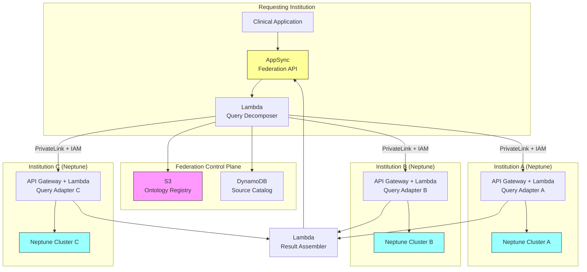

# Recipe 13.10 Architecture and Implementation: Federated Clinical Knowledge Network

*Companion to [Recipe 13.10: Federated Clinical Knowledge Network](chapter13.10-federated-clinical-knowledge-network). This page covers the AWS architecture, services, prerequisites, and pseudocode. For the problem framing and the conceptual approach, start with the main recipe.*

---

## The AWS Implementation

### Why These Services

**Amazon Neptune for local graph databases.** Neptune is AWS's managed graph database service supporting both RDF/SPARQL and property graph (Gremlin/openCypher) models. For a federated network, each participating institution runs their own Neptune cluster. Neptune handles the storage, indexing, and query execution for local graphs. Its support for both graph models means institutions can choose whichever fits their existing data better. Neptune's IAM integration and VPC isolation provide the security boundary each institution needs.

**AWS AppSync for the federation API layer.** AppSync provides a managed GraphQL API that can aggregate data from multiple backend sources. In this architecture, AppSync serves as the client-facing federation API: it receives a federated query, passes it to the orchestration layer, and returns assembled results. GraphQL's type system maps naturally to knowledge graph schemas, and AppSync's built-in authorization (Cognito, IAM, API keys) handles the multi-tenant access control. Note: AppSync has a 30-second request timeout and 1MB response payload limit. For federations with more than 5 sources or complex multi-hop queries, consider placing AWS Step Functions Express Workflows behind AppSync to handle the orchestration (Step Functions Express supports up to 5-minute execution and handles parallel dispatch natively via Parallel and Map states).

**AWS Lambda for query translation and routing.** Lambda functions handle the schema translation between the federated query language and each institution's local graph schema. Each institution registers a Lambda-based adapter that knows how to translate federated queries into their local SPARQL or Gremlin dialect. Lambda's stateless execution model fits perfectly: each query is independent, and the translation logic is pure computation.

**Amazon S3 for the ontology registry.** The shared ontology mappings, concept dictionaries, and schema alignment files live in S3. These are versioned, auditable configuration artifacts. When a new institution joins the federation or updates their local schema, the mapping files in S3 are updated. Lambda functions load these mappings at query time.

**AWS PrivateLink for secure cross-account connectivity.** Federated queries cross institutional boundaries, which in AWS terms means crossing AWS accounts. PrivateLink provides private, encrypted connectivity between VPCs in different accounts without traversing the public internet. Each institution exposes their query adapter behind an API Gateway with IAM authorization. The federation layer assumes a cross-account IAM role (defined per institution in the source catalog) to invoke the institutional API Gateway endpoint. PrivateLink provides network isolation; IAM provides authentication and authorization. Both layers are required.

**AWS KMS for encryption key management.** Each institution manages their own KMS CMK for their Neptune cluster and local data. The federation control plane account owns separate CMKs for the source catalog (DynamoDB) and ontology registry (S3). Cross-account query results are returned as plaintext over the PrivateLink TLS channel; the federation layer does not need decrypt access to institutional KMS keys because Neptune handles decryption internally before returning query results.

**Amazon CloudWatch and AWS CloudTrail for observability and audit.** Every federated query generates audit records: who queried, what they asked, which sources responded, what was returned. CloudTrail captures API-level audit. CloudWatch captures query performance metrics, error rates, and latency distributions across the federation. Note: query content in audit logs is treated as PHI because queries may reveal patient conditions. Audit log access must be restricted to authorized compliance personnel. Consider hashing or tokenizing clinical concept identifiers in audit records while retaining the full query in a separate, access-controlled audit store for compliance investigations.

**AWS Organizations for multi-account governance.** The federation operates across multiple AWS accounts (one per institution). Organizations provides centralized governance: service control policies, consolidated billing, and cross-account IAM role management.

### Architecture Diagram



### Prerequisites

| Requirement | Details |
|-------------|---------|
| **AWS Services** | Amazon Neptune, AWS AppSync, AWS Lambda, Amazon S3, Amazon DynamoDB, AWS PrivateLink, AWS Organizations, Amazon CloudWatch, AWS CloudTrail, AWS KMS, Amazon API Gateway |
| **IAM Permissions** | Federation layer (read-only): `neptune-db:ReadDataViaQuery`, `neptune-db:GetQueryStatus`, `neptune-db:CancelQuery` (scoped to cluster ARN). Write access to Neptune remains with each institution's internal data pipeline roles only. Additional: `appsync:GraphQL`, `lambda:InvokeFunction`, `s3:GetObject`, `dynamodb:GetItem`, `dynamodb:Query` |
| **BAA** | AWS BAA signed for all participating accounts (knowledge derived from PHI requires BAA coverage) |
| **Encryption** | Neptune: encryption at rest (enabled at cluster creation, cannot be added later); S3: SSE-KMS; DynamoDB: encryption at rest; all cross-account traffic over PrivateLink (TLS in transit) |
| **VPC** | Each institution's Neptune in a private subnet. PrivateLink endpoints for cross-account access. No public endpoints. VPC Flow Logs enabled. Gateway VPC endpoints for S3 and DynamoDB in the federation control plane VPC. Interface VPC endpoints for KMS and CloudWatch Logs. No NAT Gateway required for federation Lambda functions. |
| **CloudTrail** | Enabled in all participating accounts. Federated query audit trail must capture: requester identity, query content (treated as PHI), sources contacted, results returned. Audit log access restricted to authorized compliance personnel. |
| **Multi-Account** | AWS Organizations with one account per participating institution. Cross-account IAM roles for federation layer access. |
| **Sample Data** | Public biomedical ontologies (SNOMED CT subset, RxNorm, DrugBank open data) for development. Never use institution-specific clinical knowledge in shared dev environments. |
| **Cost Estimate** | Neptune: ~$0.35/hr per instance (db.r5.large) per institution. Lambda: negligible at query volumes. PrivateLink: $0.01/GB + $0.01/hr per endpoint. Total: ~$2,500-5,000/month per participating node. |

### Ingredients

| AWS Service | Role |
|------------|------|
| **Amazon Neptune** | Local knowledge graph storage and SPARQL/Gremlin query execution at each institution |
| **AWS AppSync** | Client-facing federation API; receives queries and returns assembled results |
| **AWS Lambda** | Query decomposition, schema translation (per-institution adapters), result assembly |
| **Amazon S3** | Ontology registry; stores shared concept mappings and schema alignment files |
| **Amazon DynamoDB** | Source catalog; tracks participating institutions, their capabilities, and sharing policies |
| **AWS PrivateLink** | Secure cross-account connectivity between federation layer and institutional API Gateways |
| **Amazon API Gateway** | IAM-authenticated entry point at each institution, fronting the query adapter Lambda |
| **AWS Organizations** | Multi-account governance and cross-account role management |
| **Amazon CloudWatch** | Query latency metrics, error rates, federation health monitoring |
| **AWS CloudTrail** | Audit trail for all federated queries and access decisions |
| **AWS KMS** | Encryption key management for Neptune, S3, and DynamoDB across accounts |

### Code

#### Walkthrough

**Step 1: Register a source in the federation catalog.** Before an institution can participate in federated queries, it must register itself in the source catalog. This registration declares what types of knowledge the institution holds (drug interactions, treatment protocols, genomic associations), what ontology standards it aligns to, what sharing policies it enforces, and how to reach its query endpoint. Think of this as the institution raising its hand and saying "I have knowledge about these topics, and here's how to ask me about them." Without this step, the federation layer has no idea which sources to contact for a given query. The catalog is the routing table for the entire network.

```
FUNCTION register_source(institution_id, capabilities, endpoint_config, sharing_policy):
    // Build the catalog entry that tells the federation layer everything it needs
    // to route queries to this institution and respect its governance rules.
    catalog_entry = {
        institution_id:   institution_id,          // unique identifier (e.g., "boston-medical-center")
        capabilities:     capabilities,            // list of knowledge domains this source covers
                                                   // e.g., ["drug_interactions", "genomic_associations", "treatment_protocols"]
        ontology_version: "SNOMED-CT-2025-03",     // which version of the shared ontology this source aligns to
        endpoint:         endpoint_config,         // PrivateLink endpoint ARN and connection details
        sharing_policy:   sharing_policy,          // rules governing what can be shared and with whom
                                                   // e.g., { "drug_interactions": "public", "patient_derived": "research_only" }
        registered_at:    current UTC timestamp,
        status:           "active",                // can be set to "suspended" to temporarily disable
        health: {
            consecutive_failures: 0,               // circuit breaker counter
            last_success:         null,            // timestamp of last successful query
            last_failure:         null             // timestamp of last failed query
        }
    }

    // Write to the source catalog (DynamoDB table).
    // The federation layer reads this catalog at query time to determine routing.
    write catalog_entry to DynamoDB table "federation-source-catalog"
        with key = institution_id

    RETURN catalog_entry
```

**Step 2: Load and version ontology mappings.** Each institution models clinical concepts differently. One might represent "Type 2 Diabetes" as a SNOMED code (44054006). Another might use an ICD-10 code (E11). A third might use a local identifier. The ontology mapping layer translates between these representations so that a federated query for "treatments for Type 2 Diabetes" can be understood by every source, regardless of their local coding system. These mappings are stored in S3, versioned, and loaded by the query translation Lambdas. Maintaining these mappings is ongoing work. Every time a source updates their local schema or a new ontology version is released, the mappings need updating. Skip this step and federated queries will miss results because they're asking in the wrong "language" for each source.

```
FUNCTION load_ontology_mapping(source_institution_id, mapping_version):
    // Fetch the mapping file for this institution from the ontology registry in S3.
    // Each institution has its own mapping file that translates between the
    // federated schema (shared vocabulary) and their local schema.
    mapping_key = "ontology-mappings/{source_institution_id}/v{mapping_version}.json"

    mapping_file = read from S3 bucket "federation-ontology-registry" at key mapping_key

    // The mapping file contains bidirectional translations:
    // - federated_to_local: how to translate a federated concept into this source's local representation
    // - local_to_federated: how to translate this source's results back into federated vocabulary
    // Example entry:
    // {
    //   "concept": "type_2_diabetes",
    //   "federated_code": "SNOMED:44054006",
    //   "local_code": "ICD10:E11",
    //   "local_node_type": "Diagnosis",
    //   "local_property": "icd_code"
    // }

    RETURN parsed mapping_file
```

**Step 3: Decompose a federated query.** When a clinician asks a question like "what drug interactions are known for Metformin in patients with renal impairment?", the federation layer needs to figure out which sources might have relevant answers and how to ask each one. This is query decomposition. The decomposer consults the source catalog to identify sources with relevant capabilities, loads the ontology mapping for each source, and rewrites the query into each source's local query language. It then dispatches all sub-queries in parallel with per-source timeouts and circuit breaker protection. This is the heart of the federation engine. Get it wrong and you either miss relevant sources (incomplete results) or flood irrelevant sources with queries they can't answer (wasted latency and cost).

```
FUNCTION decompose_and_route(federated_query, requester_context):
    // Parse the incoming federated query to understand what's being asked.
    // Extract the knowledge domains involved (e.g., "drug_interactions", "renal")
    // and the clinical concepts referenced (e.g., "Metformin", "renal_impairment").
    query_domains  = extract_domains(federated_query)
    query_concepts = extract_concepts(federated_query)

    // Look up which sources have relevant capabilities.
    // A source registered with capability "drug_interactions" is a candidate
    // for a query about drug interactions. Sources without that capability are skipped.
    candidate_sources = query DynamoDB "federation-source-catalog"
        WHERE capabilities OVERLAPS query_domains
        AND status = "active"

    // Circuit breaker check: skip sources that have failed repeatedly.
    // If a source has timed out or errored on 3+ consecutive queries within
    // the last 5 minutes, mark it as "degraded" and skip it until a health
    // check succeeds. This prevents one slow source from dragging down every query.
    healthy_candidates = empty list
    FOR each source in candidate_sources:
        IF source.health.consecutive_failures >= 3
           AND (now - source.health.last_failure) < 5 minutes:
            // Source is in circuit-breaker open state. Skip it.
            log warning "Skipping degraded source: {source.institution_id}"
            CONTINUE
        ELSE:
            append source to healthy_candidates

    // For each healthy candidate, check sharing policy against requester context.
    // The requester_context includes: who is asking, from which institution,
    // for what purpose (clinical care, research, quality improvement).
    authorized_sources = empty list
    FOR each source in healthy_candidates:
        IF evaluate_sharing_policy(source.sharing_policy, requester_context):
            append source to authorized_sources

    // For each authorized source, translate the federated query into the local schema.
    sub_queries = empty list
    FOR each source in authorized_sources:
        mapping = load_ontology_mapping(source.institution_id, source.ontology_version)

        // Rewrite the query using this source's local vocabulary.
        // "Metformin" might be represented as RxNorm:6809 in one source
        // and as a node with property drug_name="metformin" in another.
        local_query = translate_query(federated_query, mapping)

        append to sub_queries: {
            source:      source,
            local_query: local_query,
            endpoint:    source.endpoint,
            timeout:     source.timeout OR default 3 seconds  // per-source timeout
        }

    // Dispatch all sub-queries in parallel. Don't wait for one to finish
    // before sending the next. Network latency is the bottleneck in federation.
    // Per-source timeout: if a source doesn't respond within its configured
    // timeout, mark it as timed_out but don't block the overall response.
    results = empty list
    timed_out = empty list
    FOR each sub_query in sub_queries (IN PARALLEL):
        TRY with timeout = sub_query.timeout:
            response = invoke sub_query.endpoint with sub_query.local_query
            append response to results
            // Reset circuit breaker on success
            update source.health: consecutive_failures = 0, last_success = now
        ON TIMEOUT:
            append sub_query.source.institution_id to timed_out
            // Increment circuit breaker counter
            update source.health: consecutive_failures += 1, last_failure = now
        ON ERROR:
            append sub_query.source.institution_id to timed_out
            update source.health: consecutive_failures += 1, last_failure = now

    RETURN { results: results, timed_out: timed_out }
```

**Step 4: Execute a local query with access control.** Each institution's query adapter receives a translated query from the federation layer, validates the requester's authorization, executes the query against the local Neptune graph, and returns results with provenance metadata attached. This is where institutional governance is enforced. The adapter can filter results based on fine-grained policies: "share drug interaction data with any federation member, but restrict patient-derived treatment outcomes to approved research collaborators only." The adapter also attaches provenance to every result: where it came from, what evidence supports it, and when it was last validated. Skip the access control and you've built a data breach. Skip the provenance and clinicians can't assess the trustworthiness of results.

```
FUNCTION execute_local_query(translated_query, requester_context, local_neptune_endpoint):
    // Validate that the requester is authorized for this specific query.
    // This is a second check (the federation layer already checked sharing policy),
    // but defense in depth matters when PHI-derived knowledge is involved.
    IF NOT validate_authorization(requester_context, translated_query):
        RETURN { status: "denied", reason: "insufficient_authorization" }

    // Execute the translated query against the local Neptune cluster.
    // This is a standard SPARQL or Gremlin query at this point.
    raw_results = execute query translated_query against local_neptune_endpoint

    // Attach provenance metadata to each result.
    // Clinicians need to know: where did this knowledge come from?
    // What's the evidence basis? How current is it?
    enriched_results = empty list
    FOR each result in raw_results:
        append to enriched_results: {
            data:       result,
            provenance: {
                source_institution: local_institution_id,
                evidence_level:     result.evidence_level OR "ungraded",
                last_validated:     result.last_validated OR "unknown",
                derivation_method:  result.derivation_method OR "curated"
                                    // "curated" = human-reviewed
                                    // "nlp_extracted" = machine-extracted from literature
                                    // "claims_derived" = inferred from claims data
            }
        }

    // Apply result-level filtering based on sharing policy.
    // Some results might be shareable while others from the same query are restricted.
    filtered_results = apply_result_level_policy(enriched_results, requester_context)

    RETURN filtered_results
```

**Step 5: Assemble and deduplicate federated results.** Results stream back from multiple sources. The assembler's job is to merge them into a coherent, deduplicated response. This is harder than it sounds. Two sources might report the same drug interaction with different severity ratings. Three sources might report the same treatment with different evidence levels. The assembler needs strategies for conflict resolution: highest evidence level wins? Most recent validation date wins? Majority vote? The right strategy depends on the use case. For clinical decision support, you probably want to surface all perspectives with their provenance rather than silently picking a winner. For automated alerting, you need a deterministic resolution. This step also handles ranking: results with stronger evidence and more recent validation appear first.

```
FUNCTION assemble_results(partial_results_from_all_sources):
    // Flatten all results into a single list with their provenance intact.
    all_results = empty list
    FOR each source_response in partial_results_from_all_sources:
        FOR each result in source_response:
            append result to all_results

    // Deduplicate: identify results that refer to the same underlying knowledge.
    // Two sources might both report "Metformin interacts with Contrast Dye"
    // but with different severity ratings or evidence levels.
    // Group by canonical concept (using the federated ontology codes).
    grouped = group all_results by canonical_concept_key(result.data)

    // For each group of duplicates, merge into a single federated result.
    merged_results = empty list
    FOR each concept_key, group in grouped:
        IF length(group) == 1:
            // Only one source reported this. Use it directly.
            append group[0] to merged_results
        ELSE:
            // Multiple sources reported this. Merge with conflict resolution.
            merged = {
                data:        consensus_or_highest_evidence(group),
                provenance:  collect all provenance records from group,
                consensus:   calculate_agreement_score(group),
                             // 1.0 = all sources agree; 0.5 = split opinion
                source_count: length(group)
            }
            append merged to merged_results

    // Rank results: higher evidence level and more sources = higher rank.
    sort merged_results by (evidence_level DESC, source_count DESC, last_validated DESC)

    RETURN merged_results
```

> **Curious how this looks in Python?** The pseudocode above covers the concepts. If you'd like to see sample Python code that demonstrates these patterns using boto3, check out the [Python Example](chapter13.10-python-example). It walks through each step with inline comments and notes on what you'd need to change for a real deployment.

### Expected Results

**Sample output for a federated drug interaction query:**

```json
{
  "query": "drug_interactions(Metformin, context=renal_impairment)",
  "federation_metadata": {
    "sources_contacted": 4,
    "sources_responded": 3,
    "sources_denied": 0,
    "sources_timed_out": 1,
    "total_latency_ms": 2340
  },
  "results": [
    {
      "interaction": {
        "drug_a": "Metformin (RxNorm:6809)",
        "drug_b": "Iodinated Contrast Media",
        "severity": "high",
        "mechanism": "Increased risk of lactic acidosis in renal impairment",
        "recommendation": "Hold metformin 48h before and after contrast administration"
      },
      "provenance": [
        {
          "source": "academic-medical-center-boston",
          "evidence_level": "A",
          "derivation": "curated",
          "last_validated": "2025-11-15"
        },
        {
          "source": "regional-health-network-midwest",
          "evidence_level": "B",
          "derivation": "claims_derived",
          "last_validated": "2025-09-22"
        }
      ],
      "consensus_score": 1.0,
      "source_count": 2
    },
    {
      "interaction": {
        "drug_a": "Metformin (RxNorm:6809)",
        "drug_b": "ACE Inhibitors (class)",
        "severity": "moderate",
        "mechanism": "Potential additive effect on renal function decline",
        "recommendation": "Monitor renal function quarterly when co-prescribed"
      },
      "provenance": [
        {
          "source": "academic-medical-center-boston",
          "evidence_level": "B",
          "derivation": "nlp_extracted",
          "last_validated": "2025-08-03"
        }
      ],
      "consensus_score": null,
      "source_count": 1
    }
  ]
}
```

**Performance benchmarks:**

| Metric | Typical Value |
|--------|---------------|
| End-to-end federated query latency | 1.5–5 seconds (depends on source count and network) |
| Local Neptune query execution | 50–200ms |
| Cross-account PrivateLink overhead | 5–15ms per hop |
| Query translation (Lambda) | 100–300ms |
| Result assembly | 200–500ms |
| Source catalog lookup | 10–30ms |
| Concurrent source queries | Up to 10 in parallel |
| Ontology mapping load (cached) | <5ms |

**Where it struggles:**

- Queries that require multi-hop traversals across institutional boundaries (A knows about B, B knows about C, but no single source knows A-to-C)
- Real-time clinical decision support (5-second latency is too slow for point-of-care alerts)
- Sources with stale ontology mappings (concept drift causes missed results)
- High-cardinality result sets that overwhelm the assembly step
- Institutions with intermittent connectivity (the "timed out" source problem)

---

## Why This Isn't Production-Ready

**Governance framework.** The pseudocode shows the technical mechanics of federation. In reality, you need a legal framework: data use agreements between every pair of institutions, a governance board that adjudicates disputes, and a process for onboarding and offboarding participants. The technology is the easy part. The governance takes 12-18 months to establish.

**Ontology maintenance.** The mapping files in S3 are shown as static artifacts. In production, ontologies evolve. SNOMED releases updates quarterly. Local schemas change as institutions adopt new systems. You need a continuous alignment process with automated drift detection and human review of mapping changes.

**Query privacy.** The current architecture sends queries in cleartext to source institutions. A sophisticated source could infer information about the requester's patient population from query patterns. Production systems need query obfuscation or differential privacy mechanisms to prevent inference attacks.

**Conflict resolution governance.** When two sources disagree on a drug interaction severity, who decides which is correct? The pseudocode shows a "highest evidence wins" heuristic, but real clinical governance requires human review of conflicts, especially for safety-critical knowledge.

**Network partition handling.** If a source is unreachable, the federation returns partial results. The consumer application needs to clearly communicate that results are incomplete and which sources were unavailable. Silent partial results are dangerous in clinical contexts.

**Single-region deployment.** The federation control plane (source catalog, ontology registry, API layer) runs in one AWS region. A regional outage disables the entire federation. Production deployments should consider DynamoDB Global Tables for the source catalog, S3 Cross-Region Replication for the ontology registry, and a multi-region API layer with Route 53 failover.

---

## Variations and Extensions

**Federated learning integration.** Instead of sharing knowledge graph query results, share model updates. Each institution trains a local model on their graph and shares gradient updates rather than raw data. This is particularly useful for patient-derived knowledge where even aggregated results might be sensitive. The federation layer becomes a model aggregation service rather than a query router.

**Temporal knowledge federation.** Add time-awareness to the federation. Track when knowledge was valid, when it was superseded, and query for "what was known as of date X." This matters for retrospective research and for understanding how clinical knowledge evolved. Each source maintains temporal versioning of their graph, and the federation layer can query historical states.

**Automated ontology alignment.** Instead of manually maintaining mapping files, use ML-based ontology matching. Train a model to identify equivalent concepts across different terminologies based on their graph neighborhoods, textual descriptions, and usage patterns. This doesn't eliminate human review but dramatically reduces the manual effort of maintaining mappings as ontologies evolve.

---

## Additional Resources

**AWS Documentation:**
- [Amazon Neptune User Guide](https://docs.aws.amazon.com/neptune/latest/userguide/intro.html)
- [Amazon Neptune SPARQL Support](https://docs.aws.amazon.com/neptune/latest/userguide/sparql.html)
- [AWS AppSync Developer Guide](https://docs.aws.amazon.com/appsync/latest/devguide/what-is-appsync.html)
- [AWS PrivateLink Documentation](https://docs.aws.amazon.com/vpc/latest/privatelink/what-is-privatelink.html)
- [AWS Organizations User Guide](https://docs.aws.amazon.com/organizations/latest/userguide/orgs_introduction.html)
- [Amazon Neptune Pricing](https://aws.amazon.com/neptune/pricing/)
- [AWS HIPAA Eligible Services](https://aws.amazon.com/compliance/hipaa-eligible-services-reference/)

<!-- TODO (TechWriter): Expert review V1 (LOW). Resolve AWS Sample Repos and AWS Solutions/Blogs subsections: find real Neptune healthcare knowledge graph repos or remove these subsections entirely. -->

**External Standards:**
- [SPARQL 1.1 Federated Query (W3C)](https://www.w3.org/TR/sparql11-federated-query/)
- [SNOMED CT Browser](https://browser.ihtsdotools.org/)
- [HL7 FHIR Knowledge Artifact Specification](https://www.hl7.org/fhir/clinicalreasoning-knowledge-artifact-representation.html)
- [TEFCA Overview (ONC)](https://www.healthit.gov/topic/interoperability/policy/trusted-exchange-framework-and-common-agreement-tefca)

---

## Estimated Implementation Time

| Tier | Timeline | What You Get |
|------|----------|--------------|
| **Basic (single use case, 2-3 institutions)** | 6-9 months | Drug interaction federation between partner institutions. Manual ontology alignment. Basic access control. |
| **Production-ready** | 12-18 months | Multi-domain federation with automated ontology maintenance, comprehensive governance framework, provenance tracking, and performance optimization (caching layer). |
| **With variations (federated learning, temporal queries)** | 18-24+ months | Full network with ML-based ontology alignment, federated learning for patient-derived insights, temporal versioning, and automated conflict resolution. |

---


---

*← [Main Recipe 13.10](chapter13.10-federated-clinical-knowledge-network) · [Python Example](chapter13.10-python-example) · [Chapter Preface](chapter13-preface)*
