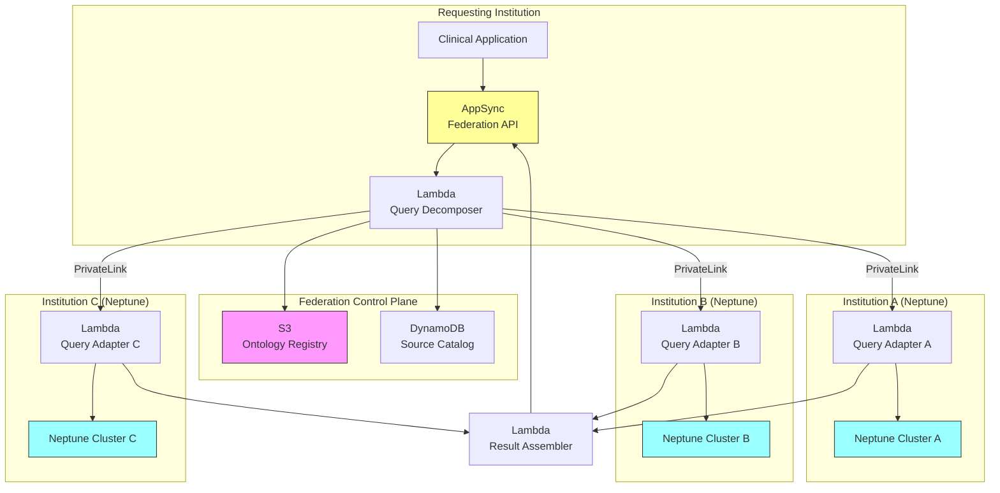

# Recipe 13.10: Federated Clinical Knowledge Network

**Complexity:** Complex · **Phase:** Research/Pilot · **Estimated Cost:** ~$8,000–15,000/month (multi-node federation)

---

## The Problem

Here's a scenario that plays out every day in healthcare: a patient with a rare autoimmune condition moves from a research hospital in Boston to a community health system in rural Tennessee. The Boston hospital has a rich knowledge graph connecting that patient's condition to experimental treatments, genetic markers, and clinical trial outcomes. The Tennessee system has never seen this condition. Their local knowledge base has nothing useful.

Now multiply that by every rare disease, every novel drug interaction, every emerging treatment protocol. Each health system builds its own clinical knowledge in isolation. Academic medical centers accumulate deep expertise in their research specialties. Community hospitals develop practical knowledge about managing chronic conditions in underserved populations. Payers build claims-derived insights about treatment effectiveness at scale. None of this knowledge flows between organizations.

The result is a healthcare system where the collective clinical intelligence is fragmented across thousands of institutional silos. A researcher at one institution discovers that a particular drug combination shows promise for treatment-resistant depression. That knowledge lives in their local graph. Meanwhile, three other institutions have patients who could benefit, but they'll never know unless someone happens to publish a paper and someone else happens to read it. That cycle takes years.

The obvious solution is "just put everything in one big graph." But that's a non-starter. Patient data is governed by HIPAA. Institutional knowledge represents competitive advantage. Research data has IP implications. No hospital is going to dump their clinical knowledge into a shared database controlled by someone else. The governance, legal, and competitive barriers are real and legitimate.

What you actually need is a way to query across distributed knowledge graphs without centralizing the data. Each institution keeps control of their own graph, their own governance policies, their own access rules. But when a clinician at Institution A asks "what do we know about treatment options for condition X?", the system can reach across institutional boundaries and bring back relevant knowledge from Institutions B, C, and D, filtered through each institution's sharing policies.

This is federated knowledge graph querying. It's architecturally hard, politically harder, and genuinely important.

---

## The Technology: Federated Knowledge Graphs

### Knowledge Graphs: Quick Refresher

A knowledge graph represents information as entities (nodes) connected by relationships (edges). In healthcare, entities might be diseases, drugs, genes, procedures, or clinical concepts. Relationships encode things like "treats," "causes," "interacts_with," or "is_subtype_of." The power of a graph representation is that you can traverse relationships to discover non-obvious connections: Drug A treats Disease B, which shares a genetic pathway with Disease C, which responds to Drug D. That traversal is a query.

Most clinical knowledge graphs use RDF (Resource Description Framework) or property graph models. RDF represents everything as subject-predicate-object triples: `(Metformin, treats, Type2Diabetes)`. Property graphs allow richer attributes on both nodes and edges. Both work for federation, but the query languages differ: SPARQL for RDF, Cypher or Gremlin for property graphs.

### What Makes Federation Different from Replication

Replication means copying data from multiple sources into one central store. You get a single unified graph, but you lose governance control. The source institutions can't revoke access to specific knowledge after it's been copied. They can't enforce fine-grained sharing policies. And the central store becomes a single point of failure and a massive compliance liability.

Federation means the data stays where it is. Queries are decomposed and routed to the relevant source graphs, executed locally, and results are assembled back at the requesting node. Each source graph applies its own access control before returning results. No data moves permanently. The federation layer is a query router, not a data store.

This distinction matters enormously in healthcare. A federated architecture lets Institution A share drug interaction knowledge broadly while keeping patient-derived insights restricted to approved research collaborators. That granularity is impossible with replication.

### The Query Federation Problem

Federated querying sounds simple until you try to build it. Here's what makes it hard:

**Schema heterogeneity.** Each institution models their knowledge differently. One uses SNOMED codes for diseases. Another uses ICD-10. One represents drug interactions as edges between drug nodes. Another represents them as intermediate "interaction" nodes with severity properties. Before you can query across graphs, you need a shared understanding of what the entities and relationships mean. This is the ontology alignment problem, and it's genuinely unsolved in the general case.

**Query decomposition.** A federated query like "find all known treatments for condition X with evidence level A or B" needs to be broken into sub-queries that each source graph can answer. The federation layer needs to know which graphs might have relevant data (query routing), how to translate the query into each graph's local schema (query rewriting), and how to combine partial results (result merging). Each of these is a research problem in its own right.

**Performance.** A local graph query returns in milliseconds. A federated query that touches five remote graphs, each with network latency, authentication overhead, and local query execution time, might take seconds. For interactive clinical decision support, that's too slow. Caching, pre-computation, and intelligent query planning become essential.

**Trust and provenance.** When results come back from multiple sources, the clinician needs to know where each piece of knowledge originated, what evidence supports it, and how current it is. A drug interaction flagged by an academic research graph based on a 2024 clinical trial carries different weight than one flagged by a payer's claims analysis. Provenance metadata must travel with the results.

**Privacy-preserving queries.** Some queries might inadvertently reveal information about the querying institution's patients. If Institution A asks "what treatments exist for [extremely rare condition]?", that query itself reveals that they have a patient with that condition. Differential privacy techniques and query obfuscation can help, but they add complexity and reduce result quality.

### Emerging Standards

The healthcare industry is slowly converging on standards that make federation more tractable:

**FHIR (Fast Healthcare Interoperability Resources)** provides a common data model for clinical concepts. While FHIR is primarily designed for patient data exchange, its resource types and terminology bindings provide a shared vocabulary that knowledge graphs can align to.

**Clinical ontologies** (SNOMED CT, RxNorm, LOINC, ICD) provide canonical identifiers for clinical concepts. If every participating graph maps their local concepts to SNOMED codes, you have a shared key space for federation, even if local schemas differ.

**W3C standards for linked data** (RDF, SPARQL, SPARQL Federation extensions) provide a technical foundation for distributed graph querying. The SPARQL 1.1 Federated Query extension (`SERVICE` keyword) allows a query to explicitly delegate sub-patterns to remote endpoints.

**TEFCA (Trusted Exchange Framework and Common Agreement)** establishes governance principles for health information exchange in the US. While focused on patient data, its trust framework concepts (qualified health information networks, data use agreements) apply to knowledge federation as well.

None of these fully solve the problem. But they provide building blocks that make federation architecturally feasible rather than purely theoretical.

### The General Architecture Pattern

A federated clinical knowledge network has these logical components:

```
[Local Knowledge Graphs] → [Federation Layer] → [Query Router] → [Result Assembler] → [Consumer Applications]
         ↑                        ↑                    ↑
    [Ontology Alignment]    [Access Control]    [Provenance Tracking]
```

**Local Knowledge Graphs.** Each participating institution maintains their own graph database with their own schema, their own data governance, and their own access policies. These are the source of truth. They expose a query endpoint (SPARQL endpoint, GraphQL API, or custom protocol) that the federation layer can call.

**Ontology Alignment Layer.** A shared mapping between local schemas and a common federated schema. This doesn't require every institution to change their local model. It requires a translation layer that can convert between local representations and the federated query language. Think of it as a Rosetta Stone for clinical knowledge models.

**Federation Layer.** The orchestrator. It receives a query in the federated schema, determines which source graphs might have relevant data (catalog lookup), rewrites the query into each source's local schema (query translation), dispatches sub-queries in parallel, and assembles results.

**Access Control.** Each source graph enforces its own sharing policies. The federation layer passes authentication context (who is asking, from which institution, for what purpose) to each source. Sources return only what the requester is authorized to see. This is attribute-based access control (ABAC) at the knowledge level.

**Provenance Tracking.** Every result carries metadata: which source provided it, what evidence supports it, when it was last updated, and what confidence level the source assigns. This lets consumers make informed decisions about which knowledge to trust.

**Result Assembly.** Partial results from multiple sources are merged, deduplicated, ranked, and presented as a unified response. Deduplication is non-trivial: two sources might report the same drug interaction with different severity ratings. The assembler needs conflict resolution strategies.

---

## The AWS Implementation

### Why These Services

**Amazon Neptune for local graph databases.** Neptune is AWS's managed graph database service supporting both RDF/SPARQL and property graph (Gremlin/openCypher) models. For a federated network, each participating institution runs their own Neptune cluster. Neptune handles the storage, indexing, and query execution for local graphs. Its support for both graph models means institutions can choose whichever fits their existing data better. Neptune's IAM integration and VPC isolation provide the security boundary each institution needs.

**AWS AppSync for the federation API layer.** AppSync provides a managed GraphQL API that can aggregate data from multiple backend sources. In this architecture, AppSync serves as the federation query router: it receives a federated query, decomposes it, dispatches sub-queries to multiple Neptune endpoints (via Lambda resolvers), and assembles the results. GraphQL's type system maps naturally to knowledge graph schemas, and AppSync's built-in authorization (Cognito, IAM, API keys) handles the multi-tenant access control.

**AWS Lambda for query translation and routing.** Lambda functions handle the schema translation between the federated query language and each institution's local graph schema. Each institution registers a Lambda-based adapter that knows how to translate federated queries into their local SPARQL or Gremlin dialect. Lambda's stateless execution model fits perfectly: each query is independent, and the translation logic is pure computation.

**Amazon S3 for the ontology registry.** The shared ontology mappings, concept dictionaries, and schema alignment files live in S3. These are versioned, auditable configuration artifacts. When a new institution joins the federation or updates their local schema, the mapping files in S3 are updated. Lambda functions load these mappings at query time.

**AWS PrivateLink for secure cross-account connectivity.** Federated queries cross institutional boundaries, which in AWS terms means crossing AWS accounts. PrivateLink provides private, encrypted connectivity between VPCs in different accounts without traversing the public internet. Each institution exposes their Neptune query endpoint via PrivateLink, and the federation layer connects to it privately.

**Amazon CloudWatch and AWS CloudTrail for observability and audit.** Every federated query generates audit records: who queried, what they asked, which sources responded, what was returned. CloudTrail captures API-level audit. CloudWatch captures query performance metrics, error rates, and latency distributions across the federation.

**AWS Organizations for multi-account governance.** The federation operates across multiple AWS accounts (one per institution). Organizations provides centralized governance: service control policies, consolidated billing, and cross-account IAM role management.

### Architecture Diagram



### Prerequisites

| Requirement | Details |
|-------------|---------|
| **AWS Services** | Amazon Neptune, AWS AppSync, AWS Lambda, Amazon S3, Amazon DynamoDB, AWS PrivateLink, AWS Organizations, Amazon CloudWatch, AWS CloudTrail |
| **IAM Permissions** | `neptune-db:*` (scoped to cluster), `appsync:GraphQL`, `lambda:InvokeFunction`, `s3:GetObject`, `dynamodb:GetItem`, `dynamodb:Query` |
| **BAA** | AWS BAA signed for all participating accounts (knowledge derived from PHI requires BAA coverage) |
| **Encryption** | Neptune: encryption at rest (enabled at cluster creation, cannot be added later); S3: SSE-KMS; DynamoDB: encryption at rest; all cross-account traffic over PrivateLink (TLS in transit) |
| **VPC** | Each institution's Neptune in a private subnet. PrivateLink endpoints for cross-account access. No public endpoints. VPC Flow Logs enabled. |
| **CloudTrail** | Enabled in all participating accounts. Federated query audit trail must capture: requester identity, query content, sources contacted, results returned. |
| **Multi-Account** | AWS Organizations with one account per participating institution. Cross-account IAM roles for federation layer access. |
| **Sample Data** | Public biomedical ontologies (SNOMED CT subset, RxNorm, DrugBank open data) for development. Never use institution-specific clinical knowledge in shared dev environments. |
| **Cost Estimate** | Neptune: ~$0.35/hr per instance (db.r5.large) per institution. Lambda: negligible at query volumes. PrivateLink: $0.01/GB + $0.01/hr per endpoint. Total: ~$2,500-5,000/month per participating node. |

### Ingredients

| AWS Service | Role |
|------------|------|
| **Amazon Neptune** | Local knowledge graph storage and SPARQL/Gremlin query execution at each institution |
| **AWS AppSync** | Federation API layer; receives queries, orchestrates decomposition and assembly |
| **AWS Lambda** | Query decomposition, schema translation (per-institution adapters), result assembly |
| **Amazon S3** | Ontology registry; stores shared concept mappings and schema alignment files |
| **Amazon DynamoDB** | Source catalog; tracks participating institutions, their capabilities, and sharing policies |
| **AWS PrivateLink** | Secure cross-account connectivity between federation layer and institutional Neptune clusters |
| **AWS Organizations** | Multi-account governance and cross-account role management |
| **Amazon CloudWatch** | Query latency metrics, error rates, federation health monitoring |
| **AWS CloudTrail** | Audit trail for all federated queries and access decisions |
| **AWS KMS** | Encryption key management for Neptune, S3, and DynamoDB across accounts |

### Code

#### Walkthrough

**Step 1: Register a source in the federation catalog.** Before an institution can participate in federated queries, it must register itself in the source catalog. This registration declares what types of knowledge the institution holds (drug interactions, treatment protocols, genomic associations), what ontology standards it aligns to, what sharing policies it enforces, and how to reach its query endpoint. Think of this as the institution raising its hand and saying "I have knowledge about these topics, and here's how to ask me about them." Without this step, the federation layer has no idea which sources to contact for a given query. The catalog is the routing table for the entire network.

```
FUNCTION register_source(institution_id, capabilities, endpoint_config, sharing_policy):
    // Build the catalog entry that tells the federation layer everything it needs
    // to route queries to this institution and respect its governance rules.
    catalog_entry = {
        institution_id:   institution_id,          // unique identifier (e.g., "boston-medical-center")
        capabilities:     capabilities,            // list of knowledge domains this source covers
                                                   // e.g., ["drug_interactions", "genomic_associations", "treatment_protocols"]
        ontology_version: "SNOMED-CT-2025-03",     // which version of the shared ontology this source aligns to
        endpoint:         endpoint_config,         // PrivateLink endpoint ARN and connection details
        sharing_policy:   sharing_policy,          // rules governing what can be shared and with whom
                                                   // e.g., { "drug_interactions": "public", "patient_derived": "research_only" }
        registered_at:    current UTC timestamp,
        status:           "active"                 // can be set to "suspended" to temporarily disable
    }

    // Write to the source catalog (DynamoDB table).
    // The federation layer reads this catalog at query time to determine routing.
    write catalog_entry to DynamoDB table "federation-source-catalog"
        with key = institution_id

    RETURN catalog_entry
```

**Step 2: Load and version ontology mappings.** Each institution models clinical concepts differently. One might represent "Type 2 Diabetes" as a SNOMED code (44054006). Another might use an ICD-10 code (E11). A third might use a local identifier. The ontology mapping layer translates between these representations so that a federated query for "treatments for Type 2 Diabetes" can be understood by every source, regardless of their local coding system. These mappings are stored in S3, versioned, and loaded by the query translation Lambdas. Maintaining these mappings is ongoing work. Every time a source updates their local schema or a new ontology version is released, the mappings need updating. Skip this step and federated queries will miss results because they're asking in the wrong "language" for each source.

```
FUNCTION load_ontology_mapping(source_institution_id, mapping_version):
    // Fetch the mapping file for this institution from the ontology registry in S3.
    // Each institution has its own mapping file that translates between the
    // federated schema (shared vocabulary) and their local schema.
    mapping_key = "ontology-mappings/{source_institution_id}/v{mapping_version}.json"

    mapping_file = read from S3 bucket "federation-ontology-registry" at key mapping_key

    // The mapping file contains bidirectional translations:
    // - federated_to_local: how to translate a federated concept into this source's local representation
    // - local_to_federated: how to translate this source's results back into federated vocabulary
    // Example entry:
    // {
    //   "concept": "type_2_diabetes",
    //   "federated_code": "SNOMED:44054006",
    //   "local_code": "ICD10:E11",
    //   "local_node_type": "Diagnosis",
    //   "local_property": "icd_code"
    // }

    RETURN parsed mapping_file
```

**Step 3: Decompose a federated query.** When a clinician asks a question like "what drug interactions are known for Metformin in patients with renal impairment?", the federation layer needs to figure out which sources might have relevant answers and how to ask each one. This is query decomposition. The decomposer consults the source catalog to identify sources with relevant capabilities, loads the ontology mapping for each source, and rewrites the query into each source's local query language. It then dispatches all sub-queries in parallel. This is the heart of the federation engine. Get it wrong and you either miss relevant sources (incomplete results) or flood irrelevant sources with queries they can't answer (wasted latency and cost).

```
FUNCTION decompose_and_route(federated_query, requester_context):
    // Parse the incoming federated query to understand what's being asked.
    // Extract the knowledge domains involved (e.g., "drug_interactions", "renal")
    // and the clinical concepts referenced (e.g., "Metformin", "renal_impairment").
    query_domains  = extract_domains(federated_query)
    query_concepts = extract_concepts(federated_query)

    // Look up which sources have relevant capabilities.
    // A source registered with capability "drug_interactions" is a candidate
    // for a query about drug interactions. Sources without that capability are skipped.
    candidate_sources = query DynamoDB "federation-source-catalog"
        WHERE capabilities OVERLAPS query_domains
        AND status = "active"

    // For each candidate source, check sharing policy against requester context.
    // The requester_context includes: who is asking, from which institution,
    // for what purpose (clinical care, research, quality improvement).
    authorized_sources = empty list
    FOR each source in candidate_sources:
        IF evaluate_sharing_policy(source.sharing_policy, requester_context):
            append source to authorized_sources

    // For each authorized source, translate the federated query into the local schema.
    sub_queries = empty list
    FOR each source in authorized_sources:
        mapping = load_ontology_mapping(source.institution_id, source.ontology_version)

        // Rewrite the query using this source's local vocabulary.
        // "Metformin" might be represented as RxNorm:6809 in one source
        // and as a node with property drug_name="metformin" in another.
        local_query = translate_query(federated_query, mapping)

        append to sub_queries: {
            source:      source,
            local_query: local_query,
            endpoint:    source.endpoint
        }

    // Dispatch all sub-queries in parallel. Don't wait for one to finish
    // before sending the next. Network latency is the bottleneck in federation.
    results = execute_all_in_parallel(sub_queries)

    RETURN results
```

**Step 4: Execute a local query with access control.** Each institution's query adapter receives a translated query from the federation layer, validates the requester's authorization, executes the query against the local Neptune graph, and returns results with provenance metadata attached. This is where institutional governance is enforced. The adapter can filter results based on fine-grained policies: "share drug interaction data with any federation member, but restrict patient-derived treatment outcomes to approved research collaborators only." The adapter also attaches provenance to every result: where it came from, what evidence supports it, and when it was last validated. Skip the access control and you've built a data breach. Skip the provenance and clinicians can't assess the trustworthiness of results.

```
FUNCTION execute_local_query(translated_query, requester_context, local_neptune_endpoint):
    // Validate that the requester is authorized for this specific query.
    // This is a second check (the federation layer already checked sharing policy),
    // but defense in depth matters when PHI-derived knowledge is involved.
    IF NOT validate_authorization(requester_context, translated_query):
        RETURN { status: "denied", reason: "insufficient_authorization" }

    // Execute the translated query against the local Neptune cluster.
    // This is a standard SPARQL or Gremlin query at this point.
    raw_results = execute query translated_query against local_neptune_endpoint

    // Attach provenance metadata to each result.
    // Clinicians need to know: where did this knowledge come from?
    // What's the evidence basis? How current is it?
    enriched_results = empty list
    FOR each result in raw_results:
        append to enriched_results: {
            data:       result,
            provenance: {
                source_institution: local_institution_id,
                evidence_level:     result.evidence_level OR "ungraded",
                last_validated:     result.last_validated OR "unknown",
                derivation_method:  result.derivation_method OR "curated"
                                    // "curated" = human-reviewed
                                    // "nlp_extracted" = machine-extracted from literature
                                    // "claims_derived" = inferred from claims data
            }
        }

    // Apply result-level filtering based on sharing policy.
    // Some results might be shareable while others from the same query are restricted.
    filtered_results = apply_result_level_policy(enriched_results, requester_context)

    RETURN filtered_results
```

**Step 5: Assemble and deduplicate federated results.** Results stream back from multiple sources. The assembler's job is to merge them into a coherent, deduplicated response. This is harder than it sounds. Two sources might report the same drug interaction with different severity ratings. Three sources might report the same treatment with different evidence levels. The assembler needs strategies for conflict resolution: highest evidence level wins? Most recent validation date wins? Majority vote? The right strategy depends on the use case. For clinical decision support, you probably want to surface all perspectives with their provenance rather than silently picking a winner. For automated alerting, you need a deterministic resolution. This step also handles ranking: results with stronger evidence and more recent validation appear first.

```
FUNCTION assemble_results(partial_results_from_all_sources):
    // Flatten all results into a single list with their provenance intact.
    all_results = empty list
    FOR each source_response in partial_results_from_all_sources:
        FOR each result in source_response:
            append result to all_results

    // Deduplicate: identify results that refer to the same underlying knowledge.
    // Two sources might both report "Metformin interacts with Contrast Dye"
    // but with different severity ratings or evidence levels.
    // Group by canonical concept (using the federated ontology codes).
    grouped = group all_results by canonical_concept_key(result.data)

    // For each group of duplicates, merge into a single federated result.
    merged_results = empty list
    FOR each concept_key, group in grouped:
        IF length(group) == 1:
            // Only one source reported this. Use it directly.
            append group[0] to merged_results
        ELSE:
            // Multiple sources reported this. Merge with conflict resolution.
            merged = {
                data:        consensus_or_highest_evidence(group),
                provenance:  collect all provenance records from group,
                consensus:   calculate_agreement_score(group),
                             // 1.0 = all sources agree; 0.5 = split opinion
                source_count: length(group)
            }
            append merged to merged_results

    // Rank results: higher evidence level and more sources = higher rank.
    sort merged_results by (evidence_level DESC, source_count DESC, last_validated DESC)

    RETURN merged_results
```

> **Curious how this looks in Python?** The pseudocode above covers the concepts. If you'd like to see sample Python code that demonstrates these patterns using boto3, check out the [Python Example](chapter13.10-python-example). It walks through each step with inline comments and notes on what you'd need to change for a real deployment.

### Expected Results

**Sample output for a federated drug interaction query:**

```json
{
  "query": "drug_interactions(Metformin, context=renal_impairment)",
  "federation_metadata": {
    "sources_contacted": 4,
    "sources_responded": 3,
    "sources_denied": 0,
    "sources_timed_out": 1,
    "total_latency_ms": 2340
  },
  "results": [
    {
      "interaction": {
        "drug_a": "Metformin (RxNorm:6809)",
        "drug_b": "Iodinated Contrast Media",
        "severity": "high",
        "mechanism": "Increased risk of lactic acidosis in renal impairment",
        "recommendation": "Hold metformin 48h before and after contrast administration"
      },
      "provenance": [
        {
          "source": "academic-medical-center-boston",
          "evidence_level": "A",
          "derivation": "curated",
          "last_validated": "2025-11-15"
        },
        {
          "source": "regional-health-network-midwest",
          "evidence_level": "B",
          "derivation": "claims_derived",
          "last_validated": "2025-09-22"
        }
      ],
      "consensus_score": 1.0,
      "source_count": 2
    },
    {
      "interaction": {
        "drug_a": "Metformin (RxNorm:6809)",
        "drug_b": "ACE Inhibitors (class)",
        "severity": "moderate",
        "mechanism": "Potential additive effect on renal function decline",
        "recommendation": "Monitor renal function quarterly when co-prescribed"
      },
      "provenance": [
        {
          "source": "academic-medical-center-boston",
          "evidence_level": "B",
          "derivation": "nlp_extracted",
          "last_validated": "2025-08-03"
        }
      ],
      "consensus_score": null,
      "source_count": 1
    }
  ]
}
```

**Performance benchmarks:**

| Metric | Typical Value |
|--------|---------------|
| End-to-end federated query latency | 1.5–5 seconds (depends on source count and network) |
| Local Neptune query execution | 50–200ms |
| Cross-account PrivateLink overhead | 5–15ms per hop |
| Query translation (Lambda) | 100–300ms |
| Result assembly | 200–500ms |
| Source catalog lookup | 10–30ms |
| Concurrent source queries | Up to 10 in parallel |
| Ontology mapping load (cached) | <5ms |

**Where it struggles:**

- Queries that require multi-hop traversals across institutional boundaries (A knows about B, B knows about C, but no single source knows A-to-C)
- Real-time clinical decision support (5-second latency is too slow for point-of-care alerts)
- Sources with stale ontology mappings (concept drift causes missed results)
- High-cardinality result sets that overwhelm the assembly step
- Institutions with intermittent connectivity (the "timed out" source problem)

---

## Why This Isn't Production-Ready

**Governance framework.** The pseudocode shows the technical mechanics of federation. In reality, you need a legal framework: data use agreements between every pair of institutions, a governance board that adjudicates disputes, and a process for onboarding and offboarding participants. The technology is the easy part. The governance takes 12-18 months to establish.

**Ontology maintenance.** The mapping files in S3 are shown as static artifacts. In production, ontologies evolve. SNOMED releases updates quarterly. Local schemas change as institutions adopt new systems. You need a continuous alignment process with automated drift detection and human review of mapping changes.

**Query privacy.** The current architecture sends queries in cleartext to source institutions. A sophisticated source could infer information about the requester's patient population from query patterns. Production systems need query obfuscation or differential privacy mechanisms to prevent inference attacks.

**Conflict resolution governance.** When two sources disagree on a drug interaction severity, who decides which is correct? The pseudocode shows a "highest evidence wins" heuristic, but real clinical governance requires human review of conflicts, especially for safety-critical knowledge.

**Network partition handling.** If a source is unreachable, the federation returns partial results. The consumer application needs to clearly communicate that results are incomplete and which sources were unavailable. Silent partial results are dangerous in clinical contexts.

---

## The Honest Take

Federated knowledge graphs are one of those ideas that everyone in health IT agrees is important and almost nobody has successfully deployed at scale. The technical challenges are real but solvable. The governance challenges are where projects go to die.

The thing that surprised me most: ontology alignment is not a one-time project. It's a continuous process. Clinical vocabularies evolve. Institutions change their data models. New concepts emerge (think about how quickly COVID-related terminology appeared and stabilized). If you treat the ontology layer as "set it and forget it," your federation will silently degrade over months as mappings drift out of alignment.

The performance question is also more nuanced than it appears. For batch research queries ("what does the network know about treatment X across all populations?"), 5-second latency is fine. For point-of-care clinical decision support ("should I prescribe this drug to this patient right now?"), it's unacceptable. Most successful deployments I've seen use a hybrid approach: federated queries populate a local cache of frequently-accessed knowledge, and the cache serves real-time requests. The federation runs in the background to keep the cache fresh.

The political dimension cannot be overstated. Getting three health systems to agree on a shared ontology is a multi-year effort involving committees, working groups, and a lot of meetings. Getting them to actually expose query endpoints and trust each other's access control is another multi-year effort. Start with a narrow, high-value use case (drug interactions are the classic starting point) and expand from there. Don't try to federate everything at once.

One more thing: the "competitive advantage" concern is real but often overstated. Most clinical knowledge is not proprietary. Drug interactions are drug interactions. The value institutions protect is usually patient-derived insights (treatment outcomes for specific populations), not the underlying clinical facts. A well-designed sharing policy can expose the non-sensitive knowledge broadly while protecting the truly proprietary stuff. But you have to have that conversation explicitly with each institution's leadership.

---

## Variations and Extensions

**Federated learning integration.** Instead of sharing knowledge graph query results, share model updates. Each institution trains a local model on their graph and shares gradient updates rather than raw data. This is particularly useful for patient-derived knowledge where even aggregated results might be sensitive. The federation layer becomes a model aggregation service rather than a query router.

**Temporal knowledge federation.** Add time-awareness to the federation. Track when knowledge was valid, when it was superseded, and query for "what was known as of date X." This matters for retrospective research and for understanding how clinical knowledge evolved. Each source maintains temporal versioning of their graph, and the federation layer can query historical states.

**Automated ontology alignment.** Instead of manually maintaining mapping files, use ML-based ontology matching. Train a model to identify equivalent concepts across different terminologies based on their graph neighborhoods, textual descriptions, and usage patterns. This doesn't eliminate human review but dramatically reduces the manual effort of maintaining mappings as ontologies evolve.

---

## Related Recipes

- **Recipe 13.8 (Medical Concept Normalization and Mapping):** Provides the ontology alignment foundation that federation depends on. Build 13.8 first.
- **Recipe 13.9 (Literature-Derived Knowledge Graph):** One of the source graph types that participates in federation. Literature-derived knowledge is often the most shareable.
- **Recipe 13.4 (Drug-Drug Interaction Knowledge Base):** The classic first use case for federation. Start here for your pilot.
- **Recipe 5.8 (Privacy-Preserving Record Linkage):** Shares privacy-preserving computation techniques applicable to query obfuscation.
- **Recipe 5.9 (National-Scale Patient Matching):** Addresses similar cross-institutional trust and governance challenges at the patient data level.

---

## Additional Resources

**AWS Documentation:**
- [Amazon Neptune User Guide](https://docs.aws.amazon.com/neptune/latest/userguide/intro.html)
- [Amazon Neptune SPARQL Support](https://docs.aws.amazon.com/neptune/latest/userguide/sparql.html)
- [AWS AppSync Developer Guide](https://docs.aws.amazon.com/appsync/latest/devguide/what-is-appsync.html)
- [AWS PrivateLink Documentation](https://docs.aws.amazon.com/vpc/latest/privatelink/what-is-privatelink.html)
- [AWS Organizations User Guide](https://docs.aws.amazon.com/organizations/latest/userguide/orgs_introduction.html)
- [Amazon Neptune Pricing](https://aws.amazon.com/neptune/pricing/)
- [AWS HIPAA Eligible Services](https://aws.amazon.com/compliance/hipaa-eligible-services-reference/)

**AWS Sample Repos:**
- TODO: Verify existence of Neptune-specific sample repos for healthcare knowledge graphs
- TODO: Check for aws-samples repos demonstrating cross-account Neptune federation patterns

**AWS Solutions and Blogs:**
- TODO: Search AWS blog for Neptune + healthcare knowledge graph posts
- TODO: Check AWS Solutions Library for graph-based healthcare architectures

**External Standards:**
- [SPARQL 1.1 Federated Query (W3C)](https://www.w3.org/TR/sparql11-federated-query/)
- [SNOMED CT Browser](https://browser.ihtsdotools.org/)
- [HL7 FHIR Knowledge Artifact Specification](https://www.hl7.org/fhir/clinicalreasoning-knowledge-artifact-representation.html)
- [TEFCA Overview (ONC)](https://www.healthit.gov/topic/interoperability/policy/trusted-exchange-framework-and-common-agreement-tefca)

---

## Estimated Implementation Time

| Tier | Timeline | What You Get |
|------|----------|--------------|
| **Basic (single use case, 2-3 institutions)** | 6-9 months | Drug interaction federation between partner institutions. Manual ontology alignment. Basic access control. |
| **Production-ready** | 12-18 months | Multi-domain federation with automated ontology maintenance, comprehensive governance framework, provenance tracking, and performance optimization (caching layer). |
| **With variations (federated learning, temporal queries)** | 18-24+ months | Full network with ML-based ontology alignment, federated learning for patient-derived insights, temporal versioning, and automated conflict resolution. |

---

## Tags

`knowledge-graphs` · `federation` · `distributed-systems` · `neptune` · `sparql` · `ontology` · `cross-institutional` · `governance` · `privatelink` · `multi-account` · `complex` · `hipaa` · `interoperability`

---

*← [Recipe 13.9: Literature-Derived Knowledge Graph](chapter13.09-literature-derived-knowledge-graph) · [Chapter 13 Index](chapter13-index) · [Next: Chapter 14 →](chapter14-preface)*
