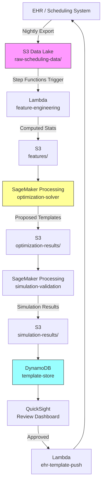

# Recipe 14.1: Appointment Slot Optimization

**Complexity:** Simple · **Phase:** MVP · **Estimated Cost:** ~$50-200/month compute

---

## The Problem

Here's a scene that plays out at every outpatient clinic in the country: a scheduler stares at a template that says "30-minute slots, 8am to 5pm" and tries to fit a complex diabetic follow-up, a quick blood pressure recheck, and a new patient evaluation into the same rigid grid. The diabetic follow-up runs 45 minutes. The blood pressure recheck takes 10. The new patient needs a full hour. But the template doesn't care. Every slot is 30 minutes. So the follow-up runs over, the recheck patient waits 20 minutes for a 10-minute visit, and the new patient gets rushed.

This is not a scheduling problem. It's a template design problem.

Most clinics build their appointment templates once, based on gut feel and historical convention, and then never touch them again. "Dr. Martinez does 30-minute slots" becomes organizational gospel. Nobody asks whether 30 minutes is actually optimal for Dr. Martinez's patient mix, which skews heavily toward complex chronic disease management. Nobody models whether overbooking the 9am slots by one patient would recover the revenue lost to no-shows without creating unacceptable wait times.

The numbers are genuinely painful. The average physician loses 14-18% of scheduled slots to no-shows and late cancellations. Clinics that don't overbook absorb that loss directly. Clinics that overbook uniformly create unpredictable wait times that drive patient dissatisfaction. Neither approach is optimal because neither approach uses data.

Appointment slot optimization is the practice of using historical visit data, no-show patterns, and mathematical optimization to design templates that maximize throughput (patients seen per session) while respecting constraints on wait time, provider fatigue, and visit quality. It's one of the cleanest optimization problems in healthcare operations because the constraints are well-defined, the objective is measurable, and the data already exists in your scheduling system.

---

## The Technology: Constraint Optimization for Scheduling Templates

### What Is Optimization?

Mathematical optimization is the discipline of finding the best solution from a set of feasible solutions, subject to constraints. In plain terms: you have a goal (maximize patients seen), you have rules you can't break (no visit shorter than its clinical minimum, no provider working past 6pm, no patient waiting more than 20 minutes), and you want the configuration that achieves the best goal while respecting all the rules.

The three components of any optimization problem:

1. **Decision variables.** What you're choosing. In our case: slot durations by visit type, buffer times between slots, overbooking levels by time-of-day, and session start/end times.

2. **Objective function.** What you're maximizing or minimizing. Here: maximize weighted throughput (patients seen, weighted by visit revenue or clinical priority) while minimizing expected patient wait time. These two objectives conflict, which makes it interesting.

3. **Constraints.** Rules that cannot be violated. Clinical minimums per visit type. Maximum session length. Maximum acceptable wait time. Overbooking limits. Break requirements.

### Why This Is a Good Starter Optimization Problem

Appointment slot optimization sits in the sweet spot of operations research: complex enough to benefit from mathematical modeling, simple enough that a basic formulation produces meaningful results.

The decision space is small. You're choosing maybe 5-8 slot durations (one per visit type), 2-3 buffer configurations, and an overbooking percentage per hour block. That's maybe 30-50 decision variables. Compare that to nurse scheduling (thousands of variables) or OR block allocation (hundreds of competing constraints). A modern solver handles this in seconds.

The data requirements are modest. You need historical visit durations by type (your EHR has this), no-show rates by time-of-day and day-of-week (your scheduling system has this), and patient arrival patterns (check-in timestamps). Most health systems have years of this data sitting unused.

The feedback loop is fast. You change a template, run it for two weeks, and measure the impact on throughput, wait times, and provider satisfaction. Unlike strategic decisions that take months to evaluate, template changes produce measurable results quickly.

### The Formulation

Let me walk through how you'd actually set this up mathematically. Don't worry if the notation feels dense; the concepts are straightforward.

**Decision variables:**
- `d[t]` = slot duration for visit type `t` (in minutes)
- `b[i]` = buffer time after slot `i` (in minutes)
- `o[h]` = overbooking level for hour block `h` (number of extra patients)

**Objective (simplified):**
```
Maximize: sum over all slots of (probability_patient_shows_up * revenue_weight[t])
Minimize: expected_wait_time across all patients

Combined: Maximize throughput - lambda * expected_wait_time
```

The `lambda` parameter controls the tradeoff. Higher lambda means you care more about wait times; lower lambda means you prioritize throughput. This is a dial your operations team tunes based on organizational priorities.

**Constraints:**
```
d[t] >= clinical_minimum[t]           // can't rush a complex visit
d[t] <= clinical_maximum[t]           // don't over-allocate simple visits
sum(d[i] + b[i]) <= session_length    // everything fits in the day
o[h] <= max_overbook[h]              // overbooking caps per hour
expected_wait[i] <= max_wait          // no patient waits too long
```

**The wait time calculation** is where it gets interesting. Expected wait time depends on the probability that previous patients' visits run long, which depends on the variance in visit duration, not just the mean. A visit type with mean 20 minutes and standard deviation 15 minutes creates much more downstream disruption than one with mean 25 minutes and standard deviation 3 minutes. Your model needs to account for this variance, which means you need the distribution of visit durations, not just the average.

### Solver Selection

For a problem this size, you have several options:

**Linear Programming (LP) / Mixed-Integer Programming (MIP).** If you can linearize your constraints and objective (or approximate them as linear), commercial solvers like Gurobi or CPLEX, or open-source solvers like CBC or HiGHS, will find the global optimum in milliseconds. The catch: wait time calculations involve probability distributions, which aren't naturally linear. You can approximate them with piecewise linear functions or scenario-based approaches.

**Constraint Programming (CP).** Better for problems with complex logical constraints ("if visit type is new patient AND provider is part-time, then slot must be at least 45 minutes"). Google's OR-Tools CP-SAT solver is excellent and free.

**Simulation-based optimization.** Run a discrete-event simulation of the clinic day thousands of times with different template configurations, and pick the one that performs best on average. This handles stochastic elements (no-shows, variable durations) naturally but is computationally heavier. Good for validation even if you use an analytical solver for the initial solution.

**Heuristic approaches.** For a first pass, even a grid search over reasonable parameter ranges (slot durations in 5-minute increments, overbooking from 0-3 per hour) can find good solutions. Not optimal, but fast to implement and often good enough for an MVP.

For most healthcare organizations starting out, I'd recommend: use a MIP solver for the core template optimization (it's fast and gives provably optimal solutions for the linearized problem), then validate the top 3-5 solutions with a simulation to account for stochastic effects the linear model approximates.

### Batch vs. Real-Time

This is a batch optimization problem. You're not optimizing in real-time as patients arrive (that's a different problem, closer to Recipe 14.6). You're designing the template that will be used for the next scheduling period (typically 2-4 weeks out).

The optimization runs periodically: weekly, monthly, or when significant changes occur (new provider joins, patient mix shifts, seasonal patterns change). Each run produces a new template configuration. A human reviews and approves it before it goes live. This human-in-the-loop step is important: optimization can produce technically optimal but operationally bizarre templates (like a 7-minute slot followed by a 52-minute slot) that providers would reject.

---

## General Architecture Pattern

```
[Historical Data] → [Feature Engineering] → [Optimization Model] → [Simulation Validation] → [Template Output] → [Human Review] → [EHR Template Update]
```

**Historical Data Collection.** Pull visit duration actuals (check-in to checkout), no-show rates, cancellation rates, and patient arrival patterns from your scheduling and EHR systems. You need at least 6 months of data per provider to capture seasonal patterns. Group by visit type, provider, day-of-week, and time-of-day.

**Feature Engineering.** Compute the statistics your model needs: mean and variance of visit duration per type, no-show probability by time slot, late arrival distribution, and provider-specific patterns. Some providers consistently run 5 minutes over; others consistently finish early. Your model should account for provider-specific behavior, not just system-wide averages.

**Optimization Model.** Formulate and solve the mathematical program. Inputs: statistical features from the previous step plus organizational constraints (session hours, break requirements, overbooking policies). Output: optimal slot durations, buffer times, and overbooking levels.

**Simulation Validation.** Take the proposed template and simulate 1,000+ clinic days using historical arrival and duration distributions. Measure expected throughput, wait times, overtime probability, and provider idle time. Compare against the current template using the same simulation. If the proposed template doesn't meaningfully outperform the current one, don't change it. Change fatigue is real.

**Human Review.** Present the proposed template alongside the simulation results to the operations team and affected providers. Show the tradeoffs explicitly: "This template sees 2 more patients per day but increases average wait time by 3 minutes." Let humans make the final call.

**EHR Integration.** Push the approved template into your scheduling system. Most EHRs support template APIs or bulk configuration. The integration is usually the least interesting technical piece but the most operationally painful one.

---

## The AWS Implementation

### Why These Services

**Amazon SageMaker for model training and optimization.** SageMaker provides the compute environment to run your optimization models and simulations. You can use SageMaker Processing jobs for the batch optimization runs (spin up compute, run the solver, shut down) without maintaining persistent infrastructure. For the simulation validation step, SageMaker's ability to parallelize across multiple instances lets you run thousands of simulation replications quickly.

**Amazon S3 for data lake and model artifacts.** Historical scheduling data exports, computed features, optimization results, and simulation outputs all live in S3. It's the durable backbone connecting pipeline stages. Partitioned by provider and date for efficient querying.

**AWS Lambda for orchestration and API.** Lambda coordinates the pipeline: triggers data extraction on schedule, kicks off SageMaker jobs, stores results, and exposes an API for the review interface. The optimization itself doesn't run in Lambda (too compute-heavy and time-limited), but Lambda is the glue.

**Amazon DynamoDB for template storage and versioning.** Stores the current and proposed templates per provider, with version history. Supports the review workflow (proposed vs. approved vs. active states) and rollback if a new template underperforms.

**Amazon QuickSight for visualization.** The human review step needs dashboards showing simulation results, before/after comparisons, and tradeoff curves. QuickSight connects directly to S3 and provides the visual layer without custom frontend development.

**AWS Step Functions for pipeline orchestration.** The end-to-end pipeline (extract data, compute features, run optimization, run simulation, store results, notify reviewers) has multiple steps with dependencies. Step Functions manages the workflow, handles retries on transient failures, and provides visibility into pipeline state.

### Architecture Diagram



### Prerequisites

| Requirement | Details |
|-------------|---------|
| **AWS Services** | Amazon SageMaker, Amazon S3, AWS Lambda, Amazon DynamoDB, AWS Step Functions, Amazon QuickSight |
| **IAM Permissions** | `sagemaker:CreateProcessingJob`, `s3:GetObject`, `s3:PutObject`, `dynamodb:PutItem`, `dynamodb:GetItem`, `states:StartExecution` |
| **BAA** | AWS BAA signed (scheduling data contains patient names and visit reasons, which are PHI) |
| **Encryption** | S3: SSE-KMS; DynamoDB: encryption at rest; SageMaker: VPC mode with encrypted volumes |
| **VPC** | SageMaker Processing jobs in VPC with no internet access; VPC endpoints for S3 and DynamoDB |
| **CloudTrail** | Enabled for all API calls; audit trail for template changes |
| **Sample Data** | Synthetic scheduling data. Use realistic visit type distributions but never real patient identifiers in dev. |
| **Cost Estimate** | SageMaker Processing: ~$2-5 per optimization run (ml.m5.xlarge, 10-30 min). S3 + DynamoDB + Lambda: negligible. Monthly total for weekly runs: $50-200. |

### Ingredients

| AWS Service | Role |
|------------|------|
| **Amazon SageMaker** | Runs optimization solver and simulation validation as Processing jobs |
| **Amazon S3** | Stores historical data, features, optimization results, simulation outputs |
| **AWS Lambda** | Orchestrates data extraction, feature computation, and EHR template push |
| **Amazon DynamoDB** | Stores template versions with state management (proposed/approved/active) |
| **AWS Step Functions** | Coordinates the multi-step pipeline with error handling and retries |
| **Amazon QuickSight** | Visualization layer for human review of proposed templates |
| **AWS KMS** | Encryption key management for all data at rest |

### Code

#### Walkthrough

**Step 1: Extract and prepare historical data.** The pipeline begins by pulling scheduling data from your EHR system. You need actual visit durations (not scheduled durations), visit type codes, provider IDs, appointment times, check-in times, and show/no-show status. Most EHRs expose this through reporting databases or bulk export APIs. The extraction runs nightly or weekly, appending new data to the historical store. Without accurate historical durations, the entire optimization is garbage-in-garbage-out. Scheduled duration tells you what the template says; actual duration tells you what really happens.

```
FUNCTION extract_scheduling_data(start_date, end_date):
    // Pull completed appointments from the EHR reporting database.
    // We need ACTUAL durations, not scheduled durations.
    // "Actual" means check-in to checkout, or room-in to room-out depending on your system.
    
    raw_data = query EHR database:
        SELECT appointment_id, provider_id, visit_type, scheduled_time,
               checkin_time, checkout_time, no_show_flag, cancellation_flag
        WHERE appointment_date BETWEEN start_date AND end_date
        AND status IN ('completed', 'no_show', 'cancelled')
    
    // Calculate actual duration for completed visits
    FOR each record in raw_data:
        IF record.no_show_flag == false AND record.cancellation_flag == false:
            record.actual_duration = minutes_between(record.checkin_time, record.checkout_time)
        ELSE:
            record.actual_duration = 0  // no-shows and cancellations consumed zero clinical time
    
    // Store in S3, partitioned by provider and month for efficient downstream queries
    write raw_data to S3 at "raw-scheduling-data/{provider_id}/{year}/{month}/"
    
    RETURN record count written
```

**Step 2: Compute statistical features.** This step transforms raw appointment records into the statistics the optimizer needs. For each provider and visit type combination, compute the mean and standard deviation of actual visit duration, the no-show rate by hour-of-day, and the late arrival distribution. The standard deviation is arguably more important than the mean: a visit type with high variance creates cascading delays that ripple through the entire afternoon. Skip this step and your optimizer will assume every 20-minute visit takes exactly 20 minutes, which is a fantasy.

```
FUNCTION compute_features(provider_id):
    // Load historical data for this provider (at least 6 months for seasonal stability)
    historical = load from S3 "raw-scheduling-data/{provider_id}/*"
    
    features = empty structure
    
    // Duration statistics by visit type
    FOR each visit_type in unique(historical.visit_type):
        type_records = filter historical where visit_type matches AND actual_duration > 0
        features.duration_stats[visit_type] = {
            mean:   average(type_records.actual_duration),
            stddev: standard_deviation(type_records.actual_duration),
            p90:    percentile(type_records.actual_duration, 90),  // 90th percentile for buffer planning
            count:  length(type_records)  // sample size for confidence
        }
    
    // No-show rates by hour block
    FOR each hour_block in [8, 9, 10, 11, 12, 13, 14, 15, 16]:
        block_records = filter historical where hour(scheduled_time) == hour_block
        features.noshow_rate[hour_block] = count(no_show_flag == true) / count(block_records)
    
    // Late arrival distribution (minutes past scheduled time)
    arrived = filter historical where checkin_time is not null
    features.late_arrival = {
        mean:   average(minutes_between(scheduled_time, checkin_time)),
        stddev: standard_deviation(minutes_between(scheduled_time, checkin_time))
    }
    
    // Store computed features
    write features to S3 at "features/{provider_id}/latest.json"
    
    RETURN features
```

**Step 3: Run the optimization solver.** This is the core of the recipe. Given the statistical features and organizational constraints, find the template configuration that maximizes throughput while keeping wait times acceptable. The solver explores the space of possible slot durations, buffer times, and overbooking levels to find the combination that best satisfies the objective function. For a typical clinic with 5-8 visit types and a single provider session, this solves in under a minute on modest hardware. The output is a proposed template: a sequence of slot types with durations and any overbooking recommendations.

```
FUNCTION optimize_template(features, constraints):
    // constraints includes: session_start, session_end, break_time, break_duration,
    //                       max_wait_minutes, max_overbook_per_hour, visit_type_mix
    
    // Define decision variables
    // d[t] = slot duration for visit type t (continuous, in minutes)
    // o[h] = overbooking count for hour h (integer, 0 to max_overbook)
    // b    = buffer time between slots (continuous, in minutes)
    
    model = create optimization model
    
    FOR each visit_type t:
        // Slot duration must be between clinical minimum and maximum
        add variable d[t] with bounds:
            lower = constraints.clinical_minimum[t]   // e.g., 10 min for BP recheck
            upper = constraints.clinical_maximum[t]   // e.g., 60 min for new patient
    
    FOR each hour_block h:
        add integer variable o[h] with bounds:
            lower = 0
            upper = constraints.max_overbook_per_hour  // e.g., 2
    
    add variable b (buffer) with bounds:
        lower = 0
        upper = 15  // no more than 15 minutes buffer between any two slots
    
    // Objective: maximize expected patients seen, penalized by expected wait
    // Expected patients = scheduled patients * (1 - noshow_rate) + overbooked * (1 - noshow_rate)
    // Expected wait is approximated using queuing theory (M/G/1 queue approximation)
    
    expected_throughput = SUM over hour_blocks h:
        (base_slots_per_hour[h] + o[h]) * (1 - features.noshow_rate[h])
    
    // Pollaczek-Khinchine formula approximation for expected wait
    // W = (rho * (cv^2 + 1)) / (2 * (1 - rho) * mu)
    // where rho = utilization, cv = coefficient of variation of service time
    expected_wait = compute_expected_wait(features.duration_stats, d, b)
    
    // Combined objective with tradeoff parameter lambda
    lambda = constraints.wait_penalty  // tunable: higher = more wait-averse
    set objective: MAXIMIZE expected_throughput - lambda * expected_wait
    
    // Constraints
    // Total scheduled time must fit in session
    session_minutes = minutes_between(constraints.session_start, constraints.session_end)
                      - constraints.break_duration
    add constraint: SUM(slots * (d[type_of_slot] + b)) <= session_minutes
    
    // Solve
    solution = solve model with time_limit = 300 seconds
    
    // Extract proposed template
    proposed_template = {
        slot_durations: { t: value(d[t]) for each visit_type t },
        buffer_minutes: value(b),
        overbooking:    { h: value(o[h]) for each hour_block h },
        expected_throughput: value(expected_throughput),
        expected_avg_wait:   value(expected_wait)
    }
    
    RETURN proposed_template
```

**Step 4: Validate with simulation.** The optimization model makes simplifying assumptions (steady-state queuing, independent arrivals). Simulation tests the proposed template against messy reality. Run 1,000+ replications of a clinic day using the proposed template, drawing visit durations from the historical distribution, simulating no-shows probabilistically, and tracking actual wait times and overtime. Compare against the same simulation using the current template. If the proposed template doesn't beat the current one by a meaningful margin (say, 5% improvement in throughput or 10% reduction in wait time), don't recommend the change. Template changes have operational cost.

```
FUNCTION simulate_clinic_day(template, features, num_replications):
    results = empty list
    
    FOR rep = 1 to num_replications:
        // Generate a random clinic day using historical distributions
        schedule = generate_schedule_from_template(template)
        
        current_time = template.session_start
        wait_times = empty list
        patients_seen = 0
        
        FOR each slot in schedule:
            // Determine if patient shows up (Bernoulli draw based on no-show rate)
            shows_up = random() > features.noshow_rate[hour_of(slot.time)]
            
            IF shows_up:
                // Draw actual visit duration from historical distribution for this type
                actual_duration = draw_from_distribution(
                    mean = features.duration_stats[slot.visit_type].mean,
                    stddev = features.duration_stats[slot.visit_type].stddev
                )
                
                // Patient wait = max(0, current_time - slot.scheduled_time)
                patient_wait = max(0, current_time - slot.scheduled_time)
                append patient_wait to wait_times
                
                // Provider finishes at current_time + actual_duration + buffer
                current_time = max(current_time, slot.scheduled_time) + actual_duration + template.buffer
                patients_seen = patients_seen + 1
            ELSE:
                // No-show: time advances to next slot without clinical work
                current_time = max(current_time, slot.scheduled_time + template.buffer)
        
        // Record this replication's outcomes
        append to results: {
            patients_seen:    patients_seen,
            avg_wait:         average(wait_times),
            max_wait:         max(wait_times),
            overtime_minutes: max(0, current_time - template.session_end),
            provider_idle:    compute_idle_time(schedule, current_time)
        }
    
    // Aggregate across replications
    RETURN {
        mean_throughput:  average(results.patients_seen),
        mean_wait:        average(results.avg_wait),
        p95_wait:         percentile(results.avg_wait, 95),
        overtime_prob:    count(results.overtime_minutes > 0) / num_replications,
        mean_idle:        average(results.provider_idle)
    }
```

**Step 5: Store and present for review.** Write the proposed template and simulation comparison to DynamoDB with a "proposed" status. Trigger a notification to the operations team. The review dashboard shows the current template performance alongside the proposed template performance, with explicit tradeoff visualization. Only after human approval does the template move to "active" status and get pushed to the EHR.

```
FUNCTION store_and_notify(provider_id, proposed_template, simulation_current, simulation_proposed):
    // Store the proposed template with full context for the reviewer
    write to DynamoDB table "template-store":
        provider_id      = provider_id
        version          = next_version_number(provider_id)
        status           = "proposed"                        // not active until approved
        created_at       = current UTC timestamp
        template         = proposed_template                 // the actual slot configuration
        simulation_current  = simulation_current            // how today's template performs
        simulation_proposed = simulation_proposed           // how the new one performs
        improvement      = {
            throughput_delta: simulation_proposed.mean_throughput - simulation_current.mean_throughput,
            wait_delta:      simulation_proposed.mean_wait - simulation_current.mean_wait,
            overtime_delta:  simulation_proposed.overtime_prob - simulation_current.overtime_prob
        }
    
    // Notify operations team that a new template is ready for review
    send notification:
        to = operations_team_email
        subject = "New template proposed for {provider_id}"
        body = "Projected improvement: {improvement.throughput_delta} patients/day, "
               + "{improvement.wait_delta} min avg wait change. Review in dashboard."
    
    RETURN version
```

> **Curious how this looks in Python?** The pseudocode above covers the concepts. If you'd like to see sample Python code that demonstrates these patterns using boto3, check out the [Python Example](chapter14.01-python-example). It walks through each step with inline comments and notes on what you'd need to change for a real deployment.

### Expected Results

**Sample optimization output for a family medicine provider:**

```json
{
  "provider_id": "DR-MARTINEZ-FM",
  "version": 7,
  "status": "proposed",
  "template": {
    "slot_durations": {
      "new_patient": 45,
      "follow_up_complex": 30,
      "follow_up_simple": 20,
      "procedure": 40,
      "bp_recheck": 10,
      "telehealth": 15
    },
    "buffer_minutes": 5,
    "overbooking": {
      "9": 1,
      "10": 1,
      "11": 0,
      "13": 1,
      "14": 1,
      "15": 0,
      "16": 0
    }
  },
  "improvement": {
    "throughput_delta": 2.3,
    "wait_delta": -1.8,
    "overtime_delta": -0.05
  }
}
```

**Performance benchmarks:**

| Metric | Current Template | Optimized Template |
|--------|-----------------|-------------------|
| Patients per session | 18.2 | 20.5 |
| Average wait time | 14.3 min | 12.5 min |
| 95th percentile wait | 32 min | 26 min |
| Overtime probability | 22% | 17% |
| Provider idle time | 28 min/day | 18 min/day |

**Where it struggles:** Providers with highly variable patient mixes (one day is all complex, next day is all simple). Walk-in clinics where the schedule is meaningless by 10am. Clinics with shared resources (one MA supporting two providers) where the bottleneck isn't the provider's time. And any environment where the template is routinely overridden by schedulers who "know better" (which is a change management problem, not a technical one).

---

## Why This Isn't Production-Ready

**EHR integration complexity.** Every EHR handles templates differently. Epic's template builder, Cerner's scheduling configuration, athenahealth's slot types: they all have different abstractions. The "push template to EHR" step in this recipe is hand-waved. In practice, it's often the hardest part of the project because EHR template APIs are poorly documented, rate-limited, or nonexistent. Some organizations resort to RPA (robotic process automation) to configure templates through the UI.

**Multi-provider dependencies.** This recipe optimizes one provider at a time. In reality, providers share MAs, rooms, and equipment. Optimizing Dr. Martinez's template in isolation might create a bottleneck at the shared lab draw station. Multi-provider optimization is a much harder problem (see Recipe 14.4 for nurse staffing, which touches similar shared-resource constraints).

**Seasonality and drift.** Patient mix changes seasonally (flu season, back-to-school physicals). A template optimized on summer data may underperform in January. Build in periodic re-optimization and monitor for drift between expected and actual performance.

---

## The Honest Take

This is one of those problems where the math is the easy part. The hard part is getting people to trust the output.

I've seen optimization projects produce templates that are objectively better by every metric, and then watched them die because a provider said "I don't like having 10-minute slots, it feels rushed." The feeling matters. If a provider feels rushed, they'll run over regardless of what the template says, and your optimization is worthless. Build provider preferences into your constraints, not as an afterthought.

The overbooking piece is politically sensitive. "The computer says we should double-book the 9am slot" is a hard sell to a provider who remembers the last time they were double-booked and ran 45 minutes behind all morning. Present it as "the data shows that 9am has a 25% no-show rate, so booking one extra patient at 9am results in the expected panel size, not an overload." Framing matters enormously.

The biggest surprise: the variance in visit duration matters more than the mean. A provider whose visits are consistently 22 minutes (low variance) can be scheduled much more tightly than one whose visits range from 8 to 55 minutes (high variance), even if both have the same average. Most scheduling systems ignore variance entirely. That's where the biggest gains hide.

Start with one willing provider. Show results. Let word spread. Mandating optimized templates across a department without buy-in is a recipe for passive resistance.

---

## Variations and Extensions

**Dynamic intra-day adjustment.** Instead of static templates, adjust remaining slots in real-time based on how the morning is going. If the first three patients all ran long, automatically extend afternoon buffers and notify patients of potential delays. This moves from batch optimization into online optimization territory and requires tighter EHR integration.

**Multi-objective Pareto optimization.** Rather than combining throughput and wait time into a single objective with a lambda parameter, generate the full Pareto frontier: the set of all templates where you can't improve one metric without worsening another. Present the frontier to decision-makers and let them choose their preferred tradeoff point. More sophisticated but produces better organizational alignment.

**Patient preference integration.** Some patients prefer early morning; others need after-work slots. Incorporate patient preference data into the template design to improve show rates (patients who get their preferred time are less likely to no-show). This connects to Recipe 4.1 (Appointment Reminder Channel Optimization) for a complete patient access optimization strategy.

---

## Related Recipes

- **Recipe 7.1 (Appointment No-Show Prediction):** Provides the no-show probability estimates that feed into the overbooking optimization
- **Recipe 12.1 (Appointment Volume Forecasting):** Forecasts demand by visit type, informing how many slots of each type to include in the template
- **Recipe 14.4 (Nurse Staffing Optimization):** Extends the single-provider model to shared resource constraints across multiple providers
- **Recipe 14.7 (OR Case Sequencing):** Applies similar sequencing optimization to surgical cases, a more complex variant of the same pattern

---

## Additional Resources

**AWS Documentation:**
- [Amazon SageMaker Processing Jobs](https://docs.aws.amazon.com/sagemaker/latest/dg/processing-job.html)
- [AWS Step Functions Developer Guide](https://docs.aws.amazon.com/step-functions/latest/dg/welcome.html)
- [Amazon SageMaker HIPAA Eligibility](https://aws.amazon.com/compliance/hipaa-eligible-services-reference/)
- [Amazon QuickSight Embedding](https://docs.aws.amazon.com/quicksight/latest/user/embedded-analytics.html)

**Optimization Libraries (used within SageMaker):**
- [Google OR-Tools](https://developers.google.com/optimization): Open-source optimization suite with CP-SAT solver, excellent for scheduling problems
- [PuLP](https://coin-or.github.io/pulp/): Python LP/MIP modeling library that interfaces with CBC, CPLEX, and Gurobi solvers
- [SimPy](https://simpy.readthedocs.io/): Python discrete-event simulation library for the validation step

**AWS Solutions and Blogs:**
- [Optimization with Amazon SageMaker](https://aws.amazon.com/blogs/machine-learning/): Search for scheduling and optimization use cases
- [Architecting for HIPAA on AWS (Whitepaper)](https://docs.aws.amazon.com/whitepapers/latest/architecting-hipaa-security-and-compliance-on-aws/welcome.html)

---

## Estimated Implementation Time

| Tier | Timeline |
|------|----------|
| **Basic** (single provider, manual data export, grid search optimization) | 2-3 weeks |
| **Production-ready** (automated pipeline, MIP solver, simulation validation, review dashboard) | 6-8 weeks |
| **With variations** (multi-provider, dynamic intra-day, Pareto frontier) | 12-16 weeks |

---

## Tags

`optimization` · `operations-research` · `scheduling` · `appointment-template` · `constraint-programming` · `mixed-integer-programming` · `simulation` · `sagemaker` · `step-functions` · `simple` · `mvp` · `hipaa`

---

*← [Chapter 14 Index](chapter14-index) · [Next: Recipe 14.2 - Patient-Provider Assignment →](chapter14.02-patient-provider-assignment)*
