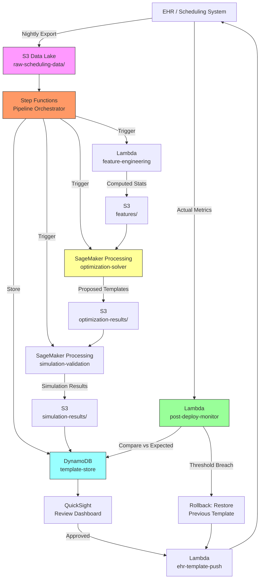

# Recipe 14.1 Architecture and Implementation: Appointment Slot Optimization

*Companion to [Recipe 14.1: Appointment Slot Optimization](chapter14.01-appointment-slot-optimization). This page covers the AWS architecture, services, prerequisites, and pseudocode. For the problem framing and the conceptual approach, start with the main recipe.*

---

## Why These Services

**Amazon SageMaker for model training and optimization.** SageMaker provides the compute environment to run your optimization models and simulations. You can use SageMaker Processing jobs for the batch optimization runs (spin up compute, run the solver, shut down) without maintaining persistent infrastructure. For the simulation validation step, SageMaker's ability to parallelize across multiple instances lets you run thousands of simulation replications quickly.

**Amazon S3 for data lake and model artifacts.** Historical scheduling data exports, computed features, optimization results, and simulation outputs all live in S3. It's the durable backbone connecting pipeline stages. Partitioned by provider and date for efficient querying.

**AWS Lambda for orchestration and API.** Lambda coordinates the pipeline: triggers data extraction on schedule, kicks off SageMaker jobs, stores results, and exposes an API for the review interface. The optimization itself doesn't run in Lambda (too compute-heavy and time-limited), but Lambda is the glue.

**Amazon DynamoDB for template storage and versioning.** Stores the current and proposed templates per provider, with version history. Supports the review workflow (proposed vs. approved vs. active states) and rollback if a new template underperforms. For multi-department deployments, scope access using IAM condition keys (`dynamodb:LeadingKeys`) so that each department can only read and modify its own providers' templates.

**Amazon QuickSight for visualization.** The human review step needs dashboards showing simulation results, before/after comparisons, and tradeoff curves. QuickSight connects directly to S3 and provides the visual layer without custom frontend development.

**AWS Step Functions for pipeline orchestration.** The end-to-end pipeline (extract data, compute features, run optimization, run simulation, store results, notify reviewers) has multiple steps with dependencies. Step Functions manages the workflow, handles retries on transient failures, and provides visibility into pipeline state. For multi-provider deployments, use Step Functions' Map state with a configurable concurrency limit to stay within SageMaker service quotas.

## Architecture Diagram



## Prerequisites

| Requirement | Details |
|-------------|---------|
| **AWS Services** | Amazon SageMaker, Amazon S3, AWS Lambda, Amazon DynamoDB, AWS Step Functions, Amazon QuickSight |
| **IAM Permissions (orchestration)** | `sagemaker:CreateProcessingJob`, `s3:GetObject`, `s3:PutObject`, `dynamodb:PutItem`, `dynamodb:GetItem`, `states:StartExecution` |
| **IAM Permissions (SageMaker execution role)** | `s3:GetObject` on `features/*`, `s3:PutObject` on `optimization-results/*` and `simulation-results/*`. This role should not have DynamoDB or Step Functions access. |
| **BAA** | AWS BAA signed (scheduling data contains patient names and visit reasons, which are PHI) |
| **Encryption** | S3: SSE-KMS; DynamoDB: encryption at rest; SageMaker: VPC mode with encrypted volumes |
| **VPC** | SageMaker Processing jobs in VPC with no internet access; VPC endpoints for S3 (gateway), DynamoDB (gateway), CloudWatch Logs (interface), and STS (interface). If using custom container images, add ECR endpoints (dkr and api). Security groups should allow outbound HTTPS (443) to VPC endpoint prefix lists. |
| **CloudTrail** | Enabled for all API calls; audit trail for template changes |
| **Sample Data** | Synthetic scheduling data. Use realistic visit type distributions but never real patient identifiers in dev. |
| **Cost Estimate** | SageMaker Processing: ~$2-5 per optimization run (ml.m5.xlarge, 10-30 min). S3 + DynamoDB + Lambda: negligible. Monthly total for weekly runs: $50-200. |

## Ingredients

| AWS Service | Role |
|------------|------|
| **Amazon SageMaker** | Runs optimization solver and simulation validation as Processing jobs |
| **Amazon S3** | Stores historical data, features, optimization results, simulation outputs |
| **AWS Lambda** | Orchestrates data extraction, feature computation, and EHR template push |
| **Amazon DynamoDB** | Stores template versions with state management (proposed/approved/active) |
| **AWS Step Functions** | Coordinates the multi-step pipeline with error handling and retries |
| **Amazon QuickSight** | Visualization layer for human review of proposed templates |
| **AWS KMS** | Encryption key management for all data at rest |

## Pseudocode Walkthrough

**Step 1: Extract and prepare historical data.** The pipeline begins by pulling scheduling data from your EHR system. You need actual visit durations (not scheduled durations), visit type codes, provider IDs, appointment times, check-in times, and show/no-show status. Most EHRs expose this through reporting databases or bulk export APIs. The extraction runs nightly or weekly, appending new data to the historical store. Without accurate historical durations, the entire optimization is garbage-in-garbage-out. Scheduled duration tells you what the template says; actual duration tells you what really happens.

```pseudocode
FUNCTION extract_scheduling_data(start_date, end_date):
    // Pull completed appointments from the EHR reporting database.
    // We need ACTUAL durations, not scheduled durations.
    // "Actual" means check-in to checkout, or room-in to room-out depending on your system.
    
    raw_data = query EHR database:
        SELECT appointment_id, provider_id, visit_type, scheduled_time,
               checkin_time, checkout_time, no_show_flag, cancellation_flag
        WHERE appointment_date BETWEEN start_date AND end_date
        AND status IN ('completed', 'no_show', 'cancelled')
    
    // Calculate actual duration for completed visits
    FOR each record in raw_data:
        IF record.no_show_flag == false AND record.cancellation_flag == false:
            record.actual_duration = minutes_between(record.checkin_time, record.checkout_time)
        ELSE:
            record.actual_duration = 0  // no-shows and cancellations consumed zero clinical time
    
    // Store in S3, partitioned by provider and month for efficient downstream queries
    write raw_data to S3 at "raw-scheduling-data/{provider_id}/{year}/{month}/"
    
    RETURN record count written
```

**Step 2: Compute statistical features.** This step transforms raw appointment records into the statistics the optimizer needs. For each provider and visit type combination, compute the mean and standard deviation of actual visit duration, the no-show rate by hour-of-day, and the late arrival distribution. The standard deviation is arguably more important than the mean: a visit type with high variance creates cascading delays that ripple through the entire afternoon. Skip this step and your optimizer will assume every 20-minute visit takes exactly 20 minutes, which is a fantasy.

```pseudocode
FUNCTION compute_features(provider_id):
    // Load historical data for this provider (at least 6 months for seasonal stability)
    historical = load from S3 "raw-scheduling-data/{provider_id}/*"
    
    features = empty structure
    
    // Duration statistics by visit type
    FOR each visit_type in unique(historical.visit_type):
        type_records = filter historical where visit_type matches AND actual_duration > 0
        features.duration_stats[visit_type] = {
            mean: average(type_records.actual_duration),
            stddev: standard_deviation(type_records.actual_duration),
            p90: percentile(type_records.actual_duration, 90),  // 90th percentile for buffer planning
            count: length(type_records)  // sample size for confidence
        }
    
    // No-show rates by hour block
    FOR each hour_block in [8, 9, 10, 11, 12, 13, 14, 15, 16]:
        block_records = filter historical where hour(scheduled_time) == hour_block
        features.noshow_rate[hour_block] = count(no_show_flag == true) / count(block_records)
    
    // Late arrival distribution (minutes past scheduled time)
    arrived = filter historical where checkin_time is not null
    features.late_arrival = {
        mean: average(minutes_between(scheduled_time, checkin_time)),
        stddev: standard_deviation(minutes_between(scheduled_time, checkin_time))
    }
    
    // Store computed features
    write features to S3 at "features/{provider_id}/latest.json"
    
    RETURN features
```

**Step 3: Run the optimization solver.** This is the core of the recipe. Given the statistical features and organizational constraints, find the template configuration that maximizes throughput while keeping wait times acceptable. The solver explores the space of possible slot durations, buffer times, and overbooking levels to find the combination that best satisfies the objective function. For a typical clinic with 5-8 visit types and a single provider session, this solves in under a minute on modest hardware. The output is a proposed template: a sequence of slot types with durations and any overbooking recommendations.

```pseudocode
FUNCTION optimize_template(features, constraints):
    // constraints includes: session_start, session_end, break_time, break_duration,
    //                       max_wait_minutes, max_overbook_per_hour, visit_type_mix
    
    // Define decision variables
    // d[t] = slot duration for visit type t (continuous, in minutes)
    // o[h] = overbooking count for hour h (integer, 0 to max_overbook)
    // b    = buffer time between slots (continuous, in minutes)
    
    model = create optimization model
    
    FOR each visit_type t:
        // Slot duration must be between clinical minimum and maximum
        add variable d[t] with bounds:
            lower = constraints.clinical_minimum[t]   // e.g., 10 min for BP recheck
            upper = constraints.clinical_maximum[t]   // e.g., 60 min for new patient
    
    FOR each hour_block h:
        add integer variable o[h] with bounds:
            lower = 0
            upper = constraints.max_overbook_per_hour  // e.g., 2
    
    add variable b (buffer) with bounds:
        lower = 0
        upper = 15  // no more than 15 minutes buffer between any two slots
    
    // Objective: maximize expected patients seen, penalized by expected wait
    // Expected patients = scheduled patients * (1 - noshow_rate) + overbooked * (1 - noshow_rate)
    // Expected wait is approximated using queuing theory (M/G/1 queue approximation)
    
    expected_throughput = SUM over hour_blocks h:
        (base_slots_per_hour[h] + o[h]) * (1 - features.noshow_rate[h])
    
    // Pollaczek-Khinchine formula approximation for expected wait
    // W = (rho * (cv^2 + 1)) / (2 * (1 - rho) * mu)
    // where rho = utilization, cv = coefficient of variation of service time
    expected_wait = compute_expected_wait(features.duration_stats, d, b)
    
    // Combined objective with tradeoff parameter lambda
    lambda = constraints.wait_penalty  // tunable: higher = more wait-averse
    set objective: MAXIMIZE expected_throughput - lambda * expected_wait
    
    // Constraints
    // Total scheduled time must fit in session
    session_minutes = minutes_between(constraints.session_start, constraints.session_end)
                      - constraints.break_duration
    add constraint: SUM(slots * (d[type_of_slot] + b)) <= session_minutes
    
    // Solve
    solution = solve model with time_limit = 300 seconds
    
    // Extract proposed template
    proposed_template = {
        slot_durations: { t: value(d[t]) for each visit_type t },
        buffer_minutes: value(b),
        overbooking: { h: value(o[h]) for each hour_block h },
        expected_throughput: value(expected_throughput),
        expected_avg_wait: value(expected_wait)
    }
    
    RETURN proposed_template
```

**Step 4: Validate with simulation.** The optimization model makes simplifying assumptions (steady-state queuing, independent arrivals). Simulation tests the proposed template against messy reality. Run 1,000+ replications of a clinic day using the proposed template, drawing visit durations from the historical distribution, simulating no-shows probabilistically, and tracking actual wait times and overtime. Compare against the same simulation using the current template. If the proposed template doesn't beat the current one by a meaningful margin (say, 5% improvement in throughput or 10% reduction in wait time), don't recommend the change. Template changes have operational cost.

```pseudocode
FUNCTION simulate_clinic_day(template, features, num_replications):
    // Note: this simulation assumes provider behavior doesn't change under the new
    // template. In practice, providers may adjust their pace in response to shorter
    // or longer slots. Treat results as directional estimates, not guarantees.
    
    results = empty list
    
    FOR rep = 1 to num_replications:
        // Generate a random clinic day using historical distributions
        schedule = generate_schedule_from_template(template)
        
        current_time = template.session_start
        wait_times = empty list
        patients_seen = 0
        
        FOR each slot in schedule:
            // Determine if patient shows up (Bernoulli draw based on no-show rate)
            shows_up = random() > features.noshow_rate[hour_of(slot.time)]
            
            IF shows_up:
                // Draw actual visit duration from historical distribution for this type
                actual_duration = draw_from_distribution(
                    mean = features.duration_stats[slot.visit_type].mean,
                    stddev = features.duration_stats[slot.visit_type].stddev
                )
                
                // Patient wait = max(0, current_time - slot.scheduled_time)
                patient_wait = max(0, current_time - slot.scheduled_time)
                append patient_wait to wait_times
                
                // Provider finishes at current_time + actual_duration + buffer
                current_time = max(current_time, slot.scheduled_time) + actual_duration + template.buffer
                patients_seen = patients_seen + 1
            ELSE:
                // No-show: time advances to next slot without clinical work
                current_time = max(current_time, slot.scheduled_time + template.buffer)
        
        // Record this replication's outcomes
        append to results: {
            patients_seen: patients_seen,
            avg_wait: average(wait_times),
            max_wait: max(wait_times),
            overtime_minutes: max(0, current_time - template.session_end),
            provider_idle: compute_idle_time(schedule, current_time)
        }
    
    // Aggregate across replications
    RETURN {
        mean_throughput: average(results.patients_seen),
        mean_wait: average(results.avg_wait),
        p95_wait: percentile(results.avg_wait, 95),
        overtime_prob: count(results.overtime_minutes > 0) / num_replications,
        mean_idle: average(results.provider_idle)
    }
```

**Step 5: Store and present for review.** Write the proposed template and simulation comparison to DynamoDB with a "proposed" status. Trigger a notification to the operations team. The review dashboard shows the current template performance alongside the proposed template performance, with explicit tradeoff visualization. Only after human approval does the template move to "active" status and get pushed to the EHR.

```pseudocode
FUNCTION store_and_notify(provider_id, proposed_template, simulation_current, simulation_proposed):
    // Store the proposed template with full context for the reviewer
    write to DynamoDB table "template-store":
        provider_id      = provider_id
        version          = next_version_number(provider_id)
        status           = "proposed"                        // not active until approved
        created_at       = current UTC timestamp
        approved_by      = null                              // populated on approval
        approved_at      = null                              // populated on approval
        approval_notes   = null                              // reviewer rationale
        template         = proposed_template                 // the actual slot configuration
        simulation_current  = simulation_current            // how today's template performs
        simulation_proposed = simulation_proposed           // how the new one performs
        improvement      = {
            throughput_delta: simulation_proposed.mean_throughput - simulation_current.mean_throughput,
            wait_delta: simulation_proposed.mean_wait - simulation_current.mean_wait,
            overtime_delta: simulation_proposed.overtime_prob - simulation_current.overtime_prob
        }
    
    // Notify operations team that a new template is ready for review.
    // IMPORTANT: Do not embed provider-specific metrics in the notification body.
    // Notifications traverse channels that may not be encrypted end-to-end.
    // Send only a link to the authenticated review dashboard.
    send notification:
        to = operations_team_endpoint   // HTTPS endpoint or internal channel, not email
        subject = "New scheduling template ready for review"
        body = "A new template proposal is available. Review in the dashboard: {dashboard_url}"
    
    RETURN version
```

**Step 6: Post-deployment monitoring and automatic rollback.** After a template goes active, monitor actual clinic performance against the simulation predictions. Pull real throughput, wait times, and overtime data from the EHR for 1-2 weeks and compare against the `simulation_proposed` metrics stored in DynamoDB. If performance deviates beyond configured thresholds, automatically roll back to the previous template version. DynamoDB's version history makes rollback straightforward: query for the most recent item where `status = "active"` and `version < current_version`, flip its status back to "active," and mark the current template as "rolled_back."

```pseudocode
FUNCTION monitor_and_rollback(provider_id, monitoring_window_days = 14):
    // Retrieve the active template and its expected performance
    active_template = query DynamoDB table "template-store":
        WHERE provider_id = provider_id AND status = "active"
        ORDER BY version DESC, LIMIT 1
    
    expected = active_template.simulation_proposed
    
    // Pull actual performance from EHR data over the monitoring window
    actual_data = extract_scheduling_data(
        start_date = active_template.approved_at,
        end_date   = active_template.approved_at + monitoring_window_days
    )
    
    actual_metrics = {
        mean_throughput: average(actual_data.patients_per_session),
        mean_wait: average(actual_data.patient_wait_minutes),
        overtime_prob: count(sessions_with_overtime) / total_sessions
    }
    
    // Check deviation thresholds
    wait_deviation = (actual_metrics.mean_wait - expected.mean_wait) / expected.mean_wait
    overtime_deviation = actual_metrics.overtime_prob - expected.overtime_prob
    
    IF wait_deviation > 0.50 OR overtime_deviation > 0.10:
        // Performance has deviated unacceptably. Roll back.
        
        // Find previous active version in DynamoDB
        previous_version = query DynamoDB table "template-store":
            WHERE provider_id = provider_id
            AND version < active_template.version
            AND status IN ("rolled_back_from", "previously_active")
            ORDER BY version DESC, LIMIT 1
        
        // Swap statuses using a DynamoDB TransactWriteItems call
        // to ensure atomicity (both updates succeed or neither does)
        transact_write:
            UPDATE active_template: SET status = "rolled_back",
                                       rolled_back_at = current UTC timestamp,
                                       rollback_reason = "wait_deviation={wait_deviation}, overtime_deviation={overtime_deviation}"
            UPDATE previous_version: SET status = "active"
        
        // Push the previous template back to the EHR
        push_template_to_ehr(provider_id, previous_version.template)
        
        // Alert operations
        send notification:
            to = operations_team_endpoint
            subject = "Template rollback triggered"
            body = "Review in the dashboard: {dashboard_url}"
        
        RETURN "rolled_back"
    
    ELSE:
        // Performance within acceptable bounds. Mark monitoring complete.
        UPDATE active_template in DynamoDB:
            SET monitoring_status = "passed",
                actual_metrics = actual_metrics
        
        RETURN "monitoring_passed"
```

> **Curious how this looks in Python?** The pseudocode above covers the concepts. If you'd like to see sample Python code that demonstrates these patterns using boto3, check out the [Python Example](chapter14.01-python-example). It walks through each step with inline comments and notes on what you'd need to change for a real deployment.

## Expected Results

**Sample optimization output for a family medicine provider:**

```json
{
  "provider_id": "DR-MARTINEZ-FM",
  "version": 7,
  "status": "proposed",
  "template": {
    "slot_durations": {
      "new_patient": 45,
      "follow_up_complex": 30,
      "follow_up_simple": 20,
      "procedure": 40,
      "bp_recheck": 10,
      "telehealth": 15
    },
    "buffer_minutes": 5,
    "overbooking": {
      "9": 1,
      "10": 1,
      "11": 0,
      "13": 1,
      "14": 1,
      "15": 0,
      "16": 0
    }
  },
  "improvement": {
    "throughput_delta": 2.3,
    "wait_delta": -1.8,
    "overtime_delta": -0.05
  }
}
```

**Performance benchmarks:**

| Metric | Current Template | Optimized Template |
|--------|-----------------|-------------------|
| Patients per session | 18.2 | 20.5 |
| Average wait time | 14.3 min | 12.5 min |
| 95th percentile wait | 32 min | 26 min |
| Overtime probability | 22% | 17% |
| Provider idle time | 28 min/day | 18 min/day |

**Where it struggles:** Providers with highly variable patient mixes (one day is all complex, next day is all simple). Walk-in clinics where the schedule is meaningless by 10am. Clinics with shared resources (one MA supporting two providers) where the bottleneck isn't the provider's time. And any environment where the template is routinely overridden by schedulers who "know better" (which is a change management problem, not a technical one).

---

## Why This Isn't Production-Ready

**EHR integration complexity.** Every EHR handles templates differently. Epic's template builder, Cerner's scheduling configuration, athenahealth's slot types: they all have different abstractions. The "push template to EHR" step in this recipe is hand-waved. In practice, it's often the hardest part of the project because EHR template APIs are poorly documented, rate-limited, or nonexistent. Some organizations resort to RPA (robotic process automation) to configure templates through the UI.

**Multi-provider dependencies.** This recipe optimizes one provider at a time. In reality, providers share MAs, rooms, and equipment. Optimizing Dr. Martinez's template in isolation might create a bottleneck at the shared lab draw station. Multi-provider optimization is a much harder problem (see Recipe 14.4 for nurse staffing, which touches similar shared-resource constraints).

**Seasonality and drift.** Patient mix changes seasonally (flu season, back-to-school physicals). A template optimized on summer data may underperform in January. Build in periodic re-optimization and monitor for drift between expected and actual performance.

---

## Variations and Extensions

**Dynamic intra-day adjustment.** Instead of static templates, adjust remaining slots in real-time based on how the morning is going. If the first three patients all ran long, automatically extend afternoon buffers and notify patients of potential delays. This moves from batch optimization into online optimization territory and requires tighter EHR integration.

**Multi-objective Pareto optimization.** Rather than combining throughput and wait time into a single objective with a lambda parameter, generate the full Pareto frontier: the set of all templates where you can't improve one metric without worsening another. Present the frontier to decision-makers and let them choose their preferred tradeoff point. More sophisticated but produces better organizational alignment.

**Patient preference integration.** Some patients prefer early morning; others need after-work slots. Incorporate patient preference data into the template design to improve show rates (patients who get their preferred time are less likely to no-show). This connects to Recipe 4.1 (Appointment Reminder Channel Optimization) for a complete patient access optimization strategy.

---

## Additional Resources

**AWS Documentation:**
- [Amazon SageMaker Processing Jobs](https://docs.aws.amazon.com/sagemaker/latest/dg/processing-job.html)
- [AWS Step Functions Developer Guide](https://docs.aws.amazon.com/step-functions/latest/dg/welcome.html)
- [Amazon SageMaker HIPAA Eligibility](https://aws.amazon.com/compliance/hipaa-eligible-services-reference/)
- [Amazon QuickSight Embedding](https://docs.aws.amazon.com/quicksight/latest/user/embedded-analytics.html)

**Optimization Libraries (used within SageMaker):**
- [Google OR-Tools](https://developers.google.com/optimization): Open-source optimization suite with CP-SAT solver, excellent for scheduling problems
- [PuLP](https://coin-or.github.io/pulp/): Python LP/MIP modeling library that interfaces with CBC, CPLEX, and Gurobi solvers
- [SimPy](https://simpy.readthedocs.io/): Python discrete-event simulation library, useful for multi-server validation scenarios beyond the single-provider case

**AWS Solutions and Blogs:**
- [AWS Machine Learning Blog](https://aws.amazon.com/blogs/machine-learning/): Search for scheduling and optimization use cases
- [Architecting for HIPAA on AWS (Whitepaper)](https://docs.aws.amazon.com/whitepapers/latest/architecting-hipaa-security-and-compliance-on-aws/welcome.html)

---

## Estimated Implementation Time

| Tier | Timeline |
|------|----------|
| **Basic** (single provider, manual data export, grid search optimization) | 2-3 weeks |
| **Production-ready** (automated pipeline, MIP solver, simulation validation, review dashboard) | 6-8 weeks |
| **With variations** (multi-provider, dynamic intra-day, Pareto frontier) | 12-16 weeks |

---

---

*← [Main Recipe 14.1](chapter14.01-appointment-slot-optimization) · [Python Example](chapter14.01-python-example) · [Chapter Preface](chapter14-preface)*
