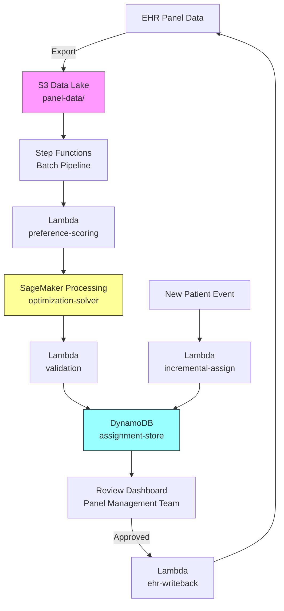

# Recipe 14.2 Architecture and Implementation: Patient-Provider Assignment

*Companion to [Recipe 14.2: Patient-Provider Assignment](chapter14.02-patient-provider-assignment). This page covers the AWS architecture, services, prerequisites, and pseudocode. For the problem framing and the conceptual approach, start with the main recipe.*

---

## The AWS Implementation

### Why These Services

**AWS Lambda for orchestration and the incremental path.** Lambda coordinates the batch pipeline (triggering the optimizer, storing results, notifying reviewers) and handles the incremental assignment path directly (single patient, compute scores, pick the best provider, respond in under a second).

**Amazon SageMaker Processing for batch optimization.** The batch optimizer (hundreds of patients, full constraint formulation) runs as a SageMaker Processing job. Spin up compute, run the solver, shut down. No persistent infrastructure to maintain. For the typical problem size, an `ml.m5.large` instance finishes in under a minute.

**Amazon DynamoDB for assignment storage and workflow.** Stores proposed assignments with status tracking (proposed, approved, rejected, overridden). Supports the review workflow and provides an audit trail. The partition key is patient ID; the sort key includes the batch identifier for versioning.

**AWS Step Functions for batch pipeline orchestration.** The batch pipeline has multiple steps with dependencies: extract data, compute scores, run optimizer, validate, store, notify. Step Functions manages the workflow, handles retries, and provides visibility into pipeline state.

**Amazon S3 for data staging.** Patient and provider data exports from the EHR land in S3. Optimization results and audit logs persist in S3 for compliance.

### Architecture Diagram



### Prerequisites

| Requirement | Details |
|-------------|---------|
| **AWS Services** | AWS Lambda, Amazon SageMaker, Amazon DynamoDB, AWS Step Functions, Amazon S3 |
| **IAM Permissions** | `sagemaker:CreateProcessingJob`, `s3:GetObject`, `s3:PutObject`, `dynamodb:PutItem`, `dynamodb:BatchWriteItem`, `dynamodb:GetItem`, `states:StartExecution` |
| **BAA** | AWS BAA signed. Patient demographics, conditions, and provider assignments are PHI. |
| **Encryption** | S3: SSE-KMS with customer-managed key. DynamoDB: encryption at rest with KMS CMK. All data in transit over TLS. |
| **VPC** | SageMaker Processing and Lambda in VPC with no internet access. VPC endpoints for DynamoDB (gateway), S3 (gateway), CloudWatch Logs (interface), and STS (interface). Security groups allow outbound HTTPS (443) to VPC endpoint prefix lists only. |
| **CloudTrail** | Enabled for all API calls. Audit trail for assignment changes and approvals. |
| **Sample Data** | Synthetic patient and provider data. Never use real PHI in development. |
| **Cost Estimate** | SageMaker Processing: ~$0.50-2 per batch run (ml.m5.large, under 1 min). Lambda + DynamoDB + S3: negligible for typical volumes. Monthly total: $30-150 depending on frequency. |

### Ingredients

| AWS Service | Role |
|------------|------|
| **AWS Lambda** | Orchestration, preference scoring, incremental assignment, EHR write-back |
| **Amazon SageMaker** | Runs batch optimization solver as a Processing job |
| **Amazon DynamoDB** | Stores assignment records with status workflow (proposed/approved/active) |
| **AWS Step Functions** | Coordinates the multi-step batch pipeline |
| **Amazon S3** | Stages patient/provider data exports and stores audit logs |
| **AWS KMS** | Encryption key management for all data at rest |

### Code

#### Walkthrough

**Step 1: Compute preference scores.** For every patient-provider pair, compute a match quality score. The scoring function combines multiple weighted factors into a single number the optimizer can maximize. This is where clinical judgment gets encoded as math.

The key factors:

- **Language concordance** (highest weight). If the patient has a language preference and the provider speaks it, that's a major quality signal. Concordant language improves outcomes, reduces interpreter costs, and increases patient satisfaction.
- **Gender preference.** If the patient stated a preference and the provider matches, bonus. If they stated a preference and it doesn't match, soft penalty.
- **Clinical complexity alignment.** High-complexity patients (multiple chronic conditions, frequent visits) should go to experienced physicians. Low-complexity patients are great for providers ramping up their panels.
- **Panel balance.** Prefer providers who are further below their target. This naturally distributes patients toward providers with more capacity.
- **Continuity bonus.** If the patient's previous provider left and this provider was on the same care team, there's a continuity benefit from shared knowledge of the care plan.

```pseudocode
FUNCTION compute_preference_score(patient, provider):
    score = 0

    // Language match: biggest single factor in match quality
    IF patient.language_preference IN provider.languages:
        score += WEIGHT_LANGUAGE  // e.g., 30 points

    // Gender preference: respect stated preferences
    IF patient.gender_preference == provider.gender:
        score += WEIGHT_GENDER  // e.g., 20 points
    ELSE IF patient.gender_preference IS NOT NULL:
        score -= WEIGHT_GENDER * 0.5  // soft penalty

    // Complexity alignment: match patient acuity to provider experience
    IF patient.complexity == "high" AND provider.specialty == "internal_medicine":
        score += WEIGHT_COMPLEXITY  // internists handle complex patients well
    ELSE IF patient.complexity == "low" AND provider.remaining_capacity > 400:
        score += WEIGHT_COMPLEXITY * 0.5  // good for ramping providers

    // Panel balance: prefer providers below their target
    remaining_to_target = provider.panel_target - provider.panel_current
    IF remaining_to_target > 0:
        score += WEIGHT_BALANCE * min(1.0, remaining_to_target / 500)
    ELSE:
        score -= WEIGHT_BALANCE * min(1.0, abs(remaining_to_target) / 200)

    // Continuity: same care team as previous provider
    IF patient.previous_provider IN continuity_map:
        IF provider.id IN continuity_map[patient.previous_provider]:
            score += WEIGHT_CONTINUITY  // e.g., 10 points

    RETURN score
```

The weights are tunable. Your medical director and operations team should agree on them. Higher weight means more influence on the assignment decision. Getting these weights right is an ongoing conversation, not a one-time configuration.

**Step 2: Formulate and solve the optimization.** Feed the score matrix into a binary integer program. Each decision variable represents whether a specific patient is assigned to a specific provider (1 = yes, 0 = no). The solver finds the combination that maximizes total match quality while respecting all constraints.

```pseudocode
FUNCTION solve_assignment(patients, providers, preference_scores):
    // Decision variables: x[patient][provider] = 0 or 1
    FOR each patient, provider pair:
        CREATE binary variable x[patient][provider]

    // Objective: maximize total match quality
    MAXIMIZE sum of (preference_scores[p][v] * x[p][v]) for all p, v

    // Constraint 1: each patient assigned to exactly one provider
    FOR each patient:
        sum of x[patient][all providers] == 1

    // Constraint 2: weighted capacity limits
    // High-frequency patients consume more panel capacity than annual patients.
    // A biweekly patient uses 26 slots/year; an annual patient uses 1.
    FOR each provider:
        weighted_load = sum of (frequency_weight[p] * x[p][provider]) for assigned patients
        weighted_load <= remaining_capacity * average_frequency_weight

    // Constraint 3: closed panels get zero assignments
    FOR each provider WHERE accepting_new == false:
        x[all patients][provider] == 0

    SOLVE using CBC (or HiGHS for larger problems)

    IF status != OPTIMAL:
        RETURN structured error with explanation
        // Don't crash. Infeasibility means more patients than capacity.
        // Flag for manual assignment by the panel management team.

    RETURN assignment map and objective value
```

The solver handles problems with hundreds of patients and dozens of providers in seconds. For a typical panel reassignment (500 patients across 30 providers, roughly 15,000 binary variables), CBC finds the optimal solution in under 5 seconds on modest hardware.

**Step 3: Validate and interpret results.** After the solver runs, verify the solution makes clinical sense. The optimizer is mathematically correct, but "mathematically correct" and "clinically appropriate" aren't always the same thing.

```pseudocode
FUNCTION validate_assignments(assignments, patients, providers):
    errors = []
    warnings = []

    // Check 1: all patients assigned
    IF any patient not in assignments:
        errors.append("Unassigned patients found")

    // Check 2: no assignments to closed panels
    FOR each assignment:
        IF provider.accepting_new == false:
            errors.append("Assignment to closed panel")

    // Check 3: panel sizes within limits
    FOR each provider:
        new_total = provider.panel_current + count of new assignments
        IF new_total > provider.panel_max:
            errors.append("Panel max exceeded")

    // Check 4: distribution fairness
    // Flag if one provider gets a disproportionate share
    FOR each provider:
        IF their share > 60% of total new assignments:
            warnings.append("Concentration risk")

    RETURN {valid: errors is empty, errors, warnings}
```

For each assignment, also generate a human-readable rationale explaining why that match was chosen. The panel management team needs to understand the "why" before they approve.

**Step 4: Store proposed assignments.** Write results to DynamoDB with `status: "proposed"`. Each record includes the patient ID, assigned provider, match score, rationale, and batch identifier. The panel management team reviews these in a dashboard and either approves (triggering the EHR update) or overrides with a manual assignment.

```pseudocode
FUNCTION store_assignments(records, validation, objective_value):
    batch_id = generate unique batch identifier
    timestamp = current UTC time

    FOR each assignment record:
        WRITE to DynamoDB:
            pk: patient_id
            sk: "ASSIGNMENT#" + batch_id
            assigned_provider: provider_id
            match_score: score (as Decimal, not float)
            rationale: list of reasons
            status: "proposed"
            created_at: timestamp

    RETURN batch metadata
```

Note the `Decimal(str(score))` pattern for DynamoDB. DynamoDB doesn't support Python floats; you must convert to Decimal. This is a common gotcha that causes silent data corruption if you miss it (floats get stored with unexpected precision).

> **Curious how this looks in Python?** The pseudocode above covers the concepts. If you'd like to see sample Python code that demonstrates these patterns using PuLP and boto3, check out the [Python Example](chapter14.02-python-example). It walks through each step with inline comments and notes on what you'd need to change for a real deployment.

### Expected Results

For a typical batch of 7 patients assigned across 4 providers (3 accepting):

```json
{
  "solver_status": "Optimal",
  "objective_value": 287.5,
  "assignments": {
    "PAT-001": "DR-CHEN",
    "PAT-002": "DR-PATEL",
    "PAT-003": "DR-CHEN",
    "PAT-004": "NP-JOHNSON",
    "PAT-005": "DR-PATEL",
    "PAT-006": "NP-JOHNSON",
    "PAT-007": "DR-PATEL"
  },
  "validation": {
    "valid": true,
    "errors": [],
    "warnings": []
  }
}
```

**Performance benchmarks:**

| Metric | Value |
|--------|-------|
| Solve time (7 patients, 4 providers) | < 100ms |
| Solve time (500 patients, 30 providers) | < 5 seconds |
| Solve time (2,000 patients, 100 providers) | < 30 seconds |
| DynamoDB write (batch of 500) | < 3 seconds |
| End-to-end pipeline (500 patients) | < 60 seconds |

**Where it struggles:**

- Very large problems (5,000+ patients, 200+ providers) may need solver tuning or decomposition
- Infeasible problems (more patients than total available capacity) require graceful handling, not crashes
- Highly constrained problems (many closed panels, strict language requirements) may produce suboptimal assignments because feasibility dominates optimality

---

## Variations and Extensions

### Multi-Site Assignment

If your health system has multiple clinic locations, add geographic proximity to the scoring function. Drive time from patient home to clinic matters, especially for patients with mobility limitations or those who rely on public transit. You can use a distance matrix API to compute drive times and add a distance penalty to the preference score. Weight it appropriately: a 5-minute drive difference matters less than language concordance, but a 45-minute difference matters more.

### Temporal Panel Rebalancing

Instead of waiting for a provider departure to trigger reassignment, run the optimizer quarterly to proactively rebalance panels. Identify providers who are significantly over or under target, and propose a small number of voluntary transfers (patients who would score higher with a different provider anyway). This is politically sensitive: patients don't like being "reassigned" without a clear reason. Frame it as "we found a provider who's a better fit for your needs" rather than "we're moving you for operational reasons."

### Insurance Network Constraints

Add a hard constraint that patients can only be assigned to providers who are in-network for their insurance plan. This is a binary constraint (in-network or not), not a scoring factor. If a patient's plan has limited in-network providers, the optimizer's feasible set shrinks and the assignment may be suboptimal on other dimensions. Surface this tradeoff to the panel management team: "This patient got a lower match score because only 2 of 30 providers are in-network for their plan."

---

## Additional Resources

### AWS Documentation
- [Amazon SageMaker Processing](https://docs.aws.amazon.com/sagemaker/latest/dg/processing-job.html) - Running batch compute jobs
- [Amazon DynamoDB Best Practices](https://docs.aws.amazon.com/amazondynamodb/latest/developerguide/best-practices.html) - Table design and access patterns
- [AWS Step Functions](https://docs.aws.amazon.com/step-functions/latest/dg/welcome.html) - Workflow orchestration
- [AWS Lambda in VPC](https://docs.aws.amazon.com/lambda/latest/dg/configuration-vpc.html) - Network isolation for PHI workloads
- [AWS KMS](https://docs.aws.amazon.com/kms/latest/developerguide/overview.html) - Customer-managed encryption keys

### Optimization Libraries
- [PuLP Documentation](https://coin-or.github.io/pulp/) - Python linear programming modeling
- [HiGHS Solver](https://highs.dev/) - High-performance open-source solver
- [Google OR-Tools](https://developers.google.com/optimization) - Alternative optimization framework

---

## Estimated Implementation Time

| Tier | Timeline | What You Get |
|------|----------|--------------|
| **Basic** | 2-3 weeks | Batch optimizer with hardcoded weights, manual CSV export for review |
| **Production-ready** | 6-8 weeks | Full pipeline with DynamoDB workflow, review dashboard, EHR write-back, VPC isolation |
| **With variations** | 10-12 weeks | Add incremental assignment, multi-site support, fairness monitoring, insurance constraints |

---

**Tags:** `optimization` · `operations-research` · `panel-management` · `assignment-problem` · `integer-programming` · `primary-care` · `patient-matching`

---

[← Recipe 14.1: Appointment Slot Optimization](chapter14.01-appointment-slot-optimization) · [Chapter 14 Index](chapter14-preface) · [Recipe 14.3: Inventory Reorder Optimization →](chapter14.03-inventory-reorder-optimization)

---

*← [Main Recipe 14.2](chapter14.02-patient-provider-assignment) · [Python Example](chapter14.02-python-example) · [Chapter Preface](chapter14-preface)*
