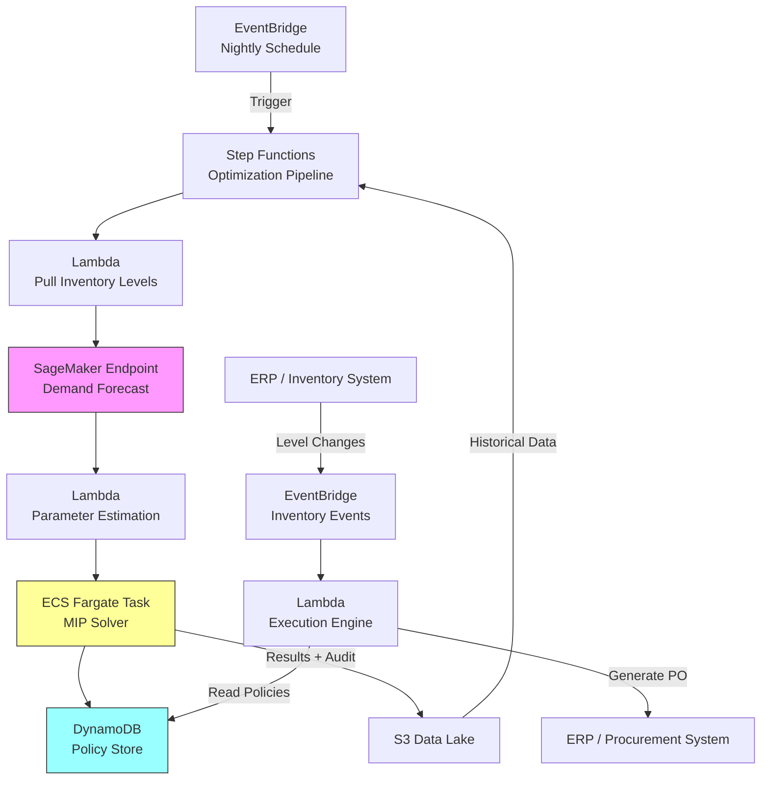

# Recipe 14.3 Architecture and Implementation: Inventory Reorder Optimization

*Companion to [Recipe 14.3: Inventory Reorder Optimization](chapter14.03-inventory-reorder-optimization). This page covers the AWS architecture, services, prerequisites, and pseudocode. For the problem framing and the conceptual approach, start with the main recipe.*

---

## Why These Services

**AWS Lambda for orchestration and execution logic.** The inventory monitoring and order generation logic is event-driven and stateless: check levels, compare to thresholds, generate orders. Lambda handles this cleanly without persistent infrastructure. The batch optimization trigger (nightly schedule) also fits Lambda's invocation model via EventBridge.

**Amazon SageMaker for demand forecasting.** The demand forecasting component (predicting future consumption per item) is a machine learning workload. SageMaker provides managed training and inference for time series models. For simpler approaches, SageMaker's built-in DeepAR algorithm handles multi-item time series forecasting out of the box.

**AWS Step Functions for the batch optimization pipeline.** The nightly optimization run is a multi-step workflow: pull current inventory, run demand forecasts, estimate parameters, invoke the solver, validate results, update policies. Step Functions orchestrates this sequence with built-in retry logic, error handling, and execution history.

**Amazon S3 for data lake and model artifacts.** Historical consumption data, demand forecasts, optimization results, and audit trails all live in S3. Parquet format for analytical queries, JSON for operational data.

**Amazon DynamoDB for the policy store.** Reorder policies need low-latency point lookups (the execution engine checks policies by item ID). DynamoDB's key-value model fits perfectly. Policies are small documents (reorder point, order quantity, last updated timestamp, criticality tier). Write access should be restricted to the optimization pipeline role only; the execution engine needs read access (GetItem) but should never modify policies directly.

**Amazon EventBridge for scheduling and event routing.** Triggers the nightly batch optimization, routes inventory-level events from the ERP integration, and dispatches order generation events.

**Amazon ECS (Fargate) for the optimization solver.** MIP solvers are CPU-intensive and may need more memory and runtime than Lambda allows (15-minute limit, 10GB memory). A Fargate task with the solver installed (HiGHS, CBC, or a commercial solver) handles the heavy computation. The task spins up on demand, solves, writes results, and terminates.

## Architecture Diagram



## Prerequisites

| Requirement | Details |
|-------------|---------|
| **AWS Services** | Lambda, Step Functions, SageMaker, ECS Fargate, DynamoDB, S3, EventBridge, CloudWatch |
| **IAM Permissions** | Per-component roles (see below). Step Functions execution role: `lambda:InvokeFunction`, `ecs:RunTask`, `sagemaker:InvokeEndpoint`. Lambda (parameter estimation): `s3:GetObject`, `sagemaker:InvokeEndpoint`, `s3:PutObject`. Lambda (execution engine): `dynamodb:GetItem`, `events:PutEvents`. ECS task role: `s3:GetObject` (parameters bucket), `s3:PutObject` (results bucket), `dynamodb:PutItem` (policies table only). Scope all permissions to specific resource ARNs. |
| **BAA** | Required if inventory data links to patient procedures (surgical supply consumption tied to case records) |
| **Encryption** | S3: SSE-KMS; DynamoDB: encryption at rest; all API calls over TLS |
| **VPC** | Production: ECS tasks and Lambda in VPC with endpoints for S3 (gateway), DynamoDB (gateway), SageMaker (interface), Step Functions (interface), CloudWatch Logs (interface), EventBridge (interface), KMS (interface if using CMK). Note: gateway endpoints are free; interface endpoints cost ~$7.20/month per AZ. |
| **Network (ERP)** | ERP connectivity typically uses AWS Direct Connect or Site-to-Site VPN for on-premises systems, or VPC PrivateLink for SaaS inventory platforms. Ensure the integration path is covered under your BAA if inventory data is linked to patient procedures. |
| **CloudTrail** | Enabled for audit trail of policy changes and order generation |
| **Sample Data** | Historical consumption data (item, quantity, date, location). Synthetic data generators available for testing. Never use data linkable to patient records in dev. |
| **Cost Estimate** | SageMaker inference: ~$50/month (ml.m5.large endpoint for forecasting). ECS Fargate solver: ~$5-20/month (nightly 10-minute task). Lambda + DynamoDB + S3: ~$10-30/month. Total: $65-200/month depending on item count and forecast complexity. |

## Ingredients

| AWS Service | Role |
|------------|------|
| **AWS Step Functions** | Orchestrates the nightly optimization pipeline end-to-end |
| **Amazon SageMaker** | Runs demand forecasting models (DeepAR or custom time series) |
| **Amazon ECS (Fargate)** | Executes the MIP solver for constrained optimization |
| **Amazon DynamoDB** | Stores reorder policies for low-latency operational lookups |
| **Amazon S3** | Data lake for historical consumption, forecasts, and optimization audit trails |
| **AWS Lambda** | Handles parameter estimation, execution logic, and ERP integration |
| **Amazon EventBridge** | Schedules batch runs and routes real-time inventory events |
| **Amazon CloudWatch** | Monitors solver performance, stockout events, and pipeline health |

## Pseudocode Walkthrough

**Step 1: Pull current inventory state.** The optimization pipeline starts by querying the current inventory management system (ERP, materials management system, or warehouse management system) for every item's current on-hand quantity, on-order quantity, and recent consumption history. This snapshot becomes the starting point for the optimization. Without accurate current state, the solver will calculate reorder points based on stale data, potentially triggering unnecessary orders or missing genuine stockouts. Most health systems expose this data via API or database views; the integration pattern depends on your specific ERP.

```pseudocode
FUNCTION pull_inventory_snapshot():
    // Query the inventory management system for current state of all managed items.
    // "managed items" = items under automated reorder optimization (not all SKUs may be enrolled).
    items = call ERP API: GET /inventory/items?status=active&managed=true

    snapshot = empty list

    FOR each item in items:
        // For each item, capture the data the optimizer needs:
        record = {
            item_id:          item.id,                    // unique SKU identifier
            description:      item.description,           // human-readable name
            on_hand:          item.current_quantity,      // units physically in stock right now
            on_order:         item.pending_orders_qty,    // units ordered but not yet received
            unit_cost:        item.unit_cost,             // cost per unit (for holding cost calculation)
            lead_time_days:   item.avg_lead_time,         // average days from order to receipt
            lead_time_stddev: item.lead_time_stddev,      // variability in lead time (critical for safety stock)
            criticality:      item.criticality_tier,      // "critical", "essential", or "standard"
            shelf_life_days:  item.shelf_life,            // days until expiration (null if non-perishable)
            min_order_qty:    item.minimum_order_quantity, // distributor's minimum order size
            storage_volume:   item.unit_volume_cubic_ft   // physical space per unit (for capacity constraint)
        }
        append record to snapshot

    // Persist the snapshot for audit and reproducibility.
    // If the optimizer produces unexpected results, you can trace back to the input state.
    save snapshot to S3: s3://data-lake/inventory/snapshots/{date}/items.parquet

    RETURN snapshot
```

**Step 2: Generate demand forecasts.** For each item, predict future demand over the planning horizon (typically the lead time plus review period). The forecast must produce both a point estimate (expected demand) and a measure of uncertainty (standard deviation or prediction intervals). The uncertainty drives safety stock calculations: items with highly variable demand need more buffer. A time series model trained on historical consumption handles seasonality (flu season, summer surgical schedules) and trend (growing patient volume). Skip this step and you're setting reorder points based on averages that ignore the patterns in your data.

```pseudocode
FUNCTION forecast_demand(snapshot, horizon_days):
    // For each item, generate a demand forecast over the planning horizon.
    // The horizon should cover lead_time + review_period (how often you check levels).
    
    forecasts = empty map

    // Batch items for efficient inference (SageMaker handles batch predictions well).
    item_ids = extract all item_id values from snapshot

    // Call the demand forecasting model.
    // Input: item IDs + horizon length.
    // Output: for each item, predicted demand mean and standard deviation over the horizon.
    // The model was trained on historical consumption data (see training pipeline separately).
    predictions = call SageMaker endpoint "demand-forecaster" with:
        instances = item_ids
        configuration = { "horizon_days": horizon_days, "quantiles": [0.5, 0.75, 0.95] }

    FOR each prediction in predictions:
        forecasts[prediction.item_id] = {
            demand_mean:   prediction.mean,       // expected units consumed over horizon
            demand_stddev: prediction.stddev,     // uncertainty in that estimate
            quantile_95:   prediction.q95         // 95th percentile demand (worst-case planning)
        }

    RETURN forecasts
```

**Step 3: Estimate optimization parameters.** Transform the raw forecasts and item attributes into the specific parameters the solver needs. This includes calculating holding costs (cost of keeping one unit in stock for one day), estimating stockout costs or translating service level targets into safety stock requirements, and computing demand-during-lead-time distributions. The criticality tier maps to a service level target: critical items get 99.5% (you can tolerate a stockout only 0.5% of the time), essential items get 98%, standard items get 95%. These targets drive how much safety stock the optimizer will allocate.

```pseudocode
FUNCTION estimate_parameters(snapshot, forecasts):
    // Convert raw data into solver-ready parameters for each item.
    
    // Service level targets by criticality tier.
    // These represent the probability of NOT stocking out during a replenishment cycle.
    SERVICE_LEVELS = {
        "critical":  0.995,   // crash cart meds, blood products, ventilator supplies
        "essential": 0.98,    // surgical supplies, common medications
        "standard":  0.95     // office supplies, non-urgent consumables
    }

    // Z-scores corresponding to service levels (from standard normal distribution).
    // Used to calculate safety stock: safety_stock = z * stddev_of_demand_during_lead_time.
    Z_SCORES = {
        0.995: 2.576,
        0.98:  2.054,
        0.95:  1.645
    }

    parameters = empty list

    FOR each item in snapshot:
        forecast = forecasts[item.item_id]
        
        // Demand during lead time: how much will be consumed while waiting for an order to arrive.
        // Mean: average daily demand * lead time days.
        // Stddev: accounts for both demand variability and lead time variability.
        demand_during_lt_mean = forecast.demand_mean * (item.lead_time_days / horizon_days)
        demand_during_lt_stddev = sqrt(
            item.lead_time_days * (forecast.demand_stddev / sqrt(horizon_days))^2 +
            (forecast.demand_mean / horizon_days)^2 * item.lead_time_stddev^2
        )

        // Safety stock: buffer to protect against demand/lead-time uncertainty.
        service_level = SERVICE_LEVELS[item.criticality]
        z = Z_SCORES[service_level]
        safety_stock = z * demand_during_lt_stddev

        // Holding cost: annual cost of keeping one unit in inventory.
        // Typically 20-30% of unit cost per year for healthcare supplies
        // (includes capital cost, storage, insurance, obsolescence risk).
        annual_holding_rate = 0.25  // 25% of unit cost per year
        daily_holding_cost = item.unit_cost * annual_holding_rate / 365

        // Ordering cost: fixed cost per purchase order (administrative processing).
        // Typical range: $20-$75 per order in healthcare procurement.
        ordering_cost = 50.00  // dollars per order placed

        // Annual demand: total expected consumption over a year.
        // Derived from the forecast's daily rate. The solver needs this for ordering cost calculation.
        annual_demand = (forecast.demand_mean / horizon_days) * 365

        params = {
            item_id:                item.item_id,
            demand_during_lt_mean:  demand_during_lt_mean,
            demand_during_lt_stddev: demand_during_lt_stddev,
            safety_stock:           safety_stock,
            daily_holding_cost:     daily_holding_cost,
            ordering_cost:          ordering_cost,
            unit_cost:              item.unit_cost,
            min_order_qty:          item.min_order_qty,
            shelf_life_days:        item.shelf_life_days,
            storage_volume:         item.storage_volume,
            criticality:            item.criticality,
            service_level:          service_level,
            annual_demand:          annual_demand,
            daily_demand_mean:      forecast.demand_mean / horizon_days
        }
        append params to parameters

    RETURN parameters
```

**Step 4: Solve the constrained optimization.** This is the core of the recipe. The solver takes all item parameters and system-wide constraints (total budget, total storage capacity) and finds the optimal reorder point and order quantity for each item simultaneously. "Simultaneously" is the key word: items compete for shared budget and storage space, so optimizing each item independently would violate system constraints. The MIP formulation handles integer order quantities, minimum order sizes, and the non-linear relationship between order quantity and average inventory level. Solve time depends on item count: hundreds of items solve in seconds, thousands in minutes. If the solver can't find a feasible solution (constraints are too tight), it reports which constraints are binding so you can make informed tradeoffs.

```pseudocode
FUNCTION solve_optimization(parameters, constraints):
    // Build and solve the Mixed-Integer Programming model.
    //
    // constraints = {
    //     total_budget:          500000,    // max total inventory value (dollars)
    //     total_storage_cubic_ft: 2000,     // max storage capacity
    //     max_solve_time_seconds: 300       // solver time limit (return best solution found)
    // }

    // Initialize the optimization model.
    model = create MIP model

    // Decision variables: reorder point and order quantity for each item.
    FOR each item in parameters:
        r[item.item_id] = add integer variable: reorder_point, lower_bound = item.safety_stock
        Q[item.item_id] = add integer variable: order_quantity, lower_bound = item.min_order_qty

    // Objective: minimize total annual cost across all items.
    // Total cost = sum of (holding cost + ordering cost) for each item.
    // Holding cost ~ (Q/2 + safety_stock) * daily_holding_cost * 365
    //   (average inventory is half the order quantity plus safety stock)
    // Ordering cost ~ (annual_demand / Q) * ordering_cost_per_order
    total_cost = 0
    FOR each item in parameters:
        avg_inventory = Q[item.item_id] / 2 + item.safety_stock
        holding = avg_inventory * item.daily_holding_cost * 365
        ordering = (item.annual_demand / Q[item.item_id]) * item.ordering_cost
        total_cost = total_cost + holding + ordering

    model.set_objective(MINIMIZE, total_cost)

    // Constraint: total inventory value must not exceed budget.
    // Use peak inventory (r + Q) for worst-case budget planning: this is the maximum
    // inventory level, reached the moment a new order arrives when stock is at the reorder point.
    budget_expr = sum of ((r[item.item_id] + Q[item.item_id]) * item.unit_cost) for all items
    model.add_constraint(budget_expr <= constraints.total_budget)

    // Constraint: total storage volume must not exceed capacity.
    // Also uses peak inventory (r + Q) since you need space for the full delivery.
    storage_expr = sum of ((r[item.item_id] + Q[item.item_id]) * item.storage_volume) for all items
    model.add_constraint(storage_expr <= constraints.total_storage_cubic_ft)

    // Constraint: for perishable items, order quantity should be consumable before expiration.
    FOR each item in parameters WHERE item.shelf_life_days is not null:
        max_qty_before_expiry = item.daily_demand_mean * item.shelf_life_days * 0.8  // 80% safety margin
        model.add_constraint(Q[item.item_id] <= max_qty_before_expiry)

    // Solve with time limit.
    result = model.solve(time_limit = constraints.max_solve_time_seconds)

    IF result.status == "infeasible":
        // No solution satisfies all constraints simultaneously.
        // Log which constraints are binding for human review.
        log_infeasibility_analysis(model)
        RETURN { status: "infeasible", binding_constraints: model.get_iis() }

    IF result.status == "error" OR result.status == "unbounded":
        // Solver encountered a problem. Keep current policies active (fail-safe).
        log_solver_error(result)
        RETURN { status: "error", message: result.error_message }

    // Extract optimal policies.
    policies = empty list
    FOR each item in parameters:
        policy = {
            item_id:        item.item_id,
            reorder_point:  value_of(r[item.item_id]),   // order when inventory drops to this level
            order_quantity: value_of(Q[item.item_id]),   // order this many units
            safety_stock:   item.safety_stock,           // buffer included in reorder point
            service_level:  item.service_level,          // target fill rate
            expected_annual_cost: holding + ordering for this item
        }
        append policy to policies

    RETURN {
        status: "optimal" or "time_limit_reached",
        objective_value: result.objective_value,   // total annual cost
        gap: result.optimality_gap,               // how close to proven optimal (0% = proven)
        policies: policies
    }
```

**Step 5: Validate and store policies.** Before committing new policies to the operational store, validate them against sanity checks. A reorder point that jumped 500% overnight probably indicates a data issue, not a genuine need. Compare new policies against current ones and flag dramatic changes for human review. Once validated, write to the policy store with versioning so you can track policy evolution over time and roll back if needed. A GSI on `solver_run_id` enables efficient rollback: query all policies from a specific run and revert them in batch.

```pseudocode
FUNCTION validate_and_store(solver_result, current_policies):
    // Sanity checks before committing new policies to production.
    
    CHANGE_THRESHOLD = 2.0  // flag if reorder point changes by more than 100%
    
    validated = empty list
    flagged_for_review = empty list

    FOR each new_policy in solver_result.policies:
        current = lookup current_policies by new_policy.item_id

        IF current exists:
            // Check for dramatic changes that might indicate data issues.
            reorder_change_ratio = new_policy.reorder_point / current.reorder_point
            
            IF reorder_change_ratio > CHANGE_THRESHOLD OR reorder_change_ratio < (1 / CHANGE_THRESHOLD):
                // Flag for human review but don't block.
                append to flagged_for_review: {
                    item_id: new_policy.item_id,
                    old_reorder_point: current.reorder_point,
                    new_reorder_point: new_policy.reorder_point,
                    change_ratio: reorder_change_ratio,
                    reason: "reorder point changed by more than 100%"
                }

        append new_policy to validated

    // Write validated policies to DynamoDB with version tracking.
    FOR each policy in validated:
        write to DynamoDB table "reorder-policies":
            item_id         = policy.item_id          // partition key
            version         = current_timestamp       // sort key for history
            reorder_point   = policy.reorder_point
            order_quantity  = policy.order_quantity
            safety_stock    = policy.safety_stock
            service_level   = policy.service_level
            solver_run_id   = solver_result.run_id    // trace back to specific optimization run
            status          = "active"

    // Notify materials management team of flagged items.
    IF flagged_for_review is not empty:
        send notification with flagged_for_review details

    RETURN { stored: length(validated), flagged: length(flagged_for_review) }
```

**Step 6: Execute reorder decisions.** The execution engine runs continuously (or on inventory-level-change events from the ERP). When an item's effective inventory (on-hand plus on-order) drops to or below its reorder point, generate a purchase order. This step is deliberately simple: all the intelligence lives in the policy calculation. The execution layer just compares numbers and triggers orders. This separation means you can update policies without touching execution logic, and you can test new policies in simulation before deploying them.

Reorder events are written to an immutable audit log (S3 with Object Lock or a dedicated CloudWatch Log Group with a retention policy). Each log entry includes the decision inputs (current level, reorder point, policy version) alongside the action taken, enabling full traceability for procurement audits.

```pseudocode
FUNCTION check_and_reorder(inventory_event):
    // Triggered when an item's inventory level changes (consumption, receipt, adjustment).
    
    item_id = inventory_event.item_id
    current_on_hand = inventory_event.new_quantity
    current_on_order = inventory_event.pending_orders

    // Effective inventory: what you have plus what's already coming.
    effective_inventory = current_on_hand + current_on_order

    // Look up the active policy for this item.
    policy = read from DynamoDB "reorder-policies" where item_id = item_id and status = "active"

    IF policy is null:
        // Item not under automated management. Skip.
        RETURN { action: "none", reason: "no active policy" }

    IF effective_inventory <= policy.reorder_point:
        // Inventory has dropped to or below the reorder point. Time to order.
        
        // Generate purchase order.
        order = {
            item_id:       item_id,
            quantity:      policy.order_quantity,
            priority:      "standard",
            triggered_by:  "automated_reorder",
            policy_version: policy.version,
            effective_inventory_at_trigger: effective_inventory,
            reorder_point: policy.reorder_point
        }

        // For critical items below safety stock, escalate priority.
        IF current_on_hand < policy.safety_stock AND policy.service_level >= 0.99:
            order.priority = "urgent"

        // Submit to procurement system.
        submit_purchase_order(order)

        // Log to immutable audit store with full decision context.
        log_reorder_event(order)

        RETURN { action: "order_placed", order: order }

    RETURN { action: "none", reason: "above reorder point" }
```

> **Curious how this looks in Python?** The pseudocode above covers the concepts. If you'd like to see sample Python code that demonstrates these patterns using boto3, check out the [Python Example](chapter14.03-python-example). It walks through each step with inline comments and notes on what you'd need to change for a real deployment.

## Expected Results

**Sample policy output for a surgical supply item:**

```json
{
  "item_id": "SKU-04821-CATH-KIT",
  "description": "Central Line Catheter Kit, 7Fr Triple Lumen",
  "reorder_point": 42,
  "order_quantity": 60,
  "safety_stock": 18,
  "service_level": 0.995,
  "criticality": "critical",
  "expected_annual_holding_cost": 1847.50,
  "expected_annual_ordering_cost": 304.17,
  "solver_run_id": "opt-2026-06-01-0300Z",
  "status": "active"
}
```

**Performance benchmarks:**

| Metric | Typical Value |
|--------|---------------|
| Solver time (1,000 items) | 30-120 seconds |
| Solver time (5,000 items) | 3-8 minutes |
| Optimality gap | < 1% (proven optimal for most instances) |
| Inventory cost reduction vs. manual | 15-25% |
| Stockout rate improvement | 40-60% reduction |
| Forecast accuracy (MAPE) | 15-30% depending on item variability |
| End-to-end pipeline (nightly) | 15-30 minutes |

**Where it struggles:** Items with extremely sporadic demand (used once a month, then three times in a day). New items with no consumption history (cold-start problem). Supply chain disruptions that invalidate lead time assumptions. Items where demand is driven by a single physician's preference (one surgeon leaves, demand drops to zero overnight).

<!-- TODO (TechWriter): RECIPE-GUIDE requires a "Why This Isn't Production-Ready" section between Expected Results and Variations. Add 3-5 bullets on gaps a production deployment must close. -->

---

## Variations and Extensions

**Multi-location optimization.** Health systems with multiple facilities can optimize across locations: redistribute excess inventory from one site to another rather than ordering new stock. This adds transfer costs and inter-facility logistics but can significantly reduce system-wide inventory investment. The solver becomes a network flow problem with transshipment nodes.

**Demand-driven replenishment with ML.** Replace the statistical demand forecasting with an ML model that incorporates external signals: scheduled surgical cases (you know exactly which implants you'll need next Tuesday), seasonal flu forecasts, local event calendars that affect ED volume. The more predictive your demand model, the less safety stock you need, which directly reduces holding costs.

**Vendor-managed inventory (VMI) integration.** Some distributors offer VMI programs where they monitor your inventory levels and ship automatically. The optimization model shifts from "when should I order" to "what service level agreement should I negotiate with the vendor, and how do I validate they're meeting it." The architecture adds a monitoring layer that compares actual vendor performance against contracted SLAs.

---

## Additional Resources

**AWS Documentation:**
- [Amazon SageMaker DeepAR Forecasting Algorithm](https://docs.aws.amazon.com/sagemaker/latest/dg/deepar.html)
- [AWS Step Functions Developer Guide](https://docs.aws.amazon.com/step-functions/latest/dg/welcome.html)
- [Amazon ECS on Fargate](https://docs.aws.amazon.com/AmazonECS/latest/developerguide/AWS_Fargate.html)
- [Amazon DynamoDB Developer Guide](https://docs.aws.amazon.com/amazondynamodb/latest/developerguide/Introduction.html)
- [AWS HIPAA Eligible Services](https://aws.amazon.com/compliance/hipaa-eligible-services-reference/)
- [Amazon EventBridge Scheduler](https://docs.aws.amazon.com/scheduler/latest/UserGuide/what-is-scheduler.html)

**AWS Sample Repos:**
- [`amazon-sagemaker-examples`](https://github.com/aws/amazon-sagemaker-examples): Includes time series forecasting notebooks with DeepAR
- [`aws-step-functions-data-science-sdk-python`](https://github.com/aws/aws-step-functions-data-science-sdk-python): Building ML pipelines with Step Functions

**AWS Solutions and Blogs:**
- [Improving Forecast Accuracy with Machine Learning](https://aws.amazon.com/solutions/implementations/improving-forecast-accuracy-with-machine-learning/): Deployable solution for demand forecasting

---

## Estimated Implementation Time

| Tier | Timeline | What You Get |
|------|----------|--------------|
| **Basic** | 4-6 weeks | Single-location, batch nightly optimization for top 500 items. Statistical demand forecasting. Manual criticality classification. |
| **Production-ready** | 3-4 months | Full item catalog. ML-based demand forecasting. ERP integration for real-time execution. Alerting and monitoring. Expiration handling. |
| **With variations** | 6-9 months | Multi-location with redistribution. Vendor-managed inventory integration. Order consolidation for volume discounts. Demand sensing from surgical schedules. |

---

*← [Main Recipe 14.3](chapter14.03-inventory-reorder-optimization) · [Python Example](chapter14.03-python-example) · [Chapter Preface](chapter14-preface)*
