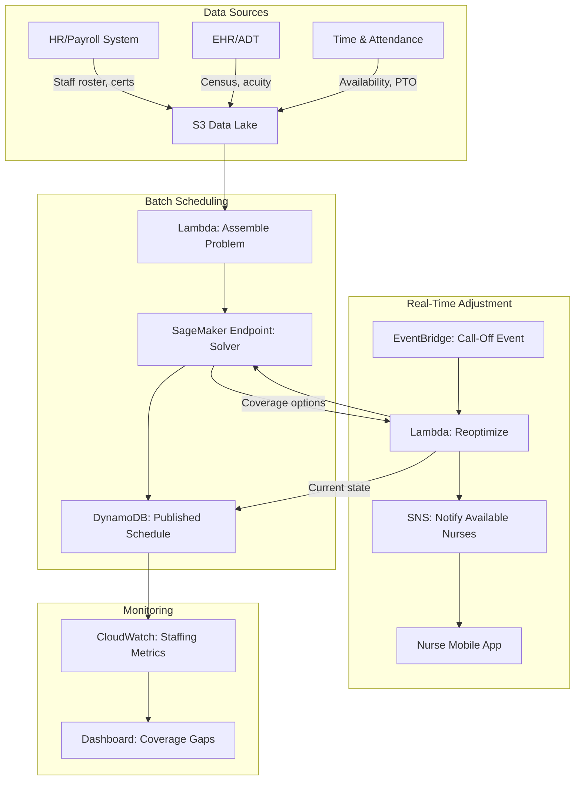

# Recipe 14.4 Architecture and Implementation: Nurse Staffing Optimization

*Companion to [Recipe 14.4: Nurse Staffing Optimization](chapter14.04-nurse-staffing-optimization). This page covers the AWS architecture, services, prerequisites, and pseudocode. For the problem framing and the conceptual approach, start with the main recipe.*

---

## Why These Services

**Amazon SageMaker for solver hosting.** The optimization solver (whether you're using OR-Tools, HiGHS, or a commercial solver) needs compute. SageMaker provides managed infrastructure for running optimization workloads: you package your solver as a container, deploy it as an endpoint for real-time requests, or run batch transform jobs for schedule generation. For the real-time path (where 2-5 second response times are required), configure a minimum instance count of 1 so the endpoint never scales to zero. Cold starts on SageMaker endpoints can take 3-5 minutes, which is incompatible with the "nurse called off at 5 AM" scenario. An alternative for the real-time path: run the solver directly in Lambda (OR-Tools fits in a Lambda deployment package under 250MB), trading the 15-minute maximum runtime and 10GB memory limit for guaranteed cold-start latency under 10 seconds. The batch path benefits from SageMaker's larger instance types and longer runtimes.

**AWS Lambda for orchestration and event handling.** The glue between systems: receiving call-off notifications, triggering reoptimization, publishing results. Lambda's event-driven model fits the real-time adjustment workflow perfectly. A call-off event arrives, Lambda assembles the current state, invokes the solver endpoint, and routes the recommendation.

**Amazon DynamoDB for schedule state.** The current schedule, staff availability, and constraint parameters need fast read/write access. DynamoDB's key-value model works well for schedule lookups (get all shifts for nurse X, get all nurses for shift Y on date Z). Global secondary indexes support the multiple access patterns. For the real-time path, use DynamoDB conditional writes or transactions to prevent race conditions: before assigning a nurse to cover a gap, verify atomically that she hasn't already been assigned by a concurrent request.

**Amazon EventBridge for event routing.** Call-offs, census changes, schedule publications, and manual overrides are events that trigger downstream workflows. EventBridge provides the event bus that connects the scheduling system to notification services, dashboards, and audit logs.

**Amazon S3 for historical data and model artifacts.** Historical schedules, demand forecasts, and solver configurations live in S3. The batch scheduling pipeline reads from S3 (staff data, constraints, demand forecast) and writes results back.

**Amazon SNS for notifications.** When the solver recommends coverage options, nurses need to be notified. SNS handles multi-channel delivery (SMS, push notification, email) with delivery tracking. Important: SMS messages traverse carrier networks in plaintext beyond the AWS boundary. Coverage request notifications sent via SMS should contain only the shift time, unit name, and overtime status. Never include patient census, acuity, or reason-for-need in SMS notifications. For richer context, use push notifications via an encrypted mobile app with certificate pinning and at-rest encryption on the device.

## Architecture Diagram



## Prerequisites

| Requirement | Details |
|-------------|---------|
| **AWS Services** | Amazon SageMaker, AWS Lambda, Amazon DynamoDB, Amazon EventBridge, Amazon S3, Amazon SNS, Amazon CloudWatch |
| **IAM Permissions** | `sagemaker:InvokeEndpoint`, `dynamodb:GetItem/PutItem/Query`, `s3:GetObject/PutObject`, `sns:Publish`, `events:PutEvents`. Production: scope DynamoDB permissions to specific table ARNs per function. Use separate IAM roles for assembly, solver invocation, and publication functions. |
| **BAA** | Required: staff schedules combined with unit assignments can constitute workforce PHI adjacent data; census/acuity data is PHI |
| **Encryption** | S3: SSE-KMS; DynamoDB: encryption at rest; all API calls over TLS; SNS messages encrypted in transit (note: SMS delivery beyond AWS is plaintext) |
| **VPC** | Production: Lambda and SageMaker in VPC with endpoints: S3 (gateway), DynamoDB (gateway), SageMaker Runtime (interface), EventBridge (interface), SNS (interface), CloudWatch Logs (interface), KMS (interface). Interface endpoints cost ~$7-8/month each in a 3-AZ deployment (~$35-50/month total). |
| **CloudTrail** | Enabled: audit all schedule modifications, solver invocations, and manual overrides |
| **Solver** | Google OR-Tools CP-SAT (open-source, Apache 2.0) or HiGHS (open-source, MIT) packaged in SageMaker container. Commercial options: Gurobi, CPLEX (require separate licensing) |
| **Sample Data** | Synthetic staff roster with certifications, shift patterns, and availability. Never use real employee data in dev. |
| **Cost Estimate** | SageMaker real-time endpoint (ml.m5.large, min 1 instance): ~$0.12/hr (~$86/month). Lambda invocations: negligible. DynamoDB on-demand: ~$5-20/month depending on schedule size. Total: ~$100-200/month for a single hospital. |

## Ingredients

| AWS Service | Role |
|------------|------|
| **Amazon SageMaker** | Hosts optimization solver as a managed endpoint; handles batch and real-time requests |
| **AWS Lambda** | Orchestrates problem assembly, solver invocation, and result routing |
| **Amazon DynamoDB** | Stores current schedule state, staff availability, and constraint parameters |
| **Amazon EventBridge** | Routes scheduling events (call-offs, census changes, schedule publications, manual overrides) |
| **Amazon S3** | Stores historical data, demand forecasts, solver configurations, and model artifacts |
| **Amazon SNS** | Delivers coverage request notifications to nurses via SMS/push |
| **Amazon CloudWatch** | Monitors solver performance, staffing coverage metrics, and system health |
| **AWS KMS** | Manages encryption keys for data at rest |

## Pseudocode Walkthrough

**Step 1: Assemble the optimization problem.** Before the solver can run, you need to gather all inputs and translate them into a structured problem definition. This means pulling the staff roster (who's available, what are their certifications, what's their FTE commitment), the demand forecast (how many nurses per unit per shift), and the constraint set (labor rules, preferences, fairness targets). The output is a JSON problem definition that the solver can consume. Skip this step or get the data wrong, and the solver will produce schedules that violate rules you forgot to encode, which is worse than no optimization at all because people trust the output.

```pseudocode
FUNCTION assemble_scheduling_problem(schedule_period):
    // Pull staff data: who is available for this scheduling period?
    // Each staff member has: name, certifications, FTE (0.5, 0.75, 1.0),
    // contracted hours per period, shift preferences, and PTO blocks.
    staff_roster = fetch from HR system for schedule_period
    
    // Pull demand: how many nurses do we need per unit per shift?
    // This comes from the demand forecasting model (Recipe 12.5).
    // Output: for each (unit, shift, day) tuple, a required headcount
    // and required skill mix (e.g., "at least 1 charge RN, 2 tele-certified").
    // Fallback: if forecasting service is unavailable, use static staffing
    // matrix from configuration (unit type -> baseline headcount per shift).
    demand_forecast = fetch from forecasting service for schedule_period
    IF demand_forecast is unavailable:
        demand_forecast = load static staffing matrix from configuration
    
    // Pull constraints: the rules that govern valid schedules.
    // These are stored as configuration, not code, because they change
    // when union contracts are renegotiated or state laws update.
    constraints = fetch from constraint configuration store
    // Example constraints:
    //   - max_consecutive_days: 5
    //   - min_hours_between_shifts: 11
    //   - max_hours_per_week: 60
    //   - weekend_pairs: true (if you work Saturday, you work Sunday)
    //   - charge_nurse_required: true per shift per unit
    
    // Pull preferences: what do individual nurses want?
    // Stored as soft constraints with penalty weights.
    // NOTE: Preference data may contain sensitive personal information
    // (medical restrictions, childcare constraints). Treat as ephemeral:
    // delete the assembled problem definition after the solver completes.
    preferences = fetch from staff preference system
    // Example: Nurse Smith prefers day shifts (weight: 3),
    //          Nurse Jones prefers no more than 2 weekends/month (weight: 5)
    
    // Assemble into a single problem definition
    problem = {
        period: schedule_period,
        staff: staff_roster,
        demand: demand_forecast,
        hard_constraints: constraints.hard,
        soft_constraints: constraints.soft,
        preferences: preferences,
        objective_weights: {
            cost: 0.3,    // minimize overtime and agency usage
            fairness: 0.4,    // distribute undesirable shifts equitably
            preference: 0.3     // satisfy individual preferences
        }
    }
    
    RETURN problem
```

**Step 2: Formulate as a mathematical program.** This is where the problem definition becomes math. Each nurse-shift-day combination becomes a binary decision variable. Each rule becomes a constraint equation. The objective function combines cost, fairness, and preference satisfaction into a single number the solver will minimize. This formulation step is the intellectual core of the system. Get it wrong and the solver will find "optimal" solutions that are operationally useless. The formulation must be validated against known-good historical schedules before going live.

```pseudocode
FUNCTION formulate_optimization_model(problem):
    // Create the model container. This holds all variables, constraints,
    // and the objective function.
    model = create new optimization model
    
    // DECISION VARIABLES
    // x[n][s][d] = 1 if nurse n works shift s on day d, 0 otherwise
    // This is the thing we're solving for.
    FOR each nurse n in problem.staff:
        FOR each shift s in all_shifts:
            FOR each day d in problem.period:
                x[n][s][d] = model.add_binary_variable()
    
    // HARD CONSTRAINTS
    
    // 1. Each nurse works at most one shift per day
    FOR each nurse n, each day d:
        model.add_constraint: sum(x[n][s][d] for all shifts s) <= 1
    
    // 2. Minimum rest between shifts (11 hours)
    // If a nurse works a night shift ending at 7 AM,
    // they cannot work a day shift starting at 7 AM the next day.
    FOR each nurse n, each consecutive day pair (d, d+1):
        FOR each shift pair (s1, s2) where gap < 11 hours:
            model.add_constraint: x[n][s1][d] + x[n][s2][d+1] <= 1
    
    // 3. Demand coverage: enough qualified nurses on every shift
    FOR each unit u, each shift s, each day d:
        required = problem.demand[u][s][d]
        qualified_nurses = nurses with certifications matching unit u
        model.add_constraint: sum(x[n][s][d] for n in qualified_nurses) >= required
    
    // 4. Maximum hours per week
    FOR each nurse n, each week w in problem.period:
        hours_in_week = sum(x[n][s][d] * shift_duration(s) 
                           for all s, d in week w)
        model.add_constraint: hours_in_week <= problem.hard_constraints.max_hours_per_week
    
    // 5. PTO blocks: nurse is unavailable
    FOR each nurse n, each approved PTO day d:
        FOR each shift s:
            model.add_constraint: x[n][s][d] == 0
    
    // SOFT CONSTRAINTS (penalized in objective)
    
    // Fairness: track weekend shifts per nurse
    FOR each nurse n:
        weekend_count[n] = sum(x[n][s][d] for all s, d where d is Saturday or Sunday)
    // Penalize deviation from the average
    avg_weekends = total_weekend_shifts_needed / number_of_nurses
    FOR each nurse n:
        fairness_penalty[n] = absolute_deviation(weekend_count[n], avg_weekends)
    
    // Preference satisfaction: penalize assignments that violate preferences
    FOR each nurse n, each preference p in problem.preferences[n]:
        preference_violation[n][p] = compute violation of preference p given x[n]
    
    // OBJECTIVE FUNCTION
    // Minimize: weighted combination of cost, unfairness, and preference violations
    total_cost = sum(overtime_cost(n) for all n)  // overtime hours * premium rate
    total_unfairness = sum(fairness_penalty[n] for all n)
    total_pref_violation = sum(preference_violation[n][p] * p.weight for all n, p)
    
    model.minimize(
        problem.objective_weights.cost * total_cost +
        problem.objective_weights.fairness * total_unfairness +
        problem.objective_weights.preference * total_pref_violation
    )
    
    RETURN model
```

**Step 3: Solve and extract the schedule.** Hand the formulated model to the solver engine and let it work. For batch scheduling, you can afford to let it run for minutes. The solver will explore the solution space using branch-and-bound (for MIP) or propagation-and-search (for CP), progressively finding better solutions until it either proves optimality or hits a time limit. The output is the set of variable assignments: which nurse works which shift on which day. You then translate those assignments back into a human-readable schedule.

If the solver returns "infeasible" (no valid schedule exists given the constraints), that's actually valuable information: it means you're understaffed for the demand, and you need to relax a constraint or add staff. Modern solvers support Irreducible Infeasible Subsystem (IIS) analysis that identifies the minimal set of conflicting constraints. For example: "Nurse RN-4821 has approved PTO on June 14, but she is the only charge-certified nurse available for the night shift that day." This tells the manager exactly which constraint to relax: approve overtime for another charge nurse, or negotiate the PTO.

```pseudocode
FUNCTION solve_and_extract(model, time_limit_seconds):
    // Configure solver parameters
    solver_config = {
        time_limit: time_limit_seconds,  // batch: 300s, real-time: 10s
        optimality_gap: 0.02,               // stop if within 2% of optimal
        threads: 4                     // parallel search
    }
    
    // Run the solver
    result = model.solve(solver_config)
    
    // Check solver status
    IF result.status == "INFEASIBLE":
        // No valid schedule exists. Return the conflict analysis so the
        // manager knows which constraints conflict and what to relax.
        // IIS analysis identifies the smallest set of constraints that
        // cannot all be satisfied simultaneously.
        RETURN { status: "infeasible", diagnosis: result.conflict_analysis() }
    
    IF result.status == "OPTIMAL" OR result.status == "FEASIBLE":
        // Extract the schedule from variable assignments
        schedule = empty list
        
        FOR each nurse n:
            FOR each shift s:
                FOR each day d:
                    IF x[n][s][d].value == 1:
                        append to schedule: {
                            nurse_id: n.id,
                            nurse_name: n.name,
                            shift: s,
                            day: d,
                            unit: assigned_unit(n, s, d),
                            is_overtime: is_overtime_shift(n, s, d),
                            certifications: n.certifications
                        }
        
        // Compute quality metrics
        metrics = {
            optimality_gap: result.gap,          // how close to proven optimal
            total_overtime_hours: compute_overtime(schedule),
            fairness_score: compute_fairness(schedule),  // 0-1, higher is fairer
            preference_score: compute_pref_satisfaction(schedule),
            unfilled_shifts: count_unfilled(schedule, demand),
            solve_time_seconds: result.solve_time
        }
        
        RETURN { status: "solved", schedule: schedule, metrics: metrics }
```

**Step 4: Handle real-time disruptions.** The batch schedule is the plan. Reality is what happens next. When a nurse calls off, the system needs to find coverage fast. This step takes the current schedule state, removes the unavailable nurse, and re-solves with tight constraints: minimize changes to the existing schedule, find the best available replacement, and rank options by likelihood of acceptance. The solver runs in seconds, not minutes, because the problem is much smaller (you're only filling one or two gaps, not rebuilding the entire schedule).

Concurrency matters here. If two call-offs arrive simultaneously (not uncommon on a holiday morning), both requests read the same schedule state and may identify the same top candidate. Use a DynamoDB conditional write or transaction to verify the candidate is still unscheduled before assigning coverage. Without this, you risk double-booking a nurse to two units.

```pseudocode
FUNCTION handle_calloff(calloff_event):
    // A nurse has called off. We need coverage.
    // calloff_event contains: nurse_id, shift, day, unit, reason
    
    // Load current schedule state
    current_schedule = fetch from schedule database
    
    // Identify the gap
    gap = {
        shift: calloff_event.shift,
        day: calloff_event.day,
        unit: calloff_event.unit,
        required_certs: get_required_certifications(calloff_event.unit)
    }
    
    // Find eligible nurses (not already scheduled, qualified, available)
    candidates = []
    FOR each nurse n in staff_roster:
        IF n.id == calloff_event.nurse_id: CONTINUE  // skip the one who called off
        IF not has_required_certs(n, gap.required_certs): CONTINUE
        IF is_scheduled(n, gap.day): CONTINUE  // already working
        IF violates_rest_rule(n, gap.shift, gap.day, current_schedule): CONTINUE
        IF exceeds_max_hours(n, gap.shift, current_schedule): CONTINUE
        IF is_on_pto(n, gap.day): CONTINUE
        
        // Score this candidate
        score = compute_coverage_score(n, gap, current_schedule)
        // Score considers: overtime cost, fairness impact, historical acceptance rate,
        // distance from home (if known), consecutive days worked
        
        append to candidates: { nurse: n, score: score }
    
    // Sort by score (best candidates first)
    sort candidates by score descending
    
    // Before auto-assigning, use a conditional write to verify the candidate
    // is still unscheduled (prevents race conditions from concurrent call-offs)
    IF candidates[0].score > AUTO_THRESHOLD:
        success = conditional_write_assignment(candidates[0], gap)
        // ConditionExpression: attribute_not_exists(nurse_id) on that shift/day
        IF not success:
            // Another concurrent request assigned this nurse; try next candidate
            retry with candidates[1]
    
    // Return ranked recommendations
    RETURN {
        gap: gap,
        candidates: candidates[0:10],  // top 10 options
        auto_assign: candidates[0] if auto-assigned else null,
        notify_list: candidates[0:5]    // nurses to contact for voluntary pickup
    }
```

**Step 5: Publish and notify.** The generated schedule (or coverage recommendation) needs to reach the right people. For batch schedules, publish to the scheduling system and notify all affected staff. For real-time coverage, send targeted notifications to the ranked candidate list. Track responses (accepted, declined, no response) to improve future scoring. Every schedule change gets an audit record, whether automated or manual.

```pseudocode
FUNCTION publish_schedule(schedule, schedule_type):
    // Write the schedule to the database
    FOR each assignment in schedule:
        write to schedule database:
            partition_key: assignment.day
            sort_key: assignment.shift + "#" + assignment.nurse_id
            nurse_id: assignment.nurse_id
            unit: assignment.unit
            shift_start: shift_start_time(assignment.shift)
            shift_end: shift_end_time(assignment.shift)
            is_overtime: assignment.is_overtime
            published_at: current UTC timestamp
            schedule_type: schedule_type  // "batch" or "realtime_adjustment"
            version: increment version for optimistic locking
    
    // Notify affected staff
    IF schedule_type == "batch":
        // Notify all nurses of their upcoming schedule
        FOR each nurse in affected_nurses(schedule):
            send notification via SNS:
                channel: nurse.preferred_notification_channel
                message: format_schedule_summary(schedule, nurse)
    
    ELSE IF schedule_type == "coverage_request":
        // Notify ranked candidates for voluntary pickup
        // IMPORTANT: SMS notifications must contain ONLY shift time, unit name,
        // and overtime status. No patient census, acuity, or reason-for-need.
        // SMS traverses carrier networks in plaintext beyond AWS.
        // For richer context, use push notifications via encrypted mobile app.
        FOR each candidate in schedule.notify_list:
            send notification via SNS:
                channel: candidate.nurse.preferred_notification_channel
                message: format_coverage_request_sanitized(schedule.gap, candidate)
                // Include only: shift time, unit name, overtime yes/no, response deadline
    
    // Emit event for downstream systems (dashboards, audit, analytics)
    publish event to EventBridge:
        source: "scheduling-service"
        detail_type: "SchedulePublished"
        detail: { schedule_id, schedule_type, period, metrics }
    
    // Audit trail (covers both automated and manual changes)
    write audit record:
        action: "schedule_published"
        timestamp: current UTC timestamp
        schedule: schedule summary (not full detail, for log size)
        metrics: schedule.metrics
        modified_by: "system" or manager_id for manual overrides
```

> **Curious how this looks in Python?** The pseudocode above covers the concepts. If you'd like to see sample Python code that demonstrates these patterns using boto3 and Google OR-Tools, check out the [Python Example](chapter14.04-python-example). It walks through each step with inline comments and notes on what you'd need to change for a real deployment.

## Expected Results

**Sample output for a 2-week schedule (36-bed med-surg unit, 42 nurses):**

```json
{
  "schedule_id": "sched-2026-w23-medsurg-4n",
  "period": { "start": "2026-06-08", "end": "2026-06-21" },
  "status": "solved",
  "metrics": {
    "optimality_gap": 0.014,
    "total_shifts_filled": 294,
    "total_shifts_required": 294,
    "coverage_rate": 1.0,
    "overtime_hours": 36,
    "overtime_shifts": 3,
    "fairness_score": 0.91,
    "preference_satisfaction": 0.78,
    "solve_time_seconds": 42.3
  },
  "assignments": [
    {
      "nurse_id": "RN-4821",
      "nurse_name": "Sarah Chen",
      "shifts": [
        { "day": "2026-06-08", "shift": "day", "unit": "4N", "is_overtime": false },
        { "day": "2026-06-09", "shift": "day", "unit": "4N", "is_overtime": false },
        { "day": "2026-06-10", "shift": "day", "unit": "4N", "is_overtime": false }
      ],
      "total_hours": 36,
      "weekend_shifts": 1
    }
  ],
  "warnings": [
    "Nurse RN-3392 has 4 consecutive days (soft constraint violated, penalty applied)",
    "Weekend fairness deviation: max 3 weekends, min 1 weekend across staff"
  ]
}
```

**Performance benchmarks:**

| Metric | Typical Value |
|--------|---------------|
| Batch solve time (40 nurses, 14 days) | 30-120 seconds |
| Real-time coverage solve time | 2-5 seconds |
| Optimality gap (batch) | 1-3% |
| Coverage rate (well-staffed unit) | 98-100% |
| Fairness score improvement vs. manual | 15-30% more equitable |
| Preference satisfaction | 70-85% of soft constraints met |
| Cost reduction vs. manual scheduling | 5-15% (primarily overtime reduction) |

**Where it struggles:** Units with very few qualified staff (the problem becomes infeasible easily). Rapid census changes that invalidate the demand forecast. Facilities with complex seniority-based bidding systems that are hard to encode. And the cold-start problem: the solver needs historical data on call-off rates and acceptance patterns to score candidates well.

---

<!-- TODO (TechWriter): RECIPE-GUIDE compliance. Add "Why This Isn't Production-Ready" section before Variations, per architecture companion template. -->

## Variations and Extensions

**Multi-unit float pool optimization.** Extend the model to include float pool nurses who can be assigned to any unit based on qualifications. The solver decides both the unit assignment and the shift assignment simultaneously. This is particularly valuable for health systems with centralized staffing offices.

**Predictive call-off modeling.** Instead of reacting to call-offs, predict them. Historical patterns (Monday after a holiday weekend, flu season, specific nurses with higher call-off rates) can feed a probability model that pre-positions coverage. The solver can build "buffer" assignments for high-risk shifts.

**Self-scheduling with optimization guardrails.** Let nurses bid on preferred shifts first (self-scheduling), then run the optimizer to fill remaining gaps and resolve conflicts. This hybrid approach improves nurse satisfaction while maintaining coverage guarantees. The solver acts as a "fixer" rather than a "dictator."

---

## Additional Resources

**AWS Documentation:**
- [Amazon SageMaker Inference Endpoints](https://docs.aws.amazon.com/sagemaker/latest/dg/deploy-model.html)
- [Amazon SageMaker Bring Your Own Container](https://docs.aws.amazon.com/sagemaker/latest/dg/docker-containers.html)
- [Amazon EventBridge User Guide](https://docs.aws.amazon.com/eventbridge/latest/userguide/eb-what-is.html)
- [Amazon DynamoDB Developer Guide](https://docs.aws.amazon.com/amazondynamodb/latest/developerguide/Introduction.html)
- [AWS Lambda Developer Guide](https://docs.aws.amazon.com/lambda/latest/dg/welcome.html)

**Solver Documentation:**
- [Google OR-Tools CP-SAT Solver](https://developers.google.com/optimization/cp/cp_solver)
- [Google OR-Tools Nurse Scheduling Example](https://developers.google.com/optimization/scheduling/employee_scheduling)
- [HiGHS Optimization Solver](https://highs.dev/)

<!-- TODO (TechWriter): Expert review V2 (LOW). Verify and add URLs for Burke et al. "The State of the Art of Nurse Rostering" survey paper and INFORMS Healthcare conference proceedings, or remove this subsection if links cannot be verified. -->

---

## Estimated Implementation Time

| Tier | Timeline | What You Get |
|------|----------|--------------|
| **Basic** | 4-6 weeks | Single-unit batch scheduling with hard constraints only. Manual trigger. CSV export. |
| **Production-ready** | 3-5 months | Multi-unit scheduling with soft constraints, real-time call-off handling, mobile notifications, dashboard, audit trail. |
| **With variations** | 6-9 months | Float pool optimization, predictive call-off modeling, self-scheduling integration, multi-facility coordination. |

---

*← [Main Recipe 14.4](chapter14.04-nurse-staffing-optimization) · [Python Example](chapter14.04-python-example) · [Chapter Preface](chapter14-preface)*
