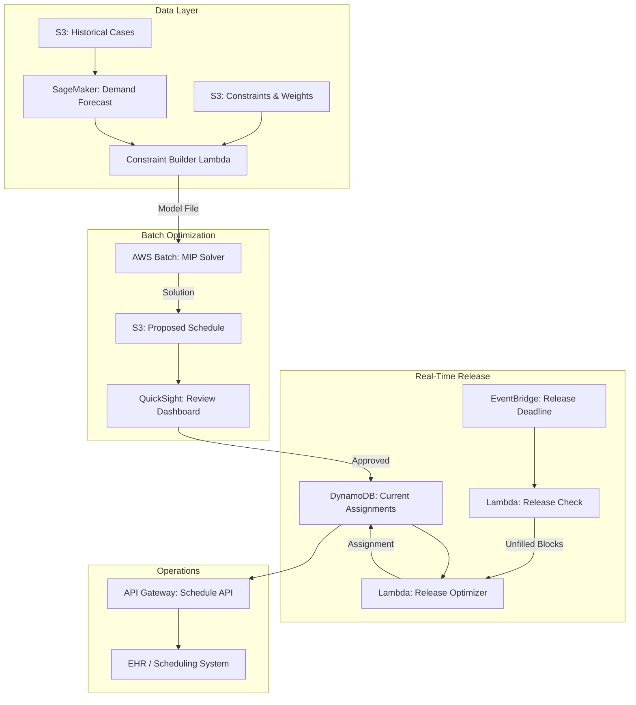

# Recipe 14.5: Operating Room Block Scheduling

**Complexity:** Medium · **Phase:** Production · **Estimated Cost:** ~$200-800/month (solver compute)

---

## The Problem

Every Monday morning, the OR scheduling office is a war room. Orthopedics wants more block time because their cases keep bumping into the afternoon. Cardiothoracic is furious because their allocated blocks sit empty on Thursdays (their surgeons are in clinic). General surgery says they can fill any open slot but never gets allocated enough. The chief of surgery wants overall utilization above 75%. The CFO wants contribution margin maximized. The nurses want predictable shift patterns. Everyone has a spreadsheet proving they deserve more time.

Operating room block scheduling is the process of allocating fixed time blocks (typically half-day or full-day segments) to surgical services or individual surgeons on a repeating weekly or monthly template. Each OR in a hospital might have 10-12 blocks per week. A 20-OR hospital has 200+ blocks to assign. The allocation determines who gets access to the most expensive real estate in the hospital.

Here's why this is such a painful problem: ORs cost $30-100 per minute to operate (depending on the facility), and they sit idle roughly 20-30% of scheduled time at most hospitals. That's millions of dollars evaporating annually because the block schedule doesn't match actual demand. Meanwhile, surgeons with insufficient block time are sending cases to competitors. Under-allocated services create access bottlenecks for patients. Over-allocated services produce empty rooms that still require staffed teams on standby.

The traditional approach is a committee meeting every 6-12 months where department chairs negotiate block allocations based on historical volume, political leverage, and how loudly they complain. The result is a schedule that's outdated by the time it's implemented, unfair in ways nobody can articulate precisely, and resistant to change because any adjustment creates a loser.

This is a mathematical optimization problem pretending to be a political one. Let's make it a mathematical one for real.

---

## The Technology: Constrained Optimization for Resource Allocation

### What Is Block Scheduling Optimization?

At its core, block scheduling is a resource allocation problem. You have a fixed supply of resources (OR rooms multiplied by time blocks) and competing demand from multiple services. Each allocation decision has downstream consequences: staffing requirements, equipment availability, patient access, and financial performance. The goal is to find an allocation that satisfies a set of hard constraints (things that must be true) while optimizing one or more objectives (things we want to maximize or minimize).

This is the domain of operations research, specifically mixed-integer programming (MIP) and constraint programming (CP). These aren't machine learning techniques. They're mathematical optimization methods that have been solving logistics, scheduling, and allocation problems for decades. Airlines use them to assign crews to flights. Factories use them to schedule production runs. Hospitals should be using them for OR scheduling, but most still rely on spreadsheets and committee meetings.

### The Mathematical Formulation

Let's get concrete about what we're optimizing. The decision variables are binary: does service S get block B in room R? Yes or no. That gives us a three-dimensional assignment matrix.

**Decision variables:**

```text
x[s, r, b] = 1 if service s is assigned to room r in block b
             0 otherwise
```

**Hard constraints** (must be satisfied, no exceptions):

- Each block in each room is assigned to at most one service
- Each service gets at least its minimum guaranteed blocks (contractual obligations)
- No service exceeds its maximum capacity (staffing limits)
- Equipment-heavy specialties (cardiac, neuro) only go in equipped rooms
- Certain services cannot be adjacent (infection control: orthopedic implants and general contaminated cases in the same room on the same day is a problem)

**Soft constraints** (preferences, weighted in the objective):

- Services prefer consistent rooms (familiarity, equipment setup)
- Surgeons prefer specific days (aligned with clinic schedules)
- Back-to-back blocks for the same service reduce turnover time

**Objective function** (what we're maximizing):

```text
maximize: w1 * predicted_utilization + w2 * access_score + w3 * contribution_margin - w4 * changeover_penalty
```

Where the weights (w1, w2, w3, w4) represent institutional priorities. A hospital focused on throughput weights utilization heavily. One focused on revenue weights contribution margin. These weights are the policy decisions that leadership makes; the optimizer finds the best schedule given those priorities.

### Why This Is Hard

The naive approach (try all possible allocations, pick the best one) is computationally impossible. With 20 rooms, 10 blocks per room, and 15 services, you have 15^200 possible assignments. That's more combinations than atoms in the universe. Brute force is not an option.

Modern solvers handle this through branch-and-bound algorithms: they systematically explore the solution space while pruning branches that can't lead to better solutions than the best one found so far. A good formulation (tight constraints, strong relaxations) makes the solver converge in seconds or minutes. A bad formulation can run for hours without finding a provably optimal solution.

The other hard part isn't mathematical. It's data. To predict utilization, you need historical case volumes by service, case duration distributions, cancellation rates, and seasonality patterns. Garbage data produces a "mathematically optimal" schedule that performs terribly in practice.

### Solver Selection

There are two main families of solvers for this kind of problem:

**Mixed-Integer Programming (MIP) solvers:** Gurobi, CPLEX, COIN-OR CBC, HiGHS. These handle linear and quadratic objectives with integer variables. They provide optimality guarantees (you know how close to optimal your solution is). Commercial solvers (Gurobi, CPLEX) are dramatically faster than open-source alternatives for large problems, but the open-source options (CBC, HiGHS) work fine for most hospital-scale instances.

**Constraint Programming (CP) solvers:** Google OR-Tools CP-SAT, IBM CP Optimizer. These excel at feasibility problems (finding any solution that satisfies all constraints) and scheduling problems with complex temporal relationships. CP-SAT is particularly good for scheduling and is free.

For OR block scheduling, MIP is usually the better fit because the objective function is naturally linear (weighted sum of utilization, revenue, access scores) and the constraints are mostly linear inequalities. CP shines more for the daily case sequencing problem (Recipe 14.7) where temporal ordering matters.

### Batch vs. Real-Time Optimization

Block scheduling is fundamentally a batch problem. You're generating a template that repeats weekly or monthly, then adjusting it periodically (quarterly, or when triggered by utilization reviews). The optimization runs once, produces a schedule, and humans review and approve it.

But there's a real-time component: block release. When a surgeon doesn't fill their allocated block by a release deadline (typically 72 hours before the slot), the block becomes available to other services. Optimizing which service gets the released block requires a faster, simpler decision that runs on-demand. This is a much smaller optimization (one block, many candidates) and can use greedy heuristics or a simplified model.

The architecture needs to handle both: a heavyweight batch solver for quarterly schedule generation, and a lightweight real-time engine for daily block release decisions.

### General Architecture Pattern

```text
[Historical Data] → [Demand Forecasting] → [Constraint Builder] → [Solver] → [Schedule Output]
                                                                       ↑
                                                               [Policy Weights]
                                                               [Room Constraints]
                                                               [Service Minimums]

[Real-time Events] → [Block Release Engine] → [Assignment Decision]
```

The batch path: historical surgical volume, case duration data, and cancellation rates feed a demand forecasting module. Those forecasts, combined with institutional constraints and policy weights, feed the solver. The solver produces a proposed block template. A human reviews and approves it.

The real-time path: when a block is released (surgeon didn't fill it by deadline), a lightweight engine evaluates candidates and assigns the released time. This might use the same model with fewer variables, or a simpler rule-based approach.

---

## The AWS Implementation

### Why These Services

**AWS Lambda for the block release engine.** Released blocks trigger an event-driven decision. The lightweight optimization (one block, score candidates, assign) runs in seconds. Lambda's stateless, event-driven model fits perfectly. No idle compute between release events.

**AWS Batch for the quarterly solver.** The full block schedule optimization is compute-intensive (a 20-OR hospital with complex constraints might run 5-30 minutes on a powerful machine). AWS Batch lets you spin up the right-sized compute (high-memory, multi-core) for the solver run, then terminate it. You're paying for 30 minutes of compute per quarter, not a perpetually running server.

**Amazon S3 for data staging and results.** Historical case data, demand forecasts, constraint definitions, and generated schedules all live in S3. The solver reads inputs from S3 and writes results back. This keeps the data layer decoupled from compute.

**Amazon DynamoDB for operational state.** Current block assignments, release status, and real-time availability need fast point lookups. DynamoDB serves this operational layer with single-digit millisecond reads.

**Amazon SageMaker for demand forecasting.** Predicting future case volumes per service requires time-series forecasting. SageMaker hosts the trained forecasting models that feed utilization predictions into the optimizer. (The forecasting model itself is built with techniques from Chapter 12.) For quarterly-only forecasting, consider SageMaker Serverless Inference or batch transform jobs instead of a persistent endpoint, which reduces cost to ~$10-30/month.

**Amazon EventBridge for scheduling triggers.** The quarterly optimization run, daily block release checks, and utilization monitoring all happen on schedules or in response to events. EventBridge orchestrates the timing.

**Amazon QuickSight for schedule visualization.** Decision-makers need to see the proposed schedule, compare it to current allocation, and understand the predicted impact. QuickSight dashboards present utilization heatmaps, service allocation summaries, and what-if comparisons.

### Architecture Diagram



### Prerequisites

| Requirement | Details |
|-------------|---------|
| **AWS Services** | AWS Batch, Lambda, S3, DynamoDB, SageMaker, EventBridge, API Gateway, QuickSight |
| **IAM Permissions** | `batch:SubmitJob`, `s3:GetObject`, `s3:PutObject`, `dynamodb:PutItem`, `dynamodb:GetItem`, `dynamodb:Query`, `sagemaker:InvokeEndpoint`, `events:PutRule` |
| **BAA** | AWS BAA signed (schedule data may reference surgeon names and service lines; if linked to patient data for utilization analysis, PHI applies) |
| **Encryption** | S3: SSE-KMS; DynamoDB: encryption at rest; all API calls over TLS |
| **VPC** | Production: Lambda and Batch in private subnets. VPC endpoints required: S3 (gateway), DynamoDB (gateway), SageMaker Runtime (interface), EventBridge (interface), CloudWatch Logs (interface), ECR API + DKR (interface, for Batch image pull), KMS (interface), STS (interface). Budget ~$50-70/month for interface endpoints in a 3-AZ deployment. If using a commercial solver with license validation, add a restricted NAT route for the license server CIDR only. |
| **CloudTrail** | Enabled: audit all schedule modifications for compliance and dispute resolution |
| **Sample Data** | Synthetic surgical case logs. OR benchmarking collaboratives publish anonymized utilization data. Never use real surgeon names in dev environments. |
| **Cost Estimate** | Batch solver: ~$2-5 per run (30 min on c5.4xlarge quarterly). Lambda: negligible. DynamoDB: ~$25/month. SageMaker endpoint: ~$100-400/month (persistent) or ~$10-30/month (serverless/batch transform for quarterly-only). VPC endpoints: ~$50-70/month. Total: $200-800/month. |

### Ingredients

| AWS Service | Role |
|------------|------|
| **AWS Batch** | Runs the heavyweight MIP solver for quarterly schedule generation |
| **AWS Lambda** | Builds constraint models, handles block release decisions, orchestration |
| **Amazon S3** | Stores historical data, constraint files, solver inputs/outputs |
| **Amazon DynamoDB** | Operational store for current block assignments and real-time state |
| **Amazon SageMaker** | Hosts demand forecasting models for utilization prediction |
| **Amazon EventBridge** | Triggers quarterly runs, daily release checks, utilization alerts |
| **Amazon API Gateway** | Exposes schedule data to EHR and scheduling systems |
| **Amazon QuickSight** | Visualization dashboards for schedule review and approval |
| **AWS KMS** | Encryption key management for data at rest |
| **Amazon CloudWatch** | Monitoring solver performance, Lambda errors, utilization metrics |

### Code (Pseudocode Walkthrough)

**Step 1: Extract historical demand data.** Before the optimizer can propose a schedule, it needs to understand what each service actually does with its OR time. This step pulls surgical case history (typically 12-24 months) and computes per-service metrics: average weekly case volume, case duration distributions, cancellation rates, and utilization of currently allocated blocks. These metrics become the demand forecast inputs and the baseline against which the new schedule will be measured. Skip this step and the optimizer is flying blind, producing allocations based on nothing.

Note: for the demand forecast, you need per-service aggregate metrics (weekly volume, duration distributions, cancellation rates), not individual case records. If your data lake stores case-level records, aggregate at query time and don't persist patient-level data in the optimization pipeline's S3 bucket. If case-level data is needed for duration distribution analysis, apply de-identification (remove patient identifiers, generalize dates to week-level) before storing in the optimization pipeline.

```pseudocode
FUNCTION extract_demand_data(start_date, end_date):
    // Pull all completed surgical cases from the data lake for the analysis window.
    // Each case has: service, room, date, scheduled_duration, actual_duration, was_cancelled
    cases = query S3 data lake for surgical cases between start_date and end_date

    // Group cases by service to compute per-service demand profiles
    service_profiles = empty map

    FOR each service in distinct services from cases:
        service_cases = filter cases where service matches

        // Compute weekly volume: how many cases does this service actually do?
        weekly_volumes = group service_cases by ISO week, count per week
        avg_weekly_volume = mean(weekly_volumes)
        volume_std_dev = standard_deviation(weekly_volumes)

        // Compute duration distribution: how long do their cases actually take?
        // This drives utilization predictions for block allocations.
        durations = extract actual_duration from service_cases
        duration_percentiles = compute p25, p50, p75, p90 of durations

        // Compute cancellation rate: what fraction of scheduled cases don't happen?
        // High cancellation rates mean allocated blocks sit emptier than expected.
        cancellation_rate = count cancelled cases / count all scheduled cases

        // Compute current utilization: how well are they using their existing blocks?
        // utilization = actual case minutes / allocated block minutes
        current_utilization = sum(actual_duration) / sum(allocated_block_minutes)

        service_profiles[service] = {
            avg_weekly_volume: avg_weekly_volume,
            volume_std_dev: volume_std_dev,
            duration_percentiles: duration_percentiles,
            cancellation_rate: cancellation_rate,
            current_utilization: current_utilization
        }

    // Store profiles to S3 for the constraint builder to consume
    write service_profiles to S3 as JSON

    RETURN service_profiles
```

**Step 2: Build the optimization model.** This is the heart of the system. We translate institutional constraints and objectives into a mathematical model the solver can process. The output is a model file (typically in MPS or LP format) that encodes every hard constraint, soft constraint, and the weighted objective function. The constraint builder reads service demand profiles, room capabilities, policy weights, and contractual minimums, then generates the full model. This step is where domain expertise lives: every quirky hospital rule ("ortho can't follow general in Room 4 because the laminar flow hood takes 45 minutes to recalibrate") becomes a constraint.

```pseudocode
FUNCTION build_optimization_model(service_profiles, room_config, policy_weights):
    // Initialize the model. We're building a Mixed-Integer Program.
    model = create new MIP model

    // Define decision variables: x[service, room, block] = 1 if assigned, 0 otherwise
    // blocks are half-day slots: Monday AM, Monday PM, Tuesday AM, etc.
    rooms = room_config.rooms          // e.g., ["OR-1", "OR-2", ..., "OR-20"]
    blocks = room_config.time_blocks   // e.g., ["Mon-AM", "Mon-PM", "Tue-AM", ...]
    services = keys of service_profiles

    x = create binary variables x[s, r, b] for all s in services, r in rooms, b in blocks

    // HARD CONSTRAINT 1: Each block assigned to at most one service
    FOR each room r, each block b:
        add constraint: sum(x[s, r, b] for all s) <= 1

    // HARD CONSTRAINT 2: Minimum block guarantees (contractual)
    FOR each service s:
        min_blocks = get minimum guaranteed blocks for service s from policy
        add constraint: sum(x[s, r, b] for all r, b) >= min_blocks

    // HARD CONSTRAINT 3: Maximum blocks (staffing capacity)
    FOR each service s:
        max_blocks = get maximum feasible blocks for service s (based on surgeon FTEs)
        add constraint: sum(x[s, r, b] for all r, b) <= max_blocks

    // HARD CONSTRAINT 4: Room capability matching
    FOR each service s, each room r:
        IF service s requires equipment not available in room r:
            FOR each block b:
                add constraint: x[s, r, b] = 0  // service cannot use this room

    // SOFT OBJECTIVE: Weighted combination of goals
    // Term 1: Predicted utilization (higher is better)
    utilization_score = sum over all (s, r, b):
        x[s, r, b] * predicted_utilization(s, duration_percentiles, block_length)

    // Term 2: Service access score (meeting demand, higher is better)
    access_score = sum over all s:
        (allocated_blocks[s] / needed_blocks[s]) weighted by priority

    // Term 3: Room consistency bonus (same service, same room across days)
    consistency_bonus = sum over all (s, r):
        bonus if service s is in room r for multiple blocks in the week

    // Term 4: Changeover penalty (different services in same room on same day)
    changeover_penalty = sum over all (r, day):
        penalty if AM and PM services differ in room r on that day

    // Combine into objective
    objective = (policy_weights.utilization * utilization_score
               + policy_weights.access * access_score
               + policy_weights.consistency * consistency_bonus
               - policy_weights.changeover * changeover_penalty)

    model.set_objective(maximize, objective)

    // Export model to standard format for the solver
    model_file = model.export_to_mps_format()
    write model_file to S3

    RETURN model_file_path
```

**Step 3: Run the solver.** The model file goes to a compute environment with a MIP solver installed. For hospital-scale problems (15-30 services, 10-25 rooms, 10-14 blocks per room), commercial solvers like Gurobi typically find a near-optimal solution in 2-15 minutes. Open-source alternatives (HiGHS, CBC) may take 10-60 minutes for the same problem. The solver returns the optimal assignment matrix plus metadata about solution quality (optimality gap, solve time). If the gap is larger than acceptable (say, > 5%), you either need to give the solver more time or tighten your formulation.

<!-- TODO (TechWriter): Expert review A1 (HIGH). Add granular solver outcome handling: distinguish infeasible model (relax constraints), suboptimal-but-acceptable solution (gap 5-15%, flag for review but proceed), no feasible solution found (alert ops, don't auto-replace current schedule), and solver crash. Current pseudocode only raises a generic error on failure. -->

```pseudocode
FUNCTION run_solver(model_file_path, time_limit_seconds):
    // Submit the solver job to AWS Batch.
    // The compute environment has the solver binary installed (e.g., HiGHS or Gurobi).
    // Store the solver image in Amazon ECR with image scanning enabled.
    // Pin to a digest (not :latest) for reproducibility and security.
    // Scope the Batch job's IAM role narrowly: read from model input prefix, write to solution output prefix.
    job = submit AWS Batch job:
        container_image: "123456789.dkr.ecr.us-east-1.amazonaws.com/solver@sha256:abc123..."
        command: ["solve", model_file_path, "--time-limit", time_limit_seconds]
        compute: c5.4xlarge (16 vCPU, 32 GB RAM)
        timeout: time_limit_seconds + 300        // buffer for startup/teardown

    // Wait for job completion
    wait for job to reach SUCCEEDED or FAILED state

    IF job.status == FAILED:
        raise error "Solver failed. Check logs for infeasibility or resource limits."

    // Parse the solution from the solver output
    solution = read solution file from S3 (written by the solver container)

    // Extract key quality metrics
    objective_value = solution.objective_value
    optimality_gap = solution.mip_gap       // how far from provably optimal (0% = perfect)
    solve_time = solution.solve_time_seconds

    // Parse the assignment matrix back into a human-readable schedule
    schedule = empty map
    FOR each variable x[s, r, b] in solution where value == 1:
        schedule[room r][block b] = service s

    // Store the parsed schedule
    write schedule to S3 as JSON
    write solution metadata (gap, time, objective) to S3

    RETURN schedule, optimality_gap
```

**Step 4: Evaluate and compare the proposed schedule.** A raw optimization output is not useful to decision-makers without context. This step computes predicted performance metrics for the proposed schedule and compares them against the current schedule. It answers the questions leadership will ask: "How does utilization change? Which services gain or lose blocks? What's the predicted revenue impact?" Without this comparison, the optimization output is a black box that nobody will trust enough to approve.

```pseudocode
FUNCTION evaluate_schedule(proposed_schedule, current_schedule, service_profiles):
    // Compute predicted utilization per room per block for proposed schedule
    proposed_metrics = empty map
    FOR each room r, block b, assigned service s in proposed_schedule:
        predicted_util = estimate_utilization(
            service_profiles[s].avg_weekly_volume,
            service_profiles[s].duration_percentiles,
            service_profiles[s].cancellation_rate,
            block_duration_minutes
        )
        proposed_metrics[r][b] = {
            service: s,
            predicted_utilization: predicted_util
        }

    // Aggregate metrics for comparison
    comparison = {
        overall_utilization: {
            current: mean utilization across all current blocks,
            proposed: mean utilization across all proposed blocks,
            change: proposed - current
        },
        per_service_blocks: {},
        revenue_impact_estimate: 0
    }

    FOR each service s:
        current_blocks = count blocks assigned to s in current_schedule
        proposed_blocks = count blocks assigned to s in proposed_schedule

        comparison.per_service_blocks[s] = {
            current: current_blocks,
            proposed: proposed_blocks,
            change: proposed_blocks - current_blocks
        }

    // Estimate revenue impact from utilization improvement
    // Average OR contribution margin * additional utilized minutes
    additional_utilized_minutes = (comparison.overall_utilization.change
                                   * total_block_minutes_per_week)
    comparison.revenue_impact_estimate = additional_utilized_minutes * avg_contribution_per_minute

    // Write comparison report
    write comparison to S3 as JSON

    RETURN comparison
```

**Step 5: Handle block release decisions.** This is the real-time component. When a block release deadline passes (typically 72 hours before the block) and the assigned service hasn't filled the time, the block becomes available. This step scores candidate services for the released block and assigns it to the best match. It's a much simpler optimization than the quarterly schedule generation: one block, multiple candidates, score and assign. Speed matters here because released blocks need to be visible to other services immediately.

Important: use DynamoDB conditional writes (ConditionExpression ensuring the block is still in "released" state) to prevent double-assignment when multiple blocks release simultaneously. Consider serializing release decisions via Step Functions or a single-concurrency Lambda if concurrent releases are common.

```pseudocode
FUNCTION handle_block_release(room, block, releasing_service):
    // Fetch current demand signals: which services have cases waiting for OR time?
    waitlist = query scheduling system for pending cases without assigned OR time

    // Score each candidate service for this released block
    candidates = empty list
    FOR each service s with pending cases on the waitlist:
        IF service s can use this room (equipment check):
            score = compute_release_score(
                cases_waiting: count of pending cases for service s,
                average_case_revenue: contribution margin for service s cases,
                time_since_last_block: days since service s last had a released block,
                utilization_history: service s historical utilization rate
            )
            append {service: s, score: score} to candidates

    // Sort by score, assign to highest
    sort candidates by score descending
    winner = candidates[0]

    // Update the operational database with conditional write to prevent race conditions
    // Also store the full candidate list and scores for audit purposes.
    // Service chiefs will ask "Why did orthopedics get that block and not us?"
    // You need to answer that question with data for every single release decision.
    update DynamoDB:
        key = {room: room, block: block}
        condition = block_status == "released"   // prevents double-assignment
        set assigned_service = winner.service
        set assignment_type = "released"
        set released_from = releasing_service
        set assigned_at = current timestamp
        set decision_audit = {
            candidates: candidates,              // full list with scores
            scoring_version: "v2.1",             // scoring function version
            decided_at: current timestamp
        }

    // Notify the winning service's scheduling coordinator
    send notification to winner.service coordinator:
        "Block released: {room} on {block_date}. Assigned to {winner.service}."

    RETURN winner
```

<!-- TODO (TechWriter): Expert review S1 (HIGH). Add schedule approval access control model: API Gateway endpoint for approval actions authenticated via Cognito/IAM with role-based access (surgical governance committee only). DynamoDB should store schedule state transitions (proposed, under_review, approved, active) with approver identity and timestamp. CloudTrail captures approval events. The approval path should be a first-class architectural element given the politically sensitive nature of schedule changes. -->

> **Curious how this looks in Python?** The pseudocode above covers the concepts. If you'd like to see sample Python code that demonstrates these patterns using boto3 and an open-source solver, check out the [Python Example](chapter14.05-python-example). It walks through each step with inline comments and notes on what you'd need to change for a real deployment.

### Expected Results

**Sample proposed schedule output (partial):**

```json
{
  "schedule_id": "2026-Q3-proposed-v2",
  "generated_at": "2026-06-15T08:42:11Z",
  "solver_metadata": {
    "solver": "HiGHS",
    "solve_time_seconds": 487,
    "optimality_gap_percent": 1.2,
    "objective_value": 847.3
  },
  "assignments": {
    "OR-1": {
      "Mon-AM": "Orthopedics",
      "Mon-PM": "Orthopedics",
      "Tue-AM": "General Surgery",
      "Tue-PM": "General Surgery",
      "Wed-AM": "Orthopedics",
      "Wed-PM": "Urology"
    },
    "OR-2": {
      "Mon-AM": "Cardiothoracic",
      "Mon-PM": "Cardiothoracic",
      "Tue-AM": "Cardiothoracic",
      "Tue-PM": "Vascular"
    }
  },
  "comparison_to_current": {
    "overall_utilization": {
      "current_percent": 68.4,
      "proposed_percent": 76.2,
      "improvement_percent": 7.8
    },
    "estimated_annual_revenue_impact": 2400000,
    "services_gaining_blocks": ["Orthopedics", "General Surgery", "Urology"],
    "services_losing_blocks": ["Cardiothoracic", "ENT"]
  }
}
```

**Performance benchmarks:**

| Metric | Typical Value |
|--------|---------------|
| Solver time (20 ORs, 15 services) | 5-30 minutes |
| Optimality gap | < 2% typically achievable |
| Utilization improvement over manual | 5-15 percentage points |
| Block release decision time | < 2 seconds |
| Annual revenue impact (mid-size hospital) | $1-5M from utilization gains |
| Schedule generation frequency | Quarterly (with monthly reviews) |

**Where it struggles:** Hospitals with fewer than 8 ORs (the problem is small enough that manual scheduling works fine). Facilities where political dynamics override optimization (if the chief of cardiac surgery is on the hospital board and refuses to lose blocks regardless of utilization data, your model's output will be overridden). Institutions without good historical case data (garbage in, garbage out). Environments with extremely high cancellation rates (> 20%), where the utilization predictions become unreliable.

---

## The Honest Take

Here's what nobody tells you about OR block scheduling optimization: the math is the easy part. The solver will happily produce an optimal schedule in 10 minutes. Getting institutional buy-in to actually implement it takes 6-12 months.

The utilization data will reveal uncomfortable truths. Some surgeons are using 40% of their allocated time and have been for years. Some services have blocks on days when their surgeons are in clinic and literally cannot operate. Surfacing these facts creates conflict, and the optimization project gets blamed for the conflict rather than credited for revealing the inefficiency.

My advice: start with a "what-if" tool, not a mandate. Let department chairs explore scenarios: "What happens if we move cardiothoracic from Thursday to Tuesday?" "What if we add a block for robotics?" Let them discover the tradeoffs themselves. Once they trust the model, they'll ask it to suggest the optimal schedule. That transition from "tool" to "authority" is the real deployment milestone.

The block release engine is the quick win. It's non-controversial (nobody loses their allocated blocks), immediately improves utilization, and builds trust in the optimization system. Deploy that first, measure the improvement, then use those results to justify the full scheduling overhaul.

One more thing: the 75% utilization target that every hospital uses as a benchmark is somewhat arbitrary. The "right" utilization depends on your case mix, turnover times, and tolerance for overtime. A 90% utilized OR with frequent overtime cases is not better than a 75% utilized OR that finishes on time every day. Include a utilization ceiling in your constraints, not just a floor.

**Things I'd build next if I had another quarter:**

- **Surgeon preference modeling.** The pseudocode treats services as monolithic units. In reality, individual surgeons within a service have specific day preferences (Dr. Smith operates Tuesday/Thursday; Dr. Jones does Monday/Wednesday/Friday). A production system needs surgeon-level preference data and may need to decompose the problem into service-level block allocation followed by surgeon-level assignment within blocks.
- **Seasonality handling.** Surgical volumes aren't constant. Orthopedics spikes in winter (ski injuries) and summer (elective joint replacements when people can recover before fall). A production forecasting model needs seasonal decomposition, not just rolling averages.
- **Change management workflow.** An optimization output that shows a service losing blocks requires a structured approval workflow: notification to the affected department chair, appeal period, executive sign-off. The technical system needs to integrate with your institutional governance process.
- **Integration with the scheduling system.** The block template must flow into whatever surgical scheduling application your institution uses (Epic OpTime, Cerner SurgiNet, etc.). That integration is institution-specific and often the hardest part of the project. For on-premises EHRs, deploy a private API Gateway endpoint accessible via Direct Connect or Site-to-Site VPN. For cloud-hosted EHRs, consider VPC peering with a PrivateLink endpoint.
- **Utilization drift monitoring.** Deploy a CloudWatch dashboard comparing predicted vs. actual utilization weekly. Alert if any service's actual utilization falls more than 15 percentage points below prediction for two consecutive weeks. This early-warning system lets you investigate and consider mid-quarter adjustments rather than waiting for the next quarterly review.

---

## Variations and Extensions

**Multi-site optimization.** Health systems with multiple surgical facilities can optimize across sites: route high-complexity cases to the facility with specialized equipment while distributing routine cases to maximize overall system utilization. This multiplies the problem size but the formulation is structurally the same.

**Preference-weighted surgeon scheduling.** Extend the model to assign individual surgeons to blocks within their service's allocation. Add surgeon-specific preferences (day of week, room, adjacent block for long cases) as soft constraints. This decomposes nicely: solve service-level allocation first, then surgeon assignment within services as a second-stage problem.

**Dynamic re-optimization with rolling horizon.** Instead of quarterly batch runs, implement a rolling 4-week horizon that re-optimizes weekly. Each run locks the next 2 weeks (already scheduled) and proposes adjustments for weeks 3-4. This catches demand shifts faster but requires more frequent change management communication.

---

## Related Recipes

- **Recipe 14.4 (Nurse Staffing Optimization):** The block schedule drives staffing requirements; these two models should be coupled (OR schedule determines how many nurses and what specialties are needed per shift)
- **Recipe 14.7 (OR Case Sequencing):** Once blocks are allocated, sequencing individual cases within each block is the next optimization layer
- **Recipe 12.5 (Hospital Census Forecasting):** Census predictions inform whether you have enough downstream beds for your surgical volume
- **Recipe 14.1 (Appointment Slot Optimization):** Same optimization framework applied to outpatient slots rather than OR blocks

---

## Additional Resources

**AWS Documentation:**
- [AWS Batch User Guide](https://docs.aws.amazon.com/batch/latest/userguide/what-is-batch.html)
- [Amazon SageMaker Developer Guide](https://docs.aws.amazon.com/sagemaker/latest/dg/whatis.html)
- [Amazon DynamoDB Developer Guide](https://docs.aws.amazon.com/amazondynamodb/latest/developerguide/Introduction.html)
- [Amazon EventBridge User Guide](https://docs.aws.amazon.com/eventbridge/latest/userguide/eb-what-is.html)
- [AWS HIPAA Eligible Services](https://aws.amazon.com/compliance/hipaa-eligible-services-reference/)

**Solver Documentation:**
- [HiGHS Optimization Solver](https://highs.dev/) (open-source, high-performance MIP solver)
- [Google OR-Tools](https://developers.google.com/optimization) (open-source optimization suite with CP-SAT and MIP interfaces)
- [PuLP: Python LP/MIP Modeler](https://coin-or.github.io/pulp/) (Python interface to multiple solvers including CBC and HiGHS)

**AWS Sample Repos:**
<!-- TODO (TechWriter): Expert review V2 (MEDIUM). Find and verify relevant aws-samples repos for optimization/scheduling patterns. RECIPE-GUIDE requires 3-5 sample repos per recipe; currently zero verified. Check amazon-sagemaker-examples for forecasting patterns, OR-Tools or optimization examples in AWS contexts, Batch job submission patterns. -->

**Operations Research in Healthcare:**
<!-- TODO (TechWriter): Expert review V2 (MEDIUM). Verify and add link for INFORMS Healthcare journal or "Operations Research for Health Care" publication. -->
- [AWS Solutions Library](https://aws.amazon.com/solutions/) (filter by Operations/Scheduling for reference architectures)

---

## Estimated Implementation Time

| Phase | Duration |
|-------|----------|
| **Basic** (single-site, batch only, open-source solver) | 8-12 weeks |
| **Production-ready** (block release engine, dashboard, EHR integration) | 16-24 weeks |
| **With variations** (multi-site, surgeon-level, rolling horizon) | 30-40 weeks |

---

## Tags

`optimization` `operations-research` `mixed-integer-programming` `scheduling` `operating-room` `block-scheduling` `resource-allocation` `aws-batch` `dynamodb` `sagemaker` `eventbridge` `hipaa` `medium-complexity`

---

*← [Recipe 14.4: Nurse Staffing Optimization](chapter14.04-nurse-staffing-optimization) · [Chapter 14 Index](chapter14-preface) · [Next: Recipe 14.6: Patient Flow / Bed Assignment →](chapter14.06-patient-flow-bed-assignment)*
