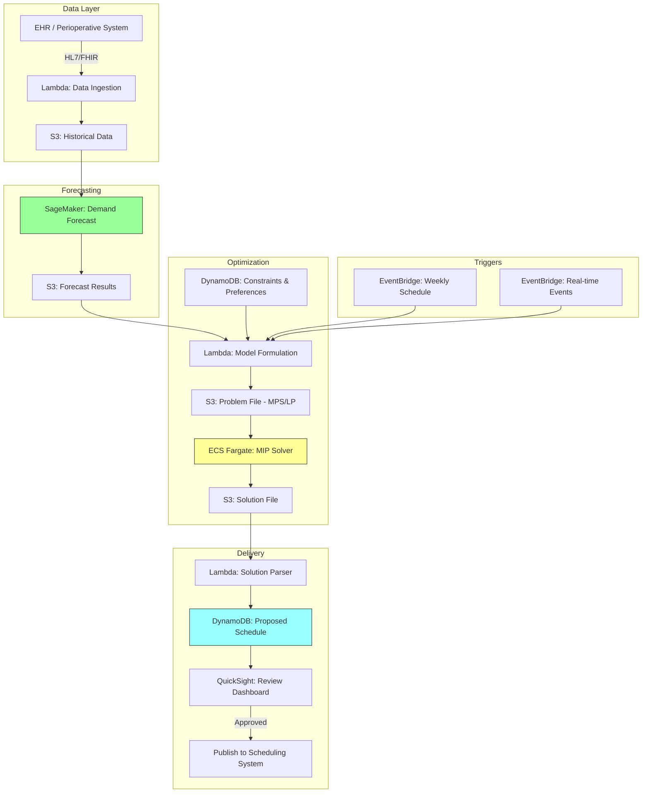

# Recipe 14.5: Operating Room Block Scheduling

**Complexity:** Medium · **Phase:** Production · **Estimated Cost:** ~$50-200/month (solver compute)

---

## The Problem

Here's a scenario that plays out every single Monday morning at almost every hospital in the country: Orthopedics has 16 hours of block time this week and only filled 12 of them. Cardiac surgery needs an extra room for an urgent but not emergent case and can't get one. General surgery has a backlog of elective cases growing by the day. Meanwhile, two ORs sit empty on Wednesday afternoon because the surgeon who holds those blocks is on vacation and nobody released the time back into the pool.

Operating rooms are the most expensive real estate in a hospital. A single OR costs $30-80 per minute to run (staffing, equipment, facility costs), and most health systems have somewhere between 10 and 50 of them. The annual operating budget for a surgical suite can easily run $50-100 million. Utilization rates at most hospitals hover around 60-70%, which means tens of millions in wasted capacity every year. Not because demand doesn't exist, but because the allocation system is broken.

The traditional approach to OR scheduling is "block scheduling," where surgical services (orthopedics, cardiology, general surgery, neurosurgery, etc.) are granted fixed blocks of OR time on specific days and rooms. Dr. Smith gets Room 3 every Tuesday from 7am to 3pm. Orthopedics gets Rooms 5 and 6 all day Monday through Thursday. These blocks are typically allocated annually or semi-annually based on historical volume, political negotiation, and institutional inertia.

The problem is obvious: demand is not static. Seasonal variation, surgeon vacations, changes in referral patterns, new surgeons joining, others retiring. The block allocation from January doesn't reflect reality in June. But releasing and reallocating blocks is politically painful. Surgeons view their block time as an earned entitlement. Department chairs fight for every hour. The OR committee meetings where these decisions get made are among the most contentious in any hospital.

What if you could formulate this as what it actually is: a constrained optimization problem? You have scarce resources (OR rooms and time slots), competing demand (surgical services), hard constraints (equipment availability, staffing, patient safety), soft constraints (surgeon preferences, historical allocations), and a measurable objective (maximize utilization while maintaining access and fairness). This is textbook operations research.

---

## The Technology: Constrained Optimization for Resource Allocation

### What Is Constrained Optimization?

At its core, constrained optimization is about finding the best possible allocation of limited resources subject to rules that cannot (or should not) be violated. You have:

- **Decision variables**: the things you control. In our case, which service gets which room on which day for how many hours.
- **An objective function**: what you're trying to maximize or minimize. Typically a weighted combination of utilization, access equity, and preference satisfaction.
- **Hard constraints**: rules that absolutely cannot be broken. A room can only be assigned to one service at a time. Certain procedures require specific equipment that only exists in certain rooms. Minimum staffing ratios must be met.
- **Soft constraints**: preferences you'd like to satisfy but can trade off. Dr. Martinez prefers morning blocks. Orthopedics historically has had Tuesday/Thursday in Room 7. The neurosurgery team prefers adjacent rooms for complex cases.

The mathematical framework most commonly used here is **Mixed-Integer Programming (MIP)**. "Mixed-integer" means some of your decision variables are continuous (how many hours to allocate) and some are binary (does orthopedics get Room 3 on Tuesday: yes or no). The "programming" is mathematical programming, not software programming. It refers to the mathematical formulation of the problem as a linear (or sometimes quadratic) objective function subject to linear constraints.

### Why MIP and Not Something Simpler?

You might think: can't I just write a greedy algorithm? Sort requests by priority, assign them one by one, first-come-first-served?

You can. Hospitals do this today (often manually). The problem is that greedy approaches produce locally optimal but globally suboptimal solutions. Giving orthopedics their first-choice block might block cardiac surgery from a feasible schedule entirely, when a slight adjustment to orthopedics would have accommodated both. MIP solvers explore the entire solution space and find allocations that are provably optimal (or within a known gap of optimal). The difference between a greedy heuristic and an optimal solution can easily be 10-20% utilization improvement across the suite.

### Solver Technology

MIP problems are solved by specialized algorithms implemented in software called "solvers." The solver takes your formulated problem (variables, objective, constraints) and uses techniques like branch-and-bound, cutting planes, and presolve reductions to find the optimal solution (or a solution within a specified tolerance of optimal).

The solver landscape:

- **Commercial solvers** (Gurobi, CPLEX, Xpress): Extremely fast. Handle problems with hundreds of thousands of variables. Licensed per-core or per-server. Gurobi and CPLEX are the market leaders and handle hospital-scale problems in seconds to minutes.
- **Open-source solvers** (SCIP, CBC, HiGHS, OR-Tools): Free. Slower on large problems but perfectly adequate for many real-world instances. Google's OR-Tools provides a nice Python interface and includes the CBC solver. HiGHS is a newer entrant that's surprisingly competitive with commercial solvers for certain problem structures.
- **Cloud-based solver services**: Some cloud providers offer optimization as a managed service, eliminating the need to provision and manage solver infrastructure.

For OR block scheduling, problem sizes are typically moderate: 10-50 rooms, 15-30 services, 5-7 days per week, maybe 4-6 time slots per day. That's a few thousand decision variables and a few thousand constraints. Both commercial and open-source solvers handle this comfortably. The choice often comes down to whether you need the faster solve times of commercial solvers for real-time reoptimization scenarios, or whether batch overnight solves with an open-source solver are sufficient.

### The Formulation Challenge

The hard part of OR scheduling optimization is not running the solver. It's formulating the problem correctly. Here's what makes it tricky:

**Multi-objective tensions.** You want to maximize utilization AND ensure equitable access AND honor historical allocations AND satisfy preferences. These objectives conflict. Maximizing utilization might mean giving all the time to the highest-volume service and starving smaller ones. You need to weight these objectives or use a hierarchical approach (first satisfy access minimums, then maximize utilization within those bounds).

**Political constraints masquerading as technical ones.** "Dr. Johnson always gets Room 2 on Tuesdays" isn't a physical constraint. It's a political one. But if you don't model it (at least as a soft constraint with some weight), your mathematically optimal solution will be rejected by the people who have to live with it. The gap between "optimal" and "implementable" is where most OR scheduling projects die.

**Temporal coupling.** Block allocations interact across time. If you give a service extra blocks this week to clear a backlog, that might create a fairness issue next week. The planning horizon matters: optimizing one week at a time might produce oscillation, while optimizing a full quarter at once is computationally harder.

**Stochastic demand.** You don't know exactly how many cases each service will bring next month. You can estimate from historical data, but there's uncertainty. Robust optimization (optimizing for the worst-case within an uncertainty set) or stochastic programming (optimizing over multiple demand scenarios) adds complexity but produces more resilient schedules.

### Batch vs. Real-Time Optimization

Two distinct operational modes exist:

**Batch reoptimization** (weekly or monthly): Rerun the full block allocation model periodically using updated demand forecasts, historical utilization data, and any constraint changes. This produces the "master schedule" for the upcoming period. Most hospitals start here because it's simpler to implement and easier to gain stakeholder buy-in. The output goes to the OR committee for review.

**Real-time reoptimization** (intra-day): When a case cancels, a surgeon releases time, or an urgent add-on appears, rerun a simplified model to find the best reallocation of newly available time. This requires faster solve times (seconds, not minutes) and tight integration with the hospital's scheduling system. It's harder to implement but captures more value from released blocks.

Most production systems start with batch and add real-time capabilities once the batch model is trusted and integrated.

---

## General Architecture Pattern

The pipeline at a conceptual level:

```text
[Data Collection] → [Demand Forecasting] → [Problem Formulation] → [Solve] → [Human Review] → [Publish Schedule] → [Monitor & Feedback]
```

**Data Collection.** Pull historical OR utilization data: actual case start/end times, block allocations, cancellation rates, room capabilities, equipment constraints, surgeon preference surveys, contractual requirements. This data lives in the hospital's EHR and perioperative scheduling system.

**Demand Forecasting.** Estimate expected case volume per service for the upcoming period. Use historical case volume, referral trends, seasonal patterns, and known changes (new surgeon onboarding, service line expansion). The forecast feeds the optimization model as a demand parameter.

**Problem Formulation.** Translate the hospital's scheduling rules, preferences, and objectives into a mathematical model. This is the intellectual heavy lifting. Define decision variables (block assignments), objective function (weighted combination of utilization, fairness, preference satisfaction), and constraints (room capabilities, staffing, minimum access guarantees).

**Solve.** Feed the formulated model to a solver. For batch mode, solve to optimality or within a specified gap (e.g., within 1% of optimal). For real-time mode, set a time limit and accept the best solution found within that window.

**Human Review.** Present the proposed allocation to OR leadership. Highlight changes from the current allocation, explain tradeoffs, and allow manual overrides. No optimization system survives contact with a surgical department without a human review step.

**Publish Schedule.** Push the approved allocation to the perioperative scheduling system. Block assignments become available for individual case booking.

**Monitor and Feedback.** Track actual utilization against allocated blocks. Identify services consistently under-utilizing or over-requesting. Feed this data back into the next optimization cycle.

---

## The AWS Implementation

### Why These Services

**AWS Lambda for orchestration and data preparation.** The data collection, transformation, and model formulation steps are event-driven workflows that don't need persistent servers. Lambda handles the ETL from the scheduling system, constructs the optimization model parameters, and triggers the solve.

**Amazon S3 for model artifacts and results.** Problem formulations (MPS/LP files), solver logs, and solution files need durable, versioned storage. S3 provides this with full audit trail via versioning and CloudTrail.

**Amazon ECS (Fargate) for solver execution.** MIP solvers are compute-intensive and may run for minutes. Lambda's 15-minute timeout and memory limits make it unsuitable for the solve step. A Fargate task with the solver installed (open-source CBC/HiGHS, or commercial Gurobi with a cloud license) provides the right compute profile: spin up, solve, write results, shut down. No persistent infrastructure.

**Amazon DynamoDB for scheduling state.** Current block allocations, constraint parameters, and optimization run history need a fast, queryable store. DynamoDB handles the read/write patterns (frequent lookups by room/day/service, batch writes of new allocations).

**Amazon EventBridge for scheduling triggers.** Batch reoptimization runs on a schedule (weekly). Real-time reoptimization triggers on events (case cancellation, block release). EventBridge handles both patterns cleanly.

**Amazon SageMaker for demand forecasting.** The demand forecast that feeds the optimization model is a time-series prediction problem. SageMaker's built-in algorithms (DeepAR, Prophet via BYO container) handle multi-service volume forecasting without building custom infrastructure.

**Amazon QuickSight for stakeholder dashboards.** OR leadership needs to see utilization trends, proposed vs. actual allocations, and fairness metrics. QuickSight connects directly to the data in S3 and DynamoDB.

### Architecture Diagram



### Prerequisites

| Requirement | Details |
|-------------|---------|
| **AWS Services** | Lambda, S3, ECS (Fargate), DynamoDB, EventBridge, SageMaker, QuickSight |
| **IAM Permissions** | `lambda:InvokeFunction`, `s3:GetObject`, `s3:PutObject`, `ecs:RunTask`, `dynamodb:GetItem`, `dynamodb:PutItem`, `dynamodb:Query`, `sagemaker:InvokeEndpoint`, `events:PutRule` |
| **BAA** | Required if scheduling data includes patient identifiers (it typically does: surgeon names, case types by patient) |
| **Encryption** | S3: SSE-KMS; DynamoDB: encryption at rest; ECS: encrypt task storage; all transit over TLS |
| **VPC** | Production: Fargate tasks and Lambda in VPC with VPC endpoints for S3, DynamoDB, and CloudWatch Logs |
| **CloudTrail** | Enabled: log all optimization runs and schedule modifications for audit trail |
| **Solver License** | If using Gurobi/CPLEX: cloud license (token server or machine ID based). If using open-source (HiGHS, CBC): no license needed. |
| **Sample Data** | Synthetic OR utilization data. Use realistic distributions: 60-85% utilization, 5-15% cancellation rate, 10-50 rooms. Never use actual patient/surgeon identifiers in dev. |
| **Cost Estimate** | SageMaker inference: ~$5-20/month for weekly forecasts. Fargate solver tasks: ~$0.50-5 per solve (depends on problem size and duration). Lambda, DynamoDB, S3: negligible. Total: $50-200/month for weekly batch optimization. |

### Ingredients

| AWS Service | Role |
|------------|------|
| **AWS Lambda** | Orchestrates data pipeline, constructs model parameters, parses solutions |
| **Amazon S3** | Stores historical data, problem files, solution files, solver logs |
| **Amazon ECS (Fargate)** | Runs the MIP solver in a container with appropriate compute resources |
| **Amazon DynamoDB** | Stores current allocations, constraints, preferences, and proposed schedules |
| **Amazon EventBridge** | Triggers weekly batch optimization and real-time reoptimization on events |
| **Amazon SageMaker** | Produces demand forecasts per surgical service for upcoming planning period |
| **Amazon QuickSight** | Dashboards for OR leadership to review proposals and track utilization |
| **AWS KMS** | Manages encryption keys for all data stores |
| **Amazon CloudWatch** | Logs, metrics, alarms for solver performance and pipeline health |

### Code

#### Walkthrough

**Step 1: Data collection and preparation.** The first step pulls historical OR utilization data from the hospital's scheduling system. You need actual case durations (not scheduled durations, actual wheel-in to wheel-out), cancellation records, current block allocations, room capabilities (which rooms have what equipment), and any contractual or policy constraints. The data typically arrives via HL7 or FHIR interfaces, or direct database extracts from the perioperative information system. This step normalizes everything into a consistent format the optimization model can consume. Skip this step and you're optimizing against fantasy data.

```pseudocode
FUNCTION collect_or_data(planning_horizon_weeks):
    // Pull raw utilization data from the scheduling system.
    // We need ACTUAL times, not scheduled times. The gap between them is the whole problem.
    raw_cases = query scheduling system for:
        - All completed cases in the past 52 weeks
        - Fields: service, surgeon, room, date, scheduled_start, actual_start,
                  actual_end, case_type, equipment_used, cancellation_flag

    // Aggregate into utilization metrics per service per room per day-of-week.
    // This tells us: historically, how well did each service use their allocated time?
    utilization_by_service = FOR each service:
        total_allocated_minutes = sum of all block time allocated to this service
        total_used_minutes = sum of (actual_end - actual_start) for all cases
        utilization_rate = total_used_minutes / total_allocated_minutes
        cancellation_rate = count(cancelled) / count(all_scheduled)
        average_case_duration = mean(actual_end - actual_start) by case_type

    // Pull current block allocation (the baseline we're improving on).
    current_blocks = query scheduling system for:
        - All active block assignments
        - Fields: service, room, day_of_week, start_time, end_time, surgeon (if assigned)

    // Pull room constraints (which rooms support which types of cases).
    room_capabilities = FOR each room:
        - Equipment present (robot, microscope, C-arm, etc.)
        - Room size category (standard, large, cardiac)
        - Adjacency relationships (which rooms share prep areas)

    // Pull policy constraints (minimum access guarantees, maximum allocations).
    policy_constraints = load from configuration:
        - Minimum weekly hours per service (contractual or policy)
        - Maximum percentage any one service can hold
        - Release-time rules (how far in advance unused blocks must be released)

    RETURN {
        utilization_by_service,
        current_blocks,
        room_capabilities,
        policy_constraints,
        raw_case_data: raw_cases  // needed for demand forecasting
    }
```

**Step 2: Demand forecasting.** Before you can optimize block allocations, you need to know how much each service actually needs. Historical volume alone isn't enough because demand changes: new surgeons join, referral patterns shift, service lines expand or contract. A time-series forecast per service gives you expected weekly case volume and total minutes for the upcoming planning period. The forecast includes uncertainty bounds so the optimization can be robust to demand variability. Skip this step and you're allocating based on last year's demand, which may not reflect next quarter's reality.

```pseudocode
FUNCTION forecast_demand(raw_case_data, forecast_horizon_weeks):
    // Group historical cases by service and week.
    // We're building a time series: cases per week per service.
    weekly_volume = GROUP raw_case_data BY (service, iso_week)
        COMPUTE: case_count, total_minutes, avg_case_duration

    // For each service, generate a demand forecast.
    // Using a time-series model that captures seasonality, trend, and noise.
    forecasts = FOR each service:
        history = weekly_volume filtered to this service
        model = fit time-series model (e.g., Prophet, DeepAR, or ARIMA) to history
        prediction = model.predict(next forecast_horizon_weeks weeks)
        // prediction includes: expected_cases, expected_minutes,
        //                      lower_bound (10th percentile), upper_bound (90th percentile)
        RETURN {
            service: service,
            expected_weekly_minutes: prediction.expected_minutes,
            upper_bound_minutes: prediction.upper_bound,  // for robust scheduling
            expected_weekly_cases: prediction.expected_cases
        }

    RETURN forecasts
```

**Step 3: Problem formulation.** This is the intellectual core of the recipe. We translate the scheduling problem into a mathematical optimization model. The decision variables represent block assignments. The objective balances utilization, access equity, and preference satisfaction. The constraints enforce physical reality (a room can only be assigned once per time slot), policy rules (minimum access guarantees), and operational requirements (equipment compatibility). Getting this formulation right is the difference between a system that produces useful schedules and one that produces technically feasible but politically dead-on-arrival results.

```pseudocode
FUNCTION formulate_model(data, forecasts, preferences):
    // SETS (the dimensions of our problem)
    services    = set of all surgical services (e.g., orthopedics, cardiac, general, neuro...)
    rooms       = set of all OR rooms
    days        = set of days in the planning period (e.g., Monday through Friday)
    time_slots  = set of time slots per day (e.g., AM block: 7am-12pm, PM block: 12pm-5pm)

    // DECISION VARIABLES
    // x[s, r, d, t] = 1 if service s is assigned room r on day d in time slot t, else 0
    // These are binary (yes/no) variables. The solver decides which ones to set to 1.
    x = binary variable for each (service, room, day, time_slot) combination

    // OBJECTIVE FUNCTION
    // Maximize a weighted combination of goals:
    //   (1) Utilization: prefer assignments where expected demand matches allocated time
    //   (2) Preference satisfaction: honor surgeon/service preferences where possible
    //   (3) Continuity: prefer allocations similar to current schedule (reduce disruption)
    //   (4) Fairness: penalize large deviations from equitable access
    objective = MAXIMIZE:
        w1 * SUM(utilization_score[s,r,d,t] * x[s,r,d,t])    // reward high-utilization assignments
      + w2 * SUM(preference_score[s,r,d,t] * x[s,r,d,t])     // reward preferred assignments
      + w3 * SUM(continuity_score[s,r,d,t] * x[s,r,d,t])     // reward similarity to current schedule
      - w4 * SUM(fairness_penalty[s])                          // penalize unfair allocations

    // HARD CONSTRAINTS (cannot be violated)

    // (C1) Each room-day-slot can only be assigned to one service.
    // A room physically cannot be used by two services simultaneously.
    FOR each (room, day, time_slot):
        SUM over all services: x[s, room, day, time_slot] <= 1

    // (C2) Room-equipment compatibility.
    // Cardiac surgery can only be assigned to rooms with cardiac equipment.
    FOR each (service, room) where room lacks required equipment for service:
        FOR each (day, time_slot):
            x[service, room, day, time_slot] = 0

    // (C3) Minimum access guarantee.
    // Each service is guaranteed at least their contractual minimum hours per week.
    FOR each service:
        SUM of (slot_duration * x[service, r, d, t]) for all r, d, t >= minimum_hours[service]

    // (C4) Maximum allocation cap.
    // No single service can hold more than X% of total available time.
    FOR each service:
        SUM of (slot_duration * x[service, r, d, t]) for all r, d, t <= max_cap[service]

    // SOFT CONSTRAINTS (modeled as penalty terms in the objective)

    // (S1) Fairness: each service's allocation should be proportional to demand.
    // Define fairness_penalty[s] = |allocated_hours[s] / total_hours - demand[s] / total_demand|
    FOR each service:
        allocated_hours[s] = SUM(slot_duration * x[s, r, d, t]) for all r, d, t
        target_share[s] = forecasts[s].expected_weekly_minutes / total_expected_minutes
        fairness_penalty[s] = absolute deviation of allocated_hours[s] from target_share[s] * total_available

    // (S2) Block contiguity: prefer assigning a service to consecutive slots in the same room.
    // Surgeons hate split blocks (AM in Room 3, PM in Room 7). Model as a bonus for contiguous assignments.
    // (Implementation: add a bonus term for pairs of adjacent slots assigned to the same service in the same room)

    RETURN optimization_model
```

**Step 4: Solve.** Feed the formulated model to a MIP solver. For batch weekly optimization, you typically allow the solver to run until it finds a solution within 1% of optimal (the "optimality gap"). For real-time reoptimization (when a block is released mid-week), set a strict time limit and accept the best solution found. The solver handles the hard work of exploring millions of possible allocations and finding the best one that satisfies all constraints. This is where the magic happens: the solver considers interactions between all assignments simultaneously, something no human scheduler can do at this scale.

```pseudocode
FUNCTION solve_model(model, mode):
    // Configure solver parameters based on the operational mode.
    IF mode == "batch":
        // Weekly planning: we can wait for a near-optimal solution.
        solver_config = {
            time_limit: 300 seconds,       // 5 minutes max (usually finishes in 30-60 seconds)
            optimality_gap: 0.01,          // stop when within 1% of proven optimal
            threads: 4,                     // use multiple cores for parallel branch-and-bound
            log_file: "s3://bucket/solver-logs/{run_id}.log"
        }
    ELSE IF mode == "realtime":
        // Intra-day reallocation: speed matters more than optimality.
        solver_config = {
            time_limit: 30 seconds,        // must respond quickly
            optimality_gap: 0.05,          // accept within 5% of optimal
            threads: 4,
            warm_start: current_solution   // start from current allocation, not from scratch
        }

    // Invoke the solver.
    result = solver.optimize(model, solver_config)

    // Check solution status.
    IF result.status == "OPTIMAL" OR result.status == "FEASIBLE":
        solution = extract variable values from result
        objective_value = result.objective_value
        gap = result.optimality_gap  // how far from proven optimal (0% = exact optimal)
        RETURN { solution, objective_value, gap, status: "success" }
    ELSE IF result.status == "INFEASIBLE":
        // No allocation exists that satisfies all hard constraints.
        // This usually means minimum access guarantees exceed available capacity.
        // Return diagnostics: which constraints are conflicting.
        conflicting = solver.compute_infeasibility_analysis()
        RETURN { status: "infeasible", conflicts: conflicting }
    ELSE:
        // Solver hit time limit without finding any feasible solution.
        RETURN { status: "no_solution_found" }
```

**Step 5: Solution parsing and presentation.** The solver produces a raw solution: a set of variable values. This step translates that into a human-readable schedule, computes comparison metrics against the current allocation, and prepares the proposal for OR leadership review. The presentation layer is critical because no schedule change will be implemented without stakeholder buy-in. Show them what changes, why it's better, and what the tradeoffs are.

```pseudocode
FUNCTION parse_and_present(solution, current_blocks, forecasts):
    // Convert solver output into a readable block schedule.
    proposed_schedule = FOR each (service, room, day, slot) where solution.x[s,r,d,t] == 1:
        RECORD: { service, room, day, time_slot, start_time, end_time }

    // Compute comparison metrics.
    comparison = {
        current_utilization: calculate from current_blocks and historical data,
        proposed_utilization: calculate from proposed_schedule and forecasts,
        blocks_changed: count of assignments that differ between current and proposed,
        services_gaining_time: list of services with more hours in proposed,
        services_losing_time: list of services with fewer hours in proposed,
        fairness_index: Gini coefficient of allocation proportionality
    }

    // Generate per-service impact summary.
    // This is what department chairs care about: "what happens to MY time?"
    service_impact = FOR each service:
        current_hours = sum of hours in current_blocks for this service
        proposed_hours = sum of hours in proposed_schedule for this service
        change = proposed_hours - current_hours
        utilization_forecast = forecasts[service].expected_weekly_minutes / (proposed_hours * 60)
        RETURN { service, current_hours, proposed_hours, change, projected_utilization }

    // Store for review.
    write proposed_schedule to database with status "pending_review"
    write comparison metrics and service_impact to dashboard data store

    RETURN { proposed_schedule, comparison, service_impact }
```

> **Curious how this looks in Python?** The pseudocode above covers the concepts. If you'd like to see sample Python code that demonstrates these patterns using boto3 and an open-source solver, check out the [Python Example](chapter14.05-python-example). It walks through each step with inline comments and notes on what you'd need to change for a real deployment.

### Expected Results

**Sample output for a 20-room, 12-service hospital:**

```json
{
  "optimization_run_id": "opt-2026-06-02-weekly",
  "solve_time_seconds": 42.7,
  "optimality_gap": 0.008,
  "status": "optimal",
  "proposed_schedule": {
    "orthopedics": [
      {"room": "OR-03", "day": "Monday", "slot": "AM", "hours": 5},
      {"room": "OR-03", "day": "Monday", "slot": "PM", "hours": 5},
      {"room": "OR-07", "day": "Wednesday", "slot": "AM", "hours": 5},
      {"room": "OR-07", "day": "Thursday", "slot": "AM", "hours": 5}
    ],
    "cardiac_surgery": [
      {"room": "OR-01", "day": "Tuesday", "slot": "AM", "hours": 5},
      {"room": "OR-01", "day": "Tuesday", "slot": "PM", "hours": 5},
      {"room": "OR-01", "day": "Thursday", "slot": "AM", "hours": 5}
    ]
  },
  "comparison": {
    "current_suite_utilization": 0.64,
    "proposed_suite_utilization": 0.78,
    "blocks_changed": 14,
    "total_blocks": 120,
    "fairness_gini_current": 0.23,
    "fairness_gini_proposed": 0.09
  }
}
```

**Performance benchmarks:**

| Metric | Typical Value |
|--------|---------------|
| Solve time (batch, 20 rooms) | 30-120 seconds |
| Solve time (real-time reallocation) | 5-15 seconds |
| Optimality gap achieved | 0.5-2% |
| Utilization improvement over manual | 10-20 percentage points |
| Stakeholder acceptance rate | 70-85% of proposed changes accepted |
| Cost per optimization run | ~$0.50-2.00 (Fargate compute) |

**Where it struggles:** Highly politicized environments where any change from status quo is rejected regardless of data. Services with extremely variable demand (trauma) that resist block scheduling entirely. Hospitals where the scheduling system data is unreliable (garbage-in, garbage-out). And the cold-start problem: the first time you propose changes, resistance is highest because there's no track record of the system producing good results.

---

## The Honest Take

Here's what surprised me about OR block scheduling optimization: the math is the easy part. Formulating the model, picking a solver, getting a solution that's provably within 1% of optimal. All straightforward. Any operations research grad student can do it in a week.

The hard part is everything else. Getting clean data out of the scheduling system. Defining "utilization" in a way everyone agrees on (wheel-in to wheel-out? first cut to last suture? block start to block end including turnover?). Getting surgeons to agree on preference weights. Getting department chairs to accept that their "earned" time might be better allocated to a growing service. Getting the OR committee to trust a computer's recommendation over thirty years of institutional memory.

The political dynamics cannot be overstated. I've seen mathematically perfect schedules rejected because one influential surgeon's preferred slot moved by 30 minutes. The system needs to account for this. Build continuity into the objective function. Weight it heavily at first (penalize changes from current allocation), then gradually reduce the weight as trust builds. Think of it as an organizational change management problem wrapped in an optimization problem.

The other thing that catches teams off guard: the data quality issue. Most hospitals' OR scheduling systems track scheduled times, not actual times. The scheduled block might say 7am-3pm, but the actual first case started at 7:45 (late patient), the last case ended at 2:15, and there was 35 minutes of wasted turnover between cases 2 and 3. If you optimize against scheduled data, you're optimizing against fiction. You need actual utilization data, which often requires a separate data collection effort.

Start with batch, weekly optimization. Get buy-in on the concept. Show the OR committee that the model produces reasonable schedules. Let them override freely at first. Track how often overrides hurt utilization. Build trust incrementally. Real-time reoptimization is the destination, but it's a multi-year journey to get there in most organizations.

---

## Variations and Extensions

**Release-time optimization.** Add a dynamic component that identifies blocks likely to go unused (based on booking patterns leading up to the block) and automatically releases them to an open-access pool before the release deadline. This captures value from the 15-30% of blocks that historically go unused because the holding service didn't fill them.

**Surgeon-level assignment within blocks.** Once blocks are allocated to services, a second-level optimization assigns specific surgeons to time within their service's blocks. This accounts for surgeon-specific preferences (morning vs. afternoon), case duration patterns, and equipment needs. Essentially a nested optimization where the outer problem is service-to-room and the inner problem is surgeon-to-slot.

**Stochastic optimization for demand uncertainty.** Replace the point demand forecast with a distribution. Formulate a stochastic program that optimizes expected utilization across multiple demand scenarios. This produces schedules that are robust to demand variability rather than optimized for one specific forecast. More complex to formulate and slower to solve, but produces schedules that perform better in practice when demand is uncertain.

---

## Related Recipes

- **Recipe 14.4 (Nurse Staffing Optimization):** Uses similar MIP formulation techniques for a related healthcare scheduling problem; staffing schedules must align with OR block schedules
- **Recipe 14.7 (OR Case Sequencing):** The downstream problem: once blocks are allocated, sequence individual cases within each block to minimize turnover time
- **Recipe 12.5 (Hospital Census Forecasting):** Demand forecasting techniques that feed into the OR optimization model
- **Recipe 14.1 (Appointment Slot Optimization):** A simpler introduction to optimization in healthcare scheduling; good foundation before tackling OR blocks

---

## Additional Resources

**AWS Documentation:**
- [Amazon SageMaker Built-in Algorithms](https://docs.aws.amazon.com/sagemaker/latest/dg/algos.html)
- [Amazon ECS on Fargate](https://docs.aws.amazon.com/AmazonECS/latest/developerguide/AWS_Fargate.html)
- [Amazon EventBridge Scheduler](https://docs.aws.amazon.com/eventbridge/latest/userguide/scheduler.html)
- [AWS HIPAA Eligible Services](https://aws.amazon.com/compliance/hipaa-eligible-services-reference/)
- [Amazon QuickSight Embedding](https://docs.aws.amazon.com/quicksight/latest/user/embedded-analytics.html)

**Optimization Resources:**
- [Google OR-Tools Documentation](https://developers.google.com/optimization)
- [HiGHS Solver](https://highs.dev/)
- [PuLP (Python Linear Programming Library)](https://coin-or.github.io/pulp/)

<!-- TODO: Verify if there are relevant aws-samples repos for optimization/scheduling use cases -->

**Industry References:**
- [INFORMS Healthcare Conference Proceedings](https://www.informs.org/) (search for "operating room scheduling")

---

## Estimated Implementation Time

| Tier | Duration | Notes |
|------|----------|-------|
| **Basic** (batch optimization, open-source solver, manual review) | 8-12 weeks | Includes data pipeline, model formulation, solver integration, basic dashboard |
| **Production-ready** (automated pipeline, stakeholder dashboards, approval workflow) | 16-24 weeks | Adds forecast integration, change management tooling, automated publishing |
| **With variations** (real-time reoptimization, release-time, stochastic) | 6-12 months | Requires tight EHR integration, event-driven architecture, solver performance tuning |

---

## Tags

`optimization` · `operations-research` · `mixed-integer-programming` · `scheduling` · `operating-room` · `block-scheduling` · `resource-allocation` · `fargate` · `sagemaker` · `eventbridge` · `medium-complexity` · `hipaa`

---

*← [Recipe 14.4: Nurse Staffing Optimization](chapter14.04-nurse-staffing-optimization) · [Chapter 14 Index](chapter14-index) · [Next: Recipe 14.6: Patient Flow / Bed Assignment →](chapter14.06-patient-flow-bed-assignment)*
