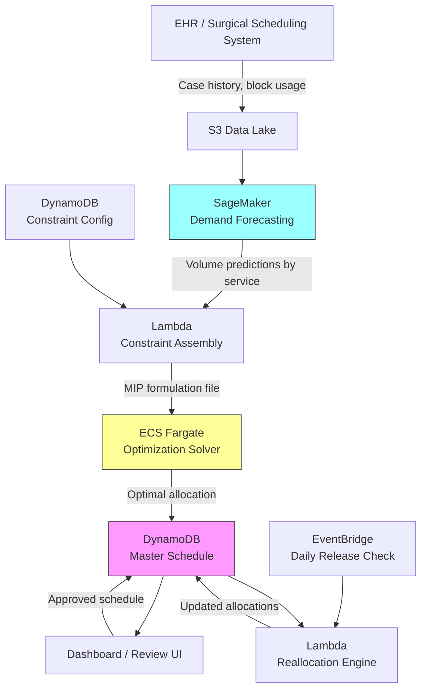

# Recipe 14.5: Operating Room Block Scheduling

**Complexity:** Medium · **Phase:** Optimization · **Estimated Cost:** ~$50–200/month (solver compute)

---

## The Problem

Operating rooms are the most expensive real estate in a hospital. A single OR costs somewhere between $30 and $100 per minute to operate when you factor in staffing, equipment, overhead, and opportunity cost. Most hospitals have between 8 and 40 ORs. And the way they allocate time in those rooms? A spreadsheet that hasn't been fundamentally rethought since the 1990s.

Here's how it typically works. Surgical services (orthopedics, cardiac, general surgery, neurosurgery, etc.) are allocated "blocks" of OR time. Orthopedics might own Monday and Wednesday mornings in OR 3. Cardiac gets all day Tuesday in ORs 7 and 8. These allocations were negotiated years ago based on historical volume, political clout, and whoever yelled loudest at the last medical executive committee meeting.

The problem is that demand shifts. Orthopedics hired two new surgeons and can't fit their cases. Cardiac's volume dropped 15% after a key surgeon retired. General surgery has a 3-week backlog but only 60% of their allocated time is actually being used (because one of their surgeons retired and the block wasn't reallocated). Meanwhile, the hospital is turning away profitable cases because "there's no OR time available," even though 20% of allocated blocks go unused on any given week.

This is not a small inefficiency. Studies consistently show that OR utilization at most hospitals hovers between 60% and 75%. The gap between actual utilization and optimal utilization represents millions of dollars in lost revenue annually for a mid-size hospital. For a large academic medical center, it can be tens of millions.

The human cost is real too. Patients wait weeks for elective procedures because the schedule says there's no room, even when rooms sit empty. Surgeons get frustrated because they can't access time. OR directors spend their lives mediating political disputes about who "deserves" more blocks.

This is a resource allocation problem. And resource allocation problems are exactly what mathematical optimization was invented to solve.

---

## The Technology: Mathematical Optimization for Scheduling

### What Is Block Scheduling?

Let's be precise about what we're optimizing. OR block scheduling operates at the "strategic" level of surgical scheduling. There are three levels:

1. **Strategic (block scheduling):** Allocate blocks of OR time to surgical services or individual surgeons over a planning horizon (typically quarterly or annually). This is what we're solving here.
2. **Tactical (case scheduling):** Assign specific surgical cases to specific blocks on specific days. This happens within the constraints set by the strategic schedule.
3. **Operational (day-of sequencing):** Order the cases within a given day's block to minimize turnover time and maximize throughput. Recipe 14.7 covers this.

Block scheduling is a combinatorial optimization problem. You have a finite set of OR-day-time slots, a set of surgical services with demand forecasts, and a pile of constraints (surgeon availability, equipment requirements, staffing patterns, historical agreements). You want to find the allocation that maximizes some objective (utilization, revenue, access equity, surgeon satisfaction) while respecting all the constraints.

### The Optimization Formulation

At its core, this is a Mixed-Integer Programming (MIP) problem. Here's why:

**Decision variables** are binary: does service S get block B? Yes or no. You can't give half a block to orthopedics and half to cardiac (well, you can, but that's a different formulation called "open time" that we'll discuss in variations). Binary decisions mean integer programming.

**The objective function** is what you're trying to maximize or minimize. Common choices:

- Maximize weighted utilization (predicted cases filled / available time)
- Minimize total unused block time
- Maximize revenue (weight blocks by expected case mix revenue)
- Minimize patient access delay (weighted by urgency)
- Some combination of the above (multi-objective)

**Constraints** are the rules the solution must obey:

- Each block is assigned to exactly one service (or left as open/unblocked time)
- Each service gets at least some minimum allocation (contractual or political)
- Each service gets no more than some maximum (capacity limits, staffing)
- Certain services require specific ORs (cardiac needs the hybrid OR, neuro needs the one with the intraoperative MRI)
- Surgeon availability patterns (Dr. Smith only operates Mon/Wed/Fri)
- Equipment conflicts (only two arthroscopy towers, so max two ortho rooms simultaneously)
- Staffing constraints (only N specialized nurses available per day for cardiac cases)
- Fairness constraints (no service loses more than X% of their current allocation in one cycle)

### Solver Selection

The solver is the engine that finds the optimal (or near-optimal) solution. Your choices:

**Commercial solvers (Gurobi, CPLEX, Xpress):** These are the gold standard for MIP problems. They use branch-and-bound algorithms with sophisticated cutting planes, presolve techniques, and heuristics. For a typical hospital's block scheduling problem (maybe 500-2000 binary variables, a few hundred constraints), a commercial solver will find the optimal solution in seconds to minutes. The downside: licensing costs ($10K-$50K/year for on-premises, or pay-per-use in cloud).

**Open-source solvers (CBC, SCIP, HiGHS, OR-Tools):** Free, capable, and improving rapidly. HiGHS in particular has become competitive with commercial solvers for many MIP problems. For block scheduling at a single hospital, these are often sufficient. They might take 10x longer than Gurobi on hard instances, but "10x longer than 30 seconds" is still 5 minutes, which is fine for a quarterly planning problem.

**Metaheuristics (genetic algorithms, simulated annealing, tabu search):** These don't guarantee optimality but can handle messier objective functions and constraints that are hard to express as linear inequalities. Useful when your problem has nonlinear elements (like "surgeon satisfaction" that's hard to quantify linearly) or when the MIP formulation gets too large to solve in reasonable time.

For most hospital block scheduling problems, a MIP formulation with an open-source solver is the right starting point. You can always upgrade to a commercial solver later if solve times become a bottleneck.

### Batch vs. Real-Time

Block scheduling is fundamentally a batch optimization problem. You run it quarterly (or monthly, or annually) to produce the master schedule. The solve itself might take minutes to hours depending on problem size and solver choice. That's fine. Nobody needs a block schedule in 200 milliseconds.

However, there's a real-time component that matters: **block release and reallocation.** When a service knows they won't use an upcoming block (surgeon on vacation, cases cancelled), that time should be released back to a pool where other services can claim it. This "day-of" or "week-of" reallocation is a simpler optimization (fewer variables, shorter horizon) but needs to run quickly and frequently.

The architecture should support both: a heavyweight batch solver for the master schedule, and a lightweight reallocation engine for released blocks.

### Why This Is Harder Than It Sounds

**Political constraints aren't linear.** "The chief of cardiac surgery will resign if he loses his Tuesday block" is a real constraint that doesn't fit neatly into a mathematical formulation. You end up encoding political realities as hard constraints (minimum allocations) or soft constraints (penalties in the objective function), and getting those weights right requires iteration with stakeholders.

**Demand forecasting is uncertain.** Your optimization is only as good as your demand predictions. If you forecast that orthopedics will need 40 hours/week and they actually need 55, your "optimal" schedule is wrong. Robust optimization or stochastic programming can help, but they add complexity.

**Utilization is a lagging indicator.** A service might show low utilization because they don't have enough block time (so they're sending cases elsewhere or patients are waiting), not because they don't need the time. Using raw historical utilization as the demand signal can create a death spiral: low utilization leads to reduced allocation, which leads to even lower utilization as surgeons give up trying to schedule in limited windows.

**The status quo has inertia.** Even if the optimizer produces a mathematically superior schedule, implementing it means telling some surgeons they're losing time. Change management is as important as the algorithm.

### General Architecture Pattern

```
[Historical Data] → [Demand Forecasting] → [Constraint Assembly] → [Optimization Solver] → [Proposed Schedule] → [Stakeholder Review] → [Approved Schedule] → [Release/Reallocation Engine]
```

**Historical Data:** Case volumes by service, actual utilization by block, case durations, cancellation rates, add-on case patterns. Typically pulled from the surgical scheduling system (EHR or standalone).

**Demand Forecasting:** Predict future case volume by service. This can be as simple as trailing 12-month average with seasonal adjustment, or as complex as a time-series model incorporating surgeon recruitment, population trends, and referral patterns.

**Constraint Assembly:** Gather all hard and soft constraints from stakeholders, contracts, equipment inventories, and staffing models. This is the most labor-intensive step and requires clinical operations input.

**Optimization Solver:** Formulate the MIP, feed it to the solver, get back the optimal allocation.

**Proposed Schedule:** Present the solution to stakeholders with clear metrics: what changed, why, and what the expected impact is (utilization improvement, revenue gain, access improvement).

**Stakeholder Review:** Humans review, negotiate, and approve. The optimizer proposes; humans dispose. This is not optional. Any system that tries to bypass surgical leadership review will fail politically.

**Release/Reallocation Engine:** Once the master schedule is live, handle the ongoing process of releasing unused blocks and reallocating them to services with demand.

---

## The AWS Implementation

### Why These Services

**Amazon SageMaker for demand forecasting.** Before you can optimize block allocation, you need to predict how much time each service will actually need. SageMaker provides managed training and inference for time-series forecasting models. You can use built-in algorithms (DeepAR for probabilistic forecasts) or bring your own model. The key value: managed infrastructure for training on historical surgical volume data without provisioning GPU instances yourself.

**AWS Lambda for constraint assembly and orchestration.** The optimization pipeline is event-driven: new data arrives, constraints are assembled from multiple sources, the solver is invoked, results are stored. Lambda handles the glue logic. For the lightweight block release/reallocation engine, Lambda's sub-second cold start is fast enough (these decisions happen on a minutes-to-hours timescale, not milliseconds).

**Amazon ECS (Fargate) for solver execution.** MIP solvers are CPU-intensive and can run for minutes to hours on large instances. Lambda's 15-minute timeout and memory limits make it unsuitable for the actual solve. A Fargate task with 4-16 vCPUs and sufficient memory gives the solver room to work without managing EC2 instances. Spin up for the solve, shut down when done. Pay only for compute time.

**Amazon DynamoDB for schedule storage and constraint configuration.** The master block schedule, constraint definitions, and allocation history all need durable, low-latency storage. DynamoDB's key-value model works well for lookups like "what's the schedule for OR 5 next week?" and "what are the constraints for cardiac surgery?"

**Amazon S3 for historical data and model artifacts.** Surgical case history (potentially millions of records over years), trained forecasting models, and solver input/output files all live in S3. It's the data lake for the optimization pipeline.

**Amazon EventBridge for scheduling pipeline triggers.** The quarterly optimization run, daily release checks, and real-time reallocation events all need reliable scheduling and event routing. EventBridge handles cron-style triggers (run optimization every quarter) and event-driven triggers (block released, find a taker).

### Architecture Diagram



### Prerequisites

| Requirement | Details |
|-------------|---------|
| **AWS Services** | Amazon SageMaker, AWS Lambda, Amazon ECS (Fargate), Amazon DynamoDB, Amazon S3, Amazon EventBridge, Amazon CloudWatch |
| **IAM Permissions** | `sagemaker:CreateTrainingJob`, `sagemaker:InvokeEndpoint`, `ecs:RunTask`, `s3:GetObject`, `s3:PutObject`, `dynamodb:PutItem`, `dynamodb:GetItem`, `dynamodb:Query`, `events:PutRule` |
| **BAA** | Required if case-level data includes PHI (surgeon names linked to patient volumes may qualify) |
| **Encryption** | S3: SSE-KMS; DynamoDB: encryption at rest; ECS: encrypted task storage; all transit over TLS |
| **VPC** | Production: Fargate tasks in private subnet with VPC endpoints for S3, DynamoDB, CloudWatch Logs |
| **CloudTrail** | Enabled for audit trail of schedule changes and optimization runs |
| **Sample Data** | Synthetic surgical case data. Generate from published OR utilization benchmarks. Never use real patient-linked surgical records in dev. |
| **Cost Estimate** | SageMaker training: ~$5-20/run (quarterly). Fargate solver: ~$1-10/run (depends on solve time). DynamoDB + Lambda: negligible. Total: $50-200/month including daily reallocation runs. |

### Ingredients

| AWS Service | Role |
|------------|------|
| **Amazon SageMaker** | Trains and hosts demand forecasting models for surgical volume prediction |
| **AWS Lambda** | Orchestrates pipeline: assembles constraints, triggers solver, handles reallocation logic |
| **Amazon ECS (Fargate)** | Runs CPU-intensive MIP solver (HiGHS, CBC, or commercial solver in container) |
| **Amazon DynamoDB** | Stores master schedule, constraints, allocation history, and release pool |
| **Amazon S3** | Stores historical case data, model artifacts, solver input/output files |
| **Amazon EventBridge** | Triggers quarterly optimization runs and daily release checks |
| **Amazon CloudWatch** | Monitors solver performance, utilization metrics, and pipeline health |
| **AWS KMS** | Manages encryption keys for data at rest |

### Code

#### Walkthrough

**Step 1: Extract historical utilization data.** The optimization needs to know how each service has actually used their allocated time. Pull case-level data from the surgical scheduling system: which service, which OR, start time, end time, scheduled vs. actual duration, cancellations. Aggregate into utilization metrics per block per service. This historical view is the foundation for demand forecasting and for identifying the gap between allocation and actual use. Without this data, you're optimizing blind.

```
FUNCTION extract_utilization_data(start_date, end_date):
    // Pull raw surgical case records from the data lake.
    // Each record represents one completed (or cancelled) surgical case.
    cases = query S3 data lake for surgical cases between start_date and end_date

    // Aggregate into per-service, per-block utilization metrics.
    // "Utilization" = actual minutes used / allocated minutes available.
    utilization = empty map

    FOR each service in distinct services from cases:
        service_cases = filter cases where service matches
        
        // Calculate key metrics for this service:
        // - Total allocated minutes (from current block schedule)
        // - Total used minutes (sum of actual case durations + turnover)
        // - Cancellation rate (cancelled cases / scheduled cases)
        // - Average case duration by procedure type
        // - Peak demand days (days where cases exceeded block capacity)
        
        utilization[service] = {
            allocated_minutes_per_week:  sum of block durations assigned to service,
            used_minutes_per_week:       average actual minutes used per week,
            utilization_rate:            used / allocated,
            cancellation_rate:           cancelled / scheduled,
            overflow_cases_per_week:     cases that couldn't fit in allocated blocks,
            avg_case_duration:           mean duration across all case types,
            case_volume_trend:           month-over-month volume change
        }

    RETURN utilization
```

**Step 2: Forecast demand by service.** Historical utilization tells you what happened. Forecasting tells you what's coming. A service that hired two new surgeons last month will have higher demand next quarter than their trailing average suggests. A service losing a surgeon to retirement will have lower demand. The forecasting model should incorporate both historical trends and known future events (new hires, retirements, program expansions, seasonal patterns). The output is a predicted weekly case-hour demand per service for the planning horizon.

```
FUNCTION forecast_demand(utilization_history, planning_horizon_weeks):
    // For each surgical service, predict future weekly demand in OR-hours.
    // Uses a time-series model trained on historical volume data.
    
    forecasts = empty map

    FOR each service in utilization_history:
        // Prepare feature vector:
        // - Historical weekly case hours (trailing 2 years)
        // - Seasonal indicators (month, day-of-week patterns)
        // - Known future events (surgeon additions/departures, program changes)
        // - Trend component (is volume growing or shrinking?)
        
        features = assemble_features(service, utilization_history)
        
        // Call the trained forecasting model.
        // Returns point estimate + confidence interval for each future week.
        prediction = invoke SageMaker endpoint with features
        
        forecasts[service] = {
            predicted_hours_per_week:  prediction.point_estimate,
            confidence_interval_low:   prediction.p10,    // 10th percentile
            confidence_interval_high:  prediction.p90,    // 90th percentile
            trend_direction:           prediction.trend   // growing, stable, declining
        }

    RETURN forecasts
```

**Step 3: Assemble constraints.** This is where the problem gets real. Constraints come from multiple sources: equipment inventories, staffing models, surgeon preferences, contractual agreements, and political realities. Each constraint type maps to a mathematical inequality or equality in the MIP formulation. Getting constraints wrong (too tight and the problem is infeasible; too loose and the solution is impractical) is the most common failure mode. Build the constraint set iteratively with clinical operations leadership.

```
FUNCTION assemble_constraints(or_inventory, staffing, service_requirements):
    constraints = empty list

    // Hard constraint: each block assigned to exactly one service (or unblocked).
    // This is the fundamental structure of the problem.
    FOR each block in all_available_blocks:
        add constraint: sum of assignment variables for this block == 1

    // Hard constraint: OR-specific requirements.
    // Some services can only use certain ORs (equipment, size, location).
    FOR each service in services:
        IF service has required_or_types:
            add constraint: service can only be assigned to blocks in qualifying ORs

    // Hard constraint: staffing limits.
    // Only N specialized staff available per day for certain service types.
    FOR each day in planning_horizon:
        FOR each staff_type in specialized_staff:
            add constraint: total blocks requiring staff_type on this day <= available_count

    // Soft constraint (penalty in objective): minimum allocation guarantees.
    // Services have contractual or political minimums. Violating them is possible
    // but incurs a heavy penalty in the objective function.
    FOR each service in services:
        IF service has minimum_blocks_per_week:
            add soft constraint with penalty: allocation >= minimum

    // Soft constraint: change limits from current schedule.
    // No service should lose more than 20% of current allocation in one cycle.
    // This prevents politically explosive reallocations.
    FOR each service in services:
        current_allocation = lookup current block count for service
        add constraint: new_allocation >= 0.8 * current_allocation

    // Hard constraint: equipment conflicts.
    // Limited equipment means limited simultaneous use.
    FOR each equipment_type in shared_equipment:
        FOR each time_slot in schedule:
            add constraint: services needing this equipment in this slot <= equipment_count

    RETURN constraints
```

**Step 4: Formulate and solve the MIP.** With demand forecasts and constraints assembled, build the mathematical program and hand it to the solver. The objective function balances utilization (fill the blocks) with equity (don't starve any service) and revenue (weight high-revenue services appropriately). The solver explores the solution space and returns the optimal allocation, or the best feasible solution found within the time limit.

```
FUNCTION solve_block_schedule(forecasts, constraints, current_schedule):
    // Define decision variables: binary x[service][block] = 1 if service gets block.
    variables = create binary variable for each (service, block) pair

    // Define objective function: maximize weighted utilization.
    // Weight each assignment by: predicted demand fit * revenue weight * equity factor.
    objective = MAXIMIZE sum over all (service, block) pairs of:
        x[service][block] * (
            demand_fit_score(forecasts[service], block_capacity)  // how well does demand match capacity?
            * revenue_weight[service]                              // higher-revenue services get slight preference
            * equity_factor[service]                               // services below fair share get a boost
        )

    // Add all constraints from Step 3.
    FOR each constraint in constraints:
        add constraint to model

    // Solve with time limit.
    // For quarterly planning, we can afford to wait minutes.
    // Set a time limit to prevent runaway solves on pathological instances.
    solution = invoke solver with:
        model      = (variables, objective, constraints),
        time_limit = 600 seconds,    // 10 minutes max
        gap_limit  = 0.01            // stop if within 1% of proven optimal

    // Extract the solution: which service gets which block.
    IF solution.status == OPTIMAL or FEASIBLE:
        schedule = empty map
        FOR each (service, block) pair where x[service][block] == 1:
            schedule[block] = service
        RETURN schedule, solution.objective_value, solution.gap
    ELSE:
        // Infeasible: constraints are too tight. Log which constraints conflict.
        RETURN null, identify_conflicting_constraints(model)
```

**Step 5: Evaluate and present results.** The solver output is a raw allocation. Before presenting it to stakeholders, compute the impact metrics: how does this compare to the current schedule? Which services gain time, which lose time? What's the projected utilization improvement? What's the revenue impact? Present this as a clear before/after comparison that decision-makers can evaluate without understanding the math.

```
FUNCTION evaluate_schedule(proposed_schedule, current_schedule, forecasts):
    // Compare proposed vs. current allocation for each service.
    comparison = empty list

    FOR each service in all_services:
        current_blocks = count blocks assigned to service in current_schedule
        proposed_blocks = count blocks assigned to service in proposed_schedule
        
        // Calculate projected utilization under new schedule.
        projected_utilization = forecasts[service].predicted_hours / (proposed_blocks * block_duration)
        current_utilization = historical_utilization[service]

        comparison.append({
            service:                 service,
            current_blocks:          current_blocks,
            proposed_blocks:         proposed_blocks,
            change:                  proposed_blocks - current_blocks,
            change_percent:          (proposed - current) / current * 100,
            projected_utilization:   projected_utilization,
            current_utilization:     current_utilization,
            utilization_improvement: projected_utilization - current_utilization,
            estimated_revenue_impact: calculate_revenue_delta(service, change)
        })

    // Aggregate metrics for the executive summary.
    summary = {
        total_utilization_current:   weighted average of current utilizations,
        total_utilization_proposed:  weighted average of projected utilizations,
        total_revenue_impact:        sum of revenue deltas,
        services_gaining_time:       count where change > 0,
        services_losing_time:        count where change < 0,
        services_unchanged:          count where change == 0
    }

    // Store results for dashboard presentation.
    write comparison and summary to DynamoDB "schedule-proposals" table
    
    RETURN comparison, summary
```

**Step 6: Block release and reallocation (ongoing).** Once the master schedule is live, blocks will go unused. A surgeon is on vacation. Cases got cancelled. A service knows they won't fill next Tuesday's block. The release engine runs daily (or on-demand when a service releases a block) and offers released time to services with overflow demand. This is a much simpler optimization: given a single released block, which service benefits most from having it?

```
FUNCTION reallocate_released_block(released_block, waitlist):
    // A block has been released back to the pool.
    // Find the best service to give it to based on current demand overflow.
    
    // Score each service on the waitlist.
    scores = empty list
    FOR each service in waitlist:
        IF service can use this OR (equipment, staffing checks pass):
            score = (
                service.overflow_cases_waiting * urgency_weight
                + service.revenue_per_case * revenue_weight
                + service.days_since_last_allocation * fairness_weight
            )
            scores.append({ service: service, score: score })

    // Assign to highest-scoring eligible service.
    IF scores is not empty:
        winner = service with highest score in scores
        update DynamoDB: assign released_block to winner
        notify winner's scheduling coordinator
        log reallocation event for audit
        RETURN winner
    ELSE:
        // No eligible takers. Mark as open time for add-on cases.
        update DynamoDB: mark released_block as "open"
        RETURN null
```

> **Curious how this looks in Python?** The pseudocode above covers the concepts. If you'd like to see sample Python code that demonstrates these patterns using boto3, check out the [Python Example](chapter14.05-python-example). It walks through each step with inline comments and notes on what you'd need to change for a real deployment.

### Expected Results

**Sample output for a 20-OR hospital, quarterly optimization:**

```json
{
  "optimization_run_id": "opt-2026-Q3-001",
  "solve_time_seconds": 47.3,
  "optimality_gap": "0.3%",
  "planning_horizon": "2026-Q3 (13 weeks)",
  "summary": {
    "total_blocks_per_week": 160,
    "allocated_blocks": 148,
    "open_time_blocks": 12,
    "projected_utilization": 0.82,
    "current_utilization": 0.68,
    "utilization_improvement": "+14 percentage points",
    "estimated_annual_revenue_impact": "$4.2M"
  },
  "service_changes": [
    {"service": "Orthopedics", "current": 28, "proposed": 34, "change": "+6", "reason": "Two new surgeons, 3-week backlog"},
    {"service": "Cardiac Surgery", "current": 24, "proposed": 20, "change": "-4", "reason": "Volume decline post-retirement"},
    {"service": "General Surgery", "current": 20, "proposed": 22, "change": "+2", "reason": "Consistent overflow"},
    {"service": "Neurosurgery", "current": 16, "proposed": 16, "change": "0", "reason": "Demand matches allocation"},
    {"service": "Urology", "current": 12, "proposed": 14, "change": "+2", "reason": "Growing robotic program"}
  ]
}
```

**Performance benchmarks:**

| Metric | Typical Value |
|--------|---------------|
| Solve time (20 ORs, quarterly) | 30–120 seconds |
| Solve time (40 ORs, quarterly) | 2–15 minutes |
| Optimality gap achieved | < 1% |
| Utilization improvement | 8–15 percentage points |
| Revenue impact (mid-size hospital) | $2–8M annually |
| Block release reallocation time | < 5 seconds |
| Demand forecast accuracy (MAPE) | 10–20% |

**Where it struggles:** Hospitals with highly political allocation processes where mathematical optimality is overridden by relationship dynamics. Situations where demand forecasting is unreliable (new programs with no history, post-pandemic volume uncertainty). Very large academic medical centers with 50+ ORs and complex subspecialty requirements that push solve times into hours.

---

## The Honest Take

Here's what nobody tells you about OR block scheduling optimization: the math is the easy part. Getting a solver to produce an optimal schedule takes a few weeks of engineering. Getting a hospital to actually implement that schedule takes 6-12 months of political negotiation.

The first time you run the optimizer and it says "cardiac surgery should lose 4 blocks," you'll learn very quickly that the chief of cardiac surgery sits on the hospital board. Your mathematically optimal solution needs to survive a committee meeting. Build in change limits (no service loses more than X% per cycle) and present results as recommendations, not mandates.

The demand forecasting piece is where most implementations underperform. Trailing averages miss structural changes (new surgeon hires, program launches). But sophisticated forecasting models need data that hospitals often don't have in clean, accessible form. Start simple (12-month trailing average with manual adjustments for known changes) and add complexity only when the simple model demonstrably fails.

The block release mechanism is actually where you get the fastest ROI. Most hospitals have 15-25% of blocks going unused in any given week. Just getting those released and reallocated (even with simple rules, no optimization required) can improve utilization by 5-8 percentage points. Build that first, prove value, then tackle the harder quarterly reallocation problem.

One thing that surprised me: the constraint that matters most isn't equipment or staffing. It's surgeon preference patterns. Surgeons are creatures of habit. They want their same day, same OR, same start time. Disrupting that pattern (even for a mathematically better schedule) creates friction that can tank adoption. Weight "schedule stability" heavily in your objective function, at least for the first few optimization cycles.

---

## Variations and Extensions

**Stochastic optimization for demand uncertainty.** Instead of optimizing against point forecasts, formulate a stochastic program that considers multiple demand scenarios. The solution is robust across scenarios rather than optimal for one. This matters when demand is volatile (post-pandemic recovery, new market entrants). The tradeoff: stochastic formulations are harder to solve and harder to explain to stakeholders.

**Multi-objective optimization with Pareto frontiers.** Rather than collapsing utilization, revenue, equity, and surgeon satisfaction into a single weighted objective, solve the multi-objective problem and present the Pareto frontier to decision-makers. "Here are the tradeoffs: you can have 85% utilization with moderate equity, or 78% utilization with perfect equity. Which do you prefer?" This makes the tradeoffs explicit rather than hiding them in weight choices.

**Rolling horizon with learning.** Instead of a fixed quarterly cycle, implement a rolling optimization that adjusts allocations monthly based on actual utilization vs. forecast. Services that consistently underutilize their blocks gradually lose time; services with overflow gradually gain it. This reduces the political shock of large quarterly changes and creates a continuous improvement dynamic.

---

## Related Recipes

- **Recipe 14.1 (Appointment Slot Optimization):** Optimizes at the clinic scheduling level; complementary to OR block scheduling for outpatient surgical procedures
- **Recipe 14.4 (Nurse Staffing Optimization):** Staffing constraints feed directly into OR block scheduling; the two should be co-optimized or at least coordinated
- **Recipe 14.7 (OR Case Sequencing):** Operates within the blocks allocated by this recipe; optimizes the day-of case order within a given block
- **Recipe 12.5 (Hospital Census Forecasting):** Downstream surgical volume affects inpatient census; block schedule changes should inform census forecasts
- **Recipe 7.7 (Length of Stay Prediction):** Post-surgical LOS predictions help forecast downstream bed demand from OR schedule changes

---

## Additional Resources

**AWS Documentation:**
- [Amazon SageMaker Developer Guide](https://docs.aws.amazon.com/sagemaker/latest/dg/whatis.html)
- [Amazon SageMaker Built-in Algorithms: DeepAR Forecasting](https://docs.aws.amazon.com/sagemaker/latest/dg/deepar.html)
- [Amazon ECS on Fargate](https://docs.aws.amazon.com/AmazonECS/latest/developerguide/AWS_Fargate.html)
- [Amazon EventBridge Scheduler](https://docs.aws.amazon.com/scheduler/latest/UserGuide/what-is-scheduler.html)
- [AWS HIPAA Eligible Services](https://aws.amazon.com/compliance/hipaa-eligible-services-reference/)

**Optimization Solver Resources:**
- [HiGHS Optimization Solver](https://highs.dev/) (open-source, high-performance LP/MIP solver)
- [Google OR-Tools](https://developers.google.com/optimization) (open-source optimization suite with Python bindings)
- [PuLP: Linear Programming in Python](https://coin-or.github.io/pulp/) (Python modeling library compatible with multiple solvers)

**Healthcare OR Scheduling Literature:**
- TODO: Verify and add specific published references on OR block scheduling optimization approaches
- TODO: Verify link to AORN (Association of periOperative Registered Nurses) scheduling guidelines

---

## Estimated Implementation Time

| Phase | Duration |
|-------|----------|
| **Basic** (single-hospital, batch optimization with open-source solver, manual constraint entry) | 6–8 weeks |
| **Production-ready** (demand forecasting, automated constraint assembly, stakeholder dashboard, release engine) | 4–6 months |
| **With variations** (stochastic optimization, multi-objective, rolling horizon, multi-site) | 8–12 months |

---

**Tags:** `optimization` `operations-research` `scheduling` `mixed-integer-programming` `OR-utilization` `surgical-services` `resource-allocation` `healthcare-operations`

---

| [← 14.4: Nurse Staffing Optimization](chapter14.04-nurse-staffing-optimization) | [Chapter 14 Index](chapter14-index) | [14.6: Patient Flow / Bed Assignment →](chapter14.06-patient-flow-bed-assignment) |
|:---|:---:|---:|
