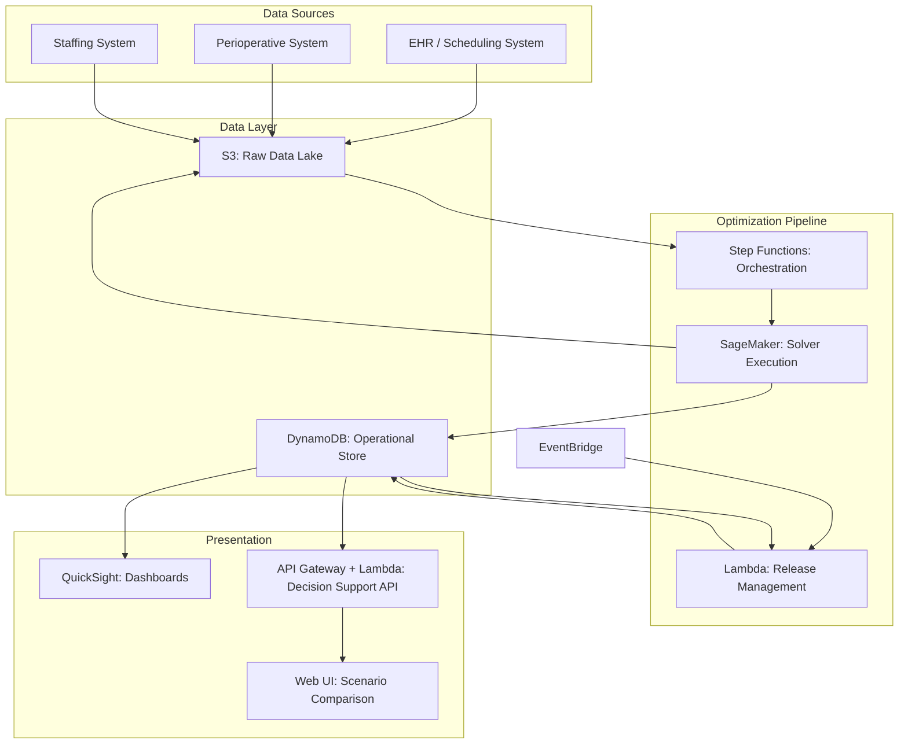

# Recipe 14.5: Operating Room Block Scheduling

**Complexity:** Medium-High · **Phase:** Production · **Estimated Cost:** ~$200-800/month (solver compute + data infrastructure)

---

## The Problem

Here's a scenario that plays out every Monday morning in every hospital with more than four operating rooms: the orthopedic surgery chief is furious because she only has two block days this quarter, general surgery has three blocks they routinely underuse, and the neurosurgeon who joined six months ago can't get any block time at all because the allocation was set two years ago and nobody wants to revisit it.

Operating rooms are the single most expensive resource in a hospital. A typical OR costs $30-80 per minute to operate when you factor in staffing, equipment, overhead, and opportunity cost. A hospital with 20 ORs is burning through millions per week in OR operating costs. And yet, the average OR utilization rate across US hospitals hovers around 60-70%. That means roughly a third of available surgical capacity sits idle on any given day.

The root cause is almost always the block scheduling system. Block scheduling is how hospitals allocate OR time: surgical services (orthopedics, cardiac, general surgery, etc.) are assigned recurring "blocks" of time, typically in half-day or full-day increments. Dr. Smith gets Room 3 every Tuesday morning. The cardiac team owns Room 7 all day Wednesday and Thursday. These allocations are supposed to reflect demand, but in practice they calcify. They become political territory. Surgeons treat their blocks like property rights, even when they're only filling 40% of the available time.

The result is a paradox: the hospital simultaneously has "no OR availability" (because all blocks are allocated) and terrible utilization (because allocated blocks go partially or fully unused). Surgeons without blocks can't schedule cases. Surgeons with blocks don't release unused time until it's too late for anyone else to use it. The perioperative director is stuck mediating between department chairs who each believe they deserve more time.

This is fundamentally an optimization problem. You have a scarce resource (OR time), competing demands (surgical services with different case volumes, durations, and urgency profiles), and a set of constraints (staffing, equipment, surgeon preferences, regulatory requirements). The goal is to allocate blocks in a way that maximizes utilization while maintaining fairness and access. And the reason it's hard is that the constraints are messy, the objectives conflict, and the politics are real.

---

## The Technology: Optimization for Resource Allocation

### What Is Mathematical Optimization?

Mathematical optimization (sometimes called "mathematical programming," which is confusing because it has nothing to do with writing code) is the discipline of finding the best solution from a set of feasible solutions. You define:

1. **Decision variables:** The things you're choosing. In our case: which service gets which block in which room on which day.
2. **An objective function:** What you're trying to maximize or minimize. Utilization, fairness, surgeon satisfaction, revenue, or some weighted combination.
3. **Constraints:** The rules that limit your choices. You can't schedule two services in the same room at the same time. You can't exceed staffing capacity. Certain rooms have specialized equipment that only certain cases can use.

The solver (the software that actually finds the optimal solution) explores the space of possible allocations and returns the one that best satisfies your objective while respecting all constraints.

### Types of Optimization Models

For OR block scheduling, you're typically working with one of these formulations:

**Integer Programming (IP) / Mixed-Integer Programming (MIP).** Decision variables are integers (often binary: 1 if service X gets block Y, 0 otherwise). This is the most natural formulation for block scheduling because assignments are discrete. You either give orthopedics Tuesday morning in Room 3, or you don't. There's no "half a block." MIP solvers (CPLEX, Gurobi, SCIP, OR-Tools) are mature and can handle problems with thousands of variables and constraints.

**Constraint Programming (CP).** Rather than optimizing a single objective, CP focuses on finding feasible solutions that satisfy all constraints. It's particularly good when the constraint structure is complex (lots of "if-then" rules, sequencing dependencies, irregular patterns). For block scheduling, CP shines when you have many hard constraints and the feasibility question itself is the challenge.

**Multi-Objective Optimization.** In practice, you never have a single objective. You want high utilization AND fairness AND surgeon satisfaction AND revenue maximization. These objectives conflict. Multi-objective approaches (Pareto frontiers, weighted sums, lexicographic ordering) let you explore the tradeoff space and present decision-makers with options rather than a single "optimal" answer.

### The Constraint Landscape

Here's where OR block scheduling gets genuinely interesting (and genuinely hard). The constraints fall into several categories:

**Hard constraints (violations are infeasible):**
- No double-booking: one service per room per time slot
- Equipment constraints: cardiac cases need rooms with bypass capability
- Staffing minimums: certain case types require specialized nursing teams
- Regulatory: trauma rooms must remain available 24/7
- Surgeon credentialing: only credentialed surgeons can operate in certain rooms

**Soft constraints (violations are penalized but allowed):**
- Utilization targets: each service should use at least 70% of allocated time
- Fairness: allocation should roughly reflect case volume and demand
- Continuity: surgeons prefer consistent schedules (same day, same room)
- Adjacency: related services benefit from adjacent blocks (shared equipment setup)
- Release rules: unused blocks should be released with enough lead time for others to use

**Dynamic constraints (change over time):**
- Seasonal demand patterns (joint replacements spike in winter)
- Surgeon sabbaticals, retirements, new hires
- Equipment maintenance schedules
- Construction or renovation taking rooms offline

The art of building a good OR scheduling model is deciding which constraints are truly hard, which are soft (and how to weight them), and how to handle the dynamic ones through periodic re-optimization.

### Solver Selection

Choosing a solver matters more than most people realize. The landscape:

**Commercial solvers (Gurobi, CPLEX, Xpress):** These are the gold standard for MIP problems. They use sophisticated branch-and-bound algorithms with cutting planes, presolve techniques, and heuristics that open-source alternatives can't match for large instances. Gurobi and CPLEX can solve problems with tens of thousands of binary variables in seconds. The downside: licensing costs ($10K-50K+ per year for enterprise use).

**Open-source solvers (SCIP, HiGHS, GLPK, OR-Tools):** Good enough for many practical instances. OR-Tools from Google is particularly accessible and includes both MIP and CP solvers. SCIP is the strongest open-source MIP solver. HiGHS is newer but improving rapidly. For a hospital with 20 ORs and 15 services, open-source solvers will likely find good solutions within acceptable time limits.

**Metaheuristics (simulated annealing, genetic algorithms, tabu search):** When the problem is too large or too nonlinear for exact solvers, metaheuristics provide good (not provably optimal) solutions. They're useful for very large health systems with 50+ ORs across multiple campuses, or when the objective function includes complex nonlinear components that MIP can't handle cleanly.

For most single-hospital implementations, a MIP formulation solved with either a commercial solver (if budget allows) or OR-Tools/HiGHS (if it doesn't) is the right starting point.

### Batch vs. Real-Time Optimization

Block scheduling is fundamentally a batch problem. You're setting the allocation for a quarter or a year, not making real-time decisions. The optimization runs periodically (quarterly is typical), takes historical utilization data as input, and produces a new block allocation as output.

However, there's a real-time component that matters: **block release and open-time management.** Once blocks are allocated, the day-to-day question becomes: "Service X hasn't filled their Tuesday block for next week. Should we release it to the open pool? When? To whom?" This is a shorter-horizon optimization that runs daily or even hourly, and it needs to balance the block owner's right to use their time against the hospital's interest in filling empty slots.

The two-tier approach works well:
1. **Strategic (quarterly):** Full re-optimization of block allocations based on trailing utilization, demand forecasts, and staffing plans.
2. **Tactical (daily/weekly):** Release management and open-time allocation using simpler heuristics or lightweight optimization.

---

## General Architecture Pattern

The end-to-end system has four major components:

```text
[Data Collection] → [Model Building] → [Optimization Engine] → [Decision Support UI]
```

**Data Collection:** Pull historical case data (case types, durations, surgeon, room, date), current block allocations, utilization metrics, staffing schedules, equipment inventories, and surgeon preferences. This data lives in your EHR, scheduling system, and perioperative information system. You need a reliable ETL pipeline that refreshes regularly.

**Model Building:** Transform the raw data into optimization model inputs. This means calculating demand by service, estimating case duration distributions, identifying constraint parameters (room capabilities, staffing limits), and defining the objective function weights. This is where domain expertise matters most. The model builder encodes the hospital's priorities into mathematics.

**Optimization Engine:** The solver itself. Takes the model (variables, objective, constraints) and returns an optimal or near-optimal solution. For batch scheduling, this runs on-demand when the perioperative team wants to generate a new allocation. For release management, it runs on a schedule (nightly or more frequently).

**Decision Support UI:** The optimization output is a recommendation, not an edict. Surgeons and administrators need to see the proposed allocation, understand why it changed from the current state, compare scenarios ("what if we give neurosurgery an extra block?"), and ultimately approve or modify the result. The UI should show utilization projections, fairness metrics, and the impact of manual overrides.

This is not a fully automated system. Block scheduling involves political negotiation, and the optimization provides the analytical foundation for that negotiation. The best implementations position the tool as "here's what the data says is optimal" and let humans make the final call.

---

## The AWS Implementation

### Why These Services

**Amazon SageMaker for model development and solver execution.** SageMaker provides the compute environment for running optimization solvers. You can package OR-Tools, PuLP, or even commercial solvers (with appropriate licensing) into SageMaker Processing jobs or custom containers. The advantage over running on a bare EC2 instance: managed infrastructure, spot instance support for cost optimization on long-running solves, and integration with the broader ML pipeline for demand forecasting components.

**AWS Lambda for orchestration and lightweight optimization.** The daily release management logic (simpler heuristics, smaller problem instances) runs well on Lambda. The quarterly strategic optimization is too compute-intensive for Lambda's 15-minute timeout, but the coordination logic (triggering the SageMaker job, collecting results, notifying stakeholders) fits perfectly.

**Amazon DynamoDB for operational data.** Block allocations, utilization metrics, release rules, and surgeon preferences are read-heavy, low-latency data. DynamoDB's single-digit-millisecond reads make it ideal for the decision support UI and for the daily release management queries.

**Amazon S3 for historical data and model artifacts.** Case history exports, model parameter files, solver output files, and scenario comparisons all land in S3. This gives you a complete audit trail of every optimization run and its inputs.

**Amazon QuickSight for utilization dashboards.** Perioperative leaders need to see utilization trends, block performance by service, and the projected impact of proposed changes. QuickSight connects directly to the data in DynamoDB and S3 and provides the visualization layer without building custom dashboards.

**AWS Step Functions for pipeline orchestration.** The quarterly optimization workflow has multiple steps: data extraction, preprocessing, model building, solver execution, result validation, and notification. Step Functions coordinates this sequence with error handling, retries, and human approval gates.

**Amazon EventBridge for scheduling.** Triggers the daily release management runs and the periodic data refresh jobs on a cron schedule.

### Architecture Diagram



### Prerequisites

| Requirement | Details |
|-------------|---------|
| AWS Services | SageMaker, Lambda, DynamoDB, S3, Step Functions, EventBridge, QuickSight, API Gateway |
| IAM Permissions | sagemaker:CreateProcessingJob, lambda:InvokeFunction, dynamodb:PutItem/GetItem/Query, s3:GetObject/PutObject, states:StartExecution |
| BAA | Required. Block schedules contain surgeon names and may reference patient case types. |
| Encryption | S3 SSE-KMS, DynamoDB encryption at rest, TLS in transit |
| VPC | Recommended for SageMaker jobs accessing on-premises EHR data |
| CloudTrail | Audit logging for all optimization runs and allocation changes |
| Sample Data | Synthetic OR case data with realistic duration distributions. Never use real patient data in dev. |
| Cost Estimate | ~$200-400/month for daily release management (Lambda + DynamoDB). ~$400-800/month including quarterly SageMaker optimization runs. |

### Ingredients

| AWS Service | Role in This Recipe |
|-------------|-------------------|
| Amazon SageMaker | Runs optimization solver for strategic block allocation |
| AWS Lambda | Daily release management, API handlers, lightweight orchestration |
| Amazon DynamoDB | Stores current allocations, utilization metrics, solver results |
| Amazon S3 | Historical case data, model artifacts, solver input/output files |
| AWS Step Functions | Orchestrates multi-step quarterly optimization pipeline |
| Amazon EventBridge | Schedules daily release management and data refresh |
| Amazon QuickSight | Utilization dashboards and scenario comparison visualizations |
| API Gateway | REST API for decision support UI |

### Code: Pseudocode Walkthrough

#### Step 1: Extract and Prepare Historical Data

We need case-level data to understand demand patterns. Each historical case tells us: which service performed it, how long it took, which room it used, and when it happened.

If you skip this step, your optimization model has no grounding in reality. It would allocate blocks based on guesses rather than actual demand patterns.

```pseudocode
FUNCTION extract_case_history(start_date, end_date):
    // Pull completed surgical cases from the perioperative system
    raw_cases = query_perioperative_system(
        date_range = [start_date, end_date],
        fields = ["case_id", "service", "surgeon", "room", "scheduled_start",
                  "actual_start", "actual_end", "case_type", "urgency"]
    )

    // Calculate actual duration for each case (wheels-in to wheels-out)
    FOR each case IN raw_cases:
        case.duration_minutes = (case.actual_end - case.actual_start).to_minutes()
        case.turnover_minutes = calculate_turnover(case, next_case_in_room)

    // Aggregate by service to get demand profiles
    service_demand = GROUP raw_cases BY service:
        avg_cases_per_week = COUNT(cases) / weeks_in_range
        avg_duration = MEAN(cases.duration_minutes)
        duration_std = STDDEV(cases.duration_minutes)
        peak_day_distribution = COUNT BY day_of_week

    RETURN service_demand, raw_cases
```

#### Step 2: Define the Optimization Model

This is where we translate the scheduling problem into mathematics. Decision variables represent the choices, constraints represent the rules, and the objective represents what "good" means.

If you skip this step (or get it wrong), the solver either produces infeasible solutions or optimizes for the wrong thing. Getting the model right is 80% of the work.

```pseudocode
FUNCTION build_block_model(service_demand, rooms, time_slots, constraints):
    // Decision variables: binary assignment of service to room-slot
    // x[s][r][t] = 1 if service s is assigned room r in time slot t
    variables = CREATE_BINARY_VARIABLES(
        dimensions = [services, rooms, time_slots]
    )

    // Objective: maximize weighted utilization + fairness
    objective = MAXIMIZE(
        weight_utilization * SUM(expected_utilization(s, r, t) * x[s][r][t])
        + weight_fairness * fairness_score(allocation)
        - weight_fragmentation * fragmentation_penalty(allocation)
    )

    // Hard constraint: no double-booking
    FOR each room r, each time_slot t:
        ADD_CONSTRAINT: SUM(x[s][r][t] for all services s) <= 1

    // Hard constraint: room capability
    FOR each service s, each room r:
        IF room r lacks equipment required by service s:
            FOR each time_slot t:
                ADD_CONSTRAINT: x[s][r][t] = 0

    // Hard constraint: minimum staffing
    FOR each time_slot t:
        total_rooms_active = SUM(x[s][r][t] for all s, r)
        ADD_CONSTRAINT: total_rooms_active <= available_staff[t] / staff_per_room

    // Soft constraint: utilization floor (penalize underuse)
    FOR each service s:
        allocated_minutes = SUM(x[s][r][t] * slot_duration for all r, t)
        expected_used = service_demand[s].avg_cases_per_week * service_demand[s].avg_duration
        utilization_ratio = expected_used / allocated_minutes
        ADD_SOFT_CONSTRAINT: utilization_ratio >= 0.70, penalty = underuse_penalty

    // Soft constraint: continuity (prefer same day/room as current)
    FOR each service s:
        continuity_bonus = SUM(
            x[s][r][t] * current_allocation_match(s, r, t)
        )
        ADD_TO_OBJECTIVE: weight_continuity * continuity_bonus

    RETURN model(variables, objective, constraints)
```

#### Step 3: Solve the Model

Hand the mathematical model to a solver and let it find the best allocation. This is where compute power matters. A well-formulated model for a 20-OR hospital typically solves in seconds to minutes. Larger instances or tighter optimality gaps may take longer.

If you skip this step, well, you don't have a solution. But more subtly: if you don't set appropriate time limits and optimality gaps, the solver might run for hours chasing a marginal improvement.

```pseudocode
FUNCTION solve_block_allocation(model, config):
    // Configure solver parameters
    solver = INITIALIZE_SOLVER(
        type = "MIP",                    // Mixed-Integer Programming
        engine = "OR-Tools" or "Gurobi", // Depends on licensing
        time_limit_seconds = 300,        // 5 minutes max
        optimality_gap = 0.02,           // Accept solutions within 2% of optimal
        threads = 4                      // Parallel branch-and-bound
    )

    // Solve
    result = solver.solve(model)

    IF result.status == "OPTIMAL" or result.status == "FEASIBLE":
        allocation = EXTRACT_SOLUTION(result, model.variables)
        metrics = CALCULATE_METRICS(allocation):
            overall_utilization = total_expected_used / total_allocated
            fairness_index = gini_coefficient(service_utilizations)
            changes_from_current = count_differences(allocation, current_allocation)
        RETURN allocation, metrics, result.objective_value

    ELSE IF result.status == "INFEASIBLE":
        // Constraints are too tight. Identify which ones conflict.
        infeasible_subset = solver.compute_IIS(model)  // Irreducible Infeasible Set
        RETURN error("Model infeasible", conflicting_constraints = infeasible_subset)

    ELSE:
        RETURN error("Solver failed", status = result.status)
```

#### Step 4: Daily Release Management

Between quarterly re-optimizations, you need a lighter-weight process that manages unused blocks. This runs daily and decides which upcoming blocks should be released to the open pool.

If you skip this step, allocated-but-unused blocks sit empty while other surgeons can't find time. This is the single biggest driver of the utilization gap.

```pseudocode
FUNCTION daily_release_check(lookahead_days = 14):
    // Get all blocks in the lookahead window
    upcoming_blocks = QUERY blocks WHERE date BETWEEN today AND today + lookahead_days

    FOR each block IN upcoming_blocks:
        // Check if the block owner has scheduled cases
        scheduled_cases = QUERY cases WHERE block_id = block.id AND status = "scheduled"
        fill_rate = scheduled_cases.total_duration / block.duration

        // Apply release rules based on time horizon
        days_until_block = (block.date - today).days

        IF days_until_block <= 3 AND fill_rate < 0.25:
            // Very close and mostly empty: auto-release
            RELEASE_BLOCK(block, reason = "auto_release_underutilized")
            NOTIFY(block.owner, "Your block on {date} was released due to low fill rate")

        ELSE IF days_until_block <= 7 AND fill_rate < 0.50:
            // One week out and half empty: notify owner, request confirmation
            SEND_RELEASE_REQUEST(block.owner, block, deadline = today + 1)

        ELSE IF days_until_block <= 14 AND fill_rate == 0:
            // Two weeks out and completely empty: flag for review
            FLAG_FOR_REVIEW(block, reason = "no_cases_scheduled")

    // Allocate released blocks to waitlist
    released_blocks = QUERY blocks WHERE status = "released" AND date > today
    waitlist = QUERY requests WHERE status = "pending" ORDER BY priority, request_date

    FOR each released_block IN released_blocks:
        eligible_requests = FILTER waitlist WHERE
            service.can_use_room(released_block.room) AND
            surgeon.available(released_block.date)
        IF eligible_requests IS NOT EMPTY:
            ASSIGN(released_block, eligible_requests[0])
```

#### Step 5: Store Results and Generate Reports

The optimization output needs to be persisted, versioned, and made available to the decision support UI. Each run produces a proposed allocation that stakeholders review before it takes effect.

```pseudocode
FUNCTION store_optimization_results(allocation, metrics, run_id):
    // Store the full allocation as a versioned artifact
    WRITE_TO_S3(
        bucket = "or-optimization-results",
        key = "runs/{run_id}/allocation.json",
        data = allocation
    )

    // Store operational data for the UI
    FOR each block IN allocation:
        WRITE_TO_DYNAMODB(
            table = "block_allocations",
            item = {
                "pk": "PROPOSED#{run_id}",
                "sk": "ROOM#{block.room}#SLOT#{block.time_slot}",
                "service": block.service,
                "expected_utilization": block.projected_utilization,
                "change_from_current": block.delta_description
            }
        )

    // Store summary metrics
    WRITE_TO_DYNAMODB(
        table = "optimization_runs",
        item = {
            "pk": "RUN#{run_id}",
            "timestamp": NOW(),
            "overall_utilization": metrics.overall_utilization,
            "fairness_index": metrics.fairness_index,
            "total_changes": metrics.changes_from_current,
            "solver_status": metrics.solver_status,
            "solve_time_seconds": metrics.solve_time
        }
    )

    RETURN run_id
```

> **Curious how this looks in Python?** The pseudocode above covers the concepts. If you'd like to see sample Python code that demonstrates these patterns using boto3 and OR-Tools, check out the [Python Example](chapter14.05-python-example). It walks through each step with inline comments and notes on what you'd need to change for a real deployment.

---

### Expected Results

Sample output from a quarterly optimization run:

```json
{
  "run_id": "opt-2026-Q2-001",
  "solve_time_seconds": 47.3,
  "solver_status": "OPTIMAL",
  "optimality_gap": 0.008,
  "metrics": {
    "projected_overall_utilization": 0.78,
    "current_overall_utilization": 0.63,
    "fairness_index_gini": 0.12,
    "total_block_changes": 14,
    "services_gaining_blocks": ["neurosurgery", "urology"],
    "services_losing_blocks": ["general_surgery"],
    "services_unchanged": ["cardiac", "orthopedics", "ENT"]
  },
  "allocation_summary": [
    {
      "service": "orthopedics",
      "blocks_allocated": 8,
      "projected_utilization": 0.82,
      "change": "no_change"
    },
    {
      "service": "general_surgery",
      "blocks_allocated": 5,
      "projected_utilization": 0.75,
      "change": "reduced_by_2"
    },
    {
      "service": "neurosurgery",
      "blocks_allocated": 4,
      "projected_utilization": 0.71,
      "change": "increased_by_2"
    }
  ]
}
```

**Performance Benchmarks:**

| Metric | Value |
|--------|-------|
| Solve time (20 ORs, 15 services) | 30-120 seconds |
| Solve time (50 ORs, 30 services) | 5-30 minutes |
| Projected utilization improvement | 10-20 percentage points |
| Daily release management runtime | < 5 seconds |
| Data refresh latency | < 15 minutes from source |
| Scenario comparison (UI) | < 2 seconds |

**Where It Struggles:**

- When historical data is sparse (new hospital, new service line) the demand estimates are unreliable
- When political constraints dominate (the chief of surgery insists on keeping blocks regardless of utilization), the model's recommendations get overridden
- When case mix changes rapidly (pandemic surges, new surgeon with very different case profile), the trailing data lags reality
- When the problem is highly constrained (many rooms with specialized equipment, tight staffing), feasible solutions may not exist without relaxing something

---

## The Honest Take

Here's what I've learned about OR block scheduling optimization that the textbooks don't tell you:

**The politics are harder than the math.** Seriously. Building the optimization model is a well-understood engineering problem. Getting a department chair to accept that their utilization data justifies losing a block? That's a human problem no solver can fix. The best implementations frame the optimizer as a "fairness engine" that removes bias from the allocation process. When the data says general surgery is using 45% of their blocks, it's harder to argue for keeping them than when it's just the perioperative director's opinion.

**Utilization is a terrible sole objective.** If you optimize purely for utilization, you'll pack the schedule so tight that any case running long creates a cascade of delays. You need slack in the system. A target of 75-80% utilization is more realistic and more humane than chasing 95%.

**The release management problem is more impactful than the allocation problem.** Hospitals that implement good release rules (auto-release at 72 hours if less than 25% filled, for example) see bigger utilization gains than hospitals that re-optimize allocations quarterly but don't manage releases. Start with release management. It's simpler, faster to implement, and delivers results immediately.

**Your data is worse than you think.** Case duration data from the EHR is notoriously unreliable. "Wheels in" and "wheels out" times are often entered late, rounded, or just wrong. Turnover times are rarely tracked accurately. You'll spend more time cleaning and validating data than building the model. Budget for it.

**Quarterly is too infrequent, monthly is too disruptive.** Most hospitals land on quarterly re-optimization with monthly "adjustment" runs that can make small changes (plus or minus one block per service) without a full reallocation. This balances responsiveness with stability.

---

## Variations and Extensions

### Multi-Campus Optimization

For health systems with multiple hospitals, the optimization can span campuses. A surgeon who operates at two sites might have blocks at both, and the system-level optimization can balance load across facilities. This dramatically increases problem size but also increases the opportunity for improvement. The key addition is travel time constraints between campuses.

### Demand Forecasting Integration

Rather than using trailing historical averages, feed a time-series forecast of future demand into the optimizer. This lets the allocation anticipate seasonal patterns (joint replacements in winter, trauma in summer) rather than react to them a quarter late. A simple ARIMA or Prophet model on weekly case volumes by service is usually sufficient.

### Surgeon-Level Preference Optimization

Instead of allocating blocks to services, allocate to individual surgeons. This is a much larger problem (more decision variables) but produces schedules that better reflect individual practice patterns. It also makes the fairness question more granular: is it fair that Dr. A has prime Tuesday morning slots while Dr. B always gets Friday afternoon?

---

## Related Recipes

- **Recipe 14.4: Nurse Staffing Optimization** - Staffing constraints feed directly into OR block feasibility. The two models can be linked.
- **Recipe 14.7: OR Case Sequencing** - Once blocks are allocated, the next problem is sequencing individual cases within a block for maximum efficiency.
- **Recipe 12.3: Surgical Duration Forecasting** - Better duration predictions improve the utilization estimates that drive block allocation.
- **Recipe 14.1: Appointment Slot Optimization** - Similar optimization structure applied to outpatient scheduling.

---

## Additional Resources

### AWS Documentation

- [Amazon SageMaker Processing Jobs](https://docs.aws.amazon.com/sagemaker/latest/dg/processing-job.html) - Running custom containers for optimization workloads
- [AWS Step Functions Developer Guide](https://docs.aws.amazon.com/step-functions/latest/dg/welcome.html) - Orchestrating multi-step optimization pipelines
- [Amazon DynamoDB Developer Guide](https://docs.aws.amazon.com/amazondynamodb/latest/developerguide/) - Data modeling for operational scheduling data
- [Amazon EventBridge Scheduler](https://docs.aws.amazon.com/scheduler/latest/UserGuide/what-is-scheduler.html) - Cron-based triggering for daily optimization runs
- [Amazon QuickSight](https://docs.aws.amazon.com/quicksight/latest/user/welcome.html) - Building utilization dashboards

### Optimization Libraries and Solvers

- [Google OR-Tools](https://developers.google.com/optimization) - Open-source optimization suite with MIP and CP solvers
- [PuLP Documentation](https://coin-or.github.io/pulp/) - Python library for formulating linear and integer programs
- [HiGHS Solver](https://highs.dev/) - High-performance open-source linear and mixed-integer solver

<!-- TODO (TechWriter): Verify if there are specific aws-samples repos for optimization/scheduling workloads on SageMaker -->

### Industry References

- AORN (Association of periOperative Registered Nurses) guidelines on OR utilization metrics
- Cardoen, B., Demeulemeester, E., & Beliën, J. (2010). "Operating room planning and scheduling: A literature review." European Journal of Operational Research.

---

## Estimated Implementation Time

| Phase | Duration |
|-------|----------|
| Basic (release management rules only) | 4-6 weeks |
| Production-ready (full optimization + UI) | 3-5 months |
| With variations (multi-campus, forecasting) | 6-9 months |

---

## Tags

`optimization` `operations-research` `scheduling` `operating-room` `resource-allocation` `mixed-integer-programming` `perioperative` `utilization`

---

| [← 14.4: Nurse Staffing Optimization](chapter14.04-nurse-staffing-optimization) | [Chapter 14 Index](chapter14-index) | [14.6: Patient Flow / Bed Assignment →](chapter14.06-patient-flow-bed-assignment) |
