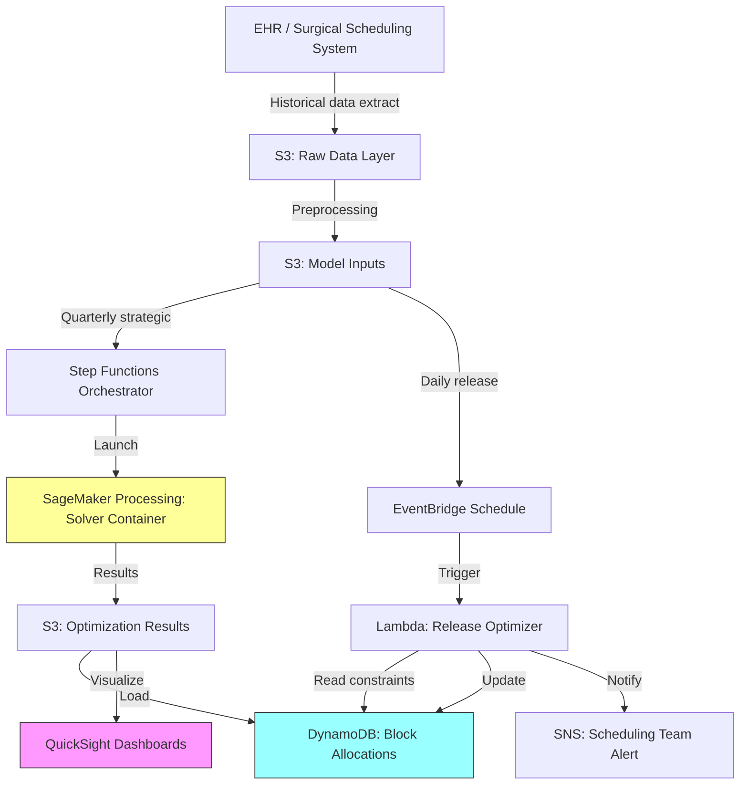

# Recipe 14.5: Operating Room Block Scheduling

**Complexity:** Medium · **Phase:** Production · **Estimated Cost:** ~$200-800/month (compute for optimization runs)

---

## The Problem

Operating rooms are the single most expensive asset in a hospital. A typical OR costs $30-60 per minute to run (staff, equipment, facilities, overhead). A 20-room surgical suite burning at even 70% utilization is leaving millions on the table annually. But here's the thing: underutilization isn't a simple "fill more slots" problem. It's a political, operational, and mathematical puzzle wrapped in decades of institutional history.

The traditional approach to OR time is block scheduling. Surgical services (orthopedics, cardiothoracic, general surgery, etc.) are allocated fixed blocks of time, usually in 4-hour or 8-hour chunks, on specific days. Orthopedics gets Monday and Wednesday mornings in ORs 3 and 4. Cardiac gets all day Tuesday in ORs 7 and 8. And so on.

The problem is that these allocations were often decided years ago based on volumes that no longer reflect reality. A service that was doing 30 cases a week when they got their blocks might be down to 18. But they're not giving up those blocks voluntarily, because block time is power in a hospital. It determines how many cases a service can do, how many surgeons they can recruit, and ultimately how much revenue they generate. Surgeons who can't get block time leave for competitors who offer it.

So you end up with services hoarding blocks they don't fully use (utilization below 75%) while other services have surgeons stacking cases into whatever open time they can find. The scheduler is managing this chaos with spreadsheets, phone calls, and institutional memory. They're not optimizing anything. They're surviving.

The mathematical optimization approach asks: given everything we know about demand, constraints, and objectives, what's the best possible allocation? Not perfect (there's no perfect here), but provably better than the status quo. And crucially, defensible. When the chief of orthopedics asks why their blocks got reduced, you can show the math, the utilization data, and the fairness criteria. That's harder to argue with than "the scheduler decided."

---

## The Technology: Mathematical Optimization for Resource Allocation

### What Is Block Scheduling Optimization?

At its core, this is a resource allocation problem. You have a fixed supply (OR rooms x time slots) and competing demand (surgical services wanting block time). You need to assign blocks to services in a way that maximizes some objective while respecting constraints.

This is a well-studied class of problem in operations research called Integer Programming (IP), or more specifically Mixed-Integer Programming (MIP) when some variables are continuous. The "integer" part matters because you can't give half a block to orthopedics. It's either a full block or nothing.

### The Decision Variables

The fundamental decision variable is binary: does service S get block B in room R on day D? Yes or no. For a 20-room suite operating 5 days a week with 2 blocks per day (AM/PM), you're looking at 20 x 5 x 2 = 200 block-slots to assign across maybe 12-15 surgical services. That's around 3,000 binary decision variables. Sounds manageable, and for a modern solver, it is. The complexity comes from the constraints.

### The Objective Function

What are you actually maximizing? This is where things get interesting (and political). Common objectives include:

**Maximize weighted utilization.** You want blocks assigned to services that will actually use them. Weight by historical utilization rates. A service running at 85% utilization in their current blocks should probably keep those blocks. One running at 55% should lose some.

**Maximize access fairness.** Every service should get enough block time to handle their demand. This is measured as the ratio of allocated time to requested time. A perfectly fair system gives everyone the same ratio. Reality requires weighing urgency, strategic priority, and patient volume.

**Minimize patient wait time.** Some services have patients waiting weeks for surgery because they lack block time. The objective can directly minimize expected wait times across all services.

**Multi-objective.** In practice, you optimize a weighted combination of these. The weights encode institutional priorities and become the most politically contentious part of the project. Getting leadership to agree on weights is harder than building the model.

### Constraints

This is where the problem earns its "medium complexity" rating. Real-world block scheduling has dozens of constraint types:

**Capacity constraints.** Each block can only be assigned to one service. Each room is available for a fixed number of blocks per day (usually 2: AM and PM, sometimes 3 with evening blocks).

**Equipment constraints.** Some ORs have specialized equipment (robotic surgery arms, cardiac bypass machines, neuro navigation systems). Only certain services can use those rooms. Conversely, some services can only operate in rooms with specific equipment.

**Staff constraints.** Certain services require specialized nursing or anesthesia teams. Those teams have limited availability. You can't schedule cardiac and transplant in the same block if they share a perfusion team.

**Preference constraints.** Surgeons have day preferences (often contractual). Some services want contiguous blocks (all-day rather than scattered AM/PM across the week). Some want the same rooms every time for equipment consistency.

**Minimum/maximum allocation.** Each service has a minimum block allocation (below which they can't operate effectively) and a maximum (above which they couldn't fill the time even optimistically).

**Release rules.** Blocks not filled within a certain timeframe (typically 72 hours before the surgery date) are released to an open pool. The optimization must account for the expected release rate by service.

**Adjacency constraints.** If a service has two blocks in a day, they should be in the same room or adjacent rooms to avoid equipment moves and staff confusion.

### Solver Selection

For a problem this size (a few thousand binary variables, a few hundred constraints), commercial MIP solvers (Gurobi, CPLEX) will find optimal or near-optimal solutions in seconds to minutes. Open-source solvers (COIN-OR CBC, SCIP, Google OR-Tools) handle it comfortably too, with slightly longer solve times.

The choice between commercial and open-source often comes down to support requirements and solve time tolerance. If you need guaranteed sub-second response for interactive "what-if" scenarios with leadership, a commercial solver is safer. If you're running a batch optimization weekly and can tolerate a few minutes of solve time, open-source works fine.

For cloud deployments, the solver runs as a containerized workload. No persistent license server needed if you use open-source. Commercial solvers have container-friendly licensing models now, but read the fine print on machine-locked vs. floating licenses.

### Batch vs. Real-Time

OR block scheduling is fundamentally a batch optimization problem. You're not making real-time decisions. You're generating an allocation plan that holds for a quarter or a semester, with periodic re-optimization (monthly or quarterly).

However, there's a real-time adjacent problem: block release management. When a service hasn't filled their block 72 hours before the date, should that block be released to the open pool? And if so, which service from the waitlist gets it? That's a simpler, faster optimization (or even a heuristic) that runs daily.

The architecture should support both: quarterly strategic optimization (minutes of compute, complex constraints) and daily tactical release decisions (sub-second, simpler model).

### What Makes This Different from Generic Scheduling

Generic resource scheduling (conference rooms, compute instances) doesn't have:

- **Political dynamics.** Surgical services are departments with budgets, chiefs, and institutional power. Telling orthopedics they lose a block is not the same as telling an app it gets fewer instances.
- **Human safety coupling.** If the schedule is infeasible (not enough anesthesia coverage for concurrent cases), patient safety is at risk.
- **Historical entitlement.** Services treat their blocks as property rights. Any reallocation, however mathematically justified, faces resistance.
- **Multi-stakeholder objectives.** The CFO wants utilization. The CMO wants access equity. Department chiefs want their blocks. Patients want short waits. These objectives genuinely conflict.

The optimization model doesn't solve the politics. But it provides an objective, defensible starting point for negotiation. That alone is worth the project.

---

## General Architecture Pattern

```text
[Historical Data Collection] → [Demand Forecasting] → [Model Formulation] → [Optimization Solve] → [Scenario Analysis] → [Implementation]
```

**Stage 1: Data Collection.** Pull historical OR utilization, case volumes by service, block usage rates, cancellation/release rates, equipment requirements, and staffing constraints. This data typically lives across the surgical scheduling system, EHR, and perioperative documentation systems. Plan for 12-24 months of history to capture seasonal patterns.

**Stage 2: Demand Forecasting.** Estimate future demand per service. This isn't just projecting historical volumes. It accounts for surgeon recruitment/departure, new service lines, seasonal patterns, and strategic growth targets. Output: expected cases per week per service, with uncertainty ranges.

**Stage 3: Model Formulation.** Translate business rules into mathematical constraints. Build the objective function from stakeholder-agreed weights. This is the most labor-intensive stage and requires deep domain knowledge. The model is code; version control it.

**Stage 4: Optimization Solve.** Feed the model to a solver. For the quarterly strategic plan, allow minutes of solve time and explore multiple scenarios (different weight combinations, what-if scenarios for adding/removing rooms). For daily release decisions, solve must be sub-second.

**Stage 5: Scenario Analysis.** Present 3-5 allocation scenarios to leadership. "Here's what maximizing utilization looks like. Here's what maximizing fairness looks like. Here's a compromise at 60/40 weighting." Interactive dashboards where leadership can adjust weights and see immediate results.

**Stage 6: Implementation.** Push the approved allocation to the surgical scheduling system. Monitor actual utilization against plan. Feed actuals back into the next optimization cycle.

---

## The AWS Implementation

### Why These Services

**Amazon SageMaker Processing Jobs for optimization runs.** The quarterly strategic optimization is a compute-intensive batch job. SageMaker Processing gives you a managed container execution environment where you bring your own optimization code (solver + model). You define the container image (with your solver installed), point it at input data in S3, and it runs to completion. No infrastructure to manage. For problems that solve in minutes, a single ml.m5.xlarge instance is sufficient. For larger health systems exploring hundreds of scenarios, you can scale up.

**Amazon S3 for data pipeline.** Historical utilization data, constraint definitions, model parameters, and optimization results all stage through S3. The separation between raw data, processed inputs, and model outputs keeps the pipeline auditable and reproducible.

**AWS Lambda for daily release optimization.** The daily "should this block be released?" decision is lightweight: a few hundred variables, a handful of constraints, sub-second solve time. Lambda with an open-source solver (OR-Tools compiled into the deployment package) handles this perfectly. Triggered by EventBridge on a schedule or by the surgical scheduling system via API Gateway.

**Amazon DynamoDB for constraint and allocation storage.** Block allocations, constraint definitions, and service configurations need fast reads by the scheduling system and the optimization pipeline. DynamoDB's key-value model fits: look up allocations by service-day-room, look up constraints by service, look up room capabilities by room ID.

**Amazon QuickSight for scenario dashboards.** Leadership needs interactive visualizations showing utilization projections, fairness metrics, and scenario comparisons. QuickSight connects directly to S3 output data and supports drill-down by service, room, and time period.

**AWS Step Functions for pipeline orchestration.** The quarterly optimization is a multi-step workflow: data extraction, preprocessing, optimization (potentially multiple scenarios in parallel), result aggregation, and dashboard refresh. Step Functions orchestrates this sequence with built-in error handling and retry logic.

### Architecture Diagram



### Prerequisites

| Requirement | Details |
|-------------|---------|
| **AWS Services** | Amazon SageMaker, Amazon S3, AWS Lambda, Amazon DynamoDB, Amazon QuickSight, AWS Step Functions, Amazon EventBridge, Amazon SNS |
| **IAM Permissions** | `sagemaker:CreateProcessingJob`, `s3:GetObject`, `s3:PutObject`, `dynamodb:PutItem`, `dynamodb:GetItem`, `dynamodb:Query`, `lambda:InvokeFunction`, `states:StartExecution` |
| **BAA** | Required if optimization inputs include patient identifiers. Block scheduling typically uses aggregated service-level data (not PHI), but if you're including surgeon names or patient wait lists, sign the BAA. |
| **Encryption** | S3: SSE-KMS; DynamoDB: encryption at rest (default); Lambda environment variables: KMS encrypted |
| **VPC** | Production: SageMaker Processing in VPC with VPC endpoints for S3 and DynamoDB. Lambda in VPC if accessing EHR integration endpoints. |
| **CloudTrail** | Enabled: log all S3 and DynamoDB API calls. Allocation changes are auditable decisions. |
| **Sample Data** | Synthetic OR utilization data. Generate from known distributions (case durations follow lognormal, volumes follow Poisson). Never use real surgeon names or patient data in dev. |
| **Cost Estimate** | SageMaker Processing: ~$0.20/hour for ml.m5.xlarge (solve takes 5-30 min quarterly). Lambda: negligible for daily runs. DynamoDB: ~$25/month for on-demand. S3: negligible. QuickSight: $18-24/user/month. Total: $200-800/month depending on user count. |

### Ingredients

| AWS Service | Role |
|------------|------|
| **Amazon SageMaker Processing** | Runs quarterly strategic optimization (solver container) |
| **Amazon S3** | Stores raw data, model inputs, and optimization results |
| **AWS Lambda** | Runs daily block release optimization (lightweight solver) |
| **Amazon DynamoDB** | Stores block allocations, constraints, service configs |
| **Amazon QuickSight** | Interactive scenario dashboards for leadership |
| **AWS Step Functions** | Orchestrates the quarterly optimization pipeline |
| **Amazon EventBridge** | Triggers daily release optimization on schedule |
| **Amazon SNS** | Notifies scheduling team of release decisions |
| **AWS KMS** | Manages encryption keys |
| **Amazon CloudWatch** | Logs, metrics, and alarms for pipeline health |

### Code

#### Walkthrough

**Step 1: Extract and prepare historical data.** The optimizer needs facts, not opinions. Pull 12-24 months of actual OR utilization from the surgical scheduling system. For each block that was assigned, capture: which service held it, how many cases were actually scheduled into it, actual start/end times, cancellation rate, and release-to-pool events. This historical view is the foundation for demand forecasting and utilization scoring. Without accurate data, the model produces garbage. Skip this step and you're optimizing against fantasy numbers.

```pseudocode
FUNCTION extract_utilization_data(start_date, end_date):
    // Pull raw block usage records from the surgical scheduling system.
    // Each record represents one block-day: who held the block, what happened in it.
    raw_records = query surgical scheduling system for:
        block assignments between start_date and end_date
        fields: service_id, room_id, block_date, block_type (AM/PM),
                cases_scheduled, cases_completed, first_cut_time,
                last_close_time, released_to_pool (boolean), release_date

    // Compute utilization metrics per service.
    // Utilization = actual time used / available time in block.
    // This is the primary input to the optimizer's fairness calculations.
    FOR each service in unique(raw_records.service_id):
        service_blocks = filter raw_records where service_id == service
        total_blocks_held = count(service_blocks)
        blocks_used = count(service_blocks where cases_completed > 0)
        avg_utilization = mean(actual_case_minutes / available_block_minutes) for service_blocks
        release_rate = count(service_blocks where released_to_pool) / total_blocks_held

        STORE {
            service_id: service,
            total_blocks: total_blocks_held,
            utilization_rate: avg_utilization,
            release_rate: release_rate,
            avg_cases_per_block: mean(cases_completed),
            demand_trend: compute_trend(service_blocks by month)  // growing, stable, or declining
        }

    RETURN aggregated utilization dataset
```

**Step 2: Define constraints and parameters.** This is where domain knowledge becomes math. Every business rule ("cardiac can only use rooms 7 and 8," "no service gets fewer than 2 blocks per week," "Dr. Smith only operates on Tuesdays") becomes a formal constraint in the optimization model. These constraints are stored as structured data, not hardcoded. When rules change (a new robot is installed in room 5, a surgeon's contract changes), you update the constraint data, not the code. This separation is essential for maintainability.

```json
{
  "rooms": [
    {"room_id": "OR-01", "capabilities": ["general", "laparoscopic"], "blocks_per_day": 2},
    {"room_id": "OR-07", "capabilities": ["cardiac", "bypass_machine"], "blocks_per_day": 2},
    {"room_id": "OR-12", "capabilities": ["general", "robotic"], "blocks_per_day": 2}
  ],
  "services": [
    {
      "service_id": "ORTHO",
      "required_capabilities": ["general"],
      "min_blocks_per_week": 4,
      "max_blocks_per_week": 10,
      "preferred_days": ["Monday", "Wednesday", "Friday"],
      "contiguous_preference": true
    },
    {
      "service_id": "CARDIAC",
      "required_capabilities": ["cardiac", "bypass_machine"],
      "min_blocks_per_week": 3,
      "max_blocks_per_week": 6,
      "preferred_days": ["Tuesday", "Thursday"],
      "contiguous_preference": true
    }
  ],
  "objective_weights": {
    "utilization": 0.4,
    "fairness": 0.35,
    "preference_satisfaction": 0.25
  }
}
```

```pseudocode
FUNCTION load_constraints(constraint_config):
    // Parse constraint configuration into solver-ready format.
    // Each constraint type maps to a specific mathematical inequality or equality.
    
    room_capabilities = map of room_id -> set of capabilities
    service_requirements = map of service_id -> required capabilities
    min_allocations = map of service_id -> minimum blocks per week
    max_allocations = map of service_id -> maximum blocks per week
    day_preferences = map of service_id -> list of preferred days
    
    // Validate: every service's required capabilities must exist in at least one room.
    // If cardiac needs a bypass machine and no room has one, the problem is infeasible.
    FOR each service in service_requirements:
        compatible_rooms = rooms where capabilities contain all of service.required_capabilities
        IF compatible_rooms is empty:
            RAISE error: "Service {service} has no compatible rooms. Check constraint config."
    
    RETURN constraint_set
```

**Step 3: Formulate and solve the optimization model.** This is the mathematical core. Build a MIP model with binary decision variables (assign block B in room R on day D to service S: yes/no), objective function (weighted combination of utilization, fairness, and preference satisfaction), and all constraints from Step 2. Feed it to a solver. The solver uses branch-and-bound algorithms internally, exploring the solution space and pruning branches that can't improve on the best solution found so far. For a 20-room, 5-day problem, expect solve times of 30 seconds to 5 minutes depending on constraint complexity and optimality gap tolerance.

```pseudocode
FUNCTION solve_block_allocation(utilization_data, constraints, objective_weights):
    // Initialize the optimization model.
    model = create new MIP model

    // DECISION VARIABLES
    // x[s][r][d][t] = 1 if service s is assigned room r on day d, block type t (AM/PM)
    // This is the fundamental yes/no decision for every possible assignment.
    FOR each service s, room r, day d, block_type t:
        x[s][r][d][t] = add binary variable to model

    // OBJECTIVE FUNCTION
    // Combine multiple goals into a single score to maximize.
    
    // Component 1: Weighted utilization.
    // Prefer assigning blocks to services with high historical utilization.
    // A service at 90% utilization gets more value from a block than one at 50%.
    utilization_score = SUM over all (s, r, d, t):
        x[s][r][d][t] * utilization_data[s].utilization_rate

    // Component 2: Fairness (demand coverage ratio).
    // Each service should get a similar fraction of their requested blocks.
    // Minimize the variance in coverage ratios across services.
    FOR each service s:
        allocated[s] = SUM of x[s][r][d][t] over all r, d, t
        coverage_ratio[s] = allocated[s] / service_demand[s]
    fairness_score = negative variance of coverage_ratio across all services

    // Component 3: Preference satisfaction.
    // Bonus points for assignments on preferred days.
    preference_score = SUM over all (s, r, d, t):
        x[s][r][d][t] * (1 if d in day_preferences[s] else 0)

    // Combined objective (maximize).
    model.objective = (objective_weights.utilization * utilization_score
                     + objective_weights.fairness * fairness_score
                     + objective_weights.preference_satisfaction * preference_score)

    // CONSTRAINTS

    // Each block-slot assigned to at most one service.
    FOR each room r, day d, block_type t:
        ADD CONSTRAINT: SUM of x[s][r][d][t] over all services s <= 1

    // Room capability: only assign a service to a room it can use.
    FOR each service s, room r:
        IF room r lacks any capability required by service s:
            FOR each day d, block_type t:
                ADD CONSTRAINT: x[s][r][d][t] == 0

    // Minimum and maximum weekly allocation per service.
    FOR each service s:
        total_assigned = SUM of x[s][r][d][t] over all r, d, t
        ADD CONSTRAINT: total_assigned >= min_allocations[s]
        ADD CONSTRAINT: total_assigned <= max_allocations[s]

    // Contiguity: if a service wants all-day blocks, AM and PM in same room.
    FOR each service s where contiguous_preference is true:
        FOR each room r, day d:
            // If assigned AM, must also get PM in same room (or neither).
            ADD CONSTRAINT: x[s][r][d][AM] == x[s][r][d][PM]

    // SOLVE
    // Set a time limit so we don't wait forever for marginal improvements.
    model.set_time_limit(300)  // 5 minutes max
    model.set_optimality_gap(0.02)  // Accept solutions within 2% of theoretical optimal
    result = model.solve()

    IF result.status == OPTIMAL or result.status == FEASIBLE:
        RETURN extract_allocation_from(result)
    ELSE:
        // Infeasible means constraints conflict. Common cause: minimum allocations
        // exceed available blocks. Return diagnostic info so humans can adjust.
        RETURN infeasibility_diagnosis(model)
```

**Step 4: Generate scenario comparisons.** Leadership never wants one answer. They want options. Run the optimization with different objective weight combinations to show the tradeoffs explicitly. "If we weight utilization heavily, orthopedics loses 2 blocks but overall utilization goes from 72% to 81%. If we weight fairness heavily, everyone gets proportional access but some low-volume services get blocks they won't fill." This step turns the optimizer from a black box into a decision support tool.

```pseudocode
FUNCTION generate_scenarios(utilization_data, constraints):
    scenarios = [
        {"name": "Maximize Utilization", "weights": {"utilization": 0.7, "fairness": 0.2, "preference": 0.1}},
        {"name": "Balanced",             "weights": {"utilization": 0.4, "fairness": 0.35, "preference": 0.25}},
        {"name": "Maximize Fairness",    "weights": {"utilization": 0.2, "fairness": 0.6, "preference": 0.2}},
        {"name": "Status Quo Adjusted",  "weights": {"utilization": 0.3, "fairness": 0.3, "preference": 0.4}}
    ]

    results = empty list
    FOR each scenario in scenarios:
        allocation = solve_block_allocation(utilization_data, constraints, scenario.weights)
        
        // Compute summary metrics for comparison.
        metrics = {
            scenario_name: scenario.name,
            overall_utilization: compute_expected_utilization(allocation, utilization_data),
            fairness_index: compute_gini_coefficient(allocation, service_demands),
            preference_satisfaction: compute_preference_match_rate(allocation, day_preferences),
            blocks_changed_from_current: count_differences(allocation, current_allocation)
        }
        
        APPEND {allocation, metrics} to results

    RETURN results  // present all scenarios to leadership for decision
```

**Step 5: Daily block release optimization.** Between quarterly re-optimizations, blocks go unfilled. A service that can't fill their Tuesday afternoon block 72 hours before the date should release it. But to whom? This lightweight daily optimization checks for releasable blocks and assigns them to the service with the highest waitlist pressure and compatible room requirements. It's a much simpler model (fewer variables, fewer constraints) and solves in milliseconds.

```pseudocode
FUNCTION daily_release_check(date, release_threshold_hours=72):
    // Find blocks within the release window that haven't been filled.
    upcoming_blocks = query DynamoDB for blocks on date
    releasable = filter upcoming_blocks where:
        hours_until_block < release_threshold_hours
        AND cases_scheduled == 0
        AND not already_released

    IF releasable is empty:
        RETURN "No blocks to release today"

    // For each releasable block, find the best recipient.
    FOR each block in releasable:
        // Who wants this block? Check waitlist demand by service.
        eligible_services = services where:
            room capabilities match service requirements
            AND service has active waitlist (patients needing surgery)
            AND service is not over their maximum allocation this week
        
        IF eligible_services is empty:
            MARK block as "open pool" (first-come, first-served)
        ELSE:
            // Assign to service with highest waitlist pressure.
            // Pressure = patients_waiting / current_allocated_blocks
            best_service = eligible_services sorted by waitlist_pressure descending, take first
            ASSIGN block to best_service
            NOTIFY scheduling team via SNS: "Block released to {best_service}"

    RETURN release decisions
```

> **Curious how this looks in Python?** The pseudocode above covers the concepts. If you'd like to see sample Python code that demonstrates these patterns using boto3 and an open-source solver, check out the [Python Example](chapter14.05-python-example). It walks through each step with inline comments and notes on what you'd need to change for a real deployment.

### Expected Results

**Sample output for a 16-room surgical suite:**

```json
{
  "scenario": "Balanced",
  "optimization_timestamp": "2026-03-15T02:30:00Z",
  "solve_time_seconds": 47.3,
  "optimality_gap": 0.008,
  "summary_metrics": {
    "projected_utilization": 0.79,
    "fairness_index_gini": 0.12,
    "preference_satisfaction": 0.73,
    "blocks_changed_from_current": 14
  },
  "allocations": [
    {
      "service": "ORTHO",
      "blocks_per_week": 8,
      "rooms": ["OR-03", "OR-04"],
      "days": ["Monday", "Wednesday", "Friday"],
      "change_from_current": -1
    },
    {
      "service": "CARDIAC",
      "blocks_per_week": 5,
      "rooms": ["OR-07", "OR-08"],
      "days": ["Tuesday", "Thursday"],
      "change_from_current": 0
    },
    {
      "service": "NEURO",
      "blocks_per_week": 4,
      "rooms": ["OR-10", "OR-11"],
      "days": ["Monday", "Thursday"],
      "change_from_current": +1
    }
  ]
}
```

**Performance benchmarks:**

| Metric | Typical Value |
|--------|---------------|
| Quarterly solve time | 30 seconds to 5 minutes |
| Daily release solve time | < 500 milliseconds |
| Problem size (20 rooms, 5 days, 15 services) | ~3,000 binary variables |
| Optimality gap achieved | 1-3% (provably near-optimal) |
| Projected utilization improvement | 5-15 percentage points over manual allocation |
| Scenario generation (4 scenarios) | 3-20 minutes total |

**Where it struggles:** Infeasibility when minimum allocations exceed capacity (the constraints literally can't all be satisfied). Highly constrained problems (many surgeon-specific day requirements) that leave little room for optimization. Situations where historical data doesn't reflect future demand (new service line launch, surgeon departure). And fundamentally, when the political dynamics override the mathematical recommendation.

---

## The Honest Take

The hardest part of this project is not the math. A competent operations research engineer can formulate and solve this model in a week. The hardest part is getting people to agree on the objective weights.

When you sit down with the surgical committee and say "how much do you value utilization versus fairness versus surgeon preference?" you're asking them to make explicit tradeoffs they've been avoiding for years. The current "system" (the scheduler with their spreadsheet) implicitly encodes those tradeoffs through institutional knowledge and political pressure. Making them explicit is uncomfortable. That's the point, but it's also why projects like this stall in committee.

My advice: start with the data. Before you build anything, show leadership their actual utilization by service. Most hospitals have never seen this data presented cleanly. The "we need our blocks" conversation changes dramatically when everyone can see that a service is releasing 40% of their blocks unused.

The other surprise: the solver will often find solutions that are only marginally better than the current allocation in aggregate utilization, but dramatically better in fairness. The current system tends to over-allocate to politically powerful services and under-allocate to growing ones. The optimizer doesn't care about power dynamics, which is simultaneously its greatest strength and the reason people resist it.

One more thing. The 2% optimality gap the solver reports? That's a mathematical bound, not a practical one. In practice, the implementation uncertainty (will services actually achieve projected utilization?) dwarfs the optimality gap. Don't chase perfect solutions. Chase good-enough solutions that people will actually implement.

---

## Variations and Extensions

**Rolling horizon optimization.** Instead of a fixed quarterly cycle, run a rolling 13-week optimization every 4 weeks. Each run locks the first 4 weeks and tentatively plans the next 9. This gives services visibility into upcoming allocations while allowing the model to adapt to changing demand more frequently. Requires versioning allocations and communicating "tentative" vs. "confirmed" blocks clearly.

**Stochastic case duration handling.** Case durations are uncertain. A 2-hour hip replacement might run 3 hours. The basic model assumes deterministic utilization rates, but a stochastic extension can model the probability of overtime for each block assignment and add a constraint on expected overtime minutes. This prevents assigning long, variable-duration cases to blocks where overtime would cascade into the next service's time.

**Surgeon-level block decomposition.** Some hospitals allocate blocks to services, then let services internally assign to individual surgeons. Others assign directly to surgeons. The surgeon-level model is larger (more decision variables) but avoids the two-step allocation/sub-allocation process. For a 20-room suite with 60 surgeons, you're looking at ~12,000 binary variables. Still tractable for modern solvers, but solve times increase to 10-30 minutes.

---

## Related Recipes

- **Recipe 14.4 (Nurse Staffing Optimization):** Staffing constraints from 14.4's output feed into OR scheduling as nurse availability constraints. The two models can be linked.
- **Recipe 14.7 (OR Case Sequencing):** Once blocks are allocated to services, 14.7 optimizes the sequence of cases within each block. Block scheduling sets the macro structure; case sequencing fills in the details.
- **Recipe 14.1 (Appointment Slot Optimization):** Similar mathematical structure (resource allocation with constraints) but simpler. Good warm-up project before tackling OR blocks.
- **Recipe 12.5 (Hospital Census Forecasting):** Census forecasts inform how many surgical admissions the hospital can absorb, which constrains total OR capacity.

---

## Additional Resources

**AWS Documentation:**
- [Amazon SageMaker Processing Jobs](https://docs.aws.amazon.com/sagemaker/latest/dg/processing-job.html)
- [AWS Step Functions Developer Guide](https://docs.aws.amazon.com/step-functions/latest/dg/welcome.html)
- [Amazon DynamoDB Developer Guide](https://docs.aws.amazon.com/amazondynamodb/latest/developerguide/Introduction.html)
- [AWS Lambda Developer Guide](https://docs.aws.amazon.com/lambda/latest/dg/welcome.html)
- [Amazon QuickSight User Guide](https://docs.aws.amazon.com/quicksight/latest/user/welcome.html)
- [AWS HIPAA Eligible Services](https://aws.amazon.com/compliance/hipaa-eligible-services-reference/)

**Optimization Resources:**
- [Google OR-Tools Documentation](https://developers.google.com/optimization): Open-source optimization suite with MIP solver, CP-SAT, and routing solvers
- [COIN-OR CBC](https://github.com/coin-or/Cbc): Open-source mixed-integer programming solver, widely used in operations research
- [PuLP Python Library](https://coin-or.github.io/pulp/): Python interface for formulating LP/MIP problems, supports multiple solver backends

**Healthcare Operations Research:**
- [INFORMS Healthcare Conference Proceedings](https://www.informs.org/): Academic research on OR applications in healthcare scheduling
- TODO: Verify availability of specific AWS healthcare optimization blog posts or solutions

---

## Estimated Implementation Time

| Phase | Duration |
|-------|----------|
| **Basic** (single scenario, manual constraint input, batch solve) | 4-6 weeks |
| **Production-ready** (multi-scenario, dashboard, daily release, integration with scheduling system) | 12-16 weeks |
| **With variations** (rolling horizon, stochastic durations, surgeon-level) | 20-28 weeks |

---

## Tags

`optimization` · `operations-research` · `mixed-integer-programming` · `or-scheduling` · `block-scheduling` · `resource-allocation` · `sagemaker` · `step-functions` · `lambda` · `dynamodb` · `medium-complexity` · `batch-optimization`

---

*← [Recipe 14.4: Nurse Staffing Optimization](chapter14.04-nurse-staffing-optimization) · [Chapter 14 Index](chapter14-index) · [Next: Recipe 14.6: Patient Flow / Bed Assignment →](chapter14.06-patient-flow-bed-assignment)*
