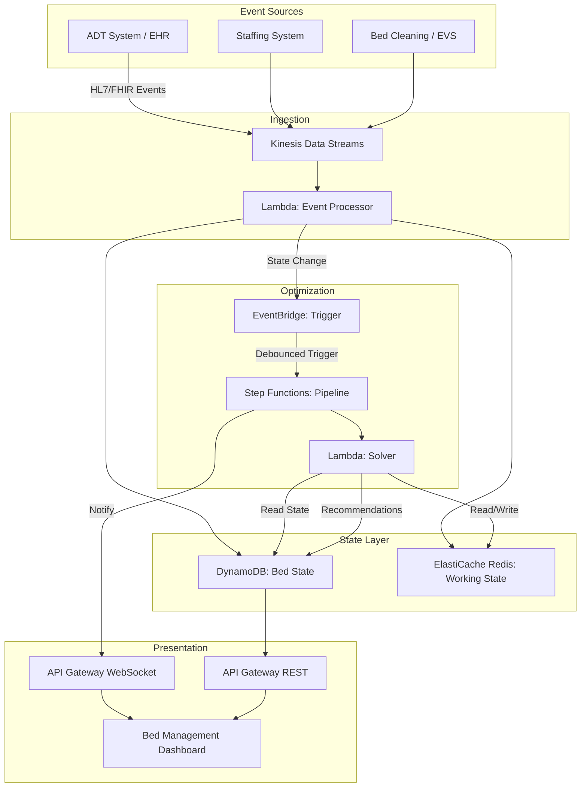

# Recipe 14.6 Architecture and Implementation: Patient Flow and Bed Assignment

*Companion to [Recipe 14.6: Patient Flow and Bed Assignment](chapter14.06-patient-flow-bed-assignment). This page covers the AWS architecture, services, prerequisites, and pseudocode. For the problem framing and the conceptual approach, start with the main recipe.*

---

## Why These Services

**AWS Lambda for the optimization engine.** Bed assignment optimization for a single hospital (even a large one) is computationally lightweight. A 500-bed hospital with 20-40 pending assignments produces a problem that OR-Tools solves in under 2 seconds. Lambda's 15-minute timeout is more than sufficient, and the serverless model means you're not paying for idle compute between optimization runs. Package OR-Tools in a Lambda layer or container image.

**Amazon Kinesis Data Streams for real-time state ingestion.** ADT events arrive as a stream (HL7 messages, FHIR notifications, or custom events from the EHR). Kinesis handles the ingestion at whatever rate your hospital generates events (typically hundreds to low thousands per hour) with ordering guarantees within a shard. The stream serves as a buffer between the event source and your processing logic.

**Amazon DynamoDB for the state model.** The live bed state needs single-digit-millisecond reads (the optimization engine queries it every few minutes) and fast writes (every ADT event updates it). DynamoDB's key-value model maps naturally to bed state: partition key is bed ID, attributes are current occupant, status, constraints, and timestamps. A GSI on unit gives you fast unit-level queries.

**Amazon ElastiCache (Redis) for the working state and debounce logic.** The debounce timer ("wait 60 seconds after the last state change before re-optimizing") and the in-flight recommendation state (which assignments have been recommended but not yet accepted) live in Redis. It's faster than DynamoDB for this pattern and supports TTLs natively for expiring stale recommendations.

**AWS Step Functions for the optimization pipeline.** The sequence of "gather current state, run optimizer, validate results, publish recommendations" is a short workflow that benefits from Step Functions' error handling and retry logic. If the optimizer fails or times out, Step Functions handles the retry without custom code.

**Amazon API Gateway + WebSocket API for the staff interface.** Bed management coordinators need real-time updates pushed to their screens (new recommendations, state changes, accepted assignments). WebSocket connections through API Gateway provide this without polling. The REST API handles actions (accept assignment, override, flag constraint).

**Amazon EventBridge for scheduling and event routing.** Triggers periodic optimization runs (the "every 5 minutes regardless" baseline), routes ADT events to the appropriate processing logic, and publishes optimization results to downstream consumers.

**Amazon CloudWatch for monitoring and alerting.** Track optimization solve times, recommendation acceptance rates, ED boarding times, and system health. Alert when solve times exceed thresholds or when the state model diverges from ADT reality.

## Architecture Diagram



## Prerequisites

| Requirement | Details |
|-------------|---------|
| AWS Services | Lambda, Kinesis Data Streams, DynamoDB, ElastiCache (Redis), Step Functions, EventBridge, API Gateway (REST + WebSocket), CloudWatch |
| IAM Permissions | lambda:InvokeFunction, kinesis:GetRecords/PutRecord, dynamodb:PutItem/GetItem/Query/UpdateItem, elasticache:Connect, states:StartExecution, execute-api:ManageConnections |
| BAA | Required. Bed assignments reference patient identifiers, diagnoses, and isolation status. |
| Encryption | S3 SSE-KMS for any stored data, DynamoDB encryption at rest, ElastiCache in-transit encryption, TLS everywhere |
| VPC | Required. ElastiCache must be in VPC. Lambda functions accessing Redis need VPC configuration. EHR integration likely requires VPC connectivity (Direct Connect or VPN). |
| CloudTrail | Audit logging for all assignment decisions and overrides |
| Sample Data | Synthetic ADT event streams with realistic arrival patterns. Synthetic bed inventory with constraint attributes. Never use real PHI in dev. |
| Cost Estimate | ~$500-800/month base (Kinesis + DynamoDB + Lambda + ElastiCache). ~$1,000-1,500/month at scale with high event volumes and WebSocket connections. |

## Ingredients

| AWS Service | Role in This Recipe |
|-------------|-------------------|
| AWS Lambda | Event processing, optimization solver execution, API handlers |
| Amazon Kinesis Data Streams | Real-time ADT event ingestion with ordering guarantees |
| Amazon DynamoDB | Persistent bed state, assignment history, recommendation log |
| Amazon ElastiCache (Redis) | Working state, debounce timers, in-flight recommendations |
| AWS Step Functions | Optimization pipeline orchestration with error handling |
| Amazon EventBridge | Scheduling periodic runs, routing state-change events |
| API Gateway (WebSocket) | Real-time push notifications to bed management UI |
| API Gateway (REST) | CRUD operations for assignments, overrides, constraints |
| Amazon CloudWatch | Monitoring solve times, acceptance rates, boarding metrics |

## Pseudocode Walkthrough

### Step 1: Ingest and Process ADT Events

Every patient movement generates an ADT event. We consume these in real-time to maintain an accurate picture of the hospital's bed state.

If you skip this step (or process events with significant lag), your optimization runs against stale data and produces recommendations that are already wrong.

```pseudocode
FUNCTION process_adt_event(event):
    // Parse the incoming HL7/FHIR message
    event_type = event.message_type  // A01=Admit, A02=Transfer, A03=Discharge, A08=Update
    patient_id = event.patient_identifier
    bed_id = event.assigned_bed
    timestamp = event.event_timestamp

    IF event_type == "ADMIT":
        // Patient assigned to a bed. Mark bed as occupied.
        update_bed_state(bed_id, status="OCCUPIED", patient=patient_id, since=timestamp)
        remove_from_pending_queue(patient_id)

    ELSE IF event_type == "DISCHARGE":
        // Patient leaving. Bed enters cleaning state.
        update_bed_state(bed_id, status="CLEANING", patient=NULL, discharge_time=timestamp)
        estimated_ready = timestamp + get_cleaning_estimate(bed_id)
        set_bed_available_estimate(bed_id, estimated_ready)

    ELSE IF event_type == "TRANSFER":
        // Patient moving between beds/units
        old_bed = get_current_bed(patient_id)
        update_bed_state(old_bed, status="CLEANING", patient=NULL)
        update_bed_state(bed_id, status="OCCUPIED", patient=patient_id, since=timestamp)

    ELSE IF event_type == "PENDING_ADMIT":
        // New patient needs a bed but hasn't been assigned one yet
        add_to_pending_queue(patient_id, requirements=extract_requirements(event))

    // Signal that state has changed (triggers debounced re-optimization)
    publish_state_change(event_type, bed_id, patient_id, timestamp)
```

### Step 2: Maintain the Live State Model

The state model is the "digital twin" of the hospital's physical bed situation. It answers: what's occupied, what's available, what's coming available soon, and who's waiting.

If you skip this step, the optimizer has no coherent view of reality to work with. Individual events are meaningless without aggregation into a consistent state.

```pseudocode
FUNCTION get_current_hospital_state():
    // Gather all bed states
    all_beds = query_bed_table()  // DynamoDB scan or query by unit

    state = {
        available_beds: [],
        occupied_beds: [],
        cleaning_beds: [],
        pending_patients: [],
        unit_census: {}
    }

    FOR each bed IN all_beds:
        IF bed.status == "AVAILABLE":
            state.available_beds.append({
                bed_id: bed.id,
                unit: bed.unit,
                room_type: bed.room_type,  // private, semi-private, negative-pressure
                capabilities: bed.capabilities,  // telemetry, ICU, step-down
                nurse_station_distance: bed.distance_to_station
            })
        ELSE IF bed.status == "OCCUPIED":
            state.occupied_beds.append(bed)
            state.unit_census[bed.unit] += 1
        ELSE IF bed.status == "CLEANING":
            state.cleaning_beds.append({
                bed_id: bed.id,
                estimated_available: bed.available_estimate
            })

    // Get patients waiting for beds (from pending queue)
    state.pending_patients = get_pending_queue_sorted_by_priority()

    // Enrich with staffing data
    FOR each unit IN state.unit_census.keys():
        state.unit_census[unit].staffed_capacity = get_staffed_capacity(unit)
        state.unit_census[unit].current_ratio = calculate_nurse_ratio(unit)

    RETURN state
```

### Step 3: Formulate the Optimization Model

This is where we translate the bed assignment problem into a mathematical model the solver can work with. Each pending patient gets matched to the best available bed.

If you get the constraint formulation wrong, you'll either produce infeasible solutions (no valid assignment exists given your constraints) or unsafe ones (a patient ends up in a bed that can't support their care needs).

```pseudocode
FUNCTION build_assignment_model(state):
    patients = state.pending_patients
    beds = state.available_beds + beds_available_within(minutes=60, state.cleaning_beds)

    // Decision variables: x[p][b] = 1 if patient p assigned to bed b
    model = CREATE_OPTIMIZATION_MODEL()
    x = model.create_binary_variables(patients, beds)

    // HARD CONSTRAINTS (safety, non-negotiable)

    // Each patient assigned to exactly one bed (or zero if no feasible bed exists)
    FOR each patient IN patients:
        model.add_constraint(SUM(x[patient][b] for b in beds) <= 1)

    // Each bed assigned to at most one patient
    FOR each bed IN beds:
        model.add_constraint(SUM(x[p][bed] for p in patients) <= 1)

    // Isolation requirements
    FOR each patient IN patients WHERE patient.isolation_type == "AIRBORNE":
        FOR each bed IN beds WHERE bed.room_type != "NEGATIVE_PRESSURE":
            model.add_constraint(x[patient][bed] == 0)

    // Acuity-to-unit matching
    FOR each patient IN patients:
        FOR each bed IN beds:
            IF NOT unit_appropriate_for_acuity(bed.unit, patient.acuity_level):
                model.add_constraint(x[patient][bed] == 0)

    // Gender constraints for semi-private rooms
    FOR each bed IN beds WHERE bed.room_type == "SEMI_PRIVATE":
        current_occupant_gender = get_roommate_gender(bed)
        IF current_occupant_gender IS NOT NULL:
            FOR each patient IN patients WHERE patient.gender != current_occupant_gender:
                model.add_constraint(x[patient][bed] == 0)

    // Staffing capacity: don't exceed staffed nurse-to-patient ratio
    FOR each unit IN unique_units(beds):
        unit_beds = filter(beds, unit=unit)
        new_patients_to_unit = SUM(x[p][b] for p in patients for b in unit_beds)
        model.add_constraint(
            state.unit_census[unit] + new_patients_to_unit <= state.unit_census[unit].staffed_capacity
        )

    // OBJECTIVE FUNCTION (weighted multi-objective)
    objective = 0

    // Priority 1: Assign as many patients as possible (especially high-acuity)
    FOR each patient IN patients:
        FOR each bed IN beds:
            priority_weight = patient.priority_score  // Higher for sicker, longer-waiting
            objective += priority_weight * x[patient][bed]

    // Priority 2: Clinical appropriateness score
    FOR each patient IN patients:
        FOR each bed IN beds:
            appropriateness = calculate_clinical_fit(patient, bed)
            objective += WEIGHT_CLINICAL * appropriateness * x[patient][bed]

    // Priority 3: Workload balance (penalize assignments to already-busy units)
    FOR each patient IN patients:
        FOR each bed IN beds:
            unit_load_penalty = current_load_fraction(bed.unit)
            objective -= WEIGHT_BALANCE * unit_load_penalty * x[patient][bed]

    // Priority 4: Continuity of care bonus
    FOR each patient IN patients WHERE patient.previous_unit IS NOT NULL:
        FOR each bed IN beds WHERE bed.unit == patient.previous_unit:
            objective += WEIGHT_CONTINUITY * x[patient][bed]

    model.set_objective(MAXIMIZE, objective)
    RETURN model
```

### Step 4: Solve and Extract Recommendations

Run the solver and translate the mathematical solution back into actionable bed assignments.

If you skip validation after solving, you might publish recommendations based on a solver timeout (suboptimal solution) or a state that changed during the solve (stale recommendation).

```pseudocode
FUNCTION solve_and_recommend(model, state, solve_time_limit_seconds=5):
    // Run the solver with a time limit
    result = model.solve(time_limit=solve_time_limit_seconds)

    IF result.status == "INFEASIBLE":
        // No valid assignment exists given current constraints
        // Try relaxing soft constraints and re-solving
        relaxed_model = relax_soft_constraints(model)
        result = relaxed_model.solve(time_limit=solve_time_limit_seconds)
        IF result.status == "INFEASIBLE":
            RETURN {status: "NO_FEASIBLE_SOLUTION", suggestions: identify_blocking_constraints(model)}

    // Extract assignments from solution
    recommendations = []
    FOR each patient IN patients:
        FOR each bed IN beds:
            IF result.get_value(x[patient][bed]) == 1:
                recommendations.append({
                    patient_id: patient.id,
                    recommended_bed: bed.id,
                    unit: bed.unit,
                    confidence: calculate_confidence(result, patient, bed),
                    reasoning: explain_assignment(patient, bed, model),
                    alternatives: get_next_best_options(result, patient, beds, top_n=3),
                    constraints_satisfied: list_satisfied_constraints(patient, bed),
                    solve_quality: result.objective_gap  // How close to optimal
                })

    // Validate against current state (may have changed during solve)
    validated = validate_against_live_state(recommendations, get_current_hospital_state())

    RETURN validated
```

### Step 5: Publish and Track Recommendations

Deliver recommendations to bed management staff and track what happens next (accepted, overridden, expired).

If you skip tracking, you lose the feedback loop that makes the system better over time. Override patterns reveal missing constraints or incorrect weights.

```pseudocode
FUNCTION publish_recommendations(recommendations):
    FOR each rec IN recommendations:
        // Store recommendation with timestamp and expiry
        store_recommendation(
            id = generate_id(),
            patient_id = rec.patient_id,
            bed_id = rec.recommended_bed,
            created_at = NOW(),
            expires_at = NOW() + minutes(15),  // Recommendations go stale
            status = "PENDING",
            reasoning = rec.reasoning,
            alternatives = rec.alternatives
        )
        // TODO (TechWriter): Expert review A3 (MEDIUM). Add note: expired recommendations should trigger re-optimization for the affected patient. Patient must never silently fall out of the pending queue because a recommendation timed out.

        // Push to bed management coordinator via WebSocket
        notify_bed_coordinator(
            unit = rec.unit,
            message = format_recommendation(rec)
        )

    // Track outcomes for feedback loop
    SCHEDULE check_recommendation_outcomes(recommendations, after_minutes=30)

    // TODO (TechWriter): Expert review S1 (HIGH). Add guidance on PHI minimization in WebSocket payloads: push only MRN + bed + confidence score; serve clinical reasoning on-demand via authenticated REST API, not proactively to all connected sessions.
    // TODO (TechWriter): Expert review S3 (MEDIUM). Add note on WebSocket auth model: Lambda authorizer on $connect, unit-level filtering of recommendations, connection TTLs for idle sessions.

FUNCTION handle_coordinator_response(recommendation_id, action, override_reason=NULL):
    IF action == "ACCEPT":
        // Coordinator accepted the recommendation
        update_recommendation_status(recommendation_id, "ACCEPTED")
        initiate_bed_assignment(recommendation_id)  // Trigger ADT update

    ELSE IF action == "OVERRIDE":
        // Coordinator chose a different bed
        update_recommendation_status(recommendation_id, "OVERRIDDEN")
        log_override(recommendation_id, override_reason)
        // This is a learning signal: why did the human disagree?
        queue_for_model_review(recommendation_id, override_reason)
        // TODO (TechWriter): Expert review S2 (MEDIUM). Add note recommending structured override reason codes (SAFETY_CONCERN, PATIENT_REQUEST, etc.) with optional free-text flagged as PHI-containing and subject to separate access controls and retention policies.

    ELSE IF action == "DEFER":
        // Not ready to decide yet (waiting for discharge, cleaning, etc.)
        update_recommendation_status(recommendation_id, "DEFERRED")
        // Will be re-evaluated in next optimization run
```

> **Curious how this looks in Python?** The pseudocode above covers the concepts. If you'd like to see sample Python code that demonstrates these patterns using boto3 and OR-Tools, check out the [Python Example](chapter14.06-python-example). It walks through each step with inline comments and notes on what you'd need to change for a real deployment.

## Expected Results

**Sample Recommendation Output:**

```json
{
  "optimization_run_id": "opt-20260601-143022",
  "solve_time_ms": 1847,
  "solve_status": "OPTIMAL",
  "objective_gap": 0.0,
  "recommendations": [
    {
      "patient_id": "PAT-88291",
      "waiting_since": "2026-06-01T12:15:00Z",
      "wait_minutes": 135,
      "acuity": "STEP_DOWN",
      "isolation": "NONE",
      "recommended_bed": "4W-312A",
      "unit": "4-West Step-Down",
      "confidence": 0.94,
      "reasoning": [
        "Step-down acuity matches unit level of care",
        "Unit currently at 78% staffed capacity (below target 85%)",
        "Patient previously on 4-West (continuity bonus)",
        "Nurse with cardiac drip certification available on shift"
      ],
      "alternatives": [
        {"bed": "3E-201B", "score": 0.81, "note": "Different unit, no continuity"},
        {"bed": "4W-308A", "score": 0.79, "note": "Farther from nurse station"}
      ]
    }
  ],
  "unassigned_patients": [
    {
      "patient_id": "PAT-90112",
      "reason": "No negative-pressure bed available. Nearest availability estimated 14:45 (cleaning in progress).",
      "suggested_action": "Hold in ED isolation room until 4E-101 ready"
    }
  ],
  "metrics": {
    "patients_assigned": 12,
    "patients_unassigned": 2,
    "avg_wait_reduction_minutes": 47,
    "constraint_violations": 0,
    "soft_constraint_relaxations": 1
  }
}
```

**Performance Benchmarks:**

| Metric | Value | Notes |
|--------|-------|-------|
| Solve time (400-bed hospital) | 1-3 seconds | OR-Tools CP-SAT, 20-40 pending patients |
| Solve time (800-bed system) | 3-8 seconds | May need problem decomposition by campus |
| Recommendation acceptance rate | 70-85% | Typical after 3-6 months of tuning |
| ED boarding reduction | 15-30% | Compared to manual assignment baseline |
| State model latency | < 5 seconds | From ADT event to updated state |
| Recommendation delivery | < 10 seconds | From state change to coordinator notification |
| False availability rate | 5-10% | Beds shown as available but not actually ready |

**Where It Struggles:**

- **Mass casualty events:** The model assumes normal arrival patterns. A sudden influx of 20+ patients overwhelms the optimization (too many assignments, too few beds, constraints become infeasible). Don't try to optimize during a surge. Just place people safely and sort it out later. You need a separate surge protocol that bypasses normal optimization entirely.
- **Behavioral health patients:** Placement constraints are complex and often undocumented (elopement risk, self-harm precautions, specific room configurations). We've seen 60%+ override rates for behavioral health placements. The model just doesn't have the context that experienced staff carry in their heads.
- **"Soft" bed blocks:** Some hospitals informally reserve beds for specific services ("those two beds are always for cardiology"). These aren't in any system but staff enforce them religiously. The optimizer doesn't know about them and gets overridden, and you'll spend weeks tracking down why acceptance rates are low on certain units.
- **Discharge prediction uncertainty:** If your predicted discharge time is wrong by 2 hours, beds you planned on aren't available when you need them. The optimization is only as good as the discharge predictions feeding it, and those predictions are often optimistic.

---

## Variations and Extensions

### Variation 1: Predictive Bed Assignment

Instead of waiting until a patient needs a bed, predict upcoming demand and pre-position capacity. Use ED arrival forecasting (Recipe 12.3), surgical schedule data, and discharge predictions (Recipe 7.7) to anticipate which units will have demand in 2-4 hours. Proactively expedite discharges on units that will be needed. This shifts from reactive assignment to proactive flow management.

### Variation 2: Multi-Campus Optimization

For health systems with multiple hospitals, extend the model to include inter-facility transfers. A patient in Hospital A's ED might be better served by a specialty bed at Hospital B. The optimization considers transport time, receiving unit capability, and the patient's clinical trajectory. This adds complexity (transport logistics, cross-facility communication) but can dramatically improve access to specialized care.

### Variation 3: Surge and Disaster Mode

Build a separate optimization profile for surge conditions (pandemic, mass casualty, seasonal flu peaks). Surge mode relaxes normal constraints (allow hallway beds, relax nurse ratios to crisis standards, convert procedure rooms to inpatient beds) and shifts the objective entirely to "place everyone safely" rather than "place everyone optimally." The system should detect surge conditions automatically (ED census exceeding threshold, all units above 95%) and switch modes.

---

## Additional Resources

### AWS Documentation
- [Amazon Kinesis Data Streams Developer Guide](https://docs.aws.amazon.com/streams/latest/dev/introduction.html)
- [AWS Lambda Developer Guide](https://docs.aws.amazon.com/lambda/latest/dg/welcome.html)
- [Amazon DynamoDB Developer Guide](https://docs.aws.amazon.com/amazondynamodb/latest/developerguide/Introduction.html)
- [Amazon ElastiCache for Redis User Guide](https://docs.aws.amazon.com/AmazonElastiCache/latest/red-ug/WhatIs.html)
- [AWS Step Functions Developer Guide](https://docs.aws.amazon.com/step-functions/latest/dg/welcome.html)
- [API Gateway WebSocket APIs](https://docs.aws.amazon.com/apigateway/latest/developerguide/apigateway-websocket-api.html)
- [AWS HIPAA Eligible Services](https://aws.amazon.com/compliance/hipaa-eligible-services-reference/)

### Optimization Libraries and Solvers
- [Google OR-Tools Documentation](https://developers.google.com/optimization)
- [OR-Tools CP-SAT Solver Guide](https://developers.google.com/optimization/cp/cp_solver)
- [PuLP: Linear Programming in Python](https://coin-or.github.io/pulp/)

### Healthcare Operations Research
- [IHI: Optimizing Patient Flow](http://www.ihi.org/resources/Pages/IHIWhitePapers/OptimizingPatientFlow.aspx) - Institute for Healthcare Improvement white paper on flow improvement strategies
- [AHRQ: Hospital Capacity Stress](https://www.ahrq.gov/patient-safety/settings/hospital/resource/index.html) - Agency for Healthcare Research and Quality resources on hospital capacity management

---

## Estimated Implementation Time

| Phase | Duration | What You Get |
|-------|----------|-------------|
| Basic (decision support) | 8-12 weeks | State model + batch optimizer + simple UI showing recommendations for pending admits |
| Production-ready | 16-24 weeks | Real-time event ingestion, hybrid optimization, WebSocket UI, override tracking, staffing integration |
| With variations | 24-36 weeks | Predictive pre-positioning, multi-campus support, surge mode, ML-based discharge predictions |

---

---

*← [Main Recipe 14.6](chapter14.06-patient-flow-bed-assignment) · [Python Example](chapter14.06-python-example) · [Chapter Preface](chapter14-preface)*
