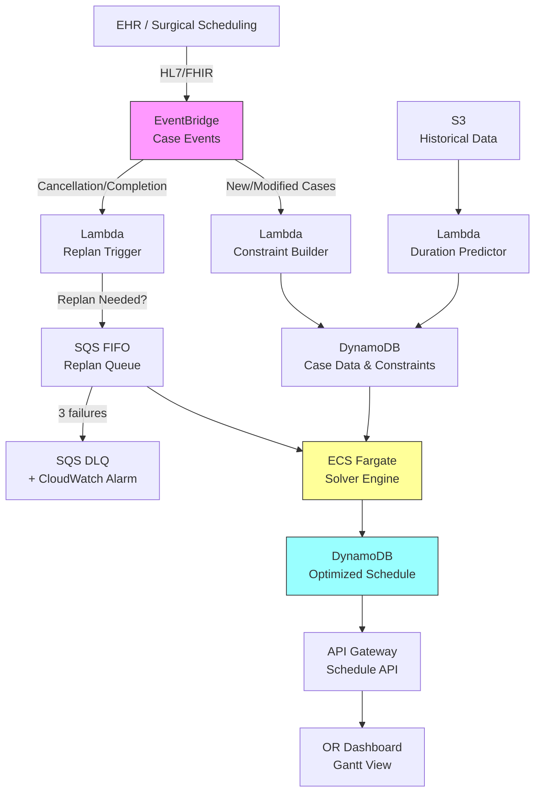

# Recipe 14.7 Architecture and Implementation: OR Case Sequencing

*Companion to [Recipe 14.7: OR Case Sequencing](chapter14.07-or-case-sequencing). This page covers the AWS architecture, services, prerequisites, and pseudocode. For the problem framing and the conceptual approach, start with the main recipe.*

---

## The AWS Implementation

### Why These Services

**AWS Lambda for the constraint builder and orchestration.** The constraint-building step is stateless computation: take case data, apply rules, produce a model. Lambda handles this cleanly. The orchestration layer (triggering batch runs, handling replan events) is also a natural Lambda workload.

**Amazon ECS (Fargate) for the solver engine.** Optimization solvers are CPU-intensive and memory-hungry. A 50-case problem might need 4-8 GB of RAM and several minutes of sustained CPU. Lambda's 15-minute timeout and 10 GB memory limit technically work for batch mode, but Fargate gives you more control over compute resources, no cold-start penalty for warm-start replanning, and the ability to run commercial solvers that require persistent licensing.

**Amazon DynamoDB for case data and schedule state.** The current schedule, case metadata, and constraint parameters need low-latency reads (for the real-time replan path) and consistent writes (to prevent conflicting schedule updates). DynamoDB's single-digit-millisecond reads and conditional writes fit perfectly.

**Amazon EventBridge for real-time event routing.** Case completions, cancellations, and add-ons arrive as events from the EHR integration. EventBridge routes these to the replan trigger logic, which decides whether to invoke re-optimization.

**Amazon S3 for historical data and model artifacts.** Duration prediction models, historical case logs, and optimization run artifacts (for audit and analysis) live in S3.

**Amazon SQS (FIFO) for the replan queue.** When multiple events arrive in quick succession (common during the morning rush), you don't want three concurrent replans fighting over the same schedule state. An SQS FIFO queue buffers replan requests with message-group-based ordering and deduplication ID windowing, ensuring they're processed sequentially. The FIFO ordering guarantees that replans execute in the order they were triggered, and the 5-minute deduplication window prevents replan storms from rapid-fire events.

### Architecture Diagram



### Prerequisites

| Requirement | Details |
|-------------|---------|
| **AWS Services** | Lambda, ECS (Fargate), DynamoDB, EventBridge, SQS (FIFO), S3, API Gateway |
| **IAM Permissions** | `ecs:RunTask`, `dynamodb:GetItem/PutItem/Query`, `s3:GetObject/PutObject`, `sqs:SendMessage/ReceiveMessage`, `events:PutEvents`. All permissions scoped to specific resource ARNs (e.g., solver ECS task role accesses only the case and schedule DynamoDB tables, the historical data S3 bucket, and the replan SQS queue). |
| **BAA** | Required: case data includes patient identifiers and procedure details (PHI) |
| **Encryption** | S3: SSE-KMS; DynamoDB: encryption at rest; all transit over TLS; ECS task roles with least-privilege |
| **VPC** | Production: Fargate tasks in private subnets with VPC endpoints for DynamoDB, S3, SQS, EventBridge, and CloudWatch Logs. Lambda functions that handle PHI payloads should also be VPC-attached; lightweight orchestration Lambdas can run outside the VPC with appropriate IAM controls. |
| **EHR Integration** | Secured network path required for PHI-bearing inbound connection: AWS Direct Connect, site-to-site VPN, or API Gateway with mutual TLS. HL7v2 via MLLP-to-HTTPS adapter in a private subnet. FHIR APIs via OAuth 2.0 with SMART on FHIR scopes. |
| **CloudTrail** | Enabled for all API calls; schedule changes auditable |
| **Sample Data** | Synthetic surgical case lists. Use realistic procedure mixes and durations from published OR benchmarking data. Never use real patient data in dev. |
| **Cost Estimate** | Fargate solver: ~$0.05-0.20 per optimization run (2-4 vCPU, 8 GB, 1-10 min). Lambda + DynamoDB: negligible. Monthly with open-source solvers (OR-Tools CP-SAT, HiGHS): $200-800 depending on replan frequency. With commercial solvers (Gurobi, CPLEX): add $1,500-5,000/month for cloud licensing depending on usage volume and contract terms. Commercial solvers are not required for most hospital-scale problems (under 100 cases/day). |

### Ingredients

| AWS Service | Role |
|------------|------|
| **AWS Lambda** | Constraint building, duration prediction, replan trigger logic |
| **Amazon ECS (Fargate)** | Runs the optimization solver (CP-SAT, HiGHS, or commercial) |
| **Amazon DynamoDB** | Stores case data, constraints, current optimized schedule, and manual overrides |
| **Amazon EventBridge** | Routes real-time surgical events (completions, cancellations, add-ons) |
| **Amazon SQS (FIFO)** | Buffers replan requests with deduplication to prevent concurrent optimization conflicts |
| **Amazon SQS (DLQ)** | Captures failed replan attempts after 3 retries; triggers CloudWatch alarm for manual intervention |
| **Amazon S3** | Historical case data, duration models, optimization audit logs |
| **Amazon API Gateway** | Exposes schedule API for dashboard and EHR integration (with authorizer for role-based access) |
| **AWS KMS** | Encryption key management for PHI at rest |

### Code

#### Walkthrough

**Step 1: Ingest and enrich case data.** When the daily case list is finalized (typically by 4-5 PM the day before), the system pulls each case's details and enriches them with predicted duration, equipment needs, and constraint metadata. The duration prediction uses historical data for the specific procedure-surgeon combination. This enrichment step is what transforms a simple case list into an optimization-ready dataset. Skip it and the solver has no basis for intelligent sequencing.

```
FUNCTION enrich_case_list(raw_cases):
    // Pull the confirmed case list and add optimization-relevant metadata.
    enriched = empty list

    FOR each case in raw_cases:
        // Predict duration using historical procedure-surgeon data.
        // The prediction includes mean and standard deviation for buffer calculation.
        duration_estimate = predict_duration(
            procedure_code = case.cpt_code,
            surgeon_id     = case.surgeon_id,
            patient_asa    = case.asa_class    // sicker patients take longer
        )

        // Look up equipment requirements from the surgeon's preference card.
        equipment_needs = get_preference_card(case.surgeon_id, case.cpt_code)

        // Build the enriched case record.
        enriched_case = {
            case_id:          case.id,
            procedure:        case.cpt_code,
            surgeon_id:       case.surgeon_id,
            expected_duration: duration_estimate.mean,
            duration_buffer:  duration_estimate.std_dev * 1.2,  // ~90th percentile coverage
            equipment:        equipment_needs.required_equipment,
            room_constraints: equipment_needs.room_requirements,
            patient_constraints: get_patient_constraints(case.patient_id),
            priority:         case.urgency_level,
            turnover_class:   classify_turnover(case.cpt_code)  // clean, contaminated, sterile
        }
        append enriched_case to enriched

    // Store enriched cases for the solver to consume.
    write enriched to database table "or-cases-today"
    RETURN enriched
```

**A note on PHI in the enriched case table.** The "or-cases-today" DynamoDB table contains PHI: patient identifiers linked to procedure codes and clinical flags (ASA class, immunocompromised status). IAM policies on this table should restrict read access to the solver engine's ECS task role and the constraint builder Lambda. The published schedule API (Step 5) should expose only the minimum necessary: procedure type, surgeon, and timing. Patient identifiers should not flow to the dashboard unless the viewer has a clinical need-to-know. Implement an API Gateway authorizer with role-based access: charge nurses see patient names, the public OR board shows only room/time/procedure.

**Step 2: Build the constraint model.** This step translates business rules into mathematical constraints the solver can process. The separation between business rules (which change frequently) and solver logic (which is stable) is intentional. When a new surgeon joins or a room gets renovated, you update the constraint configuration, not the solver code.

```
FUNCTION build_constraint_model(cases, rooms, staff_schedules):
    model = new ConstraintModel()

    // Decision variables: assign each case to a room and a start time.
    FOR each case in cases:
        case.room_var  = model.add_variable(domain = eligible_rooms(case))
        case.start_var = model.add_variable(domain = [block_start_time ... block_end_time])
        case.end_var   = case.start_var + case.expected_duration + case.duration_buffer

    // Hard constraint: no overlap within a room (including turnover time).
    FOR each pair (case_a, case_b) where case_a != case_b:
        IF case_a.room_var == case_b.room_var:
            model.add_constraint(
                case_a.end_var + turnover_time(case_a, case_b) <= case_b.start_var
                OR
                case_b.end_var + turnover_time(case_b, case_a) <= case_a.start_var
            )

    // Hard constraint: shared equipment cannot be double-booked.
    FOR each equipment_item in shared_equipment_list:
        cases_needing = filter cases where equipment_item in case.equipment
        FOR each pair in cases_needing:
            model.add_no_overlap_constraint(pair, setup_time = equipment_item.setup_minutes)

    // Hard constraint: staff availability windows.
    FOR each staff_member in staff_schedules:
        assigned_cases = filter cases covered by staff_member
        FOR each case in assigned_cases:
            model.add_constraint(case.start_var >= staff_member.available_from)
            model.add_constraint(case.end_var <= staff_member.available_until)

    // Hard constraint: room capability.
    FOR each case in cases:
        model.add_constraint(case.room_var in case.room_constraints)

    // Hard constraint: manual overrides (locked assignments from charge nurse).
    FOR each override in read_overrides_from_database():
        model.fix_variable(override.case_id.room_var, override.locked_room)
        model.fix_variable(override.case_id.start_var, override.locked_start_time)

    // Soft constraint: minimize total overtime (penalized in objective).
    FOR each room in rooms:
        room_end = max(case.end_var for cases assigned to room)
        overtime = max(0, room_end - room.block_end_time)
        model.add_to_objective(overtime * OVERTIME_PENALTY_WEIGHT)

    // Soft constraint: surgeon sequence preferences.
    FOR each surgeon_preference in surgeon_preferences:
        // e.g., "complex case first" = penalize if complex case isn't position 1
        model.add_soft_penalty(surgeon_preference.violation_cost)

    // Objective: minimize weighted sum of overtime + idle gaps + preference violations.
    model.set_objective(MINIMIZE)

    RETURN model
```

**Step 3: Solve.** Hand the model to the solver engine. For batch mode, allow several minutes of compute time to find a high-quality solution. For replan mode, fix already-completed cases and give the solver a tight time limit (10-30 seconds).

```
FUNCTION solve_schedule(model, mode):
    IF mode == "batch":
        // Overnight planning: take time to find optimal solution.
        solver = create_solver(type = "CP-SAT")  // or MIP solver for smaller instances
        solver.set_time_limit(300 seconds)        // 5 minutes max
        solver.set_optimality_gap(0.02)           // stop if within 2% of proven optimal

    ELSE IF mode == "replan":
        // Intraday: need a good answer fast.
        solver = create_solver(type = "CP-SAT")
        solver.set_time_limit(30 seconds)
        // Warm-start: fix cases that have already started or completed.
        FOR each case where case.status in ["in_progress", "completed"]:
            model.fix_variable(case.room_var, case.actual_room)
            model.fix_variable(case.start_var, case.actual_start_time)

    result = solver.solve(model)

    IF result.status == "OPTIMAL" or result.status == "FEASIBLE":
        schedule = extract_schedule(result)
        write schedule to database table "or-schedule-current"
        RETURN schedule
    ELSE:
        // No feasible solution found. Constraints are too tight.
        // Return the infeasibility report so humans can decide what to relax.
        log_error("Solver returned INFEASIBLE. Alerting perioperative coordinator.")
        trigger_cloudwatch_alarm("or-solver-infeasible")
        RETURN { status: "INFEASIBLE", conflicts: result.conflict_analysis() }
```

**Step 4: Handle real-time events.** Throughout the day, events arrive: cases finish early or late, cancellations happen, urgent add-ons appear. The replan trigger evaluates whether the disruption is significant enough to warrant re-optimization.

```
FUNCTION handle_or_event(event):
    current_schedule = read from database "or-schedule-current"

    IF event.type == "case_completed":
        // Update actual end time. Check if downstream cases need adjustment.
        actual_end = event.timestamp
        expected_end = current_schedule[event.case_id].expected_end
        deviation = actual_end - expected_end

        IF abs(deviation) > REPLAN_THRESHOLD_MINUTES:  // e.g., 15 minutes
            enqueue_replan(reason = "duration_deviation", deviation = deviation)

    ELSE IF event.type == "case_cancelled":
        // A cancelled case frees room time. Replan to fill the gap.
        enqueue_replan(reason = "cancellation", freed_minutes = case.expected_duration)

    ELSE IF event.type == "add_on_case":
        // New case needs to be inserted into today's schedule.
        enrich_case(event.case_data)
        enqueue_replan(reason = "add_on", urgency = event.case_data.priority)

FUNCTION enqueue_replan(reason, **kwargs):
    // Send to SQS FIFO queue with deduplication.
    // The 5-minute deduplication window means rapid-fire events within 5 minutes
    // of the first replan request are automatically deduplicated by SQS.
    // Use a time-window-based deduplication ID to batch nearby events.
    dedup_window = floor(current_timestamp / 300)  // 5-minute windows
    send to replan FIFO queue with:
        message_group_id = "or-replan"
        deduplication_id = "replan-" + string(dedup_window)
```

**Step 5: Publish and visualize.** The optimized schedule is exposed via API for the OR dashboard, EHR integration, and mobile notifications to surgical teams.

```
FUNCTION publish_schedule(schedule):
    // Write to API-accessible format.
    FOR each room in schedule.rooms:
        room_timeline = {
            room_id:    room.id,
            room_name:  room.display_name,
            cases: [
                {
                    case_id:     case.id,
                    procedure:   case.procedure_name,
                    surgeon:     case.surgeon_name,
                    start_time:  case.optimized_start,
                    end_time:    case.optimized_end,
                    status:      case.current_status,
                    confidence:  case.schedule_confidence,  // how likely this time holds
                    is_locked:   case.has_manual_override   // visually distinguish overrides
                }
                FOR each case in room.sequence
            ]
        }
        write room_timeline to API cache

    // Notify affected staff of schedule changes (if this was a replan).
    // Use a HIPAA-compliant channel: push notification to a secured mobile app
    // (preferred), pager with case ID only (no patient name), or encrypted email.
    // Avoid SMS with patient-identifiable content. Notifications contain the
    // minimum necessary: case ID, new time, new room. Staff look up patient
    // details in the secured dashboard.
    IF schedule.is_replan:
        changed_cases = find cases where start_time or room changed
        FOR each case in changed_cases:
            send_secure_notification(
                recipients = case.surgical_team,
                content = { case_id: case.id, new_room: case.room, new_time: case.start }
            )
```

> **Curious how this looks in Python?** The pseudocode above covers the concepts. If you'd like to see sample Python code that demonstrates these patterns using boto3 and Google OR-Tools, check out the [Python Example](chapter14.07-python-example). It walks through each step with inline comments and notes on what you'd need to change for a real deployment.

### Expected Results

**Sample output for a 12-room, 47-case day:**

```json
{
  "optimization_run_id": "opt-20260601-0430",
  "solve_time_seconds": 42.3,
  "status": "OPTIMAL",
  "objective_value": 127.5,
  "schedule_date": "2026-06-01",
  "rooms": [
    {
      "room_id": "OR-01",
      "cases": [
        {
          "case_id": "CASE-2026-4471",
          "procedure": "Total Knee Arthroplasty",
          "surgeon": "Dr. Martinez",
          "start_time": "07:30",
          "end_time": "09:45",
          "turnover_after_minutes": 30
        },
        {
          "case_id": "CASE-2026-4482",
          "procedure": "Total Hip Arthroplasty",
          "start_time": "10:15",
          "end_time": "12:30"
        }
      ],
      "utilization_pct": 78.2,
      "overtime_minutes": 0
    }
  ],
  "summary": {
    "total_cases": 47,
    "avg_utilization_pct": 76.4,
    "total_overtime_minutes": 35,
    "rooms_with_overtime": 2,
    "equipment_conflicts_resolved": 3,
    "surgeon_preferences_satisfied_pct": 91
  }
}
```

**Performance benchmarks:**

| Metric | Typical Value |
|--------|---------------|
| Batch solve time (20 rooms, 60 cases) | 30-120 seconds |
| Replan solve time | 5-30 seconds |
| Utilization improvement vs. manual | 5-15 percentage points |
| Overtime reduction | 20-40% |
| Schedule stability (cases not moved on replan) | 85-95% |

**Where it struggles:** Days with many urgent add-ons (the schedule is constantly disrupted). Cases with highly uncertain durations (complex revisions, trauma). Facilities where surgeon preferences are treated as hard constraints rather than soft (the problem becomes over-constrained). And the political dimension: a mathematically optimal schedule that moves a senior surgeon's preferred time slot will be rejected regardless of its optimality.

---

## Variations and Extensions

**Multi-day horizon optimization.** Instead of optimizing one day at a time, optimize the entire week. Cases that can flex between days get assigned to the day where they improve overall utilization. This requires tighter integration with the surgical scheduling system and longer solve times, but the utilization gains compound.

**Stochastic duration modeling.** Replace point estimates with probability distributions. Use Monte Carlo simulation to evaluate schedule robustness: "this schedule has a 90% probability of finishing all rooms by 5 PM." Requires historical duration data per procedure-surgeon pair (at least 20-30 observations per combination for stable distribution fitting).

**Integration with downstream resources.** Extend the model to include PACU bed availability, ICU bed reservations, and sterile processing capacity. A schedule that's optimal for the OR but overwhelms the PACU at 2 PM isn't actually optimal for the hospital. This makes the model significantly larger but captures real operational constraints that manual schedulers track intuitively.

---

## Additional Resources

**AWS Documentation:**
- [Amazon ECS on Fargate](https://docs.aws.amazon.com/AmazonECS/latest/developerguide/AWS_Fargate.html)
- [Amazon EventBridge User Guide](https://docs.aws.amazon.com/eventbridge/latest/userguide/eb-what-is.html)
- [Amazon DynamoDB Developer Guide](https://docs.aws.amazon.com/amazondynamodb/latest/developerguide/Introduction.html)
- [AWS Lambda Developer Guide](https://docs.aws.amazon.com/lambda/latest/dg/welcome.html)
- [AWS HIPAA Eligible Services](https://aws.amazon.com/compliance/hipaa-eligible-services-reference/)

**Optimization Solver Resources:**
- [Google OR-Tools CP-SAT Solver](https://developers.google.com/optimization/cp/cp_solver) - Free, high-performance constraint programming solver
- [HiGHS Optimization Solver](https://highs.dev/) - Open-source linear and mixed-integer programming solver
- [COIN-OR CBC](https://github.com/coin-or/Cbc) - Open-source MIP solver

**AWS Solutions and Blogs:**
- [AWS HPC and Batch Computing](https://aws.amazon.com/hpc/) - Patterns for compute-intensive workloads including optimization
- [Amazon ECS Best Practices Guide](https://docs.aws.amazon.com/AmazonECS/latest/bestpracticesguide/intro.html) - Guidance for running containerized workloads on Fargate

---

## Estimated Implementation Time

| Phase | Duration |
|-------|----------|
| Basic (single-room sequencing, deterministic durations) | 4-6 weeks |
| Production-ready (multi-room, real-time replan, EHR integration) | 3-5 months |
| With variations (stochastic, multi-day, downstream integration) | 6-9 months |

---


---

*← [Main Recipe 14.7](chapter14.07-or-case-sequencing) · [Python Example](chapter14.07-python-example) · [Chapter Preface](chapter14-preface)*
