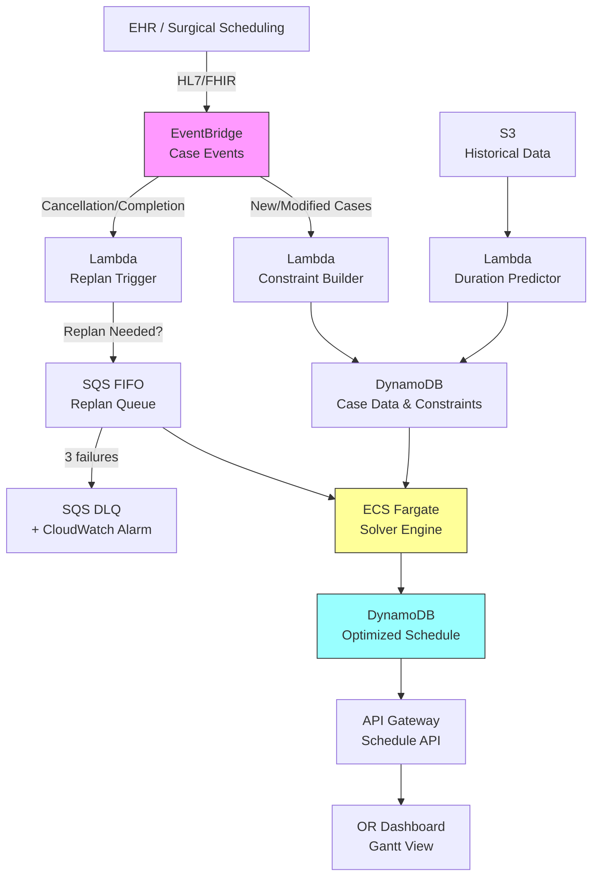

# Recipe 14.7: OR Case Sequencing

**Complexity:** Medium-Complex · **Phase:** Production · **Estimated Cost:** ~$200-800/month (solver compute)

---

## The Problem

It's 5:45 AM at a 20-OR hospital. The charge nurse is staring at today's surgical schedule: 47 cases across 12 rooms. The orthopedic surgeon wants his total knee first because "the patient needs to be in recovery by noon." The cardiac team needs Room 4 because it's the only one with the perfusion setup. Two cases need the same robotic system. The anesthesiologist covering rooms 6 through 9 has a hard stop at 3 PM. And someone just called in a semi-urgent appendectomy that needs to fit somewhere before lunch.

This is OR case sequencing: deciding not just which cases happen today, but in what order, in which rooms, and at what times. It's a puzzle that perioperative teams solve manually every single day, usually starting at 4 AM, usually with a whiteboard and a lot of phone calls.

The cost of getting it wrong is real. A poorly sequenced day means turnover gaps where rooms sit empty between cases (each minute of unused OR time costs $30-60 depending on the facility). It means the 3 PM case that was supposed to be a 90-minute procedure starts at 4:15 because everything upstream ran long, and now you're paying overtime for the entire surgical team. It means the equipment conflict nobody caught until the patient was already prepped.

Most hospitals run their ORs at 60-70% utilization. The theoretical ceiling with perfect sequencing is closer to 80-85% (you can't hit 100% because of mandatory turnover time and inherent duration uncertainty). That gap between actual and achievable utilization represents millions in lost revenue annually for a mid-size hospital. Not because the cases aren't there, but because the sequence is suboptimal.

The manual approach works. It has worked for decades. But it works the way a human playing chess works: by pattern recognition and heuristics, not by evaluating all possible arrangements. A 12-room, 47-case day has a combinatorial space that no human can fully explore. Optimization can.

---

## The Technology: Combinatorial Optimization for Scheduling

### What Is Combinatorial Optimization?

At its core, OR case sequencing is a constrained scheduling problem. You have a set of jobs (surgical cases), a set of machines (operating rooms), and a set of constraints (equipment availability, staff schedules, surgeon preferences, patient medical requirements). You want to find an assignment and ordering that optimizes some objective (minimize total idle time, minimize overtime, maximize throughput, or some weighted combination).

This falls squarely into the domain of combinatorial optimization, specifically a variant of the job-shop scheduling problem. The "combinatorial" part means the number of possible solutions grows factorially with the number of cases. Ten cases in one room have 10! = 3.6 million possible orderings. Forty-seven cases across twelve rooms? The solution space is astronomically large.

### How Solvers Work

You don't enumerate all possibilities. Instead, you formulate the problem mathematically and hand it to a solver, a piece of software designed to find optimal (or near-optimal) solutions to these kinds of problems efficiently.

There are two main families of solvers:

**Mixed-Integer Programming (MIP) solvers.** These formulate the problem as a set of linear equations with some variables constrained to be integers (typically 0 or 1, representing "yes this case goes in this slot" or "no it doesn't"). The solver uses branch-and-bound algorithms to systematically explore the solution space, pruning branches that can't possibly beat the best solution found so far. Commercial MIP solvers (Gurobi, CPLEX) are remarkably good at this. They can prove optimality: "this is the best possible solution given your constraints." Open-source options (COIN-OR CBC, HiGHS, SCIP) are capable but slower on large instances.

**Constraint Programming (CP) solvers.** These are particularly well-suited to scheduling problems because they natively understand concepts like "this task must come before that task" and "these two tasks can't overlap on the same resource." CP solvers use propagation and search: they infer consequences of partial assignments (if case A is in room 3 at 8 AM, then case B can't be in room 3 until at least 10:30 AM) and use those inferences to prune the search space. Google's OR-Tools CP-SAT solver is excellent and free.

**Metaheuristics.** For very large instances or when you need a good solution fast (real-time replanning), metaheuristics like simulated annealing, genetic algorithms, or large neighborhood search can find high-quality solutions without guaranteeing optimality. They're the "good enough in 5 seconds" option when the MIP solver would take 20 minutes.

### The Constraint Formulation

The art of OR case sequencing isn't choosing a solver. It's formulating the constraints correctly. Here's what a typical formulation includes:

**Decision variables:**
- Which room is each case assigned to?
- What position in the sequence does each case occupy within its room?
- What is the start time of each case?

**Hard constraints (must be satisfied):**
- No two cases overlap in the same room
- Turnover time between consecutive cases in the same room (typically 20-45 minutes depending on case type)
- Equipment availability: if two cases need the same robot, they can't overlap
- Staff availability windows: the anesthesiologist covering rooms 6-9 is only available until 3 PM
- Room capability: cardiac cases can only go in rooms with bypass capability
- Patient medical constraints: "this patient must be first case of the day" (NPO requirements, pediatric cases, immunocompromised patients needing sterile-first rooms)

**Soft constraints (preferences, penalized if violated):**
- Surgeon sequence preferences ("I want my complex case first while I'm fresh")
- Minimize total overtime across all rooms
- Minimize maximum overtime in any single room (fairness)
- Group similar cases to reduce turnover time (two knee replacements back-to-back need less room reconfiguration than a knee followed by a craniotomy)
- Minimize patient wait time from scheduled arrival to OR entry

**Objective function:** Typically a weighted sum of soft constraint violations plus utilization metrics. The weights encode institutional priorities: "we care more about avoiding overtime than about surgeon preferences" or vice versa.

### Duration Uncertainty: The Hard Part

Here's where OR case sequencing gets genuinely difficult. Case durations are uncertain. A "90-minute" total knee replacement might take 70 minutes or 130 minutes depending on patient anatomy, complications, and how the surgeon's morning is going. This uncertainty propagates through the sequence: if case 1 runs 30 minutes long, every subsequent case in that room shifts.

There are three approaches to handling this:

**Deterministic with buffers.** Use expected durations plus a safety margin. Simple, but either too conservative (wasted time) or too aggressive (frequent overruns). Most manual scheduling works this way.

**Stochastic optimization.** Model durations as probability distributions (typically lognormal for surgical cases) and optimize the expected value of the objective. More sophisticated, but computationally expensive and requires good historical data to fit the distributions.

**Robust optimization.** Find a schedule that performs well across a range of duration scenarios, not just the expected case. This is the "minimax regret" approach: minimize the worst-case outcome. Conservative but resilient.

For most implementations, deterministic with intelligent buffers (based on historical variance per procedure type and surgeon) is the pragmatic starting point. Graduate to stochastic methods once you have solid duration prediction models (see Recipe 7.7: Length of Stay Prediction for related techniques).

### Batch vs. Real-Time Optimization

Two distinct operational modes:

**Batch (overnight planning).** Run the full optimization the evening before or early morning. Takes the confirmed case list, applies all constraints, and produces the day's schedule. Can afford to run for minutes because there's no one waiting. This is where MIP solvers shine: give them 5-10 minutes and they'll find a provably optimal or near-optimal solution.

**Real-time (intraday replanning).** A case cancels at 9 AM. An emergency add-on arrives at 11 AM. A case runs 45 minutes over. The morning's optimal schedule is now suboptimal or infeasible. You need a new plan in seconds, not minutes. This is where metaheuristics or warm-started CP solvers earn their keep: take the current state, fix what's already happened, and re-optimize the remainder.

Most production systems need both: batch for the initial plan, real-time for adjustments throughout the day.

---

## General Architecture Pattern

```
[Case Data] → [Constraint Builder] → [Solver Engine] → [Schedule Output]
     ↑                                                        ↓
[Duration Models] ← [Historical Data]              [Visualization / Alerts]
     ↑                                                        ↓
[Real-time Events] → [Replan Trigger] → [Warm-start Solver] → [Updated Schedule]
```

**Data ingestion layer.** Pulls the case list from the surgical scheduling system (typically via HL7 or FHIR integration with the EHR). Enriches each case with: estimated duration (from historical models), equipment requirements (from preference cards), staff assignments, room constraints, and patient-specific requirements.

**Constraint builder.** Translates business rules into mathematical constraints. This is the layer that encodes "Dr. Smith only operates in rooms 1-4" and "the da Vinci robot needs 30 minutes of setup between cases" into the solver's language. Separating constraint definition from the solver itself is critical: business rules change frequently, and you don't want to rewrite solver code every time a new surgeon joins.

**Solver engine.** The optimization core. Accepts the constraint model and produces an optimal or near-optimal schedule. Should support both batch mode (full optimization from scratch) and warm-start mode (fix completed cases, re-optimize the rest).

**Schedule output and visualization.** The optimized schedule needs to be consumable by humans (perioperative coordinators, charge nurses, surgeons) and by systems (EHR, patient tracking boards, equipment management). A Gantt-style visualization showing rooms on the Y-axis and time on the X-axis is the standard display.

**Replan trigger.** Monitors real-time events (case completions, cancellations, add-ons, duration overruns) and decides when to trigger re-optimization. Not every event needs a full replan. A case finishing 5 minutes early doesn't warrant disruption. A case finishing 45 minutes late, or a cancellation that frees a room, does.

**Human override layer.** Any production scheduling system must support manual overrides. Charge nurses and surgeons need the ability to lock a case to a specific room or time slot, swap two cases within a room, or exclude a room from re-optimization entirely. Overrides are stored as hard constraints that the solver respects on subsequent runs. The dashboard should visually distinguish optimizer-assigned slots from manually-locked slots, and an audit trail records who overrode what and when.

<!-- TODO (TechWriter): Expert review A3 (HIGH). Expand human override into a full subsection in the Code walkthrough showing how overrides are stored as fixed constraints in DynamoDB and read by the solver. Include role-based permissions (charge nurse can override, random staff cannot). -->

---

## The AWS Implementation

### Why These Services

**AWS Lambda for the constraint builder and orchestration.** The constraint-building step is stateless computation: take case data, apply rules, produce a model. Lambda handles this cleanly. The orchestration layer (triggering batch runs, handling replan events) is also a natural Lambda workload.

**Amazon ECS (Fargate) for the solver engine.** Optimization solvers are CPU-intensive and memory-hungry. A 50-case problem might need 4-8 GB of RAM and several minutes of sustained CPU. Lambda's 15-minute timeout and 10 GB memory limit technically work for batch mode, but Fargate gives you more control over compute resources, no cold-start penalty for warm-start replanning, and the ability to run commercial solvers that require persistent licensing.

**Amazon DynamoDB for case data and schedule state.** The current schedule, case metadata, and constraint parameters need low-latency reads (for the real-time replan path) and consistent writes (to prevent conflicting schedule updates). DynamoDB's single-digit-millisecond reads and conditional writes fit perfectly.

**Amazon EventBridge for real-time event routing.** Case completions, cancellations, and add-ons arrive as events from the EHR integration. EventBridge routes these to the replan trigger logic, which decides whether to invoke re-optimization.

**Amazon S3 for historical data and model artifacts.** Duration prediction models, historical case logs, and optimization run artifacts (for audit and analysis) live in S3.

**Amazon SQS (FIFO) for the replan queue.** When multiple events arrive in quick succession (common during the morning rush), you don't want three concurrent replans fighting over the same schedule state. An SQS FIFO queue buffers replan requests with message-group-based ordering and deduplication ID windowing, ensuring they're processed sequentially. The FIFO ordering guarantees that replans execute in the order they were triggered, and the 5-minute deduplication window prevents replan storms from rapid-fire events.

### Architecture Diagram



### Prerequisites

| Requirement | Details |
|-------------|---------|
| **AWS Services** | Lambda, ECS (Fargate), DynamoDB, EventBridge, SQS (FIFO), S3, API Gateway |
| **IAM Permissions** | `ecs:RunTask`, `dynamodb:GetItem/PutItem/Query`, `s3:GetObject/PutObject`, `sqs:SendMessage/ReceiveMessage`, `events:PutEvents`. All permissions scoped to specific resource ARNs (e.g., solver ECS task role accesses only the case and schedule DynamoDB tables, the historical data S3 bucket, and the replan SQS queue). |
| **BAA** | Required: case data includes patient identifiers and procedure details (PHI) |
| **Encryption** | S3: SSE-KMS; DynamoDB: encryption at rest; all transit over TLS; ECS task roles with least-privilege |
| **VPC** | Production: Fargate tasks in private subnets with VPC endpoints for DynamoDB, S3, SQS, EventBridge, and CloudWatch Logs. Lambda functions that handle PHI payloads should also be VPC-attached; lightweight orchestration Lambdas can run outside the VPC with appropriate IAM controls. |
| **EHR Integration** | Secured network path required for PHI-bearing inbound connection: AWS Direct Connect, site-to-site VPN, or API Gateway with mutual TLS. HL7v2 via MLLP-to-HTTPS adapter in a private subnet. FHIR APIs via OAuth 2.0 with SMART on FHIR scopes. |
| **CloudTrail** | Enabled for all API calls; schedule changes auditable |
| **Sample Data** | Synthetic surgical case lists. Use realistic procedure mixes and durations from published OR benchmarking data. Never use real patient data in dev. |
| **Cost Estimate** | Fargate solver: ~$0.05-0.20 per optimization run (2-4 vCPU, 8 GB, 1-10 min). Lambda + DynamoDB: negligible. Monthly with open-source solvers (OR-Tools CP-SAT, HiGHS): $200-800 depending on replan frequency. With commercial solvers (Gurobi, CPLEX): add $1,500-5,000/month for cloud licensing depending on usage volume and contract terms. Commercial solvers are not required for most hospital-scale problems (under 100 cases/day). |

### Ingredients

| AWS Service | Role |
|------------|------|
| **AWS Lambda** | Constraint building, duration prediction, replan trigger logic |
| **Amazon ECS (Fargate)** | Runs the optimization solver (CP-SAT, HiGHS, or commercial) |
| **Amazon DynamoDB** | Stores case data, constraints, current optimized schedule, and manual overrides |
| **Amazon EventBridge** | Routes real-time surgical events (completions, cancellations, add-ons) |
| **Amazon SQS (FIFO)** | Buffers replan requests with deduplication to prevent concurrent optimization conflicts |
| **Amazon SQS (DLQ)** | Captures failed replan attempts after 3 retries; triggers CloudWatch alarm for manual intervention |
| **Amazon S3** | Historical case data, duration models, optimization audit logs |
| **Amazon API Gateway** | Exposes schedule API for dashboard and EHR integration (with authorizer for role-based access) |
| **AWS KMS** | Encryption key management for PHI at rest |

### Code

#### Walkthrough

**Step 1: Ingest and enrich case data.** When the daily case list is finalized (typically by 4-5 PM the day before), the system pulls each case's details and enriches them with predicted duration, equipment needs, and constraint metadata. The duration prediction uses historical data for the specific procedure-surgeon combination. This enrichment step is what transforms a simple case list into an optimization-ready dataset. Skip it and the solver has no basis for intelligent sequencing.

```
FUNCTION enrich_case_list(raw_cases):
    // Pull the confirmed case list and add optimization-relevant metadata.
    enriched = empty list

    FOR each case in raw_cases:
        // Predict duration using historical procedure-surgeon data.
        // The prediction includes mean and standard deviation for buffer calculation.
        duration_estimate = predict_duration(
            procedure_code = case.cpt_code,
            surgeon_id     = case.surgeon_id,
            patient_asa    = case.asa_class    // sicker patients take longer
        )

        // Look up equipment requirements from the surgeon's preference card.
        equipment_needs = get_preference_card(case.surgeon_id, case.cpt_code)

        // Build the enriched case record.
        enriched_case = {
            case_id:          case.id,
            procedure:        case.cpt_code,
            surgeon_id:       case.surgeon_id,
            expected_duration: duration_estimate.mean,
            duration_buffer:  duration_estimate.std_dev * 1.2,  // ~90th percentile coverage
            equipment:        equipment_needs.required_equipment,
            room_constraints: equipment_needs.room_requirements,
            patient_constraints: get_patient_constraints(case.patient_id),
            priority:         case.urgency_level,
            turnover_class:   classify_turnover(case.cpt_code)  // clean, contaminated, sterile
        }
        append enriched_case to enriched

    // Store enriched cases for the solver to consume.
    write enriched to database table "or-cases-today"
    RETURN enriched
```

**A note on PHI in the enriched case table.** The "or-cases-today" DynamoDB table contains PHI: patient identifiers linked to procedure codes and clinical flags (ASA class, immunocompromised status). IAM policies on this table should restrict read access to the solver engine's ECS task role and the constraint builder Lambda. The published schedule API (Step 5) should expose only the minimum necessary: procedure type, surgeon, and timing. Patient identifiers should not flow to the dashboard unless the viewer has a clinical need-to-know. Implement an API Gateway authorizer with role-based access: charge nurses see patient names, the public OR board shows only room/time/procedure.

**Step 2: Build the constraint model.** This step translates business rules into mathematical constraints the solver can process. The separation between business rules (which change frequently) and solver logic (which is stable) is intentional. When a new surgeon joins or a room gets renovated, you update the constraint configuration, not the solver code.

```
FUNCTION build_constraint_model(cases, rooms, staff_schedules):
    model = new ConstraintModel()

    // Decision variables: assign each case to a room and a start time.
    FOR each case in cases:
        case.room_var  = model.add_variable(domain = eligible_rooms(case))
        case.start_var = model.add_variable(domain = [block_start_time ... block_end_time])
        case.end_var   = case.start_var + case.expected_duration + case.duration_buffer

    // Hard constraint: no overlap within a room (including turnover time).
    FOR each pair (case_a, case_b) where case_a != case_b:
        IF case_a.room_var == case_b.room_var:
            model.add_constraint(
                case_a.end_var + turnover_time(case_a, case_b) <= case_b.start_var
                OR
                case_b.end_var + turnover_time(case_b, case_a) <= case_a.start_var
            )

    // Hard constraint: shared equipment cannot be double-booked.
    FOR each equipment_item in shared_equipment_list:
        cases_needing = filter cases where equipment_item in case.equipment
        FOR each pair in cases_needing:
            model.add_no_overlap_constraint(pair, setup_time = equipment_item.setup_minutes)

    // Hard constraint: staff availability windows.
    FOR each staff_member in staff_schedules:
        assigned_cases = filter cases covered by staff_member
        FOR each case in assigned_cases:
            model.add_constraint(case.start_var >= staff_member.available_from)
            model.add_constraint(case.end_var <= staff_member.available_until)

    // Hard constraint: room capability.
    FOR each case in cases:
        model.add_constraint(case.room_var in case.room_constraints)

    // Hard constraint: manual overrides (locked assignments from charge nurse).
    FOR each override in read_overrides_from_database():
        model.fix_variable(override.case_id.room_var, override.locked_room)
        model.fix_variable(override.case_id.start_var, override.locked_start_time)

    // Soft constraint: minimize total overtime (penalized in objective).
    FOR each room in rooms:
        room_end = max(case.end_var for cases assigned to room)
        overtime = max(0, room_end - room.block_end_time)
        model.add_to_objective(overtime * OVERTIME_PENALTY_WEIGHT)

    // Soft constraint: surgeon sequence preferences.
    FOR each surgeon_preference in surgeon_preferences:
        // e.g., "complex case first" = penalize if complex case isn't position 1
        model.add_soft_penalty(surgeon_preference.violation_cost)

    // Objective: minimize weighted sum of overtime + idle gaps + preference violations.
    model.set_objective(MINIMIZE)

    RETURN model
```

**Step 3: Solve.** Hand the model to the solver engine. For batch mode, allow several minutes of compute time to find a high-quality solution. For replan mode, fix already-completed cases and give the solver a tight time limit (10-30 seconds).

```
FUNCTION solve_schedule(model, mode):
    IF mode == "batch":
        // Overnight planning: take time to find optimal solution.
        solver = create_solver(type = "CP-SAT")  // or MIP solver for smaller instances
        solver.set_time_limit(300 seconds)        // 5 minutes max
        solver.set_optimality_gap(0.02)           // stop if within 2% of proven optimal

    ELSE IF mode == "replan":
        // Intraday: need a good answer fast.
        solver = create_solver(type = "CP-SAT")
        solver.set_time_limit(30 seconds)
        // Warm-start: fix cases that have already started or completed.
        FOR each case where case.status in ["in_progress", "completed"]:
            model.fix_variable(case.room_var, case.actual_room)
            model.fix_variable(case.start_var, case.actual_start_time)

    result = solver.solve(model)

    IF result.status == "OPTIMAL" or result.status == "FEASIBLE":
        schedule = extract_schedule(result)
        write schedule to database table "or-schedule-current"
        RETURN schedule
    ELSE:
        // No feasible solution found. Constraints are too tight.
        // Return the infeasibility report so humans can decide what to relax.
        log_error("Solver returned INFEASIBLE. Alerting perioperative coordinator.")
        trigger_cloudwatch_alarm("or-solver-infeasible")
        RETURN { status: "INFEASIBLE", conflicts: result.conflict_analysis() }
```

**Step 4: Handle real-time events.** Throughout the day, events arrive: cases finish early or late, cancellations happen, urgent add-ons appear. The replan trigger evaluates whether the disruption is significant enough to warrant re-optimization.

```
FUNCTION handle_or_event(event):
    current_schedule = read from database "or-schedule-current"

    IF event.type == "case_completed":
        // Update actual end time. Check if downstream cases need adjustment.
        actual_end = event.timestamp
        expected_end = current_schedule[event.case_id].expected_end
        deviation = actual_end - expected_end

        IF abs(deviation) > REPLAN_THRESHOLD_MINUTES:  // e.g., 15 minutes
            enqueue_replan(reason = "duration_deviation", deviation = deviation)

    ELSE IF event.type == "case_cancelled":
        // A cancelled case frees room time. Replan to fill the gap.
        enqueue_replan(reason = "cancellation", freed_minutes = case.expected_duration)

    ELSE IF event.type == "add_on_case":
        // New case needs to be inserted into today's schedule.
        enrich_case(event.case_data)
        enqueue_replan(reason = "add_on", urgency = event.case_data.priority)

FUNCTION enqueue_replan(reason, **kwargs):
    // Send to SQS FIFO queue with deduplication.
    // The 5-minute deduplication window means rapid-fire events within 5 minutes
    // of the first replan request are automatically deduplicated by SQS.
    // Use a time-window-based deduplication ID to batch nearby events.
    dedup_window = floor(current_timestamp / 300)  // 5-minute windows
    send to replan FIFO queue with:
        message_group_id = "or-replan"
        deduplication_id = "replan-" + string(dedup_window)
```

**Step 5: Publish and visualize.** The optimized schedule is exposed via API for the OR dashboard, EHR integration, and mobile notifications to surgical teams.

```
FUNCTION publish_schedule(schedule):
    // Write to API-accessible format.
    FOR each room in schedule.rooms:
        room_timeline = {
            room_id:    room.id,
            room_name:  room.display_name,
            cases: [
                {
                    case_id:     case.id,
                    procedure:   case.procedure_name,
                    surgeon:     case.surgeon_name,
                    start_time:  case.optimized_start,
                    end_time:    case.optimized_end,
                    status:      case.current_status,
                    confidence:  case.schedule_confidence,  // how likely this time holds
                    is_locked:   case.has_manual_override   // visually distinguish overrides
                }
                FOR each case in room.sequence
            ]
        }
        write room_timeline to API cache

    // Notify affected staff of schedule changes (if this was a replan).
    // Use a HIPAA-compliant channel: push notification to a secured mobile app
    // (preferred), pager with case ID only (no patient name), or encrypted email.
    // Avoid SMS with patient-identifiable content. Notifications contain the
    // minimum necessary: case ID, new time, new room. Staff look up patient
    // details in the secured dashboard.
    IF schedule.is_replan:
        changed_cases = find cases where start_time or room changed
        FOR each case in changed_cases:
            send_secure_notification(
                recipients = case.surgical_team,
                content = { case_id: case.id, new_room: case.room, new_time: case.start }
            )
```

> **Curious how this looks in Python?** The pseudocode above covers the concepts. If you'd like to see sample Python code that demonstrates these patterns using boto3 and Google OR-Tools, check out the [Python Example](chapter14.07-python-example). It walks through each step with inline comments and notes on what you'd need to change for a real deployment.

### Expected Results

**Sample output for a 12-room, 47-case day:**

```json
{
  "optimization_run_id": "opt-20260601-0430",
  "solve_time_seconds": 42.3,
  "status": "OPTIMAL",
  "objective_value": 127.5,
  "schedule_date": "2026-06-01",
  "rooms": [
    {
      "room_id": "OR-01",
      "cases": [
        {
          "case_id": "CASE-2026-4471",
          "procedure": "Total Knee Arthroplasty",
          "surgeon": "Dr. Martinez",
          "start_time": "07:30",
          "end_time": "09:45",
          "turnover_after_minutes": 30
        },
        {
          "case_id": "CASE-2026-4482",
          "procedure": "Total Hip Arthroplasty",
          "start_time": "10:15",
          "end_time": "12:30"
        }
      ],
      "utilization_pct": 78.2,
      "overtime_minutes": 0
    }
  ],
  "summary": {
    "total_cases": 47,
    "avg_utilization_pct": 76.4,
    "total_overtime_minutes": 35,
    "rooms_with_overtime": 2,
    "equipment_conflicts_resolved": 3,
    "surgeon_preferences_satisfied_pct": 91
  }
}
```

**Performance benchmarks:**

| Metric | Typical Value |
|--------|---------------|
| Batch solve time (20 rooms, 60 cases) | 30-120 seconds |
| Replan solve time | 5-30 seconds |
| Utilization improvement vs. manual | 5-15 percentage points |
| Overtime reduction | 20-40% |
| Schedule stability (cases not moved on replan) | 85-95% |

**Where it struggles:** Days with many urgent add-ons (the schedule is constantly disrupted). Cases with highly uncertain durations (complex revisions, trauma). Facilities where surgeon preferences are treated as hard constraints rather than soft (the problem becomes over-constrained). And the political dimension: a mathematically optimal schedule that moves a senior surgeon's preferred time slot will be rejected regardless of its optimality.

---

## The Honest Take

The optimization itself is the easy part. Getting a solver to produce a good schedule from well-formulated constraints is a solved problem in operations research. The hard parts are everything around it.

**Duration prediction is where you live or die.** If your predicted durations are systematically wrong (and they will be, initially), the optimized schedule is fiction. Invest heavily in duration modeling before you invest in fancy solver techniques. A simple heuristic scheduler with accurate durations will outperform an optimal solver with bad duration estimates every time.

**Surgeon buy-in is non-negotiable.** Surgeons who feel the system is dictating their schedule will simply ignore it. The successful implementations I've seen treat surgeon preferences as near-hard constraints initially, then gradually demonstrate value by showing "your cases finished 30 minutes earlier because we sequenced them better." Start by optimizing within their preferences, not against them.

**The replan frequency tradeoff is real.** Replan too often and the schedule feels unstable (staff hate constant changes). Replan too rarely and you're running a suboptimal schedule all afternoon because of a morning disruption. Most teams settle on replanning only when deviation exceeds 15-20 minutes or when a cancellation/add-on occurs.

**Turnover time is where the real gains hide.** Most people focus on case duration optimization, but the 25-45 minutes between cases is where utilization is actually lost. Sequencing similar cases back-to-back (same equipment, same setup) can shave 5-10 minutes per turnover. Over a 6-case room day, that's 30-60 minutes of recovered time.

**Failure handling matters more than optimality.** When the solver fails (and it will: infeasible constraints, OOM on large instances, network timeouts), the system must fall back gracefully to the previous valid schedule and alert the perioperative coordinator. A DLQ on the replan queue with a CloudWatch alarm ensures that silent failures don't leave the OR running on a stale schedule all day.

The thing that surprised me most: the constraint that causes the most infeasibility isn't equipment or rooms. It's anesthesia coverage. When one anesthesiologist covers multiple rooms, their availability window becomes the binding constraint on the entire schedule. Model this carefully.

---

## Variations and Extensions

**Multi-day horizon optimization.** Instead of optimizing one day at a time, optimize the entire week. Cases that can flex between days get assigned to the day where they improve overall utilization. This requires tighter integration with the surgical scheduling system and longer solve times, but the utilization gains compound.

**Stochastic duration modeling.** Replace point estimates with probability distributions. Use Monte Carlo simulation to evaluate schedule robustness: "this schedule has a 90% probability of finishing all rooms by 5 PM." Requires historical duration data per procedure-surgeon pair (at least 20-30 observations per combination for stable distribution fitting).

**Integration with downstream resources.** Extend the model to include PACU bed availability, ICU bed reservations, and sterile processing capacity. A schedule that's optimal for the OR but overwhelms the PACU at 2 PM isn't actually optimal for the hospital. This makes the model significantly larger but captures real operational constraints that manual schedulers track intuitively.

---

## Related Recipes

- **Recipe 14.4 (Nurse Staffing Optimization):** The staff schedules that constrain OR sequencing are themselves an optimization output
- **Recipe 14.5 (OR Block Scheduling):** Block allocation determines which services have access to which rooms; sequencing operates within those blocks
- **Recipe 14.6 (Patient Flow / Bed Assignment):** Downstream bed availability constrains OR throughput; these systems should communicate
- **Recipe 7.7 (Length of Stay Prediction):** Duration prediction techniques applicable to surgical case duration modeling
- **Recipe 12.5 (Hospital Census Forecasting):** Census forecasts inform whether add-on cases can be accommodated

---

## Additional Resources

**AWS Documentation:**
- [Amazon ECS on Fargate](https://docs.aws.amazon.com/AmazonECS/latest/developerguide/AWS_Fargate.html)
- [Amazon EventBridge User Guide](https://docs.aws.amazon.com/eventbridge/latest/userguide/eb-what-is.html)
- [Amazon DynamoDB Developer Guide](https://docs.aws.amazon.com/amazondynamodb/latest/developerguide/Introduction.html)
- [AWS Lambda Developer Guide](https://docs.aws.amazon.com/lambda/latest/dg/welcome.html)
- [AWS HIPAA Eligible Services](https://aws.amazon.com/compliance/hipaa-eligible-services-reference/)

**Optimization Solver Resources:**
- [Google OR-Tools CP-SAT Solver](https://developers.google.com/optimization/cp/cp_solver) - Free, high-performance constraint programming solver
- [HiGHS Optimization Solver](https://highs.dev/) - Open-source linear and mixed-integer programming solver
- [COIN-OR CBC](https://github.com/coin-or/Cbc) - Open-source MIP solver

**AWS Solutions and Blogs:**
- [AWS HPC and Batch Computing](https://aws.amazon.com/hpc/) - Patterns for compute-intensive workloads including optimization
- [Amazon ECS Best Practices Guide](https://docs.aws.amazon.com/AmazonECS/latest/bestpracticesguide/intro.html) - Guidance for running containerized workloads on Fargate

---

## Estimated Implementation Time

| Phase | Duration |
|-------|----------|
| Basic (single-room sequencing, deterministic durations) | 4-6 weeks |
| Production-ready (multi-room, real-time replan, EHR integration) | 3-5 months |
| With variations (stochastic, multi-day, downstream integration) | 6-9 months |

---

## Tags

`optimization` · `operations-research` · `scheduling` · `constraint-programming` · `mixed-integer-programming` · `operating-room` · `surgical` · `real-time` · `ecs-fargate` · `eventbridge` · `dynamodb` · `hipaa`

---

*← [Recipe 14.6: Patient Flow / Bed Assignment](chapter14.06-patient-flow-bed-assignment) · [Chapter 14 Index](chapter14-preface) · [Next: Recipe 14.8: Ambulance Routing and Dispatch →](chapter14.08-ambulance-routing-dispatch)*
