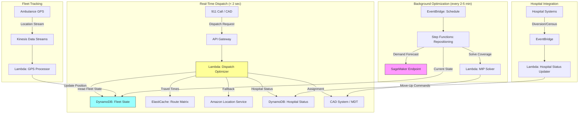

# Recipe 14.8: Ambulance Routing and Dispatch

**Complexity:** Complex · **Phase:** Production · **Estimated Cost:** ~$2,000–8,000/month depending on fleet size and call volume

---

## The Problem

A 911 call comes in. Chest pain, 67-year-old male, residential address on the east side of town. The dispatcher has maybe 30 seconds to make a decision that could determine whether this person lives or dies. Which ambulance do you send? The closest one by straight-line distance? The one that's actually closest by road, accounting for the construction on Main Street? The one that's already en route back from a hospital drop-off and will be available in 90 seconds? The one with a paramedic certified in cardiac interventions versus the BLS unit that's technically closer?

And once you've picked the ambulance, which hospital do you route them to? The nearest ED? The one with a cath lab that's not currently on diversion? The one that's 4 minutes farther but has an open bed in the cardiac unit?

This is not a simple "find the nearest vehicle" problem. It's a multi-objective, real-time optimization problem with life-safety stakes, incomplete information, and decisions that cascade. Every minute of response time in a cardiac event correlates with measurably worse outcomes. The National Association of EMS Physicians targets under 8 minutes for urban response to life-threatening calls. Many systems struggle to hit that consistently, not because they lack ambulances, but because they lack the optimization infrastructure to deploy them intelligently.

Most dispatch systems today still rely on a combination of CAD (Computer-Aided Dispatch) software that does basic proximity matching and human dispatchers making judgment calls based on experience. The dispatchers are often excellent. But they're making decisions with incomplete information, under time pressure, across a fleet that might span dozens of units. They can't simultaneously evaluate 15 possible assignments against 8 constraints in real time. A computer can.

The optimization opportunity here is enormous. Studies in operations research have shown that intelligent dispatch and positioning can reduce average response times by 1 to 3 minutes without adding a single ambulance to the fleet. In cardiac arrest, that's the difference between a 30% survival rate and a 50% survival rate.

Let's talk about how to build this.

---

## The Technology: Vehicle Routing and Real-Time Dispatch Optimization

### The Vehicle Routing Problem (VRP)

At its core, ambulance dispatch is a variant of the Vehicle Routing Problem, one of the most studied problems in operations research. The classic VRP asks: given a set of vehicles at various locations and a set of requests to serve, what's the optimal assignment and routing? The ambulance version adds several twists that make it significantly harder.

The standard VRP is already NP-hard (meaning there's no known algorithm that solves it optimally in polynomial time for large instances). The ambulance variant adds:

- **Dynamic arrivals.** Calls arrive unpredictably. You can't batch them and solve once. Every new call potentially invalidates your current plan.
- **Stochastic travel times.** Traffic changes minute to minute. The 6-minute route at 2 PM might be 12 minutes at 5 PM.
- **Heterogeneous vehicles.** ALS (Advanced Life Support) units carry paramedics and cardiac equipment. BLS (Basic Life Support) units have EMTs. You can't send a BLS unit to a STEMI.
- **Preemption.** A higher-priority call might need to reassign a unit that's currently responding to a lower-priority call.
- **Redeployment.** When you send Unit 7 to the east side, you've created a coverage gap. Should you reposition Unit 3 to cover that gap? This is the "move-up" or "system status management" problem.
- **Destination selection.** Unlike package delivery, the "destination" (hospital) is itself a decision variable, not a given.

### Constraint Formulation

The mathematical formulation looks something like this (simplified for readability):

**Decision variables:**
- Which unit responds to which call (assignment)
- Which route each unit takes (routing)
- Which hospital receives the patient (destination)
- Which idle units reposition to cover gaps (redeployment)

**Objective function (what we're minimizing):**
- Primary: Response time to the highest-acuity calls
- Secondary: Average response time across all calls
- Tertiary: Coverage equity (no neighborhood consistently underserved)

**Hard constraints (must be satisfied):**
- Every call gets a response (no call left unassigned)
- Unit capability matches call acuity (ALS for ALS-required calls)
- Hospital capability matches patient needs (trauma center for trauma, cath lab for STEMI)
- Hospital not on diversion status
- Unit availability (can't assign a unit that's already transporting)

**Soft constraints (prefer to satisfy, but can violate with penalty):**
- Response time under 8 minutes for Priority 1 calls
- Maintain minimum coverage levels in each zone
- Minimize total fleet miles (fuel, wear)
- Respect crew hour limits and shift boundaries

### Solver Selection

For real-time dispatch (decisions needed in seconds), you have a few solver categories:

**Heuristic dispatchers.** The simplest approach: send the closest available, capable unit. Fast (milliseconds), but ignores system-level effects. Sending the closest unit to a low-priority call might leave a high-demand zone uncovered. Most legacy CAD systems work this way.

**Greedy with lookahead.** Evaluate the top N candidate units, score each assignment against multiple criteria (response time, coverage impact, unit fatigue), pick the best. Still fast (tens of milliseconds), much better than pure proximity. This is the sweet spot for most real-time dispatch decisions.

**Mixed-Integer Programming (MIP).** Formulate the full problem mathematically and solve with a commercial solver (CPLEX, Gurobi) or open-source solver (SCIP, HiGHS, OR-Tools). Gives provably optimal or near-optimal solutions. The catch: solve times range from seconds to minutes depending on problem size. Works well for the redeployment/repositioning problem (which is less time-critical) but may be too slow for immediate dispatch of a Priority 1 call.

**Metaheuristics.** Genetic algorithms, simulated annealing, tabu search. Good for large instances where MIP is too slow but you want better-than-greedy solutions. Solve times are tunable (you decide how long to search). Common for shift-level fleet positioning plans.

**Reinforcement learning.** Train a policy that maps system state to dispatch decisions. Fast at inference time (milliseconds). Requires extensive simulation and training. Promising for the redeployment problem where the action space is large and the reward signal (future response times) is delayed. Still emerging in production EMS systems.

### Real-Time vs. Batch Optimization

The ambulance problem actually has two optimization layers that operate on different timescales:

**Real-time dispatch (seconds).** A call comes in, you need an assignment now. The solver must return a decision in under 5 seconds (ideally under 1 second). This favors heuristics or pre-computed lookup tables. You're optimizing a single assignment given the current system state.

**Batch repositioning (minutes).** Every few minutes, or whenever the system state changes significantly (a unit becomes available, a call is completed), you re-solve the positioning problem: given current demand patterns and unit locations, where should idle units be stationed to minimize expected future response times? This can tolerate 30 to 60 seconds of solve time because it's not blocking an active emergency.

**Strategic planning (hours/days).** Where should stations be located? How many units per shift? What's the optimal shift schedule? These are solved offline with full MIP or simulation-based optimization. Not real-time at all, but they set the parameters that the real-time system operates within.

The architecture needs to support all three layers, with the real-time layer being the most latency-sensitive.

### The Coverage Problem

One concept that's central to EMS optimization and not obvious until you dig in: the "coverage" problem. Coverage means: for any point in the service area, is there at least one available unit that can reach it within the target response time?

When you dispatch Unit 7 to a call on the east side, you've potentially reduced coverage on the east side. If another call comes in nearby before Unit 7 is available again, response time will be longer. System Status Management (SSM) is the practice of dynamically repositioning idle units to maintain coverage as the fleet state changes.

The coverage calculation requires:
- A travel time model (how long from point A to point B, right now, accounting for traffic)
- A demand model (where are calls likely to come from in the next 30 minutes?)
- A threshold (what response time defines "covered"?)

This is where the batch optimization layer lives. It's constantly asking: "Given where our units are right now and where calls are likely to come from, are there coverage gaps? If so, which unit should move where?"

### Travel Time Estimation

You cannot do ambulance routing with straight-line distance. You need actual road-network travel times, and ideally real-time traffic-adjusted travel times. An ambulance 2 miles away across a river with no bridge is not "close." An ambulance 4 miles away on an open highway might arrive in 3 minutes.

Travel time estimation approaches:
- **Static road network.** Pre-compute shortest paths on the road graph. Fast lookup, but doesn't account for traffic. Acceptable for rural areas with predictable travel times.
- **Historical traffic patterns.** Adjust travel times by time-of-day and day-of-week based on historical data. Much better for urban areas. "This road is 3 minutes at 2 AM but 12 minutes at 5 PM."
- **Real-time traffic.** Integrate live traffic feeds to get current conditions. Best accuracy, but adds a dependency on an external data source and introduces latency in the lookup.
- **Emergency vehicle adjustments.** Ambulances with lights and sirens don't obey the same traffic patterns as civilian vehicles. They're faster on open roads but still constrained by congestion, intersections, and physical barriers. A common approach: apply a speed multiplier (1.2x to 1.5x) to civilian travel times for emergency responses. This is a rough heuristic. Some systems build separate EMS-specific travel time models from GPS traces of actual ambulance runs.

---

## General Architecture Pattern

```
[Call Intake] → [Demand Classifier] → [Dispatch Optimizer] → [Unit Assignment]
                                              ↑
                                    [Fleet State Tracker]
                                              ↑
                        [GPS Feeds] + [Hospital Status] + [Traffic Data]

[Background: Repositioning Optimizer] → [Move-Up Commands]
                     ↑
          [Demand Forecast Model] + [Coverage Calculator]
```

**Call intake.** 911 call arrives, gets triaged (MPDS or similar protocol), produces a structured dispatch request: location, priority level, required capability (ALS/BLS), nature of call.

**Fleet state tracker.** Maintains real-time state of every unit: location (GPS), status (available, en route, on scene, transporting, at hospital), capability level, crew certifications, time on shift.

**Dispatch optimizer.** Takes the dispatch request plus current fleet state, evaluates candidate assignments, returns the optimal unit and route. For Priority 1 calls, this must complete in under 2 seconds.

**Repositioning optimizer.** Runs continuously in the background. Monitors coverage levels across the service area. When coverage drops below threshold in a zone, identifies the best idle unit to reposition and issues a move-up command.

**Hospital selection.** Evaluates destination hospitals based on: patient needs (trauma center, cath lab, stroke center), hospital capacity (ED census, diversion status), transport time, and patient/family preference when clinically appropriate.

**Demand forecast.** Predicts call volume and spatial distribution for the next 1 to 4 hours based on historical patterns, time of day, day of week, weather, and special events. Feeds the repositioning optimizer.

The key architectural insight: separate the real-time dispatch decision (latency-critical, simple scoring) from the background optimization (latency-tolerant, complex solver). They share state but operate on different timescales.

---

## The AWS Implementation

### Why These Services

**Amazon Location Service for travel time and routing.** Location Service provides route calculation with real-time traffic awareness. It can compute travel times between arbitrary points on the road network, accounting for current conditions. For the dispatch optimizer, this replaces the need to build and maintain your own road network graph. It supports route matrices (many-to-many travel times), which is exactly what you need when evaluating multiple candidate units against a call location.

**AWS Lambda for the real-time dispatch function.** The dispatch decision is a short-lived, stateless computation: take the current fleet state and call details, score candidate units, return the best assignment. Lambda gives you sub-second cold starts (with provisioned concurrency for the dispatch function, you eliminate cold starts entirely), automatic scaling during high-call-volume periods, and no infrastructure to manage. The dispatch function must complete in under 2 seconds; Lambda's execution model fits this perfectly.

**Amazon DynamoDB for fleet state.** Unit locations, statuses, and capabilities change constantly. DynamoDB's single-digit-millisecond reads and writes make it ideal for the fleet state store. The dispatch function reads current state on every call; DynamoDB handles this access pattern without breaking a sweat. DynamoDB Streams can trigger downstream processing when state changes (e.g., a unit becomes available, triggering a coverage recalculation).

**Amazon ElastiCache (Redis) for pre-computed travel time matrices.** Computing travel times on every dispatch call adds latency. For the most common origin-destination pairs (station locations to high-demand zones), pre-compute and cache travel times in Redis. Update the cache every few minutes with fresh traffic data. The dispatch function checks the cache first; only falls back to Location Service for cache misses.

**AWS Step Functions for the repositioning workflow.** The background repositioning optimizer is a multi-step workflow: gather current fleet state, compute coverage levels, identify gaps, run the solver, issue move-up commands, wait for acknowledgment. Step Functions orchestrates this cleanly with built-in retry logic and state management.

**Amazon SageMaker for demand forecasting.** The demand forecast model (predicting where calls will come from in the next few hours) is a time-series ML model trained on historical call data. SageMaker hosts the trained model behind a real-time endpoint that the repositioning optimizer queries.

**Amazon Kinesis Data Streams for GPS ingestion.** Ambulance GPS units report location every 5 to 15 seconds. That's a high-throughput stream of small messages. Kinesis ingests these, and a Lambda consumer updates the fleet state in DynamoDB. This decouples the GPS feed from the state store and handles burst traffic gracefully.

**Amazon EventBridge for hospital status updates.** Hospitals publish diversion status, ED census, and bed availability through various mechanisms. EventBridge provides a clean event bus for these updates, routing them to the appropriate consumers (the hospital selection component of the dispatch optimizer).

### Architecture Diagram



### Prerequisites

| Requirement | Details |
|-------------|---------|
| **AWS Services** | Amazon Location Service, AWS Lambda, Amazon DynamoDB, Amazon ElastiCache (Redis), AWS Step Functions, Amazon SageMaker, Amazon Kinesis Data Streams, Amazon EventBridge, Amazon API Gateway |
| **IAM Permissions** | `geo:CalculateRoute`, `geo:CalculateRouteMatrix`, `dynamodb:GetItem`, `dynamodb:PutItem`, `dynamodb:Query`, `kinesis:PutRecord`, `kinesis:GetRecords`, `sagemaker:InvokeEndpoint`, `states:StartExecution`, `elasticache:*` (cluster-scoped) |
| **BAA** | Required. Patient location, call details, and destination hospital are PHI under HIPAA. |
| **Encryption** | DynamoDB: encryption at rest (default). ElastiCache: in-transit and at-rest encryption enabled. Kinesis: server-side encryption with KMS. All API calls over TLS. |
| **VPC** | Production: Lambda functions in VPC with VPC endpoints for DynamoDB, Kinesis, SageMaker, and CloudWatch Logs. ElastiCache must be in VPC (it always is). Location Service accessed via VPC endpoint or NAT Gateway. |
| **CloudTrail** | Enabled for all API calls. Dispatch decisions are auditable events. |
| **Sample Data** | Synthetic call records with timestamps, locations, priorities. Synthetic fleet positions. Never use real patient data in dev. NEMSIS (National EMS Information System) provides de-identified dataset structures for testing. |
| **Cost Estimate** | Location Service route calculations: $0.04 per request (batch matrix calls reduce this). Lambda: negligible at typical call volumes. DynamoDB: on-demand pricing, ~$50-200/month for a mid-size fleet. SageMaker endpoint: ~$100-500/month depending on instance. ElastiCache: ~$50-200/month for a small Redis cluster. Total: $2,000-8,000/month for a metro-area EMS system. |

### Ingredients

| AWS Service | Role |
|------------|------|
| **Amazon Location Service** | Road-network travel time calculations with real-time traffic |
| **AWS Lambda** | Real-time dispatch scoring, GPS processing, hospital status updates |
| **Amazon DynamoDB** | Fleet state store (unit positions, statuses, capabilities) and hospital status |
| **Amazon ElastiCache (Redis)** | Cached travel time matrices for low-latency dispatch lookups |
| **AWS Step Functions** | Orchestrates background repositioning optimization workflow |
| **Amazon SageMaker** | Hosts demand forecast model for coverage optimization |
| **Amazon Kinesis Data Streams** | Ingests high-throughput GPS location stream from fleet |
| **Amazon EventBridge** | Routes hospital status events and triggers scheduled repositioning |
| **Amazon API Gateway** | Exposes dispatch API to CAD system integration |
| **AWS KMS** | Encryption key management for all data stores |
| **Amazon CloudWatch** | Metrics, alarms, dashboards for response time monitoring |

### Code

#### Walkthrough

**Step 1: Ingest fleet GPS and maintain state.** Every ambulance reports its GPS position every 5 to 15 seconds. These positions flow through Kinesis into a Lambda processor that updates the fleet state table. The state table is the single source of truth for "where is every unit right now and what are they doing?" Without this real-time state, the dispatch optimizer is working with stale information, and stale information in EMS means sending a unit that's actually 15 minutes away instead of the one that's 3 minutes away. The state table also tracks unit status transitions: available, dispatched, en route, on scene, transporting, at hospital, returning. Each transition updates the record and potentially triggers a coverage recalculation.

```
FUNCTION process_gps_update(gps_event):
    // GPS event contains: unit_id, latitude, longitude, timestamp, speed, heading
    unit_id   = gps_event.unit_id
    latitude  = gps_event.latitude
    longitude = gps_event.longitude
    timestamp = gps_event.timestamp

    // Update the fleet state table with the new position.
    // Use a conditional write to avoid overwriting with an older GPS fix
    // (out-of-order delivery is possible with streaming systems).
    UPDATE fleet_state_table
        SET latitude      = latitude,
            longitude     = longitude,
            last_gps_time = timestamp,
            speed         = gps_event.speed,
            heading       = gps_event.heading
        WHERE unit_id = unit_id
        AND last_gps_time < timestamp   // only accept newer fixes

    // If the unit is currently en route to a call, recalculate ETA.
    unit_record = GET fleet_state_table WHERE unit_id = unit_id
    IF unit_record.status == "EN_ROUTE":
        new_eta = calculate_travel_time(latitude, longitude, unit_record.destination)
        UPDATE fleet_state_table SET current_eta = new_eta WHERE unit_id = unit_id
```

**Step 2: Score candidate units for dispatch.** When a call comes in, the dispatch optimizer needs to evaluate every available unit that meets the capability requirement. For each candidate, it computes a composite score that balances response time (primary), coverage impact (secondary), and operational factors (crew fatigue, fuel level, time remaining on shift). The scoring function is the heart of the system. A pure "closest unit" approach is fast but myopic. The scoring function adds system-level awareness: "yes, Unit 3 is closest, but sending it leaves the entire north zone uncovered, and Unit 5 is only 90 seconds farther." This is where optimization beats human intuition at scale.

```
FUNCTION score_candidates(call, available_units, fleet_state, coverage_model):
    // call contains: location (lat/lng), priority (1-5), required_capability (ALS/BLS),
    //               nature_code, patient_age
    candidates = []

    FOR each unit in available_units:
        // Filter: unit must meet capability requirement
        IF call.required_capability == "ALS" AND unit.capability != "ALS":
            CONTINUE  // skip this unit, it can't handle this call

        // Get travel time from unit's current position to call location.
        // Check cache first; fall back to routing service for cache miss.
        travel_time = get_travel_time(
            origin      = (unit.latitude, unit.longitude),
            destination = call.location
        )

        // Calculate coverage impact: what happens to system coverage if we send this unit?
        // This is the key differentiator from simple proximity dispatch.
        coverage_impact = coverage_model.evaluate_removal(unit.unit_id, unit.zone)
        // coverage_impact is a score from 0 (no impact) to 1 (critical gap created)

        // Operational factors
        hours_on_shift  = (current_time - unit.shift_start) / 3600
        fatigue_penalty = 0.0
        IF hours_on_shift > 10:
            fatigue_penalty = 0.1 * (hours_on_shift - 10)  // slight penalty for long shifts

        // Composite score (lower is better)
        // Weights are configurable and should be tuned per system
        score = (
            0.60 * normalize(travel_time, max=20)     // response time (dominant factor)
          + 0.25 * coverage_impact                     // coverage preservation
          + 0.10 * fatigue_penalty                     // crew welfare
          + 0.05 * normalize(unit.calls_today, max=10) // workload balance
        )

        // Priority 1 calls: override coverage concern, pure speed matters
        IF call.priority == 1:
            score = 0.90 * normalize(travel_time, max=20) + 0.10 * coverage_impact

        candidates.append({
            unit_id:      unit.unit_id,
            travel_time:  travel_time,
            score:        score,
            coverage_gap: coverage_impact
        })

    // Sort by score (ascending = best first)
    SORT candidates BY score ASC
    RETURN candidates
```

**Step 3: Select destination hospital.** Once a unit is assigned and the patient is assessed on scene, the system recommends a destination hospital. This is not always "the closest ED." A STEMI patient needs a cath lab. A stroke patient needs a certified stroke center. A trauma patient needs a Level I or II trauma center. And even when multiple hospitals meet the clinical requirement, you want to factor in current capacity: an ED with 40 patients boarding in the hallway and a 3-hour wait is not a good destination even if it's 2 minutes closer. Hospital diversion status, ED census, and specialty availability all feed into this decision.

```
FUNCTION select_hospital(patient_needs, unit_location, hospital_status_table):
    // patient_needs contains: required_capabilities (list), acuity_level, special_requirements
    // Example: required_capabilities = ["cath_lab", "interventional_cardiology"]

    eligible_hospitals = []

    FOR each hospital in hospital_status_table:
        // Hard filter: hospital must have required capabilities
        IF NOT all(cap in hospital.capabilities FOR cap in patient_needs.required_capabilities):
            CONTINUE

        // Hard filter: hospital must not be on diversion for this patient type
        IF hospital.diversion_status == "FULL_DIVERSION":
            CONTINUE
        IF hospital.diversion_status == "CONDITIONAL" AND patient_needs.acuity_level < 3:
            CONTINUE  // conditional diversion: only accepting critical patients

        // Calculate transport time from unit's current location to hospital
        transport_time = get_travel_time(unit_location, hospital.location)

        // Capacity score: lower ED census relative to capacity is better
        capacity_ratio = hospital.current_ed_census / hospital.ed_capacity
        capacity_score = capacity_ratio  // 0.0 = empty, 1.0 = at capacity

        // Composite destination score (lower is better)
        dest_score = (
            0.50 * normalize(transport_time, max=30)  // transport time matters most
          + 0.35 * capacity_score                      // avoid overwhelmed EDs
          + 0.15 * (1.0 IF hospital.has_specialty_bed ELSE 0.5)  // specialty bed availability
        )

        eligible_hospitals.append({
            hospital_id:    hospital.id,
            name:           hospital.name,
            transport_time: transport_time,
            score:          dest_score,
            capabilities:   hospital.capabilities
        })

    SORT eligible_hospitals BY score ASC
    RETURN eligible_hospitals[0]  // recommend the best option
```

**Step 4: Background coverage optimization (repositioning).** This runs every 2 to 5 minutes, or whenever a significant state change occurs (unit dispatched, unit becomes available, demand spike detected). It solves the coverage problem: given current unit positions and predicted demand, are there zones where response time would exceed the target if a call came in? If so, which idle unit should reposition to close the gap? This is where the heavier optimization lives. Because it's not blocking an active emergency, it can take 10 to 30 seconds to solve. The solver formulates this as a set-covering problem: minimize the number of unit moves while ensuring every demand zone has at least one unit within the target response time.

```
FUNCTION optimize_repositioning(fleet_state, demand_forecast, coverage_threshold):
    // Get all idle (available) units and their current positions
    idle_units = [u FOR u IN fleet_state WHERE u.status == "AVAILABLE"]

    // Get demand zones with predicted call probability for next 30 minutes
    demand_zones = demand_forecast.get_zone_probabilities(horizon_minutes=30)

    // For each demand zone, check if any idle unit can reach it within threshold
    uncovered_zones = []
    FOR each zone in demand_zones:
        IF zone.predicted_calls < 0.1:
            CONTINUE  // very low probability, don't worry about it

        // Find the fastest unit that could reach this zone's centroid
        min_time = INFINITY
        FOR each unit in idle_units:
            time = get_travel_time(unit.location, zone.centroid)
            min_time = MIN(min_time, time)

        IF min_time > coverage_threshold:
            uncovered_zones.append({
                zone:           zone,
                current_best:   min_time,
                demand_weight:  zone.predicted_calls
            })

    IF uncovered_zones is empty:
        RETURN []  // coverage is adequate, no moves needed

    // Solve: which idle units should move where to cover the gaps?
    // Formulate as assignment problem: minimize total repositioning cost
    // while covering all high-priority gaps.
    moves = solve_coverage_assignment(
        units           = idle_units,
        gaps            = uncovered_zones,
        max_moves       = 3,              // don't move more than 3 units at once
        move_cost_weight = 0.3,           // penalize long repositioning drives
        coverage_weight  = 0.7            // prioritize closing coverage gaps
    )

    // Issue move-up commands
    FOR each move in moves:
        SEND move_up_command(
            unit_id     = move.unit_id,
            destination = move.target_position,
            reason      = "Coverage gap in zone " + move.zone.id
        )

    RETURN moves
```

**Step 5: Demand forecasting.** The repositioning optimizer needs to know where calls are likely to come from. This is a spatial-temporal forecasting problem. Historical call data shows strong patterns: more calls in residential areas during evenings, more in commercial districts during business hours, spikes near bars after midnight on weekends, seasonal patterns around holidays. The forecast model takes time-of-day, day-of-week, weather, and special events as inputs and produces a probability distribution over the service area grid. This doesn't need to be perfect. Even a rough forecast that captures the major patterns dramatically improves proactive positioning versus purely reactive dispatch.

```
FUNCTION forecast_demand(current_time, weather, special_events, historical_data):
    // Divide service area into grid zones (typically 1km x 1km for urban, larger for rural)
    // For each zone, predict call probability in the next 30-minute window

    features = {
        hour_of_day:    current_time.hour,
        day_of_week:    current_time.weekday,
        month:          current_time.month,
        is_holiday:     check_holiday_calendar(current_time),
        temperature:    weather.temperature,
        precipitation:  weather.precipitation_mm,
        special_events: encode_events(special_events)  // concerts, sports, etc.
    }

    // Call the trained ML model (hosted on SageMaker endpoint)
    zone_predictions = invoke_sagemaker_endpoint(
        endpoint_name = "ems-demand-forecast",
        payload       = features
    )

    // zone_predictions is a map: zone_id -> predicted_call_count (float, 0 to N)
    // Normalize to probabilities for the coverage optimizer
    total_predicted = SUM(zone_predictions.values())
    zone_probabilities = {
        zone_id: count / total_predicted
        FOR zone_id, count IN zone_predictions
    }

    RETURN zone_probabilities
```

> **Curious how this looks in Python?** The pseudocode above covers the concepts. If you'd like to see sample Python code that demonstrates these patterns using boto3, check out the [Python Example](chapter14.08-python-example). It walks through each step with inline comments and notes on what you'd need to change for a real deployment.

### Expected Results

**Sample dispatch decision output:**

```json
{
  "call_id": "CAD-2026-0601-1847",
  "call_priority": 1,
  "call_location": {"lat": 38.9072, "lng": -77.0369},
  "nature_code": "CHEST_PAIN",
  "assigned_unit": {
    "unit_id": "MEDIC-7",
    "capability": "ALS",
    "estimated_response_time_seconds": 312,
    "current_location": {"lat": 38.9121, "lng": -77.0298},
    "route_distance_km": 2.1
  },
  "recommended_hospital": {
    "hospital_id": "HOSP-GWU",
    "name": "GW University Hospital",
    "capabilities": ["cath_lab", "interventional_cardiology", "level_1_trauma"],
    "estimated_transport_minutes": 8,
    "current_ed_census": 24,
    "ed_capacity": 45
  },
  "coverage_impact": {
    "zone_gap_created": false,
    "nearest_backup_unit": "MEDIC-12",
    "backup_response_time_seconds": 480
  },
  "decision_timestamp": "2026-06-01T18:47:03.221Z",
  "solver_time_ms": 847
}
```

**Performance benchmarks:**

| Metric | Typical Value |
|--------|---------------|
| Dispatch decision latency | 500ms to 2 seconds |
| GPS state update latency | < 200ms (Kinesis to DynamoDB) |
| Repositioning solve time | 10 to 30 seconds |
| Demand forecast inference | < 500ms |
| Response time improvement vs. proximity-only | 1 to 3 minutes average reduction |
| Coverage maintenance | > 95% of zones within threshold |
| Hospital selection accuracy | > 90% agreement with retrospective clinical review |

**Where it struggles:**

- **Simultaneous multi-casualty incidents.** The optimizer is designed for steady-state operations. A mass casualty event (MCI) overwhelms the model because it violates the assumption of independent, sequential calls. MCI protocols require a different decision framework entirely.
- **GPS dead zones.** Parking garages, tunnels, dense urban canyons. If you lose GPS for 2 minutes, the fleet state is stale and dispatch decisions degrade.
- **Rapid demand spikes.** A sudden weather event or large-scale accident can generate a burst of calls that exceeds fleet capacity. The optimizer can only assign units that exist; it can't create new ones.
- **Inter-agency coordination.** Many metro areas have overlapping EMS jurisdictions (fire department, private ambulance, hospital-based EMS). The optimizer only controls units it can see. Mutual aid decisions still require human coordination.

---

## The Honest Take

Here's what I'd tell you over coffee about building this system:

The dispatch scoring function is the easy part. Seriously. You can get a working "score candidates by travel time plus coverage impact" prototype in a week. The hard parts are everything around it.

**Data integration is 70% of the project.** Getting real-time GPS from every unit in a consistent format. Getting hospital diversion status (which is often communicated by fax or phone call, not API). Getting traffic data that's actually current. Getting CAD system integration that doesn't add 10 seconds of latency. Each of these integrations is its own multi-month project.

**The travel time model makes or breaks you.** If your travel times are wrong by 2 minutes on average, your "optimal" dispatch is no better than proximity-based. And travel times for emergency vehicles are genuinely hard to model. Lights-and-sirens driving doesn't follow civilian traffic patterns. The only reliable approach is to build your model from actual GPS traces of your own fleet's historical runs. That requires months of data collection before you can even start optimizing.

**Dispatchers will resist.** Not because they're Luddites, but because they've been doing this job for 20 years and they're good at it. They know things the model doesn't: that Unit 7's crew is having a bad day, that the bridge on Oak Street floods when it rains, that the nursing home on Elm always has a 5-minute delay getting the patient to the ambulance bay. Build the system as a recommendation engine, not an override. Let dispatchers accept or reject suggestions. Track acceptance rates. Improve the model based on rejections.

**The coverage model is where the real value lives.** Ironically, the biggest response time improvements don't come from smarter dispatch (picking the right unit for a given call). They come from smarter positioning (having units in the right places before calls happen). The repositioning optimizer is less glamorous than the real-time dispatch engine, but it delivers more impact. Invest there.

**You will need a simulation environment.** You cannot test dispatch optimization changes in production. "Let's see if this new scoring function works better" is not something you try on live 911 calls. Build a discrete-event simulator that replays historical call patterns against your fleet model. Run thousands of simulated days. Compare response time distributions. Only then deploy to production.

---

## Variations and Extensions

### Multi-Agency Coordination

In metro areas with multiple EMS providers (fire-based, hospital-based, private), extend the optimizer to consider mutual aid units. This requires data sharing agreements, standardized status reporting across agencies, and a shared dispatch protocol. The technical challenge is modest (just more units in the candidate pool). The organizational challenge is enormous. Start with a read-only view of partner agency positions, then graduate to cross-agency dispatch recommendations.

### Predictive Dispatch (Pre-Positioning for Events)

For planned events (concerts, sporting events, parades), pre-position units based on historical call patterns for similar events. This is a batch optimization problem: given the event location, expected attendance, duration, and historical incident rates for similar events, where should you stage units and how many? Solve this hours or days in advance. The demand forecast model can be extended with event features to improve predictions.

### Dynamic Routing with Real-Time Traffic Rerouting

Once a unit is dispatched and en route, continue monitoring the route for traffic changes. If an accident blocks the planned route, automatically compute an alternative and push it to the unit's MDT (Mobile Data Terminal). This requires continuous route monitoring (not just a one-time calculation at dispatch) and integration with the in-vehicle navigation system. The marginal improvement is small (maybe 30 seconds saved on rare occasions), but in cardiac arrest, 30 seconds matters.

---

## Related Recipes

- **Recipe 14.4 (Nurse Staffing Optimization):** Similar constraint-based scheduling, different domain. The solver patterns and constraint formulation techniques transfer directly.
- **Recipe 14.6 (Patient Flow / Bed Assignment):** The hospital capacity data used for destination selection here is the same data that drives bed assignment optimization. These systems should share a hospital status feed.
- **Recipe 14.7 (OR Case Sequencing):** Another real-time optimization problem with dynamic replanning. The architecture pattern of "fast heuristic for immediate decisions, heavier solver for background optimization" applies to both.
- **Recipe 12.3 (ED Arrival Forecasting):** The demand forecasting component here is closely related to ED arrival prediction. Similar features, similar models, different spatial granularity.
- **Recipe 7.4 (ED Visit Prediction):** Predicting which patients will need emergency services feeds into the demand model for ambulance positioning.

---

## Additional Resources

### AWS Documentation

- [Amazon Location Service Route Calculator](https://docs.aws.amazon.com/location/latest/developerguide/route-calculator.html): Route calculation API including travel time matrices
- [Amazon Location Service Pricing](https://aws.amazon.com/location/pricing/): Per-request pricing for route calculations
- [Amazon Kinesis Data Streams Developer Guide](https://docs.aws.amazon.com/streams/latest/dev/introduction.html): High-throughput streaming ingestion for GPS data
- [Amazon SageMaker Real-Time Inference](https://docs.aws.amazon.com/sagemaker/latest/dg/realtime-endpoints.html): Hosting ML models for low-latency prediction
- [AWS Step Functions Developer Guide](https://docs.aws.amazon.com/step-functions/latest/dg/welcome.html): Orchestrating multi-step optimization workflows
- [Amazon ElastiCache for Redis](https://docs.aws.amazon.com/AmazonElastiCache/latest/red-ug/WhatIs.html): In-memory caching for travel time lookups
- [DynamoDB Streams](https://docs.aws.amazon.com/amazondynamodb/latest/developerguide/Streams.html): Change data capture for fleet state events

### Industry References

- [NEMSIS (National EMS Information System)](https://nemsis.org/): National standard for EMS data collection and reporting. Useful for understanding data structures and benchmarking.
- TODO: Verify link for NAEMD response time standards documentation
- TODO: Verify link for specific OR papers on ambulance dispatch optimization (Gendreau et al., Brotcorne et al.)

### Related Concepts

- Vehicle Routing Problem (VRP) and its dynamic variants
- Set Covering Location Problem (SCLP) for station placement
- System Status Management (SSM) for dynamic redeployment
- Medical Priority Dispatch System (MPDS) for call triage protocols

---

## Estimated Implementation Time

| Phase | Duration | What You Get |
|-------|----------|--------------|
| **Basic** | 3-4 months | Proximity-based dispatch with travel time (replaces straight-line distance), basic fleet state tracking, single-hospital recommendation |
| **Production-ready** | 8-12 months | Full scoring function with coverage awareness, background repositioning, demand forecasting, hospital capacity integration, dispatcher UI, simulation environment |
| **With variations** | 14-18 months | Multi-agency coordination, predictive pre-positioning for events, dynamic rerouting, full analytics dashboard with response time reporting |

---

**Tags:** `optimization` · `vehicle-routing` · `real-time` · `ems` · `dispatch` · `geospatial` · `operations-research` · `coverage` · `fleet-management`

---

| [← 14.7: OR Case Sequencing](chapter14.07-or-case-sequencing) | [Chapter 14 Index](chapter14-index) | [14.9: Chemotherapy Scheduling →](chapter14.09-chemotherapy-scheduling) |
