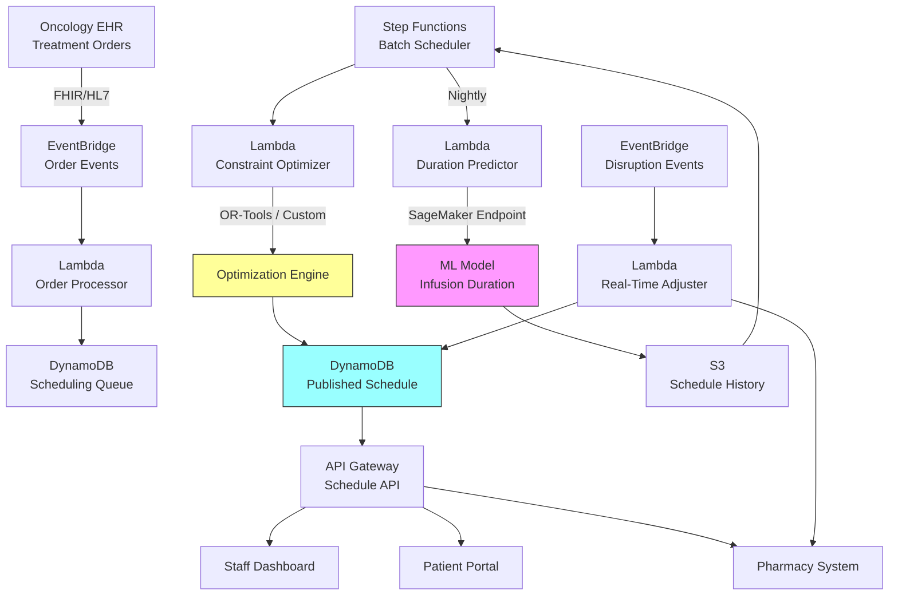

# Recipe 14.9 Architecture and Implementation: Chemotherapy Scheduling

*Companion to [Recipe 14.9: Chemotherapy Scheduling](chapter14.09-chemotherapy-scheduling). This page covers the AWS architecture, services, prerequisites, and implementation guidance. For the problem framing, conceptual approach, and pseudocode walkthrough, start with the main recipe.*

---

## The AWS Implementation

### Why These Services

**Amazon SageMaker for model training and hosting.** The duration prediction models (how long will this patient's infusion actually take, given their regimen, cycle number, and history?) are ML models that need training infrastructure and a hosting endpoint. SageMaker provides both, with the ability to retrain on new data as your center accumulates history.

**AWS Lambda for the scheduling engine orchestration.** The batch scheduling job (build tomorrow's schedule) runs once nightly. The real-time adjustment engine fires on events (patient arrival, delay notification, cancellation). Both are event-driven, short-lived compute tasks. Lambda's pay-per-invocation model fits perfectly.

**AWS Step Functions for the multi-step scheduling workflow.** The full scheduling pipeline (pull orders, predict durations, run optimizer, validate constraints, publish schedule, notify pharmacy) has multiple steps with error handling and retry logic. Step Functions provides the orchestration with built-in state management and visibility.

**Amazon DynamoDB for schedule state.** Nurses check the schedule board constantly. The patient portal refreshes every 30 seconds. Pharmacy needs instant visibility into timing changes. You need single-digit-millisecond reads on a data structure that updates maybe 50 times per day but gets read thousands of times. DynamoDB's read performance and conditional writes (preventing race conditions when multiple adjustments happen simultaneously) fit this access pattern exactly.

**Amazon EventBridge for event routing.** Schedule changes, patient arrivals, pharmacy completions, and disruption notifications all flow as events. EventBridge routes these to the appropriate handlers (Lambda functions) based on event type, enabling loose coupling between the scheduling engine and its consumers.

**Amazon S3 for optimization artifacts.** Solver logs, schedule history, model training data, and audit trails all land in S3. This supports both compliance (you need to explain why a patient was scheduled when they were) and continuous improvement (analyzing historical schedules to tune the optimizer). Solver logs contain PHI (patient IDs, regimens, scheduling decisions), so store them in a dedicated bucket with S3 Object Lock for compliance retention (minimum 6 years per HIPAA), lifecycle policies transitioning to Glacier after 90 days, and bucket policies restricting access to the scheduling service role and authorized administrators.

**AWS HealthLake or Amazon RDS for clinical data.** Treatment protocols, drug stability profiles, and patient treatment histories live in a clinical data store. HealthLake if you're working with FHIR resources; RDS (PostgreSQL) if you need relational queries across protocol definitions and scheduling rules.

Note on API access patterns: the staff dashboard and pharmacy system are internal consumers (hospital network only), while the patient portal is internet-facing. Consider separate API Gateway stages: a private API with IAM authentication for internal consumers, and a public API with WAF, rate limiting, and Cognito/OIDC authentication for the patient portal.

### Architecture Diagram

<!-- TODO (TechWriter): Expert review A2 (HIGH). Add bidirectional arrow between Staff Dashboard and scheduling engine. Add paragraph describing human override mechanism: drag-and-drop reassignment, assignment locking, ad-hoc constraint addition, re-solve requests. Log all overrides with staff ID and reason. Track override frequency to identify missing model constraints. The recipe's Honest Take already advises "Allow overrides" but the architecture doesn't implement it. -->

<!-- TODO (TechWriter): Expert review A1 (HIGH). Add failover/degradation subsection. The optimization layer enhances existing scheduling; it does not replace it. Define: if batch optimizer fails by 6 AM, fall back to template-based schedule. If real-time adjuster times out (>5s), route to human scheduler queue. Staff dashboard must show current schedule regardless of optimizer availability. Alert if batch job fails or real-time latency exceeds 5s for 3+ consecutive events. -->

### Prerequisites

| Requirement | Details |
|-------------|---------|
| AWS Services | SageMaker, Lambda, Step Functions, DynamoDB, EventBridge, S3, API Gateway, CloudWatch |
| IAM Permissions | sagemaker:InvokeEndpoint (scoped to duration-prediction endpoint ARN), dynamodb:PutItem/GetItem/Query/UpdateItem (scoped to schedule-* and queue-* tables), s3:GetObject/PutObject (scoped to schedule-history and solver-logs buckets), states:StartExecution (scoped to batch-scheduler state machine), events:PutEvents (scoped to scheduling event bus), lambda:InvokeFunction (scoped to scheduling functions), logs:CreateLogGroup/CreateLogStream/PutLogEvents, kms:Decrypt/GenerateDataKey (scoped to scheduling CMK) |
| BAA | Required. Patient treatment schedules are PHI. |
| Encryption | S3 SSE-KMS, DynamoDB encryption at rest, TLS in transit for all API calls |
| VPC | Production deployment in VPC with VPC endpoints for AWS services. Required endpoints: DynamoDB (gateway), S3 (gateway), SageMaker Runtime (interface), Step Functions (interface), EventBridge (interface), CloudWatch Logs (interface). No NAT Gateway required when all endpoints are configured. Security groups on interface endpoints restrict access to the scheduling Lambda security group only. |
| CloudTrail | Audit logging for all schedule modifications (who changed what, when) |
| Sample Data | Synthetic treatment orders with realistic regimen distributions. Never use real patient data in dev. |
| Cost Estimate | ~$1,500/month (small center, 15 chairs) to ~$6,000/month (large center, 50+ chairs, real-time optimization) |

### Ingredients

| AWS Service | Role in This Recipe |
|-------------|-------------------|
| Amazon SageMaker | Train and host infusion duration prediction models |
| AWS Lambda | Run scheduling logic, process events, handle real-time adjustments |
| AWS Step Functions | Orchestrate the multi-step batch scheduling workflow |
| Amazon DynamoDB | Store current schedule, resource state, and patient queue |
| Amazon EventBridge | Route scheduling events (orders, arrivals, disruptions) |
| Amazon S3 | Store schedule history, solver logs, training data |
| Amazon API Gateway | Expose schedule API to dashboards and external systems |
| Amazon CloudWatch | Monitor solver performance, alert on constraint violations |

---

## Variations and Extensions

### Multi-Site Scheduling

For health systems with multiple infusion centers, extend the optimization to include site assignment. A patient might be willing to drive 10 extra minutes to a less-busy center if it means a 2-hour-earlier appointment. The problem becomes a two-stage optimization: assign patients to sites, then schedule within each site. The site assignment can account for travel time, center specialization (some centers handle specific regimens better), and system-wide load balancing.

### Predictive No-Show Management

Integrate a no-show prediction model (see Recipe 7.1) to identify patients likely to miss their appointment. For high-risk no-shows, consider strategic overbooking: schedule a waitlist patient into the same slot with a conditional confirmation. If the primary patient shows, the waitlist patient gets rescheduled. If they don't, the chair isn't wasted. This requires careful communication with patients and a robust waitlist management system.

### Treatment Sequencing Optimization

Some patients receive multiple treatments across different departments (radiation in the morning, chemo in the afternoon, lab work before both). Extend the optimizer to coordinate across departments, minimizing total time the patient spends in the facility. This is a job-shop scheduling variant where each patient is a "job" with operations on different "machines" (departments).

---

## Additional Resources

### AWS Documentation

- [Amazon SageMaker Developer Guide](https://docs.aws.amazon.com/sagemaker/latest/dg/whatis.html) - Model training and endpoint hosting for duration prediction
- [AWS Step Functions Developer Guide](https://docs.aws.amazon.com/step-functions/latest/dg/welcome.html) - Workflow orchestration for the scheduling pipeline
- [Amazon DynamoDB Developer Guide](https://docs.aws.amazon.com/amazondynamodb/latest/developerguide/Introduction.html) - Low-latency schedule state storage
- [Amazon EventBridge User Guide](https://docs.aws.amazon.com/eventbridge/latest/userguide/eb-what-is.html) - Event-driven architecture for disruption handling
- [AWS Lambda Developer Guide](https://docs.aws.amazon.com/lambda/latest/dg/welcome.html) - Serverless compute for scheduling functions
- [HIPAA Eligible Services Reference](https://aws.amazon.com/compliance/hipaa-eligible-services-reference/) - Verify all services used are HIPAA eligible

### Optimization Libraries and Solvers

- [Google OR-Tools](https://developers.google.com/optimization) - Open-source CP-SAT solver, excellent for scheduling problems
- [HiGHS](https://highs.dev/) - Open-source MIP solver, good for linear formulations
- OR-Tools can be packaged as a Lambda layer (~50MB) or deployed in a container image for Lambda or ECS. The CP-SAT solver is the recommended entry point for scheduling problems at infusion center scale.

### Healthcare Scheduling Research

- Hahn-Goldberg et al. (2014), "Dynamic optimization of chemotherapy outpatient scheduling with uncertainty," Health Care Management Science
- Turkcan et al. (2012), "Chemotherapy operations planning and scheduling," IIE Transactions on Healthcare Systems Engineering
- Oncology Nursing Society (ONS) publishes infusion center staffing and operational guidelines relevant to nursing ratio constraints

---

## Estimated Implementation Time

| Phase | Duration | What You Get |
|-------|----------|-------------|
| Basic (batch scheduling) | 8-12 weeks | Nightly schedule generation with chair and nursing constraints. Manual pharmacy coordination. |
| Production-ready | 16-24 weeks | Full constraint model including pharmacy. Duration prediction ML. Real-time adjustment for common disruptions. Staff dashboard. |
| With variations | 28-36 weeks | Multi-site optimization. No-show overbooking. Cross-department coordination. Simulation-based validation suite. |

---

**Tags:** optimization, scheduling, chemotherapy, infusion-center, constraint-programming, resource-allocation, pharmacy-coordination, nursing-workload, operations-research

---

[← Recipe 14.8: Ambulance Routing and Dispatch](chapter14.08-ambulance-routing-dispatch) | [Chapter 14 Index](chapter14-preface) | [Recipe 14.10: Health System Network Design →](chapter14.10-health-system-network-design)

---

*← [Main Recipe 14.9](chapter14.09-chemotherapy-scheduling) · [Python Example](chapter14.09-python-example) · [Chapter Preface](chapter14-preface)*
