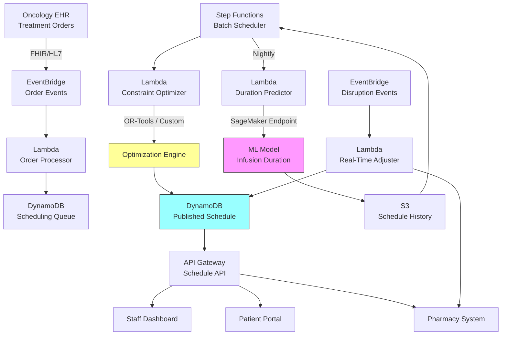

# Recipe 14.9: Chemotherapy Scheduling

**Complexity:** Complex · **Phase:** Production · **Estimated Cost:** ~$1,500–6,000/month depending on infusion center size and scheduling volume

---

## The Problem

It's 7:15 AM at a 30-chair infusion center. The schedule says 42 patients today. Three of them have regimens that take 6+ hours. Eight need pre-medications that require a nurse to monitor for the first 30 minutes. Two are on clinical trial protocols with rigid timing windows. The pharmacy needs 45 minutes of lead time to mix each bag, and some drugs expire within 4 hours of preparation. One nurse called in sick. Chair 12 is down for maintenance.

The scheduler is staring at a whiteboard (or more likely, an Excel spreadsheet that someone printed out) trying to Tetris this together. If she gets it wrong, patients wait hours in the lobby while chairs sit empty. Or worse, a drug gets mixed too early, expires before the patient is seated, and pharmacy has to remix it at a cost of hundreds or thousands of dollars per wasted dose.

This is not a scheduling problem in the way that booking a haircut is a scheduling problem. Chemotherapy scheduling is a multi-resource, multi-constraint, time-dependent optimization problem with real clinical consequences. Get it wrong and patients miss treatment windows, nurses burn out from uneven workloads, pharmacy wastes expensive biologics, and the center loses revenue from underutilized chairs.

The numbers are striking. A typical infusion chair costs a health system $500,000 to $1 million per year when you factor in space, equipment, staffing, and overhead. Running at 60% utilization instead of 80% means you're effectively burning $200,000 per chair per year. A 30-chair center leaving 20% on the table is wasting $6 million annually. And that's before you count the patient experience cost of 2-hour waits, the pharmacy waste from poor timing coordination, and the nursing overtime from schedules that pile everyone into the same 3-hour window.

Most infusion centers today schedule with a combination of template-based rules ("Regimen X gets a 4-hour slot") and manual adjustment by experienced schedulers who carry institutional knowledge in their heads. When that scheduler goes on vacation, things fall apart. The rules don't account for the interactions between patients: the fact that scheduling three 6-hour patients in adjacent chairs means you need three nurses simultaneously for the first hour, which might exceed your staffing ratio.

This is a problem that optimization was born to solve. Let's dig into how.

---

## The Technology: Constraint-Based Scheduling and Resource Optimization

### What Makes Chemotherapy Scheduling Hard

Before we get into solvers and algorithms, let's understand why this problem resists simple solutions. It's not just "assign patients to time slots." It's a coupled resource allocation problem with temporal dependencies.

**Multiple coupled resources.** Every infusion appointment simultaneously consumes: a chair (for the duration), a nurse (partially, with ratio constraints), pharmacy prep capacity (before the appointment), and sometimes specialized equipment (pumps, monitoring devices). You can't optimize chairs independently of nursing. A schedule that perfectly fills chairs but requires 12 nurses in hour 1 and 2 nurses in hour 5 is useless if you only have 8 nurses.

**Variable durations.** Unlike a dentist appointment that's reliably 45 minutes, chemotherapy infusions range from 30 minutes to 8+ hours depending on the regimen. A patient on FOLFOX (a common colorectal cancer protocol) might need 46 hours of total infusion time spread across multiple days. A Herceptin infusion might be 30 minutes. The schedule has to accommodate this variance, and the variance isn't random; it's determined by the treatment protocol.

**Temporal dependencies within a visit.** A single patient visit often has multiple phases: pre-medication (30 minutes), wait for reaction assessment (15 minutes), main infusion (variable), post-infusion observation (15-30 minutes). These phases have ordering constraints and minimum/maximum gaps between them. The nurse is needed for transitions but not necessarily for the entire infusion.

**Pharmacy coupling.** The pharmacy can only prepare so many bags per hour. Each bag has a beyond-use date (BUD) once mixed. If the patient's appointment is delayed, the bag might expire. If the bag is mixed too early, same problem. The schedule must coordinate patient arrival times with pharmacy prep capacity and drug stability windows.

**Acuity-based nursing ratios.** Regulatory and safety requirements dictate nurse-to-patient ratios. But these aren't uniform: a patient receiving their first dose of a new regimen needs closer monitoring (maybe 1:2 ratio) than a patient on their 10th cycle of a well-tolerated drug (maybe 1:5 ratio). The schedule must ensure that at no point during the day does the required nursing attention exceed available nursing capacity.

**Patient preferences and constraints.** Patients undergoing chemotherapy are already dealing with enough. Many have strong preferences: morning appointments (before fatigue sets in), specific days (coordinating with caregivers), specific nurses (continuity of care). Some have hard constraints: lab work must be done 24 hours before infusion, or the treatment protocol specifies exact intervals between cycles (every 21 days, not 20, not 22).

**Stochastic disruptions.** Patients arrive late. Reactions happen that extend observation time. A nurse gets pulled for an emergency. Lab results come back abnormal and the oncologist holds the treatment. The schedule needs slack, but too much slack means underutilization.

### The Mathematical Formulation

At its core, this is a Resource-Constrained Project Scheduling Problem (RCPSP) variant. Each patient visit is a "project" with multiple "activities" (phases), and the infusion center's resources (chairs, nurses, pharmacy slots) are the constrained resources.

**Decision variables:**
- Start time for each patient's appointment
- Chair assignment for each patient
- Nurse assignment for each patient (or at least, nursing capacity allocation per time period)
- Pharmacy prep start time for each patient's drugs

**Objective function (what we're optimizing):**

This is where it gets interesting, because there are multiple competing objectives:

- Maximize chair utilization (fill rate)
- Minimize patient wait time (time between arrival and chair assignment)
- Level nursing workload across the day (avoid peaks and valleys)
- Minimize pharmacy waste (drugs mixed but not administered before expiration)
- Respect patient preferences (preferred time, preferred nurse)
- Minimize overtime (finish all patients before shift end)

In practice, you combine these into a weighted objective or use a hierarchical approach: first ensure feasibility (all hard constraints met), then optimize the primary objective (utilization), then improve secondary objectives (wait time, workload leveling) without degrading the primary.

**Hard constraints:**
- Each patient gets exactly one chair for their entire infusion duration
- No two patients occupy the same chair at the same time (with turnover buffer)
- Nursing ratios never exceeded at any point in time
- Pharmacy prep completes before patient's scheduled start time
- Drug stability window not exceeded (prep-to-administration time < BUD)
- Treatment protocol timing respected (minimum/maximum days between cycles)
- Center operating hours respected (no infusion starts that would extend past closing)

**Soft constraints (violated with penalty):**
- Patient preferred time window
- Patient preferred nurse
- Even distribution of first-dose patients across the day (higher monitoring needs)
- Minimum gap between patients in same chair (turnover/cleaning time)
- Avoid scheduling complex regimens at end of day (risk of overtime)

### Solver Selection for Infusion Scheduling

The choice of solver depends on your problem size and how quickly you need answers.

**Constraint Programming (CP).** CP solvers (like Google OR-Tools CP-SAT, IBM CP Optimizer) excel at scheduling problems with complex constraints. They're particularly good when the constraints are heterogeneous (mixing time windows, resource capacities, precedence relations) and when feasibility is as important as optimality. For a 30-50 chair center scheduling 40-80 patients per day, CP can find good solutions in seconds to minutes. This is often the best starting point for infusion scheduling.

**Mixed-Integer Programming (MIP).** MIP solvers (Gurobi, CPLEX, HiGHS) work well when the objective function and constraints can be expressed as linear or piecewise-linear functions. The nursing workload leveling objective is naturally linear. MIP gives you optimality guarantees (or provable bounds on how far from optimal you are). For the batch overnight scheduling problem, MIP is excellent. Solve times for a typical day's schedule: 10 seconds to 5 minutes.

**Heuristic/Metaheuristic approaches.** For very large centers or when you need real-time rescheduling (a patient just cancelled, who takes their slot?), constructive heuristics followed by local search can produce good schedules in milliseconds. You sacrifice optimality guarantees but gain speed. Common approaches: priority-based dispatching rules (schedule highest-acuity patients first, then fill gaps), followed by swap-based improvement (try moving patients between slots and keep improvements).

**Hybrid approaches.** The most practical production systems use a combination: MIP or CP for the overnight batch schedule (tomorrow's plan), heuristics for real-time adjustments during the day (handling disruptions), and simulation for what-if analysis (what happens if we add 5 more patients to Thursday?).

### Real-Time vs. Batch Optimization

Like the ambulance dispatch problem (Recipe 14.8), chemotherapy scheduling operates on multiple timescales:

**Strategic (monthly/quarterly).** How many chairs do we need? What are our template hours? Should we add a Saturday session? This is capacity planning, solved with simulation and long-horizon optimization.

**Tactical (weekly).** Build next week's schedule. Assign specific patients to specific days and approximate time windows. This is the main batch optimization problem. You have full information about who needs treatment, what their regimens are, and what resources are available. Solve time budget: minutes. This is where MIP/CP shines.

**Operational (day-of).** The schedule is set, but reality intervenes. A patient is 30 minutes late. Lab results are delayed. A chair breaks. You need to reoptimize the remaining schedule without disrupting patients already in chairs. Solve time budget: seconds. This is where heuristics and incremental solvers earn their keep.

**Reactive (real-time).** A patient has an adverse reaction and needs extended observation. A walk-in urgent case needs immediate treatment. The system must suggest the least-disruptive adjustment. This is constraint propagation: given the disruption, what's the minimum set of changes needed to maintain feasibility?

### The Pharmacy Coordination Problem

This deserves its own section because it's the piece that most scheduling systems get wrong or ignore entirely.

Chemotherapy drugs are not sitting on a shelf waiting to be grabbed. Many are mixed (reconstituted, diluted, compounded) in the pharmacy specifically for each patient, based on their body surface area, lab values, and protocol. This mixing takes time (15-60 minutes depending on complexity), requires specialized staff, and produces a product with a limited shelf life.

The coordination challenge: pharmacy needs to start mixing early enough that the bag is ready when the patient is in the chair, but not so early that the drug expires before administration. For drugs with a 4-hour BUD, this creates a tight coupling between the schedule and pharmacy workflow. If the patient's appointment shifts by an hour, pharmacy needs to know immediately so they can adjust their prep sequence.

Some drugs have even tighter windows. Certain biologics must be administered within 1-2 hours of preparation. Others (like some checkpoint inhibitors) are stable for 24+ hours and can be prepped the day before. The scheduling system needs to know these stability profiles and factor them into the timing constraints.

The pharmacy also has its own capacity constraints: number of hoods (sterile preparation areas), number of pharmacists/technicians, and verification bottlenecks. A schedule that requires 15 bags to be ready at 8:00 AM might be infeasible from a pharmacy perspective even if the chairs and nurses are available.

### Workload Leveling

One of the most impactful optimizations, and one that's invisible to patients, is workload leveling. Without optimization, infusion schedules tend to develop peaks: everyone wants the 8 AM slot, so the first two hours are chaos and the last two hours are empty. Nurses are overwhelmed at 9 AM and idle at 3 PM.

Workload leveling means distributing the nursing demand evenly across the day. This isn't just about counting patients; it's about counting nursing attention units. A first-dose patient in their first 30 minutes requires 3x the nursing attention of a stable patient in hour 4 of their infusion. The leveling algorithm needs to account for the time-varying nursing demand profile of each patient's visit, not just their presence in a chair.

The mathematical formulation: divide the day into time periods (e.g., 15-minute intervals). For each period, sum the nursing demand from all patients scheduled to be in that phase of their visit during that period. Minimize the maximum demand across all periods (minimax), or minimize the variance of demand across periods. Both formulations push toward a flat workload curve.

---

## General Architecture Pattern

The vendor-agnostic architecture for a chemotherapy scheduling optimization system has these logical components:

```
[Treatment Orders] → [Scheduling Engine] → [Optimized Schedule] → [Execution Layer]
       ↑                      ↑                                          ↓
[Patient Preferences]   [Resource Model]                         [Real-Time Adjustments]
                              ↑                                          ↓
                     [Capacity Data]                              [Pharmacy Coordination]
```

**Data ingestion layer.** Pulls treatment orders from the oncology EHR (what regimen, what cycle, what timing constraints), patient preferences from a scheduling portal or intake process, and resource availability from staffing and facilities systems.

**Resource model.** A representation of the infusion center's capacity: chairs (with attributes like isolation capability, proximity to nursing station), nurses (with certifications, shift schedules, patient assignments), pharmacy (hood capacity, staffing, prep time estimates), and equipment (pumps, monitoring devices).

**Scheduling engine.** The optimization core. Takes demand (patients needing treatment) and supply (available resources) and produces an assignment of patients to time slots, chairs, and nursing capacity. Runs in batch mode for forward scheduling and incremental mode for day-of adjustments.

**Execution layer.** The operational interface that staff interact with. Shows the day's schedule, highlights conflicts, enables manual overrides, and feeds disruptions back to the scheduling engine for reoptimization.

**Pharmacy coordination interface.** Translates the patient schedule into a pharmacy prep sequence, accounting for drug stability windows and prep capacity. Alerts pharmacy when schedule changes affect their workflow.

**Feedback loop.** Captures actual vs. planned durations, actual arrival times, actual nursing demand. This data feeds back into the model to improve duration estimates and demand forecasts over time.

---

## The AWS Implementation

### Why These Services

**Amazon SageMaker for model training and hosting.** The duration prediction models (how long will this patient's infusion actually take, given their regimen, cycle number, and history?) are ML models that need training infrastructure and a hosting endpoint. SageMaker provides both, with the ability to retrain on new data as your center accumulates history.

**AWS Lambda for the scheduling engine orchestration.** The batch scheduling job (build tomorrow's schedule) runs once nightly. The real-time adjustment engine fires on events (patient arrival, delay notification, cancellation). Both are event-driven, short-lived compute tasks. Lambda's pay-per-invocation model fits perfectly.

**AWS Step Functions for the multi-step scheduling workflow.** The full scheduling pipeline (pull orders, predict durations, run optimizer, validate constraints, publish schedule, notify pharmacy) has multiple steps with error handling and retry logic. Step Functions provides the orchestration with built-in state management and visibility.

**Amazon DynamoDB for schedule state.** Nurses check the schedule board constantly. The patient portal refreshes every 30 seconds. Pharmacy needs instant visibility into timing changes. You need single-digit-millisecond reads on a data structure that updates maybe 50 times per day but gets read thousands of times. DynamoDB's read performance and conditional writes (preventing race conditions when multiple adjustments happen simultaneously) fit this access pattern exactly.

**Amazon EventBridge for event routing.** Schedule changes, patient arrivals, pharmacy completions, and disruption notifications all flow as events. EventBridge routes these to the appropriate handlers (Lambda functions) based on event type, enabling loose coupling between the scheduling engine and its consumers.

**Amazon S3 for optimization artifacts.** Solver logs, schedule history, model training data, and audit trails all land in S3. This supports both compliance (you need to explain why a patient was scheduled when they were) and continuous improvement (analyzing historical schedules to tune the optimizer). Solver logs contain PHI (patient IDs, regimens, scheduling decisions), so store them in a dedicated bucket with S3 Object Lock for compliance retention (minimum 6 years per HIPAA), lifecycle policies transitioning to Glacier after 90 days, and bucket policies restricting access to the scheduling service role and authorized administrators.

**AWS HealthLake or Amazon RDS for clinical data.** Treatment protocols, drug stability profiles, and patient treatment histories live in a clinical data store. HealthLake if you're working with FHIR resources; RDS (PostgreSQL) if you need relational queries across protocol definitions and scheduling rules.

Note on API access patterns: the staff dashboard and pharmacy system are internal consumers (hospital network only), while the patient portal is internet-facing. Consider separate API Gateway stages: a private API with IAM authentication for internal consumers, and a public API with WAF, rate limiting, and Cognito/OIDC authentication for the patient portal.

### Architecture Diagram

<!-- TODO (TechWriter): Expert review A2 (HIGH). Add bidirectional arrow between Staff Dashboard and scheduling engine. Add paragraph describing human override mechanism: drag-and-drop reassignment, assignment locking, ad-hoc constraint addition, re-solve requests. Log all overrides with staff ID and reason. Track override frequency to identify missing model constraints. The recipe's Honest Take already advises "Allow overrides" but the architecture doesn't implement it. -->

<!-- TODO (TechWriter): Expert review A1 (HIGH). Add failover/degradation subsection. The optimization layer enhances existing scheduling; it does not replace it. Define: if batch optimizer fails by 6 AM, fall back to template-based schedule. If real-time adjuster times out (>5s), route to human scheduler queue. Staff dashboard must show current schedule regardless of optimizer availability. Alert if batch job fails or real-time latency exceeds 5s for 3+ consecutive events. -->



### Prerequisites

| Requirement | Details |
|-------------|---------|
| AWS Services | SageMaker, Lambda, Step Functions, DynamoDB, EventBridge, S3, API Gateway, CloudWatch |
| IAM Permissions | sagemaker:InvokeEndpoint (scoped to duration-prediction endpoint ARN), dynamodb:PutItem/GetItem/Query/UpdateItem (scoped to schedule-* and queue-* tables), s3:GetObject/PutObject (scoped to schedule-history and solver-logs buckets), states:StartExecution (scoped to batch-scheduler state machine), events:PutEvents (scoped to scheduling event bus), lambda:InvokeFunction (scoped to scheduling functions), logs:CreateLogGroup/CreateLogStream/PutLogEvents, kms:Decrypt/GenerateDataKey (scoped to scheduling CMK) |
| BAA | Required. Patient treatment schedules are PHI. |
| Encryption | S3 SSE-KMS, DynamoDB encryption at rest, TLS in transit for all API calls |
| VPC | Production deployment in VPC with VPC endpoints for AWS services. Required endpoints: DynamoDB (gateway), S3 (gateway), SageMaker Runtime (interface), Step Functions (interface), EventBridge (interface), CloudWatch Logs (interface). No NAT Gateway required when all endpoints are configured. Security groups on interface endpoints restrict access to the scheduling Lambda security group only. |
| CloudTrail | Audit logging for all schedule modifications (who changed what, when) |
| Sample Data | Synthetic treatment orders with realistic regimen distributions. Never use real patient data in dev. |
| Cost Estimate | ~$1,500/month (small center, 15 chairs) to ~$6,000/month (large center, 50+ chairs, real-time optimization) |

### Ingredients

| AWS Service | Role in This Recipe |
|-------------|-------------------|
| Amazon SageMaker | Train and host infusion duration prediction models |
| AWS Lambda | Run scheduling logic, process events, handle real-time adjustments |
| AWS Step Functions | Orchestrate the multi-step batch scheduling workflow |
| Amazon DynamoDB | Store current schedule, resource state, and patient queue |
| Amazon EventBridge | Route scheduling events (orders, arrivals, disruptions) |
| Amazon S3 | Store schedule history, solver logs, training data |
| Amazon API Gateway | Expose schedule API to dashboards and external systems |
| Amazon CloudWatch | Monitor solver performance, alert on constraint violations |

---

## Code: Pseudocode Walkthrough

### Step 1: Ingest Treatment Orders

Every scheduling cycle starts with knowing who needs treatment. Treatment orders flow from the oncology EHR, each specifying the patient, regimen, cycle number, and timing constraints.

If you skip this step, you're scheduling from stale data. Patients who've been added, cancelled, or had their regimen changed won't be reflected in the schedule.

```
FUNCTION ingest_treatment_orders(date_range):
    // Pull pending orders from the EHR integration layer
    orders = query_ehr_orders(
        status = "pending_scheduling",
        treatment_date_range = date_range
    )
    
    FOR EACH order IN orders:
        // Enrich with protocol details
        protocol = lookup_protocol(order.regimen_code)
        
        // Build scheduling request
        request = {
            patient_id: order.patient_id,
            regimen: order.regimen_code,
            cycle_number: order.cycle_number,
            phases: protocol.phases,  // pre-med, infusion, observation
            nursing_acuity: determine_acuity(order, protocol),
            drug_stability_hours: protocol.beyond_use_date_hours,
            pharmacy_prep_minutes: protocol.prep_time_minutes,
            hard_constraints: {
                earliest_start: order.earliest_date,
                latest_start: order.latest_date,
                required_certifications: protocol.nurse_certifications
            },
            soft_constraints: {
                preferred_time: order.patient_preferred_time,
                preferred_nurse: order.patient_preferred_nurse,
                preferred_chair: order.patient_preferred_chair
            }
        }
        
        store_scheduling_request(request)
    
    RETURN count(orders)
```

### Step 2: Predict Infusion Durations

Protocol-defined durations are starting points, but actual durations vary by patient. A patient who tolerates their regimen well might finish 20 minutes early. A patient prone to reactions might need an extra hour of observation. The ML model predicts actual duration based on historical patterns.

Without this step, you're scheduling based on protocol maximums (wasting capacity) or protocol averages (causing overruns).

```
FUNCTION predict_durations(scheduling_requests):
    // Build feature vectors for duration prediction
    FOR EACH request IN scheduling_requests:
        features = {
            regimen_code: request.regimen,
            cycle_number: request.cycle_number,
            patient_age: lookup_patient_age(request.patient_id),
            patient_bsa: lookup_patient_bsa(request.patient_id),
            historical_durations: get_past_durations(
                request.patient_id, 
                request.regimen, 
                last_n = 5
            ),
            day_of_week: target_date.day_of_week,
            time_of_day_bucket: request.preferred_time_bucket
        }
        
        // Call ML model for duration prediction
        prediction = invoke_duration_model(features)
        
        request.predicted_duration_minutes = prediction.point_estimate
        request.duration_confidence_interval = prediction.ci_90
        
        // Use upper bound of CI for scheduling buffer
        request.scheduled_duration = prediction.point_estimate + 
            (prediction.ci_90.upper - prediction.point_estimate) * 0.5
    
    RETURN scheduling_requests
```

### Step 3: Build Resource Model

The optimizer needs to know what's available. This step assembles the current state of all resources for the target scheduling period.

Skip this and you'll schedule patients into chairs that are broken, assign nurses who aren't working that day, or exceed pharmacy capacity.

```
FUNCTION build_resource_model(target_date):
    // Chairs: which are available, what are their attributes
    chairs = query_facility_system(
        date = target_date,
        resource_type = "infusion_chair"
    )
    
    // Nurses: who's working, what shifts, what certifications
    nurses = query_staffing_system(
        date = target_date,
        role = "infusion_nurse"
    )
    
    // Pharmacy: prep capacity by hour
    pharmacy_capacity = query_pharmacy_system(
        date = target_date,
        metric = "prep_slots_per_hour"
    )
    
    // Build the constraint model
    resource_model = {
        chairs: [
            {id, available_from, available_until, attributes}
            FOR EACH chair IN chairs WHERE chair.status = "active"
        ],
        nursing_capacity: [
            {time_period, available_nurses, total_attention_units}
            FOR EACH period IN divide_day_into_periods(15_minutes)
            // attention_units = sum of (1/ratio) for each nurse in period
        ],
        pharmacy_slots: [
            {hour, max_preps, current_preps}
            FOR EACH hour IN pharmacy_capacity
        ],
        turnover_buffer_minutes: 15,  // cleaning between patients
        max_nursing_ratio: 5,  // max patients per nurse (general)
        first_dose_ratio: 2   // max patients per nurse (first dose)
    }
    
    RETURN resource_model
```

### Step 4: Run the Optimizer

This is the core. Given the demand (scheduling requests with predicted durations) and supply (resource model), find the best feasible schedule.

```
FUNCTION optimize_schedule(requests, resource_model, config):
    // Initialize the constraint programming model
    model = create_cp_model()
    
    // Decision variables: start time for each patient
    FOR EACH request IN requests:
        request.start_var = model.new_integer_variable(
            min = resource_model.day_start_minutes,
            max = resource_model.day_end_minutes - request.scheduled_duration,
            name = "start_" + request.patient_id
        )
        
        request.chair_var = model.new_integer_variable(
            min = 0,
            max = count(resource_model.chairs) - 1,
            name = "chair_" + request.patient_id
        )
    
    // Constraint: no chair overlap
    FOR EACH pair (req_a, req_b) IN all_pairs(requests):
        model.add_no_overlap_constraint(
            start_a = req_a.start_var,
            duration_a = req_a.scheduled_duration + turnover_buffer,
            chair_a = req_a.chair_var,
            start_b = req_b.start_var,
            duration_b = req_b.scheduled_duration + turnover_buffer,
            chair_b = req_b.chair_var
        )
    
    // Constraint: nursing capacity per period
    FOR EACH period IN time_periods:
        nursing_demand = SUM(
            request.nursing_attention_for_period(period)
            FOR EACH request IN requests
            WHERE request overlaps period
        )
        model.add_constraint(
            nursing_demand <= resource_model.nursing_capacity[period]
        )
    
    // Constraint: pharmacy prep capacity
    FOR EACH request IN requests:
        prep_start = request.start_var - request.pharmacy_prep_minutes
        prep_hour = prep_start / 60
        model.add_constraint(
            pharmacy_load[prep_hour] <= resource_model.pharmacy_slots[prep_hour].max_preps
        )
    
    // Constraint: drug stability
    FOR EACH request IN requests:
        // Note: In the batch schedule, this constraint ensures pharmacy prep
        // is scheduled close enough to the patient's start time that the drug
        // won't expire even with expected variance. The tighter real-time check
        // (in Step 6) verifies actual prep completion against actual expected
        // administration time when delays occur.
        model.add_constraint(
            request.start_var - prep_completion_time(request) 
            <= request.drug_stability_hours * 60
        )
    // TODO (TechWriter): Expert review A3 (MEDIUM). prep_completion_time() is
    // undefined. Reformulate: batch constraint should use start_var minus
    // (prep_start + pharmacy_prep_minutes) <= stability_hours * 60 - buffer.
    // Real drug stability risk is reactive (patient delayed after prep), handled in Step 6.
    
    // Objective: weighted combination
    objective = (
        config.weight_utilization * maximize_utilization(requests, resource_model)
        + config.weight_wait_time * minimize_total_wait(requests)
        + config.weight_leveling * minimize_workload_variance(requests, time_periods)
        + config.weight_preferences * maximize_preference_satisfaction(requests)
    )
    
    model.maximize(objective)
    
    // Solve with time limit
    solver = create_solver(time_limit_seconds = config.solve_time_limit)
    solution = solver.solve(model)
    
    IF solution.status == "OPTIMAL" OR solution.status == "FEASIBLE":
        schedule = extract_schedule(solution, requests, resource_model)
        schedule.optimality_gap = solution.gap_percentage
        RETURN schedule
    ELSE:
        // Infeasible: relax soft constraints and retry
        RETURN solve_with_relaxation(model, requests, resource_model)
```

### Step 5: Validate and Publish

The optimizer's output needs validation before it goes live. Clinical rules that are hard to encode as mathematical constraints get checked here.

```
FUNCTION validate_and_publish(schedule, target_date):
    // Clinical validation rules
    violations = []
    
    FOR EACH assignment IN schedule.assignments:
        // Check: no patient scheduled during their known
        // adverse reaction window from prior cycles
        IF has_known_reaction_pattern(assignment.patient_id, assignment.start_time):
            violations.append("Reaction risk: " + assignment.patient_id)
        
        // Check: first-dose patients not clustered
        // (need more monitoring, spread them out)
        first_dose_in_hour = count(
            a FOR a IN schedule.assignments
            WHERE a.is_first_dose AND same_hour(a.start_time, assignment.start_time)
        )
        IF first_dose_in_hour > config.max_first_dose_per_hour:
            violations.append("First-dose clustering in hour " + hour)
        
        // Check: end time within operating hours
        IF assignment.end_time > resource_model.day_end:
            violations.append("Overtime risk: " + assignment.patient_id)
    
    IF violations AND severity(violations) == "hard":
        // Re-run optimizer with additional constraints
        RETURN reoptimize_with_violations(schedule, violations)
    
    // Publish to schedule store
    store_schedule(schedule, target_date)
    
    // Notify pharmacy of prep sequence
    pharmacy_sequence = build_pharmacy_prep_order(schedule)
    notify_pharmacy(pharmacy_sequence)
    
    // Notify patients of confirmed times
    FOR EACH assignment IN schedule.assignments:
        send_patient_notification(
            assignment.patient_id,
            assignment.confirmed_arrival_time,
            assignment.estimated_duration
        )
        // Note: notifications must respect patient communication preferences.
        // Use the patient portal as the default secure channel. For SMS/email,
        // require explicit consent and minimize PHI: "Your appointment is
        // confirmed for 10:30 AM" rather than including regimen details.
    
    RETURN {schedule_id, violations_count: count(violations)}
```

### Step 6: Handle Real-Time Adjustments

The day-of reality never matches the plan perfectly. This function handles disruptions with minimal schedule impact.

Schedule modification events should be authenticated and authorized. Define roles: front-desk staff can trigger arrival/delay/cancellation events; clinical staff can trigger duration extensions and treatment holds; system administrators can trigger resource unavailability. All modification events must include the authenticated user ID, and the real-time adjuster should validate authorization before executing changes.

```
FUNCTION handle_disruption(disruption_event, current_schedule):
    // Classify the disruption
    SWITCH disruption_event.type:
        CASE "patient_late":
            delay_minutes = disruption_event.estimated_delay
            affected = find_assignment(current_schedule, disruption_event.patient_id)
            
            // Can we absorb the delay in existing buffer?
            IF delay_minutes <= affected.buffer_minutes:
                // Just shift this patient, no cascade
                affected.start_time += delay_minutes
                update_pharmacy_timing(affected)
            ELSE:
                // Need to reoptimize remaining schedule
                remaining = get_unstarted_assignments(current_schedule)
                reoptimized = quick_reoptimize(
                    remaining, 
                    resource_model_current_state(),
                    time_limit_seconds = 5  // must be fast
                )
                apply_changes(current_schedule, reoptimized)
        
        CASE "patient_cancelled":
            freed_slot = remove_assignment(current_schedule, disruption_event.patient_id)
            
            // Check waitlist for patients who could fill the gap
            waitlist_candidates = query_waitlist(
                date = today,
                min_duration = freed_slot.duration - 30,
                max_duration = freed_slot.duration + 30
            )
            
            IF waitlist_candidates:
                offer_slot_to_waitlist(freed_slot, waitlist_candidates)
            
            cancel_pharmacy_prep(disruption_event.patient_id)
        
        CASE "extended_duration":
            // Patient needs more time than scheduled
            extra_minutes = disruption_event.additional_minutes
            affected = find_assignment(current_schedule, disruption_event.patient_id)
            
            // Check if extension conflicts with next patient in same chair
            next_in_chair = get_next_assignment(current_schedule, affected.chair_id)
            
            IF next_in_chair AND conflicts(affected, extra_minutes, next_in_chair):
                // Move next patient to different chair or later time
                alternatives = find_alternative_slots(next_in_chair, current_schedule)
                apply_best_alternative(next_in_chair, alternatives)
        
        CASE "resource_unavailable":
            // Chair broke, nurse called out
            affected_assignments = find_affected(current_schedule, disruption_event.resource)
            reoptimized = quick_reoptimize(
                affected_assignments,
                resource_model_minus(disruption_event.resource),
                time_limit_seconds = 10
            )
            apply_changes(current_schedule, reoptimized)
    
    // Log the disruption and response for future learning
    log_disruption(disruption_event, changes_made)
    
    RETURN current_schedule
```

> **Curious how this looks in Python?** The pseudocode above covers the concepts. If you'd like to see sample Python code that demonstrates these patterns using boto3 and OR-Tools, check out the [Python Example](chapter14.09-python-example). It walks through each step with inline comments and notes on what you'd need to change for a real deployment.

---

## Expected Results

### Sample Output: Optimized Daily Schedule

```json
{
  "schedule_id": "SCH-2026-06-02-INF-CENTER-A",
  "target_date": "2026-06-02",
  "optimization_metadata": {
    "solver": "CP-SAT",
    "solve_time_seconds": 12.4,
    "optimality_gap": "2.1%",
    "objective_value": 0.847,
    "constraints_satisfied": 342,
    "soft_constraints_relaxed": 3
  },
  "summary": {
    "total_patients": 44,
    "total_chair_hours": 186.5,
    "utilization_rate": 0.82,
    "average_wait_minutes": 8.3,
    "nursing_workload_variance": 0.12,
    "pharmacy_waste_predicted": 0,
    "preference_satisfaction_rate": 0.78,
    "overtime_risk_patients": 1
  },
  "assignments": [
    {
      "patient_id": "PT-9928",
      "regimen": "FOLFOX-6",
      "cycle": 4,
      "chair_id": "C-07",
      "start_time": "08:00",
      "predicted_end_time": "14:15",
      "phases": [
        {"type": "pre_medication", "duration_min": 30, "nursing_ratio": "1:3"},
        {"type": "oxaliplatin_infusion", "duration_min": 120, "nursing_ratio": "1:4"},
        {"type": "5fu_bolus", "duration_min": 5, "nursing_ratio": "1:2"},
        {"type": "5fu_continuous", "duration_min": 180, "nursing_ratio": "1:5"},
        {"type": "observation", "duration_min": 15, "nursing_ratio": "1:5"}
      ],
      "pharmacy_prep_start": "07:15",
      "drug_stability_deadline": "12:15",
      "assigned_nurse_pool": ["RN-12", "RN-05"],
      "preference_met": {"time": true, "nurse": false, "chair": true}
    }
  ]
}
```

### Performance Benchmarks

| Metric | Value | Notes |
|--------|-------|-------|
| Batch solve time (30 chairs, 45 patients) | 8-15 seconds | CP-SAT solver |
| Batch solve time (50 chairs, 80 patients) | 30-90 seconds | May need time limit |
| Real-time adjustment | < 3 seconds | Heuristic with local search |
| Chair utilization improvement | +12-18% | vs. manual template scheduling |
| Patient wait time reduction | -35-50% | vs. first-come-first-served |
| Nursing workload variance reduction | -40-60% | vs. unoptimized schedule |
| Pharmacy waste reduction | -25-40% | from better timing coordination |
| Schedule feasibility rate | 97%+ | percentage of days with no hard constraint violations |

### Where It Struggles

- **Highly uncertain durations.** New regimens without historical data produce wide confidence intervals. The scheduler must use conservative estimates, reducing utilization.
- **Last-minute oncologist holds.** When a physician decides at 7:45 AM to hold a patient's treatment pending new lab results, the cascade is hard to absorb gracefully.
- **Patient no-shows without notice.** Unlike cancellations (which free a slot for the waitlist), no-shows waste the pharmacy prep and leave a chair empty.
- **Multi-day regimens.** Protocols that span 2-3 consecutive days create complex inter-day dependencies that single-day optimizers handle poorly.
- **Political constraints.** "Dr. Smith's patients always get morning slots" is a real constraint that's hard to encode without making the problem infeasible.

---

## The Honest Take

Here's what I've learned about chemotherapy scheduling optimization that the textbooks don't tell you:

**The hardest part isn't the math. It's the data.** You can build a beautiful constraint model, but if your infusion duration estimates are off by 30%, your schedule falls apart by 10 AM. Invest heavily in duration prediction. The difference between "protocol says 4 hours" and "this patient on this regimen on cycle 6 typically takes 3 hours 20 minutes" is the difference between 65% and 82% utilization.

**Pharmacy coordination is the secret weapon.** Most scheduling systems treat pharmacy as an external dependency. The centers that get the best results model pharmacy as a first-class resource in the optimization. When the scheduler knows that pharmacy can only prep 8 bags per hour, it naturally spreads start times and eliminates the 8 AM rush.

**Staff trust takes longer than the technical build.** Nurses and schedulers have been doing this manually for years. They're good at it. They have intuitions that are hard to encode ("Mrs. Johnson always needs extra time on Tuesdays because her caregiver drops her off late"). If the system overrides their judgment without explanation, they'll route around it. Build in transparency: show why the optimizer made each decision. Allow overrides. Track when overrides improve outcomes (they often do, early on).

**Start with the batch problem, not real-time.** The overnight schedule generation is where 80% of the value lives. Real-time rescheduling is sexy but complex. Get the batch optimizer working well first. Many centers see dramatic improvement just from better initial schedules, even without real-time adjustment.

**The objective function is political.** Maximizing utilization might mean scheduling patients at inconvenient times. Maximizing patient preference might mean lower utilization. Leveling nursing workload might mean some patients wait longer. These tradeoffs are not technical decisions. They're organizational values. Get leadership to explicitly weight the objectives before you build.

**Simulation is your best friend for validation.** Before deploying an optimizer, run it against 6 months of historical schedules. Compare its output to what actually happened. Where does it do better? Where does it do worse? This builds confidence and reveals blind spots in your constraint model.

---

## Variations and Extensions

### Multi-Site Scheduling

For health systems with multiple infusion centers, extend the optimization to include site assignment. A patient might be willing to drive 10 extra minutes to a less-busy center if it means a 2-hour-earlier appointment. The problem becomes a two-stage optimization: assign patients to sites, then schedule within each site. The site assignment can account for travel time, center specialization (some centers handle specific regimens better), and system-wide load balancing.

### Predictive No-Show Management

Integrate a no-show prediction model (see Recipe 7.1) to identify patients likely to miss their appointment. For high-risk no-shows, consider strategic overbooking: schedule a waitlist patient into the same slot with a conditional confirmation. If the primary patient shows, the waitlist patient gets rescheduled. If they don't, the chair isn't wasted. This requires careful communication with patients and a robust waitlist management system.

### Treatment Sequencing Optimization

Some patients receive multiple treatments across different departments (radiation in the morning, chemo in the afternoon, lab work before both). Extend the optimizer to coordinate across departments, minimizing total time the patient spends in the facility. This is a job-shop scheduling variant where each patient is a "job" with operations on different "machines" (departments).

---

## Related Recipes

- **Recipe 14.4 (Nurse Staffing Optimization):** The staffing schedule feeds directly into the resource model for infusion scheduling. Optimize staffing first, then schedule patients against that staffing.
- **Recipe 14.5 (Operating Room Block Scheduling):** Similar resource-constrained scheduling problem with different constraints. Shares solver technology and architecture patterns.
- **Recipe 14.7 (OR Case Sequencing):** The day-of sequencing problem parallels the real-time adjustment layer in infusion scheduling.
- **Recipe 12.5 (Hospital Census Forecasting):** Demand forecasting feeds the strategic capacity planning layer.
- **Recipe 7.1 (Appointment No-Show Prediction):** No-show models enable overbooking strategies in the scheduling optimizer.

---

## Additional Resources

### AWS Documentation

- [Amazon SageMaker Developer Guide](https://docs.aws.amazon.com/sagemaker/latest/dg/whatis.html) - Model training and endpoint hosting for duration prediction
- [AWS Step Functions Developer Guide](https://docs.aws.amazon.com/step-functions/latest/dg/welcome.html) - Workflow orchestration for the scheduling pipeline
- [Amazon DynamoDB Developer Guide](https://docs.aws.amazon.com/amazondynamodb/latest/developerguide/Introduction.html) - Low-latency schedule state storage
- [Amazon EventBridge User Guide](https://docs.aws.amazon.com/eventbridge/latest/userguide/eb-what-is.html) - Event-driven architecture for disruption handling
- [AWS Lambda Developer Guide](https://docs.aws.amazon.com/lambda/latest/dg/welcome.html) - Serverless compute for scheduling functions
- [HIPAA Eligible Services Reference](https://aws.amazon.com/compliance/hipaa-eligible-services-reference/) - Verify all services used are HIPAA eligible

### Optimization Libraries and Solvers

- [Google OR-Tools](https://developers.google.com/optimization) - Open-source CP-SAT solver, excellent for scheduling problems
- [HiGHS](https://highs.dev/) - Open-source MIP solver, good for linear formulations
- OR-Tools can be packaged as a Lambda layer (~50MB) or deployed in a container image for Lambda or ECS. The CP-SAT solver is the recommended entry point for scheduling problems at infusion center scale.

### Healthcare Scheduling Research

- Hahn-Goldberg et al. (2014), "Dynamic optimization of chemotherapy outpatient scheduling with uncertainty," Health Care Management Science
- Turkcan et al. (2012), "Chemotherapy operations planning and scheduling," IIE Transactions on Healthcare Systems Engineering
- Oncology Nursing Society (ONS) publishes infusion center staffing and operational guidelines relevant to nursing ratio constraints

---

## Estimated Implementation Time

| Phase | Duration | What You Get |
|-------|----------|-------------|
| Basic (batch scheduling) | 8-12 weeks | Nightly schedule generation with chair and nursing constraints. Manual pharmacy coordination. |
| Production-ready | 16-24 weeks | Full constraint model including pharmacy. Duration prediction ML. Real-time adjustment for common disruptions. Staff dashboard. |
| With variations | 28-36 weeks | Multi-site optimization. No-show overbooking. Cross-department coordination. Simulation-based validation suite. |

---

**Tags:** optimization, scheduling, chemotherapy, infusion-center, constraint-programming, resource-allocation, pharmacy-coordination, nursing-workload, operations-research

---

[← Recipe 14.8: Ambulance Routing and Dispatch](chapter14.08-ambulance-routing-dispatch) | [Chapter 14 Index](chapter14-index) | [Recipe 14.10: Health System Network Design →](chapter14.10-health-system-network-design)
