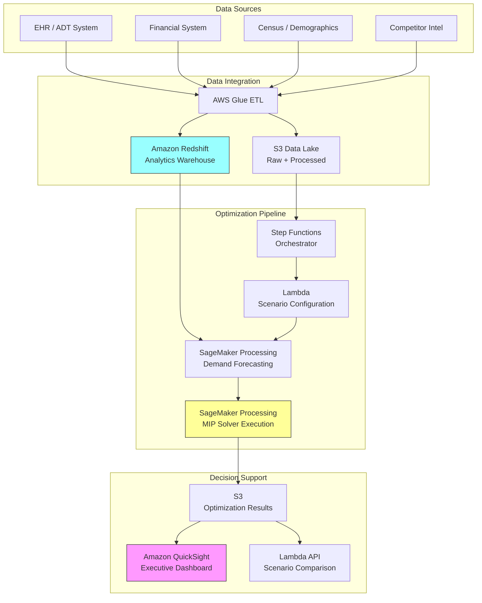

# Recipe 14.10 Architecture and Implementation: Health System Network Design

*Companion to [Recipe 14.10: Health System Network Design](chapter14.10-health-system-network-design). This page covers the AWS architecture, services, prerequisites, and pseudocode. For the problem framing and the conceptual approach, start with the main recipe.*

---

## The AWS Implementation

### Why These Services

**Amazon SageMaker for model development and solver execution.** Network design optimization requires significant compute for solver execution (especially multi-scenario runs) and a development environment for model formulation. SageMaker provides managed Jupyter notebooks for model development and processing jobs for compute-intensive solver runs and data preparation. You can install commercial solvers (Gurobi, CPLEX) on SageMaker instances or use open-source solvers (HiGHS, PuLP) directly.

<!-- TODO (TechWriter): Expert review ARC-2 (MEDIUM). Clarify why Processing Jobs (not Training Jobs) are the right abstraction for solver execution. Training Jobs carry ML-specific semantics (model artifacts, hyperparameter tuning) that don't apply here. If Spot instance checkpointing is the reason for Training Jobs, state that explicitly. -->

**Amazon S3 for data lake and model artifacts.** The input data (patient origin files, demographic projections, financial data, competitor intelligence) and output artifacts (solution files, scenario comparisons, sensitivity analyses) all live in S3. This provides durable, versioned storage with fine-grained access control.

**AWS Glue for data integration and preparation.** Network design requires pulling data from multiple source systems (EHR, financial systems, census data, competitor databases). Glue ETL jobs handle the extraction, transformation, and loading into the analytics-ready format the optimizer needs.

**Amazon Redshift for analytical queries.** Historical utilization data, patient origin analysis, and financial performance metrics live in Redshift. The demand forecasting models and gravity model parameter estimation query against this warehouse. For quarterly optimization runs, Redshift Serverless (pay-per-query) is more cost-effective than a provisioned cluster. Use provisioned only if the analytics warehouse serves other continuous workloads.

**Amazon QuickSight for decision support visualization.** The output of the optimization needs to be presented to executives as interactive maps, scenario comparisons, and sensitivity charts. QuickSight connects to the optimization results in S3/Redshift and provides the dashboard layer. Configure a QuickSight VPC Connection to access Redshift in the private subnet. For S3 access, QuickSight uses its service role (no VPC connectivity required).

**AWS Step Functions for pipeline orchestration.** The end-to-end workflow (data prep, demand forecast, model formulation, multi-scenario optimization, result aggregation, dashboard refresh) is a multi-step pipeline with dependencies. Step Functions Standard Workflows (not Express, which has a 5-minute limit) orchestrates the sequence, handles retries, and provides visibility into pipeline status. The full pipeline runs 12-24 hours, well beyond Express Workflows' maximum duration.

**AWS Lambda for lightweight processing.** Scenario configuration, result post-processing, notification triggers, and API endpoints for the dashboard use Lambda for stateless compute.

### Architecture Diagram



### Prerequisites

| Requirement | Details |
|-------------|---------|
| **AWS Services** | Amazon SageMaker, Amazon S3, AWS Glue, Amazon Redshift (Serverless recommended), Amazon QuickSight, AWS Step Functions, AWS Lambda |
| **IAM Permissions** | `sagemaker:CreateProcessingJob`, `s3:GetObject`, `s3:PutObject`, `glue:StartJobRun`, `redshift:GetClusterCredentials`, `states:StartExecution`, `quicksight:CreateIngestion`, `quicksight:DescribeIngestion`, `quicksight:UpdateDataSet`, `quicksight:DescribeDashboard` (scoped to specific resource ARNs) |
| **BAA** | Required. The gravity model estimation step uses patient-level data with geographic identifiers (ZIP code of residence + facility visited), which constitutes PHI. All services in the upstream pipeline (Redshift, SageMaker, S3 buckets holding patient origin data) must be covered. Once gravity model parameters are estimated, the optimizer itself operates on zone-level demand aggregates (not patient-level records). Ensure the SageMaker processing job output contains no patient-level records. |
| **Encryption** | S3: SSE-KMS for all buckets; Redshift: encrypted cluster; SageMaker: KMS-encrypted volumes and network isolation; all transit over TLS |
| **VPC** | SageMaker jobs in private subnets. VPC endpoints required: S3 (Gateway), CloudWatch Logs (Interface), SageMaker API (Interface), SageMaker Runtime (Interface), Step Functions (Interface), Glue (Interface), KMS (Interface). Lambda functions calling AWS services from within the VPC require these endpoints or a NAT Gateway. |
| **CloudTrail** | Enabled for all API calls. CloudTrail captures infrastructure-level audit (who started which SageMaker job). For decision-level audit (what scenarios were run, what parameters were used, what the optimizer recommended), log scenario configurations and solution summaries to a dedicated S3 audit bucket with object lock (WORM) enabled. |
| **Solver Licensing** | If using Gurobi or CPLEX: for no-internet VPC configurations, use a self-hosted license server (Gurobi token server or CPLEX ILM server) deployed in the same VPC. Gurobi's Web License Service (WLS) requires outbound HTTPS to license.gurobi.com; if your VPC prohibits this, use a local license file or token server. Verify that solver telemetry/usage reporting is disabled or does not transmit model content. For open-source solvers (HiGHS, CBC), no licensing infrastructure is needed. Budget $10K-$50K/year for enterprise commercial solver licenses. |
| **Cost Estimate** | SageMaker ml.m5.4xlarge for solver execution: ~$0.92/hour. Typical multi-scenario run: 4-8 hours. Monthly cost (weekly runs): ~$200-$600 compute. Redshift Serverless: ~$50-$200 per optimization cycle. Total infrastructure: ~$500-$1,500/month for quarterly runs. |

### Ingredients

| AWS Service | Role |
|------------|------|
| **Amazon SageMaker** | Model development (notebooks), solver execution (processing jobs), demand forecasting (processing jobs) |
| **Amazon S3** | Data lake for inputs, model artifacts, optimization results |
| **AWS Glue** | ETL from source systems; data quality checks; schema normalization |
| **Amazon Redshift** | Analytical warehouse for historical utilization, patient origin, financial data |
| **Amazon QuickSight** | Executive dashboards: maps, scenario comparisons, sensitivity analysis |
| **AWS Step Functions** | Pipeline orchestration across data prep, forecasting, optimization, reporting |
| **AWS Lambda** | Scenario configuration, result post-processing, API layer |
| **AWS KMS** | Encryption key management for all data at rest |
| **Amazon CloudWatch** | Monitoring solver execution time, pipeline health, cost tracking |

### Code

#### Walkthrough

**Step 1: Data integration and demand zone construction.** Before you can optimize anything, you need to define the geography. Health system network design operates on "demand zones": geographic units (typically ZIP codes or census tracts) where you can estimate current and future demand for each service line. This step pulls patient origin data from the EHR (where do current patients come from?), overlays demographic projections, and constructs the demand matrix: how many patients of each type will need care in each zone over the planning horizon. Skip this step and you're optimizing against fantasy numbers. The quality of your demand estimates is the single biggest determinant of whether the optimization output is useful or misleading.

```pseudocode
FUNCTION build_demand_zones(patient_origin_data, demographic_projections, service_lines):
    // Define geographic demand zones from patient origin patterns.
    // Each zone represents a geographic area with estimable demand.
    // Typically ZIP codes or census tracts, depending on data granularity.
    
    zones = extract unique geographic units from patient_origin_data
    
    // For each zone, calculate current demand by service line.
    // "Demand" here means total utilization (your patients + competitor patients).
    // Your patient origin data shows YOUR volume; you need market share estimates
    // to infer total market demand.
    
    FOR each zone in zones:
        FOR each service_line in service_lines:
            // Current volume from your system
            your_volume = count patients from zone using service_line
            
            // Estimate total market demand using market share
            // Market share comes from claims data or state discharge databases
            estimated_market_share = lookup market share for zone, service_line
            total_demand_current = your_volume / estimated_market_share
            
            // Project forward using demographic growth rates
            // Different service lines grow at different rates
            // (e.g., joint replacement grows faster in aging populations)
            growth_rate = lookup growth rate for zone, service_line from demographic_projections
            
            FOR each year in planning_horizon:
                projected_demand[zone][service_line][year] = 
                    total_demand_current * (1 + growth_rate) ^ year
    
    RETURN projected_demand, zones
```

**Step 2: Gravity model estimation.** Patients don't go to the nearest facility. They make choices. The gravity model captures those choices by estimating how "attractive" each facility is to patients in each zone, accounting for distance, facility size, service breadth, and reputation. The parameters are estimated from historical patient flow data: where did patients actually go, and how far did they travel? This model is what allows the optimizer to predict how patient flows will shift when you open a new facility or add a service line. Without it, you're assuming patients will behave in ways they demonstrably don't.

```pseudocode
FUNCTION estimate_gravity_model(patient_flows, facility_attributes, zone_attributes):
    // The gravity model predicts the probability that a patient in zone z
    // chooses facility f. The classic form:
    //
    //   P(z -> f) = attractiveness(f) * distance_decay(z, f) / 
    //               sum over all facilities g of [attractiveness(g) * distance_decay(z, g)]
    //
    // attractiveness(f) = function of bed count, service breadth, quality scores
    // distance_decay(z, f) = exp(-beta * travel_time(z, f))
    //
    // beta (distance sensitivity) varies by service line:
    //   - Primary care: high beta (patients won't travel far)
    //   - Cardiac surgery: low beta (patients will travel for specialized care)
    
    // Calculate travel time matrix: every zone to every facility
    travel_times = compute drive time from centroid of each zone to each facility
    
    // Estimate model parameters from historical patient flows
    // This is a maximum likelihood estimation problem
    // (logistic regression variant, specifically a conditional logit model)
    
    FOR each service_line:
        // Observed choices: which facility did each patient actually choose?
        observed_choices = extract patient facility choices for service_line
        
        // Estimate beta (distance sensitivity) and attractiveness weights
        // using maximum likelihood on the observed choice data
        parameters[service_line] = fit conditional logit model:
            dependent variable = facility chosen
            features = travel_time, bed_count, service_breadth, quality_score
            data = observed_choices
    
    RETURN parameters, travel_times
```

**Step 3: Model formulation.** This is the intellectual core. You're translating the business problem into mathematics. Every strategic question ("Should we build a cancer center at location X?") becomes a binary variable. Every constraint ("We can't spend more than $400M") becomes a linear inequality. Every objective ("Maximize net revenue while maintaining access") becomes a function to optimize. The formulation quality determines whether the solver produces useful answers or garbage. A poorly formulated model might be technically optimal but strategically meaningless.

```pseudocode
FUNCTION formulate_network_model(zones, facilities, service_lines, parameters, constraints):
    // Create the optimization model
    model = new MixedIntegerProgram()
    
    // === DECISION VARIABLES ===
    
    // Binary: should facility f offer service line s?
    // This is the core strategic decision.
    FOR each facility f, service_line s:
        offer[f][s] = model.add_binary_variable("offer_{f}_{s}")
    
    // Binary: should we open/expand facility f? (for new or expanded facilities)
    FOR each candidate_facility f:
        open[f] = model.add_binary_variable("open_{f}")
    
    // Integer: capacity tier at facility f for service line s
    // (e.g., 0 = none, 1 = small, 2 = medium, 3 = large)
    FOR each facility f, service_line s:
        capacity_tier[f][s] = model.add_integer_variable("cap_{f}_{s}", min=0, max=3)
    
    // Continuous: patient flow from zone z to facility f for service line s
    FOR each zone z, facility f, service_line s:
        flow[z][f][s] = model.add_continuous_variable("flow_{z}_{f}_{s}", min=0)
    
    // === OBJECTIVE FUNCTION ===
    
    // Maximize: weighted combination of net revenue and access coverage
    net_revenue = SUM over f, s of:
        (revenue_per_case[s] * total_flow_to[f][s]) - fixed_cost[f][s] * offer[f][s]
    
    access_coverage = SUM over z, s of:
        (flow[z][nearest_facility(z,s)][s] / demand[z][s])  // fraction served within threshold
    
    model.maximize(weight_financial * net_revenue + weight_access * access_coverage)
    
    // === CONSTRAINTS ===
    
    // Budget constraint: total capital cannot exceed available funds
    model.add_constraint(
        SUM over f of (capital_cost[f] * open[f]) <= total_budget
    )
    
    // Capacity constraint: volume cannot exceed capacity at any facility
    FOR each facility f, service_line s:
        model.add_constraint(
            SUM over z of flow[z][f][s] <= capacity[capacity_tier[f][s]]
        )
    
    // Demand satisfaction: all demand must be assigned somewhere
    // (including "leakage" to competitors, modeled as a dummy facility)
    FOR each zone z, service_line s:
        model.add_constraint(
            SUM over f of flow[z][f][s] == demand[z][s]
        )
    
    // Flow consistency with gravity model:
    // Patient flows must be consistent with choice probabilities.
    // NOTE: These probabilities are pre-computed based on the current network.
    // When the optimizer opens or closes facilities, the true probabilities change.
    // The standard fix is iterative balancing: solve, recompute probabilities for
    // the recommended network, re-solve, repeat until convergence (typically 3-5
    // iterations). This is omitted here for clarity but is essential for solution
    // quality in production.
    FOR each zone z, facility f, service_line s:
        model.add_constraint(
            flow[z][f][s] <= demand[z][s] * choice_probability(z, f, s, parameters)
        )
    
    // Service line dependencies: can't offer cardiac surgery without cardiac ICU
    FOR each (service_a, requires_service_b) in dependency_rules:
        FOR each facility f:
            model.add_constraint(offer[f][service_a] <= offer[f][requires_service_b])
    
    // Minimum volume thresholds: if you offer a service, you must hit minimum volume
    // (This prevents the optimizer from spreading volume too thin)
    FOR each facility f, service_line s:
        model.add_constraint(
            SUM over z of flow[z][f][s] >= minimum_volume[s] * offer[f][s]
        )
    
    // Certificate of Need (CON) constraints: some states require regulatory approval
    // for new services or capacity expansions
    FOR each (facility, service) in con_required_list:
        model.add_constraint(offer[facility][service] <= con_approved[facility][service])
    
    // Workforce constraints: can't staff what you can't recruit
    FOR each facility f, service_line s:
        model.add_constraint(
            required_physicians[s] * offer[f][s] <= available_physicians[f][s]
        )
    
    RETURN model
```

**Step 4: Multi-scenario optimization.** No single demand forecast is reliable over a 10-year horizon. This step runs the optimization under multiple plausible futures and identifies which decisions are robust (good in most scenarios) versus which are contingent (great in one scenario, bad in another). Executives need to know: "Building the cancer center is a good idea regardless of growth assumptions. But the rural hospital conversion only makes sense if population decline continues." That's the kind of insight scenario analysis provides.

```pseudocode
FUNCTION run_scenario_analysis(base_model, scenarios):
    // Each scenario modifies demand projections, growth rates, 
    // competitive assumptions, or regulatory environment.
    
    results = empty map
    
    FOR each scenario in scenarios:
        // Clone the base model and apply scenario-specific modifications
        scenario_model = copy(base_model)
        
        // Adjust demand based on scenario assumptions
        // e.g., "high growth" scenario increases demand projections by 20%
        // e.g., "competitor entry" scenario reduces market share in affected zones
        apply_scenario_adjustments(scenario_model, scenario.demand_multipliers)
        apply_scenario_adjustments(scenario_model, scenario.market_share_changes)
        
        // Solve the modified model
        solution = solve(scenario_model, 
                        solver = "gurobi",  // or "highs" for open-source
                        time_limit = 3600,  // 1 hour max per scenario
                        mip_gap = 0.02)     // accept solutions within 2% of optimal
        
        // Handle infeasibility: if no feasible solution exists, compute the
        // Irreducible Infeasible Subsystem (IIS) to identify conflicting constraints.
        // Most commercial solvers provide this (Gurobi: model.computeIIS(),
        // CPLEX: conflict refiner). Present conflicting constraints to decision-makers:
        // "The budget and minimum volume constraints cannot both be satisfied."
        IF solution.status == INFEASIBLE:
            iis = compute_irreducible_infeasible_subsystem(scenario_model)
            results[scenario.name] = {
                status: "infeasible",
                conflicting_constraints: iis,
                recommendation: "Relax budget or minimum volume thresholds"
            }
            CONTINUE
        
        results[scenario.name] = {
            objective_value: solution.objective,
            facility_decisions: extract open/close decisions from solution,
            service_line_decisions: extract offer decisions from solution,
            patient_flows: extract flow variables from solution,
            financial_projections: compute revenue/cost from solution,
            access_metrics: compute coverage metrics from solution
        }
    
    // Identify robust decisions: same in all (or most) scenarios
    robust_decisions = find decisions that appear in ALL scenario solutions
    contingent_decisions = find decisions that differ across scenarios
    
    RETURN results, robust_decisions, contingent_decisions
```

**Step 5: Sensitivity analysis and result presentation.** The optimization output is a set of recommended decisions. But executives don't just want "the answer." They want to understand how sensitive that answer is to key assumptions. If the cancer center recommendation flips when you change the growth rate by 5%, that's a fragile recommendation. If it holds across a wide range of assumptions, that's a robust one. This step computes sensitivity metrics and packages everything for the decision support dashboard.

```pseudocode
FUNCTION compute_sensitivity_and_present(results, key_parameters):
    // For each key assumption, vary it and see if the optimal solution changes
    
    sensitivity_report = empty map
    
    FOR each parameter in key_parameters:
        // Vary the parameter across a range (e.g., +/- 20% from base case)
        FOR each variation in [0.8, 0.9, 1.0, 1.1, 1.2] * parameter.base_value:
            modified_solution = re-solve model with parameter = variation
            
            // Record whether key decisions changed
            sensitivity_report[parameter.name][variation] = {
                decisions_changed: compare to base solution,
                objective_impact: modified_solution.objective - base_solution.objective
            }
    
    // Package results for dashboard
    dashboard_output = {
        recommended_network: base solution facility and service decisions,
        scenario_comparison: side-by-side financial and access metrics,
        robust_decisions: decisions stable across all scenarios,
        contingent_decisions: decisions that depend on assumptions,
        sensitivity_charts: parameter sensitivity for key decisions,
        access_maps: geographic coverage maps for each scenario,
        financial_summary: NPV, IRR, payback period for capital investments,
        implementation_timeline: phased rollout based on dependencies
    }
    
    // Write results to S3 for QuickSight consumption
    write dashboard_output to S3 as structured JSON/Parquet
    
    // Trigger QuickSight dataset refresh
    trigger QuickSight SPICE refresh for network design dataset
    
    RETURN dashboard_output
```

> **Curious how this looks in Python?** The pseudocode above covers the concepts. If you'd like to see sample Python code that demonstrates these patterns using boto3 and PuLP/Gurobi, check out the [Python Example](chapter14.10-python-example). It walks through each step with inline comments and notes on what you'd need to change for a real deployment.

### Expected Results

**Sample output for a mid-size health system (8 hospitals, 30 clinics, 5-year horizon):**

```json
{
  "optimization_run_id": "net-design-2026-Q2-run-004",
  "solve_time_seconds": 2847,
  "optimality_gap": 0.018,
  "scenarios_evaluated": 5,
  "recommended_actions": {
    "robust_decisions": [
      {
        "action": "ADD_SERVICE_LINE",
        "facility": "Suburban Campus East",
        "service_line": "Interventional Cardiology",
        "rationale": "Captures 2,400 annual cases currently leaking to competitor. Positive NPV in all scenarios.",
        "capital_required": 45000000,
        "projected_annual_volume": 2400,
        "projected_annual_margin": 12000000
      },
      {
        "action": "EXPAND_CAPACITY",
        "facility": "Main Campus",
        "service_line": "Orthopedics",
        "rationale": "Current utilization at 94%. Demand growing 6% annually. Capacity constraint binding in all scenarios.",
        "capital_required": 18000000,
        "projected_additional_volume": 800,
        "projected_annual_margin": 4800000
      }
    ],
    "contingent_decisions": [
      {
        "action": "CONVERT_FACILITY",
        "facility": "Rural Hospital North",
        "convert_to": "Urgent Care + Outpatient Surgery",
        "condition": "Only optimal if population decline exceeds 1.5% annually",
        "scenarios_favoring": ["low_growth", "population_decline"],
        "scenarios_opposing": ["base_case", "high_growth"]
      }
    ]
  },
  "access_impact": {
    "population_within_30min_primary_care": 0.96,
    "population_within_60min_tertiary_care": 0.89,
    "underserved_zones_improved": 7
  },
  "financial_summary": {
    "total_capital_required": 187000000,
    "projected_5yr_npv": 94000000,
    "payback_period_years": 4.2
  }
}
```

**Performance benchmarks:**

| Metric | Typical Value |
|--------|---------------|
| Model size (variables) | 50,000-500,000 |
| Model size (constraints) | 100,000-1,000,000 |
| Solve time (commercial solver) | 15-90 minutes per scenario |
| Solve time (open-source solver) | 2-8 hours per scenario |
| Optimality gap achieved | 1-3% (acceptable for strategic decisions) |
| Scenario analysis (5 scenarios) | 2-8 hours total |
| Full pipeline (data prep through dashboard) | 12-24 hours |

**Where it struggles:** Highly non-linear patient choice models (the gravity model linearization introduces approximation error; see the iterative balancing note in Step 3). Markets with rapid competitive dynamics (a competitor's decision to build changes your optimal solution, creating a game-theoretic situation the MIP doesn't capture). Very long planning horizons (20+ years) where demand uncertainty dominates the signal. And politically charged decisions where the "optimal" answer is organizationally unacceptable.

---

## Why This Isn't Production-Ready

The pseudocode demonstrates the optimization pattern. Deploying this for actual capital planning decisions requires addressing several gaps:

**Data quality and completeness.** The model is only as good as its inputs. Patient origin data from your EHR captures your patients but not the total market. State discharge databases (HCUP, state-specific) provide market-level data but lag by 1-2 years. Competitor capacity data is often estimated, not observed. Garbage in, garbage out applies with particular force here because the decisions are irreversible and capital-intensive.

**Model validation.** Before trusting the optimizer's recommendations, you need to validate that the gravity model accurately predicts current patient flows. If the model can't reproduce today's utilization patterns, it has no business predicting tomorrow's. Backtesting against historical facility openings/closings is the gold standard.

**Stakeholder alignment.** The optimization produces a mathematically optimal network configuration. The board produces a politically feasible one. The gap between these is where the real work happens. Build the model to support exploration ("what if we constrain the rural hospital to stay open?") rather than to dictate answers.

**Regulatory integration.** Certificate of Need (CON) processes in 35+ states add months to years of lead time for new services. The model should incorporate CON feasibility as a constraint, not discover it after recommending an infeasible action.

---

## Variations and Extensions

**Dynamic network design with staged investments.** Instead of a single-period "build the optimal network" formulation, model the problem as a multi-period investment sequence. In year 1, build X. In year 3, expand Y. In year 5, convert Z. This captures the reality that capital is deployed over time and early decisions constrain later ones. The formulation adds time-indexed variables and linking constraints across periods.

**Competitive response modeling.** The basic model treats competitor behavior as fixed. A game-theoretic extension models competitor responses: if you build a cancer center, the competitor might respond by expanding their own. This turns the optimization into a Stackelberg game (you move first, they respond optimally). Significantly harder to solve but more realistic in competitive markets.

**Equity-constrained optimization.** Add explicit equity constraints: no census tract with a majority-minority population can have access worse than the system average. Or: the Gini coefficient of travel times across income quintiles must be below a threshold. These constraints formalize community benefit commitments and can be reported to regulators and community advisory boards.

---

## Additional Resources

**AWS Documentation:**
- [Amazon SageMaker Developer Guide](https://docs.aws.amazon.com/sagemaker/latest/dg/whatis.html)
- [Amazon SageMaker Processing Jobs](https://docs.aws.amazon.com/sagemaker/latest/dg/processing-job.html)
- [AWS Step Functions Developer Guide](https://docs.aws.amazon.com/step-functions/latest/dg/welcome.html)
- [Amazon QuickSight User Guide](https://docs.aws.amazon.com/quicksight/latest/user/welcome.html)
- [AWS Glue Developer Guide](https://docs.aws.amazon.com/glue/latest/dg/what-is-glue.html)
- [AWS HIPAA Eligible Services](https://aws.amazon.com/compliance/hipaa-eligible-services-reference/)

**Optimization Resources:**
- [Gurobi Optimization Documentation](https://www.gurobi.com/documentation/)
- [HiGHS Solver (Open Source)](https://highs.dev/)
- [PuLP: Python Linear Programming Library](https://coin-or.github.io/pulp/)

<!-- TODO: Verify these AWS sample repos exist and are current -->

**AWS Solutions and Blogs:**
- [Optimization with Amazon SageMaker](https://aws.amazon.com/sagemaker/)
- [AWS Healthcare and Life Sciences Solutions](https://aws.amazon.com/health/)

---

## Estimated Implementation Time

| Phase | Duration |
|-------|----------|
| **Basic** (single service line, single scenario, open-source solver) | 8-12 weeks |
| **Production-ready** (multi-service, multi-scenario, validated gravity model, executive dashboard) | 6-9 months |
| **With variations** (multi-period staging, competitive response, equity constraints) | 12-18 months |

---

*← [Main Recipe 14.10](chapter14.10-health-system-network-design) · [Python Example](chapter14.10-python-example) · [Chapter Preface](chapter14-preface)*
