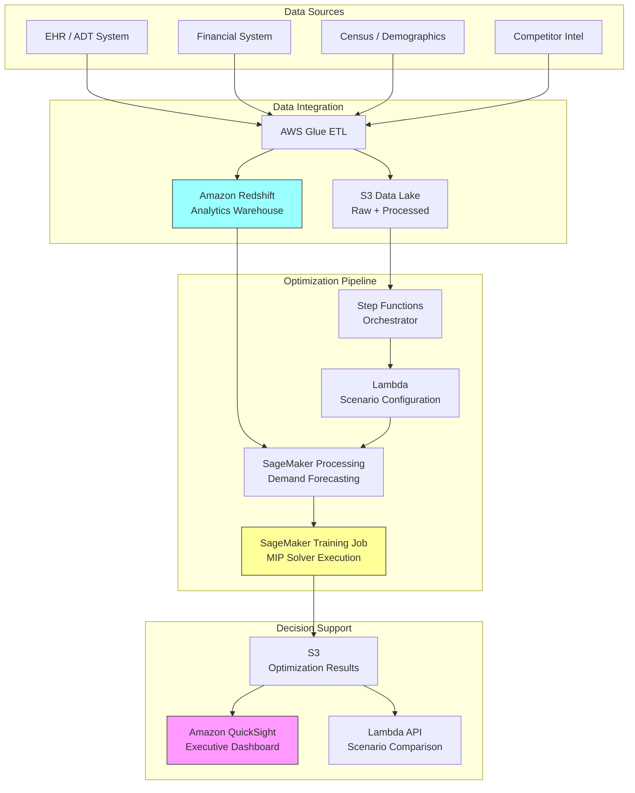

# Recipe 14.10: Health System Network Design

**Complexity:** Complex · **Phase:** Strategic Planning · **Estimated Cost:** ~$2,000–$15,000 per optimization run (compute-intensive)

---

## The Problem

A health system CEO is staring at a map with 14 hospitals, 47 ambulatory clinics, and a $400 million capital budget for the next five years. The board wants to know: Where should we build the next cancer center? Should we close the underperforming rural hospital or convert it to an urgent care? If we add cardiac surgery at the suburban campus, does that cannibalize volume from the flagship downtown, or does it capture patients currently driving to the competitor across town?

These are not questions you can answer with a spreadsheet and good intentions. They involve hundreds of interacting variables: patient travel patterns, competitor locations, demographic shifts, payer mix projections, regulatory constraints, physician recruitment pipelines, and capital depreciation schedules. Get it wrong and you've spent $200 million on a facility that never reaches volume targets. Or worse, you've closed a community hospital that was the only access point for a vulnerable population, and now you're explaining that decision to a state attorney general.

Health system network design is the problem of deciding what services to offer, where to offer them, and how much capacity to allocate at each location. It's a facility location problem, a capacity allocation problem, and a demand assignment problem all rolled into one. And it operates on a time horizon of 5 to 20 years, which means every input is uncertain.

Most health systems today make these decisions through a combination of market analysis reports, consultant recommendations, physician lobbying, and executive intuition. The results are predictably inconsistent. Some systems over-invest in competitive markets and under-invest in growth corridors. Others chase service lines with high reimbursement without considering whether they have the referral network to sustain volume. The optimization approach doesn't replace human judgment on these decisions. It structures the analysis so that judgment is applied to the right tradeoffs rather than lost in a fog of competing anecdotes.

This is one of the hardest problems in this entire book. The solution space is enormous, the constraints are politically charged, and the objective function is genuinely multi-dimensional. Let's dig in.

---

## The Technology: Facility Location and Network Optimization

### The Core Problem Class

Health system network design belongs to a family of problems in operations research called facility location problems. The classic version: given a set of potential locations and a set of demand points, choose which locations to open and how to assign demand to them, minimizing total cost (or maximizing some coverage metric) subject to capacity constraints.

The healthcare version is considerably messier than the textbook version, but the mathematical foundation is the same. You're choosing from a discrete set of options (open this facility, close that one, add this service line, expand that capacity) subject to constraints (budget, regulatory, workforce, minimum volume thresholds) while optimizing an objective (maximize access, maximize margin, minimize patient travel, some weighted combination).

### Mixed-Integer Programming (MIP)

The workhorse technique for facility location problems is mixed-integer programming. "Mixed-integer" means the model contains both continuous variables (how much capacity to allocate, what fraction of demand to serve) and integer variables (open or closed, build or don't build). The integer variables are what make the problem hard. A continuous optimization problem with linear constraints can be solved efficiently. Add integer constraints and the problem becomes NP-hard in the general case.

In practice, modern MIP solvers (CPLEX, Gurobi, HiGHS, SCIP) use branch-and-bound algorithms with sophisticated cutting planes and heuristics that can solve problems with thousands of integer variables in reasonable time. "Reasonable" here means minutes to hours, not days. The key is formulating the problem tightly: the better your formulation (fewer unnecessary variables, tighter constraint bounds), the faster the solver converges.

For network design, the typical formulation looks something like:

**Decision variables:**
- Binary: open/close each facility, offer/don't offer each service line at each location
- Integer: capacity level at each location (often discretized into tiers)
- Continuous: patient flow from each demand zone to each facility

**Objective function:**
- Maximize net revenue (volume times margin minus fixed costs)
- Or minimize total patient travel time subject to financial viability
- Or maximize population coverage within a drive-time threshold
- Usually a weighted combination of multiple objectives

**Constraints:**
- Budget: total capital expenditure cannot exceed available funds
- Capacity: patient volume at each facility cannot exceed its capacity
- Demand: all demand must be served (or explicitly modeled as "leakage" to competitors)
- Regulatory: Certificate of Need (CON) requirements in applicable states
- Minimum volume: certain service lines require minimum annual volume to maintain quality and accreditation
- Workforce: physician and nursing availability limits what you can staff
- Network integrity: certain services require supporting services (you can't offer cardiac surgery without a cardiac ICU)

### Demand Modeling

The optimization model needs a demand forecast: how many patients of each type will seek care in each geographic zone over the planning horizon? This is where the uncertainty lives.

Demand modeling for network design typically combines:
- **Demographic projections:** Population growth, aging, migration patterns by ZIP code or census tract
- **Epidemiological trends:** Disease prevalence changes (e.g., diabetes rates rising, smoking rates falling)
- **Market share modeling:** What fraction of demand in each zone does your system capture today, and how does that change with facility placement?
- **Gravity models:** Patient choice models where the probability of choosing a facility decreases with distance and increases with facility attractiveness (reputation, service breadth, wait times)

The gravity model is particularly important. Patients don't just go to the nearest hospital. They make choices based on perceived quality, physician relationships, insurance networks, and convenience. A gravity model captures this by assigning a "utility" to each facility-patient pair and computing choice probabilities. The parameters are estimated from historical utilization data.

### Scenario Analysis and Stochastic Optimization

Because the planning horizon is long (5-20 years), point estimates of demand are unreliable. The standard approach is scenario-based optimization:

1. Define a set of plausible future scenarios (high growth, low growth, competitor entry, regulatory change)
2. Solve the optimization under each scenario
3. Identify decisions that are robust across scenarios (good in most futures) versus decisions that are scenario-dependent (great in one future, terrible in another)

More sophisticated approaches use stochastic programming, where uncertainty is modeled explicitly in the optimization formulation. The solver finds a solution that optimizes expected performance across the probability-weighted scenarios. This is computationally expensive but produces solutions that are explicitly hedged against uncertainty.

### Multi-Objective Optimization

Health system network design almost never has a single objective. The CFO wants to maximize margin. The CMO wants to maximize clinical quality (which requires minimum volumes). The community benefit officer wants to maximize access for underserved populations. The board wants to minimize competitive vulnerability.

Multi-objective optimization handles this through:
- **Weighted sum:** Combine objectives into a single score with weights reflecting priorities. Simple but requires agreeing on weights upfront.
- **Pareto frontier:** Find the set of solutions where no objective can be improved without worsening another. Present the frontier to decision-makers and let them choose. More informative but harder to compute and harder to explain.
- **Constraint-based:** Optimize one objective while constraining others to acceptable levels ("maximize margin subject to no community losing access within 30 minutes").

In practice, the constraint-based approach works best for healthcare because it maps to how decisions are actually made: "We need to hit these financial targets AND maintain these access standards AND comply with these regulations."

### Solver Selection

The choice of solver matters enormously for problems at health-system scale:

- **Commercial solvers (Gurobi, CPLEX):** Fastest for large MIP problems. Gurobi is generally considered the performance leader for mixed-integer problems. Licensing costs are significant ($10K-$50K/year) but trivial relative to the capital decisions being informed.
- **Open-source solvers (HiGHS, SCIP, CBC):** HiGHS has improved dramatically and handles many practical problems well. SCIP is strong for non-linear constraints. CBC (COIN-OR) is mature but slower on large instances.
- **Metaheuristics (genetic algorithms, simulated annealing):** Useful when the problem is too large or too non-linear for exact solvers. You give up optimality guarantees but can handle more complex objective functions and constraints. Good for initial solution exploration before refining with exact methods.

For a typical health system network design problem (50-200 potential facility-service combinations, 500-2000 demand zones, 3-5 scenarios), a commercial solver will find a near-optimal solution in 10-60 minutes. An open-source solver might take 2-6 hours for the same problem. Both are acceptable for a strategic planning exercise that runs quarterly.

### The General Architecture Pattern

```
[Data Integration] → [Demand Forecasting] → [Model Formulation] → [Optimization] → [Scenario Analysis] → [Decision Support Dashboard]
```

**Data Integration:** Pull together the inputs: current facility inventory, service line volumes, financial performance, patient origin data, demographic projections, competitor intelligence, workforce availability, capital budget constraints.

**Demand Forecasting:** Project future demand by service line and geography. This is typically a separate modeling exercise (see Chapter 12 on time series forecasting) whose outputs feed the optimizer.

**Model Formulation:** Translate the business problem into mathematical constraints and objectives. This is the intellectual core of the work and requires both OR expertise and deep healthcare domain knowledge.

**Optimization:** Feed the formulated model to a solver. Run multiple scenarios. Collect solutions.

**Scenario Analysis:** Compare solutions across scenarios. Identify robust decisions versus contingent ones. Compute sensitivity of the solution to key assumptions.

**Decision Support Dashboard:** Present results to executives in a format that supports decision-making. Maps showing proposed network configurations. Financial projections under each scenario. Access impact analysis. Comparison of alternatives.

---

## The AWS Implementation

### Why These Services

**Amazon SageMaker for model development and solver execution.** Network design optimization requires significant compute for solver execution (especially multi-scenario runs) and a development environment for model formulation. SageMaker provides managed Jupyter notebooks for model development, training jobs for compute-intensive solver runs, and processing jobs for data preparation. You can install commercial solvers (Gurobi, CPLEX) on SageMaker instances or use open-source solvers (HiGHS, PuLP) directly.

**Amazon S3 for data lake and model artifacts.** The input data (patient origin files, demographic projections, financial data, competitor intelligence) and output artifacts (solution files, scenario comparisons, sensitivity analyses) all live in S3. This provides durable, versioned storage with fine-grained access control.

**AWS Glue for data integration and preparation.** Network design requires pulling data from multiple source systems (EHR, financial systems, census data, competitor databases). Glue ETL jobs handle the extraction, transformation, and loading into the analytics-ready format the optimizer needs.

**Amazon Redshift for analytical queries.** Historical utilization data, patient origin analysis, and financial performance metrics live in Redshift. The demand forecasting models and gravity model parameter estimation query against this warehouse.

**Amazon QuickSight for decision support visualization.** The output of the optimization needs to be presented to executives as interactive maps, scenario comparisons, and sensitivity charts. QuickSight connects to the optimization results in S3/Redshift and provides the dashboard layer.

**AWS Step Functions for pipeline orchestration.** The end-to-end workflow (data prep, demand forecast, model formulation, multi-scenario optimization, result aggregation, dashboard refresh) is a multi-step pipeline with dependencies. Step Functions orchestrates the sequence, handles retries, and provides visibility into pipeline status.

**AWS Lambda for lightweight processing.** Scenario configuration, result post-processing, notification triggers, and API endpoints for the dashboard use Lambda for stateless compute.

### Architecture Diagram



### Prerequisites

| Requirement | Details |
|-------------|---------|
| **AWS Services** | Amazon SageMaker, Amazon S3, AWS Glue, Amazon Redshift, Amazon QuickSight, AWS Step Functions, AWS Lambda |
| **IAM Permissions** | `sagemaker:CreateTrainingJob`, `sagemaker:CreateProcessingJob`, `s3:GetObject`, `s3:PutObject`, `glue:StartJobRun`, `redshift:GetClusterCredentials`, `states:StartExecution`, `quicksight:*` |
| **BAA** | Required if patient-level utilization data is used (it usually is for gravity model estimation). Aggregate/de-identified data for the optimizer itself may not require BAA, but the upstream data pipeline does. |
| **Encryption** | S3: SSE-KMS for all buckets; Redshift: encrypted cluster; SageMaker: KMS-encrypted volumes and network isolation; all transit over TLS |
| **VPC** | SageMaker jobs in private subnets with VPC endpoints for S3 and CloudWatch. Redshift in private subnet. No public internet access for compute resources touching patient data. |
| **CloudTrail** | Enabled for all API calls. Optimization runs are auditable (who ran what scenario with what assumptions). |
| **Solver Licensing** | If using Gurobi or CPLEX: license server or token-based licensing configured for SageMaker instances. Gurobi offers cloud licensing; CPLEX supports token servers. Budget $10K-$50K/year for enterprise solver licenses. |
| **Cost Estimate** | SageMaker ml.m5.4xlarge for solver execution: ~$0.92/hour. Typical multi-scenario run: 4-8 hours. Monthly cost (weekly runs): ~$200-$600 compute. Redshift ra3.xlplus (2 nodes): ~$1,500/month. Total infrastructure: ~$2,000-$3,000/month. |

### Ingredients

| AWS Service | Role |
|------------|------|
| **Amazon SageMaker** | Model development (notebooks), solver execution (training jobs), demand forecasting (processing jobs) |
| **Amazon S3** | Data lake for inputs, model artifacts, optimization results |
| **AWS Glue** | ETL from source systems; data quality checks; schema normalization |
| **Amazon Redshift** | Analytical warehouse for historical utilization, patient origin, financial data |
| **Amazon QuickSight** | Executive dashboards: maps, scenario comparisons, sensitivity analysis |
| **AWS Step Functions** | Pipeline orchestration across data prep, forecasting, optimization, reporting |
| **AWS Lambda** | Scenario configuration, result post-processing, API layer |
| **AWS KMS** | Encryption key management for all data at rest |
| **Amazon CloudWatch** | Monitoring solver execution time, pipeline health, cost tracking |

### Code

#### Walkthrough

**Step 1: Data integration and demand zone construction.** Before you can optimize anything, you need to define the geography. Health system network design operates on "demand zones": geographic units (typically ZIP codes or census tracts) where you can estimate current and future demand for each service line. This step pulls patient origin data from the EHR (where do current patients come from?), overlays demographic projections, and constructs the demand matrix: how many patients of each type will need care in each zone over the planning horizon. Skip this step and you're optimizing against fantasy numbers. The quality of your demand estimates is the single biggest determinant of whether the optimization output is useful or misleading.

```
FUNCTION build_demand_zones(patient_origin_data, demographic_projections, service_lines):
    // Define geographic demand zones from patient origin patterns.
    // Each zone represents a geographic area with estimable demand.
    // Typically ZIP codes or census tracts, depending on data granularity.
    
    zones = extract unique geographic units from patient_origin_data
    
    // For each zone, calculate current demand by service line.
    // "Demand" here means total utilization (your patients + competitor patients).
    // Your patient origin data shows YOUR volume; you need market share estimates
    // to infer total market demand.
    
    FOR each zone in zones:
        FOR each service_line in service_lines:
            // Current volume from your system
            your_volume = count patients from zone using service_line
            
            // Estimate total market demand using market share
            // Market share comes from claims data or state discharge databases
            estimated_market_share = lookup market share for zone, service_line
            total_demand_current = your_volume / estimated_market_share
            
            // Project forward using demographic growth rates
            // Different service lines grow at different rates
            // (e.g., joint replacement grows faster in aging populations)
            growth_rate = lookup growth rate for zone, service_line from demographic_projections
            
            FOR each year in planning_horizon:
                projected_demand[zone][service_line][year] = 
                    total_demand_current * (1 + growth_rate) ^ year
    
    RETURN projected_demand, zones
```

**Step 2: Gravity model estimation.** Patients don't go to the nearest facility. They make choices. The gravity model captures those choices by estimating how "attractive" each facility is to patients in each zone, accounting for distance, facility size, service breadth, and reputation. The parameters are estimated from historical patient flow data: where did patients actually go, and how far did they travel? This model is what allows the optimizer to predict how patient flows will shift when you open a new facility or add a service line. Without it, you're assuming patients will behave in ways they demonstrably don't.

```
FUNCTION estimate_gravity_model(patient_flows, facility_attributes, zone_attributes):
    // The gravity model predicts the probability that a patient in zone z
    // chooses facility f. The classic form:
    //
    //   P(z -> f) = attractiveness(f) * distance_decay(z, f) / 
    //               sum over all facilities g of [attractiveness(g) * distance_decay(z, g)]
    //
    // attractiveness(f) = function of bed count, service breadth, quality scores
    // distance_decay(z, f) = exp(-beta * travel_time(z, f))
    //
    // beta (distance sensitivity) varies by service line:
    //   - Primary care: high beta (patients won't travel far)
    //   - Cardiac surgery: low beta (patients will travel for specialized care)
    
    // Calculate travel time matrix: every zone to every facility
    travel_times = compute drive time from centroid of each zone to each facility
    
    // Estimate model parameters from historical patient flows
    // This is a maximum likelihood estimation problem
    // (logistic regression variant, specifically a conditional logit model)
    
    FOR each service_line:
        // Observed choices: which facility did each patient actually choose?
        observed_choices = extract patient facility choices for service_line
        
        // Estimate beta (distance sensitivity) and attractiveness weights
        // using maximum likelihood on the observed choice data
        parameters[service_line] = fit conditional logit model:
            dependent variable = facility chosen
            features = travel_time, bed_count, service_breadth, quality_score
            data = observed_choices
    
    RETURN parameters, travel_times
```

**Step 3: Model formulation.** This is the intellectual core. You're translating the business problem into mathematics. Every strategic question ("Should we build a cancer center at location X?") becomes a binary variable. Every constraint ("We can't spend more than $400M") becomes a linear inequality. Every objective ("Maximize net revenue while maintaining access") becomes a function to optimize. The formulation quality determines whether the solver produces useful answers or garbage. A poorly formulated model might be technically optimal but strategically meaningless.

```
FUNCTION formulate_network_model(zones, facilities, service_lines, parameters, constraints):
    // Create the optimization model
    model = new MixedIntegerProgram()
    
    // === DECISION VARIABLES ===
    
    // Binary: should facility f offer service line s?
    // This is the core strategic decision.
    FOR each facility f, service_line s:
        offer[f][s] = model.add_binary_variable("offer_{f}_{s}")
    
    // Binary: should we open/expand facility f? (for new or expanded facilities)
    FOR each candidate_facility f:
        open[f] = model.add_binary_variable("open_{f}")
    
    // Integer: capacity tier at facility f for service line s
    // (e.g., 0 = none, 1 = small, 2 = medium, 3 = large)
    FOR each facility f, service_line s:
        capacity_tier[f][s] = model.add_integer_variable("cap_{f}_{s}", min=0, max=3)
    
    // Continuous: patient flow from zone z to facility f for service line s
    FOR each zone z, facility f, service_line s:
        flow[z][f][s] = model.add_continuous_variable("flow_{z}_{f}_{s}", min=0)
    
    // === OBJECTIVE FUNCTION ===
    
    // Maximize: weighted combination of net revenue and access coverage
    net_revenue = SUM over f, s of:
        (revenue_per_case[s] * total_flow_to[f][s]) - fixed_cost[f][s] * offer[f][s]
    
    access_coverage = SUM over z, s of:
        (flow[z][nearest_facility(z,s)][s] / demand[z][s])  // fraction served within threshold
    
    model.maximize(weight_financial * net_revenue + weight_access * access_coverage)
    
    // === CONSTRAINTS ===
    
    // Budget constraint: total capital cannot exceed available funds
    model.add_constraint(
        SUM over f of (capital_cost[f] * open[f]) <= total_budget
    )
    
    // Capacity constraint: volume cannot exceed capacity at any facility
    FOR each facility f, service_line s:
        model.add_constraint(
            SUM over z of flow[z][f][s] <= capacity[capacity_tier[f][s]]
        )
    
    // Demand satisfaction: all demand must be assigned somewhere
    // (including "leakage" to competitors, modeled as a dummy facility)
    FOR each zone z, service_line s:
        model.add_constraint(
            SUM over f of flow[z][f][s] == demand[z][s]
        )
    
    // Flow consistency with gravity model:
    // Patient flows must be consistent with choice probabilities
    // (This links the optimization to realistic patient behavior)
    FOR each zone z, facility f, service_line s:
        model.add_constraint(
            flow[z][f][s] <= demand[z][s] * choice_probability(z, f, s, parameters)
        )
    
    // Service line dependencies: can't offer cardiac surgery without cardiac ICU
    FOR each (service_a, requires_service_b) in dependency_rules:
        FOR each facility f:
            model.add_constraint(offer[f][service_a] <= offer[f][requires_service_b])
    
    // Minimum volume thresholds: if you offer a service, you must hit minimum volume
    // (This prevents the optimizer from spreading volume too thin)
    FOR each facility f, service_line s:
        model.add_constraint(
            SUM over z of flow[z][f][s] >= minimum_volume[s] * offer[f][s]
        )
    
    // Certificate of Need (CON) constraints: some states require regulatory approval
    // for new services or capacity expansions
    FOR each (facility, service) in con_required_list:
        model.add_constraint(offer[facility][service] <= con_approved[facility][service])
    
    // Workforce constraints: can't staff what you can't recruit
    FOR each facility f, service_line s:
        model.add_constraint(
            required_physicians[s] * offer[f][s] <= available_physicians[f][s]
        )
    
    RETURN model
```

**Step 4: Multi-scenario optimization.** No single demand forecast is reliable over a 10-year horizon. This step runs the optimization under multiple plausible futures and identifies which decisions are robust (good in most scenarios) versus which are contingent (great in one scenario, bad in another). Executives need to know: "Building the cancer center is a good idea regardless of growth assumptions. But the rural hospital conversion only makes sense if population decline continues." That's the kind of insight scenario analysis provides.

```
FUNCTION run_scenario_analysis(base_model, scenarios):
    // Each scenario modifies demand projections, growth rates, 
    // competitive assumptions, or regulatory environment.
    
    results = empty map
    
    FOR each scenario in scenarios:
        // Clone the base model and apply scenario-specific modifications
        scenario_model = copy(base_model)
        
        // Adjust demand based on scenario assumptions
        // e.g., "high growth" scenario increases demand projections by 20%
        // e.g., "competitor entry" scenario reduces market share in affected zones
        apply_scenario_adjustments(scenario_model, scenario.demand_multipliers)
        apply_scenario_adjustments(scenario_model, scenario.market_share_changes)
        
        // Solve the modified model
        solution = solve(scenario_model, 
                        solver = "gurobi",  // or "highs" for open-source
                        time_limit = 3600,  // 1 hour max per scenario
                        mip_gap = 0.02)     // accept solutions within 2% of optimal
        
        results[scenario.name] = {
            objective_value: solution.objective,
            facility_decisions: extract open/close decisions from solution,
            service_line_decisions: extract offer decisions from solution,
            patient_flows: extract flow variables from solution,
            financial_projections: compute revenue/cost from solution,
            access_metrics: compute coverage metrics from solution
        }
    
    // Identify robust decisions: same in all (or most) scenarios
    robust_decisions = find decisions that appear in ALL scenario solutions
    contingent_decisions = find decisions that differ across scenarios
    
    RETURN results, robust_decisions, contingent_decisions
```

**Step 5: Sensitivity analysis and result presentation.** The optimization output is a set of recommended decisions. But executives don't just want "the answer." They want to understand how sensitive that answer is to key assumptions. If the cancer center recommendation flips when you change the growth rate by 5%, that's a fragile recommendation. If it holds across a wide range of assumptions, that's a robust one. This step computes sensitivity metrics and packages everything for the decision support dashboard.

```
FUNCTION compute_sensitivity_and_present(results, key_parameters):
    // For each key assumption, vary it and see if the optimal solution changes
    
    sensitivity_report = empty map
    
    FOR each parameter in key_parameters:
        // Vary the parameter across a range (e.g., +/- 20% from base case)
        FOR each variation in [0.8, 0.9, 1.0, 1.1, 1.2] * parameter.base_value:
            modified_solution = re-solve model with parameter = variation
            
            // Record whether key decisions changed
            sensitivity_report[parameter.name][variation] = {
                decisions_changed: compare to base solution,
                objective_impact: modified_solution.objective - base_solution.objective
            }
    
    // Package results for dashboard
    dashboard_output = {
        recommended_network: base solution facility and service decisions,
        scenario_comparison: side-by-side financial and access metrics,
        robust_decisions: decisions stable across all scenarios,
        contingent_decisions: decisions that depend on assumptions,
        sensitivity_charts: parameter sensitivity for key decisions,
        access_maps: geographic coverage maps for each scenario,
        financial_summary: NPV, IRR, payback period for capital investments,
        implementation_timeline: phased rollout based on dependencies
    }
    
    // Write results to S3 for QuickSight consumption
    write dashboard_output to S3 as structured JSON/Parquet
    
    // Trigger QuickSight dataset refresh
    trigger QuickSight SPICE refresh for network design dataset
    
    RETURN dashboard_output
```

> **Curious how this looks in Python?** The pseudocode above covers the concepts. If you'd like to see sample Python code that demonstrates these patterns using boto3 and PuLP/Gurobi, check out the [Python Example](chapter14.10-python-example). It walks through each step with inline comments and notes on what you'd need to change for a real deployment.

### Expected Results

**Sample output for a mid-size health system (8 hospitals, 30 clinics, 5-year horizon):**

```json
{
  "optimization_run_id": "net-design-2026-Q2-run-004",
  "solve_time_seconds": 2847,
  "optimality_gap": 0.018,
  "scenarios_evaluated": 5,
  "recommended_actions": {
    "robust_decisions": [
      {
        "action": "ADD_SERVICE_LINE",
        "facility": "Suburban Campus East",
        "service_line": "Interventional Cardiology",
        "rationale": "Captures 2,400 annual cases currently leaking to competitor. Positive NPV in all scenarios.",
        "capital_required": 45000000,
        "projected_annual_volume": 2400,
        "projected_annual_margin": 12000000
      },
      {
        "action": "EXPAND_CAPACITY",
        "facility": "Main Campus",
        "service_line": "Orthopedics",
        "rationale": "Current utilization at 94%. Demand growing 6% annually. Capacity constraint binding in all scenarios.",
        "capital_required": 18000000,
        "projected_additional_volume": 800,
        "projected_annual_margin": 4800000
      }
    ],
    "contingent_decisions": [
      {
        "action": "CONVERT_FACILITY",
        "facility": "Rural Hospital North",
        "convert_to": "Urgent Care + Outpatient Surgery",
        "condition": "Only optimal if population decline exceeds 1.5% annually",
        "scenarios_favoring": ["low_growth", "population_decline"],
        "scenarios_opposing": ["base_case", "high_growth"]
      }
    ]
  },
  "access_impact": {
    "population_within_30min_primary_care": 0.96,
    "population_within_60min_tertiary_care": 0.89,
    "underserved_zones_improved": 7
  },
  "financial_summary": {
    "total_capital_required": 187000000,
    "projected_5yr_npv": 94000000,
    "payback_period_years": 4.2
  }
}
```

**Performance benchmarks:**

| Metric | Typical Value |
|--------|---------------|
| Model size (variables) | 50,000–500,000 |
| Model size (constraints) | 100,000–1,000,000 |
| Solve time (commercial solver) | 15–90 minutes per scenario |
| Solve time (open-source solver) | 2–8 hours per scenario |
| Optimality gap achieved | 1–3% (acceptable for strategic decisions) |
| Scenario analysis (5 scenarios) | 2–8 hours total |
| Full pipeline (data prep through dashboard) | 12–24 hours |

**Where it struggles:** Highly non-linear patient choice models (the gravity model linearization introduces approximation error). Markets with rapid competitive dynamics (a competitor's decision to build changes your optimal solution, creating a game-theoretic situation the MIP doesn't capture). Very long planning horizons (20+ years) where demand uncertainty dominates the signal. And politically charged decisions where the "optimal" answer is organizationally unacceptable.

---

## Why This Isn't Production-Ready

The pseudocode demonstrates the optimization pattern. Deploying this for actual capital planning decisions requires addressing several gaps:

**Data quality and completeness.** The model is only as good as its inputs. Patient origin data from your EHR captures your patients but not the total market. State discharge databases (HCUP, state-specific) provide market-level data but lag by 1-2 years. Competitor capacity data is often estimated, not observed. Garbage in, garbage out applies with particular force here because the decisions are irreversible and capital-intensive.

**Model validation.** Before trusting the optimizer's recommendations, you need to validate that the gravity model accurately predicts current patient flows. If the model can't reproduce today's utilization patterns, it has no business predicting tomorrow's. Backtesting against historical facility openings/closings is the gold standard.

**Stakeholder alignment.** The optimization produces a mathematically optimal network configuration. The board produces a politically feasible one. The gap between these is where the real work happens. Build the model to support exploration ("what if we constrain the rural hospital to stay open?") rather than to dictate answers.

**Regulatory integration.** Certificate of Need (CON) processes in 35+ states add months to years of lead time for new services. The model should incorporate CON feasibility as a constraint, not discover it after recommending an infeasible action.

---

## The Honest Take

This is the most complex recipe in this chapter, and possibly in the entire book. The mathematical formulation is the easy part. The hard parts are:

1. **Getting the data right.** Patient origin analysis requires linking claims, encounters, and geographic data across systems that were never designed to talk to each other. Budget 3-6 months just for data preparation.

2. **Calibrating the gravity model.** If your choice model doesn't match observed behavior, the optimizer will confidently recommend the wrong network configuration. Spend serious time on model validation before trusting the outputs.

3. **Managing the politics.** Every facility has a constituency. Every service line has a physician champion. The optimizer doesn't know about the board member whose family donated the land for the rural hospital. Build the tool to support "what-if" exploration, not to deliver ultimatums.

4. **Dealing with uncertainty honestly.** A 10-year demand forecast is a guess dressed up in statistics. The scenario analysis approach helps, but executives need to understand that "optimal" means "best given these assumptions," not "guaranteed to work."

The part that surprised me most: the minimum volume constraints are often the binding ones. The optimizer wants to spread services across many locations for access, but quality and accreditation requirements force concentration. This tension between access and quality is the fundamental tradeoff in network design, and no amount of optimization eliminates it. It just makes it visible.

One more thing: don't try to solve the whole problem at once on your first iteration. Start with a single service line (e.g., "where should we put our next orthopedic surgery center?") and build confidence in the approach before tackling the full multi-service network design. The single-service version is a useful deliverable on its own and teaches you where your data gaps are.

---

## Variations and Extensions

**Dynamic network design with staged investments.** Instead of a single-period "build the optimal network" formulation, model the problem as a multi-period investment sequence. In year 1, build X. In year 3, expand Y. In year 5, convert Z. This captures the reality that capital is deployed over time and early decisions constrain later ones. The formulation adds time-indexed variables and linking constraints across periods.

**Competitive response modeling.** The basic model treats competitor behavior as fixed. A game-theoretic extension models competitor responses: if you build a cancer center, the competitor might respond by expanding their own. This turns the optimization into a Stackelberg game (you move first, they respond optimally). Significantly harder to solve but more realistic in competitive markets.

**Equity-constrained optimization.** Add explicit equity constraints: no census tract with a majority-minority population can have access worse than the system average. Or: the Gini coefficient of travel times across income quintiles must be below a threshold. These constraints formalize community benefit commitments and can be reported to regulators and community advisory boards.

---

## Related Recipes

- **Recipe 12.5 (Hospital Census Forecasting):** Provides the demand forecasting methodology that feeds the network design optimizer
- **Recipe 14.1 (Appointment Slot Optimization):** Simpler facility-level optimization that can validate your optimization infrastructure before tackling network-scale problems
- **Recipe 14.4 (Nurse Staffing Optimization):** Workforce constraints in network design depend on staffing models; this recipe provides the staffing optimization that informs workforce availability assumptions
- **Recipe 14.6 (Patient Flow / Bed Assignment):** Operational-level optimization that runs within the network the strategic model designs
- **Recipe 7.6 (Rising Risk Identification):** Population health risk models inform demand projections for high-acuity services

---

## Additional Resources

**AWS Documentation:**
- [Amazon SageMaker Developer Guide](https://docs.aws.amazon.com/sagemaker/latest/dg/whatis.html)
- [Amazon SageMaker Training Jobs](https://docs.aws.amazon.com/sagemaker/latest/dg/how-it-works-training.html)
- [AWS Step Functions Developer Guide](https://docs.aws.amazon.com/step-functions/latest/dg/welcome.html)
- [Amazon QuickSight User Guide](https://docs.aws.amazon.com/quicksight/latest/user/welcome.html)
- [AWS Glue Developer Guide](https://docs.aws.amazon.com/glue/latest/dg/what-is-glue.html)
- [AWS HIPAA Eligible Services](https://aws.amazon.com/compliance/hipaa-eligible-services-reference/)

**Optimization Resources:**
- [Gurobi Optimization Documentation](https://www.gurobi.com/documentation/)
- [HiGHS Solver (Open Source)](https://highs.dev/)
- [PuLP: Python Linear Programming Library](https://coin-or.github.io/pulp/)

<!-- TODO: Verify these AWS sample repos exist and are current -->

**AWS Solutions and Blogs:**
- [Optimization with Amazon SageMaker](https://aws.amazon.com/sagemaker/)
- [AWS Healthcare and Life Sciences Solutions](https://aws.amazon.com/health/)

---

## Estimated Implementation Time

| Phase | Duration |
|-------|----------|
| **Basic** (single service line, single scenario, open-source solver) | 8–12 weeks |
| **Production-ready** (multi-service, multi-scenario, validated gravity model, executive dashboard) | 6–9 months |
| **With variations** (multi-period staging, competitive response, equity constraints) | 12–18 months |

---

## Tags

`optimization` · `facility-location` · `network-design` · `mixed-integer-programming` · `strategic-planning` · `capital-allocation` · `demand-forecasting` · `gravity-model` · `scenario-analysis` · `sagemaker` · `step-functions` · `quicksight` · `complex` · `hipaa`

---

*← [Recipe 14.9: Chemotherapy Scheduling](chapter14.09-chemotherapy-scheduling) · [Chapter 14 Index](chapter14-index) · [Next: Chapter 15 →](chapter15-preface)*
