# Recipe 14.10: Health System Network Design

**Complexity:** Complex · **Phase:** Strategic Planning · **Estimated Cost:** ~$5,000–25,000/month for ongoing optimization platform; individual studies $50,000–200,000 in consulting-equivalent effort

---

## The Problem

A regional health system with 12 hospitals, 45 ambulatory clinics, and 3 freestanding emergency departments is trying to answer a question that sounds simple: where should we put the new cancer center?

The CFO wants it near the affluent suburbs (better payer mix). The CMO wants it near the academic medical center (physician recruitment, clinical trials). The COO wants it co-located with the existing surgical hospital (shared infrastructure). Community advocates want it in the underserved corridor on the south side (access equity). The board wants all of these things simultaneously, and they want a data-driven answer by next quarter.

This is health system network design. It's the problem of deciding what services go where, how much capacity each location needs, and how patients will flow across the network. It's one of the highest-stakes optimization problems in healthcare because the decisions are expensive (a new facility is $200M+), slow to reverse (you can't un-build a hospital), and have decade-long consequences for community health outcomes.

Most health systems today make these decisions through a combination of market analysis reports (purchased from consulting firms at $500K a pop), executive intuition, political negotiation, and competitive reaction ("they're building there, so we need to build here"). The analysis is often static: a point-in-time snapshot of demographics, drive times, and market share. It doesn't model how patients will actually redistribute when you change the network. It doesn't account for competitor responses. It doesn't quantify the tradeoffs between access, quality, cost, and growth.

The result is predictable. Health systems over-build in competitive markets (three cardiac surgery programs within 10 miles, none at full volume) and under-invest in growing communities. They duplicate expensive service lines across facilities instead of concentrating volume where outcomes are best. They close rural access points to save money without modeling the downstream effects on emergency department utilization 30 miles away.

Network design optimization doesn't eliminate the politics. But it gives you a quantitative framework for understanding what you're trading off. "If we put the cancer center downtown, we gain 12% market share in the south corridor but lose 4% in the northwest suburbs. If we split into two smaller sites, capital cost increases 35% but drive-time access improves for 80,000 additional residents." That's the kind of analysis that turns a boardroom argument into a structured decision.

Let's talk about how to build it.

---

## The Technology: Facility Location and Network Optimization

### The Classic Facility Location Problem

Network design in healthcare is a variant of the facility location problem, one of the oldest and most studied problems in operations research. The basic version goes like this: you have a set of potential locations where you could place facilities, a set of demand points (where patients live), and you want to choose which locations to open and how to assign demand to facilities to minimize total cost (or maximize coverage, or minimize travel time).

The simplest formulation is the p-median problem: place exactly p facilities to minimize the total weighted distance between demand points and their nearest facility. It's elegant, well-understood, and completely inadequate for real healthcare network design. But it's a useful starting point for understanding the structure.

Why inadequate? Because healthcare networks have characteristics that blow up the simple model:

**Capacity constraints.** A hospital can't serve unlimited demand. Each facility has a maximum throughput determined by beds, ORs, staff, and physical space. The optimization must respect these limits, which means some patients might not go to their nearest facility.

**Service line differentiation.** Not every facility offers every service. You might have cardiac surgery at 3 of your 12 hospitals, labor and delivery at 6, and primary care at all 45 clinics. The network design problem is really a collection of coupled sub-problems: one per service line, linked by shared infrastructure and patient flow patterns.

**Quality-volume relationships.** For complex procedures (cardiac surgery, cancer surgery, transplant), higher volume correlates with better outcomes. This creates a tension: concentrating volume improves quality but reduces geographic access. The optimization needs to model this tradeoff explicitly.

**Patient choice.** Patients don't always go to the nearest facility. They choose based on reputation, physician relationships, wait times, insurance networks, and personal preference. A gravity model or discrete choice model is needed to predict patient flow realistically.

**Competitive dynamics.** You're not optimizing in a vacuum. Competitors are making their own network decisions. If you close a service line, competitors may absorb that volume. If you open a new facility, competitors may respond. Game-theoretic considerations matter for strategic decisions.

**Regulatory constraints.** Many states have Certificate of Need (CON) laws that require regulatory approval before adding beds, building facilities, or launching certain service lines. These constraints are binary (approved or not) and often political. The optimization must account for what's actually achievable, not just what's mathematically optimal.

### Demand Modeling

Before you can optimize the network, you need to model demand. Where do patients come from? What services do they need? How will demand change over time?

**Current demand estimation.** Start with claims data or encounter data. For each service line, map patient origins (ZIP code or census tract) to the facilities they used. This gives you the current flow pattern. Aggregate by geography to get demand density maps.

**Demand forecasting.** Project forward 5-10 years using:
- Population growth projections (census data, housing permits, zoning changes)
- Age-cohort shifts (aging populations need more cardiac, oncology, orthopedic services)
- Disease prevalence trends (obesity rates driving diabetes, joint replacement demand)
- Technology shifts (procedures moving from inpatient to outpatient, reducing bed demand but increasing ambulatory demand)

**Market share modeling.** Not all demand in your service area comes to your system. Market share varies by service line, geography, and payer. A gravity model estimates the probability that a patient at location i chooses facility j as a function of distance, facility attractiveness (size, reputation, service breadth), and patient characteristics. The Huff model is the classic approach:

```
P(patient_i → facility_j) = Attractiveness_j / Distance_ij^β
                             ÷ Σ_k (Attractiveness_k / Distance_ik^β)
```

Where β is the distance decay parameter (how sensitive patients are to travel time). This parameter varies dramatically by service line: patients will drive 2 hours for a cancer center but won't drive 20 minutes past a closer urgent care.

### The Optimization Formulation

A realistic health system network design model has this structure:

**Decision variables:**
- Which facilities to open/close/expand (binary or integer)
- Capacity allocation per facility per service line (continuous or integer)
- Patient flow assignments (what fraction of demand from zone i goes to facility j for service line s)

**Objective function (typically multi-objective):**
- Minimize total system cost (capital + operating)
- Maximize geographic access (population within X-minute drive time)
- Maximize market share capture (revenue)
- Maximize clinical quality (volume thresholds met)
- Maximize equity (reduce disparities in access across demographics)

In practice, you either combine these into a weighted sum or solve iteratively: optimize cost subject to minimum access constraints, then check if quality thresholds are met, then evaluate equity implications.

**Constraints:**
- Capacity limits per facility per service line
- Budget constraints (total capital available)
- Minimum volume thresholds (don't offer cardiac surgery unless you can sustain 200+ cases/year)
- Regulatory constraints (CON requirements, zoning)
- Workforce availability (can you actually recruit surgeons to that location?)
- Network connectivity (patients referred from primary care to specialists within the same system)
- Existing commitments (long-term leases, community benefit obligations)

### Solver Selection for Network Design

This is a Mixed-Integer Programming (MIP) problem at its core. The facility open/close decisions are binary. The capacity allocations and patient flows are continuous (or can be). The constraints are mostly linear.

**For strategic planning (annual/quarterly):** Use a commercial MIP solver (Gurobi, CPLEX) or open-source alternatives (HiGHS, SCIP). Problem sizes for a typical health system (50-100 potential locations, 10-20 service lines, 500-1000 demand zones) solve in minutes to hours. You're not solving this in real-time; you're running scenarios.

**For scenario analysis:** The real value isn't in finding "the" optimal network. It's in comparing scenarios. What if we close Hospital B? What if we add 50 beds at Hospital C? What if a competitor opens a new facility at location X? Each scenario is a separate optimization run with modified parameters. You want a platform that makes it easy to define, run, and compare scenarios.

**For uncertainty handling:** Demand forecasts are uncertain. Population growth might be faster or slower than projected. A competitor might or might not build. Stochastic programming or robust optimization handles this by optimizing across multiple scenarios simultaneously, finding solutions that perform well under a range of futures rather than being optimal for one specific forecast.

**Metaheuristics for very large problems:** If your network is truly massive (national health system, hundreds of facilities, thousands of demand zones), exact MIP solvers may struggle. Genetic algorithms, simulated annealing, or large neighborhood search can find good solutions for these larger instances. You lose optimality guarantees but gain tractability.

### The Scenario Planning Workflow

Network design optimization is not a one-shot analysis. It's an ongoing capability. The typical workflow:

1. **Baseline model.** Build a model of the current network: facilities, capacities, service lines, current patient flows, costs. Validate against actual utilization data.

2. **Demand scenarios.** Define 3-5 demand futures (base case, high growth, low growth, demographic shift, competitor entry).

3. **Strategy options.** Define candidate network changes: new facilities, expansions, closures, service line additions/removals.

4. **Optimization runs.** For each combination of demand scenario and strategy option, solve the optimization. Record key metrics: cost, access, market share, quality indicators.

5. **Pareto analysis.** Identify solutions that are not dominated (no other solution is better on all objectives simultaneously). Present the efficient frontier to decision-makers.

6. **Sensitivity analysis.** Which assumptions matter most? If the answer changes dramatically when you adjust population growth by 10%, that's a key uncertainty to monitor.

7. **Decision and monitoring.** Leadership selects a strategy. Implement. Monitor actual demand against projections. Re-run the model annually or when significant changes occur.

---

## General Architecture Pattern

```
[Data Layer]
  ├── Demographics & Population Projections
  ├── Claims / Encounter Data (patient origins, service utilization)
  ├── Facility Data (locations, capacities, costs, service lines)
  ├── Competitor Intelligence (locations, services, market share)
  └── Geographic Data (drive times, transit access, ZIP boundaries)

[Demand Modeling Layer]
  ├── Current Demand Estimation (by zone, service line)
  ├── Demand Forecasting (5-10 year projections)
  └── Patient Choice Model (gravity/discrete choice)

[Optimization Engine]
  ├── Model Builder (formulate MIP from parameters)
  ├── Solver Interface (submit to MIP solver)
  ├── Scenario Manager (define, queue, compare scenarios)
  └── Solution Post-Processor (extract metrics, generate reports)

[Presentation Layer]
  ├── Geographic Visualization (maps with facility locations, catchment areas)
  ├── Scenario Comparison Dashboard
  ├── Sensitivity Analysis Reports
  └── Executive Summary Generator
```

The data layer is the hardest part. Not because the data is complex (it is), but because it lives in 15 different systems and nobody agrees on the source of truth for "how many patients from ZIP 30301 used our cardiac surgery program last year." Getting clean, reconciled data is 60% of the project timeline.

---

## Why These AWS Services

| Concept | AWS Service | Why |
|---------|-------------|-----|
| Data lake for claims, demographics, facility data | Amazon S3 + AWS Glue | Centralize heterogeneous data sources; Glue handles ETL from multiple formats |
| Demand modeling and forecasting | Amazon SageMaker | Train patient choice models, run demand forecasts at scale |
| Optimization engine | AWS Batch + custom solver container | Run Gurobi/HiGHS in containers; Batch handles job scheduling for scenario runs |
| Drive time computation | Amazon Location Service | Calculate drive-time isochrones and distance matrices |
| Geographic visualization | Amazon QuickSight + custom maps | Interactive dashboards with geographic overlays |
| Scenario management and results storage | Amazon DynamoDB + S3 | Store scenario definitions, optimization results, comparison metrics |
| Orchestration | AWS Step Functions | Coordinate multi-step workflow: data prep → model build → solve → post-process |
| Notification on completion | Amazon SNS | Alert analysts when long-running scenario batches complete |

The optimization solver itself is the one piece that's genuinely vendor-specific. Gurobi and CPLEX are commercial solvers that require licenses. HiGHS is open-source and increasingly competitive for MIP problems of this size. You'll run the solver in a container on AWS Batch (for large scenario batches) or on a SageMaker Processing job (for interactive analysis).

---

## Architecture Diagram

```mermaid
flowchart TD
    subgraph Data Sources
        A[Claims/Encounter Data] --> E[AWS Glue ETL]
        B[Census/Demographics] --> E
        C[Facility Master Data] --> E
        D[Competitor Intelligence] --> E
        G[Geographic/Drive Time Data] --> E
    end

    E --> F[S3 Data Lake]

    subgraph Demand Modeling
        F --> H[SageMaker: Patient Choice Model Training]
        F --> I[SageMaker: Demand Forecasting]
        H --> J[S3: Model Artifacts]
        I --> J
    end

    subgraph Optimization Platform
        J --> K[Step Functions: Scenario Orchestrator]
        F --> K
        K --> L[Lambda: Model Builder]
        L --> M[AWS Batch: Solver Execution]
        M --> N[S3: Solution Files]
        N --> O[Lambda: Post-Processor]
        O --> P[DynamoDB: Scenario Results]
    end

    subgraph Presentation
        P --> Q[QuickSight: Scenario Dashboard]
        P --> R[Custom Web App: Map Visualization]
        N --> R
    end

    M -.-> S[SNS: Completion Notification]
```



---

## Prerequisites

| Requirement | Details |
|-------------|---------|
| AWS Services | S3, Glue, SageMaker, Batch, Step Functions, Lambda, DynamoDB, QuickSight, Location Service, SNS |
| IAM Permissions | s3:*, glue:*, sagemaker:*, batch:SubmitJob, batch:DescribeJobs, states:*, lambda:*, dynamodb:*, quicksight:*, geo:*, sns:Publish |
| BAA | Required. Claims data contains PHI (patient ZIP codes, service utilization). All services must be covered under BAA. |
| Encryption | S3 SSE-KMS for data at rest, TLS 1.2+ in transit, DynamoDB encryption at rest |
| VPC | Recommended for Batch compute (solver containers). VPC endpoints for S3, DynamoDB. |
| CloudTrail | Audit logging for all data access. Scenario results may inform capital decisions subject to board governance. |
| Solver License | Gurobi (commercial, ~$12K/year academic, ~$30K+ commercial) or HiGHS (open-source, free) |
| Sample Data | CMS public use files for demand estimation. Synthetic facility data for testing. Never use real PHI in development. |
| Cost Estimate | ~$2,000-8,000/month for ongoing platform (storage, compute for scenario runs). Individual large scenario batches: $50-200 per run depending on problem size and solver time. |

---

## Ingredients

| AWS Service | Role in This Recipe |
|-------------|-------------------|
| Amazon S3 | Data lake for all input data, model artifacts, and solution files |
| AWS Glue | ETL pipelines to ingest and transform claims, demographics, facility data |
| Amazon SageMaker | Train demand forecasting models and patient choice models |
| AWS Batch | Execute optimization solver containers (Gurobi/HiGHS) for scenario runs |
| AWS Step Functions | Orchestrate end-to-end workflow from data prep through solution delivery |
| AWS Lambda | Model builder (generate solver input files), post-processor (extract metrics) |
| Amazon DynamoDB | Store scenario definitions, run metadata, and comparison results |
| Amazon Location Service | Compute drive-time matrices between demand zones and facility locations |
| Amazon QuickSight | Interactive dashboards for scenario comparison and geographic visualization |
| Amazon SNS | Notify analysts when scenario batch runs complete |

---

## Code: Pseudocode Walkthrough

### Step 1: Build the Demand Model

Before optimizing anything, we need to know where patients are and what they need.

This step takes raw claims data and produces a demand matrix: for each geographic zone and service line, how many patients per year need that service? It also trains a patient choice model that predicts how patients will distribute across facilities based on distance and facility characteristics.

If you skip this step, your optimization is solving a fantasy problem. The demand model is the foundation everything else rests on.

```
// Load and aggregate claims data by patient origin and service line
demand_data = load_claims_by_zip_and_service_line(
    source="s3://network-design/claims/",
    years=[2022, 2023, 2024, 2025]
)

// Compute current demand per zone per service line
current_demand = aggregate_demand(
    data=demand_data,
    geographic_unit="census_tract",
    service_lines=["primary_care", "cardiology", "oncology", "orthopedics",
                   "obstetrics", "emergency", "behavioral_health"]
)

// Train patient choice model (gravity model variant)
// This predicts: given a patient at location i, what's the probability
// they choose facility j for service line s?
choice_model = train_patient_choice_model(
    historical_flows=demand_data,
    facility_features=["bed_count", "service_breadth", "reputation_score"],
    distance_metric="drive_time_minutes",
    model_type="multinomial_logit"
)

// Forecast demand 5 and 10 years out
future_demand = forecast_demand(
    current=current_demand,
    population_projections=load_census_projections(),
    age_cohort_shifts=load_demographic_trends(),
    horizon_years=[5, 10]
)

// Store all outputs
save_to_s3(current_demand, "s3://network-design/models/current_demand.parquet")
save_to_s3(choice_model, "s3://network-design/models/choice_model.pkl")
save_to_s3(future_demand, "s3://network-design/models/future_demand.parquet")
```

### Step 2: Compute the Distance Matrix

The optimization needs to know how far every demand zone is from every potential facility location. Drive time is the standard metric in healthcare (not straight-line distance, which is meaningless in cities with rivers, highways, and traffic).

This is computationally expensive for large networks. A system with 1,000 demand zones and 100 potential facility locations needs 100,000 drive-time calculations. Precompute and cache.

```
// Define demand zone centroids and facility locations
demand_zones = load_zone_centroids("s3://network-design/geo/zone_centroids.csv")
facility_locations = load_facility_locations("s3://network-design/facilities/locations.csv")
// Include both existing facilities AND candidate new locations

// Compute drive-time matrix using routing service
// Result: matrix[i][j] = drive time in minutes from zone i to facility j
drive_time_matrix = compute_drive_times(
    origins=demand_zones,        // ~1000 zones
    destinations=facility_locations,  // ~100 locations
    mode="driving",
    departure_time="tuesday_8am"  // Representative commute time
)

// Also compute drive-time isochrones for access analysis
// "What population lives within 30 minutes of each facility?"
for each facility in facility_locations:
    isochrone = compute_isochrone(
        origin=facility.coordinates,
        time_thresholds=[15, 30, 45, 60],  // minutes
        mode="driving"
    )
    save_isochrone(facility.id, isochrone)

save_to_s3(drive_time_matrix, "s3://network-design/geo/drive_time_matrix.parquet")
```

### Step 3: Formulate the Optimization Model

This is where the math lives. We translate the business problem into a mathematical program that a solver can handle.

The formulation below is a multi-objective facility location model with capacity constraints, service line differentiation, and patient choice behavior. It's a Mixed-Integer Program (MIP) because some decisions are binary (open/close a facility) and some are continuous (patient flow fractions).

```
// Define the optimization model
model = create_optimization_model()

// SETS
zones = list of demand zones (i = 1..I)
facilities = list of potential facility locations (j = 1..J)
service_lines = list of service lines (s = 1..S)
scenarios = list of demand scenarios (d = 1..D)

// PARAMETERS (loaded from previous steps)
demand[i][s][d] = patient demand from zone i for service s in scenario d
distance[i][j] = drive time from zone i to facility j
capacity_max[j][s] = maximum capacity of facility j for service s
fixed_cost[j] = annual fixed cost of operating facility j
variable_cost[j][s] = per-patient cost at facility j for service s
capital_cost[j] = one-time capital cost to open/expand facility j
min_volume[s] = minimum annual volume for quality threshold in service s
budget = total capital budget available

// DECISION VARIABLES
open[j] = binary, 1 if facility j is open
flow[i][j][s] = fraction of demand from zone i assigned to facility j for service s
expand[j] = binary, 1 if facility j receives capacity expansion

// OBJECTIVE: Minimize weighted combination of cost and access
minimize:
    weight_cost * (sum over j: fixed_cost[j] * open[j]
                   + sum over i,j,s: variable_cost[j][s] * demand[i][s] * flow[i][j][s])
    + weight_access * (sum over i,j,s: distance[i][j] * demand[i][s] * flow[i][j][s])
    - weight_volume * (sum over j,s: volume_bonus[j][s])  // reward meeting quality thresholds

// CONSTRAINTS
// 1. All demand must be served
for each zone i, service_line s:
    sum over j: flow[i][j][s] = 1.0

// 2. Can only send patients to open facilities
for each i, j, s:
    flow[i][j][s] <= open[j]

// 3. Capacity constraints
for each facility j, service_line s:
    sum over i: demand[i][s] * flow[i][j][s] <= capacity_max[j][s] * open[j]

// 4. Budget constraint
sum over j: capital_cost[j] * expand[j] <= budget

// 5. Minimum volume for quality (soft constraint with penalty)
for each facility j, service_line s where open[j] = 1:
    sum over i: demand[i][s] * flow[i][j][s] >= min_volume[s]
    // (In practice, this is a soft constraint: penalize but don't forbid)

// 6. Access constraint: X% of population within Y minutes
for each service_line s:
    population_within_threshold(open, distance, threshold=30min) >= 0.90 * total_population

// Solve
solution = solver.optimize(model, time_limit=3600, gap_tolerance=0.01)
```

### Step 4: Run Scenario Batches

The real power of network design optimization is scenario comparison. You don't run one optimization. You run dozens, varying assumptions and strategies, then compare results.

```
// Define scenarios to evaluate
scenarios = [
    {
        "name": "baseline",
        "description": "Current network, no changes",
        "demand_scenario": "base_case",
        "network_changes": []
    },
    {
        "name": "new_cancer_center_downtown",
        "description": "Add 80-bed cancer center at downtown location",
        "demand_scenario": "base_case",
        "network_changes": [{"action": "open", "location": "downtown_site_A",
                            "service_lines": ["oncology"], "capacity": 80}]
    },
    {
        "name": "new_cancer_center_suburbs",
        "description": "Add 80-bed cancer center at suburban location",
        "demand_scenario": "base_case",
        "network_changes": [{"action": "open", "location": "suburb_site_B",
                            "service_lines": ["oncology"], "capacity": 80}]
    },
    {
        "name": "consolidate_cardiac",
        "description": "Close cardiac surgery at Hospital C, expand at Hospital A",
        "demand_scenario": "base_case",
        "network_changes": [
            {"action": "close_service", "facility": "hospital_C", "service_line": "cardiac_surgery"},
            {"action": "expand", "facility": "hospital_A", "service_line": "cardiac_surgery", "additional_capacity": 200}
        ]
    },
    {
        "name": "competitor_entry",
        "description": "Competitor opens facility in east corridor",
        "demand_scenario": "competitor_entry_east",
        "network_changes": []
    }
]

// Submit each scenario as a batch job
for each scenario in scenarios:
    job_id = submit_optimization_job(
        scenario_definition=scenario,
        solver="highs",  // or "gurobi" if licensed
        time_limit_seconds=3600,
        optimality_gap=0.01,
        container_image="network-design-solver:latest",
        compute_resources={"vcpus": 8, "memory_gb": 32}
    )
    record_job(scenario.name, job_id)

// Wait for all jobs to complete (or use event-driven notification)
wait_for_completion(all_job_ids)
notify_analysts("Scenario batch complete. 5 scenarios ready for review.")
```

### Step 5: Post-Process and Compare Solutions

Raw solver output is a set of variable values. We need to translate that into business metrics that executives can compare.

```
// For each completed scenario, extract key metrics
results = []
for each scenario in completed_scenarios:
    solution = load_solution(scenario.job_id)

    metrics = {
        "scenario_name": scenario.name,
        "total_annual_cost": compute_total_cost(solution),
        "capital_required": compute_capital_cost(solution),
        "market_share_overall": compute_market_share(solution, choice_model),
        "market_share_by_service": compute_market_share_by_service(solution),
        "access_30min_pct": compute_access_percentage(solution, threshold=30),
        "access_60min_pct": compute_access_percentage(solution, threshold=60),
        "volume_thresholds_met": count_services_meeting_volume_threshold(solution),
        "equity_score": compute_equity_index(solution, demographic_data),
        "facilities_open": list_open_facilities(solution),
        "facilities_closed": list_closed_facilities(solution),
        "patient_flow_changes": compute_flow_changes(solution, baseline_solution)
    }
    results.append(metrics)

// Generate comparison table
comparison = create_scenario_comparison_table(results)
save_to_dynamodb(comparison, table="scenario_results")

// Generate geographic visualizations
for each scenario in results:
    generate_catchment_map(scenario, output="s3://network-design/maps/")
    generate_flow_diagram(scenario, output="s3://network-design/maps/")

// Identify Pareto-optimal solutions
// (solutions where no other solution is better on ALL objectives)
pareto_front = compute_pareto_front(
    results,
    objectives=["total_annual_cost", "access_30min_pct", "market_share_overall"],
    directions=["minimize", "maximize", "maximize"]
)

save_report(pareto_front, "s3://network-design/reports/pareto_analysis.pdf")
```

### Step 6: Sensitivity Analysis

Which assumptions drive the answer? If the optimal strategy changes when you adjust population growth by 10%, that's a fragile recommendation. If it's robust across a wide range of assumptions, leadership can act with confidence.

```
// Identify key parameters to vary
sensitivity_parameters = [
    {"name": "population_growth_rate", "base": 0.02, "range": [0.005, 0.04]},
    {"name": "distance_decay_beta", "base": 2.0, "range": [1.5, 3.0]},
    {"name": "competitor_market_share", "base": 0.15, "range": [0.10, 0.25]},
    {"name": "capital_budget", "base": 200_000_000, "range": [150_000_000, 300_000_000]},
    {"name": "min_volume_threshold_cardiac", "base": 200, "range": [100, 300]}
]

// For each parameter, solve at multiple values
sensitivity_results = {}
for each param in sensitivity_parameters:
    param_results = []
    for value in linspace(param.range[0], param.range[1], steps=10):
        modified_scenario = copy(baseline_scenario)
        modified_scenario.parameters[param.name] = value
        solution = solve_optimization(modified_scenario)
        param_results.append({
            "param_value": value,
            "optimal_strategy": extract_strategy(solution),
            "objective_value": solution.objective_value
        })
    sensitivity_results[param.name] = param_results

// Identify "tipping points" where the optimal strategy changes
for each param in sensitivity_parameters:
    tipping_points = find_strategy_changes(sensitivity_results[param.name])
    if tipping_points:
        flag_as_critical_assumption(param.name, tipping_points)

generate_tornado_diagram(sensitivity_results)
generate_sensitivity_report(sensitivity_results, tipping_points)
```

> **Curious how this looks in Python?** The pseudocode above covers the concepts. If you'd like to see sample Python code that demonstrates these patterns using boto3, check out the [Python Example](chapter14.10-python-example). It walks through each step with inline comments and notes on what you'd need to change for a real deployment.

---

## Expected Results

### Sample Output: Scenario Comparison

```json
{
  "scenario_comparison": {
    "baseline": {
      "total_annual_cost_millions": 892,
      "capital_required_millions": 0,
      "market_share_pct": 34.2,
      "access_30min_pct": 78.5,
      "equity_index": 0.72,
      "cardiac_volume_threshold_met": true
    },
    "new_cancer_center_downtown": {
      "total_annual_cost_millions": 934,
      "capital_required_millions": 245,
      "market_share_pct": 38.1,
      "access_30min_pct": 82.3,
      "equity_index": 0.81,
      "cardiac_volume_threshold_met": true
    },
    "new_cancer_center_suburbs": {
      "total_annual_cost_millions": 928,
      "capital_required_millions": 210,
      "market_share_pct": 36.8,
      "access_30min_pct": 80.1,
      "equity_index": 0.74,
      "cardiac_volume_threshold_met": true
    },
    "consolidate_cardiac": {
      "total_annual_cost_millions": 878,
      "capital_required_millions": 35,
      "market_share_pct": 33.8,
      "access_30min_pct": 76.2,
      "equity_index": 0.70,
      "cardiac_volume_threshold_met": true
    }
  }
}
```

### Performance Benchmarks

| Metric | Typical Value |
|--------|--------------|
| Model build time (from data to solver input) | 5-15 minutes |
| Solver time per scenario (50 facilities, 500 zones, 10 service lines) | 10-60 minutes |
| Solver time per scenario (100 facilities, 1000 zones, 20 service lines) | 1-4 hours |
| Scenario batch (20 scenarios, parallel) | 1-4 hours wall clock |
| Drive-time matrix computation (1000 x 100) | 15-30 minutes |
| Demand model training | 30-60 minutes |
| Post-processing per scenario | 2-5 minutes |

### Where It Struggles

- **Data quality.** If your claims data has inconsistent patient ZIP codes or missing service line classifications, the demand model is garbage. Garbage in, garbage out. Budget significant time for data cleaning.
- **Patient choice modeling.** The gravity model is a simplification. Real patient choice is influenced by physician referral patterns, insurance network restrictions, and word-of-mouth reputation. These are hard to quantify.
- **Competitor response.** The model assumes competitors hold still while you optimize. In reality, they'll respond to your moves. True game-theoretic modeling is possible but dramatically increases complexity.
- **Political feasibility.** The solver might say "close Hospital B." The community around Hospital B will have opinions. The model doesn't capture political cost.
- **Long time horizons.** A 10-year demand forecast is inherently uncertain. The further out you project, the wider the confidence intervals. Sensitivity analysis helps, but doesn't eliminate this uncertainty.

---

## The Honest Take

Here's what I've learned building these systems:

**The model is not the hard part.** The MIP formulation is well-understood. Any competent operations researcher can write it. The hard parts are: (1) getting clean, reconciled data from 15 different source systems, (2) getting stakeholders to agree on objective weights ("how much is a 1% market share gain worth relative to a 5-minute access improvement?"), and (3) translating solver output into a narrative that a board of directors can act on.

**Scenario comparison is more valuable than optimization.** Executives don't trust a black box that says "do this." They trust a framework that says "here are your options, here are the tradeoffs, here's what's robust across assumptions." The optimization engine is a scenario evaluation tool, not an oracle.

**The distance decay parameter matters enormously.** Small changes in how sensitive patients are to travel time can flip the optimal strategy from "consolidate into fewer large facilities" to "distribute across many smaller sites." Calibrate this parameter carefully from your actual patient flow data. Don't guess.

**CON laws make half your solutions infeasible.** In states with Certificate of Need requirements, you can't just open a new facility or add beds because the math says so. You need regulatory approval, which takes 12-18 months and isn't guaranteed. Build regulatory feasibility into your constraint set early, not as an afterthought.

**Update the model, don't just run it once.** The health systems that get value from network design optimization are the ones that maintain the model as a living asset. They update demand data quarterly, re-run scenarios when market conditions change, and use the platform for ongoing strategic planning. The ones that treat it as a one-time consulting engagement get a nice report that's outdated within a year.

**Equity analysis is no longer optional.** Community benefit requirements, health equity mandates, and public scrutiny mean that "maximize revenue" is not an acceptable sole objective. Build equity metrics (access by income quintile, access by race/ethnicity, access in medically underserved areas) into your model from day one. If the board asks "what's the equity impact?" and you can't answer, you've failed.

---

## Variations and Extensions

### 1. Dynamic Network Redesign with Phased Implementation

Real network changes don't happen overnight. A new facility takes 3-5 years from decision to opening. Extend the model to a multi-period formulation where decisions are staged over time: "expand Hospital A in year 2, open new clinic in year 4, close Hospital B in year 6." This captures the sequencing constraints and allows the model to account for demand growth between phases.

### 2. Integrated Workforce Planning

Facilities are useless without staff. Extend the model to jointly optimize facility locations and workforce recruitment/deployment. Add constraints for physician recruitment timelines (18-24 months for specialists), nursing pipeline capacity, and training program throughput. The optimal facility plan might be infeasible if you can't staff it.

### 3. Telehealth-Hybrid Network Design

The pandemic permanently changed the access equation. Some services (behavioral health, follow-up visits, chronic disease management) can be delivered virtually, reducing the importance of physical proximity. Extend the model to include virtual care capacity as a "facility" with zero distance but limited by technology adoption rates and clinical appropriateness. This changes the optimal physical network significantly.

---

## Related Recipes

- **Recipe 14.5: Operating Room Block Scheduling** — Once you've decided where to place surgical services, block scheduling optimizes how those ORs are allocated. Network design feeds the capacity parameters into block scheduling.
- **Recipe 14.6: Patient Flow / Bed Assignment** — Network design determines macro-level capacity. Patient flow optimization handles the micro-level: which specific bed does this specific patient get today?
- **Recipe 7.3: Geographic Risk Stratification** — Predictive analytics for identifying high-risk populations by geography. The demand modeling layer in network design uses similar geographic analysis techniques.
- **Recipe 14.8: Ambulance Routing and Dispatch** — Emergency transport routing is directly affected by facility locations. Network design decisions change the ambulance routing problem.

---

## Additional Resources

### AWS Documentation

- [Amazon SageMaker Developer Guide](https://docs.aws.amazon.com/sagemaker/latest/dg/whatis.html) — Training demand forecasting and patient choice models
- [AWS Batch User Guide](https://docs.aws.amazon.com/batch/latest/userguide/what-is-batch.html) — Running solver containers for scenario batches
- [AWS Step Functions Developer Guide](https://docs.aws.amazon.com/step-functions/latest/dg/welcome.html) — Orchestrating multi-step optimization workflows
- [Amazon Location Service Developer Guide](https://docs.aws.amazon.com/location/latest/developerguide/welcome.html) — Computing drive-time matrices and isochrones
- [Amazon QuickSight User Guide](https://docs.aws.amazon.com/quicksight/latest/user/welcome.html) — Building scenario comparison dashboards

### Optimization Solver Documentation

- [HiGHS Documentation](https://ergo-code.github.io/HiGHS/) — Open-source MIP solver, increasingly competitive with commercial options
- [Google OR-Tools](https://developers.google.com/optimization) — Open-source optimization suite with Python bindings
- TODO: Verify current Gurobi cloud licensing options for AWS deployment

### Healthcare Network Design References

- TODO: Verify specific AWS healthcare solutions library entries for facility planning
- TODO: Verify AWS blog posts on healthcare optimization use cases

---

## Estimated Implementation Time

| Phase | Duration |
|-------|----------|
| Basic (single service line, static demand, manual scenario definition) | 8-12 weeks |
| Production-ready (multi-service, demand forecasting, scenario platform, dashboards) | 16-24 weeks |
| With variations (multi-period, workforce integration, telehealth hybrid) | 24-36 weeks |

---

## Tags

`optimization` `facility-location` `network-design` `strategic-planning` `MIP` `mixed-integer-programming` `demand-forecasting` `patient-choice-model` `scenario-analysis` `geographic-access` `capacity-planning` `healthcare-strategy`

---

| [← 14.9: Chemotherapy Scheduling](chapter14.09-chemotherapy-scheduling) | [Chapter 14 Index](chapter14-index) | [Chapter 15 →](chapter15-preface) |
