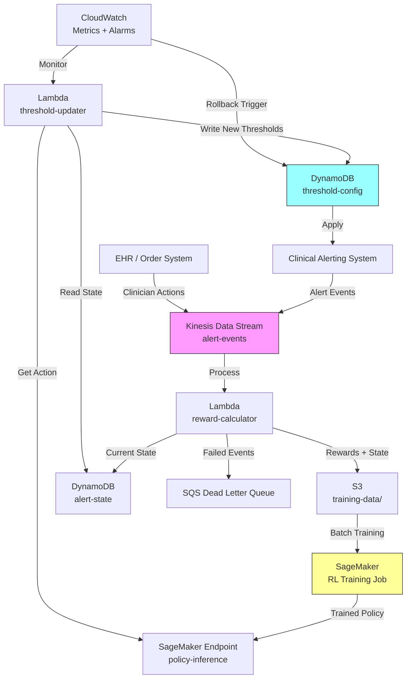

# Recipe 15.1 Architecture and Implementation: Alert Threshold Optimization

*Companion to [Recipe 15.1: Alert Threshold Optimization](chapter15.01-alert-threshold-optimization). This page covers the AWS architecture, services, prerequisites, and pseudocode. For the problem framing and the conceptual approach, start with the main recipe.*

---

## The AWS Implementation

### Why These Services

**Amazon SageMaker for model training and hosting.** SageMaker provides the infrastructure for training RL models (using the built-in RL toolkit or custom containers), hosting the trained policy for inference, and managing model versions. The RL toolkit supports standard frameworks (Ray RLlib, Stable Baselines) and handles the distributed training infrastructure. For this use case, training is periodic (daily or weekly batch retraining), and inference is lightweight (threshold decisions every few hours, not milliseconds).

**Amazon Kinesis Data Streams for alert event ingestion.** Clinical alerts are a streaming problem. Alerts fire continuously, clinician responses arrive asynchronously, and the system needs to process this stream in near-real-time to calculate rewards and update state. Kinesis handles the ingestion at scale with the durability guarantees you need for healthcare data.

**AWS Lambda for reward calculation and state aggregation.** The reward calculation logic (mapping clinician responses to scalar rewards) and state aggregation (summarizing recent alert patterns) are event-driven, stateless computations. Lambda processes Kinesis records, computes rewards, and writes aggregated state to the feature store.

**Amazon DynamoDB for threshold state and configuration.** Current threshold values, safety bounds, adjustment history, and per-unit configuration live in DynamoDB. The threshold controller reads from here, and the RL agent writes its recommendations here. DynamoDB's conditional writes ensure that safety bounds are enforced at the storage layer, not just in application logic.

**Amazon S3 for training data and model artifacts.** Historical alert logs, clinician response data, and computed reward trajectories are stored in S3 for offline training. Model artifacts (trained policies) are versioned in S3 and deployed to SageMaker endpoints.

**Amazon CloudWatch for monitoring and rollback triggers.** The system monitors alert-to-action ratios, alert volumes, and missed-event rates. If any metric crosses a predefined threshold (ironic, yes), CloudWatch alarms trigger automatic rollback to the previous threshold configuration.

### Architecture Diagram



<!-- TODO (TechWriter): Expert review A2 (MEDIUM). Expand on the DLQ pattern: failed reward calculation events go to SQS for reprocessing. Systematic reward calculation failures (e.g., EHR API down for hours) should pause online learning to avoid training on biased reward signals. -->

### Prerequisites

| Requirement | Details |
|-------------|---------|
| **AWS Services** | Amazon SageMaker, Amazon Kinesis Data Streams, AWS Lambda, Amazon DynamoDB, Amazon S3, Amazon CloudWatch, Amazon SQS |
| **IAM Permissions** | `sagemaker:CreateTrainingJob`, `sagemaker:InvokeEndpoint`, `kinesis:GetRecords`, `kinesis:PutRecord`, `dynamodb:GetItem`, `dynamodb:PutItem`, `dynamodb:UpdateItem`, `s3:GetObject`, `s3:PutObject`, `cloudwatch:PutMetricData`, `sqs:SendMessage` |
| **BAA** | AWS BAA signed (alert data contains patient identifiers and clinical context) |
| **Encryption** | S3: SSE-KMS; DynamoDB: encryption at rest; Kinesis: server-side encryption; all API calls over TLS |
| **VPC** | Production: Lambda and SageMaker in VPC with VPC endpoints: S3 (gateway), DynamoDB (gateway), Kinesis Data Streams (interface), CloudWatch Logs (interface), SageMaker Runtime (interface) |
| **CloudTrail** | Enabled: log all threshold changes for audit trail (who changed what, when, and why) |
| **Data Requirements** | Minimum 6 months of historical alert data with clinician response timestamps. More is better. Need alert type, threshold that triggered, patient context, and response action. |
| **Cost Estimate** | SageMaker training: ~$5-20 per training run (weekly). Endpoint: ~$50-100/month (ml.m5.large). Kinesis: ~$15-30/month. Lambda + DynamoDB: negligible. Total: ~$80-150/month. |

### Ingredients

| AWS Service | Role |
|------------|------|
| **Amazon SageMaker** | Trains RL policy on historical data; hosts inference endpoint for threshold decisions |
| **Amazon Kinesis Data Streams** | Ingests real-time alert events and clinician response signals |
| **AWS Lambda** | Computes rewards from response data; triggers periodic threshold updates |
| **Amazon DynamoDB** | Stores current thresholds, safety bounds, state features, and adjustment history |
| **Amazon S3** | Stores training datasets, model artifacts, and threshold change audit logs |
| **Amazon CloudWatch** | Monitors alert-to-action ratios; triggers rollback on degradation |
| **Amazon SQS** | Dead letter queue for failed reward calculations; prevents biased training data |
| **AWS KMS** | Manages encryption keys for all data stores |

### Code

#### Walkthrough

**Step 1: Ingest alert events and clinician responses.** Every alert that fires in the clinical system produces an event record: what type of alert, what threshold triggered it, which patient, what unit, what time. Separately, the EHR tracks clinician responses: acknowledgments, dismissals, orders placed, escalations. These two streams need to be joined (alert event + subsequent response) to create the training signal. The join window is typically 5-15 minutes: if no action follows an alert within that window, it's classified as "dismissed/ignored." Skip this step and you have no feedback signal. The entire system depends on knowing which alerts led to action and which ones were noise.

```pseudocode
FUNCTION ingest_alert_event(event):
    // An alert just fired in the clinical system.
    // Record everything we need to later determine if this was useful.
    record = {
        alert_id:       unique identifier for this alert instance
        alert_type:     category (e.g., "heart_rate_high", "potassium_high", "spo2_low")
        threshold_used: the numeric threshold that triggered this alert (e.g., 100 bpm)
        actual_value:   the patient's actual value that crossed the threshold (e.g., 103 bpm)
        patient_id:     de-identified patient reference (tokenized, not raw MRN)
        unit:           clinical unit (e.g., "ICU-3A", "MedSurg-2B")
        timestamp:      when the alert fired (UTC)
        patient_acuity: current acuity score if available
        staffing_ratio: current nurse-to-patient ratio on the unit
    }
    
    // Write to the streaming ingestion layer for real-time processing.
    // Note: patient_id must be a one-way token (not raw MRN) for the RL pipeline.
    // The tokenization happens at the EHR integration boundary, before data enters
    // this stream. Restrict stream consumer access via IAM resource policies to only
    // the reward-calculator Lambda and S3 archival process.
    write record to alert event stream
    RETURN record.alert_id
```

**Step 2: Calculate reward from clinician response.** This is where the magic happens. After an alert fires, we observe what the clinician does (or doesn't do). The reward function translates that response into a scalar signal that tells the RL agent whether the alert was valuable. A meaningful clinical action following an alert is a positive signal (the alert was useful). A rapid dismissal is a negative signal (the alert was noise). A missed clinical event (deterioration without a preceding alert) is a strongly negative signal (the threshold was too permissive). The reward function is the single most important design decision. Get it wrong and the agent optimizes for the wrong thing.

```pseudocode
// Reward weights: these encode clinical priorities.
// Adjust based on your institution's risk tolerance.
// In production, store these in a configuration store (e.g., Parameter Store or DynamoDB)
// with versioning and clinical committee approval workflow for changes.
REWARD_ACTION_TAKEN     = +1.0    // alert led to a clinical action: good
REWARD_DISMISSED        = -0.3    // alert was dismissed quickly: noise, but mild penalty
REWARD_MISSED_EVENT     = -5.0    // clinical event occurred with no preceding alert: very bad
REWARD_ACKNOWLEDGED     = +0.1    // alert was acknowledged but no action: ambiguous, slight positive

FUNCTION calculate_reward(alert_event, clinician_response, patient_outcome):
    // Determine what happened after the alert fired.
    
    IF clinician_response is NULL AND time_since_alert > RESPONSE_WINDOW:
        // No response at all within the window. Treat as dismissed.
        reward = REWARD_DISMISSED
    
    ELSE IF clinician_response.action_type == "dismissed" 
            AND clinician_response.time_to_respond < 5 seconds:
        // Dismissed almost instantly. This was noise.
        reward = REWARD_DISMISSED
    
    ELSE IF clinician_response.action_type in ["order_placed", "medication_changed", 
                                                 "escalation", "rapid_response"]:
        // The alert led to a real clinical intervention. This was valuable.
        reward = REWARD_ACTION_TAKEN
    
    ELSE IF clinician_response.action_type == "acknowledged":
        // Acknowledged but no further action. Ambiguous.
        reward = REWARD_ACKNOWLEDGED
    
    // Check for missed events: did something bad happen WITHOUT an alert?
    // This is computed separately on a schedule, not per-alert.
    // See Step 3 for the missed-event detection logic.
    
    // Note: when multiple alerts fire for the same patient within a short window
    // and a single action follows, attribution is ambiguous. A practical heuristic
    // is shared credit (distribute reward across all alerts in the window) or
    // clinical-relevance-based attribution if that mapping is available from the EHR.
    
    RETURN reward
```

**Step 3: Detect missed events (the safety check).** The reward function above handles alerts that fired. But the most dangerous failure mode is an alert that should have fired but didn't (because the threshold was too high). This step scans for clinical deterioration events (rapid response calls, code blues, unplanned ICU transfers) and checks whether a relevant alert preceded them. If not, that's a missed event, and the agent receives a large negative reward for the threshold setting that allowed it. This is the safety mechanism that prevents the agent from simply raising all thresholds to eliminate noise. Skip this step and the agent will happily silence every alert to maximize the "no dismissals" reward.

```pseudocode
FUNCTION detect_missed_events(time_window):
    // Scan for clinical deterioration events in the given time window.
    // These are events that SHOULD have been preceded by an alert.
    
    deterioration_events = query EHR for:
        - Rapid response team activations
        - Code blue events
        - Unplanned ICU transfers
        - Significant vital sign deterioration (defined by clinical criteria)
    
    FOR each event in deterioration_events:
        // Look back: was there a relevant alert in the preceding 30-60 minutes?
        preceding_alerts = query alert log for:
            patient = event.patient_id
            time_range = (event.timestamp - 60 minutes) to event.timestamp
            alert_type = relevant types for this deterioration
        
        IF preceding_alerts is EMPTY:
            // No alert preceded this deterioration. The threshold was too permissive.
            // Generate a strong negative reward signal for the current threshold setting.
            emit missed_event_reward:
                alert_type:  the type that should have fired
                unit:        event.unit
                reward:      REWARD_MISSED_EVENT
                context:     event details for audit trail
    
    RETURN count of missed events  // for monitoring dashboards
```

**Step 4: Aggregate state for the RL agent.** The agent needs a summary of the current situation to make threshold decisions. This isn't raw event data; it's aggregated features that capture the relevant context. Think of it as the agent's "view of the world" at decision time. The state includes recent alert volumes, response rates, patient acuity distribution, and time-based features. The aggregation window matters: too short and the state is noisy; too long and it's stale. A 4-8 hour window (roughly one shift) is a reasonable starting point.

```pseudocode
FUNCTION aggregate_state(unit, alert_type, time_window):
    // Build the state vector that the RL agent will observe.
    // This summarizes "what's happening right now" for this unit and alert type.
    
    recent_alerts = query alerts for unit, alert_type in time_window
    
    state = {
        // Alert volume features
        alert_count:          count of recent_alerts
        alerts_per_hour:      alert_count / hours_in(time_window)
        
        // Response pattern features
        action_rate:          fraction of alerts that led to clinical action
        dismiss_rate:         fraction of alerts dismissed within 5 seconds
        avg_time_to_respond:  mean seconds from alert to first clinician interaction
        
        // Threshold features
        current_threshold:    current threshold value for this alert type on this unit
        threshold_headroom:   distance from current threshold to safety ceiling
        
        // Context features
        avg_patient_acuity:   mean acuity score across patients on the unit
        staffing_ratio:       current nurse-to-patient ratio
        hour_of_day:          0-23 (alert patterns vary by shift)
        day_of_week:          0-6 (weekends differ from weekdays)
        
        // Historical performance
        missed_event_count:   missed events in the last 7 days for this alert type
    }
    
    RETURN state
```

**Step 5: Policy inference (get the agent's recommendation).** Given the current state, the trained RL policy outputs an action: adjust the threshold up, down, or leave it unchanged. The action is a small delta (e.g., +2 bpm, -1 bpm, or 0). The policy has learned, from historical data, which adjustments tend to improve the alert-to-action ratio without increasing missed events. This step is lightweight inference, not training. It runs periodically (every few hours or once per shift) rather than on every alert.

```pseudocode
FUNCTION get_threshold_action(state):
    // Ask the trained policy: given this state, what should we do?
    
    // Send state vector to the inference endpoint
    response = call policy_endpoint with:
        input = state vector (normalized to [0, 1] range)
    
    // The policy outputs an action: a threshold adjustment
    action = response.action  // e.g., { delta: +2.0 } or { delta: 0 } or { delta: -1.0 }
    
    // Also get the policy's confidence (useful for monitoring)
    confidence = response.confidence  // how certain the policy is about this action
    
    RETURN action, confidence
```

**Step 6: Apply threshold with safety constraints.** The agent's recommendation passes through a safety layer before reaching the live alerting system. This layer enforces hard bounds (thresholds can never exceed clinically defined maximums or go below minimums), rate limits (no more than X% change per day), and rollback conditions (if alert-to-action ratio drops below a floor, revert immediately). The safety layer is the reason this system is deployable in healthcare. Without it, you'd need to prove the RL policy is perfect before deployment. With it, you only need to prove it's bounded.

```pseudocode
// Safety configuration: these are set by clinical leadership, not learned.
SAFETY_BOUNDS = {
    "heart_rate_high":  { min: 90,  max: 150, max_daily_change: 5 },
    "heart_rate_low":   { min: 40,  max: 60,  max_daily_change: 3 },
    "spo2_low":         { min: 85,  max: 95,  max_daily_change: 2 },
    "potassium_high":   { min: 5.0, max: 6.5, max_daily_change: 0.3 },
    "systolic_bp_high": { min: 140, max: 200, max_daily_change: 10 }
}

FUNCTION apply_threshold_safely(alert_type, unit, current_threshold, action):
    bounds = SAFETY_BOUNDS[alert_type]
    proposed_new = current_threshold + action.delta
    
    // Enforce absolute bounds
    IF proposed_new > bounds.max:
        proposed_new = bounds.max
        log warning: "Action clamped to safety ceiling"
    IF proposed_new < bounds.min:
        proposed_new = bounds.min
        log warning: "Action clamped to safety floor"
    
    // Enforce rate limit: check how much has changed in the last 24 hours
    recent_changes = sum of absolute threshold changes in last 24 hours for this alert_type, unit
    IF recent_changes + abs(action.delta) > bounds.max_daily_change:
        // Too much change too fast. Hold steady.
        log warning: "Daily rate limit reached. No change applied."
        RETURN current_threshold  // no change
    
    // Apply the change.
    // In production, only the threshold-updater Lambda should have write access
    // to this table. Block direct console/CLI writes and require a break-glass
    // procedure (with MFA and CloudTrail logging) for emergency manual overrides.
    write to threshold configuration store:
        alert_type:     alert_type
        unit:           unit
        old_threshold:  current_threshold
        new_threshold:  proposed_new
        change_reason:  "RL policy recommendation"
        confidence:     action.confidence
        timestamp:      current UTC time
    
    // Emit metric for monitoring
    emit metric: "threshold_change" with value = (proposed_new - current_threshold)
    
    RETURN proposed_new
```

> **Curious how this looks in Python?** The pseudocode above covers the concepts. If you'd like to see sample Python code that demonstrates these patterns using boto3, check out the [Python Example](chapter15.01-python-example). It walks through each step with inline comments and notes on what you'd need to change for a real deployment.

### Expected Results

**Sample output after one week of operation:**

```json
{
  "unit": "ICU-3A",
  "evaluation_period": "2026-05-25 to 2026-06-01",
  "alert_type": "heart_rate_high",
  "threshold_before": 100,
  "threshold_after": 107,
  "metrics": {
    "total_alerts_before": 847,
    "total_alerts_after": 312,
    "alert_reduction_pct": 63.2,
    "action_rate_before": 0.08,
    "action_rate_after": 0.22,
    "missed_events": 0,
    "clinician_override_rate": 0.03
  }
}
```

**Performance benchmarks:**

| Metric | Typical Value |
|--------|---------------|
| Alert volume reduction | 30-70% (varies by alert type and baseline) |
| Action rate improvement | 2-4x (from ~8% to ~20-30%) |
| Missed event rate | < 0.1% (must be monitored continuously) |
| Time to stable policy | 2-4 weeks of online learning |
| Threshold update frequency | Every 4-8 hours (once per shift) |
| Rollback trigger rate | < 5% of update cycles |

**Where it struggles:** Units with highly variable patient populations (the state distribution shifts faster than the policy can adapt). Alert types where "acted on" is ambiguous (was the order related to the alert or coincidental?). Night shifts with skeleton staffing where response patterns differ fundamentally from day shifts. And the cold-start problem: new alert types or new units have no historical data to learn from. For cold starts, initialize with the institution's current static thresholds as the baseline policy. The agent starts by observing without acting (pure exploitation of the existing policy) until it accumulates enough data (typically 2-4 weeks) to begin cautious exploration.

---

## Why This Isn't Production-Ready

The pseudocode and architecture above demonstrate the pattern. Deploying this in a hospital requires addressing several gaps:

**EHR integration.** The alert event stream and clinician response tracking require deep integration with your EHR system. Most EHRs (Epic, Cerner/Oracle Health) have alert management modules, but extracting the granular response data (time-to-dismiss, subsequent orders) requires custom HL7/FHIR interfaces or database-level integration. This is often the hardest part of the project, not the RL.

**Clinical governance.** You need a clinical committee to define safety bounds, approve the reward function, review threshold changes periodically, and have authority to override or disable the system. The RL agent is a tool that assists clinical decision-making about alert configuration. It does not replace clinical judgment.

**A/B testing infrastructure.** Before full deployment, you need to run the RL-optimized thresholds on a subset of units while keeping others on static thresholds. This requires randomization at the unit level, outcome tracking across both arms, and statistical analysis of the difference. Plan for a 3-6 month pilot.

**Regulatory considerations.** Alert threshold optimization likely does not require FDA clearance (it's adjusting configuration of existing systems, not making clinical decisions). The FDA's 2022 guidance on Clinical Decision Support software provides a framework: if the system (1) is not intended to replace clinician judgment, (2) allows the clinician to independently review the basis for the recommendation, and (3) is intended for a healthcare professional, it may qualify for the CDS exemption under 21st Century Cures Act Section 3060. But check with your compliance team. If the system is framed as a "clinical decision support" tool, different rules may apply.

---

## Variations and Extensions

**Per-patient threshold personalization.** Instead of unit-level thresholds, learn patient-specific adjustments. A post-cardiac-surgery patient has a different "normal" heart rate than a young trauma patient. Add patient features (diagnosis, medications, baseline vitals) to the state and learn personalized offsets. This dramatically increases the state space but can further reduce noise for chronic patients.

**Multi-objective optimization.** The basic formulation optimizes a single reward. In practice, you're balancing multiple objectives: minimize noise, maximize sensitivity, minimize clinician workload, and maintain equity across patient populations. Reformulate as a constrained optimization or use multi-objective RL (Pareto-optimal policies) to explicitly trade off between objectives.

**Alert bundling and suppression.** Beyond threshold adjustment, learn when to bundle multiple related alerts into a single notification (e.g., "Patient 4B: HR 112, BP 90/60, SpO2 93" as one alert rather than three). This requires a different action space (suppress/bundle/fire individually) but uses the same reward framework.

---

## Additional Resources

**AWS Documentation:**
- [Amazon SageMaker RL Documentation](https://docs.aws.amazon.com/sagemaker/latest/dg/reinforcement-learning.html)
- [Amazon SageMaker RL Examples (Notebook Instances)](https://docs.aws.amazon.com/sagemaker/latest/dg/reinforcement-learning.html#rl-examples)
- [Amazon Kinesis Data Streams Developer Guide](https://docs.aws.amazon.com/streams/latest/dev/introduction.html)
- [Amazon DynamoDB Conditional Writes](https://docs.aws.amazon.com/amazondynamodb/latest/developerguide/Expressions.ConditionExpressions.html)
- [AWS HIPAA Eligible Services](https://aws.amazon.com/compliance/hipaa-eligible-services-reference/)
- [Amazon CloudWatch Alarms](https://docs.aws.amazon.com/AmazonCloudWatch/latest/monitoring/AlarmThatSendsEmail.html)

**AWS Sample Repos:**
- [`amazon-sagemaker-examples` (RL section)](https://github.com/aws/amazon-sagemaker-examples/tree/main/reinforcement_learning): SageMaker RL examples including custom environments and Ray RLlib integration
- [`aws-samples/amazon-sagemaker-rl-ray`](https://github.com/aws-samples/amazon-sagemaker-examples-community-fork): Community examples of Ray-based RL on SageMaker

**Research and Background:**
- TODO: Verify and add specific citation for alert fatigue statistics (150-400 alerts per patient per day in ICU settings)
- TODO: Verify AMA administrative waste statistics citation
- Sendelbach, S. & Funk, M. (2013). "Alarm Fatigue: A Patient Safety Concern." AACN Advanced Critical Care.
- Prasad, N. et al. (2017). "A Reinforcement Learning Approach to Weaning of Mechanical Ventilation in Intensive Care Units." Conference on Uncertainty in Artificial Intelligence.

---

## Estimated Implementation Time

| Phase | Duration |
|-------|----------|
| **Basic (offline policy, single unit, single alert type)** | 6-8 weeks |
| **Production-ready (safety constraints, monitoring, multi-unit)** | 4-6 months |
| **With variations (per-patient, multi-objective, alert bundling)** | 9-12 months |

---


---

*← [Main Recipe 15.1](chapter15.01-alert-threshold-optimization) · [Python Example](chapter15.01-python-example) · [Chapter Preface](chapter15-preface)*
