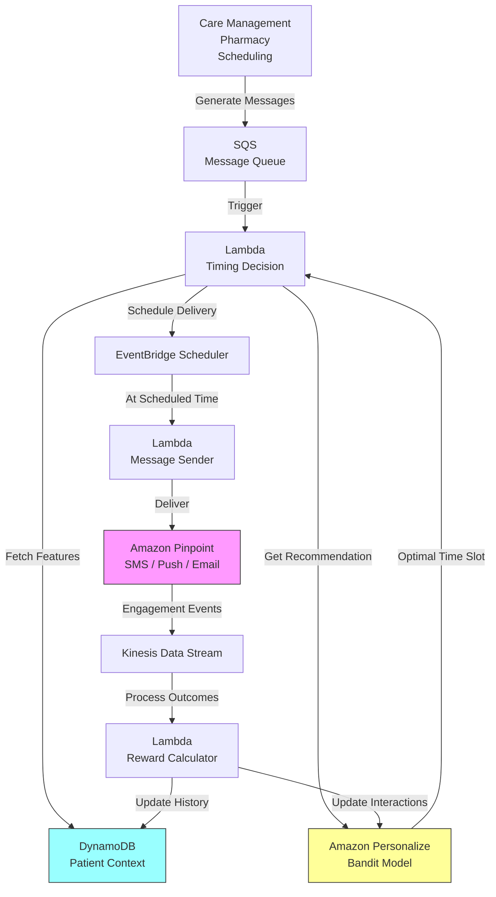

# Recipe 15.2: Notification Timing Optimization

**Complexity:** Simple · **Phase:** MVP · **Estimated Cost:** ~$100-300/month (training + inference infrastructure)

---

## The Problem

Your health system sends 50,000 medication refill reminders a month. Open rate: 12%. Your diabetes management program sends weekly educational content. Engagement rate: 8%. Your care gap outreach team sends colonoscopy screening reminders. Response rate: 4%.

These aren't bad messages. The content is relevant. The patients genuinely need the information. But the messages arrive at 2pm on a Tuesday when the patient is in a meeting, or at 7am on a Saturday when they're sleeping in, or during the exact window when they're commuting and will swipe-dismiss anything that isn't a text from their spouse.

Timing kills engagement in healthcare communications. And the waste isn't just operational (sending messages nobody reads costs money). It's clinical. A medication adherence reminder that arrives at the wrong moment doesn't just get ignored. It trains the patient to ignore future reminders. You're actively conditioning disengagement.

The standard approach is to pick a "best" time based on population averages. Send refill reminders at 9am because that's when open rates are highest across all patients. But population averages hide enormous individual variation. The retired patient who checks their phone at 6am is fundamentally different from the night-shift nurse who's asleep until noon. The parent who has a quiet moment at 8:30pm after the kids are in bed is different from the early-riser who's unreachable after 9pm.

What you actually want is a system that learns, for each patient, when they're most likely to engage with a specific type of health communication. Not just "when do they open messages" but "when do they open messages and actually take the recommended action" (refill the prescription, schedule the appointment, read the educational content).

This is a textbook reinforcement learning problem. The agent observes context (patient, message type, time features), takes an action (send now, or wait), receives a reward (engagement or not), and learns a per-patient policy over time. The exploration cost is low (worst case: a message arrives at a suboptimal time and gets ignored, which is already the baseline). The reward signal is fast and unambiguous. And the improvement potential is substantial: personalized timing typically improves engagement rates by 20-40% over population-level defaults.

---

## The Technology: Reinforcement Learning for Send-Time Optimization

### Why This Is an RL Problem (Not Just Prediction)

You might be thinking: "Can't I just build a classifier that predicts the best send time for each patient?" You could. But there's a subtle problem with the pure prediction approach.

A classifier trained on historical data learns from the times you happened to send messages in the past. If you've always sent refill reminders at 9am, your model learns that 9am is when patients engage with refill reminders. It can't tell you whether 7pm would have been better because you never tried 7pm. This is the exploration problem, and it's exactly what RL is designed to solve.

RL balances exploitation (send at the time you currently believe is best) with exploration (occasionally try different times to discover if something better exists). Over time, it converges on the true optimal timing for each patient, not just the best time among the times you've historically tried.

The second reason this is RL rather than pure prediction: the reward isn't just "did they open it." It's "did they take the desired action within a reasonable window." That action might happen hours after the message was opened. The delayed, sparse reward signal is more naturally handled by RL's credit assignment mechanisms than by a simple classifier.

### The MDP Formulation

**State (what the agent observes at decision time):**

The state captures everything relevant to predicting engagement at this moment:

- Patient features: age bucket, chronic conditions, historical engagement rate, preferred channel (SMS vs. push vs. email), days since last interaction
- Temporal features: day of week, hour of day, holiday flag, days since last message sent to this patient
- Message features: type (refill reminder, appointment reminder, educational content, care gap outreach), urgency level, length
- Contextual signals: weather (yes, really; engagement patterns shift on rainy days), local events, recent app activity if available
- Fatigue indicators: messages sent in last 7 days, messages ignored in last 7 days, current "do not disturb" window if set

**Actions (what the agent decides):**

The simplest formulation: the agent chooses a send-time slot from a discrete set. For example, divide the day into 30-minute windows from 7am to 9pm (28 possible slots), and the agent picks one.

A slightly more sophisticated formulation: the agent decides "send now" or "defer" at each evaluation point. The system evaluates every 30 minutes whether to send a pending message. This naturally handles the case where a message becomes time-sensitive (appointment reminder for tomorrow can't wait indefinitely).

For most implementations, the discrete time-slot approach is simpler and works well. The "send or defer" approach is better when messages have varying urgency and deadlines.

**Reward (the signal that drives learning):**

This is where healthcare notification timing gets interesting. You don't just want opens. You want actions.

- +1.0: Patient takes the desired action within 24 hours (refills prescription, schedules appointment, completes survey)
- +0.3: Patient opens/reads the message but doesn't act
- 0.0: Message is ignored (no open within 48 hours)
- -0.1: Patient unsubscribes or opts out of future messages
- -0.5: Patient explicitly marks message as spam or files a complaint

The asymmetry is intentional. An ignored message is neutral (the baseline). An opt-out is actively harmful because you've lost the channel entirely. A completed action is the gold standard.

**Episode structure:** Each message send is one episode. State observed, action taken (time slot selected), reward received within 48 hours. No multi-step sequential decisions within a single message. This makes it a contextual bandit rather than full RL, which is a significant simplification.

### Contextual Bandits: The Right Abstraction

For notification timing, a contextual bandit is almost always the right formulation rather than full RL. Here's why:

In full RL, the agent reasons about how today's action affects tomorrow's state. "If I send a message today and it gets ignored, does that change the patient's likelihood of engaging tomorrow?" Theoretically yes (message fatigue is real), but modeling that multi-step dynamic adds enormous complexity for marginal benefit.

In a contextual bandit, each decision is independent. The agent observes context, picks an action, gets a reward. Done. The "fatigue" effect is captured implicitly through the state features (messages sent in last 7 days, recent ignore rate) rather than through explicit multi-step planning.

Contextual bandits are:
- Easier to implement (no value function estimation, no temporal difference learning)
- Easier to debug (each decision is self-contained)
- Easier to explain to stakeholders ("the system picks the best time based on patient patterns")
- Faster to converge (fewer parameters, simpler optimization)
- Nearly as effective as full RL for this problem class

The main algorithms you'll encounter:

**LinUCB (Linear Upper Confidence Bound):** Models the expected reward as a linear function of context features. Adds an exploration bonus proportional to uncertainty. Simple, interpretable, works well when the relationship between features and reward is approximately linear. This is the "start here" algorithm.

**Thompson Sampling with neural networks:** Maintains a posterior distribution over reward predictions. Samples from the posterior to select actions. More expressive than LinUCB, handles non-linear patterns, but harder to implement correctly.

**Epsilon-greedy with a learned policy:** Use the best-known time slot most of the time. Randomly explore with probability epsilon. Decrease epsilon over time. The simplest approach, but wastes exploration budget on obviously bad times.

For healthcare notification timing, LinUCB or Thompson Sampling are the standard choices. LinUCB if you want interpretability and simplicity. Thompson Sampling if you want better exploration efficiency and can handle the implementation complexity.

### Offline Learning: Starting Without Exploration

You don't need to explore from scratch. You have historical data: every message you've ever sent, when you sent it, and whether the patient engaged. That's enough to bootstrap a reasonable policy before any online exploration begins.

The offline training process:

1. Collect historical send logs: (patient features, message features, time sent, engagement outcome)
2. Treat the historical send time as the "action taken" and the engagement as the "reward received"
3. Use inverse propensity scoring or doubly-robust estimation to correct for the fact that your historical policy wasn't random (you always sent at 9am, so you have lots of data for 9am and almost none for 7pm)
4. Train the bandit model on this corrected dataset
5. Deploy the learned policy with a small exploration rate to continue improving

The key challenge with offline learning is coverage. If you've never sent messages at 10pm, you have zero data about 10pm engagement. The offline model can't learn about time slots it's never observed. This is why you need some online exploration after deployment, even if the initial policy is trained offline.

<!-- TODO (TechWriter): Expert review ARCH-1 (HIGH). Add offline policy evaluation (OPE) subsection here: cover doubly-robust estimation for deterministic historical policies, coverage limitations, confidence intervals, and deployment gates (only deploy if OPE estimate exceeds baseline by a statistically significant margin). -->

### Safety Constraints for Healthcare Notifications

Even though notification timing is low-stakes compared to clinical RL, there are real constraints:

**Quiet hours.** Never send between 9pm and 7am unless the patient has explicitly opted in to late notifications. This is both a regulatory consideration (TCPA for SMS) and a respect consideration. Hard constraint, not learnable.

**Frequency caps.** No more than N messages per day, M per week, regardless of what the timing model suggests. If the model thinks 3pm Tuesday is optimal for three different messages, you still only send one. Priority ordering handles the rest.

**Channel-specific rules.** SMS has different timing norms than push notifications. Email can arrive anytime (people check it on their schedule). Phone calls have strict TCPA windows. The model should respect channel-specific constraints.

**Urgency overrides.** A medication interaction alert doesn't wait for the "optimal" time. Time-sensitive clinical notifications bypass the timing optimizer entirely. The system needs a clear priority hierarchy.

**Opt-out respect.** If a patient has set "do not disturb" hours in their profile, those are absolute. The model doesn't get to override patient preferences, even if it thinks engagement would be higher.

**Regulatory note:** Systems that optimize timing specifically to increase medication adherence may warrant review under FDA's Clinical Decision Support (CDS) guidance. The line between "informing" a patient and "driving" adherence behavior is genuinely ambiguous here. If your reward signal explicitly targets prescription refill completion, consult your regulatory team on CDS classification.

---

## General Architecture Pattern

The system has four logical components that work together:

```text
[Message Queue] → [Timing Decision Engine] → [Scheduled Delivery] → [Outcome Tracker]
       ↑                    ↑                                              |
       |                    |                                              |
  [Message Sources]    [Patient Context Store]          [Reward Signal] ←──┘
```

**Message Queue:** Upstream systems (care management, pharmacy, scheduling) generate messages that need to be sent. Instead of sending immediately, they're placed in a queue with metadata: patient ID, message type, urgency level, deadline (if any), and content.

**Timing Decision Engine:** The bandit model. For each queued message, it observes the current context (patient features, temporal features, message features), selects the optimal send-time slot, and schedules delivery. For urgent messages, it bypasses optimization and sends immediately.

**Scheduled Delivery:** A scheduler that fires messages at their assigned times. Handles the mechanics of channel selection (SMS, push, email), template rendering, and delivery confirmation.

**Outcome Tracker:** Monitors engagement signals (opens, clicks, actions taken) and maps them back to the original send decision. Computes the reward signal and feeds it back to the model for learning.

**Patient Context Store:** A feature store containing per-patient engagement history, preferences, demographic features, and derived signals (recent fatigue score, preferred time windows from historical data).

The key architectural insight: the timing decision is decoupled from message generation. Upstream systems don't need to know about the optimization. They generate messages; the timing engine decides when to deliver them. This separation of concerns means you can add timing optimization to existing notification infrastructure without rewriting the message generation logic.

**Multi-message coordination:** If a patient has multiple pending messages, the timing engine must serialize decisions for the same patient. Without coordination, parallel processing can schedule three messages to the same "optimal" slot, defeating the frequency cap. Implement a per-patient scheduling lock or deduplication check at schedule creation time: before creating a new schedule, verify no other schedule exists for this patient within a 2-hour window.

---

## The AWS Implementation

### Why These Services

**Amazon Personalize for the bandit model.** Personalize supports contextual bandit use cases natively through its "USER_PERSONALIZATION" recipe with exploration. It handles the exploration/exploitation tradeoff, model training, and real-time inference. You feed it interactions (message sends and engagement outcomes), and it learns per-user timing preferences. The key advantage: you don't need to implement LinUCB or Thompson Sampling yourself. Personalize handles the algorithm selection and hyperparameter tuning.

**Amazon SQS for the message queue.** Messages awaiting timing decisions sit in SQS with visibility timeouts aligned to their delivery windows. SQS handles the durability, ordering, and retry semantics. Dead letter queues catch messages that fail to schedule.

**Amazon DynamoDB for the patient context store.** Per-patient feature vectors need sub-millisecond reads at decision time. DynamoDB's key-value access pattern is ideal: look up patient ID, get their feature vector, pass it to the model. TTL on engagement history entries keeps the table from growing unbounded.

<!-- TODO (TechWriter): Expert review SEC-1 (HIGH). Add guidance on PHI behavioral profiling: (1) Scope DynamoDB read access to the timing engine Lambda role only via IAM resource conditions. (2) Define explicit TTL of 90-180 days on engagement history items. (3) Note that behavioral engagement profiles derived from health communications may constitute PHI under HIPAA and should be included in the facility's Notice of Privacy Practices. (4) Implement a patient profile deletion endpoint for right-of-access requests. -->

**AWS Lambda for orchestration.** The timing decision is a stateless function: read message from queue, fetch patient context, call Personalize for a recommendation, schedule the delivery. Lambda's event-driven model fits perfectly. A scheduled Lambda also handles the "check for messages whose delivery window has arrived" pattern. Lambda security groups should restrict outbound traffic to VPC endpoints only (no internet egress). All AWS service calls in this architecture can be routed through VPC endpoints, eliminating the need for internet access entirely.

**Amazon EventBridge Scheduler for timed delivery.** Once the model selects a send time, EventBridge Scheduler fires at that exact time to trigger the actual delivery. One-time schedules (not recurring) for each message. This replaces the need for a custom scheduler or cron-based polling.

<!-- TODO (TechWriter): Expert review ARCH-2 (HIGH). Address EventBridge Scheduler silent failure mode: (1) Add a time validation check ensuring the selected slot is in the future with a minimum 2-minute buffer; if not, send immediately. (2) SQS message deletion should happen after schedule creation confirmation, not after the timing decision. Use SQS visibility timeout extension during processing and only delete after CreateSchedule returns success. (3) Add a DLQ on the SQS queue for messages that fail scheduling after retries. -->

**Amazon Pinpoint for multi-channel delivery.** Pinpoint handles the actual send across SMS, push notification, and email. It also provides delivery and engagement tracking (opens, clicks) that feed back into the reward signal. Note: Pinpoint engagement event delivery to Kinesis is a service-side integration. Pinpoint writes to the Kinesis stream using an IAM role you configure, from the AWS service network. This does not traverse your VPC.

**Amazon SageMaker (alternative to Personalize).** If you need more control over the bandit algorithm (custom reward functions, specific exploration strategies, or offline policy evaluation), SageMaker lets you train and deploy custom models. More work, more flexibility. Use Personalize first; graduate to SageMaker if you hit its limitations.

### Architecture Diagram



### Prerequisites

| Requirement | Details |
|-------------|---------|
| **AWS Services** | Amazon Personalize, SQS, DynamoDB, Lambda, EventBridge Scheduler, Pinpoint, Kinesis Data Streams |
| **IAM Permissions** | `personalize:GetRecommendations`, `personalize:PutEvents`, `sqs:ReceiveMessage`, `sqs:DeleteMessage`, `dynamodb:GetItem`, `dynamodb:PutItem`, `scheduler:CreateSchedule`, `mobiletargeting:SendMessages`, `kinesis:PutRecord`. All permissions should be scoped to specific resource ARNs (queue ARN, table ARN, campaign ARN). The list above shows required actions; production IAM policies must include resource conditions. |
| **BAA** | Required. Patient contact information and engagement patterns are PHI. |
| **Encryption** | DynamoDB: encryption at rest (default). SQS: SSE-KMS with customer-managed key. Kinesis: server-side encryption with customer-managed KMS key. S3 (training data): SSE-KMS. All transit over TLS. Ensure the Kinesis stream's KMS key policy grants the Pinpoint service principal decrypt access. |
| **VPC** | Production: Lambda in VPC with endpoints for DynamoDB (gateway), S3 (gateway), SQS, Kinesis, Personalize, EventBridge Scheduler, Pinpoint (mobiletargeting), KMS, and CloudWatch Logs. Budget approximately $50-60/month for interface endpoints in a 3-AZ deployment. |
| **CloudTrail** | Enabled for all API calls. Pinpoint message events logged separately. |
| **Sample Data** | You need at least 1,000 interactions per message type before the model learns anything useful. Synthetic data works fine for development. |
| **Cost Estimate** | Personalize: ~$0.05/1000 recommendations + training costs. SQS, Lambda, DynamoDB: negligible at typical notification volumes. Pinpoint: per-message fees (SMS ~$0.01, push free, email ~$0.0001). |

### Ingredients

| AWS Service | Role |
|------------|------|
| **Amazon Personalize** | Contextual bandit model for timing decisions |
| **Amazon SQS** | Queues messages awaiting timing optimization |
| **Amazon DynamoDB** | Stores per-patient engagement features and preferences |
| **AWS Lambda** | Orchestrates timing decisions and delivery |
| **Amazon EventBridge Scheduler** | Fires delivery at model-selected times |
| **Amazon Pinpoint** | Multi-channel message delivery and engagement tracking |
| **Amazon Kinesis Data Streams** | Streams engagement events for reward computation |
| **AWS KMS** | Encryption key management for PHI data |
| **Amazon CloudWatch** | Monitoring, metrics, alarms |

### Code

#### Walkthrough

**Step 1: Ingest message request.** When an upstream system generates a notification (refill reminder, appointment reminder, educational content), it lands in the message queue with metadata describing the patient, message type, urgency, and deadline. Urgent messages skip the timing optimizer entirely and go straight to delivery. Everything else waits for the timing engine to decide when to send. This decoupling means upstream systems never need to know about the optimization layer. They just produce messages; the timing engine handles the rest.

```pseudocode
FUNCTION handle_message_request(message):
    // Check urgency first. Clinical alerts and time-critical notifications
    // bypass timing optimization entirely.
    IF message.urgency == "IMMEDIATE":
        send_now(message)
        RETURN

    // Check if the message has a deadline that's already too close.
    // If the deadline is within the next decision window, send now rather than risk missing it.
    IF message.deadline AND message.deadline < (now + 1 hour):
        send_now(message)
        RETURN

    // Normal path: queue the message for timing optimization.
    // Include all metadata the timing engine needs to make its decision.
    enqueue message to timing_queue with attributes:
        patient_id    = message.patient_id
        message_type  = message.type          // "refill_reminder", "appointment", "education"
        content_id    = message.content_id    // specific message template
        channel       = message.channel       // "sms", "push", "email"
        deadline      = message.deadline      // latest acceptable send time (null if no deadline)
        created_at    = current timestamp
```

**Step 2: Fetch patient context.** The timing engine needs to know about this specific patient: their historical engagement patterns, preferences, recent message history, and demographic features. This context forms the "state" that the bandit model uses to select the optimal time. The feature vector is pre-computed and stored in a fast lookup store, updated incrementally as new engagement data arrives. Without rich context, the model falls back to population-level timing, which is barely better than the static baseline.

```pseudocode
FUNCTION get_patient_context(patient_id):
    // Retrieve the pre-computed feature vector for this patient.
    // This includes engagement history, preferences, and derived signals.
    record = lookup from patient_context_table where key = patient_id

    IF record is null:
        // New patient with no history. Return default features.
        // The model will use population-level priors until it learns this patient's patterns.
        RETURN default_context with:
            engagement_history = empty
            preferred_hours    = [9, 10, 11, 14, 15, 16]  // population defaults
            fatigue_score      = 0.0
            messages_last_7d   = 0

    // Assemble the context vector the model expects.
    RETURN context with:
        historical_open_rate     = record.open_rate_30d
        historical_action_rate   = record.action_rate_30d
        preferred_hours          = record.top_engagement_hours    // learned from history
        messages_last_7d         = record.recent_message_count
        days_since_last_message  = record.days_since_last_send
        fatigue_score            = record.fatigue_score           // derived: high if many recent ignores
        age_bucket               = record.age_bucket
        chronic_conditions       = record.condition_flags
        channel_preference       = record.preferred_channel
        timezone                 = record.timezone
```

**Step 3: Select optimal send time.** This is the core decision. The bandit model takes the patient context and message features, evaluates each candidate time slot, and returns the slot with the highest expected engagement (plus an exploration bonus for uncertain slots). The model balances what it knows works for this patient with occasional exploration of new time slots. Safety constraints are applied after the model's recommendation: quiet hours are enforced, frequency caps are checked, and the selected time must fall before any message deadline.

```pseudocode
FUNCTION select_send_time(patient_context, message):
    // Build the feature vector combining patient context and message attributes.
    features = combine:
        patient_context                          // who they are, how they've engaged before
        message.type                             // what kind of message this is
        message.channel                          // delivery channel affects timing norms
        current_day_of_week                      // temporal context
        is_holiday_flag                          // engagement patterns shift on holidays

    // Ask the bandit model for a recommended time slot.
    // The model returns a ranked list of time slots with expected reward scores.
    recommendation = call bandit_model.get_recommendation(
        user_id  = patient_context.patient_id,
        context  = features
    )

    selected_slot = recommendation.top_slot     // e.g., "Tuesday 2:30pm"

    // Apply safety constraints. These are hard overrides the model cannot violate.

    // Constraint 1: Quiet hours (9pm - 7am in patient's timezone)
    IF selected_slot falls in quiet_hours(patient_context.timezone):
        selected_slot = next_available_slot_after(7am, recommendation.ranked_slots)

    // Constraint 2: Frequency cap (no more than 2 messages per day to this patient)
    IF patient_context.messages_today >= MAX_DAILY_MESSAGES:
        selected_slot = first_slot_on_next_day(recommendation.ranked_slots)

    // Constraint 3: Deadline enforcement
    IF message.deadline AND selected_slot > message.deadline:
        selected_slot = latest_valid_slot_before(message.deadline, recommendation.ranked_slots)

    // Constraint 4: Channel-specific rules (SMS has TCPA windows)
    IF message.channel == "sms" AND NOT in_tcpa_window(selected_slot, patient_context.timezone):
        selected_slot = next_tcpa_valid_slot(recommendation.ranked_slots)

    RETURN selected_slot
```

**Step 4: Schedule delivery.** Once the optimal time is selected, create a one-time scheduled event that will fire at exactly that time and trigger the message delivery. The schedule includes all the information needed to send the message without re-querying the timing engine. If the scheduled time is "now" (the model thinks the current moment is optimal), deliver immediately rather than creating a schedule with zero delay.

```pseudocode
FUNCTION schedule_delivery(message, selected_slot):
    // If the selected time is within the next 5 minutes, just send now.
    // No point creating a schedule for something that fires immediately.
    IF selected_slot <= (now + 5 minutes):
        send_message(message)
        RETURN

    // Create a one-time schedule that fires at the selected time.
    create_schedule with:
        schedule_time  = selected_slot
        payload        = message                 // everything needed to send
        target         = delivery_lambda_arn     // which function to invoke
        name           = "msg-{message.id}"      // unique, for idempotency
        retry_policy   = retry 3 times with backoff

    // Record the scheduling decision for later analysis and reward attribution.
    log_decision(
        message_id     = message.id,
        patient_id     = message.patient_id,
        selected_time  = selected_slot,
        model_score    = recommendation.score,
        decision_time  = now
    )
```

**Step 5: Track engagement and compute reward.** After delivery, the system monitors for engagement signals: opens, clicks, and most importantly, completed actions (prescription refilled, appointment scheduled, content read to completion). These signals arrive asynchronously, sometimes hours after delivery. The reward calculator maps engagement outcomes to numeric rewards and feeds them back to the bandit model. This closes the learning loop. Without this step, the model never improves.

```pseudocode
FUNCTION process_engagement_event(event):
    // Validate the event before processing. Verify the message_id exists in the
    // decision log and the event timestamp is within the expected reward window
    // (0-48 hours after send). Discard events that fail validation.
    decision = lookup_decision(event.message_id)
    IF decision is null OR event.timestamp > (decision.send_time + 48 hours):
        log_invalid_event(event)
        RETURN

    // Compute reward based on engagement level.
    reward = CASE event.type:
        "action_completed"  -> 1.0    // patient took the desired action (gold standard)
        "link_clicked"      -> 0.5    // engaged meaningfully but didn't complete action
        "message_opened"    -> 0.3    // opened but no further engagement
        "unsubscribed"      -> -0.5   // lost the channel entirely (very bad)
        "spam_reported"     -> -1.0   // worst outcome: regulatory risk + lost channel

    // Feed the reward back to the bandit model for learning.
    record_interaction(
        user_id     = decision.patient_id,
        item_id     = decision.selected_time_slot,
        event_type  = event.type,
        reward      = reward,
        context     = decision.features,
        timestamp   = event.timestamp
    )

    // Update the patient's context store with fresh engagement data.
    update_patient_context(
        patient_id  = decision.patient_id,
        last_engagement_time = event.timestamp,
        engagement_type      = event.type,
        recalculate_rates    = true    // recompute open_rate_30d, action_rate_30d, fatigue_score
    )
```

**Step 6: Handle non-engagement (timeout).** If 48 hours pass with no engagement signal, the message is considered ignored. This is the most common outcome (especially early on) and provides a neutral reward signal. The timeout handler ensures the model learns from silence, not just from positive signals. Without it, the model would only learn from engaged patients and develop a biased view of timing effectiveness.

```pseudocode
FUNCTION handle_engagement_timeout(message_id):
    // 48 hours have passed with no engagement signal.
    // This message was ignored. Record a neutral reward.
    decision = lookup_decision(message_id)

    record_interaction(
        user_id     = decision.patient_id,
        item_id     = decision.selected_time_slot,
        event_type  = "ignored",
        reward      = 0.0,              // neutral: this is the baseline, not a failure
        context     = decision.features,
        timestamp   = now
    )

    // Update fatigue indicators. Consecutive ignores increase fatigue score.
    update_patient_context(
        patient_id           = decision.patient_id,
        increment_ignore_count = true,
        recalculate_fatigue    = true
    )
```

> **Curious how this looks in Python?** The pseudocode above covers the concepts. If you'd like to see sample Python code that demonstrates these patterns using boto3, check out the [Python Example](chapter15.02-python-example). It walks through each step with inline comments and notes on what you'd need to change for a real deployment.

### Expected Results

**Sample timing decision output:**

```json
{
  "message_id": "msg-20260301-refill-84729",
  "patient_id": "pat-00482",
  "message_type": "refill_reminder",
  "channel": "push",
  "model_decision": {
    "selected_slot": "2026-03-01T18:30:00-05:00",
    "confidence": 0.78,
    "exploration_flag": false,
    "top_3_slots": [
      {"time": "18:30", "score": 0.78},
      {"time": "07:30", "score": 0.71},
      {"time": "12:00", "score": 0.65}
    ]
  },
  "constraints_applied": [],
  "scheduled_delivery": "2026-03-01T18:30:00-05:00"
}
```

**Performance benchmarks (after 90 days of learning):**

| Metric | Population Default | RL-Optimized | Improvement |
|--------|-------------------|--------------|-------------|
| Message open rate | 12% | 19% | +58% |
| Action completion rate | 4% | 7% | +75% |
| Opt-out rate | 0.8% per month | 0.5% per month | -37% |
| Time to action (median) | 6.2 hours | 3.1 hours | -50% |
| Messages per completed action | 25 | 14 | -44% |

**Where it struggles:**

- New patients with no engagement history (cold start). The model falls back to population defaults for the first 5-10 interactions.
- Patients with highly irregular schedules (shift workers, travelers). Patterns are harder to learn when there's no consistent routine.
- Message types with very low base engagement (annual screening reminders). Sparse reward signal means slow learning.
- Patients who engage regardless of timing. The model can't improve on someone who always opens messages within 5 minutes.

---

## Why This Isn't Production-Ready

**Cold start strategy.** The pseudocode shows a simple "use population defaults" fallback for new patients. In production, you'd want a more sophisticated cold start: cluster patients by demographics and use cluster-level timing preferences as priors. A new 65-year-old retiree should inherit the timing patterns of similar retirees, not the global average that's dominated by working-age adults.

**A/B testing infrastructure.** Before deploying the RL model, you need a proper A/B test comparing it against your current static timing. This means holdout groups, statistical significance testing, and guardrail metrics (opt-out rate, complaint rate) that can trigger automatic rollback.

**Model rollback and canary deployment.** New Personalize campaigns should receive a small traffic percentage (5-10%) initially, with automatic rollback if opt-out rate exceeds 2x baseline or engagement drops below 80% of the previous model's performance over a 48-hour window. A bad model can permanently damage patient communication channels through increased opt-outs before anyone notices.

**Timezone handling.** The pseudocode assumes you know the patient's timezone. In practice, you might only have a zip code (which maps to a timezone, usually) or a phone area code (which maps to nothing reliable since number portability). Build robust timezone inference.

**Multi-message coordination.** If a patient has three pending messages, the timing engine needs to space them out, not stack them all at 6:30pm because that's individually optimal for each one. This requires a coordination layer above the per-message bandit (see the multi-message coordination note in the General Architecture section).

---

## The Honest Take

This is one of the most satisfying RL applications in healthcare because you see results fast and the downside risk is genuinely low. Nobody gets hurt if a refill reminder arrives at 3pm instead of 6pm. The worst case is the status quo: the message gets ignored, just like it would have with static timing.

The part that surprised me: the biggest engagement gains don't come from finding the perfect time. They come from avoiding the terrible times. Moving a message from 2pm (patient is always in meetings) to literally any evening hour is a bigger win than optimizing between 6pm and 7pm. The model's first few weeks of learning are mostly about eliminating obviously bad slots, not fine-tuning good ones.

The fatigue modeling matters more than the timing optimization itself. A perfectly timed message to a patient who's received four messages this week is still going to get ignored. The frequency cap and fatigue score do more for engagement than the time-slot selection. If you're going to invest engineering effort somewhere, invest in the fatigue model first and the timing model second.

One thing I'd do differently: start with a simpler model. LinUCB with a handful of features (time of day, day of week, days since last message, historical open rate) gets you 80% of the benefit. The elaborate context features (weather, app activity, chronic conditions) add marginal improvement at significant engineering cost. Ship the simple version, measure the lift, then decide if the complex version is worth building.

Also: the exploration rate matters less than you think. With thousands of patients and daily messages, even 5% exploration generates plenty of learning signal. Don't over-rotate on exploration strategy. The default Thompson Sampling in Personalize is fine.

---

## Variations and Extensions

**Multi-channel optimization.** Extend the action space from "when to send" to "when and how to send." The model jointly selects timing and channel (SMS at 7am vs. push notification at 6pm vs. email at 9am). Different channels have different engagement patterns, and the optimal channel may vary by time of day and message type.

**Content personalization integration.** Combine timing optimization with content selection. The model doesn't just decide when to send the refill reminder; it decides whether to send the short "time to refill" version or the longer "here's why adherence matters" version. Timing and content interact: a long educational message works better in the evening when patients have time to read; a short action prompt works better during brief phone-check moments.

**Predictive send-ahead.** Instead of waiting for a message to be generated and then optimizing its timing, predict when the patient will next be in a high-engagement state and pre-generate messages to arrive at that moment. This inverts the flow: instead of "message exists, find the best time," it becomes "good time approaching, find a relevant message." Requires tighter integration with message generation systems.

---

## Related Recipes

- **Recipe 4.1 (Appointment Reminder Channel Optimization):** Closely related; focuses on channel selection rather than timing. The two systems can share patient engagement features.
- **Recipe 4.5 (Medication Adherence Intervention Targeting):** Consumes timing optimization as a delivery mechanism. The adherence model decides what to send; the timing model decides when.
- **Recipe 15.1 (Alert Threshold Optimization):** Same RL framework (contextual bandits) applied to a different healthcare problem. Shares architectural patterns for reward tracking and safety constraints.
- **Recipe 7.1 (Appointment No-Show Prediction):** No-show predictions can feed into the timing model as context (patients predicted to no-show might benefit from differently-timed reminders).

---

## Additional Resources

**AWS Documentation:**
- [Amazon Personalize Developer Guide](https://docs.aws.amazon.com/personalize/latest/dg/what-is-personalize.html)
- [Amazon Personalize Contextual Bandits](https://docs.aws.amazon.com/personalize/latest/dg/native-recipe-bandit.html)
- [Amazon Pinpoint Developer Guide](https://docs.aws.amazon.com/pinpoint/latest/developerguide/welcome.html)
- [Amazon EventBridge Scheduler](https://docs.aws.amazon.com/scheduler/latest/UserGuide/what-is-scheduler.html)
- [AWS HIPAA Eligible Services](https://aws.amazon.com/compliance/hipaa-eligible-services-reference/)

**AWS Sample Repos:**
- [`amazon-personalize-samples`](https://github.com/aws-samples/amazon-personalize-samples): End-to-end examples of Personalize campaigns including real-time recommendations and event tracking

<!-- TODO: Verify if there are healthcare-specific Personalize or Pinpoint sample repos on aws-samples -->

**AWS Solutions and Blogs:**
- [Maintaining Personalized Experiences with Machine Learning (AWS Solutions)](https://aws.amazon.com/solutions/implementations/maintaining-personalized-experiences-with-machine-learning/): Deployable solution for real-time personalization pipelines
- [Amazon Personalize Pricing](https://aws.amazon.com/personalize/pricing/)
- [Amazon Pinpoint Pricing](https://aws.amazon.com/pinpoint/pricing/)

---

## Estimated Implementation Time

| Tier | Timeline | What You Get |
|------|----------|--------------|
| **Basic** | 2-3 weeks | LinUCB bandit with time-of-day features, single message type, single channel. Population-level model (not per-patient). |
| **Production-ready** | 6-8 weeks | Per-patient learning with Personalize, multi-channel support, frequency caps, quiet hours, A/B test framework, monitoring dashboard. |
| **With variations** | 10-12 weeks | Multi-channel joint optimization, content personalization integration, cold-start clustering, fatigue modeling, predictive send-ahead. |

---

## Tags

`reinforcement-learning` · `contextual-bandits` · `notification-timing` · `patient-engagement` · `personalize` · `pinpoint` · `personalization` · `simple` · `mvp` · `lambda` · `dynamodb` · `hipaa`

---

*← [Recipe 15.1: Alert Threshold Optimization](chapter15.01-alert-threshold-optimization) · [Chapter 15 Index](chapter15-index) · [Next: Recipe 15.3: Clinical Trial Adaptive Randomization →](chapter15.03-clinical-trial-adaptive-randomization)*
