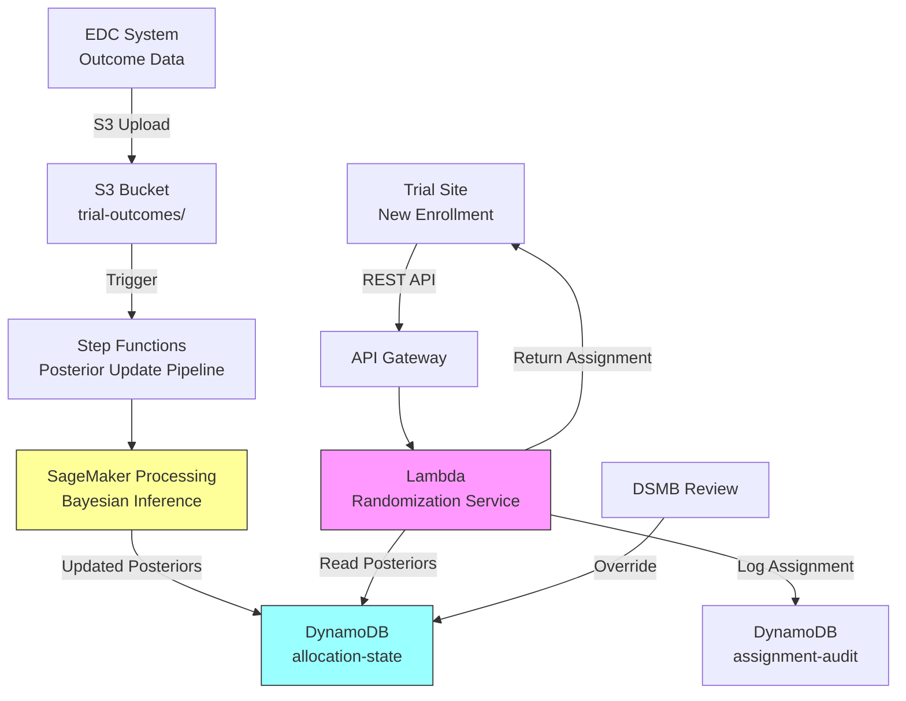

# Recipe 15.3 Architecture and Implementation: Clinical Trial Adaptive Randomization

*Companion to [Recipe 15.3: Clinical Trial Adaptive Randomization](chapter15.03-clinical-trial-adaptive-randomization). This page covers the AWS architecture, services, prerequisites, and pseudocode. For the problem framing and the conceptual approach, start with the main recipe.*

---

## The AWS Implementation

### Why These Services

**Amazon SageMaker for the posterior update engine.** The Bayesian inference component needs to run on a schedule (after each batch of outcomes is confirmed) or on-demand (when triggered by new data). SageMaker Processing Jobs provide a managed compute environment for running the posterior update calculations. For simple conjugate models, this is lightweight. For complex models requiring MCMC, you can scale to larger instances. SageMaker also provides experiment tracking for the simulation studies during the design phase. Note that Processing Jobs have a 3-5 minute startup overhead (instance provisioning + container pull), so total time from trigger to updated allocation probabilities is 5-7 minutes for simple models. For trials needing faster updates, consider a persistent SageMaker endpoint or a Lambda function (feasible for conjugate Beta-Binomial models where the computation is trivial).

**AWS Lambda for the randomization service.** When a site enrolls a patient, the system needs to return an arm assignment in under a second. Lambda provides a stateless, highly available compute layer that reads the current allocation probabilities (pre-computed by the posterior engine) and performs the randomized assignment. The function is simple: read probabilities, generate random number, assign arm, log the assignment.

**Amazon DynamoDB for state storage.** Two tables: one for the current posterior parameters (updated by the SageMaker job), one for the assignment audit log (every randomization decision with its inputs and outputs). DynamoDB's single-digit millisecond reads make it ideal for the Lambda function's hot path. The audit log table provides the complete reproducibility trail that regulators require. Enable Point-in-Time Recovery (PITR) on both tables; the S3 posterior history provides a secondary recovery path if the allocation-state table must be rebuilt.

**Amazon S3 for outcome data and simulation results.** Raw outcome data from the EDC (Electronic Data Capture) system lands in S3. Simulation results from the design phase live here too. S3 also stores the posterior update history for retrospective analysis. Configure S3 Object Lock (compliance mode) for trial records that must be retained per 21 CFR 11.10(c).

**AWS Step Functions for orchestration.** The posterior update pipeline (ingest new outcomes, validate, run Bayesian update, publish new allocation probabilities) is a multi-step workflow that needs error handling, retry logic, and audit logging. Step Functions provides this orchestration with built-in state tracking.

**Amazon API Gateway for the randomization endpoint.** Sites call a REST API to get arm assignments. API Gateway provides authentication, throttling, and request logging in front of the Lambda function. Use a Regional endpoint for multi-site access over the internet, or a Private endpoint if sites connect via VPN/Direct Connect to the VPC. Consider AWS WAF on API Gateway for rate limiting and IP allowlisting to restrict access to known site IP ranges.

### Architecture Diagram



### Prerequisites

| Requirement | Details |
|-------------|---------|
| **AWS Services** | Amazon SageMaker, AWS Lambda, Amazon DynamoDB, Amazon S3, AWS Step Functions, Amazon API Gateway, Amazon CloudWatch, AWS WAF |
| **IAM Permissions** | `sagemaker:CreateProcessingJob`, `lambda:InvokeFunction`, `dynamodb:GetItem`, `dynamodb:PutItem`, `s3:GetObject`, `s3:PutObject`, `states:StartExecution` |
| **BAA** | AWS BAA signed (trial data includes patient identifiers and outcomes) |
| **Encryption** | S3: SSE-KMS with customer-managed key (CMK); DynamoDB: encryption at rest; all API calls over TLS; Lambda environment variables encrypted with customer-managed KMS key (enables CloudTrail visibility into key usage for Part 11 audit requirements) |
| **VPC** | Production: Lambda and SageMaker in VPC with VPC endpoints for DynamoDB, S3, CloudWatch Logs, and KMS. Note: KMS uses an interface endpoint (billed per AZ-hour) unlike S3 and DynamoDB gateway endpoints (free). |
| **CloudTrail** | Enabled: log all API calls for regulatory audit trail |
| **21 CFR Part 11** | If FDA-regulated: electronic records must meet Part 11 requirements (audit trails, access controls, electronic signatures). CloudTrail + DynamoDB audit log + IAM provides the foundation. |
| **Data Retention** | Clinical trial records must be retained per 21 CFR 11.10(c) (minimum 2 years post-approval or investigation termination). Use S3 Object Lock (compliance mode) and disable DynamoDB table deletion for the audit log table. |
| **Sample Data** | Simulated trial data. Generate synthetic patient outcomes using known response rates. Never use real trial data in development. |
| **Cost Estimate** | SageMaker Processing: ~$0.10-0.50 per posterior update (runs minutes, not hours). Lambda: negligible (millisecond executions). DynamoDB: ~$5-20/month for typical trial volumes. Total: $200-800/month depending on trial size and update frequency. |

### Ingredients

| AWS Service | Role |
|------------|------|
| **Amazon SageMaker** | Runs Bayesian posterior updates; hosts simulation studies during design phase |
| **AWS Lambda** | Stateless randomization service; returns arm assignments in <1 second |
| **Amazon DynamoDB** | Stores current allocation state and complete assignment audit log |
| **Amazon S3** | Stores outcome data, simulation results, and posterior history |
| **AWS Step Functions** | Orchestrates the posterior update pipeline with error handling |
| **Amazon API Gateway** | REST endpoint for site enrollment requests; authentication and throttling |
| **Amazon CloudWatch** | Monitoring, alerting on randomization failures or unusual patterns |
| **AWS KMS** | Encryption key management for all data at rest (customer-managed keys for Part 11 auditability) |
| **AWS WAF** | Rate limiting and IP allowlisting for the randomization API |

### Pseudocode Walkthrough

**Step 1: Initialize trial parameters.** Before the trial starts, you define the prior distributions for each arm, the allocation constraints, and the update schedule. This configuration is the "protocol" for the adaptive system. It must be locked before the first patient is enrolled (protocol amendments require regulatory approval). The priors are typically uninformative (Beta(1,1) for binary outcomes, meaning "we know nothing"), but can incorporate historical data if justified. Minimum allocation constraints prevent any arm from dropping below a floor (typically 10-20%) to ensure sufficient data for inference.

```pseudocode
CONFIGURATION:
    trial_id          = "TRIAL-2026-001"
    arms              = ["Control", "Treatment_A", "Treatment_B"]
    endpoint_type     = "binary"           // response vs. no response
    
    // Prior distributions: Beta(alpha, beta) for each arm
    // Beta(1,1) = uniform prior = "we have no prior information"
    priors = {
        "Control":     Beta(alpha=1, beta=1),
        "Treatment_A": Beta(alpha=1, beta=1),
        "Treatment_B": Beta(alpha=1, beta=1)
    }
    
    // Allocation constraints
    min_allocation    = 0.10    // no arm drops below 10% allocation
    max_allocation    = 0.80    // no arm exceeds 80% (prevents premature convergence)
    burn_in_patients  = 30      // first 30 patients get equal randomization (10 per arm)
                                // this ensures minimum data before adaptation begins
    
    // Update schedule
    update_trigger    = "every 10 confirmed outcomes"  // or "weekly", depending on enrollment rate
```

**Step 2: Posterior update.** When new outcomes arrive, the system updates its beliefs about each arm's effectiveness. For binary outcomes with Beta priors, this is analytically simple: add successes to alpha, add failures to beta. The posterior is Beta(alpha + successes, beta + failures). This step runs as a batch job (SageMaker Processing) triggered by the Step Functions orchestrator whenever the update criteria are met. The output is a new set of posterior parameters stored in DynamoDB, immediately available to the randomization service.

```pseudocode
FUNCTION update_posteriors(trial_id):
    // Load current posterior state
    current_state = read from DynamoDB table "allocation-state" where key = trial_id
    
    // Load new confirmed outcomes since last update
    new_outcomes = read from S3 "trial-outcomes/{trial_id}/confirmed/"
                   where timestamp > current_state.last_update
    
    // Update posteriors for each arm
    FOR each arm in current_state.arms:
        // Count successes and failures in new data for this arm
        arm_outcomes = filter new_outcomes where assignment == arm
        new_successes = count(arm_outcomes where outcome == "response")
        new_failures  = count(arm_outcomes where outcome == "no_response")
        
        // Bayesian update: conjugate Beta-Binomial
        // New posterior = Beta(alpha + successes, beta + failures)
        current_state.posteriors[arm].alpha += new_successes
        current_state.posteriors[arm].beta  += new_failures
    
    // Compute new allocation probabilities using Thompson Sampling
    // Run many simulated draws to estimate allocation probabilities
    allocation_probs = compute_thompson_allocation(current_state.posteriors,
                                                    min_allocation,
                                                    max_allocation)
    
    // Store updated state
    write to DynamoDB "allocation-state":
        trial_id         = trial_id
        posteriors       = current_state.posteriors
        allocation_probs = allocation_probs
        last_update      = current timestamp
        total_enrolled   = current_state.total_enrolled
        version          = current_state.version + 1   // optimistic locking
    
    // Log the update for audit trail
    write to S3 "trial-outcomes/{trial_id}/posterior-history/{timestamp}.json":
        full state snapshot including posteriors, allocation probs, and input data counts

    RETURN allocation_probs
```

**Step 3: Compute Thompson Sampling allocation.** This is the core RL logic. To determine allocation probabilities, we simulate many draws from each arm's posterior and count how often each arm "wins" (produces the highest sampled value). The winning frequency becomes the allocation probability, subject to the min/max constraints. This approach naturally balances exploration and exploitation: arms with uncertain posteriors (wide distributions) occasionally win and get explored; arms with well-characterized poor performance rarely win.

```pseudocode
FUNCTION compute_thompson_allocation(posteriors, min_alloc, max_alloc):
    num_simulations = 10000   // more simulations = more stable probabilities
    win_counts = initialize all arms to 0
    
    FOR i = 1 to num_simulations:
        // Draw one sample from each arm's posterior
        samples = {}
        FOR each arm, params in posteriors:
            samples[arm] = random draw from Beta(params.alpha, params.beta)
        
        // Which arm had the highest sampled value?
        winner = arm with maximum value in samples
        win_counts[winner] += 1
    
    // Raw allocation = fraction of simulations each arm won
    raw_allocation = {}
    FOR each arm in posteriors:
        raw_allocation[arm] = win_counts[arm] / num_simulations
    
    // Apply constraints: clip to [min_alloc, max_alloc] and renormalize
    constrained = apply_allocation_constraints(raw_allocation, min_alloc, max_alloc)
    
    RETURN constrained

FUNCTION apply_allocation_constraints(raw_probs, min_alloc, max_alloc):
    // Clip each probability to the allowed range
    clipped = {}
    FOR each arm, prob in raw_probs:
        clipped[arm] = clip(prob, min_alloc, max_alloc)
    
    // Renormalize so probabilities sum to 1.0
    total = sum of all values in clipped
    FOR each arm in clipped:
        clipped[arm] = clipped[arm] / total
    
    RETURN clipped
```

**Step 4: Randomize a patient.** When a site enrolls a new patient, the randomization service reads the current allocation probabilities and performs a weighted random draw. The assignment, along with all inputs (allocation probabilities, random seed, timestamp, stratification factors), is logged to the audit table. This function must be fast (sub-second), highly available (sites can't wait), and perfectly auditable (every assignment must be reproducible given its inputs).

In production, the assignment write and enrollment counter increment must be atomic (use a DynamoDB transaction). A patient assignment without a corresponding counter increment creates an audit discrepancy that regulators will flag. The pseudocode below shows the logical steps; see the Python companion for the transactional implementation pattern.

```pseudocode
FUNCTION randomize_patient(trial_id, patient_id, stratification_factors):
    // Read current allocation state
    state = read from DynamoDB "allocation-state" where key = trial_id
    
    // Check if we're still in burn-in period (equal randomization)
    IF state.total_enrolled < burn_in_patients:
        allocation_probs = equal probability across all arms
    ELSE:
        allocation_probs = state.allocation_probs
    
    // Generate assignment using weighted random draw
    // Use a cryptographically secure random number for regulatory compliance
    random_value = secure_random_float(0, 1)
    assigned_arm = weighted_choice(state.arms, allocation_probs, random_value)
    
    // Log the complete assignment record (audit trail)
    assignment_record = {
        trial_id:              trial_id,
        patient_id:            patient_id,
        assigned_arm:          assigned_arm,
        allocation_probs:      allocation_probs,       // what the probabilities were at assignment time
        random_value:          random_value,           // the random number used (for reproducibility)
        state_version:         state.version,          // which posterior version was active
        stratification:        stratification_factors,
        timestamp:             current UTC timestamp,
        total_enrolled_at_time: state.total_enrolled
    }
    
    // IMPORTANT: These two writes must be atomic in production.
    // Use DynamoDB TransactWriteItems to write the assignment record
    // AND increment the enrollment counter in a single transaction.
    write to DynamoDB "assignment-audit": assignment_record
    atomic increment state.total_enrolled in DynamoDB "allocation-state"
    
    RETURN assigned_arm
```

**Step 5: Safety monitoring integration.** The DSMB (Data Safety Monitoring Board) operates independently of the adaptive algorithm. At pre-specified intervals, they review unblinded data and can override the system: pause enrollment, drop an arm for futility or safety, or stop the trial entirely. The system must support these overrides cleanly, without corrupting the allocation state.

DSMB override actions require a separate IAM role with explicit `dynamodb:PutItem` permission scoped to the allocation-state table, restricted to authorized DSMB statisticians. Consider requiring MFA or a step-up authentication mechanism for arm-dropping actions, as these are irreversible and affect patient safety.

```pseudocode
FUNCTION apply_dsmb_override(trial_id, override_type, parameters):
    // DSMB decisions override the algorithm
    // These are human decisions with regulatory authority
    
    state = read from DynamoDB "allocation-state" where key = trial_id
    
    IF override_type == "DROP_ARM":
        // Remove arm from active allocation
        // Remaining arms get its probability redistributed proportionally
        dropped_arm = parameters.arm
        removed_prob = state.allocation_probs[dropped_arm]
        
        delete state.allocation_probs[dropped_arm]
        delete state.posteriors[dropped_arm]
        
        // Redistribute to remaining arms proportionally
        remaining_total = sum of remaining allocation_probs
        FOR each arm in state.allocation_probs:
            state.allocation_probs[arm] = state.allocation_probs[arm] / remaining_total
    
    ELSE IF override_type == "PAUSE_ENROLLMENT":
        state.enrollment_paused = true
        // Randomization service will reject new requests until resumed
    
    ELSE IF override_type == "STOP_TRIAL":
        state.trial_stopped = true
        // No further randomizations possible
    
    // Write with optimistic locking (same pattern as posterior updates)
    // to prevent concurrent override and posterior update from conflicting
    write updated state to DynamoDB "allocation-state"
        with ConditionExpression: version == state.version
        set version = state.version + 1
    
    // Log the override with full context
    write override record to DynamoDB "assignment-audit" with:
        type = "DSMB_OVERRIDE"
        details = override_type, parameters, timestamp, authorized_by
```

> **Curious how this looks in Python?** The pseudocode above covers the concepts. If you'd like to see sample Python code that demonstrates these patterns using boto3, check out the [Python Example](chapter15.03-python-example). It walks through each step with inline comments and notes on what you'd need to change for a real deployment.

### Expected Results

**Sample allocation state after 100 patients enrolled (simulated trial with true response rates: Control=30%, Treatment_A=45%, Treatment_B=25%):**

```json
{
  "trial_id": "TRIAL-2026-001",
  "total_enrolled": 100,
  "posteriors": {
    "Control":     {"alpha": 13, "beta": 24, "mean": 0.35},
    "Treatment_A": {"alpha": 21, "beta": 22, "mean": 0.49},
    "Treatment_B": {"alpha": 7,  "beta": 23, "mean": 0.23}
  },
  "allocation_probs": {
    "Control":     0.18,
    "Treatment_A": 0.68,
    "Treatment_B": 0.14
  },
  "last_update": "2026-09-15T14:30:00Z",
  "version": 12
}
```

**Performance benchmarks:**

| Metric | Typical Value |
|--------|---------------|
| Randomization latency | 50-200ms (API Gateway + Lambda + DynamoDB read) |
| Posterior update time | 10-60 seconds compute + 3-5 minutes startup (SageMaker Processing cold start) |
| Allocation stability | Probabilities shift gradually; no sudden jumps after burn-in |
| Sample size savings | 10-30% fewer patients needed vs. fixed randomization (scenario-dependent) |
| Type I error | Controlled at 0.05 (verified through simulation during design phase) |
| Availability | 99.9%+ (Lambda + DynamoDB multi-AZ) |

**Where it struggles:**

- Trials with very delayed outcomes (6+ months to evaluate). The algorithm adapts slowly because it has few confirmed outcomes to learn from.
- Trials with many arms (5+). Thompson Sampling spreads allocation thinly and takes longer to identify winners.
- Non-binary endpoints (time-to-event, continuous). The Bayesian machinery gets more complex and computationally expensive.
- Multi-site trials with high concurrent enrollment. Multiple patients randomized between posterior updates all use the same allocation probabilities. Over many patients, the law of large numbers ensures correct aggregate allocation, but short-term deviations from target probabilities are possible. For trials requiring strict sequential randomization, add a DynamoDB conditional write with a sequence number to serialize assignments.

---

## Variations and Extensions

**Platform trials with multiple experimental arms.** Instead of a fixed set of arms, new experimental treatments can enter the trial while others graduate (to Phase III) or are dropped (for futility). The I-SPY 2 model. This requires a smarter allocation engine that handles arms coming and going while keeping the statistics valid. The architecture extends naturally: add arm management endpoints and modify the posterior engine to handle variable-length arm vectors.

**Bayesian predictive probability for early stopping.** Beyond allocation adaptation, compute the predictive probability that each arm will demonstrate superiority at the planned final analysis. If an arm's predictive probability drops below a futility threshold (e.g., <5% chance of winning at final analysis), recommend dropping it to the DSMB. This accelerates the trial by removing clearly inferior arms early.

**Covariate-adjusted adaptive randomization.** Instead of a single allocation probability per arm, compute patient-specific allocation based on baseline covariates (biomarkers, disease severity, demographics). Patients predicted to respond better to Treatment A get higher allocation to Treatment A. This requires a more complex model (contextual bandits rather than simple bandits) but can further improve outcomes. Regulatory acceptance is less established for this approach.

---

## Additional Resources

**AWS Documentation:**
- [Amazon SageMaker Processing Jobs](https://docs.aws.amazon.com/sagemaker/latest/dg/processing-job.html)
- [AWS Lambda Developer Guide](https://docs.aws.amazon.com/lambda/latest/dg/welcome.html)
- [Amazon DynamoDB Developer Guide](https://docs.aws.amazon.com/amazondynamodb/latest/developerguide/Introduction.html)
- [AWS Step Functions Developer Guide](https://docs.aws.amazon.com/step-functions/latest/dg/welcome.html)
- [AWS HIPAA Eligible Services](https://aws.amazon.com/compliance/hipaa-eligible-services-reference/)
- [Architecting for HIPAA on AWS](https://docs.aws.amazon.com/whitepapers/latest/architecting-hipaa-security-and-compliance-on-aws/welcome.html)

**Regulatory Guidance:**
- [FDA Guidance: Adaptive Designs for Clinical Trials of Drugs and Biologics (2019)](https://www.fda.gov/regulatory-information/search-fda-guidance-documents/adaptive-designs-clinical-trials-drugs-and-biologics)
- [FDA Guidance: Master Protocols for Drug and Biological Products (2022)](https://www.fda.gov/regulatory-information/search-fda-guidance-documents/master-protocols-efficient-clinical-trial-design-strategies-expedite-development-oncology-drugs-and)

**Key References:**

---

## Estimated Implementation Time

| Scope | Timeline |
|-------|----------|
| **Basic** (simulation study + simple binary endpoint + single-site) | 3-4 months |
| **Production-ready** (multi-site + EDC integration + regulatory package + DSMB dashboard) | 8-12 months |
| **With variations** (platform trial + predictive probability + covariate adjustment) | 12-18 months |

---

**Tags:** `reinforcement-learning`, `clinical-trials`, `adaptive-design`, `thompson-sampling`, `bayesian`, `multi-armed-bandit`, `randomization`, `regulatory`, `fda`

---

| [← Recipe 15.2: Notification Timing Optimization](chapter15.02-notification-timing-optimization) | [Chapter 15 Index](chapter15-preface) | [Recipe 15.4: Sepsis Treatment Optimization →](chapter15.04-sepsis-treatment-optimization) |
|:---|:---:|---:|

---

*← [Main Recipe 15.3](chapter15.03-clinical-trial-adaptive-randomization) · [Python Example](chapter15.03-python-example) · [Chapter Preface](chapter15-preface)*
