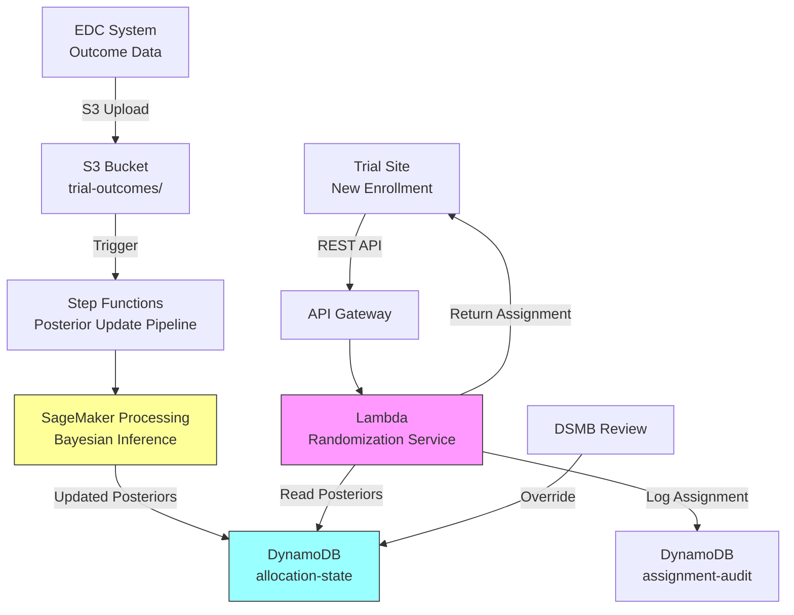

# Recipe 15.3: Clinical Trial Adaptive Randomization

**Complexity:** Simple-Medium · **Phase:** Research/Pilot · **Estimated Cost:** ~$200-800/month per active trial

---

## The Problem

Here's the ethical tension at the heart of every clinical trial: you're randomizing patients to treatment arms, and as data accumulates, you start to see that one arm is working better than the others. But you keep assigning patients to the inferior arm because the protocol says 50/50 randomization. Every patient assigned to the losing arm after you have reasonable evidence is a patient who could have received the better treatment.

Traditional fixed randomization (equal allocation across arms for the entire trial) is the gold standard for a reason. It maximizes statistical power, minimizes bias, and regulators understand it. But it has a real human cost: patients enrolled later in the trial receive no benefit from the information gathered from earlier patients. The trial learns, but the allocation doesn't adapt.

This isn't a hypothetical concern. In oncology trials where one arm has a 40% response rate and another has 15%, every additional patient randomized to the 15% arm after interim data shows the gap is a patient who received inferior care in the name of statistical purity. For rare diseases where enrollment takes years, the problem is even more acute. You might enroll 200 patients over three years, and by month 18 you have strong signal that Arm B is better, but 50 more patients still get randomized to Arm A.

Response-adaptive randomization (RAR) addresses this by adjusting allocation probabilities as trial data accumulates. If Arm B is showing better outcomes, more patients get assigned to Arm B. The trial still collects data on all arms (you never drop to zero allocation), but the balance shifts toward what's working. The result: fewer patients receive inferior treatments, the trial still reaches valid statistical conclusions, and you can often achieve the same statistical power with fewer total patients.

The catch? You need a system that can learn from accumulating data and make allocation decisions that balance exploration (learning about uncertain arms) with exploitation (assigning patients to the best-known arm). That's a reinforcement learning problem.

---

## The Technology: Adaptive Randomization and Bandit Algorithms

### What Is Response-Adaptive Randomization?

At its core, RAR is simple: instead of fixing allocation probabilities at the start of a trial (50/50 for two arms, 33/33/33 for three), you update them periodically based on observed outcomes. Patients enrolled early experience something close to equal randomization. As evidence accumulates, allocation shifts toward better-performing arms.

The key insight is that this is fundamentally an exploration-exploitation tradeoff. You want to exploit what you've learned (assign more patients to the better arm) while still exploring uncertain arms (maintain some allocation to gather more data and confirm your beliefs). This is exactly the problem that multi-armed bandit algorithms were designed to solve.

### Multi-Armed Bandits: The Foundation

The multi-armed bandit problem gets its name from a gambler facing a row of slot machines (one-armed bandits), each with an unknown payout probability. The gambler wants to maximize total reward over many pulls. Pull the machine that's paid out the most so far? Or try others that might be even better?

In clinical trials, each treatment arm is a "bandit." Each patient enrollment is a "pull." The "reward" is the patient outcome (response, survival, symptom improvement). The algorithm's job is to allocate patients across arms to maximize total good outcomes while still learning enough about each arm to make valid statistical inferences.

The most common approach for clinical trials is **Thompson Sampling** (also called Bayesian adaptive randomization). Here's how it works:

1. Start with a prior belief about each arm's effectiveness (usually uninformative: "we don't know anything yet")
2. As outcomes are observed, update the posterior distribution for each arm using Bayes' theorem
3. To randomize the next patient, sample from each arm's posterior distribution and assign the patient to whichever arm produced the highest sample
4. Repeat

The beauty of Thompson Sampling is that it naturally balances exploration and exploitation. Arms with uncertain posteriors (wide distributions) will occasionally produce high samples and get explored. Arms with well-characterized poor performance will rarely produce high samples and get allocated less. No tuning parameters needed.

For binary outcomes (response/no response), the posterior is typically a Beta distribution. For continuous outcomes, a Normal-Gamma. For time-to-event, things get more complex (we'll get there).

### Why This Is Harder Than It Sounds

(Ok, here's where the "simple" label starts to feel optimistic.)

**Delayed outcomes.** In many trials, you don't know if a treatment worked for weeks or months. A patient randomized today might not have an evaluable outcome for 90 days. During those 90 days, you're randomizing other patients based on incomplete information. The algorithm must handle "pending" outcomes gracefully, typically by only updating posteriors with confirmed results and maintaining allocation based on currently available data.

**Multiple endpoints.** Real trials rarely have a single binary outcome. You might care about tumor response AND progression-free survival AND quality of life AND toxicity. Combining these into a single "reward" signal requires careful clinical judgment and pre-specification in the protocol.

**Type I error control.** Here's the statistical landmine: adaptive randomization can inflate the Type I error rate (false positive rate) if you're not careful. When allocation probabilities depend on observed outcomes, the usual test statistics don't follow their assumed distributions. You need either simulation-based calibration of your test statistic or specialized methods (like the stratified exact test) that account for the adaptive design.

**Regulatory acceptance.** The FDA has issued guidance on adaptive designs (2019), and they're generally supportive of response-adaptive randomization. But "supportive" doesn't mean "rubber stamp." You need to pre-specify the adaptation rules, demonstrate through simulation that Type I error is controlled, and show that the design doesn't introduce operational bias. The EMA has similar expectations. This is not a "move fast and break things" domain.

**Operational bias.** If site staff can observe the allocation pattern shifting (more patients going to Arm B lately), they might infer which arm is winning. This can introduce selection bias (investigators steering certain patients toward enrollment when they think they'll get the "good" arm) or assessment bias. Blinding helps, but in open-label trials this is a real concern.

### The RL Formulation

Let's be precise about how this maps to reinforcement learning:

**State:** The current posterior beliefs about each arm's effectiveness, plus the number of patients enrolled per arm, plus any pending outcomes. In practice, this is a vector of sufficient statistics (e.g., successes and failures per arm for binary outcomes).

**Action:** The allocation probability vector for the next patient (or batch of patients). For K arms, this is a K-dimensional simplex.

**Reward:** The patient outcome. For binary endpoints, this is 0 or 1. For continuous endpoints, it's the observed value. For time-to-event, it's more complex (censored observations provide partial information).

**Policy:** The rule that maps state to action. Thompson Sampling is one policy. Others include:
- **Upper Confidence Bound (UCB):** Allocate to the arm with the highest upper confidence bound on its mean
- **Epsilon-greedy:** With probability epsilon, randomize uniformly; otherwise allocate to the best arm
- **Bayesian optimal allocation:** Solve for the allocation that maximizes expected total reward (computationally expensive)

For clinical trials, Thompson Sampling dominates because it naturally provides randomization (important for regulatory acceptance), handles uncertainty well, and has strong theoretical properties.

### Offline vs. Online Learning

This is one of the rare RL applications in healthcare where **online learning** is actually appropriate. Here's why:

In most healthcare RL (sepsis treatment, ventilator weaning), you can't experiment on patients. You must learn from historical data (offline RL) and prove the policy is safe before deployment. But clinical trials are, by definition, experiments. Patients have consented to be randomized. The entire point is to learn from their outcomes. The RL agent IS the randomization algorithm, and it's operating within the ethical framework of the trial protocol.

That said, you still need offline simulation during the design phase:
- Simulate the trial under various scenarios (null hypothesis, alternative hypothesis, different effect sizes)
- Verify Type I error control
- Estimate expected sample size savings
- Characterize the operating characteristics of the design

The online component runs during the actual trial, updating posteriors and computing allocation probabilities as real outcomes arrive.

### Where the Field Is Now

Adaptive randomization has moved from theoretical curiosity to practical deployment:

- The I-SPY 2 breast cancer trial (launched 2010, still running) uses Bayesian adaptive randomization across multiple experimental arms and has graduated several drugs to Phase III
- The REMAP-CAP platform trial for community-acquired pneumonia used response-adaptive randomization during COVID-19 to rapidly identify effective treatments
- The FDA's 2019 guidance on adaptive designs explicitly discusses response-adaptive randomization and provides a framework for regulatory submission
- Multiple CROs (contract research organizations) now offer adaptive trial design services with validated software platforms

The technology is proven. The challenge is implementation: getting the infrastructure right, the statistical properties validated, and the regulatory package assembled.

---

## General Architecture Pattern

At a conceptual level, an adaptive randomization system has these components:

```
[Outcome Data] → [Posterior Update Engine] → [Allocation Calculator] → [Randomization Service]
                                                                              ↓
[Trial Management System] ← ← ← ← ← ← ← ← ← ← ← ← ← ← ← ← ← [Assignment]
         ↓
[Outcome Collection] → [Outcome Data] (loop)
```

**Outcome Data Store.** A repository of confirmed patient outcomes, indexed by arm assignment and enrollment time. This feeds the learning engine. Must handle delayed outcomes (patients enrolled but not yet evaluable) and distinguish between "no outcome yet" and "treatment failure."

**Posterior Update Engine.** The Bayesian inference component. Takes the current outcome data and computes posterior distributions for each arm's effectiveness parameter. For simple binary endpoints, this is analytically tractable (Beta-Binomial conjugacy). For complex endpoints, you might need MCMC sampling.

**Allocation Calculator.** Implements the randomization policy (Thompson Sampling, UCB, etc.). Takes the current posteriors and produces allocation probabilities for the next patient. May include constraints: minimum allocation per arm (to ensure sufficient data for inference), maximum allocation (to prevent premature convergence), or stratification requirements.

**Randomization Service.** The operational interface. When a site enrolls a patient, it calls this service with the patient's stratification factors and receives an arm assignment. Must be highly available (sites can't wait), auditable (every assignment must be traceable), and deterministic given its inputs (for reproducibility).

**Trial Management System.** The broader clinical trial infrastructure: site management, data collection, monitoring, reporting. The adaptive randomization system plugs into this as the randomization module.

**Safety Monitoring.** An independent Data Safety Monitoring Board (DSMB) reviews accumulating data at pre-specified intervals. The adaptive system operates within bounds set by the DSMB. If safety signals emerge, the DSMB can pause enrollment or drop an arm entirely, independent of the allocation algorithm.

The key architectural principle: the randomization service must be stateless and deterministic given the current posterior state. All learning happens in the posterior update engine. The randomization service simply samples from the current posteriors. This separation makes the system auditable, reproducible, and testable.

---

## The AWS Implementation

### Why These Services

**Amazon SageMaker for the posterior update engine.** The Bayesian inference component needs to run on a schedule (after each batch of outcomes is confirmed) or on-demand (when triggered by new data). SageMaker Processing Jobs provide a managed compute environment for running the posterior update calculations. For simple conjugate models, this is lightweight. For complex models requiring MCMC, you can scale to larger instances. SageMaker also provides experiment tracking for the simulation studies during the design phase. Note that Processing Jobs have a 3-5 minute startup overhead (instance provisioning + container pull), so total time from trigger to updated allocation probabilities is 5-7 minutes for simple models. For trials needing faster updates, consider a persistent SageMaker endpoint or a Lambda function (feasible for conjugate Beta-Binomial models where the computation is trivial).

**AWS Lambda for the randomization service.** When a site enrolls a patient, the system needs to return an arm assignment in under a second. Lambda provides a stateless, highly available compute layer that reads the current allocation probabilities (pre-computed by the posterior engine) and performs the randomized assignment. The function is simple: read probabilities, generate random number, assign arm, log the assignment.

**Amazon DynamoDB for state storage.** Two tables: one for the current posterior parameters (updated by the SageMaker job), one for the assignment audit log (every randomization decision with its inputs and outputs). DynamoDB's single-digit millisecond reads make it ideal for the Lambda function's hot path. The audit log table provides the complete reproducibility trail that regulators require. Enable Point-in-Time Recovery (PITR) on both tables; the S3 posterior history provides a secondary recovery path if the allocation-state table must be rebuilt.

**Amazon S3 for outcome data and simulation results.** Raw outcome data from the EDC (Electronic Data Capture) system lands in S3. Simulation results from the design phase live here too. S3 also stores the posterior update history for retrospective analysis. Configure S3 Object Lock (compliance mode) for trial records that must be retained per 21 CFR 11.10(c).

**AWS Step Functions for orchestration.** The posterior update pipeline (ingest new outcomes, validate, run Bayesian update, publish new allocation probabilities) is a multi-step workflow that needs error handling, retry logic, and audit logging. Step Functions provides this orchestration with built-in state tracking.

**Amazon API Gateway for the randomization endpoint.** Sites call a REST API to get arm assignments. API Gateway provides authentication, throttling, and request logging in front of the Lambda function. Use a Regional endpoint for multi-site access over the internet, or a Private endpoint if sites connect via VPN/Direct Connect to the VPC. Consider AWS WAF on API Gateway for rate limiting and IP allowlisting to restrict access to known site IP ranges.

### Architecture Diagram



### Prerequisites

| Requirement | Details |
|-------------|---------|
| **AWS Services** | Amazon SageMaker, AWS Lambda, Amazon DynamoDB, Amazon S3, AWS Step Functions, Amazon API Gateway, Amazon CloudWatch, AWS WAF |
| **IAM Permissions** | `sagemaker:CreateProcessingJob`, `lambda:InvokeFunction`, `dynamodb:GetItem`, `dynamodb:PutItem`, `s3:GetObject`, `s3:PutObject`, `states:StartExecution` |
| **BAA** | AWS BAA signed (trial data includes patient identifiers and outcomes) |
| **Encryption** | S3: SSE-KMS with customer-managed key (CMK); DynamoDB: encryption at rest; all API calls over TLS; Lambda environment variables encrypted with customer-managed KMS key (enables CloudTrail visibility into key usage for Part 11 audit requirements) |
| **VPC** | Production: Lambda and SageMaker in VPC with VPC endpoints for DynamoDB, S3, CloudWatch Logs, and KMS. Note: KMS uses an interface endpoint (billed per AZ-hour) unlike S3 and DynamoDB gateway endpoints (free). |
| **CloudTrail** | Enabled: log all API calls for regulatory audit trail |
| **21 CFR Part 11** | If FDA-regulated: electronic records must meet Part 11 requirements (audit trails, access controls, electronic signatures). CloudTrail + DynamoDB audit log + IAM provides the foundation. |
| **Data Retention** | Clinical trial records must be retained per 21 CFR 11.10(c) (minimum 2 years post-approval or investigation termination). Use S3 Object Lock (compliance mode) and disable DynamoDB table deletion for the audit log table. |
| **Sample Data** | Simulated trial data. Generate synthetic patient outcomes using known response rates. Never use real trial data in development. |
| **Cost Estimate** | SageMaker Processing: ~$0.10-0.50 per posterior update (runs minutes, not hours). Lambda: negligible (millisecond executions). DynamoDB: ~$5-20/month for typical trial volumes. Total: $200-800/month depending on trial size and update frequency. |

### Ingredients

| AWS Service | Role |
|------------|------|
| **Amazon SageMaker** | Runs Bayesian posterior updates; hosts simulation studies during design phase |
| **AWS Lambda** | Stateless randomization service; returns arm assignments in <1 second |
| **Amazon DynamoDB** | Stores current allocation state and complete assignment audit log |
| **Amazon S3** | Stores outcome data, simulation results, and posterior history |
| **AWS Step Functions** | Orchestrates the posterior update pipeline with error handling |
| **Amazon API Gateway** | REST endpoint for site enrollment requests; authentication and throttling |
| **Amazon CloudWatch** | Monitoring, alerting on randomization failures or unusual patterns |
| **AWS KMS** | Encryption key management for all data at rest (customer-managed keys for Part 11 auditability) |
| **AWS WAF** | Rate limiting and IP allowlisting for the randomization API |

### Code

#### Walkthrough

**Step 1: Initialize trial parameters.** Before the trial starts, you define the prior distributions for each arm, the allocation constraints, and the update schedule. This configuration is the "protocol" for the adaptive system. It must be locked before the first patient is enrolled (protocol amendments require regulatory approval). The priors are typically uninformative (Beta(1,1) for binary outcomes, meaning "we know nothing"), but can incorporate historical data if justified. Minimum allocation constraints prevent any arm from dropping below a floor (typically 10-20%) to ensure sufficient data for inference.

```
CONFIGURATION:
    trial_id          = "TRIAL-2026-001"
    arms              = ["Control", "Treatment_A", "Treatment_B"]
    endpoint_type     = "binary"           // response vs. no response
    
    // Prior distributions: Beta(alpha, beta) for each arm
    // Beta(1,1) = uniform prior = "we have no prior information"
    priors = {
        "Control":     Beta(alpha=1, beta=1),
        "Treatment_A": Beta(alpha=1, beta=1),
        "Treatment_B": Beta(alpha=1, beta=1)
    }
    
    // Allocation constraints
    min_allocation    = 0.10    // no arm drops below 10% allocation
    max_allocation    = 0.80    // no arm exceeds 80% (prevents premature convergence)
    burn_in_patients  = 30      // first 30 patients get equal randomization (10 per arm)
                                // this ensures minimum data before adaptation begins
    
    // Update schedule
    update_trigger    = "every 10 confirmed outcomes"  // or "weekly", depending on enrollment rate
```

**Step 2: Posterior update.** When new outcomes arrive, the system updates its beliefs about each arm's effectiveness. For binary outcomes with Beta priors, this is analytically simple: add successes to alpha, add failures to beta. The posterior is Beta(alpha + successes, beta + failures). This step runs as a batch job (SageMaker Processing) triggered by the Step Functions orchestrator whenever the update criteria are met. The output is a new set of posterior parameters stored in DynamoDB, immediately available to the randomization service.

```
FUNCTION update_posteriors(trial_id):
    // Load current posterior state
    current_state = read from DynamoDB table "allocation-state" where key = trial_id
    
    // Load new confirmed outcomes since last update
    new_outcomes = read from S3 "trial-outcomes/{trial_id}/confirmed/"
                   where timestamp > current_state.last_update
    
    // Update posteriors for each arm
    FOR each arm in current_state.arms:
        // Count successes and failures in new data for this arm
        arm_outcomes = filter new_outcomes where assignment == arm
        new_successes = count(arm_outcomes where outcome == "response")
        new_failures  = count(arm_outcomes where outcome == "no_response")
        
        // Bayesian update: conjugate Beta-Binomial
        // New posterior = Beta(alpha + successes, beta + failures)
        current_state.posteriors[arm].alpha += new_successes
        current_state.posteriors[arm].beta  += new_failures
    
    // Compute new allocation probabilities using Thompson Sampling
    // Run many simulated draws to estimate allocation probabilities
    allocation_probs = compute_thompson_allocation(current_state.posteriors,
                                                    min_allocation,
                                                    max_allocation)
    
    // Store updated state
    write to DynamoDB "allocation-state":
        trial_id         = trial_id
        posteriors       = current_state.posteriors
        allocation_probs = allocation_probs
        last_update      = current timestamp
        total_enrolled   = current_state.total_enrolled
        version          = current_state.version + 1   // optimistic locking
    
    // Log the update for audit trail
    write to S3 "trial-outcomes/{trial_id}/posterior-history/{timestamp}.json":
        full state snapshot including posteriors, allocation probs, and input data counts

    RETURN allocation_probs
```

**Step 3: Compute Thompson Sampling allocation.** This is the core RL logic. To determine allocation probabilities, we simulate many draws from each arm's posterior and count how often each arm "wins" (produces the highest sampled value). The winning frequency becomes the allocation probability, subject to the min/max constraints. This approach naturally balances exploration and exploitation: arms with uncertain posteriors (wide distributions) occasionally win and get explored; arms with well-characterized poor performance rarely win.

```
FUNCTION compute_thompson_allocation(posteriors, min_alloc, max_alloc):
    num_simulations = 10000   // more simulations = more stable probabilities
    win_counts = initialize all arms to 0
    
    FOR i = 1 to num_simulations:
        // Draw one sample from each arm's posterior
        samples = {}
        FOR each arm, params in posteriors:
            samples[arm] = random draw from Beta(params.alpha, params.beta)
        
        // Which arm had the highest sampled value?
        winner = arm with maximum value in samples
        win_counts[winner] += 1
    
    // Raw allocation = fraction of simulations each arm won
    raw_allocation = {}
    FOR each arm in posteriors:
        raw_allocation[arm] = win_counts[arm] / num_simulations
    
    // Apply constraints: clip to [min_alloc, max_alloc] and renormalize
    constrained = apply_allocation_constraints(raw_allocation, min_alloc, max_alloc)
    
    RETURN constrained


FUNCTION apply_allocation_constraints(raw_probs, min_alloc, max_alloc):
    // Clip each probability to the allowed range
    clipped = {}
    FOR each arm, prob in raw_probs:
        clipped[arm] = clip(prob, min_alloc, max_alloc)
    
    // Renormalize so probabilities sum to 1.0
    total = sum of all values in clipped
    FOR each arm in clipped:
        clipped[arm] = clipped[arm] / total
    
    RETURN clipped
```

**Step 4: Randomize a patient.** When a site enrolls a new patient, the randomization service reads the current allocation probabilities and performs a weighted random draw. The assignment, along with all inputs (allocation probabilities, random seed, timestamp, stratification factors), is logged to the audit table. This function must be fast (sub-second), highly available (sites can't wait), and perfectly auditable (every assignment must be reproducible given its inputs).

In production, the assignment write and enrollment counter increment must be atomic (use a DynamoDB transaction). A patient assignment without a corresponding counter increment creates an audit discrepancy that regulators will flag. The pseudocode below shows the logical steps; see the Python companion for the transactional implementation pattern.

```
FUNCTION randomize_patient(trial_id, patient_id, stratification_factors):
    // Read current allocation state
    state = read from DynamoDB "allocation-state" where key = trial_id
    
    // Check if we're still in burn-in period (equal randomization)
    IF state.total_enrolled < burn_in_patients:
        allocation_probs = equal probability across all arms
    ELSE:
        allocation_probs = state.allocation_probs
    
    // Generate assignment using weighted random draw
    // Use a cryptographically secure random number for regulatory compliance
    random_value = secure_random_float(0, 1)
    assigned_arm = weighted_choice(state.arms, allocation_probs, random_value)
    
    // Log the complete assignment record (audit trail)
    assignment_record = {
        trial_id:              trial_id,
        patient_id:            patient_id,
        assigned_arm:          assigned_arm,
        allocation_probs:      allocation_probs,       // what the probabilities were at assignment time
        random_value:          random_value,           // the random number used (for reproducibility)
        state_version:         state.version,          // which posterior version was active
        stratification:        stratification_factors,
        timestamp:             current UTC timestamp,
        total_enrolled_at_time: state.total_enrolled
    }
    
    // IMPORTANT: These two writes must be atomic in production.
    // Use DynamoDB TransactWriteItems to write the assignment record
    // AND increment the enrollment counter in a single transaction.
    write to DynamoDB "assignment-audit": assignment_record
    atomic increment state.total_enrolled in DynamoDB "allocation-state"
    
    RETURN assigned_arm
```

**Step 5: Safety monitoring integration.** The DSMB (Data Safety Monitoring Board) operates independently of the adaptive algorithm. At pre-specified intervals, they review unblinded data and can override the system: pause enrollment, drop an arm for futility or safety, or stop the trial entirely. The system must support these overrides cleanly, without corrupting the allocation state.

DSMB override actions require a separate IAM role with explicit `dynamodb:PutItem` permission scoped to the allocation-state table, restricted to authorized DSMB statisticians. Consider requiring MFA or a step-up authentication mechanism for arm-dropping actions, as these are irreversible and affect patient safety.

```
FUNCTION apply_dsmb_override(trial_id, override_type, parameters):
    // DSMB decisions override the algorithm
    // These are human decisions with regulatory authority
    
    state = read from DynamoDB "allocation-state" where key = trial_id
    
    IF override_type == "DROP_ARM":
        // Remove arm from active allocation
        // Remaining arms get its probability redistributed proportionally
        dropped_arm = parameters.arm
        removed_prob = state.allocation_probs[dropped_arm]
        
        delete state.allocation_probs[dropped_arm]
        delete state.posteriors[dropped_arm]
        
        // Redistribute to remaining arms proportionally
        remaining_total = sum of remaining allocation_probs
        FOR each arm in state.allocation_probs:
            state.allocation_probs[arm] = state.allocation_probs[arm] / remaining_total
    
    ELSE IF override_type == "PAUSE_ENROLLMENT":
        state.enrollment_paused = true
        // Randomization service will reject new requests until resumed
    
    ELSE IF override_type == "STOP_TRIAL":
        state.trial_stopped = true
        // No further randomizations possible
    
    // Write with optimistic locking (same pattern as posterior updates)
    // to prevent concurrent override and posterior update from conflicting
    write updated state to DynamoDB "allocation-state"
        with ConditionExpression: version == state.version
        set version = state.version + 1
    
    // Log the override with full context
    write override record to DynamoDB "assignment-audit" with:
        type = "DSMB_OVERRIDE"
        details = override_type, parameters, timestamp, authorized_by
```

> **Curious how this looks in Python?** The pseudocode above covers the concepts. If you'd like to see sample Python code that demonstrates these patterns using boto3, check out the [Python Example](chapter15.03-python-example). It walks through each step with inline comments and notes on what you'd need to change for a real deployment.

### Expected Results

**Sample allocation state after 100 patients enrolled (simulated trial with true response rates: Control=30%, Treatment_A=45%, Treatment_B=25%):**

```json
{
  "trial_id": "TRIAL-2026-001",
  "total_enrolled": 100,
  "posteriors": {
    "Control":     {"alpha": 13, "beta": 24, "mean": 0.35},
    "Treatment_A": {"alpha": 21, "beta": 22, "mean": 0.49},
    "Treatment_B": {"alpha": 7,  "beta": 23, "mean": 0.23}
  },
  "allocation_probs": {
    "Control":     0.18,
    "Treatment_A": 0.68,
    "Treatment_B": 0.14
  },
  "last_update": "2026-09-15T14:30:00Z",
  "version": 12
}
```

**Performance benchmarks:**

| Metric | Typical Value |
|--------|---------------|
| Randomization latency | 50-200ms (API Gateway + Lambda + DynamoDB read) |
| Posterior update time | 10-60 seconds compute + 3-5 minutes startup (SageMaker Processing cold start) |
| Allocation stability | Probabilities shift gradually; no sudden jumps after burn-in |
| Sample size savings | 10-30% fewer patients needed vs. fixed randomization (scenario-dependent) |
| Type I error | Controlled at 0.05 (verified through simulation during design phase) |
| Availability | 99.9%+ (Lambda + DynamoDB multi-AZ) |

**Where it struggles:**

- Trials with very delayed outcomes (6+ months to evaluate). The algorithm adapts slowly because it has few confirmed outcomes to learn from.
- Trials with many arms (5+). Thompson Sampling spreads allocation thinly and takes longer to identify winners.
- Non-binary endpoints (time-to-event, continuous). The Bayesian machinery gets more complex and computationally expensive.
- Multi-site trials with high concurrent enrollment. Multiple patients randomized between posterior updates all use the same allocation probabilities. Over many patients, the law of large numbers ensures correct aggregate allocation, but short-term deviations from target probabilities are possible. For trials requiring strict sequential randomization, add a DynamoDB conditional write with a sequence number to serialize assignments.

---

## The Honest Take

The math here is genuinely elegant. Thompson Sampling for clinical trials is one of those ideas that feels obviously right once you understand it. The implementation is not that hard either. A Beta-Binomial model with Thompson Sampling is maybe 50 lines of core logic.

What's hard is everything around the algorithm:

**The simulation studies take months.** Before you can run an adaptive trial, you need to simulate it under dozens of scenarios (different true effect sizes, different enrollment rates, different dropout patterns) and demonstrate that your Type I error is controlled and your power is adequate. This is a biostatistician's job, not a software engineer's, and it takes 3-6 months of careful work.

**The regulatory package is substantial.** You're not just submitting a protocol. You're submitting the adaptation algorithm, the simulation results, the operating characteristics, and a justification for why adaptive randomization is appropriate for this specific trial. The FDA will review all of it.

**Operational complexity is real.** Your EDC system needs to integrate with the randomization service. Outcome data needs to flow reliably and promptly. Sites need training on the adaptive design. The DSMB needs access to unblinded allocation data. The randomization service needs to be available 24/7 because sites enroll patients at all hours.

**The sample size savings are often modest.** In the literature, you'll see claims of 20-40% sample size reduction. In practice, for well-powered trials with moderate effect sizes, the savings are often 10-20%. The ethical benefit (fewer patients on inferior arms) is real but harder to quantify in a regulatory submission.

The part that surprised me: the biggest resistance isn't technical or regulatory. It's cultural. Investigators are trained on fixed randomization. Biostatisticians are comfortable with standard analyses. Introducing adaptive designs requires educating the entire trial team, and that education effort is often underestimated.

Start with a trial where the ethical case is strong (rare disease, high unmet need, large expected effect size) and where the sponsor has experience with adaptive designs. Don't make your first adaptive trial a pivotal Phase III registration study.

---

## Variations and Extensions

**Platform trials with multiple experimental arms.** Instead of a fixed set of arms, new experimental treatments can enter the trial while others graduate (to Phase III) or are dropped (for futility). The I-SPY 2 model. This requires a smarter allocation engine that handles arms coming and going while keeping the statistics valid. The architecture extends naturally: add arm management endpoints and modify the posterior engine to handle variable-length arm vectors.

**Bayesian predictive probability for early stopping.** Beyond allocation adaptation, compute the predictive probability that each arm will demonstrate superiority at the planned final analysis. If an arm's predictive probability drops below a futility threshold (e.g., <5% chance of winning at final analysis), recommend dropping it to the DSMB. This accelerates the trial by removing clearly inferior arms early.

**Covariate-adjusted adaptive randomization.** Instead of a single allocation probability per arm, compute patient-specific allocation based on baseline covariates (biomarkers, disease severity, demographics). Patients predicted to respond better to Treatment A get higher allocation to Treatment A. This requires a more complex model (contextual bandits rather than simple bandits) but can further improve outcomes. Regulatory acceptance is less established for this approach.

---

## Related Recipes

- **Recipe 15.1 (Alert Threshold Optimization):** Uses the same Thompson Sampling foundation but in a simpler operational context (no regulatory constraints)
- **Recipe 15.2 (Notification Timing Optimization):** Another bandit application with clearer reward signals and lower stakes
- **Recipe 15.4 (Sepsis Treatment Optimization):** Offline RL for clinical decisions; contrasts with this recipe's online learning approach
- **Recipe 14.9 (Chemotherapy Scheduling):** Optimization in oncology trials; complementary to adaptive randomization for dose-finding

---

## Additional Resources

**AWS Documentation:**
- [Amazon SageMaker Processing Jobs](https://docs.aws.amazon.com/sagemaker/latest/dg/processing-job.html)
- [AWS Lambda Developer Guide](https://docs.aws.amazon.com/lambda/latest/dg/welcome.html)
- [Amazon DynamoDB Developer Guide](https://docs.aws.amazon.com/amazondynamodb/latest/developerguide/Introduction.html)
- [AWS Step Functions Developer Guide](https://docs.aws.amazon.com/step-functions/latest/dg/welcome.html)
- [AWS HIPAA Eligible Services](https://aws.amazon.com/compliance/hipaa-eligible-services-reference/)
- [Architecting for HIPAA on AWS](https://docs.aws.amazon.com/whitepapers/latest/architecting-hipaa-security-and-compliance-on-aws/welcome.html)

**Regulatory Guidance:**
- [FDA Guidance: Adaptive Designs for Clinical Trials of Drugs and Biologics (2019)](https://www.fda.gov/regulatory-information/search-fda-guidance-documents/adaptive-designs-clinical-trials-drugs-and-biologics)
- [FDA Guidance: Master Protocols for Drug and Biological Products (2022)](https://www.fda.gov/regulatory-information/search-fda-guidance-documents/master-protocols-efficient-clinical-trial-design-strategies-expedite-development-oncology-drugs-and)

**Key References:**
<!-- TODO (TechWriter): Verify URL for Berry et al. "Bayesian Adaptive Methods for Clinical Trials" (CRC Press) -->
<!-- TODO (TechWriter): Verify URL for Thall & Wathen (2007) "Practical Bayesian adaptive randomisation in clinical trials" (European Journal of Cancer) -->

---

## Estimated Implementation Time

| Scope | Timeline |
|-------|----------|
| **Basic** (simulation study + simple binary endpoint + single-site) | 3-4 months |
| **Production-ready** (multi-site + EDC integration + regulatory package + DSMB dashboard) | 8-12 months |
| **With variations** (platform trial + predictive probability + covariate adjustment) | 12-18 months |

---

**Tags:** `reinforcement-learning`, `clinical-trials`, `adaptive-design`, `thompson-sampling`, `bayesian`, `multi-armed-bandit`, `randomization`, `regulatory`, `fda`

---

| [← Recipe 15.2: Notification Timing Optimization](chapter15.02-notification-timing-optimization) | [Chapter 15 Index](chapter15-index) | [Recipe 15.4: Sepsis Treatment Optimization →](chapter15.04-sepsis-treatment-optimization) |
|:---|:---:|---:|
