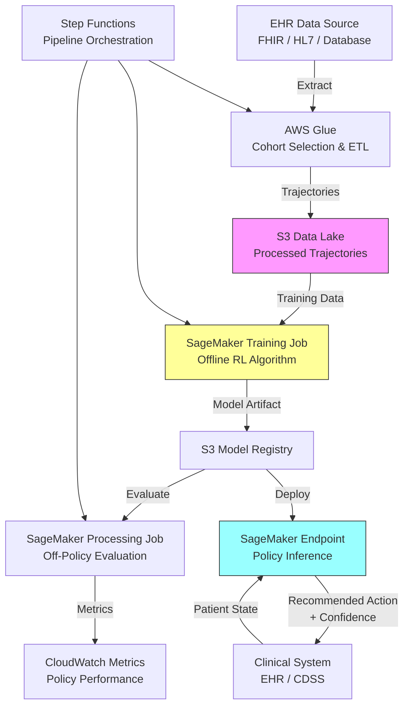

# Recipe 15.4: Sepsis Treatment Optimization

**Complexity:** Medium · **Phase:** Research/Pilot · **Estimated Cost:** ~$2,000–$8,000/month (training infrastructure)

---

## The Problem

Sepsis kills more people in hospitals than heart attacks. Roughly 1.7 million adults develop sepsis in the US each year, and somewhere between 250,000 and 350,000 of them die. The mortality rate varies wildly depending on how quickly treatment starts and how well it's managed in those critical first hours. Here's the thing that makes this problem so maddening: the treatment decisions are sequential, interdependent, and time-sensitive. A clinician managing a septic patient in the ICU is making dozens of decisions per hour. How much IV fluid? Which vasopressor, and at what dose? When to start antibiotics, and which ones? When to escalate, when to hold steady, when to back off.

There's no single "right answer" for sepsis management. The Surviving Sepsis Campaign guidelines provide a framework, but within that framework there's enormous variation in practice. Two equally skilled intensivists will manage the same patient differently. Some of that variation is justified (patient-specific factors), and some of it isn't (habit, training bias, cognitive load at 3 AM). Studies have shown that adherence to sepsis bundles varies from 30% to 70% across institutions, and that variation correlates with mortality differences.

The question that's been driving a decade of research: can we learn, from the thousands of sepsis cases already treated, a treatment policy that would have produced better outcomes than what clinicians actually did? Not replacing clinicians. Augmenting them. Identifying patterns in the data that suggest "patients like this one tend to do better when you give more fluid earlier" or "backing off vasopressors sooner in this patient profile reduces organ damage."

This is a reinforcement learning problem. The patient's physiological state evolves over time. Each treatment decision changes that trajectory. The goal is to learn a policy (a mapping from patient states to treatment actions) that maximizes some measure of patient outcome. And it's one of the most studied RL applications in healthcare, which means we know a lot about both the promise and the pitfalls.

---

## The Technology: Reinforcement Learning for Sequential Medical Decisions

### What Is Reinforcement Learning?

Reinforcement learning (RL) is a framework for learning optimal decision-making in sequential settings. Unlike supervised learning (where you have labeled examples of correct answers), RL learns from the consequences of actions. An agent observes a state, takes an action, receives a reward signal, transitions to a new state, and repeats. Over many episodes, the agent learns which actions in which states lead to the best cumulative reward.

The core components:

- **State (s):** A representation of the current situation. In sepsis, this is the patient's physiological status at a given time point: vital signs, lab values, fluid balance, current medications, time since admission.
- **Action (a):** The decision to be made. In sepsis, this is typically discretized into treatment choices: fluid volume, vasopressor dose, antibiotic selection.
- **Reward (r):** A signal indicating how good the outcome was. In sepsis, this is usually tied to survival, organ function scores, or ICU length of stay.
- **Policy (π):** The learned mapping from states to actions. This is what we're trying to optimize.
- **Value function (V or Q):** An estimate of the expected cumulative future reward from a given state (or state-action pair). The policy is derived from this.

What we're optimizing: find the policy π that maximizes expected cumulative reward. The math: π* = argmax E[Σ γ^t * r_t], where γ discounts future rewards (we care about long-term survival but prefer getting there sooner).

### Offline RL: Learning from Historical Data

Here's the critical constraint in healthcare: you cannot explore freely. In a video game, an RL agent can try random actions and learn from failures. In an ICU, you cannot randomly withhold fluids from a septic patient to see what happens. This means we must use **offline reinforcement learning** (also called batch RL). The agent learns entirely from historical data: records of what clinicians actually did, what happened to the patient, and what the outcome was.

Offline RL uses a dataset of trajectories: sequences of (state, action, reward, next_state) tuples collected under some historical behavior policy (whatever the clinicians actually did). The goal is to learn a policy that would perform better than the historical behavior, without ever actually deploying that policy on real patients during training.

This introduces a fundamental challenge called **distribution shift** (or the off-policy problem). The agent is learning about actions it never actually took. If the historical data shows that clinicians always gave high-dose vasopressors to patients with MAP below 65, the agent has no data about what would have happened if they hadn't. Estimating the value of untaken actions from observational data is statistically treacherous.

The main offline RL algorithms used in sepsis research:

**Fitted Q-Iteration (FQI).** Iteratively estimates the Q-function (expected reward for each state-action pair) using regression. Simple, well-understood, but can diverge if the function approximator is too expressive.

**Conservative Q-Learning (CQL).** Adds a penalty for overestimating the value of actions that are underrepresented in the data. This addresses the distribution shift problem by being pessimistic about unfamiliar actions. If the data doesn't show what happens when you give zero fluids to a hypotensive patient, CQL won't optimistically assume it works out.

**Batch-Constrained Q-Learning (BCQ).** Restricts the learned policy to only select actions that are similar to what was observed in the data. If clinicians never gave a particular drug combination, BCQ won't recommend it, even if the Q-function suggests it might be good.

**Decision Transformer.** A more recent approach that frames RL as a sequence modeling problem. Instead of learning value functions, it learns to predict actions conditioned on desired outcomes. "Given that I want the patient to survive, what sequence of actions should I take from this state?"

### The MDP Formulation for Sepsis

The standard formulation (following the influential work by Komorowski et al., 2018) discretizes the problem:

**State space.** Patient features at each time step (typically every 4 hours): vital signs (heart rate, blood pressure, temperature, respiratory rate, SpO2), lab values (lactate, creatinine, bilirubin, platelets, WBC, pH, PaO2/FiO2), fluid balance (cumulative input/output), SOFA score components, demographics, and time since ICU admission. These are often clustered into discrete states (e.g., 750 states using k-means clustering on the feature vectors) or used as continuous features with neural network function approximators.

**Action space.** Typically discretized into a grid of (IV fluid volume, vasopressor dose) combinations. A common choice is 5 levels of IV fluids × 5 levels of vasopressors = 25 discrete actions. Some formulations add antibiotic timing as a third dimension.

**Reward.** This is where it gets philosophically interesting. Common choices:
- Terminal reward only: +15 for survival at 90 days, -15 for death. Simple but sparse.
- Intermediate rewards: SOFA score changes (improvement = positive reward, deterioration = negative). Provides denser signal but introduces assumptions about what "better" means at each step.
- Composite: terminal survival reward plus intermediate lactate clearance or MAP maintenance bonuses.

**Transition dynamics.** Learned implicitly from the data. The agent doesn't model how the patient's physiology evolves; it just observes the empirical transitions in the historical dataset.

**Discount factor (γ).** Typically 0.99 for 4-hour time steps, reflecting that we care about long-term survival but slightly prefer getting there sooner.

### Why This Is Hard (Beyond the Obvious)

**Confounding.** Clinicians don't treat randomly. Sicker patients get more aggressive treatment. If you naively learn from observational data, you might conclude that vasopressors cause death (because patients who received high-dose vasopressors died more often). This is confounding, not causation. Addressing it requires careful state representation (include enough variables to capture the patient's true severity) or explicit causal inference methods.

**Partial observability.** The state representation never captures everything the clinician knew. The nurse noticed the patient looked "off." The attending had a gut feeling based on 20 years of experience. The family mentioned the patient had been declining for days before admission. None of this is in the structured EHR data. The RL agent is making decisions based on an incomplete picture.

**Non-stationarity.** Treatment protocols change over time. A policy learned from 2015-2018 data may not be optimal for 2026 patients, because the standard of care has shifted, new drugs are available, and patient populations have changed.

**Evaluation is the hardest part.** How do you know if your learned policy is actually better than what clinicians did? You can't deploy it and see (not without extensive safety validation). You're stuck with off-policy evaluation (OPE): estimating how well the policy would have performed using historical data. OPE methods (importance sampling, doubly robust estimators, fitted Q-evaluation) all have significant variance and bias issues, especially when the learned policy differs substantially from the behavior policy.

### General Architecture Pattern

```
[EHR Data] → [Cohort Selection & Preprocessing] → [State/Action/Reward Construction]
    → [Offline RL Training] → [Off-Policy Evaluation] → [Clinical Validation]
    → [Decision Support Interface]
```

**Cohort selection.** Identify sepsis patients from historical EHR data using clinical criteria (Sepsis-3 definitions: suspected infection plus organ dysfunction). Exclude patients with DNR/comfort-care-only orders, those who died within the first hour (no opportunity for treatment optimization), and those with incomplete data.

**Preprocessing.** Handle missing values (forward-fill for vitals, imputation for labs), align to regular time steps (4-hour windows), normalize features, and construct the trajectory format: sequences of (state, action, reward, next_state) tuples per patient.

**State construction.** Extract and engineer features at each time step. Decide between discrete state spaces (clustering) and continuous representations (neural networks). Include enough clinical context to mitigate confounding.

**Action discretization.** Map continuous treatment variables (mL of fluid, mcg/kg/min of vasopressor) into discrete bins. The granularity tradeoff: more bins give finer control but require more data to learn reliably.

**Reward engineering.** Define what "good" means. This is a clinical and ethical decision, not just a technical one. Involve clinicians in reward design.

**Training.** Apply offline RL algorithm (FQI, CQL, BCQ, or Decision Transformer) to learn the optimal policy from the historical trajectories.

**Evaluation.** Use off-policy evaluation to estimate the learned policy's performance. Compare against the clinician behavior policy and against simple baselines (always give max fluids, always follow guidelines exactly). Use multiple OPE methods and report confidence intervals.

**Clinical validation.** Before any deployment: review learned policies with domain experts. Do the recommendations make clinical sense? Are there obvious failure modes? Would a clinician trust this recommendation in context?

---

## The AWS Implementation

### Why These Services

**Amazon SageMaker for model training and experimentation.** Sepsis RL training involves iterating on state representations, reward functions, and algorithm hyperparameters. SageMaker provides managed notebook instances for exploration, training jobs with configurable compute (GPU instances for neural network-based approaches), and experiment tracking to compare policy variants. The managed infrastructure means you're not maintaining GPU clusters between training runs.

**Amazon S3 for data lake storage.** The preprocessed EHR trajectories, trained model artifacts, evaluation results, and audit logs all live in S3. Versioning tracks which dataset version produced which policy. Lifecycle policies manage the retention of intermediate artifacts.

<!-- TODO (TechWriter): Expert review A4 (MEDIUM). Add model versioning and rollback strategy: use SageMaker Model Registry with approval workflows, run OPE comparison of new vs. deployed policy, implement canary deployment pattern with automatic rollback on degraded safety constraint or clinician override rates. -->

**AWS Glue for ETL and cohort construction.** Extracting sepsis cohorts from raw EHR data involves complex SQL-like transformations: joining diagnosis tables with lab results, vital signs, and medication administration records; applying Sepsis-3 criteria; constructing time-aligned trajectories. Glue handles this at scale without provisioning Spark clusters manually.

**Amazon DynamoDB for policy serving.** Once a policy is validated and approved for clinical decision support, the state-to-action mapping needs to be served with low latency. For discrete state spaces, DynamoDB provides single-digit-millisecond lookups. For neural network policies, SageMaker endpoints handle inference.

<!-- TODO (TechWriter): Expert review A3 (MEDIUM). Clarify that this recipe's code uses continuous states with a neural Q-network (SageMaker endpoint). DynamoDB is the alternative for discretized state spaces (750 k-means clusters). Recommend choosing one approach and noting the tradeoff. -->

**Amazon SageMaker Endpoints for real-time inference.** If the policy uses a neural network (continuous state space), a SageMaker real-time endpoint serves predictions. The clinician-facing system sends the current patient state, the endpoint returns the recommended action with confidence information.

**AWS Step Functions for pipeline orchestration.** The full pipeline (data extraction, preprocessing, training, evaluation, model registration) is a multi-step workflow with dependencies. Step Functions coordinates the sequence, handles retries, and provides visibility into pipeline state.

**Amazon CloudWatch for monitoring and alerting.** Track model inference latency, prediction distribution drift (are we seeing patient states outside the training distribution?), and system health. Alert on anomalies that might indicate the model is being queried with out-of-distribution inputs.

<!-- TODO (TechWriter): Expert review A2 (HIGH). Add concrete distribution shift detection mechanism: compute training-time state mean/covariance, use Mahalanobis distance at inference to flag OOD states, suppress low-confidence recommendations, track OOD percentage in CloudWatch with alarms for rising rates. -->

### Architecture Diagram



### Prerequisites

| Requirement | Details |
|-------------|---------|
| **AWS Services** | Amazon SageMaker, Amazon S3, AWS Glue, Amazon DynamoDB, AWS Step Functions, Amazon CloudWatch |
| **IAM Permissions** | `sagemaker:CreateTrainingJob`, `sagemaker:CreateEndpoint`, `s3:GetObject`, `s3:PutObject`, `glue:StartJobRun`, `dynamodb:PutItem`, `dynamodb:GetItem`, `states:StartExecution` |
<!-- TODO (TechWriter): Expert review S1 (HIGH). Replace flat IAM permission list with role-separated guidance: separate roles per pipeline stage (Glue ETL, SageMaker training, inference endpoint, Step Functions orchestration) with resource-scoped ARN constraints. -->
| **BAA** | AWS BAA signed (required: patient physiological data is PHI) |
| **Encryption** | S3: SSE-KMS for all trajectory data and model artifacts; DynamoDB: encryption at rest; SageMaker: KMS-encrypted training volumes and endpoints; all API calls over TLS |
| **VPC** | Production: SageMaker in VPC with VPC endpoints for S3, DynamoDB, CloudWatch Logs. No public internet access for training jobs processing PHI. |
<!-- TODO (TechWriter): Expert review N1 (MEDIUM). Expand VPC endpoint list to include SageMaker API, SageMaker Runtime, and KMS interface endpoints. Without these, private subnet deployment requires NAT Gateway (egress point for PHI) or fails entirely. Note per-AZ-hour cost (~$7.20/month per endpoint per AZ). -->
| **CloudTrail** | Enabled: log all SageMaker, S3, and Glue API calls for audit trail |
| **Data Requirements** | Minimum 10,000-20,000 sepsis episodes with complete trajectory data (vitals q4h, labs, medication administration records). MIMIC-III/IV for research; institutional EHR data for production. |
| **IRB Approval** | Required before accessing patient data for model development. This is research, not routine operations. |
| **Cost Estimate** | Training: $50-200 per training run (ml.p3.2xlarge, 2-8 hours). Inference endpoint: $0.10/hour (ml.m5.large). Storage: ~$5/month per 100GB of trajectory data. Total monthly: $2,000-8,000 depending on experimentation intensity. |

### Ingredients

| AWS Service | Role |
|------------|------|
| **Amazon SageMaker** | Model training (offline RL), hyperparameter tuning, model hosting for inference |
| **Amazon S3** | Stores preprocessed trajectories, model artifacts, evaluation results |
| **AWS Glue** | ETL pipeline for cohort extraction and trajectory construction from EHR data |
| **Amazon DynamoDB** | Low-latency policy lookup for discrete state-space models |
| **AWS Step Functions** | Orchestrates the multi-step training and evaluation pipeline |
| **Amazon CloudWatch** | Monitors inference latency, prediction distributions, and pipeline health |
| **AWS KMS** | Encryption key management for all PHI-containing data stores |

### Code

#### Walkthrough

**Step 1: Cohort extraction and trajectory construction.** The first step pulls sepsis patients from the EHR and constructs the trajectory dataset that the RL algorithm will learn from.

<!-- TODO (TechWriter): Expert review S3 (MEDIUM). Add note on de-identification: training data should be de-identified per HIPAA Safe Harbor or used under Limited Data Set with DUA. Patient IDs replaced with pseudonymous identifiers. Model artifact trained on de-identified data is not itself PHI, but trajectory dataset is. -->

This involves identifying patients meeting Sepsis-3 criteria (suspected infection plus acute organ dysfunction, operationalized as a SOFA score increase of 2 or more points), extracting their time-series data at regular intervals, and formatting it into (state, action, reward, next_state) tuples. The time alignment matters: vitals might be recorded every 15 minutes, labs every 6 hours, and medications at irregular intervals. Everything gets aligned to a consistent time grid (typically 4-hour windows). Skip this step or do it sloppily, and your RL agent learns from noise rather than signal.

```
FUNCTION build_sepsis_trajectories(ehr_database, start_date, end_date):
    // Step 1a: Identify sepsis patients using Sepsis-3 criteria.
    // Sepsis-3 = suspected infection + organ dysfunction (SOFA increase >= 2).
    // We look for patients with both an infection marker (blood culture ordered,
    // antibiotics started) and a SOFA score jump within a 24-hour window.
    sepsis_cohort = query ehr_database:
        SELECT patients WHERE:
            - suspected_infection (antibiotics started OR blood culture ordered)
            - SOFA_score_increase >= 2 within 24 hours of infection suspicion
            - ICU admission between start_date and end_date
            - NOT (comfort_care_only OR DNR_within_first_hour)
            - survived_at_least_4_hours_after_sepsis_onset

    trajectories = empty list

    FOR each patient in sepsis_cohort:
        // Step 1b: Extract raw time-series data for this patient.
        vitals = get_vitals(patient)        // HR, MAP, temp, RR, SpO2 (q15min-q1h)
        labs   = get_labs(patient)          // lactate, creatinine, bilirubin, WBC, platelets, pH
        meds   = get_medications(patient)   // IV fluids (mL), vasopressors (mcg/kg/min), antibiotics
        outputs = get_outputs(patient)      // urine output, drain output

        // Step 1c: Align to 4-hour time windows.
        // For vitals: take the mean within each window.
        // For labs: forward-fill (use most recent available value).
        // For medications: sum total dose administered within the window.
        time_steps = align_to_grid(
            vitals, labs, meds, outputs,
            window_size = 4 hours,
            start = sepsis_onset_time(patient),
            end = ICU_discharge_or_death(patient)
        )

        // Step 1d: Construct state, action, reward tuples for each time step.
        patient_trajectory = empty list
        FOR t = 0 to length(time_steps) - 1:
            state_t = construct_state(time_steps[t])
            // State includes: vitals, labs, fluid balance, SOFA components,
            // hours since admission, demographics

            action_t = discretize_action(
                iv_fluid_volume = time_steps[t].total_iv_fluid_mL,
                vasopressor_dose = time_steps[t].max_vasopressor_dose
            )
            // Discretize into 5x5 grid: 5 fluid levels x 5 vasopressor levels = 25 actions

            reward_t = compute_reward(time_steps[t], time_steps[t+1], patient_outcome)
            // Intermediate: SOFA improvement/deterioration
            // Terminal: +15 survival at 90 days, -15 death

            next_state = construct_state(time_steps[t+1]) IF t < last step ELSE terminal

            append (state_t, action_t, reward_t, next_state) to patient_trajectory

        append patient_trajectory to trajectories

    RETURN trajectories
```

**Step 2: State representation and action discretization.** The raw features need to be transformed into a representation the RL algorithm can work with. For tabular methods (FQI with discrete states), this means clustering the continuous feature vectors into a manageable number of discrete states. For neural network methods, it means normalization and potentially dimensionality reduction. The action discretization maps continuous treatment doses into bins. The choice of bin boundaries matters: you want clinically meaningful thresholds, not arbitrary quantiles. A vasopressor dose of 0 is qualitatively different from 0.01 mcg/kg/min, which is different from 0.3 mcg/kg/min. The bins should reflect these clinical breakpoints.

```
// Action discretization: 5 levels each for fluids and vasopressors.
// These thresholds are based on clinical practice patterns, not arbitrary quantiles.

FLUID_BINS = [0, 250, 500, 1000, 2000]  // mL per 4-hour window
// 0: no fluids this window
// 250: minimal maintenance
// 500: moderate resuscitation
// 1000: aggressive resuscitation
// 2000+: very aggressive (bolus territory)

VASOPRESSOR_BINS = [0, 0.08, 0.16, 0.28, 0.45]  // norepinephrine equivalent mcg/kg/min
// 0: no vasopressors
// 0.08: low-dose support
// 0.16: moderate support
// 0.28: high-dose support
// 0.45+: maximal support

FUNCTION discretize_action(iv_fluid_mL, vasopressor_dose):
    fluid_level = bin_index(iv_fluid_mL, FLUID_BINS)        // 0-4
    vaso_level  = bin_index(vasopressor_dose, VASOPRESSOR_BINS)  // 0-4
    action_id   = fluid_level * 5 + vaso_level               // 0-24 (25 total actions)
    RETURN action_id

FUNCTION construct_state(time_step):
    // Build a feature vector capturing the patient's current physiological status.
    // Each feature is normalized to zero mean, unit variance based on training set statistics.
    state_features = [
        normalize(time_step.heart_rate),
        normalize(time_step.mean_arterial_pressure),
        normalize(time_step.temperature),
        normalize(time_step.respiratory_rate),
        normalize(time_step.spo2),
        normalize(time_step.lactate),
        normalize(time_step.creatinine),
        normalize(time_step.bilirubin),
        normalize(time_step.platelet_count),
        normalize(time_step.wbc),
        normalize(time_step.ph),
        normalize(time_step.pao2_fio2_ratio),
        normalize(time_step.urine_output_4h),
        normalize(time_step.cumulative_fluid_balance),
        normalize(time_step.gcs_score),
        normalize(time_step.sofa_score),
        normalize(time_step.hours_since_admission),
        one_hot(time_step.age_bucket),          // age group
        one_hot(time_step.infection_source)     // lung, abdominal, urinary, other
    ]
    RETURN state_features
```

**Step 3: Offline RL training with safety constraints.** This is where the policy is actually learned. We use Conservative Q-Learning (CQL) because it explicitly addresses the distribution shift problem by penalizing overestimation of Q-values for actions that are rare in the training data. This is critical in healthcare: if clinicians rarely gave zero fluids to hypotensive patients (because that would be dangerous), we don't want the algorithm to optimistically assume that action would work well. CQL stays conservative, preferring actions that are well-supported by the data. The safety constraint layer adds hard limits: the policy cannot recommend actions that violate clinical safety boundaries regardless of what the Q-function says.

```
FUNCTION train_sepsis_policy(trajectories, config):
    // Initialize the Q-network: maps (state, action) -> expected cumulative reward.
    // Two networks for stability (standard in deep RL: target network lags behind).
    q_network        = initialize_neural_network(input_dim = state_dim + action_dim, output_dim = 1)
    target_q_network = copy(q_network)

    // CQL-specific: alpha controls how conservative the policy is.
    // Higher alpha = more conservative = stays closer to clinician behavior.
    // Lower alpha = more willing to deviate from observed behavior.
    // Start conservative and tune based on off-policy evaluation results.
    cql_alpha = config.cql_alpha  // typically 1.0 to 5.0

    replay_buffer = load_all_trajectories(trajectories)

    FOR iteration = 1 to config.num_iterations:
        batch = sample_batch(replay_buffer, size = config.batch_size)

        FOR each (state, action, reward, next_state) in batch:
            // Standard Q-learning target: reward + discounted future value
            IF next_state is terminal:
                target = reward
            ELSE:
                // Use target network to estimate future value (stability trick)
                best_next_action = argmax over actions: target_q_network(next_state, a)
                target = reward + config.gamma * target_q_network(next_state, best_next_action)

            // CQL penalty: push down Q-values for all actions, push up for observed action.
            // This makes the agent pessimistic about actions it hasn't seen work.
            cql_penalty = cql_alpha * (
                log_sum_exp(q_network(state, all_actions))  // push down average Q
                - q_network(state, action)                   // push up observed action's Q
            )

            loss = (q_network(state, action) - target)^2 + cql_penalty

        update q_network to minimize total loss
        // Periodically sync target network (soft update or hard copy every N steps)
        IF iteration % config.target_update_freq == 0:
            soft_update(target_q_network, q_network, tau = 0.005)

    // Extract the learned policy: for each state, pick the action with highest Q-value,
    // subject to safety constraints.
    FUNCTION learned_policy(state):
        q_values = [q_network(state, a) for a in all_actions]
        // Apply safety constraints before selecting action
        safe_actions = apply_safety_constraints(state, all_actions)
        best_action = argmax q_values[a] for a in safe_actions
        RETURN best_action

    RETURN learned_policy, q_network
```

**Step 4: Safety constraint layer.** This is non-negotiable. The learned policy must respect hard clinical boundaries regardless of what the Q-function suggests. These constraints encode domain knowledge that should never be violated: minimum vasopressor support for severely hypotensive patients, maximum fluid volumes to prevent overload, and contraindicated actions based on patient-specific factors. Think of this as a guardrail around the RL policy. The policy suggests; the safety layer vetoes dangerous suggestions.

```
FUNCTION apply_safety_constraints(state, candidate_actions):
    // Hard constraints that override the learned policy.
    // These represent clinical boundaries that should never be crossed.
    safe_actions = copy(candidate_actions)

    // Constraint 1: If MAP < 55, do not recommend zero vasopressors.
    // Rationale: MAP below 55 is associated with acute organ injury.
    // The policy should not suggest removing hemodynamic support at this level.
    IF state.mean_arterial_pressure < 55:
        remove actions where vasopressor_level == 0 from safe_actions

    // Constraint 2: If cumulative fluid balance > 6000 mL positive,
    // do not recommend highest fluid level.
    // Rationale: Fluid overload is independently associated with mortality in sepsis.
    // Beyond a certain point, more fluid causes harm (pulmonary edema, abdominal compartment).
    IF state.cumulative_fluid_balance > 6000:
        remove actions where fluid_level == 4 from safe_actions

    // Constraint 3: If lactate is rising AND vasopressors are already high,
    // do not recommend reducing vasopressors.
    // Rationale: Rising lactate with high vasopressor need suggests worsening shock.
    // Reducing support here is clinically inappropriate.
    IF state.lactate_trend == "rising" AND state.current_vasopressor_level >= 3:
        remove actions where vasopressor_level < state.current_vasopressor_level from safe_actions

    // Constraint 4: Never recommend an action that would result in
    // zero treatment (no fluids AND no vasopressors) for a patient with SOFA >= 6.
    // Rationale: SOFA >= 6 indicates significant organ dysfunction requiring active management.
    IF state.sofa_score >= 6:
        remove action_id == 0 from safe_actions  // action 0 = no fluids, no vasopressors

    // If all actions are constrained out (shouldn't happen with well-designed constraints),
    // fall back to the clinician's most recent action (maintain current treatment).
    IF safe_actions is empty:
        safe_actions = [action matching current treatment levels]

    RETURN safe_actions
```

<!-- TODO (TechWriter): Expert review A1 (HIGH). Add monitoring/alerting for safety constraint trigger rates. If any constraint fires on >20% of recommendations in a 24-hour window, alert clinical informatics. Publish constraint trigger rates to CloudWatch as custom metrics with alarms. -->

**Step 5: Off-policy evaluation.** Before anyone even thinks about showing this to a clinician, you need to estimate how well the learned policy would have performed compared to what actually happened. This is off-policy evaluation (OPE), and it's the hardest part of the entire pipeline. You're asking: "If we had followed this policy instead of what the clinicians did, would patients have done better?" You can't know for certain without actually deploying it (which you won't do without extensive validation). OPE gives you an estimate with uncertainty bounds. Use multiple methods and be honest about the limitations.

```
FUNCTION evaluate_policy_offline(learned_policy, test_trajectories, behavior_policy):
    // Method 1: Weighted Importance Sampling (WIS)
    // Idea: reweight historical outcomes by the probability ratio of the learned policy
    // vs. the behavior policy. If the learned policy would have taken the same actions
    // the clinician took, the weight is ~1. If it would have done something different,
    // the trajectory gets down-weighted (we can't trust its outcome as evidence for our policy).
    wis_estimates = empty list
    FOR each trajectory in test_trajectories:
        weight = 1.0
        FOR each (state, action, reward) in trajectory:
            pi_prob = learned_policy.probability(action | state)
            behavior_prob = behavior_policy.probability(action | state)
            weight = weight * (pi_prob / behavior_prob)
            // Clip weights to prevent extreme values from dominating
            weight = clip(weight, 0.001, 100.0)
        wis_estimates.append(weight * trajectory.total_reward)

    wis_value = mean(wis_estimates) / mean(weights)  // self-normalized

    // Method 2: Fitted Q-Evaluation (FQE)
    // Train a separate Q-function to evaluate the learned policy (not to optimize it).
    // This avoids the high variance of importance sampling.
    fqe_q = train_q_function_for_policy(learned_policy, test_trajectories)
    fqe_value = mean(fqe_q(initial_state, learned_policy(initial_state))
                     for initial_state in test_trajectories)

    // Method 3: Compare action agreement with clinicians
    // Not a value estimate, but a sanity check: how often does the learned policy
    // agree with what clinicians actually did?
    agreement_rate = count(learned_policy(s) == clinician_action(s)) / total_decisions

    // Report all estimates with confidence intervals
    RETURN {
        "wis_estimated_value": wis_value,
        "wis_95_ci": bootstrap_confidence_interval(wis_estimates),
        "fqe_estimated_value": fqe_value,
        "clinician_agreement_rate": agreement_rate,
        "clinician_actual_value": mean(trajectory.total_reward for trajectory in test_trajectories)
    }
```

**Step 6: Clinical decision support interface.** If (and only if) the policy passes off-policy evaluation, clinical review, and institutional approval, it can be deployed as a decision support tool. Not an autonomous agent. A recommendation system that shows clinicians what the policy suggests, along with confidence information and the reasoning (which state features are driving the recommendation). The clinician always makes the final decision. The system is advisory only.

```
FUNCTION serve_recommendation(patient_state, policy_endpoint):
    // Package the current patient state into the format the model expects.
    state_vector = construct_state(patient_state)

    // Query the policy endpoint for a recommendation.
    response = call policy_endpoint with state_vector

    recommendation = {
        "recommended_action": response.action,
        "fluid_recommendation": decode_fluid_level(response.action),
        "vasopressor_recommendation": decode_vasopressor_level(response.action),
        "confidence": response.q_value_margin,  // gap between best and second-best action
        "agreement_with_current": (response.action == current_treatment_action),
        "safety_constraints_applied": response.constraints_triggered,
        "top_3_actions": response.top_actions_with_q_values,
        // Explainability: which state features most influenced this recommendation
        "key_drivers": response.feature_importance_top_5,
        "disclaimer": "Advisory only. Clinical judgment supersedes all recommendations."
    }

    // Log every recommendation for audit and outcome tracking.
    log_to_audit_trail(patient_state, recommendation, timestamp)

    RETURN recommendation
```

<!-- TODO (TechWriter): Expert review S2 (MEDIUM). Specify tamper-evident audit storage: S3 Object Lock (compliance mode) or CloudWatch Logs with resource policy preventing deletion. Consider separate audit account with cross-account write-only access. -->

> **Curious how this looks in Python?** The pseudocode above covers the concepts. If you'd like to see sample Python code that demonstrates these patterns using boto3, check out the [Python Example](chapter15.04-python-example). It walks through each step with inline comments and notes on what you'd need to change for a real deployment.

### Expected Results

**Sample recommendation output:**

```json
{
  "patient_id": "ANON-ICU-4821",
  "timestamp": "2026-03-15T08:00:00Z",
  "current_state": {
    "map": 62,
    "heart_rate": 112,
    "lactate": 4.2,
    "sofa_score": 8,
    "hours_since_admission": 12,
    "cumulative_fluid_balance_mL": 3200,
    "current_vasopressor": "norepinephrine 0.12 mcg/kg/min"
  },
  "recommendation": {
    "fluid_level": 2,
    "fluid_interpretation": "500 mL IV fluid bolus over next 4 hours",
    "vasopressor_level": 2,
    "vasopressor_interpretation": "Maintain current norepinephrine dose (0.08-0.16 range)",
    "confidence": 0.73,
    "agreement_with_current_treatment": true,
    "safety_constraints_triggered": [],
    "key_drivers": [
      "Lactate 4.2 (elevated, trending down from 5.1)",
      "MAP 62 (borderline, responding to current support)",
      "Fluid balance +3200 mL (moderate, room for additional resuscitation)"
    ]
  },
  "disclaimer": "Advisory only. Clinical judgment supersedes all recommendations."
}
```

**Performance benchmarks (from off-policy evaluation on held-out test set):**

| Metric | Typical Value |
|--------|---------------|
| Estimated mortality reduction (WIS) | 1-5% absolute (wide confidence intervals) |
| Clinician agreement rate | 50-70% of decisions |
| Inference latency | < 100 ms (SageMaker endpoint) |
| Training time per run | 2-8 hours (GPU instance) |
| Minimum cohort size for stable training | 10,000-20,000 sepsis episodes |
| Off-policy evaluation confidence interval width | +/- 3-8% (depends on method and sample size) |

**Where it struggles:**

- Patients with rare comorbidity combinations not well-represented in training data
- Very early sepsis (first 4 hours) where the state representation is sparse
- Patients whose trajectory diverges significantly from anything in the training set
- Cases where the "right" action depends on information not captured in structured EHR data (clinical gestalt, family preferences, goals of care)

---

## Why This Isn't Production-Ready

The pseudocode and architecture above demonstrate the pattern. Deploying this as a clinical decision support tool requires addressing several gaps that are intentionally outside the scope of a cookbook recipe:

**Regulatory pathway.** An RL-based treatment recommendation system likely falls under FDA oversight as a Clinical Decision Support (CDS) tool. The regulatory pathway depends on whether it meets the criteria for exemption under 21st Century Cures Act Section 3060. If it provides specific treatment recommendations (which it does), it likely requires FDA clearance or approval. This is a multi-year process.

**Prospective validation.** Off-policy evaluation is necessary but not sufficient. Before clinical deployment, you need a prospective observational study: run the system in shadow mode (generate recommendations but don't show them to clinicians), then retrospectively compare its recommendations against actual outcomes. This requires IRB approval, institutional buy-in, and months of data collection.

**Model updating and drift.** Treatment patterns change. New drugs become available. Patient populations shift. The model needs a retraining pipeline with drift detection. But retraining an RL policy on new data and validating it is not a simple model refresh; it requires re-running the full evaluation pipeline.

**Liability and accountability.** If a clinician follows the system's recommendation and the patient has a bad outcome, who is responsible? This is an unsolved legal and ethical question. Most institutions will require that the system be clearly advisory and that clinicians document their independent clinical reasoning.

---

## The Honest Take

Let me be direct about where this stands in 2026: sepsis RL is one of the most published topics in healthcare AI, and it is still not deployed in routine clinical practice anywhere. The research is compelling. The Komorowski et al. (2018) paper in Nature Medicine showed that patients whose clinicians happened to agree with the RL policy had lower mortality. But "happened to agree" is not the same as "was caused by." The gap between a promising retrospective analysis and a deployed clinical tool is enormous.

The off-policy evaluation problem is the fundamental bottleneck. Every OPE method has known failure modes. Importance sampling has high variance. Fitted Q-evaluation can be biased. You're trying to answer a causal question ("would this policy have saved more lives?") with observational data, and that's inherently limited. The confidence intervals on your estimated policy value will be wide enough to drive a truck through.

The part that surprised me most: the reward function matters more than the algorithm. Spend 80% of your time on state representation and reward engineering, and 20% on the RL algorithm itself. A well-designed reward with a simple algorithm will outperform a sophisticated algorithm with a naive reward every time.

The clinician agreement rate (typically 50-70%) is both encouraging and concerning. Encouraging because it means the policy isn't recommending wildly different things from expert practice. Concerning because the 30-50% disagreement is where the value supposedly lives, and it's also where the uncertainty is highest.

If you're building this: start with the data pipeline and evaluation infrastructure, not the RL algorithm. The algorithm is the easy part. Getting clean trajectories from messy EHR data, defining a clinically meaningful reward function, and building trustworthy evaluation are where you'll spend 90% of your time.

---

## Variations and Extensions

<!-- TODO (TechWriter): Expert review A5 (MEDIUM). Add a variation on reward function experimentation: parameterize reward, train multiple policies in parallel, use SageMaker Experiments to track reward-to-policy mapping, compare via OPE pipeline. -->

**Multi-agent formulation.** Instead of a single policy for all sepsis patients, train separate policies for different sepsis subtypes (pulmonary, abdominal, urinary source) or severity strata. Patients with different infection sources may have different optimal treatment trajectories. This requires larger datasets but can improve policy quality for each subgroup.

**Incorporating antibiotic timing.** The standard formulation focuses on fluids and vasopressors. Extending the action space to include antibiotic timing decisions (early broad-spectrum vs. waiting for cultures) adds clinical relevance but increases the action space complexity. Each hour of antibiotic delay in sepsis is associated with increased mortality, making this a high-value extension.

**Explainable policy with counterfactual reasoning.** Instead of just recommending an action, show the clinician: "If you give 500 mL more fluid, the model estimates MAP will improve by 5 mmHg within 2 hours. If you increase vasopressors instead, the estimated MAP improvement is 8 mmHg but with higher risk of arrhythmia." This requires learning a transition model in addition to the policy, but dramatically improves clinical trust and utility.

---

## Related Recipes

- **Recipe 15.1 (Alert Threshold Optimization):** A simpler RL application that demonstrates the core concepts (state, action, reward) in a lower-stakes setting. Good starting point before tackling treatment optimization.
- **Recipe 15.3 (Clinical Trial Adaptive Randomization):** Another sequential decision problem in healthcare, but with a cleaner reward signal and established regulatory framework.
- **Recipe 15.5 (Ventilator Weaning Protocols):** A closely related ICU RL application with similar architecture but narrower action space and clearer success criteria.
- **Recipe 7.9 (Mortality Risk Scoring, ICU):** The predictive model that could feed into the state representation for this recipe. Risk scores are features, not policies.
- **Recipe 3.7 (Patient Deterioration Early Warning):** Upstream detection that identifies which patients need the treatment optimization system's attention.

---

## Additional Resources

**AWS Documentation:**
- [Amazon SageMaker Training Jobs](https://docs.aws.amazon.com/sagemaker/latest/dg/how-it-works-training.html)
- [Amazon SageMaker Real-Time Inference](https://docs.aws.amazon.com/sagemaker/latest/dg/realtime-endpoints.html)
- [AWS Glue ETL Jobs](https://docs.aws.amazon.com/glue/latest/dg/aws-glue-programming-etl.html)
- [AWS Step Functions](https://docs.aws.amazon.com/step-functions/latest/dg/welcome.html)
- [AWS HIPAA Eligible Services](https://aws.amazon.com/compliance/hipaa-eligible-services-reference/)
- [Architecting for HIPAA on AWS](https://docs.aws.amazon.com/whitepapers/latest/architecting-hipaa-security-and-compliance-on-aws/welcome.html)
- [Amazon SageMaker Pricing](https://aws.amazon.com/sagemaker/pricing/)

**Research References:**
- Komorowski, M., Celi, L.A., Badawi, O., Gordon, A.C., & Faisal, A.A. (2018). The Artificial Intelligence Clinician learns optimal treatment strategies for sepsis in intensive care. Nature Medicine, 24(11), 1716-1720.
- [MIMIC-IV Clinical Database](https://physionet.org/content/mimiciv/): Freely available critical care dataset (requires credentialed access) commonly used for sepsis RL research
- Raghu, A., Komorowski, M., et al. (2017). Deep Reinforcement Learning for Sepsis Treatment. NeurIPS Workshop on ML for Health.
- Levine, S., Kumar, A., Tucker, G., & Fu, J. (2020). Offline Reinforcement Learning: Tutorial, Review, and Perspectives on Open Problems.

**AWS Sample Repos:**
- [`amazon-sagemaker-examples`](https://github.com/aws/amazon-sagemaker-examples): SageMaker training and deployment patterns including custom algorithm containers
- [`aws-healthcare-lifescience-ai-ml`](https://github.com/aws-samples/aws-healthcare-lifescience-ai-ml): Healthcare-specific ML examples on AWS including clinical data processing patterns

**AWS Solutions and Blogs:**
- [Machine Learning for Healthcare on AWS](https://aws.amazon.com/health/machine-learning/): Overview of AWS ML services for healthcare use cases
- [AWS for Health](https://aws.amazon.com/health/): Healthcare-specific compliance and architecture guidance

---

## Estimated Implementation Time

| Phase | Duration |
|-------|----------|
| **Basic** (data pipeline + single algorithm + offline evaluation) | 3-4 months |
| **Production-ready** (multiple algorithms, robust evaluation, clinical review interface, shadow mode) | 8-12 months |
| **With regulatory pathway** (FDA submission, prospective validation, clinical deployment) | 2-4 years |

---

## Tags

`reinforcement-learning` · `offline-rl` · `sepsis` · `treatment-optimization` · `icu` · `clinical-decision-support` · `sagemaker` · `safety-constraints` · `off-policy-evaluation` · `medium-complexity` · `research-stage` · `hipaa`

---

*← [Recipe 15.3: Clinical Trial Adaptive Randomization](chapter15.03-clinical-trial-adaptive-randomization) · [Chapter 15 Index](chapter15-index) · [Next: Recipe 15.5 - Ventilator Weaning Protocols →](chapter15.05-ventilator-weaning-protocols)*
