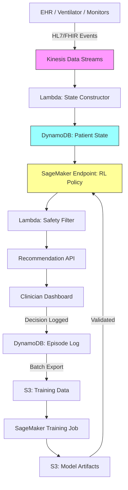

# Recipe 15.5 Architecture and Implementation: Ventilator Weaning Protocols

*Companion to [Recipe 15.5: Ventilator Weaning Protocols](chapter15.05-ventilator-weaning-protocols). This page covers the AWS architecture, services, prerequisites, and pseudocode. For the problem framing and the conceptual approach, start with the main recipe.*

---

## Why These Services

**Amazon SageMaker for RL model training and hosting.** SageMaker provides managed infrastructure for training RL models at scale, including support for custom RL algorithms via script mode. The training jobs handle the compute-intensive batch RL training on historical data, and SageMaker endpoints serve real-time inference for the policy engine.

**Amazon Kinesis Data Streams for real-time data ingestion.** Ventilator data, vital signs, and lab results arrive as streams. Kinesis handles the high-throughput, low-latency ingestion needed to keep the patient state current. It also provides replay capability for reprocessing historical data during model retraining.

**AWS Lambda for state construction and safety filtering.** The stateless transformation from raw clinical events to structured state vectors is a natural Lambda workload. The safety filter (rule-based constraint checking) runs as a separate Lambda to maintain separation of concerns.

**Amazon DynamoDB for patient state and episode tracking.** Each patient's current state vector and weaning episode history need fast point lookups and writes. DynamoDB's key-value model fits the access pattern: write the latest state, read the current state for inference, append to the episode history.

**Amazon S3 for training data and model artifacts.** Historical weaning episodes (the training dataset) live in S3 as Parquet files. Trained model artifacts are stored in S3 and loaded by SageMaker endpoints. Audit logs of all recommendations and decisions are archived to S3 for compliance.

**Amazon EventBridge for orchestration.** Coordinates the periodic retraining pipeline: triggers data extraction, launches training jobs, runs off-policy evaluation, and promotes validated models.

## Architecture Diagram



## Prerequisites

| Requirement | Details |
|-------------|---------|
| **AWS Services** | Amazon SageMaker, Amazon Kinesis, AWS Lambda, Amazon DynamoDB, Amazon S3, Amazon EventBridge, Amazon CloudWatch |
| **IAM Permissions** | Separate IAM roles per component. State Constructor Lambda: `kinesis:GetRecords` on patient stream, `dynamodb:PutItem` on patient-state table. Inference endpoint: `dynamodb:GetItem` on patient-state table, `sagemaker:InvokeEndpoint` on weaning-policy endpoint. Safety Filter Lambda: `dynamodb:GetItem`, write to recommendation API. Training pipeline: `s3:GetObject` on training-data bucket, `s3:PutObject` on model-artifacts bucket, `sagemaker:CreateTrainingJob`. Logging: `dynamodb:PutItem` on episode-log table, `s3:PutObject` on audit bucket. All permissions scoped to specific resource ARNs. |
| **BAA** | Required. All patient data is PHI. |
| **Encryption** | S3: SSE-KMS; DynamoDB: encryption at rest; Kinesis: server-side encryption with minimum retention (24-48 hours, as PHI should not persist in the stream longer than operationally required); SageMaker: KMS for training volumes and endpoints; all transit over TLS |
| **VPC** | SageMaker endpoints and Lambda functions in VPC with VPC endpoints for all services. Required endpoints: S3 (gateway), DynamoDB (gateway), SageMaker Runtime (interface), Kinesis Data Streams (interface), CloudWatch Logs (interface), KMS (interface). No public internet access for PHI-processing components. |
| **CloudTrail** | Enabled for all API calls. Enable DynamoDB Streams or CloudTrail data events for patient-state and episode-log tables to capture data-plane PHI access. Critical for audit trail of model recommendations and clinician decisions. |
| **Sample Data** | MIMIC-III or MIMIC-IV (publicly available ICU dataset from MIT/Beth Israel Deaconess). Contains real ventilator data, de-identified. Appropriate for model development. |
| **Cost Estimate** | SageMaker training: ~$50-200 per training run (depends on instance type and duration). SageMaker endpoint: ~$100-500/month (ml.m5.large). Kinesis, Lambda, DynamoDB: ~$200-500/month depending on patient volume. |

## Ingredients

| AWS Service | Role |
|------------|------|
| **Amazon SageMaker** | Trains offline RL models; hosts inference endpoint for real-time policy recommendations |
| **Amazon Kinesis Data Streams** | Ingests real-time patient data from EHR, ventilators, and monitors |
| **AWS Lambda** | Constructs state vectors from raw events; applies safety constraints to recommendations |
| **Amazon DynamoDB** | Stores current patient state and episode history for fast access |
| **Amazon S3** | Stores training datasets, model artifacts, and audit logs |
| **Amazon EventBridge** | Orchestrates periodic retraining and model validation pipeline |
| **Amazon CloudWatch** | Monitors model performance, data drift, and system health |
| **AWS KMS** | Manages encryption keys for all PHI-containing services |

## Pseudocode Walkthrough

**Step 1: State construction.** Raw clinical data arrives as a stream of events: a vital sign reading here, a ventilator parameter change there, a lab result an hour ago. The state constructor assembles these into a coherent snapshot of the patient's current condition. This is more complex than it sounds because data sources are asynchronous (vitals every 5 minutes, labs every 4-6 hours, vent settings on change), and you need to handle missing values gracefully. The state vector must capture not just current values but trends (is the patient improving or deteriorating?). Skip this step and the RL model receives garbage input, producing garbage recommendations.

```pseudocode
FUNCTION construct_state(patient_id, current_time):
    // Gather the most recent values for each clinical variable.
    // "Most recent" means different things for different data types:
    // vitals = last 5 minutes, labs = last 6 hours, vent settings = current.

    vitals = get_latest_vitals(patient_id, window=5_minutes)
        // heart_rate, blood_pressure, spo2, respiratory_rate, temperature

    vent_params = get_current_vent_settings(patient_id)
        // mode, fio2, peep, pressure_support, tidal_volume, respiratory_rate_set

    labs = get_latest_labs(patient_id, window=6_hours)
        // pao2, paco2, ph, lactate, hemoglobin, wbc

    sedation = get_sedation_status(patient_id)
        // rass_score, last_sedation_dose, time_since_last_dose

    // Compute trend features: how are key variables changing?
    // A patient whose SpO2 is 94% and rising is very different from one at 94% and falling.
    trends = compute_trends(patient_id, window=4_hours)
        // spo2_trend, rr_trend, hr_trend, fio2_trend

    // Contextual features that don't change rapidly
    context = {
        hours_on_vent: compute_hours_since_intubation(patient_id),
        age: get_patient_age(patient_id),
        primary_diagnosis_category: get_diagnosis_category(patient_id),
        failed_sbt_count: count_failed_sbts(patient_id)
    }

    // Assemble into a single state vector
    state = combine(vitals, vent_params, labs, sedation, trends, context)

    // Handle missing values: forward-fill from last known, flag as stale if too old
    state = impute_missing(state, staleness_thresholds={
        vitals: 15_minutes,
        labs: 12_hours,
        vent_params: 30_minutes
    })

    RETURN state
```

**Step 2: Policy inference.** The trained RL model takes the current state and produces a recommended action. The action space is discrete (a finite set of possible weaning actions), and the model outputs both the recommended action and a Q-value (estimated long-term value) for each possible action. This lets the clinician see not just "what does the model recommend" but "how confident is it, and what are the alternatives?" Skip this step and you have a monitoring system with no decision support.

```pseudocode
FUNCTION get_recommendation(state):
    // Send the state vector to the trained RL model for inference.
    // The model returns Q-values for each possible action.

    ACTION_SPACE = [
        "maintain_current",          // no change to ventilator settings
        "reduce_ps_2",               // reduce pressure support by 2 cmH2O
        "reduce_ps_4",               // reduce pressure support by 4 cmH2O
        "reduce_fio2_5",             // reduce FiO2 by 5%
        "reduce_fio2_10",            // reduce FiO2 by 10%
        "reduce_peep_2",             // reduce PEEP by 2 cmH2O
        "initiate_sbt",              // start spontaneous breathing trial
        "recommend_extubation"       // patient appears ready for extubation
    ]

    // Call the RL model endpoint
    q_values = model.predict(state)
        // Returns one Q-value per action: estimated cumulative future reward
        // Higher Q-value = model believes this action leads to better long-term outcome

    // Select the action with highest Q-value
    recommended_action = ACTION_SPACE[argmax(q_values)]

    // Compute confidence: how much better is the top action vs. alternatives?
    confidence = (max(q_values) - second_highest(q_values)) / abs(max(q_values))
        // High confidence = clear winner; low confidence = multiple actions look similar

    RETURN {
        action: recommended_action,
        q_values: dict(zip(ACTION_SPACE, q_values)),
        confidence: confidence
    }
```

**Step 3: Safety filtering.** Before any recommendation reaches a clinician, it passes through a hard-constraint safety filter. This is not learned; it's a set of clinical rules that override the RL model when the recommendation would be unsafe. The RL model optimizes expected outcomes, but it can't guarantee constraint satisfaction. The safety filter provides that guarantee. This is non-negotiable in clinical deployment. Skip this step and you risk recommending extubation for a patient who is hemodynamically unstable.

```pseudocode
SAFETY_RULES = {
    "recommend_extubation": {
        requires: [
            gcs >= 8,                    // patient must be conscious enough to protect airway
            rass >= -2,                  // not deeply sedated
            fio2 <= 40,                  // not requiring high oxygen
            peep <= 8,                   // not requiring high positive pressure
            no_vasopressors OR low_dose, // hemodynamically stable
            cough_present,               // can clear secretions
            failed_sbt_count_today == 0  // hasn't already failed today
        ]
    },
    "initiate_sbt": {
        requires: [
            fio2 <= 50,
            peep <= 8,
            rass >= -2,
            no_neuromuscular_blockade,
            hours_since_last_sbt >= 12   // don't retry too quickly after failure
        ]
    },
    "reduce_fio2_*": {
        requires: [
            spo2 >= 92,                  // adequate oxygenation before reducing support
            pao2 >= 60                   // if recent ABG available
        ]
    }
}

FUNCTION apply_safety_filter(recommendation, state):
    action = recommendation.action

    // Check if the recommended action has safety prerequisites
    IF action in SAFETY_RULES:
        rules = SAFETY_RULES[action].requires

        FOR each rule in rules:
            IF NOT evaluate_rule(rule, state):
                // Safety constraint violated. Override the recommendation.
                // Fall back to the next-best action that passes safety checks.
                recommendation = find_safe_alternative(recommendation.q_values, state)
                recommendation.safety_override = true
                recommendation.override_reason = rule.description
                BREAK

    RETURN recommendation
```

**Step 4: Recommendation delivery and logging.** The filtered recommendation is presented to the clinician and logged for audit and future training. Every recommendation, whether followed or overridden by the clinician, becomes training data for the next model iteration. The logging must capture enough context to reconstruct the decision: what the model saw, what it recommended, what the clinician did, and what happened next. Skip this step and you lose the feedback loop that makes the system improve over time.

For regulatory defensibility, audit logs should also be written to an S3 bucket with Object Lock (compliance mode) or to CloudWatch Logs with a resource policy preventing deletion. DynamoDB serves the operational read path; the immutable archive serves the compliance path.

```pseudocode
FUNCTION deliver_and_log(patient_id, state, recommendation, timestamp):
    // Store the recommendation for the clinician dashboard
    write_to_dashboard(patient_id, {
        timestamp: timestamp,
        recommended_action: recommendation.action,
        confidence: recommendation.confidence,
        q_values: recommendation.q_values,
        safety_override: recommendation.safety_override OR false,
        state_summary: summarize_state_for_display(state)
    })

    // Log the full decision context for audit and retraining
    log_to_episode(patient_id, {
        timestamp: timestamp,
        state_vector: state,                    // full state at decision time
        model_recommendation: recommendation,   // what the model said
        model_version: current_model_version,   // which model produced this
        // clinician_action will be filled in when they act
        // outcome will be filled in retrospectively
    })

    // Write immutable copy to S3 Object Lock bucket for compliance
    write_to_audit_archive(patient_id, timestamp, state, recommendation)

    RETURN recommendation
```

**Step 5: Outcome tracking and episode completion.** After the clinician acts, the system tracks what happens. Did the patient tolerate the change? Did the SBT succeed? Was extubation successful (defined as no reintubation within 48 hours)? These outcomes become the reward signal for future training. An episode begins when the patient meets initial weaning readiness screening criteria (e.g., FiO2 ≤ 60%, PEEP ≤ 10, hemodynamically stable, some respiratory drive present). Events before this point are acute stabilization, not weaning decisions. An episode ends when the patient is successfully extubated, dies, transitions to tracheostomy, or is transferred. Skip this step and the model never learns from its recommendations.

```pseudocode
FUNCTION track_outcome(patient_id, episode_id):
    // Monitor for episode-ending events
    WATCH FOR:
        successful_extubation:   // extubated AND no reintubation within 48 hours
            reward = +1.0
            episode_status = "success"

        failed_extubation:       // reintubated within 48 hours
            reward = -1.0
            episode_status = "failed_extubation"

        tracheostomy:            // converted to trach (weaning failed)
            reward = -0.5
            episode_status = "tracheostomy"

        death:
            reward = -2.0
            episode_status = "death"

    // Intermediate rewards (applied at each time step)
    step_reward = 0
    step_reward -= 0.01 * hours_on_vent_this_step    // small penalty for each hour on vent
    step_reward -= 0.1 * IF(spo2 < 90)              // penalty for desaturation
    step_reward += 0.05 * IF(vent_support_decreased) // small reward for progress

    // Update the episode log with outcomes
    update_episode(episode_id, {
        final_reward: reward,
        episode_status: episode_status,
        total_vent_hours: compute_total_hours(episode_id),
        step_rewards: accumulated_step_rewards
    })
```

> **Curious how this looks in Python?** The pseudocode above covers the concepts. If you'd like to see sample Python code that demonstrates these patterns using boto3, check out the [Python Example](chapter15.05-python-example). It walks through each step with inline comments and notes on what you'd need to change for a real deployment.

## Expected Results

**Sample recommendation output:**

```json
{
  "patient_id": "ICU-2026-04821",
  "timestamp": "2026-03-15T14:30:00Z",
  "current_state_summary": {
    "hours_on_vent": 72,
    "fio2": 40,
    "peep": 5,
    "pressure_support": 10,
    "spo2": 96,
    "rass": -1,
    "respiratory_rate": 18,
    "failed_sbt_count": 0
  },
  "recommendation": {
    "action": "initiate_sbt",
    "confidence": 0.72,
    "reasoning": "Patient meets SBT criteria. Stable on minimal support for 6+ hours. Similar patients in training data had 78% SBT success rate at this state."
  },
  "alternative_actions": [
    {"action": "reduce_ps_2", "q_value": 0.61},
    {"action": "maintain_current", "q_value": 0.55}
  ],
  "safety_check": "PASSED"
}
```

**Performance benchmarks (from offline evaluation on held-out data):**

| Metric | Historical Clinicians | RL Policy (CQL) |
|--------|----------------------|-----------------|
| Median time to extubation | 96 hours | 78 hours (estimated) |
| Reintubation rate | 15% | 12% (estimated) |
| Ventilator-free days (28-day) | 18.2 | 20.1 (estimated) |
| Mortality (ICU) | 12% | 11.5% (estimated) |
| Policy agreement with clinicians | N/A | 68% |

**Important caveats on these numbers:** These are off-policy evaluation estimates, not results from a randomized trial. The true performance of the RL policy is unknown until prospectively validated. The estimates carry significant uncertainty (confidence intervals are wide). The "policy agreement" metric shows that the RL policy agrees with what clinicians actually did about 68% of the time; the remaining 32% represents where the model would have done something different. Whether "different" means "better" is the open question.

**Where it struggles:**

- Patients with unusual physiology (e.g., severe ARDS, neuromuscular disease) where training data is sparse
- Rapid deterioration events where the state changes faster than the model's update frequency
- Patients on multiple simultaneous interventions where attributing outcomes to weaning decisions is ambiguous
- Night shifts where documentation is sparser and state construction has more missing values

---

## Variations and Extensions

**Multi-objective optimization.** Instead of a single reward, optimize for multiple objectives simultaneously: minimize time on vent, minimize reintubation risk, minimize sedation exposure. Use constrained RL or multi-objective RL to find policies on the Pareto frontier, letting clinicians choose their preferred tradeoff.

**Transfer learning across ICU populations.** Train a base policy on a large general ICU dataset (like MIMIC), then fine-tune on your institution's specific patient population. This addresses the data scarcity problem for individual hospitals while leveraging the statistical power of large public datasets.

**Explainable recommendations.** Augment the Q-value output with feature attribution: which state variables are most influencing the recommendation? Use SHAP values or attention mechanisms to tell the clinician "the model is recommending SBT primarily because SpO2 has been stable above 95% for 8 hours and PEEP is already at 5." This builds trust and helps clinicians identify when the model might be wrong.

---

## Additional Resources

**AWS Documentation:**
- [Amazon SageMaker RL Documentation](https://docs.aws.amazon.com/sagemaker/latest/dg/reinforcement-learning.html)
- [Amazon SageMaker Training Jobs](https://docs.aws.amazon.com/sagemaker/latest/dg/how-it-works-training.html)
- [Amazon Kinesis Data Streams Developer Guide](https://docs.aws.amazon.com/streams/latest/dev/introduction.html)
- [AWS HIPAA Eligible Services](https://aws.amazon.com/compliance/hipaa-eligible-services-reference/)
- [Amazon SageMaker Pricing](https://aws.amazon.com/sagemaker/pricing/)

**Key Research Papers:**

**Public Datasets:**
- [MIMIC-III Clinical Database](https://physionet.org/content/mimiciii/) (PhysioNet, requires credentialed access)
- [MIMIC-IV](https://physionet.org/content/mimiciv/) (PhysioNet, updated version with more recent data)
- [eICU Collaborative Research Database](https://physionet.org/content/eicu-crd/) (multi-center ICU data)

---

## Estimated Implementation Time

| Phase | Timeline |
|-------|----------|
| **Basic** (offline RL training on MIMIC, off-policy evaluation) | 3-4 months |
| **Production-ready** (real-time state construction, safety filters, clinician dashboard, IRB approval) | 12-18 months |
| **With variations** (multi-objective, explainability, prospective validation study) | 24-36 months |

---

**Tags:** `reinforcement-learning`, `icu`, `ventilator`, `weaning`, `offline-rl`, `clinical-decision-support`, `sequential-decisions`, `safety-constraints`, `sagemaker`

---

| [← 15.4: Sepsis Treatment Optimization](chapter15.04-sepsis-treatment-optimization) | [Chapter 15 Index](chapter15-preface) | [15.6: Glucose Control in ICU →](chapter15.06-glucose-control-icu) |

---

*← [Main Recipe 15.5](chapter15.05-ventilator-weaning-protocols) · [Python Example](chapter15.05-python-example) · [Chapter Preface](chapter15-preface)*
