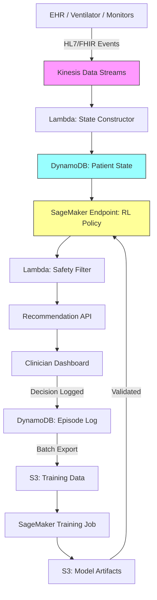

# Recipe 15.5: Ventilator Weaning Protocols

**Complexity:** Medium · **Phase:** Research/Pilot · **Estimated Cost:** ~$2,000–5,000/month (training infrastructure)

---

## The Problem

Here's a scenario that plays out thousands of times a day in ICUs around the world. A patient is on a mechanical ventilator. They've been on it for three days. The attending physician looks at the vitals, the blood gas results, the sedation level, and makes a judgment call: is this patient ready to try breathing on their own?

If they guess right, the patient gets extubated, breathes independently, and starts recovering. If they guess wrong (too early), the patient fails the spontaneous breathing trial, gets re-intubated (a traumatic, risky procedure), and spends more days on the vent. If they wait too long (too conservative), the patient accumulates ventilator-associated complications: pneumonia, muscle atrophy, delirium, tracheal damage. Every extra day on a ventilator increases mortality risk and adds roughly $3,000–5,000 in ICU costs.

The decision is genuinely hard. There's no single number that tells you "this patient is ready." It's a constellation of factors: respiratory mechanics, oxygenation, hemodynamic stability, neurological status, sedation depth, underlying disease trajectory. Experienced intensivists develop intuition for this over years of practice, but that intuition varies between clinicians, between shifts, between institutions. Studies consistently show that protocolized weaning (following a checklist) outperforms ad-hoc physician judgment on average, but even the best protocols are static. They don't adapt to the individual patient's trajectory.

This is a sequential decision problem. You're not making one decision; you're making a series of decisions over hours and days. Reduce the ventilator support a little. Watch. Reduce more. Watch. Trial spontaneous breathing. Watch. Extubate. Each decision depends on what happened after the previous one. The patient's state evolves, and your actions influence that evolution.

That's exactly the structure reinforcement learning was designed for.

---

## The Technology: Reinforcement Learning for Sequential Clinical Decisions

### What Is Reinforcement Learning?

Reinforcement learning (RL) is a branch of machine learning where an agent learns to make sequences of decisions by interacting with an environment and receiving feedback (rewards or penalties) based on outcomes. Unlike supervised learning, where you train on labeled examples of "correct" answers, RL learns from the consequences of actions over time.

The core framework has four components:

**State.** A representation of the current situation. In ventilator weaning, this is the patient's current physiological status: vital signs, ventilator settings, lab values, time on vent, sedation level.

**Action.** What the agent can do at each decision point. For weaning, this might be: maintain current settings, reduce pressure support, reduce FiO2, initiate a spontaneous breathing trial (SBT), or extubate.

**Reward.** The feedback signal that tells the agent how good or bad an outcome was. In weaning, the ultimate reward is successful extubation without reintubation. Intermediate rewards might penalize prolonged ventilation or reward progress toward independence.

**Policy.** The learned strategy that maps states to actions. This is what the RL agent produces: given this patient state, what action should I take?

The agent's goal is to learn a policy that maximizes cumulative reward over the entire episode (the full weaning trajectory from intubation to successful extubation or discharge).

### Why This Is Hard in Healthcare

RL has achieved superhuman performance in games (Go, Atari, StarCraft) and robotics. Healthcare is fundamentally different, and the differences matter:

**You can't explore freely.** In a game, the agent can try random actions to discover what works. In an ICU, trying a random action on a real patient is unethical. You can't extubate someone "just to see what happens." This means healthcare RL must learn from historical data (offline RL) rather than live experimentation (online RL). Offline RL is dramatically harder because you're learning from someone else's decisions, not your own.

**The reward is delayed and sparse.** You don't know if a weaning decision was good until hours or days later. Did the patient tolerate the reduced support? Did they pass the SBT? Did they stay extubated for 48 hours? The feedback loop is long, and intermediate signals are noisy.

**Patient heterogeneity.** A 30-year-old trauma patient and a 75-year-old COPD patient have completely different weaning trajectories. The policy needs to handle this diversity, but you may have limited data for any specific patient subtype.

**Confounding.** In historical data, sicker patients received more aggressive interventions. If you naively learn from this data, you might conclude that aggressive interventions cause bad outcomes (because the patients who received them were already sicker). This is the core challenge of learning from observational data, and it shows up everywhere in offline RL.

**Safety constraints.** Some actions are never acceptable regardless of expected reward. You can't let SpO2 drop below 88%. You can't extubate a patient who's deeply sedated. The policy must satisfy hard constraints, not just optimize expected outcomes.

### Offline RL: Learning from Historical Data

Since we can't run experiments on patients, we use offline RL (also called batch RL). The idea: take a dataset of historical ventilator weaning episodes (thousands of patients, their states over time, the actions clinicians took, and the outcomes), and learn a policy that would have produced better outcomes than the historical clinicians.

The key algorithms for offline RL include:

**Fitted Q-Iteration (FQI).** Estimates the value of each state-action pair from historical data. Conservative and well-understood, but can overestimate values for actions rarely seen in the data.

**Conservative Q-Learning (CQL).** Adds a penalty for actions that are far from what clinicians actually did in the data. This prevents the learned policy from recommending actions we have no evidence about. Critical for safety.

**Batch-Constrained Q-Learning (BCQ).** Only considers actions that are "close" to what was observed in the data. Even more conservative than CQL. Good for high-stakes settings where you really don't want to recommend something unprecedented.

The tradeoff is clear: more conservative algorithms are safer (they stay close to observed clinical practice) but have less potential to improve on current care. More aggressive algorithms might find genuinely better policies but risk recommending untested actions.

### The Clinician-in-the-Loop Paradigm

No sane deployment of RL in ventilator weaning removes the clinician from the decision. The realistic deployment model is:

1. The RL system observes the patient state continuously
2. It generates a recommendation (e.g., "consider reducing pressure support by 2 cmH2O")
3. The clinician reviews the recommendation alongside their own assessment
4. The clinician makes the final decision
5. The system logs the decision and outcome for future learning

This is a decision support tool, not an autonomous agent. The clinician retains full authority. The system's value is in consistency (it doesn't get tired at 3 AM), comprehensiveness (it considers all available data simultaneously), and pattern recognition (it has "seen" thousands of weaning episodes).

### Evaluation: Off-Policy Evaluation

How do you know if a learned policy is any good before deploying it? You can't run a randomized trial of an untested policy. Instead, you use off-policy evaluation (OPE): statistical methods that estimate how well a new policy would have performed on historical patients.

The main approaches:

**Importance Sampling (IS).** Re-weights historical trajectories by the ratio of the new policy's probability of taking the observed actions to the old policy's probability. Unbiased but high variance, especially for long episodes.

**Doubly Robust (DR).** Combines importance sampling with a model of the value function. Lower variance than pure IS. The standard choice for healthcare RL evaluation.

**Fitted Q-Evaluation (FQE).** Directly estimates the value of the new policy using the historical data. Lower variance but potentially biased.

None of these are perfect. They all have assumptions that may not hold. The honest answer is that off-policy evaluation gives you a signal, not a guarantee. It can tell you "this policy looks promising" or "this policy looks dangerous," but it can't tell you with certainty how it will perform on future patients.

---

## General Architecture Pattern

```
[EHR Data Stream] → [State Construction] → [RL Policy Engine] → [Recommendation] → [Clinician Review] → [Action Taken] → [Outcome Tracking] → [Policy Update]
```

**Data Ingestion.** Continuous streaming of patient data from the EHR, ventilator, and bedside monitors. Vital signs, ventilator parameters, lab results, medication administration records, nursing assessments.

**State Construction.** Transform raw clinical data into a structured state representation suitable for the RL model. This includes feature engineering (e.g., trends over the last 4 hours, time since last sedation change), handling missing values, and temporal alignment of asynchronous data sources.

**Policy Engine.** The trained RL model that maps the current state to a recommended action. Runs inference on the constructed state and produces both a recommendation and a confidence/uncertainty estimate.

**Safety Filter.** A hard-constraint layer that vetoes any recommendation violating clinical safety rules (e.g., "never recommend extubation if GCS < 8" or "never recommend SBT if FiO2 > 60%"). This layer is rule-based, not learned.

**Recommendation Interface.** Presents the recommendation to the clinician with supporting context: what the model is seeing, why it's recommending this action, what the expected trajectory looks like.

**Outcome Tracking.** Logs the clinician's actual decision, the patient's subsequent trajectory, and the eventual outcome. This data feeds back into periodic model retraining.

**Offline Training Pipeline.** Periodically retrains the RL policy on accumulated historical data. Includes off-policy evaluation to validate that the new policy is an improvement before promoting it to production.

---

## The AWS Implementation

### Why These Services

**Amazon SageMaker for RL model training and hosting.** SageMaker provides managed infrastructure for training RL models at scale, including support for custom RL algorithms via script mode. The training jobs handle the compute-intensive batch RL training on historical data, and SageMaker endpoints serve real-time inference for the policy engine.

**Amazon Kinesis Data Streams for real-time data ingestion.** Ventilator data, vital signs, and lab results arrive as streams. Kinesis handles the high-throughput, low-latency ingestion needed to keep the patient state current. It also provides replay capability for reprocessing historical data during model retraining.

**AWS Lambda for state construction and safety filtering.** The stateless transformation from raw clinical events to structured state vectors is a natural Lambda workload. The safety filter (rule-based constraint checking) runs as a separate Lambda to maintain separation of concerns.

**Amazon DynamoDB for patient state and episode tracking.** Each patient's current state vector and weaning episode history need fast point lookups and writes. DynamoDB's key-value model fits the access pattern: write the latest state, read the current state for inference, append to the episode history.

**Amazon S3 for training data and model artifacts.** Historical weaning episodes (the training dataset) live in S3 as Parquet files. Trained model artifacts are stored in S3 and loaded by SageMaker endpoints. Audit logs of all recommendations and decisions are archived to S3 for compliance.

**Amazon EventBridge for orchestration.** Coordinates the periodic retraining pipeline: triggers data extraction, launches training jobs, runs off-policy evaluation, and promotes validated models.

### Architecture Diagram



<!-- TODO (TechWriter): Expert review A1 (HIGH). Add DLQ/error handling for Kinesis-to-Lambda path. Configure SQS dead-letter queue with bisect-on-error, CloudWatch alarm on DLQ depth, and staleness flagging when state updates exceed 15 minutes. This is a patient safety concern: silent data loss means stale state feeding recommendations. -->

### Prerequisites

| Requirement | Details |
|-------------|---------|
| **AWS Services** | Amazon SageMaker, Amazon Kinesis, AWS Lambda, Amazon DynamoDB, Amazon S3, Amazon EventBridge, Amazon CloudWatch |
| **IAM Permissions** | Separate IAM roles per component. State Constructor Lambda: `kinesis:GetRecords` on patient stream, `dynamodb:PutItem` on patient-state table. Inference endpoint: `dynamodb:GetItem` on patient-state table, `sagemaker:InvokeEndpoint` on weaning-policy endpoint. Safety Filter Lambda: `dynamodb:GetItem`, write to recommendation API. Training pipeline: `s3:GetObject` on training-data bucket, `s3:PutObject` on model-artifacts bucket, `sagemaker:CreateTrainingJob`. Logging: `dynamodb:PutItem` on episode-log table, `s3:PutObject` on audit bucket. All permissions scoped to specific resource ARNs. |
| **BAA** | Required. All patient data is PHI. |
| **Encryption** | S3: SSE-KMS; DynamoDB: encryption at rest; Kinesis: server-side encryption with minimum retention (24–48 hours, as PHI should not persist in the stream longer than operationally required); SageMaker: KMS for training volumes and endpoints; all transit over TLS |
| **VPC** | SageMaker endpoints and Lambda functions in VPC with VPC endpoints for all services. Required endpoints: S3 (gateway), DynamoDB (gateway), SageMaker Runtime (interface), Kinesis Data Streams (interface), CloudWatch Logs (interface), KMS (interface). No public internet access for PHI-processing components. |
| **CloudTrail** | Enabled for all API calls. Enable DynamoDB Streams or CloudTrail data events for patient-state and episode-log tables to capture data-plane PHI access. Critical for audit trail of model recommendations and clinician decisions. |
| **Sample Data** | MIMIC-III or MIMIC-IV (publicly available ICU dataset from MIT/Beth Israel Deaconess). Contains real ventilator data, de-identified. Appropriate for model development. |
| **Cost Estimate** | SageMaker training: ~$50–200 per training run (depends on instance type and duration). SageMaker endpoint: ~$100–500/month (ml.m5.large). Kinesis, Lambda, DynamoDB: ~$200–500/month depending on patient volume. |

### Ingredients

| AWS Service | Role |
|------------|------|
| **Amazon SageMaker** | Trains offline RL models; hosts inference endpoint for real-time policy recommendations |
| **Amazon Kinesis Data Streams** | Ingests real-time patient data from EHR, ventilators, and monitors |
| **AWS Lambda** | Constructs state vectors from raw events; applies safety constraints to recommendations |
| **Amazon DynamoDB** | Stores current patient state and episode history for fast access |
| **Amazon S3** | Stores training datasets, model artifacts, and audit logs |
| **Amazon EventBridge** | Orchestrates periodic retraining and model validation pipeline |
| **Amazon CloudWatch** | Monitors model performance, data drift, and system health |
| **AWS KMS** | Manages encryption keys for all PHI-containing services |

### Code

#### Walkthrough

**Step 1: State construction.** Raw clinical data arrives as a stream of events: a vital sign reading here, a ventilator parameter change there, a lab result an hour ago. The state constructor assembles these into a coherent snapshot of the patient's current condition. This is more complex than it sounds because data sources are asynchronous (vitals every 5 minutes, labs every 4–6 hours, vent settings on change), and you need to handle missing values gracefully. The state vector must capture not just current values but trends (is the patient improving or deteriorating?). Skip this step and the RL model receives garbage input, producing garbage recommendations.

```
FUNCTION construct_state(patient_id, current_time):
    // Gather the most recent values for each clinical variable.
    // "Most recent" means different things for different data types:
    // vitals = last 5 minutes, labs = last 6 hours, vent settings = current.

    vitals = get_latest_vitals(patient_id, window=5_minutes)
        // heart_rate, blood_pressure, spo2, respiratory_rate, temperature

    vent_params = get_current_vent_settings(patient_id)
        // mode, fio2, peep, pressure_support, tidal_volume, respiratory_rate_set

    labs = get_latest_labs(patient_id, window=6_hours)
        // pao2, paco2, ph, lactate, hemoglobin, wbc

    sedation = get_sedation_status(patient_id)
        // rass_score, last_sedation_dose, time_since_last_dose

    // Compute trend features: how are key variables changing?
    // A patient whose SpO2 is 94% and rising is very different from one at 94% and falling.
    trends = compute_trends(patient_id, window=4_hours)
        // spo2_trend, rr_trend, hr_trend, fio2_trend

    // Contextual features that don't change rapidly
    context = {
        hours_on_vent: compute_hours_since_intubation(patient_id),
        age: get_patient_age(patient_id),
        primary_diagnosis_category: get_diagnosis_category(patient_id),
        failed_sbt_count: count_failed_sbts(patient_id)
    }

    // Assemble into a single state vector
    state = combine(vitals, vent_params, labs, sedation, trends, context)

    // Handle missing values: forward-fill from last known, flag as stale if too old
    state = impute_missing(state, staleness_thresholds={
        vitals: 15_minutes,
        labs: 12_hours,
        vent_params: 30_minutes
    })

    RETURN state
```

**Step 2: Policy inference.** The trained RL model takes the current state and produces a recommended action. The action space is discrete (a finite set of possible weaning actions), and the model outputs both the recommended action and a Q-value (estimated long-term value) for each possible action. This lets the clinician see not just "what does the model recommend" but "how confident is it, and what are the alternatives?" Skip this step and you have a monitoring system with no decision support.

```
FUNCTION get_recommendation(state):
    // Send the state vector to the trained RL model for inference.
    // The model returns Q-values for each possible action.

    ACTION_SPACE = [
        "maintain_current",          // no change to ventilator settings
        "reduce_ps_2",               // reduce pressure support by 2 cmH2O
        "reduce_ps_4",               // reduce pressure support by 4 cmH2O
        "reduce_fio2_5",             // reduce FiO2 by 5%
        "reduce_fio2_10",            // reduce FiO2 by 10%
        "reduce_peep_2",             // reduce PEEP by 2 cmH2O
        "initiate_sbt",              // start spontaneous breathing trial
        "recommend_extubation"       // patient appears ready for extubation
    ]

    // Call the RL model endpoint
    q_values = model.predict(state)
        // Returns one Q-value per action: estimated cumulative future reward
        // Higher Q-value = model believes this action leads to better long-term outcome

    // Select the action with highest Q-value
    recommended_action = ACTION_SPACE[argmax(q_values)]

    // Compute confidence: how much better is the top action vs. alternatives?
    confidence = (max(q_values) - second_highest(q_values)) / abs(max(q_values))
        // High confidence = clear winner; low confidence = multiple actions look similar

    RETURN {
        action: recommended_action,
        q_values: dict(zip(ACTION_SPACE, q_values)),
        confidence: confidence
    }
```

**Step 3: Safety filtering.** Before any recommendation reaches a clinician, it passes through a hard-constraint safety filter. This is not learned; it's a set of clinical rules that override the RL model when the recommendation would be unsafe. The RL model optimizes expected outcomes, but it can't guarantee constraint satisfaction. The safety filter provides that guarantee. This is non-negotiable in clinical deployment. Skip this step and you risk recommending extubation for a patient who is hemodynamically unstable.

```
SAFETY_RULES = {
    "recommend_extubation": {
        requires: [
            gcs >= 8,                    // patient must be conscious enough to protect airway
            rass >= -2,                  // not deeply sedated
            fio2 <= 40,                  // not requiring high oxygen
            peep <= 8,                   // not requiring high positive pressure
            no_vasopressors OR low_dose, // hemodynamically stable
            cough_present,               // can clear secretions
            failed_sbt_count_today == 0  // hasn't already failed today
        ]
    },
    "initiate_sbt": {
        requires: [
            fio2 <= 50,
            peep <= 8,
            rass >= -2,
            no_neuromuscular_blockade,
            hours_since_last_sbt >= 12   // don't retry too quickly after failure
        ]
    },
    "reduce_fio2_*": {
        requires: [
            spo2 >= 92,                  // adequate oxygenation before reducing support
            pao2 >= 60                   // if recent ABG available
        ]
    }
}

FUNCTION apply_safety_filter(recommendation, state):
    action = recommendation.action

    // Check if the recommended action has safety prerequisites
    IF action in SAFETY_RULES:
        rules = SAFETY_RULES[action].requires

        FOR each rule in rules:
            IF NOT evaluate_rule(rule, state):
                // Safety constraint violated. Override the recommendation.
                // Fall back to the next-best action that passes safety checks.
                recommendation = find_safe_alternative(recommendation.q_values, state)
                recommendation.safety_override = true
                recommendation.override_reason = rule.description
                BREAK

    RETURN recommendation
```

**Step 4: Recommendation delivery and logging.** The filtered recommendation is presented to the clinician and logged for audit and future training. Every recommendation, whether followed or overridden by the clinician, becomes training data for the next model iteration. The logging must capture enough context to reconstruct the decision: what the model saw, what it recommended, what the clinician did, and what happened next. Skip this step and you lose the feedback loop that makes the system improve over time.

For regulatory defensibility, audit logs should also be written to an S3 bucket with Object Lock (compliance mode) or to CloudWatch Logs with a resource policy preventing deletion. DynamoDB serves the operational read path; the immutable archive serves the compliance path.

```
FUNCTION deliver_and_log(patient_id, state, recommendation, timestamp):
    // Store the recommendation for the clinician dashboard
    write_to_dashboard(patient_id, {
        timestamp: timestamp,
        recommended_action: recommendation.action,
        confidence: recommendation.confidence,
        q_values: recommendation.q_values,
        safety_override: recommendation.safety_override OR false,
        state_summary: summarize_state_for_display(state)
    })

    // Log the full decision context for audit and retraining
    log_to_episode(patient_id, {
        timestamp: timestamp,
        state_vector: state,                    // full state at decision time
        model_recommendation: recommendation,   // what the model said
        model_version: current_model_version,   // which model produced this
        // clinician_action will be filled in when they act
        // outcome will be filled in retrospectively
    })

    // Write immutable copy to S3 Object Lock bucket for compliance
    write_to_audit_archive(patient_id, timestamp, state, recommendation)

    RETURN recommendation
```

**Step 5: Outcome tracking and episode completion.** After the clinician acts, the system tracks what happens. Did the patient tolerate the change? Did the SBT succeed? Was extubation successful (defined as no reintubation within 48 hours)? These outcomes become the reward signal for future training. An episode begins when the patient meets initial weaning readiness screening criteria (e.g., FiO2 ≤ 60%, PEEP ≤ 10, hemodynamically stable, some respiratory drive present). Events before this point are acute stabilization, not weaning decisions. An episode ends when the patient is successfully extubated, dies, transitions to tracheostomy, or is transferred. Skip this step and the model never learns from its recommendations.

```
FUNCTION track_outcome(patient_id, episode_id):
    // Monitor for episode-ending events
    WATCH FOR:
        successful_extubation:   // extubated AND no reintubation within 48 hours
            reward = +1.0
            episode_status = "success"

        failed_extubation:       // reintubated within 48 hours
            reward = -1.0
            episode_status = "failed_extubation"

        tracheostomy:            // converted to trach (weaning failed)
            reward = -0.5
            episode_status = "tracheostomy"

        death:
            reward = -2.0
            episode_status = "death"

    // Intermediate rewards (applied at each time step)
    step_reward = 0
    step_reward -= 0.01 * hours_on_vent_this_step    // small penalty for each hour on vent
    step_reward -= 0.1 * IF(spo2 < 90)              // penalty for desaturation
    step_reward += 0.05 * IF(vent_support_decreased) // small reward for progress

    // Update the episode log with outcomes
    update_episode(episode_id, {
        final_reward: reward,
        episode_status: episode_status,
        total_vent_hours: compute_total_hours(episode_id),
        step_rewards: accumulated_step_rewards
    })
```

> **Curious how this looks in Python?** The pseudocode above covers the concepts. If you'd like to see sample Python code that demonstrates these patterns using boto3, check out the [Python Example](chapter15.05-python-example). It walks through each step with inline comments and notes on what you'd need to change for a real deployment.

### Expected Results

**Sample recommendation output:**

```json
{
  "patient_id": "ICU-2026-04821",
  "timestamp": "2026-03-15T14:30:00Z",
  "current_state_summary": {
    "hours_on_vent": 72,
    "fio2": 40,
    "peep": 5,
    "pressure_support": 10,
    "spo2": 96,
    "rass": -1,
    "respiratory_rate": 18,
    "failed_sbt_count": 0
  },
  "recommendation": {
    "action": "initiate_sbt",
    "confidence": 0.72,
    "reasoning": "Patient meets SBT criteria. Stable on minimal support for 6+ hours. Similar patients in training data had 78% SBT success rate at this state."
  },
  "alternative_actions": [
    {"action": "reduce_ps_2", "q_value": 0.61},
    {"action": "maintain_current", "q_value": 0.55}
  ],
  "safety_check": "PASSED"
}
```

**Performance benchmarks (from offline evaluation on held-out data):**

| Metric | Historical Clinicians | RL Policy (CQL) |
|--------|----------------------|-----------------|
| Median time to extubation | 96 hours | 78 hours (estimated) |
| Reintubation rate | 15% | 12% (estimated) |
| Ventilator-free days (28-day) | 18.2 | 20.1 (estimated) |
| Mortality (ICU) | 12% | 11.5% (estimated) |
| Policy agreement with clinicians | N/A | 68% |

**Important caveats on these numbers:** These are off-policy evaluation estimates, not results from a randomized trial. The true performance of the RL policy is unknown until prospectively validated. The estimates carry significant uncertainty (confidence intervals are wide). The "policy agreement" metric shows that the RL policy agrees with what clinicians actually did about 68% of the time; the remaining 32% represents where the model would have done something different. Whether "different" means "better" is the open question.

**Where it struggles:**

- Patients with unusual physiology (e.g., severe ARDS, neuromuscular disease) where training data is sparse
- Rapid deterioration events where the state changes faster than the model's update frequency
- Patients on multiple simultaneous interventions where attributing outcomes to weaning decisions is ambiguous
- Night shifts where documentation is sparser and state construction has more missing values

---

## The Honest Take

Let me be direct about where this stands: ventilator weaning RL is a research-stage technology. There are published papers showing promising offline evaluation results. There are no large-scale randomized trials demonstrating clinical benefit. The gap between "looks good in retrospective analysis" and "improves patient outcomes in practice" is enormous, and healthcare is littered with technologies that looked great in retrospective studies and failed prospectively.

The off-policy evaluation problem is the thing that keeps me up at night. You're estimating how a policy would have performed on patients who received different care. The assumptions required for those estimates to be valid (no unmeasured confounders, correct behavior policy estimation, sufficient overlap between historical and proposed actions) are strong and probably violated to some degree in any real dataset.

The state representation is another hidden challenge. I described a clean state vector above, but in practice, ICU data is a mess. Vital signs are recorded at irregular intervals. Lab values are missing for hours. Nursing assessments are free-text. Ventilator modes change in ways that aren't cleanly captured in discrete features. The gap between "the data you wish you had" and "the data you actually have" is substantial.

The reward function is where clinical judgment meets engineering, and it's surprisingly contentious. Is a patient who gets extubated at 72 hours and reintubated at 74 hours worse off than a patient who stays on the vent until 120 hours and extubates successfully? Most clinicians would say yes (reintubation is traumatic and risky), but how much worse? The reward weights encode clinical values, and reasonable clinicians disagree on those values.

<!-- TODO (TechWriter): Expert review A2 (MEDIUM). Add model rollback strategy: shadow traffic via SageMaker production variants, agreement rate monitoring between old/new models, defined rollback trigger (e.g., clinician override rate exceeds 50% for 48 hours). -->

<!-- TODO (TechWriter): Expert review A4 (MEDIUM). Add operational monitoring guidance: feature distribution monitoring against training data stats, safety filter override rate tracking, clinician agreement rate over time as proxy for recommendation quality. Alert when features drift beyond 2 standard deviations for sustained periods. -->

What I'd do differently if starting over: I'd spend 80% of my time on data quality and state representation, and 20% on the RL algorithm. The algorithm choice matters less than the quality of the state signal and the reward definition. I'd also start with a much simpler action space (binary: "ready for SBT" vs. "not ready") before attempting the full multi-action formulation.

---

## Variations and Extensions

**Multi-objective optimization.** Instead of a single reward, optimize for multiple objectives simultaneously: minimize time on vent, minimize reintubation risk, minimize sedation exposure. Use constrained RL or multi-objective RL to find policies on the Pareto frontier, letting clinicians choose their preferred tradeoff.

**Transfer learning across ICU populations.** Train a base policy on a large general ICU dataset (like MIMIC), then fine-tune on your institution's specific patient population. This addresses the data scarcity problem for individual hospitals while leveraging the statistical power of large public datasets.

**Explainable recommendations.** Augment the Q-value output with feature attribution: which state variables are most influencing the recommendation? Use SHAP values or attention mechanisms to tell the clinician "the model is recommending SBT primarily because SpO2 has been stable above 95% for 8 hours and PEEP is already at 5." This builds trust and helps clinicians identify when the model might be wrong.

---

## Related Recipes

- **Recipe 15.4 (Sepsis Treatment Optimization):** Same offline RL framework applied to a different ICU decision problem. Shares the state construction and safety filtering patterns.
- **Recipe 15.6 (Glucose Control in ICU):** Another sequential ICU decision problem with continuous action spaces and tight safety constraints.
- **Recipe 12.10 (Physiological Waveform Analysis):** Provides the real-time physiological data processing that feeds into the state constructor for this recipe.
- **Recipe 7.9 (Mortality Risk Scoring, ICU):** The risk scores from this recipe could serve as features in the RL state representation.

---

## Additional Resources

**AWS Documentation:**
- [Amazon SageMaker RL Documentation](https://docs.aws.amazon.com/sagemaker/latest/dg/reinforcement-learning.html)
- [Amazon SageMaker Training Jobs](https://docs.aws.amazon.com/sagemaker/latest/dg/how-it-works-training.html)
- [Amazon Kinesis Data Streams Developer Guide](https://docs.aws.amazon.com/streams/latest/dev/introduction.html)
- [AWS HIPAA Eligible Services](https://aws.amazon.com/compliance/hipaa-eligible-services-reference/)
- [Amazon SageMaker Pricing](https://aws.amazon.com/sagemaker/pricing/)

**Key Research Papers:**
<!-- TODO (TechWriter): Expert review V2 (LOW). Verify and add full citations for: Komorowski et al. 2018 "The Artificial Intelligence Clinician" (Nature Medicine); Prasad et al. 2017 on RL for mechanical ventilation weaning; Kumar et al. 2020 Conservative Q-Learning. All are real papers but need verified DOI links. -->

**Public Datasets:**
- [MIMIC-III Clinical Database](https://physionet.org/content/mimiciii/) (PhysioNet, requires credentialed access)
- [MIMIC-IV](https://physionet.org/content/mimiciv/) (PhysioNet, updated version with more recent data)
- [eICU Collaborative Research Database](https://physionet.org/content/eicu-crd/) (multi-center ICU data)

---

## Estimated Implementation Time

| Phase | Timeline |
|-------|----------|
| **Basic** (offline RL training on MIMIC, off-policy evaluation) | 3–4 months |
| **Production-ready** (real-time state construction, safety filters, clinician dashboard, IRB approval) | 12–18 months |
| **With variations** (multi-objective, explainability, prospective validation study) | 24–36 months |

---

**Tags:** `reinforcement-learning`, `icu`, `ventilator`, `weaning`, `offline-rl`, `clinical-decision-support`, `sequential-decisions`, `safety-constraints`, `sagemaker`

---

| [← 15.4: Sepsis Treatment Optimization](chapter15.04-sepsis-treatment-optimization) | [Chapter 15 Index](chapter15-preface) | [15.6: Glucose Control in ICU →](chapter15.06-glucose-control-icu) |
