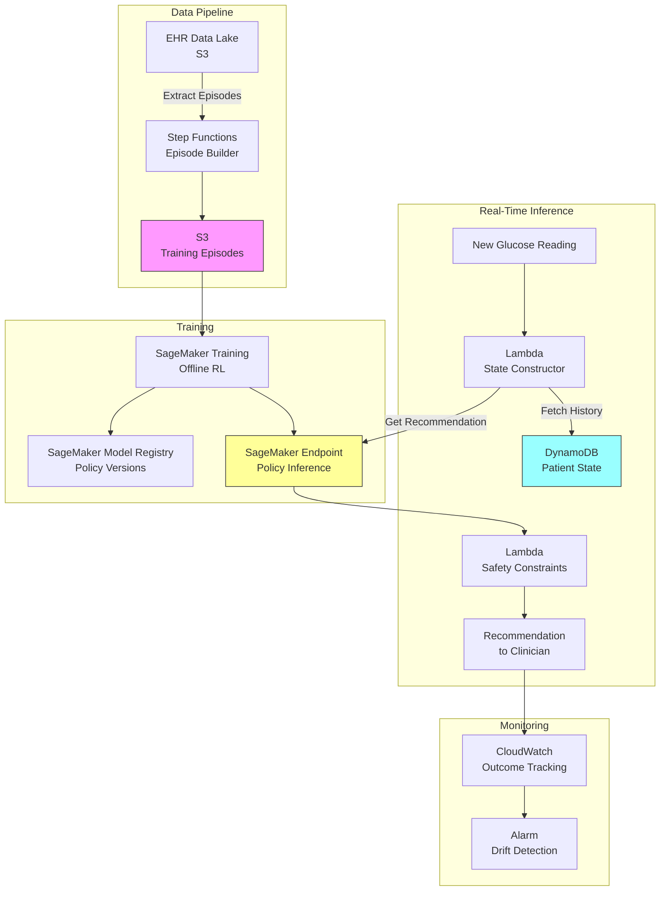

# Recipe 15.6: Glucose Control in ICU

**Complexity:** Medium-Complex · **Phase:** Research/Pilot · **Estimated Cost:** ~$2,000–5,000/month (training infrastructure)

---

## The Problem

Here's a scenario that plays out thousands of times a day in ICUs around the world. A critically ill patient's blood glucose is 220 mg/dL. The nurse checks the sliding scale protocol taped to the wall, administers 4 units of insulin, and moves on to the next patient. Four hours later, the glucose is 65 mg/dL. Hypoglycemia. Now there's a code situation, dextrose is being pushed, and the patient who was already fighting sepsis has a new physiological insult to recover from.

The fundamental tension in ICU glucose management is brutal: hyperglycemia (too high) causes organ damage, impairs immune function, and worsens outcomes. Hypoglycemia (too low) causes seizures, brain damage, and death. The target window is narrow (typically 140-180 mg/dL, though protocols vary), and every patient responds differently to insulin based on their illness severity, medications, nutritional intake, renal function, and a dozen other factors that change hour to hour.

Standard sliding scale protocols treat every patient the same. They say "if glucose is between 200-250, give 4 units." They don't account for the fact that this particular patient has been trending downward for the last three readings, or that their nutrition was just increased, or that their vasopressor dose changed (which affects insulin sensitivity). The NICE-SUGAR trial demonstrated this gap definitively: tight glycemic control protocols actually increased mortality, largely because static protocols caused too much hypoglycemia. The problem wasn't the goal of better glucose control. The problem was that fixed rules can't adapt to individual patient dynamics in real time.

Every 1-4 hours, someone decides how much insulin to give. That decision depends on the current state (glucose level, trend, nutrition, medications) and affects future states. The consequences of each decision unfold over hours. And the penalty for getting it wrong is severe in one direction (hypoglycemia) and gradual in the other (sustained hyperglycemia). This is exactly the kind of sequential decision problem that reinforcement learning was designed for.

---

## The Technology: Reinforcement Learning for Sequential Medical Decisions

### What Reinforcement Learning Actually Is

Reinforcement learning (RL) is a framework for learning optimal sequential decision-making from experience. Unlike supervised learning (where you have labeled examples of correct answers), RL learns by trial and error: take an action, observe the outcome, adjust the strategy.

The core components:

**State.** A representation of the current situation. In glucose control, this includes the current glucose reading, recent glucose trend, insulin on board, nutrition rate, patient acuity, and relevant medications.

**Action.** What the agent can do. Here, it's the insulin dose to administer (and potentially the timing of the next measurement).

**Reward.** A numerical signal indicating how good the outcome was. In glucose control, you want to reward time in the target range and heavily penalize hypoglycemia.

**Policy.** The learned mapping from states to actions. This is what you're trying to optimize: given this patient state, what insulin dose maximizes long-term outcomes?

**Value function.** The expected cumulative future reward from a given state. This is what makes RL different from greedy optimization: it considers not just the immediate effect of a dose, but the downstream consequences over the next 24-48 hours.

### Why This Is Hard in Healthcare

RL was originally developed for games and robotics, where you can run millions of simulated episodes. Healthcare has fundamental constraints that make direct application dangerous:

**You can't explore freely.** In a video game, the agent can try random actions to discover what works. In an ICU, "let's try a random insulin dose and see what happens" is malpractice. Every action affects a real patient. This means you need to learn from historical data (offline RL) rather than live experimentation (online RL).

**Offline RL has distribution shift.** When you learn a policy from historical data, you're learning from the actions that clinicians actually took. If your learned policy recommends an action that clinicians rarely took, you have no data to evaluate whether that action is actually good. You're extrapolating beyond your training distribution. This is called distributional shift, and it's the central challenge of offline RL.

**Rewards are delayed and sparse.** The consequence of an insulin dose at 2 PM might not be fully apparent until 6 PM. The "reward" (patient outcome) unfolds over hours or days, not immediately after each action.

**Patient dynamics are nonstationary.** A patient's insulin sensitivity changes as their illness evolves. What worked on day 1 of their ICU stay may be wrong on day 3. The environment is not stationary, which violates a core assumption of many RL algorithms.

**Safety constraints are hard constraints, not soft preferences.** In most RL formulations, you optimize expected reward. In healthcare, you need constraint satisfaction: the policy must never (or almost never) cause hypoglycemia, regardless of what the expected reward says. This requires constrained RL or conservative policy approaches.

### The State of the Field

Glucose control with RL has been studied extensively in the research literature since the mid-2010s. Key developments:

**Batch/offline RL approaches** (like Fitted Q-Iteration, Conservative Q-Learning, and Batch Constrained Q-Learning) learn policies from retrospective ICU data without requiring live experimentation. These are the most clinically feasible approaches.

**Physiological simulators** (like the FDA-accepted UVA/Padova Type 1 Diabetes Simulator for outpatient settings, and various ICU glucose-insulin models) allow policy evaluation in silico before any clinical deployment. These simulators are imperfect but provide a safety layer.

**Constrained RL formulations** explicitly encode safety constraints (e.g., "probability of glucose < 70 mg/dL must be below 2%") into the optimization objective. This is more principled than just adding a penalty term to the reward.

**Off-policy evaluation (OPE)** methods estimate how a new policy would have performed on historical patients without actually deploying it. Importance sampling, doubly robust estimators, and fitted Q-evaluation are the main tools. OPE is imperfect but essential for safety validation.

The honest status: no RL-based glucose controller is in routine clinical use as of 2026. Several have been validated retrospectively and in simulation. A few have undergone small pilot studies. The gap between "works in retrospective analysis" and "deployed in an ICU" remains large, primarily due to safety validation requirements and regulatory uncertainty.

### The General Architecture Pattern

At a conceptual level, an RL-based glucose control system has these components:

```
[Historical Data] → [State Construction] → [Offline Policy Learning] → [Policy Evaluation]
                                                                              ↓
[Simulator Validation] → [Constrained Policy Refinement] → [Clinical Decision Support]
                                                                              ↓
                                                              [Clinician Override + Logging]
```

**Historical data pipeline.** Extract glucose measurements, insulin administrations, nutrition data, medication records, and patient acuity scores from the EHR. Align these temporally into episodes (one ICU stay = one episode, discretized into decision intervals).

**State construction.** Transform raw clinical data into a state representation suitable for RL. This includes current glucose, glucose velocity (trend), insulin on board (accounting for pharmacokinetics), nutrition rate, vasopressor dose, and patient features that affect insulin sensitivity.

**Offline policy learning.** Train an RL agent on the historical episodes using an offline RL algorithm that handles distributional shift. The agent learns a policy that maps patient states to recommended insulin doses.

**Policy evaluation.** Use off-policy evaluation methods to estimate how the learned policy would have performed compared to the historical clinician policy. Compare time-in-range, hypoglycemia rates, and glucose variability.

**Simulator validation.** Run the learned policy through a physiological glucose-insulin simulator to stress-test it under conditions not well-represented in the historical data (e.g., rapid nutrition changes, extreme insulin resistance).

**Constrained policy refinement.** Apply safety constraints to the policy: cap maximum doses, enforce minimum glucose thresholds, require conservative actions when uncertainty is high.

**Clinical decision support deployment.** Deploy the policy as a recommendation system (not autonomous control). The system suggests a dose; the clinician accepts, modifies, or overrides. Log everything for ongoing evaluation.

---

## The AWS Implementation

### Why These Services

**Amazon SageMaker for model training and hosting.** RL model training requires GPU instances for batch processing of historical episodes, hyperparameter tuning across reward formulations, and model versioning. SageMaker provides managed training jobs with spot instance support (RL training is fault-tolerant and restartable), model registry for versioning policies, and real-time endpoints for inference. The SageMaker RL toolkit supports custom environments, which you'll need for the glucose simulator integration.

**Amazon S3 for episode storage.** Historical patient episodes (state-action-reward sequences) are large, immutable datasets that get reprocessed as you iterate on state representations and reward functions. S3 is the natural landing zone: durable, versioned, and directly accessible from SageMaker training jobs.

**AWS Lambda for real-time inference orchestration.** When a nurse enters a new glucose reading, the system needs to construct the current state, call the policy endpoint, apply safety constraints, and return a recommendation within seconds. Lambda handles this stateless orchestration cleanly.

**Amazon DynamoDB for patient state tracking.** The RL agent needs the patient's recent history (last N glucose readings, current insulin infusion rate, nutrition status) to construct the state vector. DynamoDB provides low-latency key-value access for per-patient state that updates with each new measurement.

**Amazon CloudWatch for monitoring and alerting.** Track recommendation acceptance rates, override patterns, glucose outcomes for patients where recommendations were followed vs. overridden, and model drift indicators. Alert on anomalous recommendation patterns (e.g., consistently recommending maximum doses).

**AWS Step Functions for the training pipeline.** The offline training pipeline (data extraction, episode construction, training, evaluation, model registration) is a multi-step workflow that runs periodically as new data accumulates. Step Functions orchestrates this cleanly with error handling and retry logic.

### Architecture Diagram



<!-- TODO (TechWriter): Expert review A1 (HIGH). Add error handling and circuit breaker pattern to the inference path. Specify behavior when SageMaker endpoint is unavailable or DynamoDB read fails (return explicit "no recommendation available, use standard protocol" rather than failing silently). Add CloudWatch alarms on Lambda error rates and endpoint 5xx responses. -->

<!-- TODO (TechWriter): Expert review A2 (MEDIUM). Add model rollback and canary deployment strategy. Describe SageMaker production variants for canary deployment, override rate monitoring, and automatic rollback triggers when new model underperforms. -->

### Prerequisites

| Requirement | Details |
|-------------|---------|
| **AWS Services** | Amazon SageMaker, Amazon S3, AWS Lambda, Amazon DynamoDB, AWS Step Functions, Amazon CloudWatch |
| **IAM Permissions** | `sagemaker:CreateTrainingJob`, `sagemaker:InvokeEndpoint`, `s3:GetObject`, `s3:PutObject`, `dynamodb:GetItem`, `dynamodb:PutItem`, `states:StartExecution` |
| **BAA** | AWS BAA signed (required: glucose readings and insulin doses are PHI) |
| **Encryption** | S3: SSE-KMS; DynamoDB: encryption at rest; SageMaker: KMS for training volumes and endpoints; all API calls over TLS |
| **VPC** | Production: Lambda and SageMaker in VPC with VPC endpoints for S3, DynamoDB, SageMaker Runtime, CloudWatch Logs, Step Functions, and KMS |
| **CloudTrail** | Enabled: log all SageMaker and DynamoDB API calls for audit trail |
| **Historical Data** | Minimum 5,000-10,000 ICU stays with hourly glucose measurements, insulin administration records, nutrition data, and outcome labels. De-identified for development; BAA-covered for production. |
| **Cost Estimate** | Training: ~$50-200 per training run (ml.g4dn.xlarge spot instances, 4-8 hours). Inference endpoint: ~$100/month (ml.m5.large). DynamoDB and Lambda: negligible at clinical volumes. |

<!-- TODO (TechWriter): Expert review S1 (HIGH). Replace the flat IAM permission list with role-separated guidance. Separate into at least 4 roles: (1) State Constructor Lambda with scoped DynamoDB and SageMaker InvokeEndpoint access, (2) Safety Constraint Lambda with read-only patient state and write to recommendation store, (3) Training Pipeline role with S3 and SageMaker training permissions, (4) Monitoring role with CloudWatch access. Add resource ARN constraints to all permissions. -->

<!-- TODO (TechWriter): Expert review A3 (MEDIUM). Add latency budget note: target end-to-end < 3 seconds. State construction ~50-200ms, SageMaker inference ~50-200ms, safety constraints ~10ms. Recommend provisioned concurrency on Lambda and minimum instance count of 1 on SageMaker endpoint. -->

<!-- TODO (TechWriter): Expert review A4 (MEDIUM). Add capacity planning note for concurrent patient handling. Typical ICU (20-50 patients, checks every 1-4 hours) produces low peak concurrency (< 10/minute). Single ml.m5.large sufficient for one ICU; configure auto-scaling for hospital-wide deployment. -->

### Ingredients

| AWS Service | Role |
|------------|------|
| **Amazon SageMaker** | Trains offline RL policy, hosts inference endpoint, manages model versions |
| **Amazon S3** | Stores training episodes, model artifacts, evaluation results |
| **AWS Lambda** | Constructs patient state, orchestrates inference, applies safety constraints |
| **Amazon DynamoDB** | Tracks per-patient state history for real-time state construction |
| **AWS Step Functions** | Orchestrates periodic retraining pipeline |
| **Amazon CloudWatch** | Monitors recommendation patterns, outcome tracking, drift detection |
| **AWS KMS** | Manages encryption keys for all PHI-containing services |

### Code

#### Walkthrough

**Step 1: Episode construction from EHR data.** The first challenge is transforming raw EHR data into RL episodes. An episode is one ICU stay, discretized into decision intervals (typically 1-4 hours). At each timestep, you need the state (what the clinician observed), the action (what they did), and the reward (how things turned out). This step is where most of the engineering effort lives. EHR data is messy: glucose measurements come from different sources (point-of-care meters, arterial blood gas analyzers, continuous glucose monitors) with different accuracies and different timestamps. Insulin orders don't always align with administration times, and nutrition changes happen asynchronously. You need to bin everything into consistent time windows and handle missing data gracefully. Skip this step or do it poorly, and your RL agent learns from garbage.

```
FUNCTION build_episode(patient_icu_stay):
    // Discretize the ICU stay into fixed-length decision intervals.
    // 4 hours is common: it matches typical glucose check frequency.
    timestep_hours = 4
    episode = empty list

    FOR each interval in partition_stay(patient_icu_stay, timestep_hours):

        // Construct the state vector: everything the clinician could observe
        // at the start of this interval.
        state = {
            glucose_current:     most recent glucose in this interval (mg/dL),
            glucose_prev_1:      glucose from previous interval,
            glucose_prev_2:      glucose from 2 intervals ago,
            glucose_velocity:    (glucose_current - glucose_prev_1) / timestep_hours,
            insulin_on_board:    total insulin given in last 4 hours (units),
            insulin_infusion:    current insulin drip rate (units/hour) or 0 if subcutaneous,
            nutrition_rate:      current enteral/parenteral nutrition (kcal/hour),
            vasopressor_dose:    norepinephrine equivalent dose (mcg/kg/min),
            steroid_flag:        1 if on corticosteroids (these spike glucose), 0 otherwise,
            creatinine:          most recent value (renal function affects insulin clearance),
            bmi:                 patient BMI (affects insulin sensitivity),
            apache_score:        illness severity score at admission
        }

        // The action: what insulin dose was actually given during this interval.
        // Discretize into bins for tabular RL, or keep continuous for actor-critic methods.
        action = total_insulin_given_in_interval(interval)  // units

        // The reward: how good was the glucose outcome?
        // Heavily penalize hypoglycemia. Mildly penalize hyperglycemia.
        // Reward time in target range.
        next_glucose = first glucose measurement in next interval
        reward = compute_reward(next_glucose)

        append to episode: (state, action, reward)

    RETURN episode
```

**Step 2: Reward function design.** This is the most consequential design decision in the entire system. The reward function encodes what "good glucose control" means numerically. Get it wrong and your agent optimizes for the wrong thing. The key insight: hypoglycemia and hyperglycemia are not symmetric risks. A glucose of 60 mg/dL is immediately life-threatening. A glucose of 200 mg/dL is harmful over hours but not acutely dangerous. Your reward function must reflect this asymmetry. Most published work uses a piecewise function with a steep penalty below 70 mg/dL, a mild penalty above 180 mg/dL, and a positive reward in the 80-180 mg/dL range. The exact shape matters enormously and should be calibrated with clinical input.

```
FUNCTION compute_reward(glucose_mg_dl):
    // Asymmetric reward function reflecting clinical risk.
    // Hypoglycemia is immediately dangerous; hyperglycemia is gradually harmful.

    IF glucose_mg_dl < 40:
        // Severe hypoglycemia. Seizures, brain damage, death.
        // Maximum penalty. This should almost never happen.
        RETURN -100

    ELSE IF glucose_mg_dl < 70:
        // Hypoglycemia. Dangerous. Requires immediate intervention.
        // Steep penalty proportional to severity.
        RETURN -50 * (70 - glucose_mg_dl) / 30

    ELSE IF glucose_mg_dl < 80:
        // Below target but not hypoglycemic. Mild concern.
        RETURN -5

    ELSE IF glucose_mg_dl >= 80 AND glucose_mg_dl <= 180:
        // Target range. Reward proportional to how centered the value is.
        // Peak reward at 120-140 mg/dL (the "sweet spot").
        center = 130
        distance_from_center = abs(glucose_mg_dl - center)
        RETURN 10 - (distance_from_center / 50) * 5

    ELSE IF glucose_mg_dl <= 250:
        // Mild hyperglycemia. Harmful over time but not acutely dangerous.
        RETURN -2 * (glucose_mg_dl - 180) / 70

    ELSE:
        // Severe hyperglycemia. Osmotic complications, DKA risk.
        RETURN -10 - (glucose_mg_dl - 250) / 50
```

**Step 3: Offline RL training with safety constraints.** Standard RL algorithms (DQN, PPO) assume online interaction with the environment. We can't do that. We need offline RL: learning a policy purely from historical data without additional environment interaction. The key challenge is distributional shift. If the historical clinicians never gave 20 units of insulin to a patient with glucose of 150, your agent has no data to evaluate that action. Naive offline RL might still recommend it if the Q-function extrapolates incorrectly. Conservative Q-Learning (CQL) addresses this by adding a penalty for actions that are far from the historical data distribution. Batch Constrained Q-Learning (BCQ) restricts the policy to only recommend actions that were actually observed in similar states. Either approach prevents the dangerous extrapolation problem.

```
FUNCTION train_offline_rl_policy(episodes, safety_constraints):
    // Use Conservative Q-Learning (CQL) to learn a policy
    // that stays close to the historical data distribution.

    // Initialize Q-network (maps state-action pairs to expected cumulative reward)
    Q_network = initialize_neural_network(
        input_size  = state_dimension + action_dimension,
        hidden_layers = [256, 256, 128],
        output_size = 1
    )

    // Initialize policy network (maps states to action distributions)
    policy_network = initialize_neural_network(
        input_size  = state_dimension,
        hidden_layers = [256, 256],
        output_size = action_dimension  // continuous: mean and std of dose
    )

    FOR each training_iteration in range(num_iterations):

        // Sample a batch of transitions from the historical episodes
        batch = sample_random_transitions(episodes, batch_size=256)

        // Standard Bellman backup: estimate Q-values for observed transitions
        bellman_loss = compute_bellman_error(Q_network, batch, discount=0.99)

        // CQL penalty: push down Q-values for actions NOT in the dataset.
        // This prevents the policy from recommending untested actions.
        // Sample random actions and penalize their Q-values.
        random_actions = sample_uniform_actions(batch_size=256)
        cql_penalty = mean(Q_network(batch.states, random_actions))
                    - mean(Q_network(batch.states, batch.actions))

        // Combined loss: standard RL + conservative penalty
        total_loss = bellman_loss + alpha * cql_penalty
        // alpha controls how conservative the policy is.
        // Higher alpha = stays closer to historical behavior.
        // Lower alpha = more willing to deviate (riskier but potentially better).

        update Q_network to minimize total_loss

        // Update policy to maximize Q-values subject to safety constraints
        policy_loss = -mean(Q_network(batch.states, policy_network(batch.states)))

        // Safety constraint: penalize policies that produce hypoglycemia
        // in the training data (using a learned dynamics model or historical outcomes)
        safety_penalty = estimate_hypoglycemia_probability(
            policy_network, batch.states, safety_constraints
        )

        update policy_network to minimize (policy_loss + lambda * safety_penalty)

    RETURN policy_network
```

**Step 4: Off-policy evaluation.** Before deploying any learned policy, you need to estimate how it would have performed on historical patients. This is off-policy evaluation (OPE). The core idea: if the learned policy would have recommended the same action the clinician took, we can directly use the observed outcome. If it would have recommended a different action, we need to reweight the observation using importance sampling. OPE is imperfect (high variance, relies on overlap between policies), but it's the best tool available for safety validation without live experimentation. Run OPE on a held-out test set of episodes that were not used for training.

```
FUNCTION evaluate_policy_offline(learned_policy, test_episodes, behavior_policy):
    // Weighted Importance Sampling (WIS) estimator for policy value.
    // Estimates what the cumulative reward would have been if the learned
    // policy had been followed instead of the historical clinician policy.

    episode_returns = empty list

    FOR each episode in test_episodes:
        cumulative_importance_weight = 1.0
        cumulative_reward = 0.0

        FOR each (state, action, reward) in episode:
            // How likely is this action under the learned policy?
            pi_prob = learned_policy.probability(action | state)

            // How likely was this action under the historical clinician behavior?
            mu_prob = behavior_policy.probability(action | state)

            // Importance ratio: reweights this transition
            // If learned policy strongly agrees with clinician: ratio near 1
            // If learned policy disagrees: ratio far from 1 (high variance)
            ratio = pi_prob / mu_prob

            // Clip ratio to prevent extreme weights (variance reduction)
            ratio = clip(ratio, 0.01, 100.0)

            cumulative_importance_weight = cumulative_importance_weight * ratio
            cumulative_reward = cumulative_reward + (discount ^ timestep) * reward

        // Weighted return for this episode
        append cumulative_importance_weight * cumulative_reward to episode_returns

    // Normalize by sum of weights (self-normalized importance sampling)
    estimated_policy_value = sum(episode_returns) / sum(weights)

    // Also compute per-metric estimates
    estimated_time_in_range = compute_weighted_metric("time_in_range", ...)
    estimated_hypo_rate     = compute_weighted_metric("hypoglycemia_rate", ...)

    RETURN {
        policy_value:   estimated_policy_value,
        time_in_range:  estimated_time_in_range,
        hypo_rate:      estimated_hypo_rate,
        confidence_interval: bootstrap_ci(episode_returns, alpha=0.05)
    }
```

**Step 5: Safety constraint layer.** Even after training with safety-aware objectives and validating with OPE, the deployed system needs a hard safety layer. This is the last line of defense: regardless of what the RL policy recommends, certain actions are never allowed. Think of it as a safety envelope around the policy. The policy operates freely within the envelope; anything outside gets clipped or rejected. This layer encodes clinical knowledge that should never be violated, even if the data-driven policy disagrees.

```
FUNCTION apply_safety_constraints(recommended_dose, patient_state, constraints):
    // Hard safety constraints that override the RL policy.
    // These are non-negotiable clinical rules.

    safe_dose = recommended_dose

    // Constraint 1: Maximum single dose cap.
    // No matter what the policy says, never exceed this.
    // Clinical rationale: prevents catastrophic hypoglycemia from a single error.
    IF safe_dose > constraints.max_single_dose:  // e.g., 20 units
        safe_dose = constraints.max_single_dose
        log_constraint_activation("max_dose_cap", recommended_dose, safe_dose)

    // Constraint 2: If glucose is already trending down rapidly, reduce dose.
    // Clinical rationale: insulin already on board will continue lowering glucose.
    IF patient_state.glucose_velocity < constraints.rapid_decline_threshold:  // e.g., -30 mg/dL/hr
        safe_dose = safe_dose * 0.5
        log_constraint_activation("rapid_decline_reduction", recommended_dose, safe_dose)

    // Constraint 3: If glucose is near hypoglycemic range, no insulin.
    // Clinical rationale: giving insulin to someone at 85 mg/dL is reckless.
    IF patient_state.glucose_current < constraints.no_insulin_threshold:  // e.g., 100 mg/dL
        safe_dose = 0
        log_constraint_activation("hypo_prevention_hold", recommended_dose, safe_dose)

    // Constraint 4: Maximum dose change from previous interval.
    // Clinical rationale: prevents wild swings in dosing.
    max_change = constraints.max_dose_change_per_interval  // e.g., 5 units
    IF abs(safe_dose - patient_state.previous_dose) > max_change:
        safe_dose = patient_state.previous_dose + sign(safe_dose - patient_state.previous_dose) * max_change
        log_constraint_activation("max_change_cap", recommended_dose, safe_dose)

    // Constraint 5: If renal function is severely impaired, reduce dose.
    // Clinical rationale: kidneys clear insulin; impaired clearance means longer effect.
    IF patient_state.creatinine > constraints.renal_impairment_threshold:  // e.g., 3.0 mg/dL
        safe_dose = safe_dose * 0.7
        log_constraint_activation("renal_adjustment", recommended_dose, safe_dose)

    RETURN {
        final_dose:         safe_dose,
        original_recommendation: recommended_dose,
        constraints_activated: get_activated_constraints(),
        confidence:         compute_recommendation_confidence(patient_state)
    }
```

**Step 6: Clinical decision support interface.** The RL policy is deployed as a recommendation system, not an autonomous controller. The clinician sees the recommendation, the reasoning behind it, and can accept, modify, or override. Every interaction is logged for ongoing evaluation. This is critical: the system learns from clinician overrides (they indicate where the policy disagrees with expert judgment) and the outcomes of both followed and overridden recommendations provide ongoing validation data.

<!-- TODO (TechWriter): Expert review S2 (MEDIUM). Add tamper-evident audit trail guidance after the store_recommendation call. Recommendation logs should also be written to S3 with Object Lock (compliance mode) or CloudWatch Logs with a resource policy preventing deletion. The operational store (DynamoDB) serves real-time reads; the immutable archive serves compliance. -->

```
FUNCTION generate_recommendation(patient_id, new_glucose_reading):
    // Called when a new glucose measurement is entered for an ICU patient.

    // Fetch the patient's recent history from the state store
    patient_history = fetch_from_dynamodb(table="patient-glucose-state", key=patient_id)

    // Update history with new reading
    update_patient_state(patient_history, new_glucose_reading)

    // Construct the state vector for the RL policy
    state_vector = build_state_vector(patient_history)

    // Get the RL policy's recommendation
    raw_recommendation = invoke_sagemaker_endpoint(
        endpoint = "glucose-rl-policy-v2",
        payload  = state_vector
    )

    // Apply hard safety constraints
    safe_recommendation = apply_safety_constraints(
        raw_recommendation.dose,
        patient_history,
        SAFETY_CONSTRAINTS
    )

    // Package for clinical display
    recommendation = {
        patient_id:          patient_id,
        timestamp:           current_utc_timestamp(),
        recommended_dose:    safe_recommendation.final_dose,
        dose_units:          "units insulin (regular)",
        confidence:          safe_recommendation.confidence,
        reasoning: {
            current_glucose:     new_glucose_reading,
            trend:               patient_history.glucose_velocity,
            insulin_on_board:    patient_history.insulin_on_board,
            constraints_active:  safe_recommendation.constraints_activated
        },
        clinician_action:    "PENDING"  // updated when clinician responds
    }

    // Store recommendation for audit and outcome tracking
    store_recommendation(recommendation)

    RETURN recommendation
```

> **Curious how this looks in Python?** The pseudocode above covers the concepts. If you'd like to see sample Python code that demonstrates these patterns using boto3, check out the [Python Example](chapter15.06-python-example). It walks through each step with inline comments and notes on what you'd need to change for a real deployment.

### Expected Results

**Sample recommendation output:**

```json
{
  "patient_id": "ICU-2026-04821",
  "timestamp": "2026-03-15T14:30:00Z",
  "recommended_dose": 6.0,
  "dose_units": "units insulin (regular)",
  "confidence": 0.82,
  "reasoning": {
    "current_glucose": 195,
    "trend": -8.5,
    "insulin_on_board": 4.0,
    "constraints_active": []
  },
  "clinician_action": "PENDING"
}
```

**Performance benchmarks (retrospective evaluation):**

| Metric | Historical Protocol | RL Policy (OPE Estimate) |
|--------|--------------------|-----------------------------|
| Time in range (80-180 mg/dL) | 55-65% | 70-78% |
| Hypoglycemia rate (< 70 mg/dL) | 5-8% of measurements | 2-3% of measurements |
| Severe hypoglycemia (< 40 mg/dL) | 0.5-1% | < 0.2% |
| Glucose variability (CV) | 35-45% | 25-35% |
| Mean glucose | 160-180 mg/dL | 140-160 mg/dL |

**Where it struggles:**

- Patients with rapidly changing insulin sensitivity (new steroid initiation, sepsis resolution)
- Transitions between enteral nutrition and NPO status (nutrition changes dominate glucose dynamics)
- Patients on insulin drips vs. subcutaneous insulin (different pharmacokinetics)
- Very short ICU stays (< 24 hours) where there's insufficient data to personalize
- Patients with Type 1 diabetes in the ICU (fundamentally different physiology)

---

## Why This Isn't Production-Ready

**Regulatory pathway is unclear.** An RL-based dosing recommendation system likely falls under FDA regulation as a clinical decision support tool. The regulatory pathway for adaptive/learning systems is still evolving. You'd need to demonstrate safety through extensive retrospective validation, simulation testing, and likely a prospective clinical trial.

**Off-policy evaluation has high variance.** OPE estimates are noisy, especially for policies that deviate significantly from historical behavior. The confidence intervals on "time in range improvement" may be wide enough to be clinically meaningless. You need large datasets (thousands of ICU stays) to get tight estimates.

**Behavior policy estimation is hard.** Importance sampling requires knowing the probability of each historical action under the clinician's behavior policy. Clinicians don't follow a single policy; they vary by experience, shift, patient acuity, and institutional culture. Estimating the behavior policy from data introduces its own errors.

**Model drift.** Clinical practice changes over time (new protocols, new medications, different patient populations). A policy trained on 2020-2023 data may not be optimal for 2026 patients. You need ongoing monitoring and periodic retraining.

<!-- TODO (TechWriter): Expert review S3 (MEDIUM). Add note about de-identification requirements for production data feeding back into retraining. Clarify pseudonymization requirements for episode logs, IRB coverage for retraining pipeline, and PHI status of temporal glucose patterns (re-identification risk persists even after pseudonymization). -->

---

## The Honest Take

Here's what I've learned from working on this class of problem: the RL formulation is the easy part. Getting the data pipeline right is 70% of the work.

EHR data for glucose control is a mess. Glucose measurements come from different sources (point-of-care meters, arterial blood gas analyzers, continuous glucose monitors) with different accuracies and different timestamps. Insulin orders don't always match insulin administrations (a nurse might hold a dose if the patient is eating). Nutrition data is often incomplete or delayed in charting. You'll spend months cleaning and aligning temporal data before you can train anything.

The reward function is where clinical and ML expertise must collaborate. I've seen teams spend weeks tuning the reward shape, only to realize that their hypoglycemia penalty wasn't steep enough and the policy was trading a 2% increase in time-in-range for a 1% increase in hypoglycemia. That's a terrible trade clinically, but the numbers looked good on the aggregate metric. Always report hypoglycemia rates separately from time-in-range. Never let them get averaged into a single score.

The biggest surprise: the safety constraint layer often matters more than the RL policy itself. A simple PID controller with good safety constraints can outperform a sophisticated RL policy with weak constraints. The constraints encode decades of clinical knowledge about what's dangerous. The RL policy adds value at the margins (better personalization, better anticipation of trends), but the constraints keep patients alive.

Clinician trust is the deployment bottleneck, not model accuracy. Even if your OPE shows a 15% improvement in time-in-range, ICU nurses and physicians won't follow recommendations from a system they don't understand. Plan for extensive education, transparent reasoning displays, and a long period of "shadow mode" where the system makes recommendations that are logged but not displayed.

---

## Variations and Extensions

**Continuous glucose monitor (CGM) integration.** If your ICU uses CGMs (increasingly common), you get glucose readings every 5 minutes instead of every 4 hours. This dramatically changes the state representation (you have a full glucose trajectory, not point measurements) and enables much tighter control. The RL formulation shifts from "what dose to give every 4 hours" to "what infusion rate to set every 15-30 minutes." The action space becomes continuous rate adjustments rather than discrete bolus doses.

**Multi-objective optimization.** Beyond glucose control, consider jointly optimizing for nutrition delivery (patients need calories for healing) and insulin minimization (less insulin means fewer hypoglycemic events and less nursing workload). This becomes a constrained multi-objective RL problem where you're balancing glucose control, nutritional adequacy, and intervention burden.

**Transfer learning across patient populations.** Train a base policy on your general ICU population, then fine-tune for specific subpopulations (cardiac surgery patients, trauma patients, diabetic ketoacidosis patients) who have distinct glucose dynamics. This addresses the "one policy doesn't fit all" problem without requiring massive datasets for each subpopulation.

---

## Related Recipes

- **Recipe 15.4 (Sepsis Treatment Optimization):** Uses the same offline RL framework for a different clinical decision (fluids and vasopressors). Shares the OPE and safety constraint patterns.
- **Recipe 15.5 (Ventilator Weaning Protocols):** Another sequential ICU decision problem with safety constraints. Similar architecture, different state/action spaces.
- **Recipe 12.4 (Lab Result Trend Analysis):** The glucose trend computation in the state vector uses time series techniques covered here.
- **Recipe 7.9 (Mortality Risk Scoring, ICU):** Patient acuity scores used in the state vector are produced by models like this.
- **Recipe 15.1 (Alert Threshold Optimization):** A simpler RL application that shares the offline learning and safety constraint patterns in a lower-stakes setting.

---

## Additional Resources

**AWS Documentation:**
- [Amazon SageMaker RL Documentation](https://docs.aws.amazon.com/sagemaker/latest/dg/reinforcement-learning.html)
- [Amazon SageMaker Model Registry](https://docs.aws.amazon.com/sagemaker/latest/dg/model-registry.html)
- [Amazon SageMaker Real-Time Inference](https://docs.aws.amazon.com/sagemaker/latest/dg/realtime-endpoints.html)
- [AWS HIPAA Eligible Services](https://aws.amazon.com/compliance/hipaa-eligible-services-reference/)
- [Amazon SageMaker Pricing](https://aws.amazon.com/sagemaker/pricing/)

**Research References:**
- NICE-SUGAR Study Investigators. "Intensive versus Conventional Glucose Control in Critically Ill Patients." *New England Journal of Medicine* 360 (2009): 1283-1297.
- Kumar, A., Zhou, A., Tucker, G., Levine, S. "Conservative Q-Learning for Offline Reinforcement Learning." *NeurIPS* (2020).
- Fujimoto, S., Meger, D., Precup, D. "Off-Policy Deep Reinforcement Learning without Exploration." *ICML* (2019).
- UVA/Padova Type 1 Diabetes Metabolic Simulator (FDA-accepted research platform for glucose control algorithm development).

**Clinical Context:**
- Society of Critical Care Medicine (SCCM). Guidelines for the Use of an Insulin Infusion for the Management of Hyperglycemia in Critically Ill Patients.
- American Diabetes Association. Standards of Care in Diabetes: Diabetes Care in the Hospital (updated annually).

---

## Estimated Implementation Time

| Phase | Duration |
|-------|----------|
| **Basic** (data pipeline + offline RL training + retrospective evaluation) | 4-6 months |
| **Production-ready** (safety constraints + OPE validation + shadow mode deployment + clinician interface) | 12-18 months |
| **With variations** (CGM integration + multi-objective + transfer learning + prospective validation) | 24-36 months |

---

**Tags:** `reinforcement-learning`, `offline-rl`, `glucose-control`, `icu`, `insulin-dosing`, `safety-constraints`, `clinical-decision-support`, `sequential-decision-making`, `off-policy-evaluation`

---

| [← 15.5: Ventilator Weaning Protocols](chapter15.05-ventilator-weaning-protocols) | [Chapter 15 Index](chapter15-index) | [15.7: Chronic Disease Treatment Personalization →](chapter15.07-chronic-disease-treatment-personalization) |
|:---|:---:|---:|
