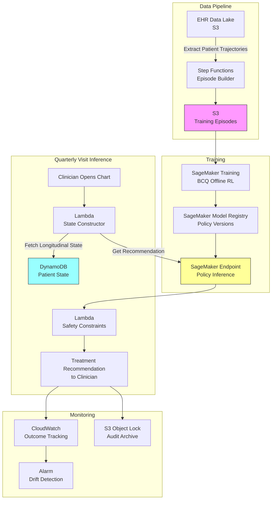

# Recipe 15.7 Architecture and Implementation: Chronic Disease Treatment Personalization

*Companion to [Recipe 15.7: Chronic Disease Treatment Personalization](chapter15.07-chronic-disease-treatment-personalization). This page covers the AWS architecture, services, prerequisites, and pseudocode. For the problem framing and the conceptual approach, start with the main recipe.*

---

## The AWS Implementation

### Why These Services

**Amazon SageMaker for model training and hosting.** The BCQ training pipeline requires batch processing of thousands of patient trajectories, hyperparameter tuning (especially the BCQ threshold and discount factor), and model versioning as you iterate. SageMaker provides managed training jobs, model registry for tracking policy versions, and real-time endpoints for inference at the point of care.

**Amazon S3 for episode storage.** Patient episodes (multi-year treatment trajectories converted to state-action-reward sequences) are large, immutable datasets that get reprocessed as you refine state representations and reward functions. S3 provides durable, versioned storage directly accessible from SageMaker training jobs.

**AWS Lambda for inference orchestration.** When a clinician opens a patient's chart at a quarterly visit, the system needs to fetch the patient's longitudinal state, construct the state vector, call the policy endpoint, apply safety constraints, and return a recommendation within seconds. Lambda handles this stateless orchestration.

**Amazon DynamoDB for patient state tracking.** The RL agent needs the patient's longitudinal history (recent HbA1c values, current treatment, adherence metrics, comorbidities) to construct the state vector. DynamoDB provides low-latency key-value access for per-patient state that updates at each quarterly visit.

**Amazon CloudWatch for monitoring and outcome tracking.** Track recommendation acceptance rates, override patterns, patient outcomes for followed vs. overridden recommendations, and model drift indicators. Alert on anomalous patterns (e.g., consistently recommending de-escalation when HbA1c is rising).

**AWS Step Functions for the retraining pipeline.** The offline training pipeline (data extraction, episode construction, training, evaluation, model registration) runs periodically as new outcome data accumulates. Step Functions orchestrates this with error handling and retry logic.

### Architecture Diagram



### Prerequisites

| Requirement | Details |
|-------------|---------|
| **AWS Services** | Amazon SageMaker, Amazon S3, AWS Lambda, Amazon DynamoDB, AWS Step Functions, Amazon CloudWatch, AWS KMS |
| **IAM Permissions** | Scoped per role: (1) Inference Lambda: `sagemaker:InvokeEndpoint` on the specific endpoint ARN, `dynamodb:GetItem`/`Query` on the patient state table ARN, `s3:PutObject` on the audit bucket prefix. (2) Training Pipeline: `sagemaker:CreateTrainingJob`, `s3:GetObject`/`PutObject` on the training bucket. (3) State Management: `dynamodb:PutItem`/`UpdateItem` on the patient state table. (4) Monitoring: `cloudwatch:PutMetricData`. Separate roles for each function. |
| **BAA** | AWS BAA signed (required: longitudinal treatment data including HbA1c, medications, and comorbidities is PHI regardless of de-identification status) |
| **Encryption** | S3: SSE-KMS with customer-managed keys (CMKs) for training data and audit logs; DynamoDB: encryption at rest with customer-managed KMS key (provides rotation control and revocation capability for multi-year PHI); SageMaker: KMS for training volumes and endpoint storage; all API calls over TLS |
| **VPC** | Production: Lambda and SageMaker endpoint in VPC with VPC endpoints: S3 (gateway, free), DynamoDB (gateway, free), SageMaker Runtime (interface, ~$7.50/month per AZ), CloudWatch (interface). Deploy SageMaker endpoint in VPC mode (VpcConfig in CreateEndpointConfig) to keep inference traffic containing PHI-derived state vectors off the public internet. |
| **CloudTrail** | Enabled: log all SageMaker, DynamoDB, and S3 API calls for audit trail |
| **Historical Data** | Minimum 10,000-50,000 patient trajectories spanning 3+ years each, with quarterly HbA1c measurements, medication records, adherence data, and comorbidity profiles. De-identified for development; BAA-covered for production. |
| **Cost Estimate** | Training: ~$100-400 per training run (ml.g4dn.xlarge, 6-12 hours). Inference endpoint: ~$75/month (ml.m5.large, low concurrency for quarterly visits). DynamoDB: ~$25/month (on-demand, low write volume). Lambda + Step Functions: negligible at clinical volumes. |

### Ingredients

| AWS Service | Role |
|------------|------|
| **Amazon SageMaker** | Trains BCQ policy offline, hosts inference endpoint, manages policy versions |
| **Amazon S3** | Stores training episodes, model artifacts, evaluation results, immutable audit archive (Object Lock) |
| **AWS Lambda** | Constructs patient state at visit time, orchestrates inference, applies safety constraints |
| **Amazon DynamoDB** | Tracks per-patient longitudinal state (HbA1c history, treatment levels, comorbidities) with customer-managed KMS encryption |
| **AWS Step Functions** | Orchestrates periodic retraining pipeline (quarterly or when guidelines change) |
| **Amazon CloudWatch** | Monitors recommendation patterns, outcome tracking, drift detection |
| **AWS KMS** | Manages encryption keys for all PHI-containing services; customer-managed keys provide rotation control and revocation capability |

### Code

#### Walkthrough

**Step 1: Reward function design.** The reward function is the most consequential design decision in chronic disease RL. Unlike acute care (where "keep glucose in range" is relatively straightforward), chronic disease has competing objectives that must be balanced explicitly. You want low HbA1c, but not at the cost of frequent hypoglycemia. You want effective treatment, but not unnecessary complexity. You want to escalate when needed, but not when the real problem is adherence. The reward function encodes all of these trade-offs numerically. Get it wrong and your agent optimizes for the wrong thing.

```pseudocode
FUNCTION compute_quarterly_reward(
    hba1c, target_hba1c, hypo_events, severe_hypo,
    treatment_level, previous_treatment_level, adherence
):
    reward = 0

    // Primary: glycemic control relative to individualized target
    IF hba1c < 5.5:
        // Over-treated. Too aggressive. High hypo risk.
        reward += OVER_TREATMENT_PENALTY  // e.g., -8

    ELSE IF abs(hba1c - target_hba1c) <= 0.3:
        // At target. This is the goal state.
        reward += AT_TARGET_REWARD  // e.g., +10

    ELSE IF hba1c > 10.0:
        // Dangerously high. Microvascular damage accumulating.
        reward += DANGEROUS_HIGH_PENALTY  // e.g., -15

    ELSE IF hba1c > target_hba1c:
        // Above target, scaled penalty per 0.5% overshoot
        reward += ABOVE_TARGET_SCALE * (hba1c - target_hba1c) / 0.5

    // Safety: hypoglycemia events (heavily penalized)
    reward += HYPO_PENALTY * hypo_events  // e.g., -5 per event
    IF severe_hypo:
        reward += SEVERE_HYPO_PENALTY  // e.g., -20

    // Burden: prefer simpler regimens when outcomes are equivalent
    reward += BURDEN_SCALE * treatment_level  // e.g., -0.5 per level

    // Appropriateness: penalize escalation when already at target
    IF treatment_level > previous_treatment_level AND hba1c <= target_hba1c + 0.3:
        reward += UNNECESSARY_ESCALATION_PENALTY  // e.g., -3

    // Appropriateness: penalize escalation when adherence is the problem
    IF treatment_level > previous_treatment_level AND adherence < 0.6:
        reward += ADHERENCE_MISMATCH_PENALTY  // e.g., -4

    RETURN reward
```

**Step 2: State construction from longitudinal records.** The state vector captures everything relevant to a treatment decision. Chronic disease state is richer than acute care because you have years of history and patient factors that matter enormously for treatment response. Each feature is normalized to [0, 1] for the RL algorithm. Missing values get midpoint imputation (in production, use last-known-value with a staleness indicator).

```pseudocode
FUNCTION construct_state_vector(patient_data):
    // 16-dimensional state capturing the full decision context.
    state = [
        normalize(patient_data.hba1c_current, min=4.0, max=14.0),
        normalize(patient_data.hba1c_prev_quarter, min=4.0, max=14.0),
        normalize(patient_data.hba1c_trend, min=-2.0, max=2.0),
        normalize(patient_data.hypo_events_quarter, min=0, max=20),
        normalize(patient_data.severe_hypo_ever, min=0, max=1),
        normalize(patient_data.current_treatment_level, min=0, max=7),
        normalize(patient_data.months_on_current_treatment, min=0, max=60),
        normalize(patient_data.age, min=18, max=95),
        normalize(patient_data.bmi, min=18, max=55),
        normalize(patient_data.egfr, min=10, max=120),
        normalize(patient_data.cardiovascular_risk, min=0, max=1),
        normalize(patient_data.heart_failure, min=0, max=1),
        normalize(patient_data.medication_adherence, min=0, max=1.0),
        normalize(patient_data.appointment_adherence, min=0, max=1.0),
        normalize(patient_data.comorbidity_count, min=0, max=10),
        normalize(patient_data.diabetes_duration_years, min=0, max=40),
    ]
    RETURN state
```

**Step 3: Episode construction from patient history.** Each patient's multi-year treatment history becomes an RL episode. A patient with 5 years of quarterly visits produces roughly 20 transitions. The key temporal structure: the reward for a treatment decision at visit N is computed from the outcome observed at visit N+1 (3 months later). This delayed reward is what makes chronic disease RL fundamentally different from supervised learning.

```pseudocode
FUNCTION build_episode(patient_record):
    visits = patient_record.visits  // chronologically ordered quarterly visits
    episode = empty list

    FOR i FROM 1 TO length(visits) - 2:
        prev_visit = visits[i - 1]
        current_visit = visits[i]
        next_visit = visits[i + 1]

        // State: clinical picture at the current decision point
        state = construct_state_vector(current_visit)

        // Action: what treatment the clinician chose
        action = current_visit.treatment_level

        // Reward: outcome observed at the NEXT visit (3 months later)
        // This is the key: today's decision, tomorrow's consequence.
        target = compute_individualized_target(current_visit)
        reward = compute_quarterly_reward(
            hba1c = next_visit.hba1c,
            target_hba1c = target,
            hypo_events = next_visit.hypo_events,
            severe_hypo = next_visit.severe_hypo,
            treatment_level = action,
            previous_treatment_level = prev_visit.treatment_level,
            adherence = current_visit.adherence
        )

        // Next state: clinical picture at the next visit
        next_state = construct_state_vector(next_visit)

        append (state, action, reward, next_state) to episode

    RETURN episode
```

**Step 4: Offline RL training with BCQ.** The training loop learns a Q-function (expected cumulative reward for each state-action pair) while constraining the policy to only recommend actions that clinicians have historically taken in similar states. The BCQ threshold controls conservatism: higher means "stay closer to what clinicians do," lower means "willing to deviate if the data supports it."

```pseudocode
FUNCTION train_bcq_policy(episodes, bcq_threshold=0.3, discount=0.95):
    // Flatten episodes into a replay buffer of transitions
    replay_buffer = flatten_all_transitions(episodes)

    // Count action frequencies per state region (what clinicians actually did)
    action_frequency = count_actions_per_state_bin(replay_buffer)

    // Initialize Q-table (production: neural network)
    Q = zeros(num_state_bins, num_actions)

    FOR each training_iteration:
        batch = sample_random(replay_buffer, batch_size=128)

        FOR each (state, action, reward, next_state) in batch:
            // BCQ constraint: only consider actions with sufficient
            // historical frequency in the next state.
            valid_actions = action_frequency[next_state] >= bcq_threshold
            IF no valid actions: valid_actions = all actions

            // Bellman target using only BCQ-valid actions
            next_q_max = max(Q[next_state, valid_actions])
            td_target = reward + discount * next_q_max

            // Update Q-value for the observed state-action pair
            Q[state, action] += learning_rate * (td_target - Q[state, action])

    RETURN Q, action_frequency
```

**Step 5: Off-policy evaluation.** Before any policy touches a patient, estimate how it would have performed on held-out historical data. For chronic disease, you care about agreement rate with clinicians (high agreement means the policy learned that clinicians are mostly right), estimated treatment intensity (is the policy more or less aggressive?), and concordance with outcomes.

```pseudocode
FUNCTION evaluate_policy_offline(policy, action_frequency, test_episodes):
    // Concordance-based evaluation: how often does the learned policy
    // agree with clinician decisions, and what's the treatment intensity profile?
    // Full OPE would use importance sampling or doubly-robust estimators;
    // we use concordance metrics here for pedagogical clarity.

    agreement_count = 0
    total_decisions = 0
    policy_actions = []
    clinician_actions = []

    FOR each episode in test_episodes:
        FOR each (state, clinician_action, reward, next_state) in episode:
            // Get policy's recommendation (BCQ-filtered)
            valid = action_frequency[state] >= bcq_threshold
            policy_action = argmax(Q[state, valid])

            IF policy_action == clinician_action:
                agreement_count += 1
            total_decisions += 1

            append policy_action to policy_actions
            append clinician_action to clinician_actions

    RETURN {
        agreement_rate: agreement_count / total_decisions,
        avg_policy_treatment_level: mean(policy_actions),
        avg_clinician_treatment_level: mean(clinician_actions),
        interpretation: "High agreement (>0.7) means the policy learned
            clinician patterns well. Deviations require careful validation."
    }
```

**Step 6: Safety constraint layer.** Hard rules that override the RL policy regardless of what it recommends. These encode clinical guidelines and contraindications that should never be violated. The constraints are ordered by priority: later constraints can override earlier ones because safety trumps "give it more time."

```pseudocode
FUNCTION apply_safety_constraints(recommended_action, patient_data):
    safe_action = recommended_action
    current_level = patient_data.current_treatment_level
    activated_constraints = []

    // Constraint 1: Maximum escalation speed (no jumping 3+ levels)
    IF safe_action > current_level + 2:
        safe_action = current_level + 2
        log("max_escalation: capped")

    // Constraint 2: Maximum de-escalation speed (avoid rebound)
    IF safe_action < current_level - 1:
        safe_action = current_level - 1
        log("max_deescalation: capped")

    // Constraint 3: Minimum duration before changing
    // HbA1c takes 3 months to reflect a treatment change.
    IF safe_action != current_level AND months_on_current < 3:
        safe_action = current_level
        log("min_duration_hold")

    // Constraint 4: Adherence gating
    // If patient isn't taking current meds, adding more won't help.
    IF safe_action > current_level AND adherence < 0.6:
        safe_action = current_level
        log("adherence_gate: fix adherence first")

    // Constraint 5: Renal contraindications
    // NOTE: Contraindications override duration holds (Constraint 3) because
    // safety trumps "give it more time." If eGFR drops below threshold while
    // on metformin, the drug must be stopped regardless of duration.
    IF safe_action >= 1 AND egfr < 30:
        safe_action = 0  // Metformin contraindicated; fall back
        log("metformin_contraindicated: eGFR too low")

    IF safe_action IN [2, 5] AND egfr < 45:
        // SGLT2 less effective; switch to alternative
        safe_action = alternative_without_sglt2(safe_action)
        log("sglt2_renal_limit: switched to alternative")

    // Constraint 6: Insulin avoidance in elderly with hypo history
    IF safe_action >= 6 AND age > 75 AND severe_hypo_history:
        safe_action = min(safe_action, 5)  // Cap at max oral therapy
        log("insulin_safety_cap: age + hypo history")

    // Constraint 7: Don't escalate if already at target
    IF safe_action > current_level AND hba1c <= target + 0.3:
        safe_action = current_level
        log("at_target_hold: no escalation needed")

    RETURN {
        final_action: safe_action,
        original_recommendation: recommended_action,
        constraints_activated: activated_constraints
    }
```

**Step 7: Clinical decision support at the quarterly visit.** This assembles the full pipeline: fetch patient state, update with new visit data, compute individualized target, query the policy, apply safety constraints, and present the recommendation. The clinician always has the final say.

```pseudocode
FUNCTION generate_treatment_recommendation(patient_id, new_hba1c, visit_data, policy):
    // Fetch longitudinal patient state from DynamoDB
    patient_data = fetch_patient_state(patient_id)

    // Update with new visit observations
    patient_data.hba1c_prev = patient_data.hba1c_current
    patient_data.hba1c_current = new_hba1c
    patient_data.hba1c_trend = new_hba1c - patient_data.hba1c_prev
    merge visit_data into patient_data

    // Compute individualized target (relaxed for elderly, comorbid, hypo-prone)
    target = compute_individualized_target(patient_data)

    // Construct state vector and query policy
    state_vector = construct_state_vector(patient_data)
    policy_recommendation = get_bcq_action(state_vector, policy)

    // Apply safety constraints
    safe_result = apply_safety_constraints(policy_recommendation, patient_data)

    // Package recommendation for clinician display
    // In production: also write to S3 Object Lock for immutable audit trail
    RETURN {
        patient_id: patient_id,
        recommended_treatment: safe_result.final_action,
        current_treatment: patient_data.current_treatment_level,
        treatment_change: (safe_result.final_action != current_treatment),
        confidence: policy_confidence,
        reasoning: {hba1c_vs_target, trend, adherence, constraints_activated},
        clinician_action: "PENDING"
    }
```

> **Curious how this looks in Python?** The pseudocode above covers the concepts. If you'd like to see sample Python code that demonstrates these patterns using boto3, check out the [Python Example](chapter15.07-python-example). It walks through each step with inline comments and notes on what you'd need to change for a real deployment.

### Expected Results

**Sample recommendation output:**

```json
{
  "patient_id": "DM-2026-08421",
  "visit_date": "2026-03-15",
  "hba1c": 8.2,
  "individualized_target": 7.0,
  "current_treatment": "metformin_monotherapy",
  "recommended_treatment": "metformin_plus_glp1",
  "treatment_change": true,
  "confidence": 0.74,
  "reasoning": {
    "hba1c_vs_target": "8.2% vs target 7.0%",
    "hba1c_trend": "+0.4% per quarter",
    "hypo_events": 0,
    "adherence": "85%",
    "policy_raw_recommendation": "metformin_plus_sglt2",
    "constraints_activated": ["sglt2_renal_limit: eGFR=52, switched to GLP-1"]
  },
  "clinician_action": "PENDING"
}
```

**Performance benchmarks (retrospective evaluation on held-out cohorts):**

| Metric | Standard Guideline-Based | BCQ Policy (OPE Estimate) |
|--------|--------------------------|---------------------------|
| Agreement with clinicians | N/A (baseline) | 72-78% |
| Estimated time at HbA1c target | 45-55% of quarters | 55-65% of quarters |
| Estimated hypoglycemia rate | 3-5% of quarters | 2-3% of quarters |
| Average treatment complexity | 2.8 (dual therapy) | 2.5 (slightly simpler) |
| Unnecessary escalation rate | 12-18% | 5-8% |

**Where it struggles:**

- Patients with rapidly changing clinical status (new diagnoses, acute illness, surgery) where the quarterly decision interval is too slow
- Patients with very short treatment histories (< 2 years) where there's insufficient data to personalize
- Rare treatment combinations with limited historical coverage (BCQ correctly avoids these, but can't learn about them)
- Patients whose adherence patterns are highly variable (the state representation captures average adherence but not the pattern)
- Populations underrepresented in training data (the policy may default to conservative recommendations for groups with fewer historical trajectories)

---

## Why This Isn't Production-Ready

**Regulatory classification is unresolved.** A system that recommends specific medication changes almost certainly qualifies as a Software as a Medical Device (SaMD) under FDA guidance, not a CDS exemption. The 2022 FDA CDS guidance exempts tools that "enable a healthcare professional to independently review the basis for the recommendation." An RL policy's basis (a Q-table or neural network trained on thousands of trajectories) is not independently reviewable in the way a risk score formula is. Expect a Class II 510(k) pathway at minimum, which means clinical validation studies, a predicate device argument, and ongoing post-market surveillance.

**Off-policy evaluation gives estimates, not guarantees.** The concordance metrics in this example show how often the policy agrees with clinicians, but they don't prove the policy would produce better outcomes. Full OPE (importance sampling, doubly-robust estimators) gives tighter counterfactual estimates but requires accurate behavior policy modeling, which is hard when clinician behavior varies by institution, experience level, and patient context. You need a prospective randomized trial to actually prove benefit.

**Clinician trust requires explainability.** An endocrinologist isn't going to follow a recommendation from a system that says "trust me, the Q-value is high." Production systems need to surface the reasoning: "This patient has been above target for 3 quarters, adherence is good, no contraindications, and similar patients did well with escalation." Building that explanation layer on top of a Q-table-based policy is non-trivial and may require a separate interpretability model.

**Reward function design embeds value judgments.** The weights in the reward function (how much to penalize hypoglycemia vs. how much to reward HbA1c reduction) encode clinical priorities that should be set by clinicians, not engineers. Different institutions may weigh these differently. The reward function needs a governance process: clinical committee review, sensitivity analysis showing how recommendations change with different weights, and periodic re-evaluation as guidelines evolve.

**Population bias propagates through the policy.** If your training data comes from a health system that undertreats certain demographics (documented disparities exist in diabetes care), the BCQ policy will learn to reproduce those patterns because it constrains itself to historical behavior. Detecting and mitigating this requires careful subgroup analysis and potentially fairness constraints during training, which adds complexity.

**Temporal validity degrades.** Clinical guidelines change (the ADA updates Standards of Care annually), new medications enter the market, and patient populations shift. A policy trained on 2020-2023 data may recommend outdated treatment pathways by 2026. You need a retraining cadence, but each retrained model needs the same validation pipeline, which is expensive.

---

## Variations and Extensions

**Multi-condition optimization.** Most patients with type 2 diabetes have multiple chronic conditions (hypertension, hyperlipidemia, CKD, heart failure). Extend the framework to jointly optimize across conditions, since some medications have cross-condition benefits (SGLT2 inhibitors help both diabetes and heart failure). The state space grows, but the architecture is the same.

**Shared decision-making integration.** Patient preferences matter enormously in chronic disease. Some patients prioritize simplicity (fewer pills). Others prioritize avoiding injections. Others prioritize weight loss. Extend the reward function to incorporate patient-stated preferences as additional objectives, and present the recommendation as "given your stated preference for X, the system suggests Y."

**Population health deployment.** Instead of point-of-care recommendations, use the trained policy to identify patients in a panel who are likely undertreated or overtreated based on their current state. Generate proactive outreach lists for care managers: "These 47 patients have been above target for 2+ quarters on monotherapy and might benefit from treatment escalation at their next visit."

---

## Additional Resources

**AWS Documentation:**
- [Amazon SageMaker RL Documentation](https://docs.aws.amazon.com/sagemaker/latest/dg/reinforcement-learning.html)
- [Amazon SageMaker Model Registry](https://docs.aws.amazon.com/sagemaker/latest/dg/model-registry.html)
- [Amazon SageMaker Real-Time Inference](https://docs.aws.amazon.com/sagemaker/latest/dg/realtime-endpoints.html)
- [Amazon SageMaker VPC Configuration](https://docs.aws.amazon.com/sagemaker/latest/dg/host-vpc.html)
- [AWS HIPAA Eligible Services](https://aws.amazon.com/compliance/hipaa-eligible-services-reference/)
- [Amazon DynamoDB Encryption at Rest](https://docs.aws.amazon.com/amazondynamodb/latest/developerguide/EncryptionAtRest.html)

**Clinical References:**
- American Diabetes Association. "Standards of Care in Diabetes." *Diabetes Care* (updated annually). The authoritative guideline for type 2 diabetes treatment escalation.
- Fujimoto, S., Meger, D., Precup, D. "Off-Policy Deep Reinforcement Learning without Exploration." *ICML* (2019). The BCQ paper.
- Kumar, A., Zhou, A., Tucker, G., Levine, S. "Conservative Q-Learning for Offline Reinforcement Learning." *NeurIPS* (2020). Alternative to BCQ for offline RL.
- KDIGO 2022 Clinical Practice Guideline for Diabetes Management in Chronic Kidney Disease. Relevant for the renal contraindication constraints.

**Regulatory Context:**
- FDA. "Clinical Decision Support Software: Guidance for Industry and Food and Drug Administration Staff." Relevant for determining whether the system qualifies for the CDS exemption or requires SaMD classification.

---

## Estimated Implementation Time

| Phase | Duration |
|-------|----------|
| **Basic** (data pipeline + BCQ training + retrospective evaluation on one patient population) | 6-9 months |
| **Production-ready** (safety constraints + OPE validation + shadow mode + clinician interface + audit trail) | 18-24 months |
| **With variations** (multi-condition + shared decision-making + population health + prospective validation) | 36-48 months |

---

**Tags:** `reinforcement-learning`, `offline-rl`, `bcq`, `chronic-disease`, `diabetes`, `treatment-personalization`, `safety-constraints`, `clinical-decision-support`, `sequential-decision-making`, `off-policy-evaluation`

---

| [← 15.6: Glucose Control in ICU](chapter15.06-glucose-control-icu) | [Chapter 15 Index](chapter15-preface) | [15.8: Chemotherapy Dose Optimization →](chapter15.08-chemotherapy-dose-optimization) |
|:---|:---:|---:|

---

*← [Main Recipe 15.7](chapter15.07-chronic-disease-treatment-personalization) · [Python Example](chapter15.07-python-example) · [Chapter Preface](chapter15-preface)*
