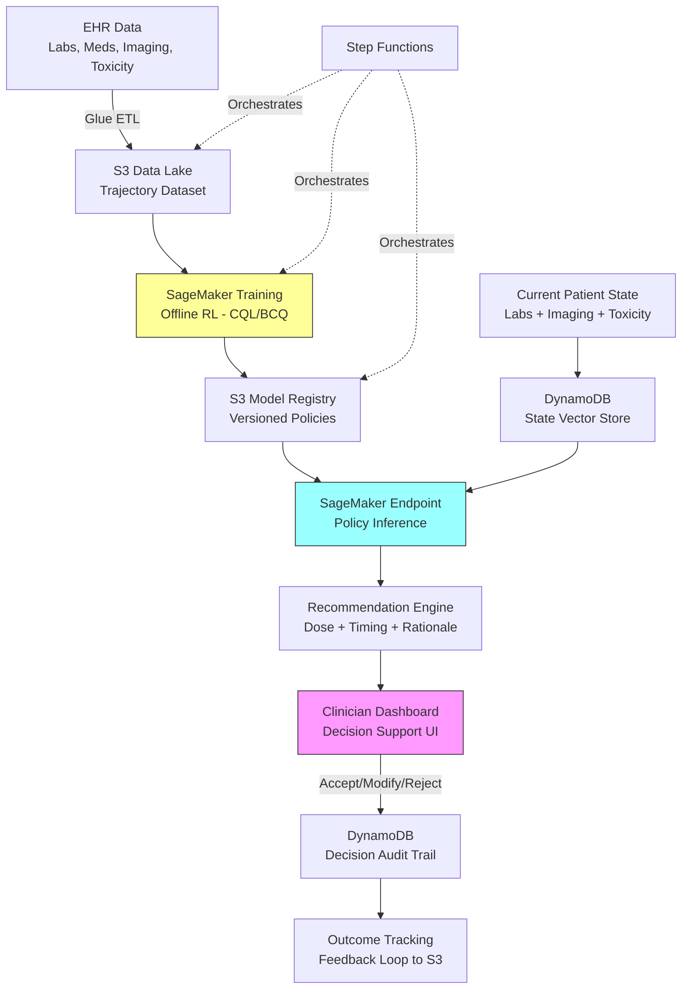

# Recipe 15.8: Chemotherapy Dose Optimization

**Complexity:** Complex · **Phase:** Research/Clinical Validation · **Estimated Cost:** ~$2,000–$8,000/month (training infrastructure)

---

## The Problem

Here's the situation in every oncology clinic, every day: a patient sits down for their third cycle of FOLFOX (a common colorectal cancer regimen), and the oncologist has to decide whether to keep the dose the same, reduce it, delay the cycle, or push through despite borderline lab values. The standard approach is protocol-driven: start at 100% dose, reduce by 25% if neutrophils drop below a threshold, hold the cycle if platelets are too low. Simple rules. Decades of clinical trial data behind them.

The problem is that these rules are population averages applied to individuals. Patient A metabolizes oxaliplatin twice as fast as Patient B. Patient C has a genetic variant in DPYD that makes fluorouracil dramatically more toxic at standard doses. Patient D is 82 years old with reduced renal clearance and the pharmacokinetics tables from the original trial (median age 58) don't quite apply. The oncologist knows all of this. They adjust intuitively, drawing on experience, gut feeling, and whatever labs came back this morning.

That intuitive adjustment is the gap. Some oncologists are aggressive (maximize tumor kill, manage toxicity reactively). Some are conservative (minimize side effects, accept potentially suboptimal tumor response). Neither is wrong in the abstract, but for a specific patient with specific tumor biology and specific organ function, there's likely an optimal trajectory through the dose space that balances efficacy against toxicity better than either extreme.

The numbers are sobering. Dose reductions happen in 30-60% of patients across common regimens. Each reduction potentially compromises efficacy. But pushing too hard causes hospitalizations for febrile neutropenia, peripheral neuropathy that never fully resolves, cardiotoxicity, and treatment discontinuation. The cost of getting it wrong runs in both directions: under-dosing lets tumors progress; over-dosing puts patients in the ICU.

This is a sequential decision problem under uncertainty with delayed, noisy rewards. That's exactly what reinforcement learning was designed for.

---

## The Technology: Reinforcement Learning for Sequential Treatment Decisions

### What Reinforcement Learning Actually Is

Reinforcement learning (RL) is a framework for learning optimal sequential decisions. Unlike supervised learning (where you have labeled examples of correct answers), RL learns from the consequences of actions over time. An agent observes a state, takes an action, receives a reward signal, transitions to a new state, and repeats. The goal is to learn a policy (a mapping from states to actions) that maximizes cumulative reward over the entire trajectory.

The key concepts:

**State.** Everything the agent knows about the current situation. In chemotherapy dosing, this is the patient's current clinical status: lab values, tumor measurements, toxicity grades, cycle number, cumulative dose, time since last treatment.

**Action.** What the agent can do. Here: dose level for each drug in the regimen (100%, 75%, 50%, hold), cycle timing (on schedule, delay 1 week, delay 2 weeks), and potentially supportive care decisions (add growth factor support, prophylactic antiemetics).

**Reward.** The signal that tells the agent how well it's doing. This is where chemotherapy dosing gets genuinely hard. The reward must capture both efficacy (tumor response) and safety (toxicity avoidance), and these are in direct tension. More on this below.

**Policy.** The learned decision rule. Given the current state, what action should we take? A good policy balances short-term toxicity management against long-term tumor control.

**Value function.** The expected cumulative future reward from a given state. This is what makes RL different from greedy optimization: it considers the long-term consequences of today's decision. Reducing dose today might avoid a toxicity crisis next week that would have forced treatment discontinuation entirely.

### Why This Is Hard (Harder Than Most RL Problems)

Standard RL assumes you can explore freely. Try action A, observe the result, try action B next time, compare. In a video game, dying is cheap. In chemotherapy dosing, exploration means giving a patient a potentially harmful dose to see what happens. That's not acceptable.

This constraint shapes everything about how RL is applied in this domain:

**Offline learning.** You can't run experiments on patients. You must learn from historical treatment records: what doses were given, what happened afterward. This is called offline RL (or batch RL). The fundamental challenge is distribution shift: your learned policy might recommend actions that were rarely or never taken in the historical data, and you have no way to know what would have happened if they had been.

**Confounding.** Historical data is observational, not randomized. Sicker patients got lower doses (because their oncologists saw they were struggling). If you naively learn from this data, you'll conclude that lower doses cause worse outcomes (because the patients who got them were already doing poorly). Causal inference techniques are essential.

**Sparse, delayed rewards.** Tumor response takes weeks to months to measure. A CT scan at cycle 4 tells you about the cumulative effect of cycles 1-4, not about any single dosing decision. The reward signal is noisy (measurement variability in tumor size), delayed (weeks between action and observable outcome), and confounded (other treatments, disease biology, patient behavior all contribute).

**Safety constraints.** Some states are unacceptable regardless of long-term benefit. Grade 4 neutropenia (absolute neutrophil count below 500) is life-threatening. No policy should recommend actions that have a meaningful probability of reaching such states. This requires constrained optimization, not just reward maximization.

**Individual variability.** Pharmacokinetics vary enormously between patients. Body surface area (the standard dosing basis) explains only a fraction of drug exposure variability. Genetic polymorphisms, organ function, drug interactions, and nutritional status all matter. A policy that works "on average" may be dangerous for specific patients.

### The State of the Field

RL for chemotherapy dosing is an active research area, not a deployed clinical tool. Key milestones:

Research groups have demonstrated offline RL policies that, when evaluated retrospectively against historical data, appear to recommend dosing strategies associated with better outcomes than the observed clinical decisions. These are retrospective analyses, not prospective trials.

The methodological foundations are solid: fitted Q-iteration, conservative Q-learning (CQL), batch-constrained deep Q-networks, and model-based approaches have all been applied. The challenge is not algorithmic; it's validation. How do you prove a learned policy is safe before deploying it on patients?

Current approaches to validation include: importance-weighted evaluation (estimating policy value from historical data), simulation with pharmacokinetic/pharmacodynamic (PK/PD) models, and expert review of recommended actions. None of these is as convincing as a randomized trial, and randomized trials of RL-based dosing are only beginning to be proposed.

<!-- TODO: Verify current status of any prospective RL dosing trials (check clinicaltrials.gov) -->

### The MDP Formulation

For chemotherapy dose optimization, the Markov Decision Process (MDP) looks like this:

**State space (what the agent observes):**
- Complete blood count (WBC, ANC, platelets, hemoglobin)
- Liver function (AST, ALT, bilirubin)
- Renal function (creatinine, GFR)
- Tumor measurements (from imaging, when available)
- Toxicity grades (CTCAE grading for relevant toxicities)
- Cycle number and cumulative dose
- Time since last treatment
- Patient demographics (age, BSA, performance status)
- Genetic markers (if available: DPYD, UGT1A1, etc.)

**Action space (what the agent can decide):**
- Dose level for each drug: discrete levels (100%, 75%, 50%, 25%, hold)
- Cycle timing: on schedule, delay 1 week, delay 2 weeks
- Supportive care: add G-CSF, adjust antiemetics

**Reward function (what defines "good"):**
This is the hardest design decision. A common formulation:

```
reward = α * tumor_response_signal - β * toxicity_penalty - γ * treatment_discontinuation_penalty
```

Where:
- `tumor_response_signal` rewards tumor shrinkage or stability
- `toxicity_penalty` penalizes grade 3+ adverse events
- `treatment_discontinuation_penalty` heavily penalizes forcing treatment to stop (because that's usually the worst outcome for the patient)
- α, β, γ are weights that encode the efficacy-toxicity tradeoff

The weights are not learned. They're clinical value judgments. Different oncologists would set them differently, and that's fine. The system should make the tradeoff explicit and configurable, not hidden.

**Transition dynamics:**
How the patient's state evolves after a dosing decision. This is governed by pharmacokinetics (how the body processes the drug) and pharmacodynamics (how the drug affects the body). In offline RL, you don't model transitions explicitly; you learn from observed state sequences. In model-based approaches, you build a patient simulator from PK/PD models.

### Offline RL: Learning Without Experimentation

Since we can't experiment on patients, we use offline RL algorithms designed to learn from fixed datasets of historical trajectories. The key challenge: the historical data was generated by a "behavior policy" (the oncologists' actual decisions). Our learned policy might want to take actions that were rarely taken historically, and we have limited information about what would happen in those cases.

Conservative approaches address this:

**Conservative Q-Learning (CQL):** Penalizes the value estimates for actions that are far from the historical behavior policy. This prevents the learned policy from being overconfident about untested actions.

**Batch-Constrained Q-learning (BCQ):** Restricts the learned policy to only recommend actions that are similar to those taken in the historical data. Safe, but potentially limits improvement.

**Importance-weighted evaluation:** Estimates what would have happened under the new policy using data from the old policy, weighted by the probability ratio. Works when the policies aren't too different; breaks down when they diverge significantly.

The practical implication: offline RL policies tend to be conservative. They improve on historical practice incrementally, not dramatically. That's actually appropriate for a safety-critical domain.

### General Architecture Pattern

```
[Historical EHR Data] → [State/Action/Reward Extraction] → [Trajectory Construction]
    → [Offline RL Training] → [Policy Evaluation] → [Clinical Validation]
        → [Decision Support Interface] → [Clinician Review] → [Outcome Tracking]
```

**Data extraction.** Pull treatment records, lab values, imaging results, and toxicity documentation from the EHR. Align them temporally into per-cycle state snapshots.

**Trajectory construction.** Assemble individual patient treatment courses into (state, action, reward, next_state) tuples. Handle missing data, irregular timing, and censored outcomes (patients who left the system).

**Offline RL training.** Train a policy using conservative offline RL algorithms. Validate against held-out patient trajectories.

**Policy evaluation.** Estimate the value of the learned policy using off-policy evaluation methods. Compare against the historical behavior policy and against standard protocol-based dosing.

**Clinical validation.** Expert oncologists review the policy's recommendations on representative cases. Flag disagreements for analysis. This is not optional.

**Decision support.** Deploy as a recommendation system, not an autonomous agent. The oncologist sees the recommendation, the reasoning (which state features drove it), and makes the final call.

**Outcome tracking.** Monitor actual outcomes for patients where the recommendation was followed vs. not. Build evidence for or against the policy over time.

---

## The AWS Implementation

### Why These Services

**Amazon SageMaker for RL training.** SageMaker provides managed infrastructure for training RL models, including support for custom environments and algorithms. For offline RL specifically, you'll use SageMaker's training jobs with custom containers running your CQL or BCQ implementation. The managed infrastructure handles GPU provisioning, distributed training, and experiment tracking without you managing EC2 instances directly.

**Amazon S3 for data lake.** Historical treatment trajectories, extracted features, trained model artifacts, and evaluation results all live in S3. The data volumes are moderate (thousands of patients, not millions of images), but the governance requirements are strict: versioning, encryption, access logging.

**AWS Glue for ETL.** Extracting treatment trajectories from raw EHR data requires complex joins across lab results, medication administration records, imaging reports, and toxicity documentation. Glue handles the batch ETL that constructs clean trajectory datasets from messy clinical data.

**Amazon DynamoDB for state tracking.** In a deployed decision support system, the current patient state and recommendation history need low-latency access. DynamoDB stores the per-patient state vectors and the audit trail of recommendations made.

**AWS Step Functions for pipeline orchestration.** The training pipeline (extract data, build trajectories, train model, evaluate, register) is a multi-step workflow with dependencies. Step Functions coordinates the stages and handles failures gracefully.

**Amazon CloudWatch for monitoring.** Model performance metrics, recommendation acceptance rates, and outcome tracking all flow through CloudWatch for operational visibility.

### Architecture Diagram



### Prerequisites

| Requirement | Details |
|-------------|---------|
| **AWS Services** | Amazon SageMaker, Amazon S3, AWS Glue, Amazon DynamoDB, AWS Step Functions, Amazon CloudWatch |
| **IAM Permissions** | `sagemaker:CreateTrainingJob`, `sagemaker:CreateEndpoint`, `s3:GetObject`, `s3:PutObject`, `glue:StartJobRun`, `dynamodb:PutItem`, `dynamodb:GetItem`, `states:StartExecution` |
| **BAA** | AWS BAA signed (required: treatment records are PHI) |
| **Encryption** | S3: SSE-KMS; DynamoDB: encryption at rest; SageMaker: KMS for training volumes and endpoints; all transit over TLS |
| **VPC** | Production: all services in VPC with VPC endpoints. SageMaker training and endpoints in private subnets. No public internet access for PHI-processing components. |
| **CloudTrail** | Enabled: log all API calls for HIPAA audit trail. Critical for tracking who accessed what patient data and when. |
| **Data Requirements** | Minimum 500-1000 complete treatment trajectories per regimen. More is better. Must include labs, dosing records, imaging, toxicity grades, and outcomes. |
| **Cost Estimate** | Training: $50-200 per training run (GPU instances, 4-12 hours). Inference endpoint: $200-800/month (ml.m5.xlarge). Storage and ETL: $100-500/month depending on data volume. |

### Ingredients

| AWS Service | Role |
|------------|------|
| **Amazon SageMaker** | RL model training (custom containers), model hosting for inference, experiment tracking |
| **Amazon S3** | Trajectory dataset storage, model artifact registry, evaluation results |
| **AWS Glue** | ETL pipeline: EHR data to structured trajectories |
| **Amazon DynamoDB** | Real-time patient state vectors, recommendation audit trail |
| **AWS Step Functions** | Training pipeline orchestration, retraining schedules |
| **Amazon CloudWatch** | Monitoring: model drift, recommendation acceptance rates, outcome metrics |
| **AWS KMS** | Encryption key management for all PHI-containing stores |

### Code

#### Walkthrough

**Step 1: Extract treatment trajectories from EHR data.** The foundation of offline RL is historical data. You need complete treatment courses: every lab value, every dose administered, every imaging result, every toxicity event, assembled into a temporal sequence per patient. This is the hardest engineering step, not because the algorithms are complex, but because clinical data is messy. Labs arrive at irregular intervals. Imaging happens every 2-3 cycles, not every cycle. Toxicity is documented in free text that needs NLP extraction (see Chapter 8). Doses are sometimes modified mid-infusion. You need to align all of this into per-cycle state snapshots that the RL algorithm can consume. Skip this step or do it poorly, and your model learns from garbage.

```
FUNCTION extract_trajectories(patient_ids, regimen):
    // For each patient who received this chemotherapy regimen,
    // construct a complete treatment trajectory: the sequence of
    // (state, action, reward, next_state) tuples across all cycles.
    
    trajectories = empty list
    
    FOR each patient_id in patient_ids:
        // Pull all relevant clinical data for this patient's treatment course.
        labs       = query lab results for patient_id during treatment period
        doses      = query medication administration records for regimen drugs
        imaging    = query radiology reports with tumor measurements
        toxicity   = query adverse event documentation (CTCAE grades)
        
        // Align data into per-cycle snapshots.
        // A "cycle" is one administration of the regimen (typically every 2-3 weeks).
        cycles = align_to_cycles(doses, regimen.cycle_length)
        
        trajectory = empty list
        FOR each cycle in cycles:
            // Build the state vector: what did the clinician know at decision time?
            state = {
                anc:              most_recent_lab(labs, "ANC", cycle.start_date),
                platelets:        most_recent_lab(labs, "PLT", cycle.start_date),
                hemoglobin:       most_recent_lab(labs, "HGB", cycle.start_date),
                creatinine:       most_recent_lab(labs, "CREAT", cycle.start_date),
                bilirubin:        most_recent_lab(labs, "BILI", cycle.start_date),
                tumor_size:       most_recent_imaging(imaging, cycle.start_date),
                max_toxicity:     worst_toxicity_grade(toxicity, previous_cycle, cycle),
                cycle_number:     cycle.number,
                cumulative_dose:  sum of doses up to this cycle,
                days_since_last:  days between this cycle and previous,
                age:              patient.age,
                bsa:              patient.body_surface_area,
                performance:      patient.ecog_status
            }
            
            // The action: what dose was actually given?
            action = {
                dose_fraction:    cycle.actual_dose / cycle.planned_dose,
                delay_days:       cycle.actual_start - cycle.planned_start,
                gcsf_given:       was G-CSF administered this cycle?
            }
            
            // The reward: how did things go?
            // This is computed retrospectively from what happened next.
            reward = compute_reward(state, action, next_cycle_state, outcome)
            
            append (state, action, reward) to trajectory
        
        append trajectory to trajectories
    
    RETURN trajectories
```

**Step 2: Define the reward function.** This is where clinical judgment meets mathematical formulation. The reward function encodes what "good" means, and in chemotherapy dosing, "good" is a tradeoff between killing the tumor and not killing the patient. There's no single correct answer here. The weights reflect clinical values, and different institutions or oncologists might weight them differently. The key is making the tradeoff explicit and tunable, not hidden inside a black box. Get this wrong and your policy optimizes for the wrong thing. A reward that only penalizes toxicity will learn to never give chemotherapy. A reward that only rewards tumor shrinkage will learn to overdose patients.

```
FUNCTION compute_reward(state, action, next_state, final_outcome):
    // Reward function for chemotherapy dose optimization.
    // Balances three objectives: tumor control, toxicity avoidance, treatment completion.
    
    // --- Tumor response component ---
    // Positive reward for tumor shrinkage, negative for growth.
    // Only available when imaging exists (every 2-3 cycles typically).
    IF next_state.tumor_size is available:
        tumor_change = (next_state.tumor_size - state.tumor_size) / state.tumor_size
        // Negative change = shrinkage = good. Flip sign so shrinkage is positive reward.
        tumor_reward = -1.0 * tumor_change * TUMOR_WEIGHT
    ELSE:
        tumor_reward = 0  // no imaging this cycle, no tumor signal
    
    // --- Toxicity penalty ---
    // Penalize grade 3+ adverse events. Grade 4 is penalized more heavily.
    // Grade 1-2 toxicities are expected and not penalized (they indicate the drug is working).
    toxicity_penalty = 0
    IF next_state.max_toxicity >= 4:
        toxicity_penalty = SEVERE_TOXICITY_PENALTY  // life-threatening, heavily penalized
    ELSE IF next_state.max_toxicity == 3:
        toxicity_penalty = MODERATE_TOXICITY_PENALTY  // significant but manageable
    
    // --- Treatment discontinuation penalty ---
    // If the patient had to stop treatment entirely (not just delay),
    // that's usually the worst outcome: tumor progresses without treatment.
    discontinuation_penalty = 0
    IF treatment_was_discontinued(next_state):
        discontinuation_penalty = DISCONTINUATION_PENALTY  // large negative signal
    
    // --- Dose intensity bonus ---
    // Small positive signal for maintaining dose intensity (relative dose intensity > 85%
    // is associated with better outcomes in many regimens).
    dose_intensity_bonus = 0
    IF action.dose_fraction >= 0.85:
        dose_intensity_bonus = DOSE_INTENSITY_WEIGHT
    
    // Combine components. The weights (defined as constants) encode the clinical tradeoff.
    total_reward = tumor_reward - toxicity_penalty - discontinuation_penalty + dose_intensity_bonus
    
    RETURN total_reward

// Configuration: these weights are clinical value judgments, not learned parameters.
// They should be set in consultation with oncologists and may vary by regimen.
TUMOR_WEIGHT              = 10.0   // how much we value tumor response
MODERATE_TOXICITY_PENALTY = 3.0    // cost of a grade 3 adverse event
SEVERE_TOXICITY_PENALTY   = 15.0   // cost of a grade 4 adverse event (life-threatening)
DISCONTINUATION_PENALTY   = 25.0   // cost of having to stop treatment entirely
DOSE_INTENSITY_WEIGHT     = 1.0    // small bonus for maintaining therapeutic dose levels
```

**Step 3: Train the offline RL policy.** With trajectories constructed and rewards defined, you train a policy using conservative offline RL. The "conservative" part is critical: standard RL algorithms can be overconfident about actions they've never seen in the data. Conservative Q-Learning (CQL) addresses this by adding a penalty term that pushes down the estimated value of out-of-distribution actions. The result is a policy that stays close to historical clinical practice while improving where the data supports improvement. This is appropriate for healthcare: you want incremental, evidence-supported improvements, not radical departures from established practice.

```
FUNCTION train_offline_rl_policy(trajectories, config):
    // Train a Conservative Q-Learning (CQL) policy from historical trajectories.
    // CQL is chosen because it's conservative by design: it won't recommend actions
    // that are far from what clinicians actually did in the training data.
    
    // Convert trajectories to (s, a, r, s') tuples for training.
    dataset = []
    FOR each trajectory in trajectories:
        FOR i = 0 to length(trajectory) - 2:
            s      = trajectory[i].state
            a      = trajectory[i].action
            r      = trajectory[i].reward
            s_next = trajectory[i+1].state
            done   = (i == length(trajectory) - 2)  // last transition
            append (s, a, r, s_next, done) to dataset
    
    // Initialize the Q-network.
    // Input: state vector (13+ features) concatenated with action vector (3 features).
    // Output: estimated cumulative future reward for that state-action pair.
    q_network = initialize neural network with:
        input_dim  = state_dim + action_dim
        hidden     = [256, 256, 128]  // three hidden layers
        output_dim = 1                // scalar Q-value
    
    // CQL training loop.
    FOR each epoch in range(config.num_epochs):
        FOR each batch in sample_batches(dataset, config.batch_size):
            
            // Standard Bellman backup: what's the target Q-value?
            target_q = batch.rewards + config.gamma * max_q(q_network, batch.next_states)
            
            // CQL penalty: push down Q-values for actions NOT in the dataset.
            // This prevents overestimation of untested actions.
            random_actions = sample_random_actions(batch_size=len(batch))
            cql_penalty = mean(q_network(batch.states, random_actions)) 
                        - mean(q_network(batch.states, batch.actions))
            
            // Combined loss: standard TD error + CQL regularization.
            td_loss  = mean_squared_error(q_network(batch.states, batch.actions), target_q)
            loss     = td_loss + config.cql_alpha * cql_penalty
            
            update q_network to minimize loss
        
        // Evaluate on held-out trajectories every N epochs.
        IF epoch % config.eval_interval == 0:
            eval_score = evaluate_policy(q_network, held_out_trajectories)
            log metrics: epoch, td_loss, cql_penalty, eval_score
    
    RETURN q_network  // the trained policy (argmax over Q-values gives the action)
```

**Step 4: Evaluate the learned policy.** You cannot deploy a policy without rigorous evaluation. Off-policy evaluation (OPE) estimates how well the learned policy would perform using only historical data. This is inherently uncertain (you're estimating counterfactuals), but it's the best you can do before a prospective trial. Multiple OPE methods should agree before you trust the result. If importance sampling says the policy is great but the model-based estimator says it's dangerous, you have a problem. Disagreement between estimators is a signal to investigate, not to pick the optimistic one.

```
FUNCTION evaluate_policy(learned_policy, test_trajectories, behavior_policy):
    // Off-policy evaluation: estimate the value of the learned policy
    // using data generated by the behavior policy (historical clinical decisions).
    
    // Method 1: Importance-weighted per-decision evaluation.
    // Weight each historical outcome by how likely the learned policy
    // would have been to take the same actions.
    is_estimates = []
    FOR each trajectory in test_trajectories:
        weight = 1.0
        cumulative_reward = 0
        FOR each (state, action, reward) in trajectory:
            // How likely is the learned policy to take this action?
            pi_prob    = learned_policy.action_probability(state, action)
            // How likely was the behavior policy (historical clinician) to take it?
            mu_prob    = behavior_policy.action_probability(state, action)
            
            // Clip the importance weight to avoid extreme values.
            // Extreme weights make the estimate unreliable.
            weight     = weight * clip(pi_prob / mu_prob, 0.01, 100.0)
            cumulative_reward = cumulative_reward + reward
        
        append weight * cumulative_reward to is_estimates
    
    is_value = mean(is_estimates)
    
    // Method 2: Fitted Q-Evaluation (FQE).
    // Train a separate Q-network to estimate the value of the learned policy.
    // This is more stable than importance sampling for long horizons.
    fqe_value = fitted_q_evaluation(learned_policy, test_trajectories)
    
    // Method 3: Compare against the behavior policy baseline.
    behavior_value = mean(sum of rewards in each test trajectory)
    
    RETURN {
        learned_policy_value_IS:  is_value,
        learned_policy_value_FQE: fqe_value,
        behavior_policy_value:    behavior_value,
        improvement_IS:           (is_value - behavior_value) / abs(behavior_value),
        improvement_FQE:          (fqe_value - behavior_value) / abs(behavior_value),
        agreement:                sign(is_value - behavior_value) == sign(fqe_value - behavior_value)
    }
```

**Step 5: Safety constraint enforcement.** No matter what the policy recommends, certain actions must be blocked. If the patient's ANC is below 1000, you don't give myelosuppressive chemotherapy. Period. These are hard constraints, not soft preferences. The safety layer sits between the policy output and the recommendation, vetoing any action that violates clinical safety rules. This is non-negotiable. The RL policy optimizes expected outcomes; the safety layer prevents catastrophic ones.

```
FUNCTION apply_safety_constraints(recommended_action, current_state, safety_rules):
    // Hard safety constraints that override the RL policy.
    // These represent absolute clinical contraindications.
    // The policy is never allowed to violate these, regardless of expected reward.
    
    violations = []
    
    // Rule 1: Do not administer if ANC is critically low (neutropenia risk).
    IF current_state.anc < 1000:
        IF recommended_action.dose_fraction > 0:
            violations.append("ANC below 1000: must hold treatment")
            recommended_action.dose_fraction = 0  // hold cycle
            recommended_action.delay_days = 7     // recheck in 1 week
    
    // Rule 2: Do not administer if platelets are critically low (bleeding risk).
    IF current_state.platelets < 75000:
        IF recommended_action.dose_fraction > 0.5:
            violations.append("Platelets below 75K: max 50% dose")
            recommended_action.dose_fraction = min(recommended_action.dose_fraction, 0.5)
    
    // Rule 3: Reduce dose if bilirubin is elevated (hepatic clearance impaired).
    IF current_state.bilirubin > 1.5 * upper_normal_limit:
        IF recommended_action.dose_fraction > 0.75:
            violations.append("Elevated bilirubin: max 75% dose")
            recommended_action.dose_fraction = min(recommended_action.dose_fraction, 0.75)
    
    // Rule 4: Do not exceed 100% of protocol dose (never escalate above standard).
    IF recommended_action.dose_fraction > 1.0:
        violations.append("Cannot exceed protocol dose")
        recommended_action.dose_fraction = 1.0
    
    // Rule 5: Cumulative dose limits (e.g., anthracycline cardiotoxicity threshold).
    IF current_state.cumulative_dose > safety_rules.max_cumulative_dose:
        violations.append("Cumulative dose limit reached: discontinue agent")
        recommended_action.dose_fraction = 0
    
    // Rule 6: Performance status too poor for treatment.
    IF current_state.performance >= 3:  // ECOG 3+ = limited self-care
        violations.append("ECOG >= 3: hold treatment, reassess goals of care")
        recommended_action.dose_fraction = 0
    
    RETURN recommended_action, violations
```

**Step 6: Generate clinician-facing recommendation.** The final output is not "give 75% dose." It's a structured recommendation with reasoning, confidence, safety check results, and comparison to protocol-based dosing. The oncologist needs to understand why the system is recommending what it's recommending, and they need enough context to agree or disagree intelligently. This is decision support, not autonomous dosing. The clinician always makes the final call.

```
FUNCTION generate_recommendation(patient_state, policy, safety_rules):
    // Generate a complete, explainable dosing recommendation for clinician review.
    
    // Get the policy's raw recommendation.
    raw_action = policy.recommend(patient_state)
    
    // Apply safety constraints (may modify the action).
    safe_action, violations = apply_safety_constraints(raw_action, patient_state, safety_rules)
    
    // Get the protocol-based recommendation for comparison.
    // This is what standard guidelines would say given the same labs.
    protocol_action = standard_protocol_recommendation(patient_state)
    
    // Compute confidence: how certain is the policy about this recommendation?
    // Low confidence = the state is far from training data or multiple actions have similar Q-values.
    confidence = policy.action_confidence(patient_state, safe_action)
    
    // Identify the key state features driving this recommendation.
    // Which lab values or clinical factors most influenced the decision?
    key_drivers = policy.explain_recommendation(patient_state, safe_action)
    
    recommendation = {
        recommended_dose_fraction:  safe_action.dose_fraction,
        recommended_delay_days:     safe_action.delay_days,
        recommended_gcsf:           safe_action.gcsf_given,
        confidence_score:           confidence,
        safety_violations:          violations,
        safety_constrained:         length(violations) > 0,
        protocol_recommendation:    protocol_action,
        differs_from_protocol:      safe_action != protocol_action,
        key_drivers:                key_drivers,
        patient_state_summary: {
            anc:           patient_state.anc,
            platelets:     patient_state.platelets,
            tumor_trend:   patient_state.tumor_size_trend,
            max_toxicity:  patient_state.max_toxicity,
            cycle:         patient_state.cycle_number
        }
    }
    
    // Store recommendation for audit trail (regardless of whether clinician accepts it).
    store_recommendation(patient_state.patient_id, recommendation)
    
    RETURN recommendation
```

> **Curious how this looks in Python?** The pseudocode above covers the concepts. If you'd like to see sample Python code that demonstrates these patterns using boto3, check out the [Python Example](chapter15.08-python-example). It walks through each step with inline comments and notes on what you'd need to change for a real deployment.

### Expected Results

**Sample recommendation output:**

```json
{
  "recommended_dose_fraction": 0.75,
  "recommended_delay_days": 0,
  "recommended_gcsf": true,
  "confidence_score": 0.72,
  "safety_violations": [],
  "safety_constrained": false,
  "protocol_recommendation": {
    "dose_fraction": 0.75,
    "delay_days": 0,
    "gcsf": false
  },
  "differs_from_protocol": true,
  "difference_explanation": "Policy agrees with protocol on 75% dose but recommends adding G-CSF support based on ANC trajectory suggesting high neutropenia risk next cycle",
  "key_drivers": [
    {"feature": "anc_trend", "value": "declining over last 2 cycles", "importance": 0.34},
    {"feature": "cycle_number", "value": 4, "importance": 0.22},
    {"feature": "cumulative_dose", "value": "78% of planned total", "importance": 0.18}
  ],
  "patient_state_summary": {
    "anc": 1800,
    "platelets": 145000,
    "tumor_trend": "stable",
    "max_toxicity": 2,
    "cycle": 4
  }
}
```

**Performance benchmarks (from retrospective evaluation):**

| Metric | Typical Value |
|--------|---------------|
| Off-policy evaluation improvement over historical | 5-15% (estimated, not proven) |
| Safety constraint violation rate | 0% (hard constraints prevent all violations) |
| Agreement with protocol-based dosing | 70-85% of decisions |
| Recommendation confidence (median) | 0.65-0.80 |
| Training time (1000 trajectories) | 4-8 hours on GPU |
| Inference latency | < 100ms per recommendation |
| Clinician acceptance rate | TODO: no deployed systems to measure yet |

**Where it struggles:**
- Patients with rare tumor types or unusual pharmacogenomics (limited training data)
- Early cycles where the patient's response pattern hasn't been established yet
- Regimens with fewer than 200 historical trajectories in the training data
- Patients on concurrent clinical trials (confounding interventions)
- When imaging is delayed or unavailable (missing tumor response signal)

---

## Why This Isn't Production-Ready

This recipe describes a research architecture. Deploying RL-based chemotherapy dosing in a clinical setting requires clearing several hurdles that are beyond the scope of a cookbook recipe:

**Regulatory pathway.** An RL-based dosing recommendation system would likely require FDA clearance as a clinical decision support tool (or potentially as a Software as a Medical Device, depending on how autonomous it is). The regulatory pathway for adaptive, learning systems is still being defined. The FDA's 2021 action plan for AI/ML-based SaMD acknowledges this gap but hasn't fully resolved it.

**Prospective validation.** Retrospective evaluation (off-policy evaluation) is necessary but not sufficient. Before clinical deployment, you need a prospective study: patients randomized to receive RL-guided recommendations vs. standard care, with outcomes compared. This is a clinical trial, with all the time, cost, and regulatory overhead that implies.

**Institutional review.** Any system that influences treatment decisions needs IRB approval for the research phase and clinical governance approval for deployment. The governance structure for AI-assisted oncology dosing doesn't exist at most institutions yet.

**Liability.** If the system recommends a dose that harms a patient, who is responsible? The oncologist who accepted the recommendation? The institution that deployed the system? The team that trained the model? These questions don't have clear legal answers yet.

---

## The Honest Take

Let me be direct: this recipe describes something that is not yet deployed anywhere in clinical practice. It's a research architecture. The algorithms work. The engineering is tractable. The clinical validation is the hard part, and it takes years, not months.

The thing that surprised me most when digging into this space: the RL algorithms are not the bottleneck. Conservative offline RL is well-understood and works reliably on clean data. The bottleneck is data quality. Extracting clean treatment trajectories from EHR data is a nightmare of missing values, inconsistent documentation, and temporal misalignment. You'll spend 80% of your time on data engineering and 20% on the actual RL.

The reward function design is where the real clinical judgment lives. Two equally valid reward functions with different toxicity-efficacy tradeoff weights will produce meaningfully different policies. This isn't a bug; it's a feature. But it means you need oncologists deeply involved in the design process, not just reviewing outputs.

The safety constraint layer is the thing that makes this deployable (eventually). Without hard constraints, no oncologist will trust the system. With them, the system can only recommend actions within the bounds of established clinical safety rules. The RL policy optimizes within those bounds, which is exactly the right framing: "given that we won't do anything dangerous, what's the best we can do?"

If I were starting this project today, I'd begin with a single regimen at a single institution, with a retrospective analysis only. Prove the data pipeline works. Prove the policy evaluation shows improvement. Get oncologists to review the recommendations and tell you where they disagree. That feedback loop is worth more than any algorithmic improvement.

---

## Variations and Extensions

**Multi-agent formulation.** For combination regimens with multiple drugs that can be independently dose-adjusted, model each drug's dose as a separate action dimension. This increases the action space but allows the policy to learn drug-specific dose-response relationships (e.g., reduce oxaliplatin for neuropathy while maintaining fluorouracil for efficacy).

**Pharmacogenomic-aware policies.** Incorporate genetic test results (DPYD variants for fluoropyrimidines, UGT1A1 for irinotecan) as state features. Patients with known metabolizer status can be dosed more precisely from cycle 1, rather than waiting for toxicity signals. This requires genetic testing infrastructure and adds a data integration challenge.

**Transfer learning across regimens.** Train a base policy on a common regimen with abundant data (e.g., FOLFOX for colorectal cancer), then fine-tune on rarer regimens with limited data. The pharmacodynamic principles (myelosuppression recovery, cumulative toxicity) transfer across regimens even when the specific drugs differ.

---

## Related Recipes

- **Recipe 15.4 (Sepsis Treatment Optimization):** Similar offline RL formulation for a different clinical domain; shares the same challenges of learning from observational data
- **Recipe 15.6 (Glucose Control in ICU):** Continuous state/action RL with safety constraints; the constraint enforcement pattern transfers directly
- **Recipe 15.7 (Chronic Disease Treatment Personalization):** Long-horizon treatment optimization with sparse rewards; shares the reward design challenges
- **Recipe 7.8 (Disease Progression Modeling):** The tumor dynamics model that could serve as the environment simulator for model-based RL approaches
- **Recipe 14.9 (Chemotherapy Scheduling):** Optimization of scheduling logistics (which complements dosing optimization)

---

## Additional Resources

**AWS Documentation:**
- [Amazon SageMaker RL Documentation](https://docs.aws.amazon.com/sagemaker/latest/dg/reinforcement-learning.html)
- [Amazon SageMaker Training Jobs](https://docs.aws.amazon.com/sagemaker/latest/dg/how-it-works-training.html)
- [AWS Glue ETL Documentation](https://docs.aws.amazon.com/glue/latest/dg/aws-glue-programming-etl.html)
- [AWS HIPAA Eligible Services](https://aws.amazon.com/compliance/hipaa-eligible-services-reference/)
- [Architecting for HIPAA on AWS](https://docs.aws.amazon.com/whitepapers/latest/architecting-hipaa-security-and-compliance-on-aws/welcome.html)
- [Amazon SageMaker Pricing](https://aws.amazon.com/sagemaker/pricing/)

**Research References:**
- Gottesman et al., "Guidelines for reinforcement learning in healthcare," Nature Medicine, 2019
- Tang et al., "Clinician-in-the-loop decision making: Reinforcement learning with near-optimal batch queries," NeurIPS, 2020
- Kumar et al., "Conservative Q-Learning for Offline Reinforcement Learning," NeurIPS, 2020
<!-- TODO: Verify these citations are accurate and add DOIs -->

**Regulatory Guidance:**
- [FDA: Artificial Intelligence/Machine Learning (AI/ML)-Based Software as a Medical Device Action Plan](https://www.fda.gov/medical-devices/software-medical-device-samd/artificial-intelligence-and-machine-learning-aiml-software-medical-device)

---

## Estimated Implementation Time

| Phase | Timeline |
|-------|----------|
| **Data pipeline (trajectory extraction)** | 3-6 months |
| **Model development and offline evaluation** | 4-8 months |
| **Clinical validation (retrospective + expert review)** | 6-12 months |
| **Prospective study (if pursuing deployment)** | 12-24 months |
| **Total to clinical deployment** | 2-4 years |

---

## Tags

`reinforcement-learning` `offline-rl` `chemotherapy` `oncology` `dose-optimization` `safety-constraints` `clinical-decision-support` `sequential-decisions` `pharmacokinetics` `sagemaker` `research-stage`

---

[← Recipe 15.7: Chronic Disease Treatment Personalization](chapter15.07-chronic-disease-treatment-personalization) | [Chapter 15 Index](chapter15-index) | [Recipe 15.9: Radiation Therapy Adaptive Planning →](chapter15.09-radiation-therapy-adaptive-planning)
