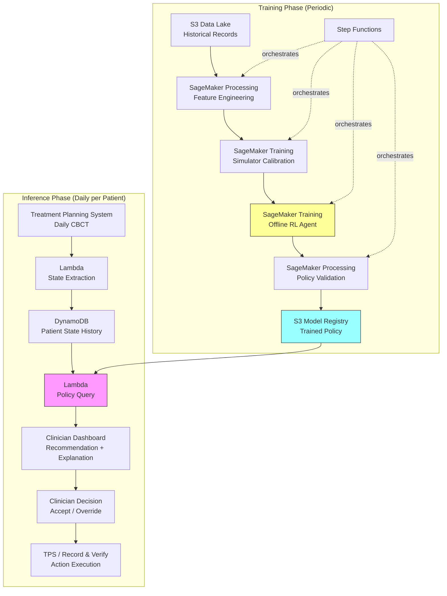

# Recipe 15.9 Architecture and Implementation: Radiation Therapy Adaptive Planning

*Companion to [Recipe 15.9: Radiation Therapy Adaptive Planning](chapter15.09-radiation-therapy-adaptive-planning). This page covers the AWS architecture, services, prerequisites, and pseudocode. For the problem framing and the conceptual approach, start with the main recipe.*

---

## The AWS Implementation

### Why These Services

**Amazon SageMaker for RL training.** SageMaker provides managed infrastructure for training RL agents, including support for custom environments, distributed training, and experiment tracking. The RL training workload is compute-intensive (GPU instances for deep RL) but episodic (you train periodically as new data accumulates, not continuously). SageMaker's managed training jobs handle the infrastructure lifecycle without maintaining persistent GPU clusters.

**Amazon S3 for data lake.** Treatment records, imaging features, trained models, and simulation outputs all need durable, versioned storage. S3 with versioning and lifecycle policies provides the foundation. Imaging data (even extracted features, not raw DICOM) can be large; S3's tiered storage keeps costs manageable.

**AWS Step Functions for pipeline orchestration.** The training pipeline (data extraction, feature engineering, simulator calibration, RL training, validation) is a multi-step workflow with dependencies. Step Functions coordinates these steps, handles retries, and provides visibility into pipeline state.

**Amazon DynamoDB for state tracking.** During inference, the system needs fast lookups of patient treatment history and current state. DynamoDB provides single-digit millisecond reads for the state vector associated with each active patient. Set a TTL attribute to archive completed treatment courses to S3 (for the training pipeline) and delete from DynamoDB after a retention period (90 days post-treatment completion) to limit PHI surface area in the hot store.

**AWS Lambda for inference.** The policy query at inference time is lightweight: pass a state vector through a neural network, get back an action recommendation. Lambda handles this with low latency and no idle cost between fractions. Note: with ~100 active patients each getting one recommendation per day, most invocations will be cold starts (1-3 seconds). This is clinically acceptable since recommendations are generated before the patient is on the treatment table, not during active beam delivery. For sub-second latency, use provisioned concurrency (1 instance, ~$15-20/month).

**Amazon CloudWatch for monitoring and alerting.** Track model performance metrics, recommendation acceptance rates, and safety constraint violations. Concrete drift detection: monitor the distribution of input state features (flag if KL divergence from training distribution exceeds threshold), track rolling clinician acceptance rate (alert if it drops below 50% over a 2-week window), and compare predicted vs. actual tumor volume trajectories for patients who followed recommendations (flag systematic prediction errors).

### Architecture Diagram



### Prerequisites

| Requirement | Details |
|-------------|---------|
| **AWS Services** | Amazon SageMaker, Amazon S3, AWS Step Functions, Amazon DynamoDB, AWS Lambda, Amazon CloudWatch, AWS KMS |
| **IAM Permissions** | `sagemaker:CreateTrainingJob`, `sagemaker:CreateProcessingJob`, `s3:GetObject`, `s3:PutObject`, `dynamodb:GetItem`, `dynamodb:PutItem`, `lambda:InvokeFunction`, `states:StartExecution`, `states:DescribeExecution`, `kms:Decrypt`, `kms:GenerateDataKey` (scoped to specific CMK ARN), `cloudwatch:PutMetricData`, `logs:CreateLogGroup`, `logs:PutLogEvents`. Scope all permissions to specific resource ARNs. |
| **BAA** | AWS BAA signed (treatment records and imaging features contain PHI) |
| **Encryption** | S3: SSE-KMS; DynamoDB: encryption at rest; Lambda environment variables: KMS; all transit: TLS 1.2+ |
| **VPC** | Production: all compute in VPC with VPC endpoints for S3 (gateway), DynamoDB (gateway), SageMaker API and Runtime (interface), Step Functions (interface), CloudWatch Logs (interface), CloudWatch Monitoring (interface), KMS (interface). No public internet access for training or inference workloads. Interface endpoints cost ~$7-8/month each in a 3-AZ deployment (~$50-60/month total). |
| **CloudTrail** | Enabled: log all API calls for HIPAA audit trail. Critical for tracking model versions used in clinical recommendations. |
| **Data Requirements** | Minimum 200-500 historical patients with complete treatment records (daily imaging features, delivered dose, replanning events, 6-month outcomes). More is better. |
| **Clinical Integration** | API access to treatment planning system (TPS) for state extraction and plan parameters. HL7 FHIR or proprietary TPS API. TPS integration requires network connectivity between the AWS VPC and the hospital network: options include AWS Direct Connect (lowest latency, highest reliability), Site-to-Site VPN (lower cost, acceptable for once-daily queries), or an API gateway intermediary with mutual TLS if the TPS exposes a public endpoint. |
| **Cost Estimate** | Training: $500-2,000 per training run (ml.p3.2xlarge, 24-72 hours). Inference: ~$0.01 per recommendation (Lambda). Storage: $50-200/month (features + models). |

### Ingredients

| AWS Service | Role |
|------------|------|
| **Amazon SageMaker** | RL agent training, simulator calibration, policy validation |
| **Amazon S3** | Data lake for treatment records, imaging features, trained models |
| **AWS Step Functions** | Orchestrates training pipeline (extract, engineer, train, validate) |
| **Amazon DynamoDB** | Patient state history for fast inference lookups |
| **AWS Lambda** | State extraction and policy inference at treatment time |
| **Amazon CloudWatch** | Monitoring, alerting, recommendation tracking |
| **AWS KMS** | Encryption key management for all PHI-containing stores |

### Code

#### Walkthrough

**Step 1: State extraction from daily imaging.** Before each treatment fraction, the patient undergoes positioning imaging (typically cone-beam CT). This step extracts the features that define the current treatment state: tumor volume relative to baseline, cumulative dose to target and organs at risk, fraction number, and imaging-derived metrics. The state vector is what the RL agent uses to make its recommendation. If this step produces garbage features, the policy makes garbage recommendations. Garbage in, garbage out applies with particular force when the output is a clinical recommendation.

```pseudocode
FUNCTION extract_state(patient_id, fraction_number):
    // Retrieve the latest imaging features for this patient.
    // These come from the treatment planning system or an imaging pipeline
    // that computes volumetric and dosimetric features from daily CBCT.
    imaging_features = fetch_imaging_features(patient_id, fraction_number)

    // Retrieve cumulative dose delivered so far (from record-and-verify system).
    // This includes dose to the tumor (PTV) and each organ at risk (OAR).
    cumulative_dose = fetch_cumulative_dose(patient_id, fraction_number)

    // Compute derived features that capture treatment trajectory.
    tumor_volume_ratio = imaging_features.current_tumor_volume / imaging_features.baseline_tumor_volume
    fractions_remaining = total_fractions - fraction_number
    fractions_since_last_replan = fraction_number - last_replan_fraction(patient_id)

    // Assemble the state vector. Order matters: must match training feature order.
    state = {
        fraction_number: fraction_number,
        fractions_remaining: fractions_remaining,
        tumor_volume_ratio: tumor_volume_ratio,
        tumor_volume_change_rate: compute_volume_trend(patient_id, window=5),
        cumulative_ptv_dose_gy: cumulative_dose.ptv_mean,
        cumulative_oar_doses: cumulative_dose.oar_dict,   // e.g., {"spinal_cord": 12.3, "parotid_L": 18.7}
        plan_conformity_index: imaging_features.conformity_index,
        patient_weight_change_kg: imaging_features.weight_change,
        fractions_since_replan: fractions_since_last_replan,
        current_plan_id: get_current_plan_id(patient_id)
    }

    // Store state for audit trail and future training data.
    store_state(patient_id, fraction_number, state)

    RETURN state
```

**Step 2: Policy inference (action recommendation).** This is where the trained RL agent earns its keep. Given the current state, the policy network outputs a recommended action and associated confidence. The action space is discrete: continue current plan, make minor intensity adjustments, or trigger a full replan. The confidence score reflects how certain the policy is about its recommendation, which helps clinicians calibrate their trust. A low-confidence recommendation should prompt more careful human review.

```pseudocode
FUNCTION get_recommendation(state, policy_model):
    // Load the trained policy model (neural network).
    // In production, this is cached in Lambda memory across invocations.
    policy = load_model(policy_model)

    // Normalize state features to match training distribution.
    // Drift between training and inference distributions is a major failure mode.
    normalized_state = normalize(state, training_statistics)

    // Query the policy for action probabilities.
    // The policy outputs a probability distribution over discrete actions.
    action_probs = policy.predict(normalized_state)

    // Select the recommended action (highest probability).
    recommended_action = argmax(action_probs)
    confidence = action_probs[recommended_action]

    // Safety check: verify the recommended action doesn't violate hard constraints.
    // This is the HARD constraint layer. Even if the policy recommends "continue,"
    // check that continuing won't push any OAR past its tolerance dose given
    // remaining fractions. Training-time penalties make unsafe recommendations
    // rare; this check makes them impossible to execute.
    safety_check = verify_constraints(state, recommended_action)

    IF safety_check.violated:
        // Override the policy recommendation with the safest feasible action.
        recommended_action = safety_check.safe_alternative
        confidence = 0.0  // signal to clinician that this is a safety override
        log_safety_override(state, original_action, recommended_action)

    RETURN {
        action: recommended_action,    // "continue" | "adjust" | "replan"
        confidence: confidence,            // 0.0 to 1.0
        reasoning: generate_explanation(state, recommended_action, action_probs),
        safety_flag: safety_check.violated
    }
```

**Step 3: Explanation generation.** A recommendation without explanation is useless in clinical practice. No radiation oncologist will accept "replan now" from a black box. This step generates a human-readable explanation of why the policy made its recommendation. It highlights the state features that most influenced the decision (using feature attribution methods like SHAP or attention weights) and compares the current patient's trajectory to historical patients where similar decisions led to good outcomes.

```pseudocode
FUNCTION generate_explanation(state, action, action_probs):
    // Compute feature importance for this specific recommendation.
    // Which state features most influenced the policy toward this action?
    feature_attributions = compute_shap_values(state, action)

    // Identify the top 3 contributing factors.
    top_factors = sort_by_magnitude(feature_attributions)[:3]

    // Find similar historical patients who received this action at a similar state.
    similar_cases = find_similar_historical(state, action, k=5)

    // Compute expected outcome difference between recommended action and alternatives.
    expected_outcomes = estimate_outcomes(state, all_actions)

    explanation = {
        primary_factors: top_factors,
        // e.g., ["tumor_volume_ratio decreased 22% (faster than expected)",
        //        "parotid_L dose approaching 26 Gy tolerance",
        //        "15 fractions since last replan"]
        similar_cases: summarize_cases(similar_cases),
        expected_benefit: expected_outcomes[action] - expected_outcomes["continue"],
        alternative_risks: describe_risks_of_alternatives(expected_outcomes)
    }

    RETURN explanation
```

**Step 4: Clinician decision capture and feedback loop.** The clinician reviews the recommendation and either accepts or overrides it. Both outcomes are valuable data. Acceptances validate the policy. Overrides (especially with clinician-provided reasoning) identify where the policy disagrees with expert judgment and provide signal for future training. This feedback loop is how the system improves over time without online experimentation on patients.

```pseudocode
FUNCTION capture_decision(patient_id, fraction, recommendation, clinician_decision):
    // Record the full decision context for audit and future training.
    decision_record = {
        patient_id: patient_id,
        fraction: fraction,
        timestamp: current_utc_timestamp(),
        recommendation: recommendation,         // what the policy suggested
        clinician_action: clinician_decision.action,  // what the clinician chose
        accepted: (recommendation.action == clinician_decision.action),
        override_reason: clinician_decision.reason,  // free text if overridden
        clinician_id: clinician_decision.physician_id
    }

    // Store in DynamoDB for fast access and in S3 for training pipeline.
    store_decision(decision_record)

    // Track acceptance rate for monitoring.
    // A sudden drop in acceptance rate signals policy drift or a change
    // in clinical practice that the model hasn't learned.
    update_acceptance_metrics(decision_record)

    RETURN decision_record
```

**Step 5: Offline RL training pipeline.** This runs periodically (monthly or quarterly) as new outcome data becomes available. It retrains the policy using the accumulated dataset of treatment episodes, including the clinician decisions captured in Step 4. The key challenge: you're training on a mix of policy-recommended actions and clinician overrides, which creates an off-policy learning problem. Conservative offline RL algorithms handle this by being pessimistic about actions that differ from the behavior policy (what was actually done).

```pseudocode
FUNCTION train_policy(training_config):
    // Load historical treatment episodes from the data lake.
    // Each episode is one patient's full treatment course: states, actions, rewards.
    episodes = load_episodes(training_config.data_path)

    // Augment with simulated episodes from the calibrated simulator.
    // Simulation provides coverage of states that are rare in historical data
    // (e.g., very fast tumor response, unusual anatomy).
    simulated = generate_simulated_episodes(
        simulator=training_config.simulator,
        n_episodes=training_config.sim_count,   // typically 5x-10x real data
        seed=training_config.random_seed
    )
    all_episodes = episodes + simulated

    // Train using Conservative Q-Learning (CQL).
    // CQL penalizes Q-values for actions not well-represented in the data,
    // preventing the policy from being overconfident about untested actions.
    policy = train_cql(
        episodes=all_episodes,
        state_dim=training_config.state_dim,
        action_dim=training_config.action_dim,
        safety_shaping_penalties=training_config.safety_constraints,
        // Safety shaping penalties encourage the policy to avoid unsafe actions
        // during training, but do NOT guarantee constraint satisfaction.
        // The inference-time safety check (Step 2) provides the hard guarantee.
        cql_alpha=training_config.conservatism,  // higher = more conservative
        epochs=training_config.epochs,
        learning_rate=training_config.lr
    )

    // Validate on held-out patients.
    validation_metrics = evaluate_policy(
        policy=policy,
        held_out_episodes=training_config.validation_set,
        metrics=["expected_tcp", "expected_ntcp", "replan_frequency", "constraint_violations"]
    )

    // Only promote to production if validation passes safety thresholds.
    IF validation_metrics.constraint_violations == 0
       AND validation_metrics.expected_tcp >= training_config.tcp_threshold:
        register_model(policy, version=training_config.version, metrics=validation_metrics)
        // Model versioning: S3 object versioning stores all artifacts.
        // A "current model" pointer (DynamoDB item or S3 tag) tells the inference
        // Lambda which version to load. Rollback = update the pointer.
        // Every recommendation output includes the model version ID for traceability.
    ELSE:
        alert_team("Policy validation failed", validation_metrics)

    RETURN validation_metrics
```

> **Curious how this looks in Python?** The pseudocode above covers the concepts. If you'd like to see sample Python code that demonstrates these patterns using boto3, check out the [Python Example](chapter15.09-python-example). It walks through each step with inline comments and notes on what you'd need to change for a real deployment.

### Expected Results

**Sample recommendation output:**

```json
{
  "patient_id": "PT-2026-04821",
  "fraction": 18,
  "recommendation": {
    "action": "replan",
    "confidence": 0.84,
    "reasoning": {
      "primary_factors": [
        "Tumor volume decreased 31% from baseline (above 25% threshold)",
        "Left parotid mean dose trending toward 26 Gy tolerance (currently 23.1 Gy)",
        "18 fractions since initial plan (no prior replan)"
      ],
      "expected_benefit": "Replanning now estimated to reduce left parotid final mean dose by 3.2 Gy while maintaining PTV coverage",
      "similar_cases": "4 of 5 similar historical patients who replanned at this stage had Grade 0-1 xerostomia vs. Grade 2-3 without replan"
    },
    "safety_flag": false
  },
  "timestamp": "2026-04-15T07:42:18Z"
}
```

**Performance benchmarks (from retrospective validation):**

These estimates come from simulator-based policy evaluation: rolling out the learned policy in the calibrated simulator and comparing outcomes against the fixed-schedule replanning baseline. This is the standard offline evaluation approach when you have a simulator, but it inherits all simulator fidelity limitations. Alternative offline policy evaluation methods (importance-weighted estimators, direct fitted Q-evaluation) have different failure modes but weren't used here due to high variance over 35-fraction horizons. Real-world validation of these numbers requires prospective clinical trials.

| Metric | Value |
|--------|-------|
| Recommendation latency | 1-3 seconds typical (cold start); < 500 ms warm |
| Policy agreement with expert replanning decisions | 72-78% |
| Estimated TCP improvement over fixed-schedule replanning | 2-5% (simulation) |
| Estimated NTCP reduction (parotid sparing) | 8-15% (simulation) |
| Safety constraint violations in validation | 0 (hard requirement) |
| Clinician acceptance rate (pilot studies) | 60-70% initially, improving with trust |
| Training time (full pipeline) | 24-72 hours on ml.p3.2xlarge |

**Where it struggles:**
- Patients with unusual anatomy (very large tumors, prior surgery) that are underrepresented in training data
- Rapid, unexpected changes (acute weight loss, tumor hemorrhage) that fall outside the simulator's calibration
- Cases where the "right" answer depends on patient preferences (quality of life vs. tumor control tradeoffs) that aren't captured in the state
- Integration with legacy treatment planning systems that don't expose APIs for automated state extraction

---

## Why This Isn't Production-Ready

Let's be direct about the gap between this architecture and clinical deployment:

**Regulatory pathway is unclear.** An RL agent that recommends treatment modifications is a clinical decision support tool at minimum, possibly a medical device depending on how autonomous it becomes. The regulatory pathway depends on how the system is positioned. If it meets the four criteria for non-device Clinical Decision Support under the 21st Century Cures Act (Section 3060): displays information, intended for clinician use, clinician can independently review the basis for the recommendation, and not intended to replace clinical judgment, it may be exempt from FDA device regulation entirely. If it doesn't qualify for the CDS exemption (for example, if it becomes more autonomous), De Novo classification is more likely than 510(k) given the absence of a predicate device. The FDA's Predetermined Change Control Plan framework is relevant for the periodic retraining aspect. Consult regulatory counsel early; the classification decision shapes the entire development and validation strategy.

**Simulator fidelity.** The entire training approach depends on the simulator being a reasonable approximation of reality. Tumor response dynamics are patient-specific and stochastic. The linear-quadratic model is a simplification. Anatomical deformation models are approximate. Every simplification in the simulator is a potential source of policy error in the real world.

**Distribution shift.** The policy was trained on historical data from specific institutions, specific patient populations, specific treatment protocols. Deploy it at a different institution with different equipment, different contouring practices, or a different patient mix, and performance may degrade. Transfer learning and domain adaptation are active research areas.

**Outcome attribution.** If a patient has a good outcome after following the RL policy's recommendations, was it because of the policy or despite it? Causal attribution in sequential treatment decisions is genuinely hard. You need randomized trials to establish causality, and those trials are expensive and slow.

---

## Variations and Extensions

**Multi-site generalization.** Train separate policies for different tumor sites (head and neck, lung, prostate, brain) since the anatomy, constraints, and response dynamics differ substantially. Share the infrastructure and training pipeline; customize the state representation, action space, and reward function per site.

**Continuous action space.** Instead of discrete "continue/adjust/replan," learn continuous beam intensity adjustments that can be applied fraction-by-fraction without full replanning. This requires actor-critic methods and tighter integration with the dose calculation engine, but enables finer-grained adaptation.

**Multi-agent formulation.** Model the radiation oncologist and the RL agent as collaborating agents. The RL agent proposes; the oncologist disposes. Learn a policy that accounts for the clinician's decision-making patterns (when they tend to override, what information they weight most heavily) and adapts its recommendations accordingly.

---

## Additional Resources

**AWS Documentation:**
- [Amazon SageMaker RL Documentation](https://docs.aws.amazon.com/sagemaker/latest/dg/reinforcement-learning.html)
- [Amazon SageMaker Training Jobs](https://docs.aws.amazon.com/sagemaker/latest/dg/how-it-works-training.html)
- [AWS Step Functions Developer Guide](https://docs.aws.amazon.com/step-functions/latest/dg/welcome.html)
- [AWS HIPAA Eligible Services](https://aws.amazon.com/compliance/hipaa-eligible-services-reference/)
- [Amazon SageMaker Pricing](https://aws.amazon.com/sagemaker/pricing/)

**Research References:**
<!-- TODO (TechWriter): Expert review V2 (MEDIUM). Verify and add specific paper citations for offline RL in radiation therapy (e.g., Tseng et al. on RL for adaptive radiotherapy). -->
<!-- TODO (TechWriter): Expert review V2 (MEDIUM). Verify citation: Kumar et al., "Conservative Q-Learning for Offline Reinforcement Learning," NeurIPS 2020. -->
<!-- TODO (TechWriter): Expert review V2 (MEDIUM). Verify citation: Fujimoto et al., "Off-Policy Deep Reinforcement Learning without Exploration," ICML 2019. -->

**Clinical Context:**
<!-- TODO (TechWriter): Expert review V2 (MEDIUM). Verify and add link to AAPM Task Group reports on adaptive radiation therapy. -->
<!-- TODO (TechWriter): Expert review V2 (MEDIUM). Verify and add link to ASTRO guidelines on image-guided radiation therapy. -->

---

## Estimated Implementation Time

| Phase | Duration |
|-------|----------|
| Basic (data pipeline + simulator + proof-of-concept policy) | 6-9 months |
| Production-ready (validated policy + clinician interface + feedback loop) | 12-18 months |
| With variations (multi-site, continuous actions, regulatory submission) | 24-36 months |

---


---

*← [Main Recipe 15.9](chapter15.09-radiation-therapy-adaptive-planning) · [Python Example](chapter15.09-python-example) · [Chapter Preface](chapter15-preface)*
