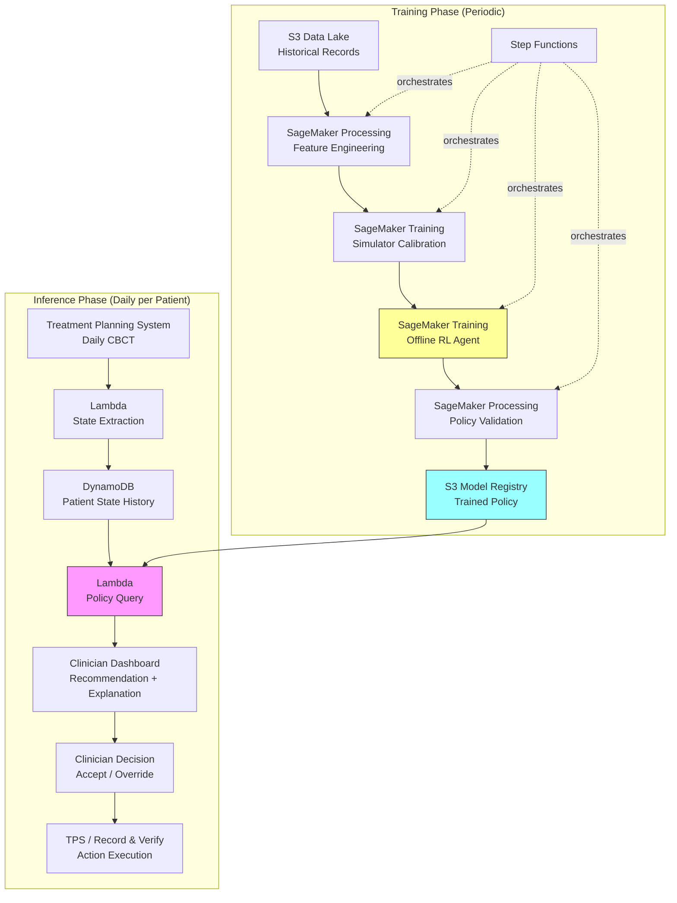

# Recipe 15.9: Radiation Therapy Adaptive Planning

**Complexity:** Complex · **Phase:** Research/Pilot · **Estimated Cost:** ~$2,000–$8,000/month (training infrastructure)

---

## The Problem

Here's the thing about radiation therapy that most people outside oncology don't realize: the plan you make on day one is wrong by day fifteen.

A patient gets diagnosed with a head and neck tumor. The radiation oncologist and medical physicist spend hours crafting a treatment plan. They use CT imaging to map the tumor volume. They calculate beam angles, intensities, and fractionation schedules that maximize dose to the tumor while sparing critical structures (the spinal cord, the parotid glands, the optic nerves). It's a beautiful optimization problem, and the initial solution is genuinely impressive.

Then the patient starts treatment. Over the course of 30 to 35 daily fractions (sessions), the tumor shrinks. The patient loses weight. The anatomy shifts. The parotid glands change shape. What was a perfectly optimized plan on day one is now delivering suboptimal dose to a target that has moved and changed size, while potentially over-irradiating normal tissue that has shifted into the beam path.

This is called anatomical adaptation, and it's one of the hardest problems in radiation oncology.

The current standard of care handles this crudely. Most centers create one plan and run it for the entire course. Some centers do "adaptive replanning" at fixed intervals (replan at fraction 15, maybe again at fraction 25). Each replan requires a new CT scan, new contouring (a physician manually outlining the tumor and organs on every slice), and new plan optimization. It takes hours of physicist and physician time. It costs the department significant resources. And the timing is arbitrary: replanning at fraction 15 might be too late for a fast-responding tumor or too early for a slow one.

The question that reinforcement learning can help answer: when should you replan, and how should the new plan differ from the current one? Not on a fixed schedule, but based on what's actually happening to this specific patient's anatomy and tumor response.

This is a sequential decision problem. At each fraction, you observe the patient's current state (imaging, dose delivered so far, tumor response). You decide whether to continue the current plan, make minor adjustments, or trigger a full replan. Each decision affects future options and outcomes. The reward is defined over the entire treatment course: maximize tumor control probability while minimizing normal tissue complication probability. Classic RL territory.

---

## The Technology: Reinforcement Learning for Sequential Treatment Decisions

### What Reinforcement Learning Actually Is

Reinforcement learning is a framework for learning optimal sequential decision-making. Unlike supervised learning (where you have labeled examples of correct answers), RL learns from interaction with an environment. An agent observes a state, takes an action, receives a reward, and transitions to a new state. Over many episodes, the agent learns a policy: a mapping from states to actions that maximizes cumulative reward over time.

The key insight that makes RL different from simple optimization: actions have consequences that unfold over time. Choosing to replan today affects what options you have tomorrow. Delivering a higher dose in early fractions constrains what you can safely deliver later. RL handles this temporal credit assignment naturally.

### The MDP Formulation for Radiation Therapy

To apply RL, you need to formalize the problem as a Markov Decision Process (MDP). Here's how that maps to radiation therapy:

**State (what the agent observes at each fraction):**
- Current fraction number (1 through 35, typically)
- Cumulative dose delivered to tumor volume (in Gray)
- Cumulative dose to each organ at risk (OAR)
- Tumor volume change from baseline (from imaging)
- Patient weight change
- Imaging features (CT or CBCT metrics: tumor density, shape, position)
- Current plan parameters (beam angles, intensities)
- Time since last replan

The state space is high-dimensional. A typical formulation might have 50 to 200 continuous features. This is where deep RL (using neural networks as function approximators) becomes necessary.

**Actions (what the agent can decide at each fraction):**
- Continue current plan (no change)
- Adjust beam intensities within tolerance (minor adaptation)
- Trigger full replan (new optimization from current anatomy)
- Modify fractionation (adjust remaining fraction doses)

The action space can be discrete (choose one of these options) or continuous (specify exact intensity adjustments). Discrete is simpler and more interpretable. Continuous gives finer control but is harder to validate.

**Reward (what defines "good"):**
This is where radiation therapy gets genuinely hard to formulate. The reward needs to capture:
- Tumor control probability (TCP): higher cumulative tumor dose is better, up to a point
- Normal tissue complication probability (NTCP): lower OAR doses are better
- Plan quality metrics (homogeneity, conformity)
- Replanning cost (each replan consumes clinical resources)

A typical reward function combines these:

```
reward = α × TCP_improvement - β × NTCP_increase - γ × replan_cost
```

The weights (α, β, γ) encode clinical priorities. Getting these right requires close collaboration with radiation oncologists. Different tumor sites have different priorities: for brain tumors, sparing the optic nerve might dominate; for lung tumors, sparing healthy lung tissue is paramount.

**Transition dynamics (how the world changes):**
This is the physics and biology. Tumor response to radiation follows stochastic dynamics. Patient anatomy changes are partially predictable (weight loss trends) and partially random (day-to-day positioning variation). The transition model is what makes simulation possible, and simulation is what makes offline RL training feasible.

### Why This Is Hard (The Honest Version)

**Safety constraints are non-negotiable.** You cannot explore freely. A policy that occasionally delivers 80 Gy to the spinal cord (the tolerance is around 50 Gy) is not acceptable, even if it achieves great tumor control on average. RL must operate within hard constraints, not just optimize expected reward. This requires constrained RL formulations (constrained MDPs, safe RL) that guarantee constraint satisfaction, not just penalize violations.

**Offline learning is mandatory.** You cannot run online RL on patients. You cannot randomize treatment decisions to explore the action space. All learning must happen from historical treatment data (retrospective plans, outcomes, imaging) or from simulation. Offline RL has well-known challenges: distribution shift (the learned policy encounters states that weren't in the training data), overestimation bias (the Q-function is optimistic about actions that were rarely taken), and evaluation difficulty (you can't easily test a new policy without deploying it).

**The reward is delayed and noisy.** Treatment outcomes (local control, toxicity) are measured months or years after treatment ends. You need proxy rewards that can be computed during treatment (dose metrics, imaging response) but these are imperfect surrogates for the outcomes you actually care about.

**Physics constraints.** Radiation dose delivery is governed by physics. Not every plan is physically achievable. The RL agent's actions must respect deliverability constraints (machine limitations, beam geometry, dose rate limits). This means the action space is constrained in complex, state-dependent ways.

**Multi-objective optimization.** There's no single "best" plan. There's a Pareto frontier of tradeoffs between tumor control and normal tissue sparing. Different clinicians have different preferences along this frontier. The RL policy needs to either learn a single compromise or be conditioned on preference parameters.

### Offline RL: Learning from Historical Data

Since online experimentation is impossible, the entire approach rests on offline RL (also called batch RL). The idea: learn a policy from a fixed dataset of historical treatment episodes without further interaction with the environment.

The dataset consists of historical patients who received radiation therapy. For each patient, you have:
- Daily imaging (CBCT or CT)
- The plan that was actually delivered
- Any replanning decisions that were made
- Treatment outcomes (tumor control, toxicity, survival)

Offline RL algorithms that work well here include:
- **Conservative Q-Learning (CQL):** Penalizes Q-values for out-of-distribution actions, preventing the policy from being overconfident about actions that were rarely taken in the data
- **Batch-Constrained Q-Learning (BCQ):** Restricts the policy to only select actions that are similar to those in the dataset
- **Decision Transformer:** Frames RL as sequence modeling, conditioning on desired returns to generate action sequences

The choice between these depends on your data volume and the degree to which you want the learned policy to deviate from historical practice.

### Simulation for Data Augmentation

Historical data alone is often insufficient. You might have 500 patients with full imaging and outcome data. That's not enough for deep RL. Simulation bridges the gap.

A radiation therapy simulator models:
- Tumor response dynamics (linear-quadratic model for cell kill, repopulation)
- Anatomical deformation (biomechanical models of tissue change)
- Imaging noise and artifacts
- Dose calculation (simplified but physically plausible)

The simulator generates synthetic treatment episodes that augment the real data. The RL agent trains on a mix of real and simulated episodes. The risk: if the simulator is wrong (and it will be, in some ways), the learned policy may not transfer to real patients. This is the sim-to-real gap, and it's a major research challenge.

### Where the Field Is Now

Radiation therapy adaptive planning with RL is firmly in the research stage. Several academic groups have published proof-of-concept results:
- Retrospective studies showing that RL-derived replanning schedules would have improved outcomes compared to fixed schedules
- Simulation studies demonstrating that RL policies learn clinically reasonable adaptation strategies
- Small prospective pilot studies (single-institution, heavily supervised)

No RL-based adaptive planning system is in routine clinical use as of 2026. The path to clinical deployment requires:
1. Large-scale retrospective validation
2. Prospective clinical trials (likely with clinician override capability)
3. FDA clearance (likely as a clinical decision support tool, not autonomous)
4. Integration with treatment planning systems (TPS) and record-and-verify systems

---

## General Architecture Pattern

At a conceptual level, the system has two phases: training (offline) and inference (clinical use).

### Training Phase

```
[Historical Data] → [Feature Engineering] → [Simulator Calibration] → [Offline RL Training] → [Policy Validation] → [Trained Policy]
```

**Historical Data Collection:** Gather retrospective treatment records including daily imaging, delivered plans, replanning events, and outcomes. This requires integration with the treatment planning system (TPS), the record-and-verify system, and the outcomes database.

**Feature Engineering:** Transform raw imaging and dosimetric data into the state representation. This includes computing tumor volume changes, OAR dose accumulation, and imaging-derived features (radiomics).

**Simulator Calibration:** Build and calibrate a treatment simulator using the historical data. Validate that simulated trajectories are statistically similar to real ones.

**Offline RL Training:** Train the policy using a combination of real historical episodes and simulated episodes. Apply safety constraints during training (constrained MDP formulation).

**Policy Validation:** Evaluate the learned policy on held-out historical patients. Compare decisions and predicted outcomes against actual clinical decisions. Perform sensitivity analysis on reward weights.

### Inference Phase (Clinical Decision Support)

```
[Daily Imaging] → [State Extraction] → [Policy Query] → [Recommendation + Explanation] → [Clinician Decision] → [Action Execution]
```

**Daily Imaging:** Before each fraction, the patient gets a cone-beam CT (CBCT) or similar imaging for positioning. This imaging also provides the anatomical information needed for state updates.

**State Extraction:** Compute the current state features from the latest imaging, cumulative dose records, and treatment history.

**Policy Query:** Pass the current state to the trained policy. Get back a recommended action (continue, adjust, replan) with associated confidence.

**Recommendation and Explanation:** Present the recommendation to the radiation oncologist with supporting evidence: why this action, what the expected outcome difference is, what the risk of inaction is. Explainability is critical for clinical adoption.

**Clinician Decision:** The physician makes the final call. The system is advisory, not autonomous. Every recommendation can be overridden.

**Action Execution:** If the clinician agrees, the recommended action is executed (plan continues, intensities are adjusted, or a full replan is initiated).

---

## The AWS Implementation

### Why These Services

**Amazon SageMaker for RL training.** SageMaker provides managed infrastructure for training RL agents, including support for custom environments, distributed training, and experiment tracking. The RL training workload is compute-intensive (GPU instances for deep RL) but episodic (you train periodically as new data accumulates, not continuously). SageMaker's managed training jobs handle the infrastructure lifecycle without maintaining persistent GPU clusters.

**Amazon S3 for data lake.** Treatment records, imaging features, trained models, and simulation outputs all need durable, versioned storage. S3 with versioning and lifecycle policies provides the foundation. Imaging data (even extracted features, not raw DICOM) can be large; S3's tiered storage keeps costs manageable.

**AWS Step Functions for pipeline orchestration.** The training pipeline (data extraction, feature engineering, simulator calibration, RL training, validation) is a multi-step workflow with dependencies. Step Functions coordinates these steps, handles retries, and provides visibility into pipeline state.

**Amazon DynamoDB for state tracking.** During inference, the system needs fast lookups of patient treatment history and current state. DynamoDB provides single-digit millisecond reads for the state vector associated with each active patient.

**AWS Lambda for inference.** The policy query at inference time is lightweight: pass a state vector through a neural network, get back an action recommendation. Lambda handles this with low latency and no idle cost between fractions.

**Amazon CloudWatch for monitoring and alerting.** Track model performance metrics, recommendation acceptance rates, and safety constraint violations. Alert on drift (recommendations diverging from historical patterns) or anomalies (unexpected state values).

### Architecture Diagram



### Prerequisites

| Requirement | Details |
|-------------|---------|
| **AWS Services** | Amazon SageMaker, Amazon S3, AWS Step Functions, Amazon DynamoDB, AWS Lambda, Amazon CloudWatch, AWS KMS |
| **IAM Permissions** | `sagemaker:CreateTrainingJob`, `sagemaker:CreateProcessingJob`, `s3:GetObject`, `s3:PutObject`, `dynamodb:GetItem`, `dynamodb:PutItem`, `lambda:InvokeFunction`, `states:StartExecution` |
| **BAA** | AWS BAA signed (treatment records and imaging features contain PHI) |
| **Encryption** | S3: SSE-KMS; DynamoDB: encryption at rest; Lambda environment variables: KMS; all transit: TLS 1.2+ |
| **VPC** | Production: all compute in VPC with VPC endpoints for S3, DynamoDB, SageMaker, CloudWatch Logs. No public internet access for training or inference workloads. |
| **CloudTrail** | Enabled: log all API calls for HIPAA audit trail. Critical for tracking model versions used in clinical recommendations. |
| **Data Requirements** | Minimum 200-500 historical patients with complete treatment records (daily imaging features, delivered dose, replanning events, 6-month outcomes). More is better. |
| **Clinical Integration** | API access to treatment planning system (TPS) for state extraction and plan parameters. HL7 FHIR or proprietary TPS API. |
| **Cost Estimate** | Training: $500-2,000 per training run (ml.p3.2xlarge, 24-72 hours). Inference: ~$0.01 per recommendation (Lambda). Storage: $50-200/month (features + models). |

### Ingredients

| AWS Service | Role |
|------------|------|
| **Amazon SageMaker** | RL agent training, simulator calibration, policy validation |
| **Amazon S3** | Data lake for treatment records, imaging features, trained models |
| **AWS Step Functions** | Orchestrates training pipeline (extract → engineer → train → validate) |
| **Amazon DynamoDB** | Patient state history for fast inference lookups |
| **AWS Lambda** | State extraction and policy inference at treatment time |
| **Amazon CloudWatch** | Monitoring, alerting, recommendation tracking |
| **AWS KMS** | Encryption key management for all PHI-containing stores |

### Code

#### Walkthrough

**Step 1: State extraction from daily imaging.** Before each treatment fraction, the patient undergoes positioning imaging (typically cone-beam CT). This step extracts the features that define the current treatment state: tumor volume relative to baseline, cumulative dose to target and organs at risk, fraction number, and imaging-derived metrics. The state vector is what the RL agent uses to make its recommendation. If this step produces garbage features, the policy makes garbage recommendations. Garbage in, garbage out applies with particular force when the output is a clinical recommendation.

```
FUNCTION extract_state(patient_id, fraction_number):
    // Retrieve the latest imaging features for this patient.
    // These come from the treatment planning system or an imaging pipeline
    // that computes volumetric and dosimetric features from daily CBCT.
    imaging_features = fetch_imaging_features(patient_id, fraction_number)

    // Retrieve cumulative dose delivered so far (from record-and-verify system).
    // This includes dose to the tumor (PTV) and each organ at risk (OAR).
    cumulative_dose = fetch_cumulative_dose(patient_id, fraction_number)

    // Compute derived features that capture treatment trajectory.
    tumor_volume_ratio = imaging_features.current_tumor_volume / imaging_features.baseline_tumor_volume
    fractions_remaining = total_fractions - fraction_number
    fractions_since_last_replan = fraction_number - last_replan_fraction(patient_id)

    // Assemble the state vector. Order matters: must match training feature order.
    state = {
        fraction_number:            fraction_number,
        fractions_remaining:        fractions_remaining,
        tumor_volume_ratio:         tumor_volume_ratio,
        tumor_volume_change_rate:   compute_volume_trend(patient_id, window=5),
        cumulative_ptv_dose_gy:     cumulative_dose.ptv_mean,
        cumulative_oar_doses:       cumulative_dose.oar_dict,   // e.g., {"spinal_cord": 12.3, "parotid_L": 18.7}
        plan_conformity_index:      imaging_features.conformity_index,
        patient_weight_change_kg:   imaging_features.weight_change,
        fractions_since_replan:     fractions_since_last_replan,
        current_plan_id:            get_current_plan_id(patient_id)
    }

    // Store state for audit trail and future training data.
    store_state(patient_id, fraction_number, state)

    RETURN state
```

**Step 2: Policy inference (action recommendation).** This is where the trained RL agent earns its keep. Given the current state, the policy network outputs a recommended action and associated confidence. The action space is discrete: continue current plan, make minor intensity adjustments, or trigger a full replan. The confidence score reflects how certain the policy is about its recommendation, which helps clinicians calibrate their trust. A low-confidence recommendation should prompt more careful human review.

```
FUNCTION get_recommendation(state, policy_model):
    // Load the trained policy model (neural network).
    // In production, this is cached in Lambda memory across invocations.
    policy = load_model(policy_model)

    // Normalize state features to match training distribution.
    // Drift between training and inference distributions is a major failure mode.
    normalized_state = normalize(state, training_statistics)

    // Query the policy for action probabilities.
    // The policy outputs a probability distribution over discrete actions.
    action_probs = policy.predict(normalized_state)

    // Select the recommended action (highest probability).
    recommended_action = argmax(action_probs)
    confidence = action_probs[recommended_action]

    // Safety check: verify the recommended action doesn't violate hard constraints.
    // Even if the policy recommends "continue," check that continuing won't
    // push any OAR past its tolerance dose given remaining fractions.
    safety_check = verify_constraints(state, recommended_action)

    IF safety_check.violated:
        // Override the policy recommendation with the safest feasible action.
        recommended_action = safety_check.safe_alternative
        confidence = 0.0  // signal to clinician that this is a safety override
        log_safety_override(state, original_action, recommended_action)

    RETURN {
        action:      recommended_action,    // "continue" | "adjust" | "replan"
        confidence:  confidence,            // 0.0 to 1.0
        reasoning:   generate_explanation(state, recommended_action, action_probs),
        safety_flag: safety_check.violated
    }
```

**Step 3: Explanation generation.** A recommendation without explanation is useless in clinical practice. No radiation oncologist will accept "replan now" from a black box. This step generates a human-readable explanation of why the policy made its recommendation. It highlights the state features that most influenced the decision (using feature attribution methods like SHAP or attention weights) and compares the current patient's trajectory to historical patients where similar decisions led to good outcomes.

```
FUNCTION generate_explanation(state, action, action_probs):
    // Compute feature importance for this specific recommendation.
    // Which state features most influenced the policy toward this action?
    feature_attributions = compute_shap_values(state, action)

    // Identify the top 3 contributing factors.
    top_factors = sort_by_magnitude(feature_attributions)[:3]

    // Find similar historical patients who received this action at a similar state.
    similar_cases = find_similar_historical(state, action, k=5)

    // Compute expected outcome difference between recommended action and alternatives.
    expected_outcomes = estimate_outcomes(state, all_actions)

    explanation = {
        primary_factors:    top_factors,
        // e.g., ["tumor_volume_ratio decreased 22% (faster than expected)",
        //        "parotid_L dose approaching 26 Gy tolerance",
        //        "15 fractions since last replan"]
        similar_cases:      summarize_cases(similar_cases),
        expected_benefit:   expected_outcomes[action] - expected_outcomes["continue"],
        alternative_risks:  describe_risks_of_alternatives(expected_outcomes)
    }

    RETURN explanation
```

**Step 4: Clinician decision capture and feedback loop.** The clinician reviews the recommendation and either accepts or overrides it. Both outcomes are valuable data. Acceptances validate the policy. Overrides (especially with clinician-provided reasoning) identify where the policy disagrees with expert judgment and provide signal for future training. This feedback loop is how the system improves over time without online experimentation on patients.

```
FUNCTION capture_decision(patient_id, fraction, recommendation, clinician_decision):
    // Record the full decision context for audit and future training.
    decision_record = {
        patient_id:         patient_id,
        fraction:           fraction,
        timestamp:          current_utc_timestamp(),
        recommendation:     recommendation,         // what the policy suggested
        clinician_action:   clinician_decision.action,  // what the clinician chose
        accepted:           (recommendation.action == clinician_decision.action),
        override_reason:    clinician_decision.reason,  // free text if overridden
        clinician_id:       clinician_decision.physician_id
    }

    // Store in DynamoDB for fast access and in S3 for training pipeline.
    store_decision(decision_record)

    // Track acceptance rate for monitoring.
    // A sudden drop in acceptance rate signals policy drift or a change
    // in clinical practice that the model hasn't learned.
    update_acceptance_metrics(decision_record)

    RETURN decision_record
```

**Step 5: Offline RL training pipeline.** This runs periodically (monthly or quarterly) as new outcome data becomes available. It retrains the policy using the accumulated dataset of treatment episodes, including the clinician decisions captured in Step 4. The key challenge: you're training on a mix of policy-recommended actions and clinician overrides, which creates an off-policy learning problem. Conservative offline RL algorithms handle this by being pessimistic about actions that differ from the behavior policy (what was actually done).

```
FUNCTION train_policy(training_config):
    // Load historical treatment episodes from the data lake.
    // Each episode is one patient's full treatment course: states, actions, rewards.
    episodes = load_episodes(training_config.data_path)

    // Augment with simulated episodes from the calibrated simulator.
    // Simulation provides coverage of states that are rare in historical data
    // (e.g., very fast tumor response, unusual anatomy).
    simulated = generate_simulated_episodes(
        simulator=training_config.simulator,
        n_episodes=training_config.sim_count,   // typically 5x-10x real data
        seed=training_config.random_seed
    )
    all_episodes = episodes + simulated

    // Train using Conservative Q-Learning (CQL).
    // CQL penalizes Q-values for actions not well-represented in the data,
    // preventing the policy from being overconfident about untested actions.
    policy = train_cql(
        episodes=all_episodes,
        state_dim=training_config.state_dim,
        action_dim=training_config.action_dim,
        constraint_penalties=training_config.safety_constraints,
        // Safety constraints are encoded as penalty terms:
        // if an action would push any OAR past tolerance, apply large negative reward.
        cql_alpha=training_config.conservatism,  // higher = more conservative
        epochs=training_config.epochs,
        learning_rate=training_config.lr
    )

    // Validate on held-out patients.
    validation_metrics = evaluate_policy(
        policy=policy,
        held_out_episodes=training_config.validation_set,
        metrics=["expected_tcp", "expected_ntcp", "replan_frequency", "constraint_violations"]
    )

    // Only promote to production if validation passes safety thresholds.
    IF validation_metrics.constraint_violations == 0
       AND validation_metrics.expected_tcp >= training_config.tcp_threshold:
        register_model(policy, version=training_config.version, metrics=validation_metrics)
    ELSE:
        alert_team("Policy validation failed", validation_metrics)

    RETURN validation_metrics
```

> **Curious how this looks in Python?** The pseudocode above covers the concepts. If you'd like to see sample Python code that demonstrates these patterns using boto3, check out the [Python Example](chapter15.09-python-example). It walks through each step with inline comments and notes on what you'd need to change for a real deployment.

### Expected Results

**Sample recommendation output:**

```json
{
  "patient_id": "PT-2026-04821",
  "fraction": 18,
  "recommendation": {
    "action": "replan",
    "confidence": 0.84,
    "reasoning": {
      "primary_factors": [
        "Tumor volume decreased 31% from baseline (above 25% threshold)",
        "Left parotid mean dose trending toward 26 Gy tolerance (currently 23.1 Gy)",
        "18 fractions since initial plan (no prior replan)"
      ],
      "expected_benefit": "Replanning now estimated to reduce left parotid final mean dose by 3.2 Gy while maintaining PTV coverage",
      "similar_cases": "4 of 5 similar historical patients who replanned at this stage had Grade 0-1 xerostomia vs. Grade 2-3 without replan"
    },
    "safety_flag": false
  },
  "timestamp": "2026-04-15T07:42:18Z"
}
```

**Performance benchmarks (from retrospective validation):**

| Metric | Value |
|--------|-------|
| Recommendation latency | < 500 ms |
| Policy agreement with expert replanning decisions | 72-78% |
| Estimated TCP improvement over fixed-schedule replanning | 2-5% (simulation) |
| Estimated NTCP reduction (parotid sparing) | 8-15% (simulation) |
| Safety constraint violations in validation | 0 (hard requirement) |
| Clinician acceptance rate (pilot studies) | 60-70% initially, improving with trust |
| Training time (full pipeline) | 24-72 hours on ml.p3.2xlarge |

**Where it struggles:**
- Patients with unusual anatomy (very large tumors, prior surgery) that are underrepresented in training data
- Rapid, unexpected changes (acute weight loss, tumor hemorrhage) that fall outside the simulator's calibration
- Cases where the "right" answer depends on patient preferences (quality of life vs. tumor control tradeoffs) that aren't captured in the state
- Integration with legacy treatment planning systems that don't expose APIs for automated state extraction

---

## Why This Isn't Production-Ready

Let's be direct about the gap between this architecture and clinical deployment:

**Regulatory pathway is unclear.** An RL agent that recommends treatment modifications is a clinical decision support tool at minimum, possibly a medical device depending on how autonomous it becomes. FDA clearance (likely 510(k) or De Novo) requires clinical evidence that the system improves outcomes or is at least non-inferior to standard practice. That evidence doesn't exist yet at scale.

**Simulator fidelity.** The entire training approach depends on the simulator being a reasonable approximation of reality. Tumor response dynamics are patient-specific and stochastic. The linear-quadratic model is a simplification. Anatomical deformation models are approximate. Every simplification in the simulator is a potential source of policy error in the real world.

**Distribution shift.** The policy was trained on historical data from specific institutions, specific patient populations, specific treatment protocols. Deploy it at a different institution with different equipment, different contouring practices, or a different patient mix, and performance may degrade. Transfer learning and domain adaptation are active research areas.

**Outcome attribution.** If a patient has a good outcome after following the RL policy's recommendations, was it because of the policy or despite it? Causal attribution in sequential treatment decisions is genuinely hard. You need randomized trials to establish causality, and those trials are expensive and slow.

---

## The Honest Take

This is one of the most intellectually satisfying applications of RL I've encountered, and also one of the hardest to deploy responsibly.

The fundamental tension: RL is most valuable when it can discover strategies that humans haven't considered. But in radiation therapy, "strategies humans haven't considered" might mean "strategies that are dangerous in ways we don't understand yet." The conservative offline RL approach (CQL, BCQ) addresses this by staying close to historical practice, but that also limits the potential upside. If the policy can only recommend actions similar to what clinicians already do, what's the point?

The point is timing and personalization. Clinicians already know how to replan. They don't always know the optimal moment to replan for a specific patient. The RL agent's value isn't in discovering novel treatment strategies; it's in identifying the right moment to apply known strategies based on patient-specific trajectory data that's hard for humans to integrate across 30+ fractions.

The acceptance rate problem is real. In pilot studies, clinicians override RL recommendations 30-40% of the time. Some of those overrides are because the clinician has information the model doesn't (patient preference, comorbidities not in the state). Some are because the clinician doesn't trust the model yet. Distinguishing these cases is important for improving the system.

The thing that surprised me most: the reward function design takes longer than the RL algorithm implementation. Getting radiation oncologists to agree on the relative importance of TCP vs. NTCP vs. replanning cost, and to express those preferences as numerical weights, is a months-long conversation. And different oncologists have legitimately different preferences. A single reward function may not capture the diversity of reasonable clinical practice.

Start with the simplest version: binary "replan yes/no" recommendations for a single tumor site (head and neck is the most studied). Get the data pipeline working. Get the clinician interface right. Get the feedback loop running. The RL algorithm is the easy part. Everything around it is hard.

---

## Variations and Extensions

**Multi-site generalization.** Train separate policies for different tumor sites (head and neck, lung, prostate, brain) since the anatomy, constraints, and response dynamics differ substantially. Share the infrastructure and training pipeline; customize the state representation, action space, and reward function per site.

**Continuous action space.** Instead of discrete "continue/adjust/replan," learn continuous beam intensity adjustments that can be applied fraction-by-fraction without full replanning. This requires actor-critic methods and tighter integration with the dose calculation engine, but enables finer-grained adaptation.

**Multi-agent formulation.** Model the radiation oncologist and the RL agent as collaborating agents. The RL agent proposes; the oncologist disposes. Learn a policy that accounts for the clinician's decision-making patterns (when they tend to override, what information they weight most heavily) and adapts its recommendations accordingly.

---

## Related Recipes

- **Recipe 15.8 (Chemotherapy Dose Optimization):** Similar RL formulation for sequential treatment decisions, but with different dynamics (pharmacokinetics vs. radiation physics) and different safety constraints
- **Recipe 15.6 (Glucose Control in ICU):** Demonstrates constrained RL with continuous state/action spaces and hard safety bounds, applicable pattern for OAR dose constraints
- **Recipe 15.4 (Sepsis Treatment Optimization):** Covers offline RL from observational data in detail, including distribution shift challenges that apply directly here
- **Recipe 9.7 (Radiology AI Triage):** Covers medical imaging feature extraction patterns relevant to the state extraction step
- **Recipe 14.9 (Chemotherapy Scheduling):** Optimization-based approach to treatment scheduling that could serve as a baseline comparison

---

## Additional Resources

**AWS Documentation:**
- [Amazon SageMaker RL Documentation](https://docs.aws.amazon.com/sagemaker/latest/dg/reinforcement-learning.html)
- [Amazon SageMaker Training Jobs](https://docs.aws.amazon.com/sagemaker/latest/dg/how-it-works-training.html)
- [AWS Step Functions Developer Guide](https://docs.aws.amazon.com/step-functions/latest/dg/welcome.html)
- [AWS HIPAA Eligible Services](https://aws.amazon.com/compliance/hipaa-eligible-services-reference/)
- [Amazon SageMaker Pricing](https://aws.amazon.com/sagemaker/pricing/)

**Research References:**
- TODO: Verify and add specific paper citations for offline RL in radiation therapy (e.g., work from Tseng et al. on RL for adaptive radiotherapy)
- TODO: Verify citation for Conservative Q-Learning (Kumar et al., NeurIPS 2020)
- TODO: Verify citation for Batch-Constrained Q-Learning (Fujimoto et al., ICML 2019)

**Clinical Context:**
- TODO: Verify link to AAPM Task Group reports on adaptive radiation therapy
- TODO: Verify link to ASTRO guidelines on image-guided radiation therapy

---

## Estimated Implementation Time

| Phase | Duration |
|-------|----------|
| Basic (data pipeline + simulator + proof-of-concept policy) | 6-9 months |
| Production-ready (validated policy + clinician interface + feedback loop) | 12-18 months |
| With variations (multi-site, continuous actions, regulatory submission) | 24-36 months |

---

## Tags

`reinforcement-learning` · `radiation-therapy` · `adaptive-planning` · `offline-rl` · `treatment-optimization` · `safety-critical` · `complex` · `research-stage` · `sagemaker` · `step-functions` · `clinical-decision-support` · `hipaa` · `fda`

---

*← [Recipe 15.8: Chemotherapy Dose Optimization](chapter15.08-chemotherapy-dose-optimization) · [Chapter 15 Index](chapter15-index) · [Next: Recipe 15.10: Hospital Resource Allocation Under Uncertainty →](chapter15.10-hospital-resource-allocation-under-uncertainty)*
