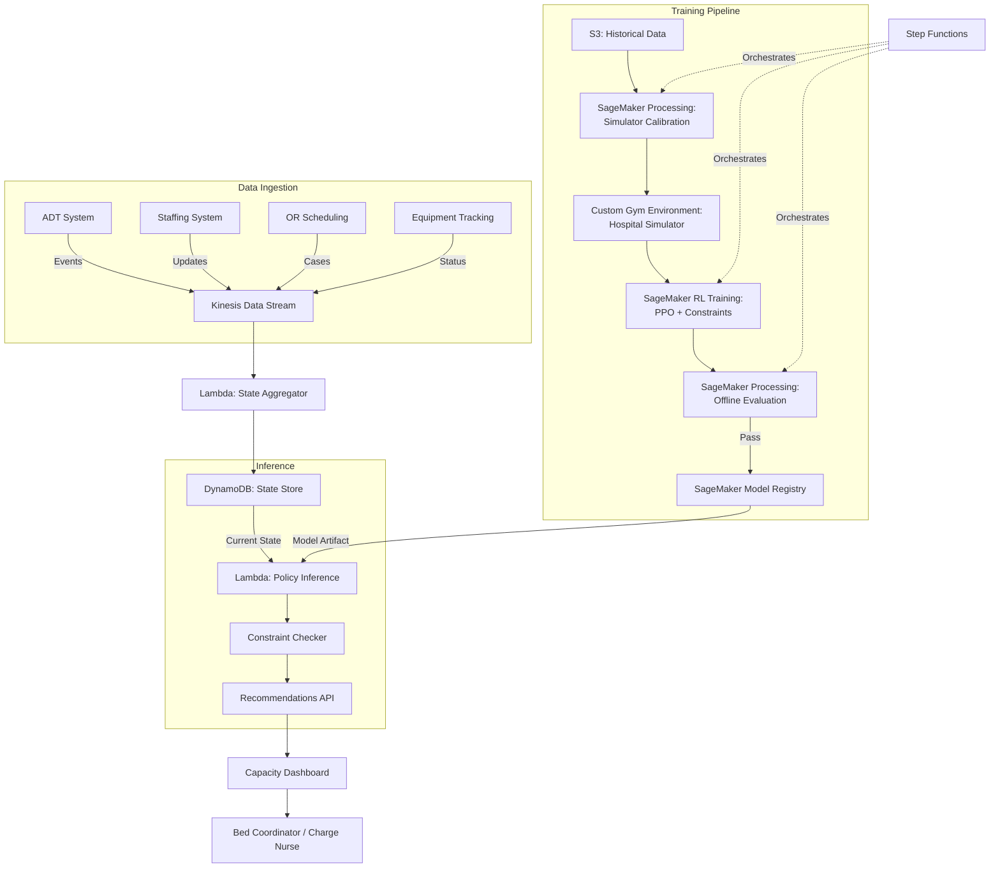

# Recipe 15.10 Architecture and Implementation: Hospital Resource Allocation Under Uncertainty

*Companion to [Recipe 15.10: Hospital Resource Allocation Under Uncertainty](chapter15.10-hospital-resource-allocation-uncertainty). This page covers the AWS architecture, services, and prerequisites. For the problem framing, conceptual approach, and pseudocode walkthrough, start with the main recipe.*

---

## The AWS Implementation

### Why These Services

**Amazon SageMaker for RL training.** SageMaker provides managed RL training with support for custom environments, multiple RL algorithms (through RLlib integration), and distributed training across multiple instances. For a complex hospital simulation environment, you need GPU instances for the policy network and CPU instances for running multiple simulator copies in parallel. SageMaker handles this orchestration.

**AWS Step Functions for the training pipeline.** The end-to-end flow (data extraction, simulator calibration, training, evaluation, model registration) is a multi-step workflow with conditional logic (only deploy if evaluation metrics exceed threshold). Step Functions orchestrates this cleanly with retry logic and error handling.

**Amazon Kinesis Data Streams for real-time state ingestion.** Hospital operational data arrives continuously from multiple source systems. Kinesis ingests ADT events, staffing updates, and equipment status changes in real-time, feeding the state aggregator that builds the current hospital state vector.

**Amazon DynamoDB for state storage and action logging.** Every state observation and every recommendation (accepted or rejected) gets logged. DynamoDB's single-digit-millisecond latency supports real-time inference while its durability supports audit requirements. The time-series nature of the data maps well to DynamoDB's sort key patterns.

**AWS Lambda for inference.** Once trained, the policy network is relatively small (a few hundred MB). Lambda can load the model and produce a recommendation in under a second given a state vector. For a decision support system that produces recommendations every 15-30 minutes, Lambda's per-invocation pricing is more economical than a persistent endpoint.

**Amazon S3 for training data and model artifacts.** Historical operational data, simulator configurations, training checkpoints, and final model artifacts all live in S3. Lifecycle policies manage the volume of training data over time.

### Architecture Diagram

### Prerequisites

| Requirement | Details |
|-------------|---------|
| AWS Services | SageMaker, Step Functions, Kinesis, DynamoDB, Lambda, S3, API Gateway, CloudWatch |
| IAM Permissions | sagemaker:CreateTrainingJob, sagemaker:CreateModel, sagemaker:DescribeTrainingJob, kinesis:GetRecords, kinesis:DescribeStream, kinesis:GetShardIterator, dynamodb:PutItem/GetItem, lambda:InvokeFunction, s3:GetObject/PutObject, states:StartExecution, kms:Decrypt, kms:GenerateDataKey (scoped to CMK ARN), cloudwatch:PutMetricData, logs:CreateLogGroup, logs:PutLogEvents, execute-api:Invoke. All permissions should use resource-level ARN restrictions rather than wildcards. |
| BAA | Required. All operational data contains patient identifiers (room assignments, acuity levels). |
| Encryption | S3 SSE-KMS, DynamoDB encryption at rest, Kinesis server-side encryption, Lambda environment variable encryption |
| VPC | Training and inference in private subnets. VPC endpoints for S3, DynamoDB, SageMaker, Kinesis Streams, Step Functions, CloudWatch, CloudWatch Logs, and API Gateway (or configure as private API). NAT Gateway is acceptable as fallback for services without VPC endpoint support, but VPC endpoints are preferred for PHI workloads to keep traffic off the public internet. |
| CloudTrail | All API calls logged. DynamoDB streams for state change audit. |
| Sample Data | Synthetic hospital operational data for development. Real ADT feeds for calibration (data governance approval needed, and it takes longer than you think). |
| Cost Estimate | Training: ~$500-2,000 per training run (GPU instances for 8-24 hours). Inference: ~$50-200/month (Lambda invocations every 15-30 min). Data storage: ~$100-500/month. |

### Ingredients

| AWS Service | Role in This Recipe |
|-------------|-------------------|
| Amazon SageMaker | RL model training with custom hospital simulation environment |
| AWS Step Functions | Orchestration of training, evaluation, and deployment pipeline |
| Amazon Kinesis Data Streams | Real-time ingestion of hospital operational events |
| Amazon DynamoDB | State storage, action logging, and audit trail |
| AWS Lambda | State aggregation and policy inference |
| Amazon S3 | Training data, simulator configs, model artifacts |
| Amazon API Gateway | REST endpoint for recommendation requests |
| Amazon CloudWatch | Monitoring model performance and operational metrics |

---

## Pseudocode Walkthrough

The full pseudocode walkthrough for this recipe (state vector construction, simulator definition, PPO training with Lagrangian constraints, offline policy evaluation, and decision support inference) lives in the main recipe's "Code: Pseudocode Walkthrough" section. See [Recipe 15.10 main recipe](chapter15.10-hospital-resource-allocation-uncertainty) for the step-by-step pseudocode with business-level explanations and inline comments.

> **Curious how this looks in Python?** The pseudocode above covers the concepts. If you'd like to see sample Python code that demonstrates these patterns using boto3, check out the [Python Example](chapter15.10-python-example). It walks through each step with inline comments and notes on what you'd need to change for a real deployment.

---

## Expected Results

See the main recipe's [Expected Results section](chapter15.10-hospital-resource-allocation-uncertainty) for sample recommendation JSON output, performance benchmark tables (ED boarding reduction, surgical cancellation improvements, staffing violation metrics), and a discussion of where the system struggles.

Key numbers from simulation-based evaluation:
- ED boarding hours reduced ~33% vs. human-only baseline
- Surgical cancellations reduced ~34%
- Staffing ratio violations reduced ~57%
- Recommendation latency under 800ms (Lambda cold start)

---

## Why This Isn't Production-Ready

This architecture shows the structural components, but a production deployment needs:

- **Simulator calibration.** The hospital simulator must be fitted to 2+ years of your facility's ADT, staffing, and equipment data. Generic parameters produce generic (wrong) policies.
- **Proper OPE pipeline.** The offline evaluation step needs multiple estimators (importance sampling, doubly-robust, fitted Q-evaluation) cross-checked against each other. A single estimator can be misleading.
- **Human factors integration.** The dashboard needs UX research with actual charge nurses and bed coordinators. Recommendation acceptance tracking, override reason collection, and interface iteration based on real usage patterns.
- **Continuous monitoring.** Model drift detection (is the policy still performing well as hospital patterns change?), data quality alerting (are source systems sending stale data?), and automated fallback to human-only mode if confidence drops.
- **Operational runbook.** What happens when the model disagrees with the charge nurse? When the system goes down during a surge? When a new unit opens or staffing models change? These operational procedures are not engineering problems but they determine whether the system actually gets used.
- **IRB/compliance review.** The reward function encodes value judgments about patient prioritization. This requires ethical review, not just technical validation.

---

## Variations and Extensions

### 1. Multi-Hospital System Coordination

For health systems with multiple campuses, extend the state to include inter-facility transfer options. The action space includes "divert ambulance to campus B" and "transfer patient from campus A ICU to campus C step-down." This turns a single-agent problem into a multi-agent coordination problem. Start with a centralized policy that observes all campuses, then explore decentralized execution with communication.

### 2. Surge Capacity Planning (Pandemic Mode)

Add a "surge mode" to the simulation that models pandemic-scale demand increases. Train a separate policy (or a mode-conditional policy) for surge scenarios where normal operating procedures are suspended. This includes activating non-traditional spaces (conference rooms as patient areas), crisis staffing ratios, and equipment redeployment. The policy must recognize when to recommend activating surge protocols.

### 3. Predictive Pre-positioning

Rather than reacting to current state, use forecasting models (see Chapter 12 recipes on hospital census and ED arrival forecasting) to predict state 4-8 hours ahead. Feed predicted future state into the policy to enable proactive resource positioning. This is where RL and forecasting integrate: the forecast provides the "look-ahead" and the policy decides what to do about it.

---

## Additional Resources

### AWS Documentation

- [Amazon SageMaker RL Documentation](https://docs.aws.amazon.com/sagemaker/latest/dg/reinforcement-learning.html) - Setup and configuration for RL training jobs
- [SageMaker Custom Environments](https://docs.aws.amazon.com/sagemaker/latest/dg/reinforcement-learning-rl-environments.html) - How to bring your own simulation environment
- [Amazon Kinesis Data Streams Developer Guide](https://docs.aws.amazon.com/streams/latest/dev/introduction.html) - Real-time data ingestion patterns
- [AWS Step Functions Developer Guide](https://docs.aws.amazon.com/step-functions/latest/dg/welcome.html) - Workflow orchestration for ML pipelines
- [DynamoDB Best Practices](https://docs.aws.amazon.com/amazondynamodb/latest/developerguide/best-practices.html) - Time-series data patterns for state logging
- [AWS Lambda for ML Inference](https://docs.aws.amazon.com/lambda/latest/dg/lambda-ml.html) - Deploying models for real-time inference

### Research and Background

### Healthcare Operations Context

---

## Estimated Implementation Time

| Phase | Timeline | What You're Building |
|-------|----------|---------------------|
| Basic (simulation only) | 4-6 months | Hospital simulator, basic RL training loop, offline evaluation against historical data. No live integration. Proves feasibility. |
| Production-ready | 12-18 months | Real-time data pipeline, validated simulator, trained and evaluated policy, decision support UI, human workflow integration, monitoring. |
| With variations | 18-24 months | Multi-campus coordination, surge mode, predictive pre-positioning, continuous learning from human feedback. |

---

*← [Main Recipe 15.10](chapter15.10-hospital-resource-allocation-uncertainty) · [Python Example](chapter15.10-python-example) · [Chapter Preface](chapter15-preface)*
