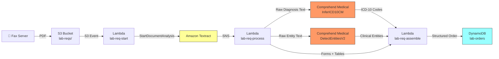

# Recipe 1.3 — Lab Requisition Form Extraction 🔶

**Complexity:** Moderate · **Phase:** Phase 2 · **Estimated Cost:** ~$0.008 per form

---

## Problem Statement

A lab requisition form arrives by fax — a physician has ordered tests for a patient, and the payer needs to process it for authorization or claims adjudication. The form contains ordered tests (often as checked boxes from a pre-printed list), the ordering provider's name and NPI, patient identifiers, and critically, ICD-10 diagnosis codes that justify the tests.

Here's where it gets harder than intake forms: ICD-10 codes may be handwritten, abbreviated, or listed as free-text diagnoses instead of codes. "Type 2 DM" needs to become `E11.9`. A checkbox next to "CBC" needs to map to CPT code `85025`. And the payer's utilization management system needs all of this structured, coded, and cross-referenced — not as raw text but as machine-actionable clinical data.

This recipe layers Amazon Comprehend Medical on top of the Textract extraction pattern from Recipes 1.1 and 1.2, adding medical NLP to bridge the gap between what's written on the form and what the downstream systems need.

## Solution Overview

The pipeline combines two services:

1. **Amazon Textract** (familiar from Recipes 1.1-1.2) extracts the form's structure: key-value pairs, tables of ordered tests, checkbox selections.
2. **Amazon Comprehend Medical** adds the clinical intelligence: extracting ICD-10 codes from free-text diagnoses, identifying medication names, detecting provider names, and linking them to standard medical ontologies (ICD-10-CM, RxNorm, SNOMED CT).

The key architectural decision: we run Textract first to extract raw text, then pass that text through Comprehend Medical for clinical entity extraction. This two-stage approach works better than trying to do everything in one pass — Textract is optimized for document layout understanding, Comprehend Medical is optimized for clinical NLP.

**Pipeline:**

1. Faxed lab requisition (PDF) lands in S3
2. Async Textract job extracts forms + tables (same as Recipe 1.2)
3. Parse checkboxes for ordered tests, key-value pairs for patient/provider info
4. Feed free-text diagnosis field through Comprehend Medical `DetectEntitiesV2`
5. Map detected entities to ICD-10-CM codes using Comprehend Medical's `InferICD10CM`
6. Cross-reference ordered tests against diagnosis codes for medical necessity
7. Output structured order with coded data to DynamoDB

## Architecture Diagram



## Prerequisites

| Requirement | Details |
|-------------|---------|
| **AWS Services** | Everything from Recipe 1.2, plus Amazon Comprehend Medical |
| **IAM Permissions** | All from Recipe 1.2, plus: `comprehend-medical:DetectEntitiesV2`, `comprehend-medical:InferICD10CM` |
| **HIPAA Controls** | Same as Recipe 1.1. Comprehend Medical is a [HIPAA-eligible service](https://aws.amazon.com/compliance/hipaa-eligible-services-reference/) — no additional BAA action needed beyond the account-level BAA. |
| **Sample Data** | Standard lab requisition templates (Quest Diagnostics, LabCorp publish sample forms). Create synthetic versions with realistic ICD-10 codes and test panels. |
| **Cost Estimate** | Textract (FORMS + TABLES): ~$0.003/page. Comprehend Medical DetectEntitiesV2: $0.01 per 100 characters (unit). InferICD10CM: $0.01 per unit. A typical lab req with 200 characters of diagnosis text: ~$0.005 for Comprehend Medical. Total: ~$0.008/form. |

## Ingredients

| AWS Service | Role |
|------------|------|
| **Amazon Textract** | Extracts form structure, checkboxes (ordered tests), and key-value pairs |
| **Amazon Comprehend Medical** | Extracts clinical entities and infers ICD-10-CM codes from diagnosis text |
| **Amazon S3** | Stores incoming faxes and extraction results |
| **AWS Lambda** | Orchestrates the two-stage extraction pipeline |
| **Amazon DynamoDB** | Stores structured lab orders |
| **Amazon SNS** | Textract async job completion notification |

## Code

> **Full source:** `github.com/aws-samples/healthcare-ai-cookbook/ch01/recipe-1.3/`

### Walkthrough

**Steps 1-2: Textract extraction.** Identical to Recipe 1.2 — start async job with FORMS + TABLES, retrieve results on SNS notification. We won't repeat that code here; see Recipe 1.2 for the full pattern.

**Step 3 — Extract ordered tests from checkboxes.** Lab requisition forms typically have a grid of test names with checkboxes. We reuse the checkbox parsing from Recipe 1.2 and map test names to CPT codes.

```python
TEST_TO_CPT = {
    'cbc': '85025',
    'cbc with diff': '85025',
    'complete blood count': '85025',
    'bmp': '80048',
    'basic metabolic panel': '80048',
    'cmp': '80053',
    'comprehensive metabolic panel': '80053',
    'lipid panel': '80061',
    'tsh': '84443',
    'hba1c': '83036',
    'hemoglobin a1c': '83036',
    'urinalysis': '81003',
    'psa': '84153',
    'vitamin d': '82306',
}

def map_ordered_tests(checkboxes: dict[str, bool]) -> list[dict]:
    ordered = []
    for test_name, is_checked in checkboxes.items():
        if is_checked:
            normalized = test_name.strip().lower()
            cpt = TEST_TO_CPT.get(normalized)
            ordered.append({
                'test_name': test_name.strip(),
                'cpt_code': cpt,
                'cpt_mapped': cpt is not None
            })
    return ordered
```

**Step 4 — Extract ICD-10 codes with Comprehend Medical.** This is the new capability. The diagnosis field on a lab req might say "Type 2 diabetes, hypertension, routine screening" — we need to turn that into ICD-10 codes.

```python
comprehend_medical = boto3.client('comprehendmedical')

def infer_icd10_codes(diagnosis_text: str) -> list[dict]:
    response = comprehend_medical.infer_icd10_cm(Text=diagnosis_text)

    codes = []
    for entity in response['Entities']:
        for concept in entity.get('ICD10CMConcepts', []):
            if concept['Score'] >= 0.70:  # confidence threshold
                codes.append({
                    'text': entity['Text'],
                    'icd10_code': concept['Code'],
                    'description': concept['Description'],
                    'confidence': round(concept['Score'], 3)
                })
    return codes
```

**Step 5 — Extract clinical entities.** Beyond ICD-10 codes, we also pull out provider names, medication mentions, and other clinical entities from any free-text fields.

```python
def detect_clinical_entities(text: str) -> dict:
    response = comprehend_medical.detect_entities_v2(Text=text)

    entities_by_category = {}
    for entity in response['Entities']:
        category = entity['Category']
        entities_by_category.setdefault(category, []).append({
            'text': entity['Text'],
            'type': entity['Type'],
            'confidence': round(entity['Score'], 3),
            'traits': [t['Name'] for t in entity.get('Traits', [])]
        })

    return entities_by_category
```

**Step 6 — Medical necessity cross-reference.** Basic validation: do the ICD-10 codes justify the ordered tests? This is a simplified check — real medical necessity logic lives in the utilization management system (→ Recipe 3.1), but we can flag obvious gaps here.

```python
# Simplified medical necessity mapping
DIAGNOSIS_TEST_MAP = {
    'E11': ['83036', '80053', '80048'],  # Diabetes → HbA1c, CMP, BMP
    'I10': ['80053', '80048'],            # Hypertension → CMP, BMP
    'E78': ['80061'],                      # Hyperlipidemia → Lipid panel
    'Z00': ['85025', '80053', '81003'],   # Routine exam → CBC, CMP, UA
}

def check_medical_necessity(icd10_codes: list[dict], ordered_tests: list[dict]) -> list[dict]:
    justified_cpts = set()
    for code_entry in icd10_codes:
        code_prefix = code_entry['icd10_code'][:3]
        justified_cpts.update(DIAGNOSIS_TEST_MAP.get(code_prefix, []))

    flags = []
    for test in ordered_tests:
        if test['cpt_code'] and test['cpt_code'] not in justified_cpts:
            flags.append({
                'test': test['test_name'],
                'cpt': test['cpt_code'],
                'issue': 'No supporting diagnosis found — may need additional clinical justification'
            })
    return flags
```

## Expected Results

**Sample output for a faxed lab requisition:**

```json
{
  "document_key": "lab-reqs/2026/03/01/fax-00184.pdf",
  "patient": {
    "name": "James Wilson",
    "dob": "11/22/1965",
    "member_id": "AET7291048"
  },
  "ordering_provider": {
    "name": "Dr. Sarah Chen",
    "npi": "1234567890"
  },
  "ordered_tests": [
    {"test_name": "HbA1c", "cpt_code": "83036", "cpt_mapped": true},
    {"test_name": "CMP", "cpt_code": "80053", "cpt_mapped": true},
    {"test_name": "Lipid Panel", "cpt_code": "80061", "cpt_mapped": true}
  ],
  "diagnoses": [
    {"text": "Type 2 diabetes", "icd10_code": "E11.9", "description": "Type 2 diabetes mellitus without complications", "confidence": 0.946},
    {"text": "hypertension", "icd10_code": "I10", "description": "Essential (primary) hypertension", "confidence": 0.982}
  ],
  "medical_necessity_flags": [
    {"test": "Lipid Panel", "cpt": "80061", "issue": "No supporting diagnosis found — may need additional clinical justification"}
  ]
}
```

**Performance benchmarks:**

| Metric | Typical Value |
|--------|---------------|
| End-to-end latency | 10–20 seconds |
| ICD-10 inference accuracy | 85–95% (depends on text clarity) |
| Test checkbox detection | 97–99% |
| CPT mapping coverage | 80–90% for common panels (expand lookup table for long tail) |
| Cost per lab requisition | ~$0.008 |

**Where it struggles:** Handwritten ICD-10 codes (Textract's handwriting OCR adds uncertainty; Comprehend Medical then works from imperfect input). Uncommon or highly specific ICD-10 codes (E11.65 vs. E11.9). Non-standard lab req formats from smaller reference labs.

## Variations & Extensions

1. **Automated order entry.** Instead of storing to DynamoDB for human review, push the structured order directly into the lab information system (LIS) via HL7v2 ORM message or FHIR ServiceRequest. Include a confidence-gated approval flow: high-confidence orders auto-submit, low-confidence orders queue for review.

2. **Test frequency validation.** Layer on a check against the member's claims history: has this patient already had an HbA1c in the last 90 days? Payer medical policies often limit test frequency. Query historical claims data (→ Recipe 11.2: Claims Trend Detection) to flag potential duplicates.

3. **Provider NPI enrichment.** Cross-reference the extracted NPI against the NPPES database to validate the provider, pull their specialty, and check network status. This catches referrals to out-of-network labs early.

## Related Recipes

- **← Recipe 1.2 (Patient Intake Form Digitization):** Established the async Textract + tables + checkboxes pattern we build on here
- **→ Recipe 1.4 (Prior Auth Document Processing):** Extends the Textract + Comprehend Medical combination to multi-page clinical documents
- **→ Recipe 5.2 (NLP: ICD-10 Code Suggestion):** Deep dive on ICD-10 inference for complex diagnosis text — goes further than the basic InferICD10CM approach here
- **→ Recipe 2.4 (Clinical Criteria Matching via NLP):** Uses similar Comprehend Medical entity extraction for matching against clinical guidelines

## Additional Resources

- [Amazon Comprehend Medical — InferICD10CM](https://docs.aws.amazon.com/comprehend-medical/latest/dev/ontology-icd10.html)
- [Amazon Comprehend Medical — DetectEntitiesV2](https://docs.aws.amazon.com/comprehend-medical/latest/dev/textanalysis-entitiesv2.html)
- [Amazon Comprehend Medical Pricing](https://aws.amazon.com/comprehend/medical/pricing/)
- [CMS ICD-10-CM Official Guidelines](https://www.cms.gov/medicare/coding-billing/icd-10-codes)
- [NPPES NPI Registry](https://npiregistry.cms.hhs.gov/)

## Estimated Implementation Time

| Scope | Time |
|-------|------|
| **Basic** (Textract + Comprehend Medical, hardcoded test/CPT map) | 1 day |
| **Production-ready** (expanded mappings, medical necessity checks, monitoring) | 3–5 days |
| **With variations** (LIS integration, frequency checks, NPI validation) | 1–2 weeks |

## Tags

`document-intelligence` · `ocr` · `nlp` · `textract` · `comprehend-medical` · `icd-10` · `cpt` · `lab-requisition` · `medical-necessity` · `moderate` · `phase-2` · `hipaa`

---

*← [Recipe 1.2 — Patient Intake Form Digitization](recipe-1.2-patient-intake-digitization.md) · [Next: Recipe 1.4 — Prior Authorization Document Processing →](recipe-1.4-prior-auth-document-processing.md)*
