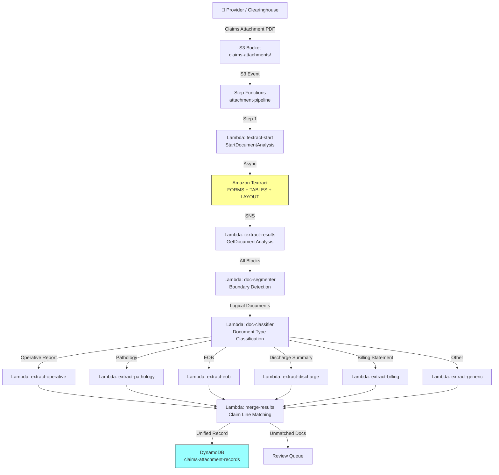

# Recipe 1.5 — Claims Attachment Processing 🔶

**Complexity:** Complex · **Phase:** Phase 2 · **Estimated Cost:** ~$0.10–0.25 per claims package

---

## Problem Statement

A claims attachment package arrives from a provider: 15–50 pages of supporting documentation for a submitted claim. The package might contain operative reports, pathology results, EOBs from other payers, discharge summaries, therapy notes, and itemized billing statements — all in a single PDF, with no table of contents and no consistent ordering.

The claims examiner needs to find the right documents, extract the relevant data, and match it against the claim. Today, that's a manual process: scroll through every page, mentally classify each document, hunt for the specific data points that support the claim line items. For complex claims (surgical, oncology, multi-visit), this takes 30–60 minutes per case.

Recipe 1.4 introduced page-level classification for prior auth submissions — a relatively constrained document set (cover sheet, clinical notes, labs, imaging). Claims attachments are harder: the document types are more varied, a single attachment package may contain multiple independent documents stapled together, and there's no cover sheet telling you what's included. This recipe extends the classification-and-routing pattern into a true multi-document pipeline with document boundary detection.

## Solution Overview

The key challenge is that a claims attachment PDF is really multiple logical documents concatenated into one physical file. Before we can extract anything useful, we need to detect where one document ends and the next begins — document boundary detection.

**Four-stage pipeline:**

1. **Extract** — Async Textract on the full PDF (FORMS + TABLES + LAYOUT), same as Recipe 1.4
2. **Segment** — Detect document boundaries within the PDF. A new document typically starts with a new header, a different facility name, a different date, or a distinct formatting change.
3. **Classify** — Classify each logical document (not just each page) by type: operative report, pathology, EOB, discharge summary, therapy notes, billing statement, etc.
4. **Extract & merge** — Route each classified document to its specialized extractor, then merge all results into a unified claims attachment record keyed to claim line items

The document segmentation step (Stage 2) is what distinguishes this recipe from Recipe 1.4's page classification. In a prior auth submission, each page is roughly one page type. In a claims attachment, a 4-page operative report is a single logical document that should be processed as a unit.

## Architecture Diagram



## Prerequisites

| Requirement | Details |
|-------------|---------|
| **AWS Services** | Everything from Recipe 1.4, plus AWS Step Functions (required — too many branching paths for a single Lambda) |
| **IAM Permissions** | All from Recipe 1.4. Step Functions execution role needs `lambda:InvokeFunction` for all extraction Lambdas. |
| **HIPAA Controls** | Same foundation as Recipe 1.1. Claims attachments contain surgical notes, pathology results, and billing data — among the most sensitive PHI categories. Ensure S3 Object Lock for claims record retention (typically 7–10 years per state regulations). |
| **Sample Data** | Synthetic multi-document PDFs. Combine an operative report template, a pathology report, an EOB, and a discharge summary into a single PDF. X12 835/837 sample transactions provide claim line items to match against. |
| **Cost Estimate** | Textract: ~$3/1,000 pages. Comprehend Medical: ~$0.01/unit on clinical pages. A 30-page attachment with 10 clinical pages: ~$0.09 Textract + ~$0.05 Comprehend Medical + ~$0.01 Lambda/Step Functions ≈ $0.15. |

## Ingredients

| AWS Service | Role |
|------------|------|
| **Amazon Textract** | Full document extraction across all pages |
| **Amazon Comprehend Medical** | Clinical NLP on operative reports, discharge summaries, pathology results |
| **AWS Step Functions** | Orchestrates the segment → classify → extract → merge pipeline |
| **AWS Lambda (×8+)** | Textract start/results, segmenter, classifier, 5+ type-specific extractors, merger |
| **Amazon DynamoDB** | Stores structured attachment records linked to claim IDs |
| **Amazon S3** | Incoming attachments, intermediate extraction artifacts, final records |
| **Amazon SQS** | Dead letter queue for failed extractions; review queue for unclassified documents |


## Code

> **Full source:** `github.com/aws-samples/healthcare-ai-cookbook/ch01/recipe-1.5/`

### Walkthrough

**Steps 1–2: Textract extraction.** Same async pattern as Recipes 1.2 and 1.4. No changes needed.

**Step 3 — Document boundary detection.** This is the novel component. We look for signals that indicate where one logical document ends and another begins within the continuous page stream.

```python
def detect_document_boundaries(pages: dict[int, list[dict]]) -> list[dict]:
    """
    Returns a list of logical documents, each with start_page, end_page, 
    and the signal that triggered the boundary.
    """
    documents = []
    current_doc_start = 1
    prev_header = None

    for page_num in sorted(pages.keys()):
        page_text = get_page_text(pages[page_num])
        header = extract_header_region(pages[page_num])  # top 15% of page
        
        is_boundary = False
        signal = None

        # Signal 1: New facility/organization header
        if header and prev_header and header_differs(header, prev_header):
            is_boundary = True
            signal = 'new_header'

        # Signal 2: Document title patterns ("OPERATIVE REPORT", "PATHOLOGY", "EOB")
        if has_document_title(page_text):
            is_boundary = True
            signal = 'document_title'

        # Signal 3: Page numbering restart ("Page 1 of X" after "Page 3 of 3")
        if has_page_restart(page_text):
            is_boundary = True
            signal = 'page_restart'

        # Signal 4: Date discontinuity (new document date vs. previous)
        page_date = extract_primary_date(page_text)
        prev_date = documents[-1].get('primary_date') if documents else None
        if page_date and prev_date and abs((page_date - prev_date).days) > 30:
            is_boundary = True
            signal = 'date_discontinuity'

        if is_boundary and page_num > current_doc_start:
            documents.append({
                'start_page': current_doc_start,
                'end_page': page_num - 1,
                'primary_date': prev_date
            })
            current_doc_start = page_num

        prev_header = header

    # Close the last document
    documents.append({
        'start_page': current_doc_start,
        'end_page': max(pages.keys())
    })

    return documents

DOCUMENT_TITLES = [
    r'operative\s+report', r'op\s+note', r'surgical\s+report',
    r'pathology\s+report', r'cytology', r'histology',
    r'explanation\s+of\s+benefits', r'eob',
    r'discharge\s+summary', r'discharge\s+instructions',
    r'progress\s+note', r'office\s+visit',
    r'radiology\s+report', r'imaging',
    r'therapy\s+note', r'physical\s+therapy',
    r'itemized\s+statement', r'billing\s+statement',
]

def has_document_title(text: str) -> bool:
    first_lines = '\n'.join(text.split('\n')[:5]).lower()
    return any(re.search(pattern, first_lines) for pattern in DOCUMENT_TITLES)
```

**Step 4 — Classify logical documents.** Now that we have document boundaries, we classify each logical document as a unit. This is more accurate than per-page classification because we have the full document context.

```python
DOC_TYPE_SIGNATURES = {
    'operative_report': {
        'keywords': ['preoperative diagnosis', 'postoperative diagnosis', 'procedure performed',
                     'anesthesia', 'findings', 'estimated blood loss', 'specimens',
                     'operative technique', 'surgeon'],
        'min_matches': 3
    },
    'pathology_report': {
        'keywords': ['specimen', 'gross description', 'microscopic', 'diagnosis',
                     'pathologist', 'accession', 'histologic', 'margins'],
        'min_matches': 3
    },
    'eob': {
        'keywords': ['explanation of benefits', 'allowed amount', 'patient responsibility',
                     'deductible', 'coinsurance', 'claim number', 'paid amount',
                     'service date', 'billed amount'],
        'min_matches': 3
    },
    'discharge_summary': {
        'keywords': ['discharge diagnosis', 'hospital course', 'discharge medications',
                     'follow-up', 'discharge condition', 'admitting diagnosis',
                     'length of stay', 'discharge instructions'],
        'min_matches': 3
    },
    'billing_statement': {
        'keywords': ['charges', 'total', 'balance due', 'account number',
                     'payment', 'invoice', 'amount due', 'itemized'],
        'min_matches': 3
    },
}

def classify_document(doc_pages: dict[int, list[dict]]) -> str:
    full_text = '\n'.join(get_page_text(blocks) for blocks in doc_pages.values()).lower()
    
    scores = {}
    for doc_type, sig in DOC_TYPE_SIGNATURES.items():
        hits = sum(1 for kw in sig['keywords'] if kw in full_text)
        if hits >= sig['min_matches']:
            scores[doc_type] = hits
    
    return max(scores, key=scores.get) if scores else 'unclassified'
```

**Step 5 — Type-specific extraction.** Each document type has its own extractor. Here's the operative report extractor as an example — it combines Textract forms extraction with Comprehend Medical entity extraction.

```python
def extract_operative_report(doc_text: str, doc_blocks: list[dict]) -> dict:
    # Comprehend Medical for clinical entities
    entities = comprehend_medical.detect_entities_v2(Text=doc_text[:20000])  # 20K char limit
    icd10 = comprehend_medical.infer_icd10_cm(Text=doc_text[:20000])
    
    # Section extraction via text patterns
    sections = extract_sections(doc_text, [
        'preoperative diagnosis', 'postoperative diagnosis',
        'procedure performed', 'indications', 'findings',
        'operative technique', 'complications', 'specimens'
    ])
    
    return {
        'type': 'operative_report',
        'preop_diagnosis': sections.get('preoperative diagnosis', ''),
        'postop_diagnosis': sections.get('postoperative diagnosis', ''),
        'procedure': sections.get('procedure performed', ''),
        'findings': sections.get('findings', ''),
        'complications': sections.get('complications', 'None noted'),
        'icd10_codes': [
            {'code': c['Code'], 'desc': c['Description'], 'confidence': c['Score']}
            for e in icd10['Entities']
            for c in e.get('ICD10CMConcepts', [])
            if c['Score'] >= 0.70
        ],
        'clinical_entities': {
            'conditions': [e['Text'] for e in entities['Entities'] if e['Category'] == 'MEDICAL_CONDITION'],
            'procedures': [e['Text'] for e in entities['Entities'] if e['Category'] == 'TEST_TREATMENT_PROCEDURE'],
            'anatomy': [e['Text'] for e in entities['Entities'] if e['Category'] == 'ANATOMY'],
        }
    }

def extract_eob(doc_blocks: list[dict]) -> dict:
    """EOBs are table-heavy — reuse Recipe 1.2's table parsing."""
    all_blocks = [b for blocks in doc_blocks.values() for b in blocks]
    tables = parse_tables(all_blocks)  # from Recipe 1.2
    kv = parse_key_value_pairs(all_blocks)
    
    line_items = []
    for table in tables:
        if len(table) >= 2:
            headers = [h.lower().strip() for h in table[0]]
            for row in table[1:]:
                item = {headers[i]: row[i] for i in range(min(len(headers), len(row)))}
                line_items.append(item)
    
    return {
        'type': 'eob',
        'claim_number': kv.get('claim number', {}).get('value'),
        'payer': kv.get('plan name', {}).get('value') or kv.get('insurance company', {}).get('value'),
        'patient_responsibility': kv.get('patient responsibility', {}).get('value'),
        'line_items': line_items
    }
```

**Step 6 — Merge results and match to claim lines.** The final step links extracted documents back to the original claim's line items.

```python
def merge_and_match(claim_id: str, document_extractions: list[dict]) -> dict:
    record = {
        'claim_id': claim_id,
        'documents_found': len(document_extractions),
        'document_summary': [],
        'all_icd10_codes': [],
        'all_cpt_codes': [],
        'eob_data': [],
        'unclassified_pages': [],
    }
    
    for doc in document_extractions:
        record['document_summary'].append({
            'type': doc['type'],
            'pages': f"{doc['start_page']}-{doc['end_page']}",
        })
        
        if doc['type'] == 'operative_report':
            record['all_icd10_codes'].extend(doc.get('icd10_codes', []))
        elif doc['type'] == 'eob':
            record['eob_data'].append(doc)
        elif doc['type'] == 'unclassified':
            record['unclassified_pages'].append({
                'pages': f"{doc['start_page']}-{doc['end_page']}",
                'preview': doc.get('text_preview', '')[:200]
            })
    
    # Deduplicate codes
    seen = set()
    record['all_icd10_codes'] = [
        c for c in record['all_icd10_codes']
        if c['code'] not in seen and not seen.add(c['code'])
    ]
    
    return record
```


## Expected Results

**Sample output for a 28-page claims attachment (outpatient knee surgery):**

```json
{
  "claim_id": "CLM-2026-0847291",
  "documents_found": 5,
  "document_summary": [
    {"type": "operative_report", "pages": "1-4"},
    {"type": "pathology_report", "pages": "5-6"},
    {"type": "discharge_summary", "pages": "7-10"},
    {"type": "eob", "pages": "11-14"},
    {"type": "billing_statement", "pages": "15-18"}
  ],
  "all_icd10_codes": [
    {"code": "M17.11", "desc": "Primary osteoarthritis, right knee", "confidence": 0.96},
    {"code": "Z96.651", "desc": "Presence of right artificial knee joint", "confidence": 0.91}
  ],
  "eob_data": [
    {
      "type": "eob",
      "claim_number": "EOB-8472910",
      "payer": "Anthem BCBS",
      "patient_responsibility": "$2,450.00",
      "line_items": [
        {"service_date": "03/15/2026", "cpt": "27447", "billed": "$45,000.00", "allowed": "$28,500.00", "paid": "$26,050.00"}
      ]
    }
  ],
  "unclassified_pages": [
    {"pages": "19-20", "preview": "Patient consent for surgical procedure..."}
  ]
}
```

**Performance benchmarks:**

| Metric | Typical Value |
|--------|---------------|
| End-to-end latency (30-page package) | 45–90 seconds |
| Document boundary detection accuracy | 80–90% (improves with tuning per payer) |
| Document classification accuracy | 85–93% |
| Cost per 30-page package | ~$0.15–0.20 |
| Cost at 500K claims/year | ~$75K–100K |

**Where it struggles:** Documents without clear headers or title lines — especially when a provider just prints a continuous EHR record dump. Boundary detection is the weakest link; when it fails, two logical documents get treated as one, and classification accuracy drops. Also: faxed PDFs where pages are rotated, upside-down, or interspersed with cover pages from intermediate fax servers.

## Variations & Extensions

1. **ML-based document classification.** Replace keyword heuristics with a fine-tuned text classifier (Amazon Comprehend custom classification or a SageMaker-hosted model). Train on labeled claims attachments — even 500 labeled examples dramatically improves classification accuracy over heuristics. The keyword approach in this recipe is a solid starting point that gets you into production; ML is the scale-up path.

2. **Claim line item auto-matching.** Cross-reference extracted CPT codes and dates of service from operative reports and EOBs against the original 837 claim transaction's line items. Automatically flag line items that are supported by documentation vs. those missing supporting documents. This accelerates the examiner's review by highlighting exactly which line items need attention.

3. **Duplicate document detection.** Claims attachment packages frequently include duplicate documents — the same operative report faxed twice, an EOB that was already on file. Hash document content and compare against previously processed attachments to skip duplicates and reduce extraction costs.

## Related Recipes

- **← Recipe 1.4 (Prior Auth Document Processing):** Established the page classification pattern; this recipe extends it with document boundary detection and a wider document type taxonomy
- **→ Recipe 1.6 (Handwritten Clinical Note Digitization):** Handles the handwritten pages that may appear within claims attachments — therapy notes, physician addenda
- **→ Recipe 2.4 (Clinical Criteria Matching via NLP):** Uses extracted clinical entities from operative reports and discharge summaries for criteria matching
- **→ Recipe 3.1 (Prior Auth Decision Orchestration):** The workflow patterns (Step Functions orchestration, parallel extraction, merge) are shared between prior auth and claims attachment processing

## Additional Resources

- [AWS Step Functions Parallel State](https://docs.aws.amazon.com/step-functions/latest/dg/amazon-states-language-parallel-state.html)
- [X12 837 Claim Transaction Overview](https://x12.org/products/transaction-sets)
- [CMS Claims Processing Manual](https://www.cms.gov/regulations-and-guidance/guidance/manuals/internet-only-manuals-ioms-items/cms018912)
- [Amazon Comprehend Custom Classification](https://docs.aws.amazon.com/comprehend/latest/dg/how-document-classification.html)
- [HIPAA Minimum Necessary Standard](https://www.hhs.gov/hipaa/for-professionals/privacy/guidance/minimum-necessary-requirement/index.html) — relevant when extracting only needed data from multi-document packages

## Estimated Implementation Time

| Scope | Time |
|-------|------|
| **Basic** (Textract + boundary detection + keyword classification + 2-3 extractors) | 1 week |
| **Production-ready** (Step Functions, all extractors, claim line matching, error handling, monitoring) | 3–4 weeks |
| **With variations** (ML classifier, auto-matching, duplicate detection) | 6–8 weeks |

## Tags

`document-intelligence` · `ocr` · `nlp` · `textract` · `comprehend-medical` · `claims-attachment` · `document-classification` · `document-segmentation` · `step-functions` · `multi-document` · `complex` · `phase-2` · `hipaa`

---

*← [Recipe 1.4 — Prior Auth Document Processing](recipe-1.4-prior-auth-document-processing.md) · [Next: Recipe 1.6 — Handwritten Clinical Note Digitization →](recipe-1.6-handwritten-clinical-note-digitization.md)*
