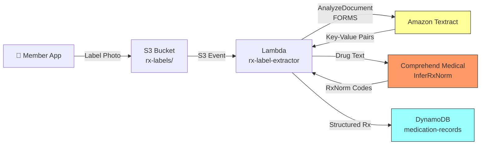

# Recipe 1.7 — Prescription Label OCR 🔶

**Complexity:** Simple · **Phase:** Phase 2 · **Estimated Cost:** ~$0.003 per label

---

## Problem Statement

Medication reconciliation is a cornerstone of care transitions. When a member calls about a medication question, submits a prior auth for a refill, or transitions between care settings, the payer needs to know exactly what they're taking. But members don't speak in NDC codes — they have a pill bottle in their hand.

Prescription labels are deceptively tricky to extract. They're small, densely packed, and use abbreviations that only make sense in a pharmacy context: "QD" (once daily), "BID" (twice daily), "PRN" (as needed), "SIG" (directions). The label wraps around a cylinder, so photos taken by members are often curved, partially obscured, or poorly lit. And the critical data — drug name, dosage, frequency, prescriber, pharmacy, refills remaining — needs to be mapped to standard terminologies (RxNorm, NDC) for downstream systems.

This recipe is structurally similar to the insurance card scanning in Recipe 1.1 — single image in, structured data out — but adds pharmacy-specific field normalization and RxNorm mapping via Comprehend Medical.

## Solution Overview

The pipeline mirrors Recipe 1.1's synchronous Textract pattern with two additions:

1. **Pharmacy-specific field normalization** — Prescription labels use a constrained but inconsistent vocabulary. We map common label patterns to canonical fields.
2. **RxNorm mapping via Comprehend Medical** — `InferRxNorm` links extracted drug names and dosages to standard RxNorm concept IDs, enabling interoperability with pharmacy benefit systems.

**Pipeline:**

1. Member uploads a photo of their prescription label (mobile app or portal)
2. Lambda calls Textract `AnalyzeDocument` (FORMS) — synchronous, single image
3. Parse key-value pairs and normalize pharmacy-specific fields
4. Feed drug name + dosage through Comprehend Medical `InferRxNorm`
5. Parse SIG codes into human-readable directions
6. Return structured medication record

## Architecture Diagram



## Prerequisites

| Requirement | Details |
|-------------|---------|
| **AWS Services** | Amazon Textract, Amazon Comprehend Medical, S3, Lambda, DynamoDB |
| **IAM Permissions** | Same as Recipe 1.1, plus: `comprehend-medical:InferRxNorm` |
| **HIPAA Controls** | Same as Recipe 1.1. Prescription labels contain PHI (patient name, medication, prescriber). |
| **Sample Data** | Synthetic prescription labels. Pharmacy label generators exist online; create samples with varied layouts (CVS, Walgreens, independent pharmacies). |
| **Cost Estimate** | Textract FORMS: ~$0.0015/image. Comprehend Medical InferRxNorm: ~$0.01/unit. Total: ~$0.003/label. |

## Ingredients

| AWS Service | Role |
|------------|------|
| **Amazon Textract** | Extracts text and key-value pairs from label image |
| **Amazon Comprehend Medical** | Maps drug names to RxNorm concept IDs via `InferRxNorm` |
| **Amazon S3** | Stores uploaded label images |
| **AWS Lambda** | Orchestrates extraction, normalization, and RxNorm mapping |
| **Amazon DynamoDB** | Stores structured medication records |

## Code

> **Full source:** `github.com/aws-samples/healthcare-ai-cookbook/ch01/recipe-1.7/`

### Walkthrough

**Step 1 — Textract extraction.** Same synchronous `AnalyzeDocument` call as Recipe 1.1.

```python
response = textract.analyze_document(
    Document={'S3Object': {'Bucket': bucket, 'Name': key}},
    FeatureTypes=['FORMS']
)
```

**Step 2 — Pharmacy-specific field normalization.** Prescription labels use different field names across pharmacy chains.

```python
RX_FIELD_MAP = {
    'drug_name': ['medication', 'drug', 'drug name', 'medication name', 'rx'],
    'dosage': ['strength', 'dose', 'dosage', 'mg', 'mcg'],
    'quantity': ['qty', 'quantity', 'qty dispensed', '#'],
    'directions': ['sig', 'directions', 'instructions', 'take', 'use'],
    'prescriber': ['prescriber', 'doctor', 'physician', 'prescribed by', 'dr'],
    'pharmacy': ['pharmacy', 'store', 'location'],
    'rx_number': ['rx #', 'rx number', 'prescription #', 'rx no'],
    'refills': ['refills', 'refills remaining', 'refills left'],
    'date_filled': ['date filled', 'fill date', 'dispensed', 'date'],
    'ndc': ['ndc', 'ndc #', 'national drug code'],
}

def normalize_rx_fields(raw_kv: dict) -> dict:
    return normalize_fields_with_map(raw_kv, RX_FIELD_MAP)  # reuse from Recipe 1.1
```

**Step 3 — SIG code parsing.** Prescription directions use Latin abbreviations that need to be decoded for downstream systems.

```python
SIG_CODES = {
    'po': 'by mouth', 'bid': 'twice daily', 'tid': 'three times daily',
    'qid': 'four times daily', 'qd': 'once daily', 'qhs': 'at bedtime',
    'prn': 'as needed', 'ac': 'before meals', 'pc': 'after meals',
    'q4h': 'every 4 hours', 'q6h': 'every 6 hours', 'q8h': 'every 8 hours',
    'q12h': 'every 12 hours', 'stat': 'immediately', 'ud': 'as directed',
    'tab': 'tablet', 'cap': 'capsule', 'ml': 'milliliter',
    'gtt': 'drop', 'supp': 'suppository', 'inj': 'injection',
}

def parse_sig(sig_text: str) -> str:
    words = sig_text.lower().split()
    decoded = [SIG_CODES.get(w, w) for w in words]
    return ' '.join(decoded)
```

**Step 4 — RxNorm mapping.** Link the extracted drug name and dosage to a standardized RxNorm concept.

```python
comprehend_medical = boto3.client('comprehendmedical')

def map_to_rxnorm(drug_text: str) -> list[dict]:
    response = comprehend_medical.infer_rx_norm(Text=drug_text)
    
    mappings = []
    for entity in response['Entities']:
        for concept in entity.get('RxNormConcepts', []):
            if concept['Score'] >= 0.70:
                mappings.append({
                    'text': entity['Text'],
                    'rxnorm_id': concept['Code'],
                    'description': concept['Description'],
                    'confidence': round(concept['Score'], 3)
                })
    return mappings
```

## Expected Results

**Sample output:**

```json
{
  "image_key": "rx-labels/2026/03/01/label-00182.jpg",
  "drug_name": "Lisinopril",
  "dosage": "10mg",
  "quantity": "30",
  "directions_raw": "Take 1 tab PO QD",
  "directions_decoded": "Take 1 tablet by mouth once daily",
  "prescriber": "Dr. Sarah Chen",
  "pharmacy": "CVS Pharmacy #4821",
  "rx_number": "7284910",
  "refills": "3",
  "date_filled": "02/28/2026",
  "rxnorm": [
    {"rxnorm_id": "314076", "description": "lisinopril 10 MG Oral Tablet", "confidence": 0.97}
  ]
}
```

**Performance benchmarks:**

| Metric | Typical Value |
|--------|---------------|
| End-to-end latency | 2–4 seconds |
| Drug name extraction accuracy | 92–98% (printed labels) |
| RxNorm mapping accuracy | 90–96% |
| Cost per label | ~$0.003 |

**Where it struggles:** Curved label photos (text warps), partially peeled labels, labels with both brand and generic names in different font sizes. Labels from compounding pharmacies with non-standard formats.

## Variations & Extensions

1. **Drug interaction checking.** After mapping to RxNorm, cross-reference against the member's full medication list to flag potential drug-drug interactions using the NLM Drug Interaction API or a commercial clinical decision support service.

2. **Formulary matching.** Compare the extracted medication against the member's plan formulary. Surface tier, copay, and preferred alternatives — useful for member-facing apps that help members understand their costs.

3. **Multi-label medication reconciliation.** Accept multiple label photos in sequence, build a complete medication list, deduplicate (same drug from different fill dates), and output a reconciled FHIR MedicationStatement bundle.

## Related Recipes

- **← Recipe 1.1 (Insurance Card Scanning):** Same synchronous single-image pattern
- **← Recipe 1.3 (Lab Requisition Form Extraction):** Same Comprehend Medical NLP layer, different ontology (RxNorm vs. ICD-10)
- **→ Recipe 2.1 (Clinical Entity Extraction):** Deeper medication entity extraction from unstructured clinical text
- **→ Recipe 4.1 (Medication Adherence Prediction):** Consumes structured medication data to predict fill gaps

## Additional Resources

- [Amazon Comprehend Medical — InferRxNorm](https://docs.aws.amazon.com/comprehend-medical/latest/dev/ontology-rxnorm.html)
- [NLM RxNorm Technical Documentation](https://www.nlm.nih.gov/research/umls/rxnorm/docs/techdoc.html)
- [FDA NDC Directory](https://www.accessdata.fda.gov/scripts/cder/ndc/)

## Estimated Implementation Time

| Scope | Time |
|-------|------|
| **Basic** (Textract + field normalization + RxNorm mapping) | 3–5 hours |
| **Production-ready** (SIG parsing, confidence gating, monitoring) | 1–2 days |
| **With variations** (drug interactions, formulary matching, multi-label) | 1 week |

## Tags

`document-intelligence` · `ocr` · `textract` · `comprehend-medical` · `rxnorm` · `prescription` · `medication` · `pharmacy` · `simple` · `phase-2` · `hipaa`

---

*← [Recipe 1.6 — Handwritten Clinical Note Digitization](recipe-1.6-handwritten-clinical-note-digitization.md) · [Next: Recipe 1.8 — EOB Processing →](recipe-1.8-eob-processing.md)*
