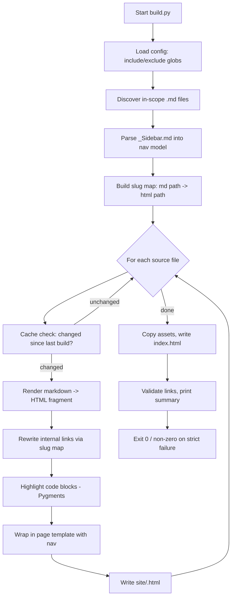

# HCLS AI/ML Cookbook — HTML Build Pipeline

**Status:** Draft for review
**Author:** (generated)
**Purpose:** Convert the cookbook's Markdown sources into a self-contained, browsable static HTML site for easy reading and review. Re-runnable on demand: all authoring happens in `.md` files; the HTML is a disposable, regenerated artifact.

---

## 1. Background

The cookbook is 318 chapter Markdown files plus a handful of top-level docs (`Home.md`, `README.md`, `SUMMARY.md`, `STYLE-GUIDE.md`, `RECIPE-GUIDE.md`) and a `_Sidebar.md` navigation file. Content spans 15 chapters, each with a preface and ~10 recipes; every recipe has a companion `python-example` file. There are ~151 files containing Mermaid diagrams and ~34 internal `.md` cross-links.

Reviewers currently have to read raw Markdown or navigate the wiki. We want a local, shareable HTML rendering that looks clean, preserves the existing navigation, renders Mermaid diagrams and syntax-highlighted code, and can be regenerated in seconds after edits.

### Goals

1. One command regenerates the entire site from the current `.md` files.
2. Output is a self-contained `site/` directory of static HTML that opens directly in a browser (no server required, though a server is supported).
3. Faithful rendering: headings, tables, fenced code with syntax highlighting, Mermaid diagrams, and internal cross-links that resolve to the generated HTML pages.
4. Navigation sidebar on every page, derived from the existing `_Sidebar.md`.
5. Idempotent and safe to run repeatedly; incremental by default, full rebuild on demand.
6. Fast: a full build of ~320 pages should complete in a few seconds to low tens of seconds.

### Non-goals

- No editing of source `.md` content by the build (read-only inputs). Style fixing stays in the existing `fix_style.py` / authoring loop.
- No PDF or EPUB output in v1 (an `.epub` already exists via another path; can be added later).
- No search backend, comments, or auth. This is a static review artifact.
- No live-reload dev server in v1 (optional stretch goal).

---

## 2. Requirements

### Functional

| ID | Requirement |
| --- | --- |
| F1 | A single entry point (`build.py` / `make html`) converts every in-scope `.md` file to a corresponding `.html` file under `site/`. |
| F2 | Markdown features supported: ATX headings, tables (GFM), fenced code blocks with language tags, ordered/unordered/nested lists, blockquotes, inline code, bold/italic, links, images. |
| F3 | Fenced code blocks are syntax-highlighted (Python, JSON, bash, YAML, text, pseudocode). Unknown/`pseudocode` languages render as plain monospace without error. |
| F4 | ```` ```mermaid ```` blocks render as diagrams in the browser. |
| F5 | Internal links to `*.md` (and wiki-style extensionless links used by `_Sidebar.md`, e.g. `(chapter01-preface)`) are rewritten to the generated `.html` targets. External `http(s)` links are left untouched. |
| F6 | Every generated page includes the shared navigation sidebar (from `_Sidebar.md`) and a consistent header/footer via a single template. |
| F7 | A landing page (`index.html`) is generated from `Home.md` (fallback `README.md`). |
| F8 | The build is re-runnable. By default it is incremental: only files whose source mtime/hash changed since the last build are re-rendered. A `--clean` flag forces a full rebuild. |
| F9 | The build emits a summary: counts of pages rendered, skipped (unchanged), and any warnings (broken links, missing nav targets). |
| F10 | The build is deterministic: same inputs produce byte-identical outputs (stable ordering, no timestamps embedded in pages). |

### Non-functional

| ID | Requirement |
| --- | --- |
| N1 | Cross-platform (Linux/macOS/Windows). Pure Python, invoked via `python3`. No reliance on a `python` alias. |
| N2 | Dependencies pinned and installed in an isolated environment (`uv`/venv), not system-wide. |
| N3 | Full clean build of ~320 pages completes in < 30s on a typical laptop. |
| N4 | Output is self-contained: CSS, JS (Mermaid, highlight) vendored locally so the site works offline. |
| N5 | The build never mutates source `.md` files or any directory other than `site/` and a `.build-cache/`. |
| N6 | A non-zero exit code on hard failure (template missing, source dir missing); warnings (broken links) do not fail the build unless `--strict` is passed. |

### Edge cases the design must handle (observed in the corpus)

- **EC1 — Duplicate/stale files.** Earlier spec renames left orphaned sibling files (e.g. both `chapter08.03-icd-10-code-suggestion.md` and `chapter08.03-icd10-code-suggestion.md`). These have since been removed from the repo, so the corpus is currently clean. The build should still defend against recurrence: if two source files map to the same chapter `NN.RR` slug, emit a warning and pick the spec-referenced (canonical) name deterministically rather than shipping both.
- **EC2 — Unicode / encoding in nav labels, headings, and diagrams.** The corpus is heavily Unicode and the build must round-trip it losslessly, or every affected glyph becomes mojibake (`â€"`). Confirmed in the corpus:
  - `_Sidebar.md` uses an em dash (`—`, U+2014) in **every** nav label (150 occurrences, e.g. `1.1 — Insurance Card Scanning`), and top-level docs (`Home.md`, `README.md`, `SUMMARY.md`, `STYLE-GUIDE.md`) contain more.
  - Recipe metadata lines use middle dots (`·`, U+00B7) and arrows (`→`, U+2192), e.g. `Complexity: Complex · Phase: Research`.
  - Architecture diagrams inside fenced code blocks use box-drawing characters (`─ │ └ ┐ ┌ ┘ ┬`, ~46k occurrences) and arrows. These are **legitimate content inside code fences** and must be preserved verbatim, not "cleaned."

  These are all valid display content for HTML; the only real risk is an encoding mismatch. The fix is a single, enforced UTF-8 contract across the three I/O touchpoints (any one weak link corrupts output):
  1. **All source reads** (`render.py`, `nav.py`, link discovery) go through a shared `read_text_utf8(path)` helper that passes `encoding="utf-8"`. This is mandatory for cross-platform correctness (N1): Python's default text encoding is locale-dependent (cp1252 on Windows) and would corrupt every em dash.
  2. **All output writes** (`build.py`) go through a shared `write_text_utf8(path, html)` helper with `encoding="utf-8"` (and `newline="\n"` for determinism, F10).
  3. **The page template** declares `<meta charset="utf-8">` in `<head>` so browsers decode the bytes correctly.

  Out of scope: a handful of chapter *bodies* still contain em dashes that violate the book's "no em dashes" content rule. That is a content-authoring concern (owned by `fix_style.py` / the writing loop), not a conversion concern. The HTML build renders them faithfully and does not attempt to fix them.
- **EC3 — `pseudocode` and bare code fences:** custom/unknown languages must degrade gracefully, not crash the highlighter.
- **EC4 — Non-chapter directories** (`specs/`, `logs/`, `reviews/`, `personas/`, `planning/`, `reference/`, `__pycache__/`) must be excluded from the reader-facing site by default.
- **EC5 — Mixed link forms:** extensionless wiki links (`(chapter01-preface)`), `.md` links, and anchored links (`file.md#section`) all need correct rewriting.

---

## 3. Design

### 3.1 Toolchain decision

Two viable approaches:

- **A. Pandoc** — robust, but not installed here, and adds a heavyweight system dependency. Mermaid needs a filter. Rejected for v1 to keep setup friction low.
- **B. Python (`markdown-it-py` + Pygments + a tiny templating layer)** — `markdown-it-py` is already available; pure-Python, pip-installable, cross-platform, CommonMark + GFM plugins, easy to hook Mermaid and link rewriting. **Chosen.**

Mermaid renders client-side: the build emits ```` ```mermaid ```` content into `<pre class="mermaid">` and includes the vendored `mermaid.min.js`, which renders on page load. This avoids a headless-browser dependency at build time.

Syntax highlighting is build-time via Pygments (server-side, no JS needed), with a vendored Pygments CSS theme.

### 3.2 Proposed layout

```
<project-root>/
├── tools/
│   └── htmlbuild/
│       ├── build.py            # entry point / CLI
│       ├── render.py           # md -> html (markdown-it config, code highlight)
│       ├── nav.py              # parse _Sidebar.md -> nav model
│       ├── links.py            # rewrite .md / wiki links -> .html
│       ├── cache.py            # incremental build cache (hash/mtime)
│       ├── io_utf8.py          # shared UTF-8 read/write helpers (EC2 contract)
│       ├── config.py           # include/exclude globs, paths, options
│       ├── templates/
│       │   └── page.html.j2    # single page template (header, nav, content, footer)
│       └── assets/
│           ├── style.css       # site styling (can adapt existing custom.css)
│           ├── pygments.css    # code theme
│           └── vendor/
│               └── mermaid.min.js
├── pyproject.toml              # adds htmlbuild deps (or a separate one under tools/)
├── Makefile                    # `make html`, `make html-clean`, `make serve`
└── site/                       # GENERATED output (gitignored)
    ├── index.html
    ├── assets/...
    └── chapterNN.RR-*.html
```

### 3.3 Build flow



### 3.4 Key components

**`io_utf8.py`** — shared, mandatory I/O helpers `read_text_utf8(path)` and `write_text_utf8(path, text)` that force `encoding="utf-8"` (and `newline="\n"` on write for determinism). Every module below uses these for file I/O; no module calls bare `open()` / `Path.read_text()` / `Path.write_text()`. This is the single enforcement point for the EC2 UTF-8 contract and the cross-platform requirement (N1), so an encoding mismatch cannot creep in per-call.

**`config.py`** — declares the source root, output dir (`site/`), cache dir (`.build-cache/`), and include/exclude globs. Default include: top-level `*.md`. Default exclude: `specs/`, `logs/`, `reviews/`, `personas/`, `planning/`, `reference/`, `__pycache__/`, `docs/`. Resolves EC1 (duplicate slugs) via a "canonical name wins" rule, surfaced as a warning.

**`nav.py`** — reads `_Sidebar.md` via `read_text_utf8` and parses it into a tree (chapters → recipes → python examples). Renders to an HTML `<nav>` partial reused on every page. The current page is marked active. Em dashes and other Unicode in nav labels (EC2) flow through unchanged as decoded `str`. If `_Sidebar.md` references a target that has no corresponding source file, that's a warning (also catches EC1 renames).

**`render.py`** — reads sources via `read_text_utf8`; configures `markdown-it-py` (CommonMark + tables + anchors + attrs). Registers a fence renderer: `mermaid` → `<pre class="mermaid">`; everything else → Pygments. Box-drawing/diagram characters inside code fences (EC2) are preserved verbatim. Adds heading anchors so cross-links with `#section` resolve.

**`links.py`** — builds a map from every source basename (with and without `.md`) to its output `.html`. Rewrites `href`s that point to known internal targets; leaves external and unknown links alone (unknown internal links logged as warnings). Handles EC5 (extensionless, `.md`, and anchored forms).

**`cache.py`** — stores a JSON manifest of `{source_path: sha256}` from the last build under `.build-cache/`. On each run, a file is re-rendered only if its hash changed, or if the template/assets/nav changed (a global "epoch" hash invalidates everything, since nav and template affect every page). `--clean` deletes the cache and `site/`.

**`build.py`** — orchestration; writes every output page via `write_text_utf8`. Copies assets, generates `index.html`, prints the summary.

**`templates/page.html.j2`** — one Jinja2 template: `<head>` declaring `<meta charset="utf-8">` (EC2) plus vendored CSS + Mermaid JS, a two-column layout (sticky sidebar nav + content), breadcrumb/title header, and footer.

### 3.5 CLI

```
python3 tools/htmlbuild/build.py [options]

  --clean          Full rebuild (clear cache + site/)
  --strict         Treat warnings (broken links, nav misses) as errors
  --out DIR        Output dir (default: site/)
  --serve [PORT]   After building, serve site/ via http.server (stretch goal)
  --jobs N         Parallel rendering workers (default: CPU count)
```

`make html` wraps the common case; `make html-clean` adds `--clean`; `make serve` builds then serves.

### 3.6 Dependencies (pinned)

- `markdown-it-py` (already present) + `mdit-py-plugins` (tables, anchors, deflist)
- `Pygments` (code highlighting)
- `Jinja2` (templating)
- Vendored `mermaid.min.js` (committed under assets, offline-capable)

Installed via `uv` into the project's existing `.venv` or a dedicated tools environment.

---

## 4. Re-runnability & safety

- **Inputs are read-only.** The build only ever writes to `site/` and `.build-cache/`. A guard refuses to write if `--out` resolves to the project root or a source directory.
- **Incremental by default** (F8/N3): unchanged pages are skipped via content hashing; editing one recipe re-renders one page (plus a fast nav/template-epoch check).
- **Deterministic** (F10): files processed in sorted order, no embedded build timestamps, stable Pygments/markdown output, so re-running with no edits produces an identical `site/` and a clean `git diff` (if `site/` were tracked — it won't be).
- **`site/` and `.build-cache/` are gitignored.**

---

## 5. Open questions for review

1. **Scope of pages:** include only the 15 chapters + top-level docs, or also render `reference/` and `categories/` content for reviewers?
2. **Stale duplicates (EC1):** delete the leftover `icd10` / `multi-modal-imaging-fusion` / `or-block-scheduling` files from the repo now, or just exclude them in the build config and flag them?
3. **Python companion pages:** inline them within each recipe page (tabbed/collapsible) or keep them as separate pages linked from the recipe (current wiki behavior)? Current sidebar treats them as separate.
4. **Styling:** adapt the existing `custom.css`, or start from a fresh minimal reading theme?
5. **Server mode:** is the optional `--serve` / live-reload worth including in v1, or defer?
6. **Location:** put the tooling under `tools/htmlbuild/` (proposed) or a separate sibling repo so it never mixes with book content?

---

## 6. Implementation plan (once design is approved)

1. Scaffold `tools/htmlbuild/` + deps in `pyproject.toml`; vendor Mermaid + Pygments CSS.
2. `io_utf8.py`: `read_text_utf8` / `write_text_utf8` helpers + a unit test asserting an em dash and a box-drawing char round-trip byte-for-byte.
3. `render.py`: markdown-it config + fence handling (Mermaid + Pygments) + unit tests on representative recipes (one with Mermaid, one with tables, one with `pseudocode`).
4. `nav.py`: parse `_Sidebar.md` (em-dash labels intact); test against the real file; report nav targets with no source (catches EC1).
5. `links.py`: slug map + rewrite; test all link forms (EC5).
6. `build.py`: orchestration, asset copy, `index.html`, summary output.
7. `cache.py`: incremental hashing + `--clean`; verify re-run with no edits skips all pages.
8. `Makefile` targets + a short `docs/html-build-usage.md`.
9. Full build over the real corpus; review output, grep generated HTML for mojibake (`â€"`, `Ã`) to confirm the UTF-8 contract holds end-to-end, and fix link/diagram warnings; iterate.
